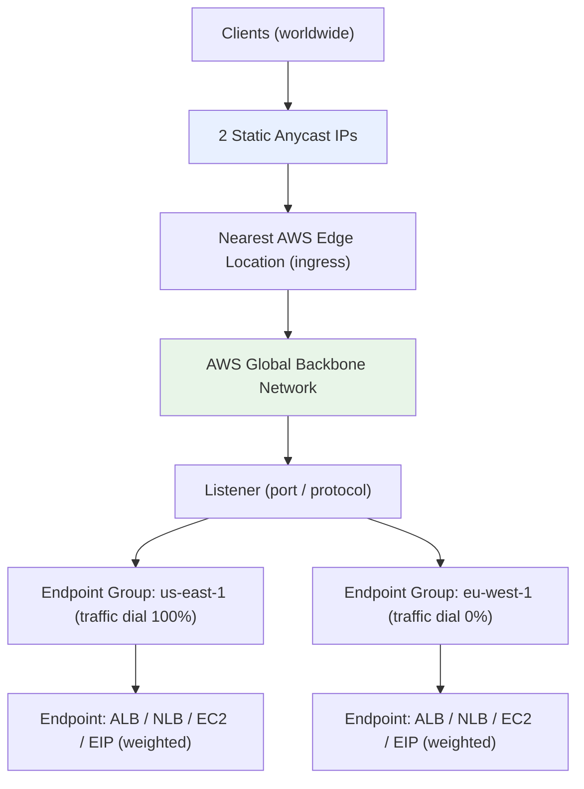
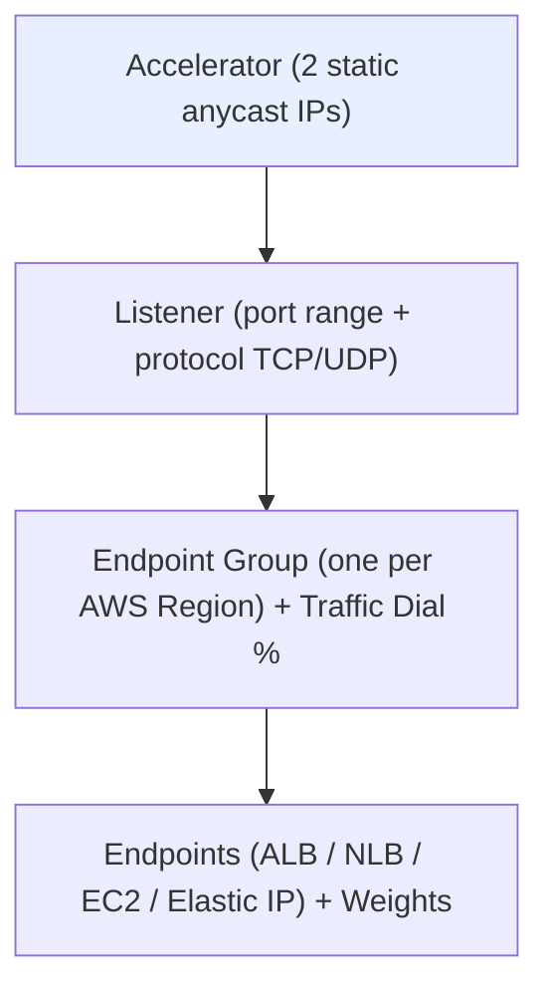

# AWS Global Accelerator Fundamentals & Architecture - SAA-C03 Deep Dive

> Global Accelerator gives you **2 static anycast IPs** that route traffic over the **AWS global backbone** to the optimal healthy regional endpoint, improving performance and enabling fast cross-region failover for TCP/UDP workloads.

See also: [02 - Global Accelerator vs CloudFront & Use Cases](02%20-%20Global%20Accelerator%20vs%20CloudFront%20%26%20Use%20Cases.md) · [03 - Global Accelerator Exam Scenarios & Facts](03%20-%20Global%20Accelerator%20Exam%20Scenarios%20%26%20Facts.md)

---

## Table of Contents

- [What Is AWS Global Accelerator?](#what-is-aws-global-accelerator)
- [The Two Static Anycast IPs](#the-two-static-anycast-ips)
- [The AWS Global Network & Edge Ingress](#the-aws-global-network--edge-ingress)
- [Core Components Breakdown](#core-components-breakdown)
- [Listeners](#listeners)
- [Endpoint Groups & the Traffic Dial](#endpoint-groups--the-traffic-dial)
- [Endpoints & Weights](#endpoints--weights)
- [Client Affinity](#client-affinity)
- [Health Checks & Fast Regional Failover](#health-checks--fast-regional-failover)
- [Standard vs Custom Routing Accelerators](#standard-vs-custom-routing-accelerators)
- [Pricing Model](#pricing-model)
- [Summary: Key Takeaways for SAA-C03](#summary-key-takeaways-for-saa-c03)

---



---

## What Is AWS Global Accelerator?

**AWS Global Accelerator (GA)** is a networking service that improves the **availability and performance** of your applications for global users. Instead of routing user traffic over the unpredictable public internet, GA pulls traffic onto the **AWS private global backbone** at the nearest edge location.

### The Core Problem It Solves

When a user in Sydney connects to an application hosted in `us-east-1`, packets normally traverse many public internet hops, each adding latency, jitter, and packet loss. GA fixes this by:

1. Receiving traffic at the **closest AWS edge location** to the user (low first-hop latency).
2. Routing it across the **congestion-free AWS backbone** to the destination region.
3. Delivering it to the **optimal healthy endpoint** based on health, geography, and routing policy.

### What Makes It Distinct

| Property | Detail |
| :--- | :--- |
| **Layer** | Network/transport layer (Layer 4) - works with **TCP and UDP** |
| **Entry point** | 2 static anycast IP addresses (do not change) |
| **Transport** | AWS global backbone, not the public internet |
| **Caching** | None - GA does **not** cache content (contrast with [01 - CloudFront Fundamentals & Architecture](01%20-%20CloudFront%20Fundamentals%20%26%20Architecture.md)) |
| **Proxy behavior** | Acts as a proxy/front door; client connects to the edge, GA forwards to endpoint |

> **Exam Tip:** Whenever a question pairs "non-HTTP protocol" (gaming, VoIP, IoT, MQTT) with "global users" and "static IP," the answer is almost always Global Accelerator.

[⬆ Back to top](#table-of-contents)

---

## The Two Static Anycast IPs

When you create an accelerator, AWS provisions **two static IPv4 addresses** from two separate network zones (analogous to AZs, but for the edge network). These are the single, unchanging front door to your application.

### Why Two IPs From Separate Network Zones?

- **Resilience:** A network zone is an isolated unit of the AWS edge. If one zone fails, the IP from the other zone continues to serve traffic.
- **Static for life:** The IPs **never change** for the life of the accelerator, even if you change endpoints, regions, or scale up/down.

### Anycast Explained

The same two IPs are **advertised from many AWS edge locations simultaneously** (anycast). Internet routing automatically sends each user to the **topologically nearest** edge advertising that IP. This is how GA gets traffic onto the backbone quickly.

### Why Static IPs Matter (Exam-Relevant Use Cases)

| Use Case | Why GA's Static IP Helps |
| :--- | :--- |
| **IP whitelisting** | Enterprise/partner firewalls whitelist your 2 IPs once; backend can change freely |
| **Hardcoded IPs** | IoT/embedded devices that cannot do DNS lookups can hardcode the anycast IPs |
| **DNS-free clients** | Avoids DNS propagation/caching delays during failover |

> **Exam Trap:** An [Application Load Balancer](01%20-%20ELB%20Fundamentals%20%26%20Types.md) does **not** give you a static IP (its IP changes). If a question requires a fixed entry IP in front of an ALB, the answer is Global Accelerator (or an NLB for a single-region case).

### Bring Your Own IP (BYOIP)

You can bring your own IPv4 address range and use those as the accelerator's static IPs, preserving IP reputation and existing whitelists during a migration to AWS.

[⬆ Back to top](#table-of-contents)

---

## The AWS Global Network & Edge Ingress

GA leverages the **220+ AWS edge locations** (the same global edge footprint used by [CloudFront](01%20-%20CloudFront%20Fundamentals%20%26%20Architecture.md)) as **ingress points**.

```
Public Internet (short hop)          AWS Backbone (long haul)
User ───────────────► Nearest Edge ════════════════► Region/Endpoint
                      (TCP terminates              (private, optimized,
                       at edge, anycast IP)         no internet congestion)
```

### What the Backbone Buys You

- **Lower, more consistent latency** (less jitter and packet loss than public internet).
- **Higher throughput** for large transfers.
- **Intelligent routing** around congestion and outages.

> **Exam Tip:** "Improve performance for a global TCP/UDP application without changing the application or caching content" = Global Accelerator. "Improve performance by caching static content at the edge" = CloudFront.

[⬆ Back to top](#table-of-contents)

---

## Core Components Breakdown

GA has a clear hierarchy. Memorize this structure for the exam.



| Component | Scope | Key Settings |
| :--- | :--- | :--- |
| **Accelerator** | Global | 2 static anycast IPs, standard or custom routing type |
| **Listener** | Global | Port (or port range) + protocol (TCP/UDP), client affinity |
| **Endpoint Group** | **Per Region** | Traffic dial (%), health check overrides |
| **Endpoint** | Within a group | ALB, NLB, EC2 instance, or Elastic IP + weight |

[⬆ Back to top](#table-of-contents)

---

## Listeners

A **listener** processes inbound connections from clients based on the **port (or port range) and protocol** you configure.

- **Protocols:** TCP and/or UDP.
- **Ports:** Single port (e.g., 443) or a range (e.g., 3000-4000 for a game server fleet).
- A single accelerator can have **multiple listeners** (e.g., one for TCP 443, one for UDP 5000).

Each listener directs traffic to one or more **endpoint groups** (one per region).

[⬆ Back to top](#table-of-contents)

---

## Endpoint Groups & the Traffic Dial

An **endpoint group** maps a listener to a specific **AWS Region**. All endpoints in a group must be in the same region.

### The Traffic Dial

The **traffic dial** is a percentage (0-100) set **per endpoint group** that controls the proportion of traffic directed to that region. It is GA's mechanism for **gradual shifting and blue/green-style control**.

```
Listener
 ├─ Endpoint Group us-east-1 → traffic dial 100%  (receives traffic)
 └─ Endpoint Group eu-west-1 → traffic dial 0%    (drained, no new traffic)
```

| Traffic Dial Value | Behavior |
| :--- | :--- |
| **100%** | Group receives its full share of traffic (default) |
| **50%** | Only half the traffic that would normally go to this region is sent here |
| **0%** | Group is **drained** - no new traffic (used for maintenance / controlled cutover) |

> **Exam Tip:** "Gradually migrate / drain traffic from one region" or "do a controlled regional cutover" → **traffic dial**. It operates at the **region (endpoint group)** level.

> **Important:** The traffic dial reduces traffic to a region; the remaining traffic is sent to the next-closest **healthy** endpoint group.

[⬆ Back to top](#table-of-contents)

---

## Endpoints & Weights

An **endpoint** is the actual resource that receives traffic within an endpoint group.

### Supported Endpoint Types

| Endpoint Type | Notes |
| :--- | :--- |
| **Application Load Balancer (ALB)** | Layer 7; GA adds a static IP front door |
| **Network Load Balancer (NLB)** | Layer 4; ultra-high throughput |
| **EC2 Instance** | Direct to instance |
| **Elastic IP (EIP)** | Static IP attached to a resource |

### Endpoint Weights

Within an endpoint group, each endpoint has a **weight** (0-255) that controls how traffic is **distributed among endpoints in the same region**.

```
Endpoint Group us-east-1
 ├─ ALB-A  weight 128  → ~50% of region traffic
 └─ ALB-B  weight 128  → ~50% of region traffic
```

> **Exam Tip:** Distinguish the two knobs:
>
> - **Traffic dial** = split traffic **between regions** (endpoint groups).
> - **Weights** = split traffic **between endpoints within one region**.

### Client IP Preservation

For ALB and EC2 endpoints, GA can **preserve the client's source IP** (client IP preservation), so your application sees the real client address. For NLB endpoints, client IP is preserved differently depending on configuration.

[⬆ Back to top](#table-of-contents)

---

## Client Affinity

**Client affinity** controls whether a particular client is consistently routed to the **same endpoint** (sticky behavior at the GA layer).

| Setting | Behavior |
| :--- | :--- |
| **None** (default) | Each connection (5-tuple) routed independently; uses src IP, src port, dst IP, dst port, protocol |
| **Source IP** | All connections from the same **source IP** go to the same endpoint |

**Use `Source IP` affinity** when an application maintains stateful session data tied to a specific server and you cannot rely on a shared session store.

> **Exam Tip:** "Clients must always reach the same backend / stateful session over multiple TCP connections" → set client affinity to **Source IP**.

[⬆ Back to top](#table-of-contents)

---

## Health Checks & Fast Regional Failover

GA continuously **health-checks endpoints** and routes traffic only to healthy ones. This is the foundation of its standout feature: **fast regional failover**.

### How Failover Works

1. GA monitors the health of endpoints in each endpoint group.
2. If endpoints in the nearest region become unhealthy, GA **automatically reroutes** traffic to the next-closest healthy endpoint group.
3. Because the client keeps using the **same 2 static anycast IPs**, there is **no DNS change and no DNS TTL/caching delay**.

### Why It's Faster Than DNS-Based Failover

| Mechanism | Failover Speed | Why |
| :--- | :--- | :--- |
| **Route 53 health checks + DNS failover** | Slower | Client must wait for DNS TTL to expire and re-resolve |
| **Global Accelerator** | Seconds | IP is constant; rerouting happens inside the AWS network, no client re-resolution |

> **Exam Tip:** "Need the **fastest possible** cross-region failover with **no dependency on DNS caching/TTL**" → **Global Accelerator**. Contrast with [Route 53](01%20-%20Route%2053%20Fundamentals%20%26%20Hosted%20Zones.md) failover routing, which is bounded by DNS TTL.

### Health Check Behavior

- For ALB/NLB endpoints, GA can use the **load balancer's own health checks**.
- For EC2/EIP endpoints, GA performs its own TCP/HTTP/HTTPS health checks (configurable port, path, interval, threshold).

[⬆ Back to top](#table-of-contents)

---

## Standard vs Custom Routing Accelerators

GA offers two accelerator types. Know the difference.

| Aspect | Standard Accelerator | Custom Routing Accelerator |
| :--- | :--- | :--- |
| **Routing basis** | Health, weights, traffic dial, proximity | **Deterministic** mapping from a port to a specific EC2 instance/port |
| **Endpoints** | ALB, NLB, EC2, EIP | **Only EC2 instances in VPC subnets** |
| **Use case** | Most workloads; global TCP/UDP front door | Map many users to **specific** application instances (e.g., multiplayer game session, VoIP) |
| **Control** | AWS picks the optimal healthy endpoint | **You** deterministically choose which instance/port a request lands on |

### When Custom Routing Wins

Custom routing is ideal when you need to route a user to a **particular** backend (a specific game session host or media-processing node) rather than just the "best" one - common in **online gaming, real-time communication, and IoT** where session affinity to a precise instance matters.

> **Exam Tip:** "Deterministically route users to a specific EC2 instance/port (e.g., assign players to a particular game session host)" → **Custom Routing accelerator**.

[⬆ Back to top](#table-of-contents)

---

## Pricing Model

| Charge | Detail |
| :--- | :--- |
| **Fixed hourly fee** | A fixed charge per accelerator per hour |
| **Data transfer premium (DT-Premium)** | Per-GB charge based on the dominant traffic direction and the regions traffic flows through |

> **Exam Tip:** GA is **not free** - it has a fixed hourly charge plus data transfer premium. If a question emphasizes "lowest cost" and the performance/static-IP/failover requirements are weak, a simpler option (Route 53, CloudFront, or plain ELB) may be the intended answer.

[⬆ Back to top](#table-of-contents)

---

## Summary: Key Takeaways for SAA-C03

| Concept | What You Must Know |
| :--- | :--- |
| **2 static anycast IPs** | Never change; from 2 network zones; great for whitelisting & DNS-free clients |
| **AWS backbone** | Traffic enters at nearest edge, travels private backbone - lower latency/jitter |
| **No caching** | GA does not cache (that's CloudFront); it's an L4 TCP/UDP proxy |
| **Listeners** | Port/range + TCP/UDP |
| **Endpoint groups** | One per Region; **traffic dial (%)** shifts traffic between regions |
| **Endpoints** | ALB/NLB/EC2/EIP; **weights** split traffic within a region |
| **Client affinity** | `Source IP` for sticky sessions to same endpoint |
| **Fast failover** | Reroutes in seconds; no DNS TTL dependency |
| **Standard vs Custom** | Custom = deterministic user→specific EC2 instance/port mapping |
| **BYOIP** | Bring your own IP range as the static IPs |
| **Pricing** | Fixed hourly + data transfer premium (not free) |
