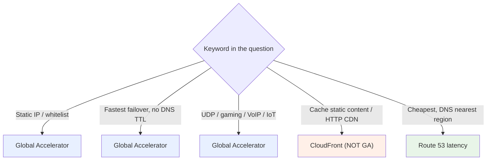

# Global Accelerator Exam Scenarios & Facts - SAA-C03 Deep Dive

> A scenario-driven cram sheet: pattern-match the keywords in each question to the right Global Accelerator feature, plus a quick "question says X → pick Y" table and an important-facts reference.

See also: [01 - Global Accelerator Fundamentals & Architecture](01%20-%20Global%20Accelerator%20Fundamentals%20%26%20Architecture.md) · [02 - Global Accelerator vs CloudFront & Use Cases](02%20-%20Global%20Accelerator%20vs%20CloudFront%20%26%20Use%20Cases.md)

---

## Table of Contents

- [How to Read GA Exam Questions](#how-to-read-ga-exam-questions)
- [Scenario 1: Static IP in Front of an ALB](#scenario-1-static-ip-in-front-of-an-alb)
- [Scenario 2: Fastest Cross-Region Failover](#scenario-2-fastest-cross-region-failover)
- [Scenario 3: Global UDP Game](#scenario-3-global-udp-game)
- [Scenario 4: IoT Devices with Hardcoded IPs](#scenario-4-iot-devices-with-hardcoded-ips)
- [Scenario 5: Gradual Regional Migration](#scenario-5-gradual-regional-migration)
- [Scenario 6: Cache a Static Website (Trap)](#scenario-6-cache-a-static-website-trap)
- [Scenario 7: Sticky Sessions to Same Endpoint](#scenario-7-sticky-sessions-to-same-endpoint)
- [Scenario 8: Keep Existing Public IPs During Migration](#scenario-8-keep-existing-public-ips-during-migration)
- [Quick "Question Says X → Pick Y" Table](#quick-question-says-x--pick-y-table)
- [Important Facts Cheat Table](#important-facts-cheat-table)
- [Summary: Key Takeaways for SAA-C03](#summary-key-takeaways-for-saa-c03)

---

---

## How to Read GA Exam Questions

Global Accelerator questions are usually **distinguish-from-CloudFront-or-Route 53** questions. Scan for these trigger words:

| Trigger Word / Phrase | Leans Toward |
| :--- | :--- |
| "static IP", "whitelist", "fixed IP addresses" | **Global Accelerator** |
| "UDP", "TCP", "gaming", "VoIP", "MQTT", "non-HTTP" | **Global Accelerator** |
| "fastest failover", "no DNS dependency", "without DNS changes" | **Global Accelerator** |
| "cache", "static content", "CDN", "HTTP/HTTPS only" | **CloudFront** |
| "cheapest", "DNS-based", "route to nearest region", "TTL" | **Route 53 latency routing** |
| "keep our current public IPs" | **BYOIP** (often with GA) |

> **Exam Tip:** If a question mentions **both** "global users" and a **non-HTTP protocol** or a **static IP requirement**, Global Accelerator is the safe answer.

[⬆ Back to top](#table-of-contents)

---

## Scenario 1: Static IP in Front of an ALB

**Question:** A company runs a web app behind an **Application Load Balancer** in one region. A partner's firewall requires a **fixed set of IP addresses** to whitelist, but the ALB's IPs change over time. What should they use?

**Answer:** Put **AWS Global Accelerator** in front of the ALB. GA provides **2 static anycast IPs** that never change; the partner whitelists those, while the ALB scales freely.

**Why not alternatives:**

- ALB alone → no static IP.
- NLB → gives a static IP but only single-region and no backbone/anycast benefit (acceptable for single region, but GA is the cleaner whitelisting answer especially if multi-region).

> **Exam Trap:** ALBs do **not** have static IPs. If "static IP + ALB" appears, think Global Accelerator.

[⬆ Back to top](#table-of-contents)

---

## Scenario 2: Fastest Cross-Region Failover

**Question:** An application is deployed in **two regions**. The business needs the **fastest possible failover** to the secondary region with **no reliance on DNS TTL/caching**. Which solution?

**Answer:** **Global Accelerator** with an endpoint group per region. On endpoint failure, GA reroutes to the healthy region in **seconds** using the **same static IPs** - clients never re-resolve DNS.

**Why not Route 53 failover routing:** It works, but failover is **bounded by DNS TTL** and client-side DNS caching, so it is slower.

> **Exam Tip:** "Fastest failover" + "no DNS dependency" = **Global Accelerator** over Route 53 every time.

[⬆ Back to top](#table-of-contents)

---

## Scenario 3: Global UDP Game

**Question:** A multiplayer game uses **UDP**, serves players **worldwide**, and needs **low, consistent latency**. Players should connect to **specific game session servers** running on EC2. Which AWS service and mode?

**Answer:** **Global Accelerator** - and specifically a **custom routing accelerator** to deterministically map players to **specific EC2 instances/ports** (game sessions). UDP rules out CloudFront; the AWS backbone gives low latency/jitter.

> **Exam Tip:** "Deterministically route to a **specific** EC2 instance/port" → **custom routing accelerator**. "Best healthy endpoint, ALB/NLB/EC2/EIP" → **standard accelerator**.

[⬆ Back to top](#table-of-contents)

---

## Scenario 4: IoT Devices with Hardcoded IPs

**Question:** Thousands of **IoT devices** in the field connect over TCP and **cannot perform DNS lookups**; firmware **hardcodes IP addresses**. The backend must be able to move/scale and span regions. What should be configured?

**Answer:** **Global Accelerator**. Devices hardcode the **2 static anycast IPs**; the backend endpoints (regions, ALBs, instances) can change freely without re-flashing devices.

> **Exam Tip:** "Hardcoded IPs / no DNS / embedded devices" + "backend must change" → **Global Accelerator static IPs**.

[⬆ Back to top](#table-of-contents)

---

## Scenario 5: Gradual Regional Migration

**Question:** A team wants to **gradually shift traffic** from `us-east-1` to a new `eu-west-1` deployment, and be able to **drain** a region for maintenance, all behind one entry point. How?

**Answer:** Use **Global Accelerator** and adjust the **traffic dial** on each **endpoint group** - e.g., lower `us-east-1` to 50% and raise `eu-west-1`, or set a group to **0%** to drain it. The static IPs stay constant throughout.

> **Exam Tip:** "Gradually shift / drain traffic **by region**" → **traffic dial** (per endpoint group). "Split traffic **within** a region across endpoints" → **weights**.

[⬆ Back to top](#table-of-contents)

---

## Scenario 6: Cache a Static Website (Trap)

**Question:** A company wants to **globally distribute and cache** a static website and media files to reduce latency and origin load. Which service?

**Answer:** **CloudFront**, NOT Global Accelerator. GA does **no caching**. CloudFront caches at the edge and is purpose-built for HTTP content delivery.

> **Exam Trap:** "Cache" or "static content delivery / CDN" → **CloudFront**. Picking Global Accelerator here is the classic wrong answer.

[⬆ Back to top](#table-of-contents)

---

## Scenario 7: Sticky Sessions to Same Endpoint

**Question:** A stateful TCP application keeps session data on individual servers. Over multiple connections, a client must always reach the **same backend endpoint** at the GA layer. What setting?

**Answer:** Set the listener's **client affinity** to **Source IP**, so all connections from the same source IP route to the same endpoint.

> **Exam Tip:** "Same client → same endpoint / stateful sessions" at the accelerator level = **client affinity = Source IP**.

[⬆ Back to top](#table-of-contents)

---

## Scenario 8: Keep Existing Public IPs During Migration

**Question:** During a migration to AWS, a company must **keep its existing public IPv4 addresses** that customers and partners have already whitelisted, while also improving global performance. What approach?

**Answer:** Use **BYOIP** to bring the existing IP range into AWS and use those addresses as the **Global Accelerator** static anycast IPs - preserving whitelists and IP reputation while gaining backbone routing.

> **Exam Tip:** "Keep our current public IPs" = **BYOIP**; pairing it with GA also satisfies "improve global performance / static IP."

[⬆ Back to top](#table-of-contents)

---

## Quick "Question Says X → Pick Y" Table

| Question Says... | Pick This |
| :--- | :--- |
| Static IP in front of an ALB / IP whitelisting | **Global Accelerator (2 static IPs)** |
| Fastest cross-region failover, no DNS TTL dependency | **Global Accelerator** |
| Global UDP/TCP gaming, low latency | **Global Accelerator** |
| Route players to a **specific** EC2 instance/port | **Custom routing accelerator** |
| Best healthy endpoint among ALB/NLB/EC2/EIP | **Standard accelerator** |
| IoT/embedded devices, hardcoded IPs, no DNS | **Global Accelerator static IPs** |
| Gradually shift / drain traffic **between regions** | **Traffic dial (endpoint group %)** |
| Split traffic **within** a region across endpoints | **Endpoint weights (0-255)** |
| Same client always to same endpoint (stateful) | **Client affinity = Source IP** |
| Cache static content / HTTP CDN | **CloudFront (not GA)** |
| Cheapest, DNS-based nearest-region routing | **Route 53 latency routing** |
| Keep existing public IPs during migration | **BYOIP (+ GA)** |
| VoIP / real-time media, jitter-sensitive | **Global Accelerator** |

[⬆ Back to top](#table-of-contents)

---

## Important Facts Cheat Table

| Fact | Detail |
| :--- | :--- |
| **Static IPs** | Exactly **2** static anycast IPs from **2 network zones**; never change |
| **Layer** | Layer 4 - **TCP and UDP** |
| **Caching** | **None** (that's CloudFront's job) |
| **Network** | Traffic enters at nearest **edge** and rides the **AWS global backbone** |
| **Endpoint types** | ALB, NLB, EC2 instance, Elastic IP |
| **Endpoint group** | One **per Region**; has a **traffic dial (0-100%)** |
| **Endpoint weight** | **0-255**, splits traffic within a region |
| **Client affinity** | `None` (default) or `Source IP` |
| **Failover speed** | Seconds; **no DNS re-resolution** required |
| **Health checks** | TCP/HTTP/HTTPS; can use ALB/NLB's own checks |
| **Accelerator types** | **Standard** (best endpoint) vs **Custom routing** (deterministic → EC2 in VPC subnets) |
| **Custom routing endpoints** | **EC2 instances only** |
| **Client IP preservation** | Supported for ALB/EC2 endpoints |
| **BYOIP** | Can bring your own IP range as the static IPs |
| **DDoS** | AWS Shield Standard included |
| **Pricing** | Fixed **hourly fee** + **data transfer premium** (not free) |

[⬆ Back to top](#table-of-contents)

---

## Summary: Key Takeaways for SAA-C03

| Concept | What You Must Know |
| :--- | :--- |
| **Pattern-match keywords** | Static IP / non-HTTP / fast failover → GA; cache → CloudFront; cheap DNS → Route 53 |
| **Static IPs** | 2 anycast IPs for whitelisting and DNS-free clients |
| **Fast failover** | Seconds, no DNS TTL dependency - beats Route 53 failover |
| **Traffic dial vs weights** | Dial = between regions; weights = within a region |
| **Client affinity** | `Source IP` for stickiness |
| **Standard vs custom** | Custom = deterministic user→specific EC2 instance/port |
| **CloudFront trap** | "Cache" always means CloudFront, never GA |
| **BYOIP** | Keep your own public IPs during migration |
| **Pricing** | Fixed hourly + DT-premium; not the cheapest option |
