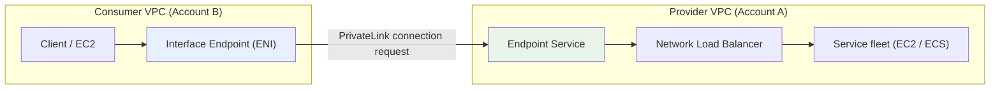
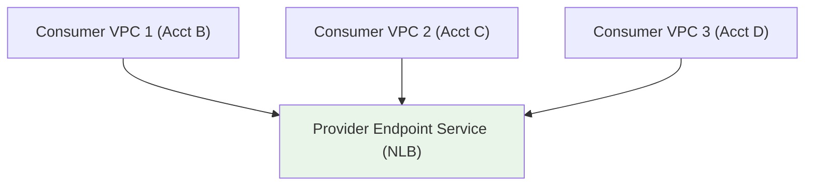
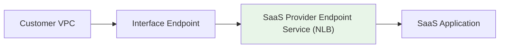

# Endpoint Services & Architecture Patterns - SAA-C03 Deep Dive

> Publish **your own service** privately via a **VPC Endpoint Service** powered by an **NLB (or GWLB)** — consumers in other VPCs/accounts connect through Interface Endpoints with **no peering, no transitive routing, and tolerance for overlapping CIDRs**.

See also: [01 - PrivateLink & VPC Endpoints Deep Dive](01%20-%20PrivateLink%20%26%20VPC%20Endpoints%20Deep%20Dive.md) · [03 - PrivateLink Exam Scenarios & Facts](03%20-%20PrivateLink%20Exam%20Scenarios%20%26%20Facts.md)

---

## Table of Contents

- [Part 1: The Provider / Consumer Model](#part-1-the-provider--consumer-model)
- [Part 2: Creating an Endpoint Service (NLB / GWLB)](#part-2-creating-an-endpoint-service-nlb--gwlb)
- [Part 3: Acceptance & Allowlisting Principals](#part-3-acceptance--allowlisting-principals)
- [Part 4: Connecting Across Accounts & VPCs at Scale](#part-4-connecting-across-accounts--vpcs-at-scale)
- [Part 5: Overlapping CIDR Advantage](#part-5-overlapping-cidr-advantage)
- [Part 6: PrivateLink vs VPC Peering vs Transit Gateway](#part-6-privatelink-vs-vpc-peering-vs-transit-gateway)
- [Part 7: SaaS Access Patterns](#part-7-saas-access-patterns)
- [Part 8: Private DNS for Endpoint Services](#part-8-private-dns-for-endpoint-services)
- [Summary: Key Takeaways for SAA-C03](#summary-key-takeaways-for-saa-c03)

---



---

PrivateLink isn't only for consuming AWS services — you can **become a provider** and expose your own service to thousands of consumer VPCs and accounts. This is the foundation of how AWS Marketplace SaaS vendors deliver private connectivity.

---

## Part 1: The Provider / Consumer Model

| Role | What They Own | Component |
| :--- | :--- | :--- |
| **Service Provider** | The application + load balancer | **VPC Endpoint Service** fronted by an NLB/GWLB |
| **Service Consumer** | A VPC that wants the service | **Interface Endpoint** pointing to the provider's service name |

- The consumer initiates the connection; the **provider never routes into the consumer's VPC**.
- Only the **specific service** is exposed — not the whole provider network. This means **no transitive routing** and a minimal attack surface.
- The connection is **unidirectional** (consumer → provider) at the network layer.

[⬆ Back to top](#table-of-contents)

---

## Part 2: Creating an Endpoint Service (NLB / GWLB)

A VPC Endpoint Service **must** be fronted by a **Network Load Balancer** (layer 4) or a **Gateway Load Balancer** (for inline appliances). An ALB is **not** directly supported (you can put an ALB behind an NLB if you need layer-7).

```bash
# 1. Create the endpoint service backed by an NLB
aws ec2 create-vpc-endpoint-service-configuration \
  --network-load-balancer-arns arn:aws:elasticloadbalancing:...:loadbalancer/net/my-nlb/abc \
  --acceptance-required

# 2. Share the service name with consumers
# com.amazonaws.vpce.us-east-1.vpce-svc-0123456789abcdef0

# 3. Consumer creates an interface endpoint to that service name
aws ec2 create-vpc-endpoint \
  --vpc-endpoint-type Interface \
  --service-name com.amazonaws.vpce.us-east-1.vpce-svc-0123456789abcdef0 \
  --vpc-id vpc-consumer --subnet-ids subnet-aaa subnet-bbb
```

| Load Balancer | Use With Endpoint Service | Why |
| :--- | :--- | :--- |
| **NLB** | ✅ Standard for exposing TCP/UDP services | Layer 4, static IPs, high throughput |
| **GWLB** | ✅ For inline security appliances (firewalls/IDS) | Transparent bump-in-the-wire — see [03 - Network Load Balancer (NLB) & Gateway Load Balancer](03%20-%20Network%20Load%20Balancer%20%28NLB%29%20%26%20Gateway%20Load%20Balancer.md) |
| **ALB** | ❌ Not directly | Place behind an NLB if layer-7 routing is required |

> **Exam Tip:** "Expose my own application privately to other VPCs/accounts" → **VPC Endpoint Service + NLB**.

[⬆ Back to top](#table-of-contents)

---

## Part 3: Acceptance & Allowlisting Principals

The provider controls **who** can connect.

- **`--acceptance-required`**: every consumer connection request must be **manually accepted** by the provider. Use for tighter control.
- **Allowlist principals**: add specific IAM users/roles/account ARNs (or `*`) that are **permitted** to discover and request a connection.

```bash
# Allowlist a whole consumer account to find/request the service
aws ec2 modify-vpc-endpoint-service-permissions \
  --service-id vpce-svc-0123456789abcdef0 \
  --add-allowed-principals arn:aws:iam::222233334444:root
```

- If acceptance is **not** required and the principal is allowlisted, connections complete automatically — good for large-scale self-service onboarding.

[⬆ Back to top](#table-of-contents)

---

## Part 4: Connecting Across Accounts & VPCs at Scale

PrivateLink shines for **one-to-many** exposure:

- A single Endpoint Service can serve **thousands of consumer VPCs and accounts**.
- Each consumer only sees the **service endpoint**, not the provider's CIDR or other consumers.
- No need for a mesh of peering connections or a shared Transit Gateway — each consumer adds **one interface endpoint**.



> **Exam Tip:** "Expose a service to **many** VPCs/accounts without managing peering or transitive routing" → **PrivateLink Endpoint Service**.

[⬆ Back to top](#table-of-contents)

---

## Part 5: Overlapping CIDR Advantage

A standout PrivateLink benefit: **consumer and provider VPCs can have overlapping CIDR ranges.**

- PrivateLink connects to a **specific endpoint (ENI)**, not by routing whole networks together, so address-space conflicts don't matter.
- **VPC Peering and Transit Gateway require non-overlapping CIDRs** because they do IP routing between networks.

> **Exam Trap:** When the scenario mentions **overlapping IP ranges** and a need to share a single service, the answer is **PrivateLink**, not peering or TGW.

[⬆ Back to top](#table-of-contents)

---

## Part 6: PrivateLink vs VPC Peering vs Transit Gateway

| Dimension | PrivateLink (Endpoint Service) | VPC Peering | Transit Gateway |
| :--- | :--- | :--- | :--- |
| **Exposes** | A single service (one app) | Entire VPC network | Many VPCs / on-prem (hub) |
| **Connectivity** | Unidirectional consumer → service | Bidirectional full network | Full routed mesh via hub |
| **Overlapping CIDRs** | ✅ Allowed | ❌ Not allowed | ❌ Not allowed |
| **Transitive routing** | N/A (only the service) | ❌ Not transitive | ✅ Transitive hub |
| **Scale (many parties)** | ✅ 1-to-thousands | ❌ Mesh gets complex | ✅ Centralized hub |
| **Best for** | Sharing one service/SaaS privately | Two VPCs needing full access | Large multi-VPC + hybrid networks |
| **See** | this file | [01 - VPC Fundamentals & Architecture](01%20-%20VPC%20Fundamentals%20%26%20Architecture.md) | [01 - Transit Gateway Fundamentals & Architecture](01%20-%20Transit%20Gateway%20Fundamentals%20%26%20Architecture.md) |

> **Exam Tip:** Need **full network-to-network** access → Peering/TGW. Need to share **just one service** (especially with overlapping CIDRs or external accounts) → **PrivateLink**.

[⬆ Back to top](#table-of-contents)

---

## Part 7: SaaS Access Patterns

PrivateLink is the standard delivery model for **AWS Marketplace SaaS** and partner products:

- The SaaS vendor (provider) publishes an Endpoint Service.
- The customer (consumer) creates an interface endpoint and reaches the SaaS **privately** — traffic never touches the public internet.
- Benefits: compliance (data stays on AWS network), no public exposure, simple onboarding by allowlisting the customer's account.



[⬆ Back to top](#table-of-contents)

---

## Part 8: Private DNS for Endpoint Services

- Providers can associate a **custom private DNS name** (e.g. `api.myservice.com`) with the endpoint service, after a **TXT-record domain-ownership verification**.
- Consumers then reach the service using the friendly name instead of the long `vpce-svc-...` DNS name.
- Combined with the consumer enabling Private DNS on their endpoint, the experience is seamless.

> **Exam Tip:** Custom private DNS for an endpoint service requires **domain ownership verification** (a DNS TXT record) by the provider.

[⬆ Back to top](#table-of-contents)

---

## Summary: Key Takeaways for SAA-C03

| Concept | What You Must Know |
| :--- | :--- |
| **Endpoint Service** | Your service published via PrivateLink, fronted by an **NLB or GWLB** (not ALB directly) |
| **Provider/consumer** | Consumer connects in; provider never routes into consumer VPC |
| **Acceptance & allowlist** | Provider controls connections via acceptance + principal allowlist |
| **Scale** | One service → thousands of VPCs/accounts, no peering mesh |
| **Overlapping CIDRs** | ✅ Allowed with PrivateLink, ❌ not with Peering/TGW |
| **No transitive routing** | Only the single service is exposed |
| **SaaS** | Standard private delivery model for Marketplace/partner products |
| **Custom private DNS** | Needs domain-ownership (TXT) verification |

[⬆ Back to top](#table-of-contents)

---
