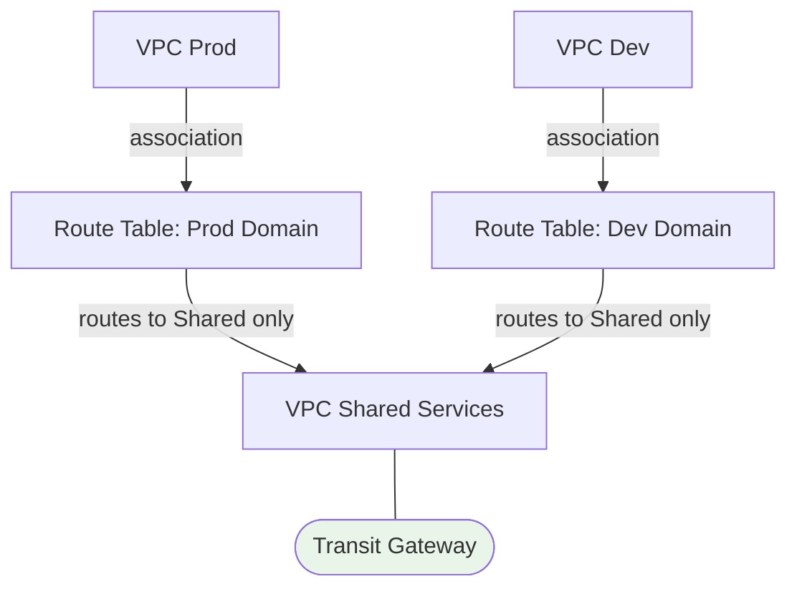

# TGW Route Tables, Peering & Sharing - SAA-C03 Deep Dive

> TGW route tables use **association** (which route table an attachment uses) and **propagation** (which routes an attachment advertises) to build isolated or shared routing domains - enabling segmentation, centralized egress, and inspection patterns across accounts.

See also: [01 - Transit Gateway Fundamentals & Architecture](01%20-%20Transit%20Gateway%20Fundamentals%20%26%20Architecture.md) · [03 - Transit Gateway Exam Scenarios & Facts](03%20-%20Transit%20Gateway%20Exam%20Scenarios%20%26%20Facts.md)

---

## Table of Contents

- [TGW Route Tables Overview](#tgw-route-tables-overview)
- [Association vs Propagation](#association-vs-propagation)
- [Isolated & Shared Routing Domains](#isolated--shared-routing-domains)
- [Blackhole Routes](#blackhole-routes)
- [Inter-Region TGW Peering](#inter-region-tgw-peering)
- [Multicast](#multicast)
- [Sharing a TGW Across Accounts with AWS RAM](#sharing-a-tgw-across-accounts-with-aws-ram)
- [Centralized Egress & Inspection VPC Pattern](#centralized-egress--inspection-vpc-pattern)
- [Summary: Key Takeaways for SAA-C03](#summary-key-takeaways-for-saa-c03)

---



---

Routing on a Transit Gateway is controlled entirely by **TGW route tables**, which are separate from VPC subnet route tables. Mastering association vs propagation is the key to every TGW segmentation question.

---

## TGW Route Tables Overview

A **TGW route table** decides how the Transit Gateway forwards packets between attachments. Each TGW comes with a **default route table** (if default association/propagation is enabled), but you can create many.

| Property | Detail |
| :--- | :--- |
| **Default route table** | Auto-created; default association + propagation can be disabled |
| **Custom route tables** | Create as many as you need for segmentation |
| **Route entries** | Static (manual) or propagated (learned from attachments) |
| **One association per attachment** | An attachment uses exactly ONE TGW route table |
| **Many propagations** | An attachment can propagate its routes into MANY route tables |

> **Exam Tip:** Disable **default association and default propagation** when you want explicit, segmented control. With defaults on, every attachment can reach every other attachment (flat network).

[⬆ Back to top](#table-of-contents)

---

## Association vs Propagation

This distinction is the heart of TGW routing and a frequent exam topic.

| Concept | Question It Answers | Direction |
| :--- | :--- | :--- |
| **Association** | "Which route table does this attachment **use** to look up where to send packets?" | Attachment → its route table (inbound lookup) |
| **Propagation** | "Into which route table(s) are this attachment's **CIDRs advertised**?" | Attachment → other route tables (outbound advertise) |

### Worked Example

- **VPC A** is *associated* with `RT-Prod` → when traffic from VPC A hits the TGW, the TGW looks up `RT-Prod` to decide the next hop.
- **VPC Shared** *propagates* its CIDR into `RT-Prod` → so `RT-Prod` knows how to reach the Shared VPC.

If you associate but never propagate (or add static routes), the route table has no destinations and traffic is dropped.

```
Association  = inbound: which table is consulted for THIS attachment's traffic
Propagation  = outbound: which tables LEARN about this attachment's CIDRs
```

> **Exam Trap:** Association and propagation are independent. An attachment associated with `RT-A` can still **propagate** its routes into `RT-B`, `RT-C`, etc. They are not the same setting.

[⬆ Back to top](#table-of-contents)

---

## Isolated & Shared Routing Domains

By assigning attachments to different route tables and controlling propagation, you build **routing domains** that mirror security boundaries.

### Isolation Pattern (Dev cannot reach Prod)

| Attachment | Associated With | Propagates Into |
| :--- | :--- | :--- |
| **Prod VPC** | `RT-Prod` | `RT-Shared` |
| **Dev VPC** | `RT-Dev` | `RT-Shared` |
| **Shared Services VPC** | `RT-Shared` | `RT-Prod`, `RT-Dev` |

Result:

- Prod and Dev can **both** reach Shared Services.
- Prod and Dev **cannot** reach each other (neither propagates into the other's table).

This is the classic **shared services with isolated spokes** design - exactly what the exam means by "centralized DNS / AD / monitoring reachable by all, but environments isolated from each other."

> **Exam Tip:** "Multiple VPCs must reach a shared services VPC but must NOT reach each other" = **separate TGW route tables per environment, all propagating only into the shared route table.**

[⬆ Back to top](#table-of-contents)

---

## Blackhole Routes

A **blackhole route** is a static route whose target is set to "blackhole" - matching traffic is **silently dropped** at the TGW.

| Use Case | Why |
| :--- | :--- |
| **Block a specific CIDR** | Drop traffic to a sensitive or compromised range |
| **Prevent overlap leakage** | Stop traffic toward a CIDR you do not want routed |
| **Quick segmentation** | Deny a path without removing attachments |

```
Destination: 10.50.0.0/16   Target: blackhole   (traffic dropped)
```

> **Exam Tip:** When a question asks how to **explicitly drop** traffic to a CIDR at the Transit Gateway, the answer is a **blackhole route** in the TGW route table.

[⬆ Back to top](#table-of-contents)

---

## Inter-Region TGW Peering

A single TGW is **regional**. To connect networks across regions, create a **TGW peering attachment** between a TGW in Region A and a TGW in Region B.

| Property | Detail |
| :--- | :--- |
| **What it connects** | Two Transit Gateways in different regions (or same region/account) |
| **Encryption** | Traffic is encrypted and travels over the AWS global backbone |
| **Routing** | Use **static routes** in the TGW route tables for the peer (no dynamic route propagation over peering) |
| **Transitivity** | TGW peering itself is **not transitive** - A↔B and B↔C does not give A↔C |

> **Exam Trap:** Routes over a **TGW peering attachment must be added statically**; they are not auto-propagated. Also, peering is not transitive between three TGWs.

[⬆ Back to top](#table-of-contents)

---

## Multicast

Transit Gateway supports **IP multicast**, letting you run multicast applications across VPCs without on-premises multicast hardware.

| Concept | Detail |
| :--- | :--- |
| **Multicast domain** | A scope grouping subnets/sources/receivers for a multicast group |
| **Sources & members** | Senders and receivers registered to a multicast group |
| **Use cases** | Media streaming, market data feeds, legacy multicast apps |

> **Exam Tip:** If a workload requires **multicast across VPCs**, Transit Gateway multicast is the AWS-native answer (VPC peering and most other options do not support multicast).

[⬆ Back to top](#table-of-contents)

---

## Sharing a TGW Across Accounts with AWS RAM

A Transit Gateway can be shared with **other AWS accounts** in your organization using **AWS Resource Access Manager (RAM)**, so each account attaches its own VPCs to one central TGW.

| Step | Action |
| :--- | :--- |
| 1 | Owner account creates the TGW |
| 2 | Owner shares the TGW via **AWS RAM** (to accounts or the whole Organization) |
| 3 | Participant accounts create **VPC attachments** to the shared TGW |
| 4 | TGW **owner** controls the **TGW route tables**; participants control their own VPC route tables |

| Responsibility | Owner Account | Participant Account |
| :--- | :--- | :--- |
| TGW route tables | Yes | No |
| Their VPC attachment | Approves/owns TGW | Creates attachment |
| Their VPC subnet routes | No | Yes |

> **Exam Tip:** "Connect VPCs that live in **many different AWS accounts** through one hub" = share the **Transit Gateway via AWS RAM**. This pairs naturally with [01 - Direct Connect Fundamentals & Architecture](01%20-%20Direct%20Connect%20Fundamentals%20%26%20Architecture.md) and [01 - Site-to-Site VPN Fundamentals & Architecture](01%20-%20Site-to-Site%20VPN%20Fundamentals%20%26%20Architecture.md) for hybrid.

[⬆ Back to top](#table-of-contents)

---

## Centralized Egress & Inspection VPC Pattern

A flagship TGW architecture: route **all** spoke-VPC traffic through one central VPC for shared NAT/internet egress and/or security inspection.

### Centralized Egress

- Spoke VPCs have **no NAT Gateway / IGW**.
- A central **egress VPC** holds the NAT Gateway(s) and IGW.
- Spoke route tables send `0.0.0.0/0` → TGW; the TGW routes to the egress VPC; the egress VPC sends to NAT → IGW.
- Saves money by **consolidating NAT Gateways** instead of one per VPC.

### Centralized Inspection

- An **inspection VPC** runs a stateful firewall / AWS Network Firewall / third-party NGFW.
- All east-west and/or north-south traffic is steered through it via TGW route tables.
- **Enable appliance mode** on the inspection VPC attachment so forward/return flows stay on the same AZ/appliance (see [01 - Transit Gateway Fundamentals & Architecture](01%20-%20Transit%20Gateway%20Fundamentals%20%26%20Architecture.md)).

```
Spoke VPC --(0.0.0.0/0 -> TGW)--> TGW --> Inspection/Egress VPC --> Firewall/NAT --> IGW
Return traffic retraces the SAME appliance (appliance mode ON)
```

> **Exam Trap:** Centralized inspection across AZs **without appliance mode** causes asymmetric routing and dropped connections on stateful firewalls. Always enable appliance mode for the inspection VPC attachment.

[⬆ Back to top](#table-of-contents)

---

## Summary: Key Takeaways for SAA-C03

| Concept | What You Must Know |
| :--- | :--- |
| **Association** | The ONE route table an attachment uses for lookups |
| **Propagation** | The route table(s) an attachment advertises its CIDRs into |
| **Isolation** | Separate route tables per environment, all propagating into shared |
| **Blackhole** | Static route that silently drops matching traffic |
| **TGW peering** | Cross-region; static routes only; NOT transitive |
| **Multicast** | TGW supports cross-VPC multicast natively |
| **AWS RAM** | Shares the TGW across accounts; owner controls TGW route tables |
| **Central egress** | Consolidate NAT Gateways in one egress VPC |
| **Central inspection** | Route through inspection VPC + enable appliance mode |

[⬆ Back to top](#table-of-contents)
