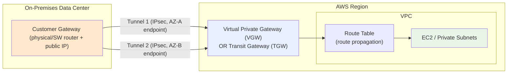
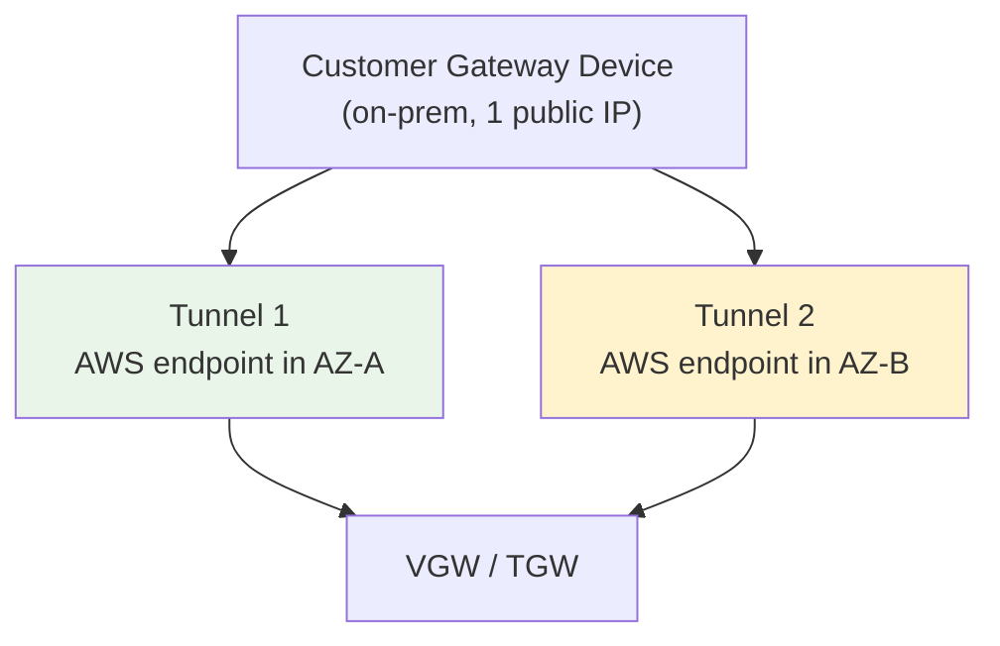

# AWS Site-to-Site VPN Fundamentals & Architecture - SAA-C03 Deep Dive

> AWS Site-to-Site VPN creates an **encrypted IPsec tunnel over the public internet** between your on-premises network (Customer Gateway) and AWS (Virtual Private Gateway or Transit Gateway). It is the **quick, cheap hybrid connectivity** option - up and running in minutes, but rides the public internet so latency is variable.

See also: [02 - VGW, CGW, Routing & Redundancy](02%20-%20VGW%2C%20CGW%2C%20Routing%20%26%20Redundancy.md) · [03 - Site-to-Site VPN Exam Scenarios & Facts](03%20-%20Site-to-Site%20VPN%20Exam%20Scenarios%20%26%20Facts.md)

---

## Table of Contents

- [Part 1: What Is Site-to-Site VPN?](#part-1-what-is-site-to-site-vpn)
- [Part 2: The Core Components](#part-2-the-core-components)
- [Part 3: AWS Side - VGW vs Transit Gateway](#part-3-aws-side---vgw-vs-transit-gateway)
- [Part 4: The Two-Tunnel Design (High Availability)](#part-4-the-two-tunnel-design-high-availability)
- [Part 5: Static vs Dynamic (BGP) Routing](#part-5-static-vs-dynamic-bgp-routing)
- [Part 6: Route Propagation](#part-6-route-propagation)
- [Part 7: Encryption - IKE and IPsec](#part-7-encryption---ike-and-ipsec)
- [Part 8: Accelerated Site-to-Site VPN](#part-8-accelerated-site-to-site-vpn)
- [Part 9: Creating a VPN (CLI Overview)](#part-9-creating-a-vpn-cli-overview)
- [Summary: Key Takeaways for SAA-C03](#summary-key-takeaways-for-saa-c03)

---



---

Site-to-Site VPN is the most commonly tested hybrid-connectivity option on SAA-C03. It connects an existing on-premises network to a VPC over an encrypted IPsec tunnel - cheap, fast to deploy, but dependent on the public internet for transport.

---

## Part 1: What Is Site-to-Site VPN?

### Definition

**AWS Site-to-Site VPN** establishes a secure, encrypted **IPsec connection** between your on-premises network (or another cloud) and your AWS VPC, running **over the public internet**.

It is the fastest and cheapest way to build hybrid connectivity. Unlike [01 - Direct Connect Fundamentals & Architecture](01%20-%20Direct%20Connect%20Fundamentals%20%26%20Architecture.md) (which requires a physical cross-connect taking weeks to provision), a Site-to-Site VPN can be set up in minutes.

### Where It Fits

| Property | Site-to-Site VPN | Direct Connect |
| :--- | :--- | :--- |
| **Transport** | Public internet | Private dedicated link |
| **Encryption** | Built-in (IPsec) | None by default |
| **Setup time** | Minutes | Weeks (physical) |
| **Cost** | Low (per-hour + data) | High (port + cross-connect) |
| **Latency** | Variable (internet) | Consistent / low |

> **Exam Tip:** Keywords like **"quickly"**, **"cost-effective"**, **"temporary"**, or **"encrypted over the internet"** point to Site-to-Site VPN. Keywords like **"consistent/dedicated bandwidth"** or **"lowest latency"** point to Direct Connect.

[⬆ Back to top](#table-of-contents)

---

## Part 2: The Core Components

A Site-to-Site VPN connection has **three logical pieces** plus the tunnels.

| Component | Side | Description |
| :--- | :--- | :--- |
| **Customer Gateway (CGW)** | On-premises | A resource in AWS that **represents** your physical/software VPN device. You supply its **public IP** (or the public IP of a NAT device in front of it) and its **BGP ASN** (for dynamic routing). |
| **Customer Gateway Device** | On-premises | The **actual physical or software appliance** (e.g., Cisco, Juniper, pfSense, strongSwan) that terminates the tunnel on your side. |
| **Virtual Private Gateway (VGW)** | AWS | The VPN concentrator on the AWS side, attached to a **single VPC**. |
| **Transit Gateway (TGW)** | AWS | Alternative AWS-side endpoint that can terminate VPNs for **many VPCs** at once. |
| **VPN Connection** | Both | The configured IPsec connection, which always contains **two tunnels**. |

> **Exam Trap:** The "Customer Gateway" in AWS is just a **configuration object** (an IP + ASN). The real hardware that you must own/configure is the **Customer Gateway Device** on-prem. AWS does not provide the on-prem device.

[⬆ Back to top](#table-of-contents)

---

## Part 3: AWS Side - VGW vs Transit Gateway

The AWS endpoint of a Site-to-Site VPN can be either a **Virtual Private Gateway** or a **Transit Gateway**. Choosing between them is a frequent exam decision.

### Virtual Private Gateway (VGW)

- Attaches to **exactly one VPC**.
- Simple, classic option for connecting **one on-prem site to one VPC**.
- Supports **route propagation** into VPC route tables.
- Has its **own Amazon-side ASN** (default `64512`, customizable).

### Transit Gateway (TGW)

- A regional **hub** that can connect **thousands of VPCs and VPN connections**.
- Use when you need **many VPCs** to reach on-prem, or multiple VPN sites.
- Enables **ECMP (Equal-Cost Multi-Path)** to aggregate bandwidth across multiple tunnels - VGW does **not** support ECMP.
- See [01 - Transit Gateway Fundamentals & Architecture](01%20-%20Transit%20Gateway%20Fundamentals%20%26%20Architecture.md).

### Decision Table

| Need | Choose |
| :--- | :--- |
| One on-prem site → one VPC | **VGW** |
| Many VPCs → on-prem over VPN | **Transit Gateway** |
| Aggregate bandwidth (>1.25 Gbps) over multiple tunnels (ECMP) | **Transit Gateway** |
| Simplest possible hybrid link | **VGW** |

> **Exam Tip:** If a scenario mentions **multiple VPCs** or **scaling VPN bandwidth beyond a single tunnel's ~1.25 Gbps**, the answer is **Transit Gateway** (ECMP), not a VGW.

[⬆ Back to top](#table-of-contents)

---

## Part 4: The Two-Tunnel Design (High Availability)

### Always Two Tunnels

Every Site-to-Site VPN connection is provisioned with **two tunnels** by AWS, for **redundancy**. Each tunnel terminates on a **different AWS endpoint in a different Availability Zone**, so a single AZ failure does not drop the connection.



### Key Facts

| Fact | Detail |
| :--- | :--- |
| **Tunnels per connection** | Always **2** (cannot be reduced to 1). |
| **AWS-side redundancy** | The two tunnel endpoints sit in **two different AZs** automatically. |
| **Per-tunnel throughput** | Up to **~1.25 Gbps** per tunnel. |
| **Default behavior** | Typically **one tunnel active, one standby** unless you use BGP/ECMP to balance. |
| **Customer-side gap** | By default **both tunnels terminate on a SINGLE Customer Gateway Device** - that device is a single point of failure on your side. |

> **Exam Trap:** The **two tunnels protect the AWS side only**. If the question asks for full end-to-end resilience, you must add a **second Customer Gateway Device** on-premises (covered in [02 - VGW, CGW, Routing & Redundancy](02%20-%20VGW%2C%20CGW%2C%20Routing%20%26%20Redundancy.md)).

[⬆ Back to top](#table-of-contents)

---

## Part 5: Static vs Dynamic (BGP) Routing

You choose how routes are exchanged across the VPN when you create it.

### Static Routing

- You **manually configure** the on-prem CIDR prefixes on the VPN connection.
- The CGW **does not need to support BGP**.
- Simple, but **no automatic failover of routes** and no dynamic discovery of new networks.

### Dynamic Routing (BGP)

- Uses **Border Gateway Protocol** to exchange routes automatically.
- Requires the Customer Gateway Device to support **BGP** and an assigned **ASN**.
- **Routes update automatically**; supports faster, cleaner **failover** between tunnels.
- **Required for ECMP** on Transit Gateway (aggregating bandwidth).

### Comparison

| Aspect | Static | Dynamic (BGP) |
| :--- | :--- | :--- |
| CGW must support BGP | No | **Yes** |
| Route maintenance | Manual | Automatic |
| Failover | Manual / slower | Automatic / faster |
| ECMP / bandwidth aggregation | Not supported | **Supported (TGW)** |
| Best for | Small/simple, fixed networks | Multiple/changing networks, HA |

> **Exam Tip:** **BGP (dynamic) is recommended** for production HA and is **required** for ECMP. Choose **static** only when the question states the on-prem device cannot run BGP or the network is small and fixed.

[⬆ Back to top](#table-of-contents)

---

## Part 6: Route Propagation

For VPC subnets to send traffic back over the VPN, the **VPC route tables must know** the on-prem prefixes.

### Two Ways to Get Routes In

1. **Route Propagation (recommended):** Enable **route propagation** on the VPC route table associated with the VGW. Routes learned over the VPN (via BGP, or the static routes you defined) are **automatically inserted** into the route table.
2. **Static routes:** Manually add a route entry pointing the on-prem CIDR to the VGW/TGW target.

```text
Destination        Target
10.0.0.0/16        local            <- VPC CIDR
192.168.10.0/24    vgw-0abc123      <- on-prem network (propagated)
```

> **Exam Tip:** If traffic flows **from on-prem into the VPC** but **return traffic fails**, the classic cause is **missing route propagation / missing route table entry** for the on-prem CIDR. Also confirm **Security Groups and NACLs** allow the traffic.

[⬆ Back to top](#table-of-contents)

---

## Part 7: Encryption - IKE and IPsec

Site-to-Site VPN secures traffic with the standard **IPsec** suite, negotiated by **IKE (Internet Key Exchange)**.

### How the Tunnel Is Secured

| Phase | Protocol | Purpose |
| :--- | :--- | :--- |
| **Phase 1** | **IKE (v1 or v2)** | Authenticates peers and establishes a secure channel; sets up the IKE Security Association. |
| **Phase 2** | **IPsec (ESP)** | Negotiates the data-encryption SA and encrypts the actual traffic. |

### Authentication & Crypto Facts

- **Authentication:** **Pre-shared keys (PSK)** by default; **private certificates via ACM Private CA** are also supported.
- **Standards:** Supports modern AES-256, SHA-2, DH groups, and **IKEv2**.
- **Encryption is built in** - this is the key differentiator versus a bare Direct Connect link, which is **not encrypted** by default.

> **Exam Tip:** When a requirement is **"encrypt data in transit between on-prem and AWS"**, Site-to-Site VPN satisfies it natively. Direct Connect alone does **not** - you must layer a VPN (or MACsec) on top.

[⬆ Back to top](#table-of-contents)

---

## Part 8: Accelerated Site-to-Site VPN

### What It Is

An **Accelerated Site-to-Site VPN** routes tunnel traffic through the **AWS Global Accelerator** network: traffic enters the **nearest AWS edge location** and travels over the **AWS global backbone** instead of the public internet for most of the path.

See [01 - VPC Fundamentals & Architecture](01%20-%20VPC%20Fundamentals%20%26%20Architecture.md) for VPC basics and how the VGW/TGW attach.

### Key Facts

| Fact | Detail |
| :--- | :--- |
| **Benefit** | More **consistent latency and throughput**, reduced jitter/packet loss versus plain internet VPN. |
| **Requires** | A **Transit Gateway** attachment (not available on plain VGW). |
| **Enabled at** | VPN connection creation (cannot toggle on later - recreate). |
| **Cost** | Additional **Global Accelerator** charges apply. |

> **Exam Tip:** If a scenario wants a **VPN with more predictable/consistent performance** but **still over the internet** (not Direct Connect), the answer is **Accelerated Site-to-Site VPN** using a Transit Gateway.

[⬆ Back to top](#table-of-contents)

---

## Part 9: Creating a VPN (CLI Overview)

```bash
# 1. Create the Customer Gateway (represents your on-prem device)
aws ec2 create-customer-gateway \
    --type ipsec.1 \
    --public-ip 203.0.113.10 \
    --bgp-asn 65000

# 2. Create the Virtual Private Gateway and attach to the VPC
aws ec2 create-vpn-gateway --type ipsec.1 --amazon-side-asn 64512
aws ec2 attach-vpn-gateway --vpn-gateway-id vgw-0abc --vpc-id vpc-0123

# 3. Create the VPN connection (dynamic/BGP routing)
aws ec2 create-vpn-connection \
    --type ipsec.1 \
    --customer-gateway-id cgw-0abc \
    --vpn-gateway-id vgw-0abc \
    --options "{\"StaticRoutesOnly\":false}"

# 4. Enable route propagation on the VPC route table
aws ec2 enable-vgw-route-propagation \
    --gateway-id vgw-0abc \
    --route-table-id rtb-0abc
```

> AWS generates a **downloadable configuration file** tailored to your specific Customer Gateway Device vendor/model - apply it on the on-prem appliance to bring up the tunnels.

[⬆ Back to top](#table-of-contents)

---

## Summary: Key Takeaways for SAA-C03

| Concept | What You Must Know |
| :--- | :--- |
| **What it is** | Encrypted **IPsec** tunnel over the **public internet**, on-prem ↔ AWS. |
| **Components** | Customer Gateway (config), Customer Gateway Device (your hardware), VGW or TGW (AWS side). |
| **Two tunnels** | Always 2, in 2 AZs - protects the **AWS side** only. |
| **VGW vs TGW** | VGW = one VPC; TGW = many VPCs + **ECMP** bandwidth aggregation. |
| **Routing** | Static (manual, no BGP) vs Dynamic (**BGP**, auto failover, needed for ECMP). |
| **Route propagation** | Enable on VPC route table so return traffic finds on-prem CIDR. |
| **Encryption** | IKE (Phase 1) + IPsec/ESP (Phase 2); PSK or ACM certs. Built-in. |
| **Accelerated VPN** | Uses **Global Accelerator** + **Transit Gateway** for consistent performance. |
| **Per-tunnel limit** | ~**1.25 Gbps**; exceed it with **TGW + ECMP**. |

[⬆ Back to top](#table-of-contents)

---
