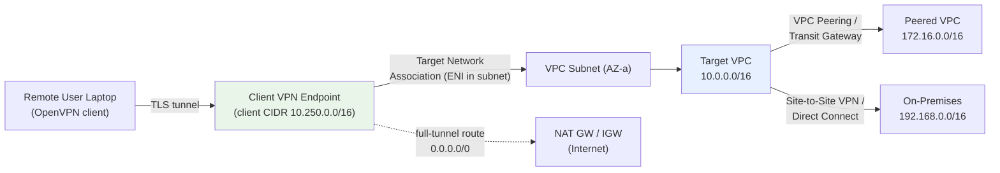
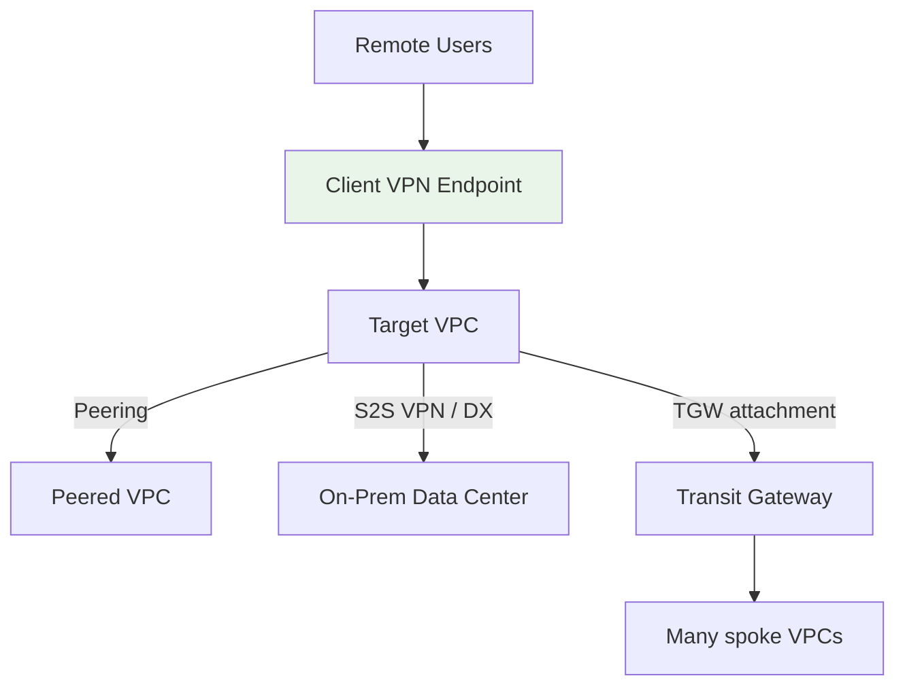

# AWS Client VPN Fundamentals & Architecture - SAA-C03 Deep Dive

> AWS Client VPN is a **managed, OpenVPN-based remote-access VPN** that lets individual users and laptops connect securely *into* a VPC (and onward to peered VPCs and on-premises). It is **user-to-network**, the inverse of Site-to-Site VPN which is **network-to-network**.

See also: [02 - Client VPN Exam Scenarios & Facts](02%20-%20Client%20VPN%20Exam%20Scenarios%20%26%20Facts.md)

---

## Table of Contents

- [Part 1: What Is AWS Client VPN?](#part-1-what-is-aws-client-vpn)
- [Part 2: Core Architecture & Components](#part-2-core-architecture--components)
- [Part 3: The Client VPN Endpoint](#part-3-the-client-vpn-endpoint)
- [Part 4: Authentication Options](#part-4-authentication-options)
- [Part 5: Authorization Rules](#part-5-authorization-rules)
- [Part 6: Target Network Associations & Routing](#part-6-target-network-associations--routing)
- [Part 7: Split-Tunnel vs Full-Tunnel](#part-7-split-tunnel-vs-full-tunnel)
- [Part 8: Reaching Peered VPCs, On-Prem & the Internet](#part-8-reaching-peered-vpcs-on-prem--the-internet)
- [Part 9: Security Groups & Network Access](#part-9-security-groups--network-access)
- [Part 10: Logging & Monitoring](#part-10-logging--monitoring)
- [Part 11: Client VPN vs Site-to-Site VPN](#part-11-client-vpn-vs-site-to-site-vpn)
- [Summary: Key Takeaways for SAA-C03](#summary-key-takeaways-for-saa-c03)

---



---

## Part 1: What Is AWS Client VPN?

AWS **Client VPN** is a fully managed, elastic VPN service that enables **remote-access** connectivity. Unlike Site-to-Site VPN (which joins two *networks* like a data center and a VPC), Client VPN connects **individual devices** (employee laptops, contractor machines, developer workstations) securely into AWS.

### Key Properties

| Property | Detail |
| :--- | :--- |
| **Protocol** | Based on **OpenVPN** (open-source) - uses standard OpenVPN clients or the AWS-provided client |
| **Transport** | TLS over **UDP 443** (default) or TCP 443 |
| **Connection model** | **User-to-network** (one device to a VPC) |
| **Managed** | Fully managed by AWS, **elastic** - automatically scales with the number of connections |
| **High availability** | Achieved by associating **multiple subnets in different AZs** |
| **Billing** | Charged per **endpoint association per hour** + per **active connection per hour** |

> **Exam Tip:** If a question mentions "remote employees / work-from-home users / laptops needing secure access to AWS resources," the answer is **Client VPN**, not Site-to-Site VPN.

[⬆ Back to top](#table-of-contents)

---

## Part 2: Core Architecture & Components

Client VPN is built from several distinct objects that you configure in order:

| Component | Role |
| :--- | :--- |
| **Client VPN endpoint** | The regional resource clients connect to; the heart of the configuration |
| **Client CIDR range** | A private IP range (`/22` to `/12`) from which connected clients are assigned IPs - **must not overlap** with the VPC, peered VPCs, or on-prem |
| **Target network association** | Associates a **subnet** with the endpoint; creates an **ENI** that becomes the entry point into the VPC |
| **Authentication** | How users prove identity: mutual cert, Active Directory, or SAML/federated SSO |
| **Authorization rules** | Network-based ACL deciding which destination CIDRs a user/group may reach |
| **Routes** | Where traffic from the endpoint can go (VPC, peered VPC, on-prem, internet) |
| **Security group** | Applied to the endpoint ENIs; controls allowed traffic into associated subnets |

[⬆ Back to top](#table-of-contents)

---

## Part 3: The Client VPN Endpoint

The **Client VPN endpoint** is the regional resource that terminates client sessions.

- Created once per region; clients download a **`.ovpn` configuration file** to connect.
- When you associate a subnet, AWS creates **elastic network interfaces (ENIs)** in that subnet that act as the gateway between connected clients and the VPC.
- The endpoint is **highly available** when associated with subnets in **multiple Availability Zones**.

### The Client CIDR Range

```text
Client CIDR (example): 10.250.0.0/16
  - Each connecting client gets an IP from this pool.
  - MUST NOT overlap with the VPC CIDR, peered VPC CIDRs, or on-prem CIDRs.
  - Cannot be changed after the endpoint is created.
  - Minimum size /22, maximum size /12.
```

> **Exam Trap:** Overlapping the client CIDR with the target VPC CIDR breaks routing. The pool must be **unique** across everything it might reach.

[⬆ Back to top](#table-of-contents)

---

## Part 4: Authentication Options

Client VPN supports **three authentication types**, and you can combine some of them (mutual cert is always used for the *transport/server* certificate).

| Type | How It Works | Best For |
| :--- | :--- | :--- |
| **Mutual (certificate-based)** | Both server and client present certificates issued via **AWS Certificate Manager (ACM)**. No identity provider needed. | Small teams, machine access, no existing IdP |
| **Active Directory** | Uses **AWS Directory Service** (managed Microsoft AD or AD Connector to on-prem AD). Supports MFA. | Organizations already using AD |
| **SAML / federated SSO** | Uses a **SAML 2.0 IdP** (e.g. **IAM Identity Center**, Okta, Azure AD/Entra ID). | Centralized SSO, federated workforce |

### Key Facts

- Even when using AD or SAML, a **server certificate** (from ACM) is required for the TLS tunnel.
- AD and SAML support **group-based authorization** - you can grant different network access to different user groups.
- Mutual certificate auth alone has **no group concept**, so authorization rules apply to all clients.

```bash
# Example: create a Client VPN endpoint with certificate-based auth
aws ec2 create-client-vpn-endpoint \
  --client-cidr-block "10.250.0.0/16" \
  --server-certificate-arn arn:aws:acm:us-east-1:111122223333:certificate/abc \
  --authentication-options Type=certificate-authentication,MutualAuthentication={ClientRootCertificateChainArn=arn:aws:acm:us-east-1:111122223333:certificate/def} \
  --connection-log-options Enabled=true,CloudwatchLogGroup=clientvpn-logs \
  --split-tunnel
```

> **Exam Tip:** "Users authenticate with their existing corporate identities / SSO" → **SAML federated authentication** (often via IAM Identity Center). "We use on-prem Active Directory" → **Directory Service / AD authentication**.

[⬆ Back to top](#table-of-contents)

---

## Part 5: Authorization Rules

After authentication proves *who* a user is, **authorization rules** decide *what they can reach*. They function like a **network ACL keyed on destination CIDR**.

| Element | Meaning |
| :--- | :--- |
| **Destination CIDR** | The network the rule governs (e.g. `10.0.0.0/16`, `0.0.0.0/0`) |
| **Grant access to** | **All users**, or a **specific AD/SAML group** (by group ID/SID) |
| **Default** | Nothing is reachable until you add at least one authorization rule |

```bash
# Allow all users to reach the entire target VPC
aws ec2 authorize-client-vpn-ingress \
  --client-vpn-endpoint-id cvpn-endpoint-0123456789abcdef \
  --target-network-cidr "10.0.0.0/16" \
  --authorize-all-groups

# Allow ONLY the "Admins" AD group to reach the database subnet
aws ec2 authorize-client-vpn-ingress \
  --client-vpn-endpoint-id cvpn-endpoint-0123456789abcdef \
  --target-network-cidr "10.0.10.0/24" \
  --access-group-id "S-1-5-21-1234567890-..."
```

> **Exam Tip:** Group-specific authorization rules are the way to give **different teams different access** over the same endpoint - but they **require AD or SAML auth** (group-aware), not mutual certificates.

[⬆ Back to top](#table-of-contents)

---

## Part 6: Target Network Associations & Routing

A **target network association** links a **subnet** to the endpoint. This is what physically wires clients into the VPC.

### What Happens on Association

1. AWS creates **ENIs** in the chosen subnet.
2. A **route** to the subnet's VPC CIDR is automatically added to the endpoint route table.
3. The endpoint can now forward client traffic into that subnet (subject to authorization rules and security groups).

### Routes

The endpoint has its **own route table**. To reach networks *beyond* the directly associated subnet (peered VPCs, on-prem, internet), you must add explicit routes.

```bash
# Add a route so clients can reach a peered VPC via the associated subnet
aws ec2 create-client-vpn-route \
  --client-vpn-endpoint-id cvpn-endpoint-0123456789abcdef \
  --destination-cidr-block "172.16.0.0/16" \
  --target-vpc-subnet-id subnet-0abc123
```

> **Exam Trap:** Adding a **route** is *not enough* - you also need a matching **authorization rule** for that destination CIDR. Routing and authorization are **two separate steps**.

### High Availability

Associate subnets in **multiple AZs**. If one AZ's subnet/ENI fails, clients can still connect through the others. AWS recommends one subnet per AZ in use.

[⬆ Back to top](#table-of-contents)

---

## Part 7: Split-Tunnel vs Full-Tunnel

This is the **single most exam-relevant configuration choice** for Client VPN.

| Mode | What Routes Through the Tunnel | Internet Traffic | Cost / Performance |
| :--- | :--- | :--- | :--- |
| **Full-tunnel** (default) | **All** client traffic (`0.0.0.0/0`) goes through the VPN | Routed via AWS (NAT GW / IGW) | More data transfer cost, can add latency; useful for inspection/egress control |
| **Split-tunnel** | **Only** traffic destined for the VPN routes (subnet pushed routes) | Goes **directly** out the user's local internet | **Lower cost**, less latency, less AWS data transfer |

```text
FULL-TUNNEL:   laptop --> [ all traffic ] --> Client VPN --> VPC / AWS egress --> internet
SPLIT-TUNNEL:  laptop --> [ VPC-bound only ] --> Client VPN --> VPC
               laptop --> [ everything else ] --> local home/office internet
```

> **Exam Tip:** "Reduce data transfer **costs** / only AWS-bound traffic should use the VPN / minimize bandwidth through AWS" → enable **split-tunnel**. "All user traffic must be **inspected / forced through corporate egress**" → **full-tunnel**.

Split-tunnel can be enabled at creation or toggled later; toggling it pushes new routes to connected clients on reconnect.

[⬆ Back to top](#table-of-contents)

---

## Part 8: Reaching Peered VPCs, On-Prem & the Internet

Client VPN can connect users far beyond the single target VPC, as long as routing + authorization + connectivity exist.

| Destination | Required Plumbing |
| :--- | :--- |
| **Target VPC** | Auto-route on subnet association + authorization rule |
| **Peered VPC** | VPC peering (or **Transit Gateway**) + endpoint route to peer CIDR + authorization rule. Note: peering is **non-transitive**. |
| **On-premises** | **Site-to-Site VPN** or **Direct Connect** from the VPC + endpoint route to on-prem CIDR + authorization rule |
| **Other VPCs at scale** | Attach via **Transit Gateway** for hub-and-spoke reach |
| **Internet (full-tunnel)** | Route `0.0.0.0/0` to a subnet with a **NAT Gateway** (private) or path to **IGW** + authorization rule for `0.0.0.0/0` |



> **Exam Tip:** Client VPN is frequently combined with **Transit Gateway** to give remote users access to **many VPCs** and on-prem from a single endpoint - a common modern enterprise pattern.

[⬆ Back to top](#table-of-contents)

---

## Part 9: Security Groups & Network Access

Client VPN traffic enters the VPC through the **endpoint ENIs**, and those ENIs have **security groups**.

- You specify the security group(s) applied to the endpoint when associating subnets (defaults to the VPC's default SG).
- For a resource (e.g. an EC2 instance) to accept VPN client traffic, its security group must **allow the endpoint's security group** as the source (or the client CIDR).
- **NACLs** on the associated subnet also apply to the traffic.

### Layered Controls Recap

```text
Connection allowed only if ALL pass:
  1. Authentication succeeds (cert / AD / SAML)
  2. Authorization rule permits the destination CIDR (per user/group)
  3. Endpoint route exists to the destination
  4. Security group + NACL allow the traffic to the resource
```

> **Exam Trap:** A user authenticates fine but cannot reach a database - check **all four layers**, especially a missing **authorization rule** or a target **security group** that doesn't allow the endpoint SG / client CIDR.

[⬆ Back to top](#table-of-contents)

---

## Part 10: Logging & Monitoring

| Feature | Detail |
| :--- | :--- |
| **Connection logging** | Optional - sends connection attempts, established/terminated events to a **CloudWatch Logs** group |
| **Metrics** | CloudWatch metrics: active connections, ingress/egress bytes, authentication failures |
| **Client connect handler** | Optional **Lambda** invoked on connect for posture/device checks (return allow/deny) |
| **Self-service portal** | Optional portal where users download the client and latest config |

> **Exam Tip:** When a scenario demands an **audit trail of who connected when**, enable **connection logging to CloudWatch Logs**.

[⬆ Back to top](#table-of-contents)

---

## Part 11: Client VPN vs Site-to-Site VPN

The most important contrast for the exam:

| Dimension | **Client VPN** | **Site-to-Site VPN** |
| :--- | :--- | :--- |
| **Connection model** | **User-to-network** (laptop → VPC) | **Network-to-network** (data center → VPC) |
| **Who connects** | Individual users/devices | An entire on-prem network via a customer gateway |
| **Protocol** | OpenVPN (TLS) | IPsec |
| **Endpoint** | Client VPN endpoint + ENIs | Virtual Private Gateway / Transit Gateway + Customer Gateway |
| **Authentication** | Cert / AD / SAML (per user) | Pre-shared keys / certificates (per tunnel) |
| **Typical use** | Remote workforce, work-from-home, contractors | Connecting an office/data center to AWS |
| **Tunnels** | One TLS session per device | Two IPsec tunnels per connection (HA) |

> **Exam Tip:** Keyword decoder - **"employees / laptops / remote individuals"** = Client VPN; **"data center / branch office / on-prem network"** = Site-to-Site VPN.

See also: [01 - Site-to-Site VPN Fundamentals & Architecture](01%20-%20Site-to-Site%20VPN%20Fundamentals%20%26%20Architecture.md), [01 - VPC Fundamentals & Architecture](01%20-%20VPC%20Fundamentals%20%26%20Architecture.md), [01 - Transit Gateway Fundamentals & Architecture](01%20-%20Transit%20Gateway%20Fundamentals%20%26%20Architecture.md).

[⬆ Back to top](#table-of-contents)

---

## Summary: Key Takeaways for SAA-C03

| Concept | What You Must Know |
| :--- | :--- |
| **Service type** | Managed, elastic, **OpenVPN-based remote-access** VPN (user-to-network) |
| **Endpoint** | Regional; creates **ENIs** in associated subnets; needs a **client CIDR** that doesn't overlap |
| **Authentication** | **Mutual cert**, **Active Directory**, or **SAML/federated SSO** (server cert always required) |
| **Authorization rules** | Destination-CIDR ACL; can target **AD/SAML groups** for per-team access |
| **Routing** | Separate route table; reach peered VPCs / on-prem / internet with explicit routes |
| **Split vs full tunnel** | **Split-tunnel = lower cost** (only AWS-bound traffic); full-tunnel inspects all traffic |
| **HA** | Associate subnets in **multiple AZs** |
| **Security** | Endpoint **security groups** + **NACLs** + authorization rules all apply |
| **Logging** | Optional **connection logging to CloudWatch Logs** |
| **vs Site-to-Site** | Client = users/laptops; Site-to-Site = whole networks/data centers |

[⬆ Back to top](#table-of-contents)

---
