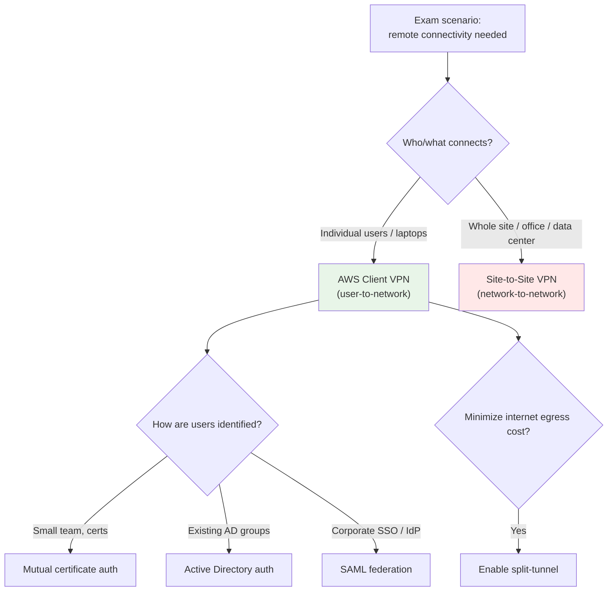

# AWS Client VPN Exam Scenarios & Facts - SAA-C03 Deep Dive

> Scenario drills and a rapid-fire fact sheet for **AWS Client VPN**. The single most tested idea: **individual remote users/laptops = Client VPN**, while a **whole office/site/data center = Site-to-Site VPN**. Master the keyword decoder and the split-tunnel cost tip and you will clear every Client VPN question.

See also: [01 - Client VPN Fundamentals & Architecture](01%20-%20Client%20VPN%20Fundamentals%20%26%20Architecture.md)

---

## Table of Contents

- [How to Read a Client VPN Question](#how-to-read-a-client-vpn-question)
- [Scenario 1: Remote Workforce Laptops](#scenario-1-remote-workforce-laptops)
- [Scenario 2: Branch Office With 200 Users](#scenario-2-branch-office-with-200-users)
- [Scenario 3: Reducing Data-Transfer Cost](#scenario-3-reducing-data-transfer-cost)
- [Scenario 4: Per-Team Access With Active Directory](#scenario-4-per-team-access-with-active-directory)
- [Scenario 5: SSO / SAML Federation](#scenario-5-sso--saml-federation)
- [Scenario 6: Reaching Peered VPCs and On-Premises](#scenario-6-reaching-peered-vpcs-and-on-premises)
- [Scenario 7: Forcing All Traffic Through AWS Inspection](#scenario-7-forcing-all-traffic-through-aws-inspection)
- [Scenario 8: High Availability for the Endpoint](#scenario-8-high-availability-for-the-endpoint)
- [Quick "Question Says X -> Pick Y" Table](#quick-question-says-x---pick-y-table)
- [Important-Facts Cheat Table](#important-facts-cheat-table)
- [Split-Tunnel Cost Tip](#split-tunnel-cost-tip)
- [Summary: Key Takeaways for SAA-C03](#summary-key-takeaways-for-saa-c03)

---



---

## How to Read a Client VPN Question

Client VPN questions almost always hinge on **who or what is connecting** and **how they authenticate**. Scan the stem for these signals before reading the options.

| Signal in the question | What it points to |
| :--- | :--- |
| "employees", "remote workers", "laptops", "work from home", "contractors" | **Client VPN** |
| "branch office", "data center", "on-prem network", "site", "customer gateway" | **Site-to-Site VPN** |
| "existing Active Directory", "corporate directory groups" | Client VPN with **AD authentication** |
| "corporate SSO", "Okta/Azure AD", "identity provider", "SAML" | Client VPN with **SAML federation** |
| "no directory", "small team", "certificate" | Client VPN with **mutual certificate** auth |
| "reduce data transfer/egress cost", "internet traffic stays local" | **Split-tunnel** |
| "inspect/log all user traffic", "force through firewall" | **Full-tunnel** |

> **Exam Tip:** If the stem mentions counting *individual devices/users* rather than *networks*, the answer is Client VPN even if Site-to-Site VPN also appears as an option.

[⬆ Back to top](#table-of-contents)

---

## Scenario 1: Remote Workforce Laptops

**Question:** A company shifts to remote work. Hundreds of employees need secure access from their personal and corporate laptops to applications running in a private subnet of a VPC. Which solution requires the least operational overhead?

**Answer:** **AWS Client VPN.** It is a managed, elastic, OpenVPN-based remote-access service. Users install the AWS-provided (or any OpenVPN) client, authenticate, and reach the VPC. No appliances to run, and capacity scales automatically with the number of connections.

**Why not the others:**

- **Site-to-Site VPN** joins two *networks*; it cannot terminate connections from individual roaming laptops.
- **Direct Connect** is a dedicated physical link from a *location*, not per-laptop access.
- **Bastion host** only gives SSH/RDP hops, not full network access, and adds management overhead.

[⬆ Back to top](#table-of-contents)

---

## Scenario 2: Branch Office With 200 Users

**Question:** A branch office of 200 staff needs all their workstations to reach a VPC over an always-on, encrypted connection without installing VPN software on each machine. What should you use?

**Answer:** **Site-to-Site VPN** (a customer gateway at the office + a virtual private gateway or Transit Gateway in AWS). The connection is at the **network level**, so every device behind the office router gets connectivity with no client software.

> **Exam Trap:** "200 users" tempts you toward Client VPN, but the key phrase is **"without installing VPN software on each machine"** and **"branch office"** - that is a whole site, so Site-to-Site VPN wins.

[⬆ Back to top](#table-of-contents)

---

## Scenario 3: Reducing Data-Transfer Cost

**Question:** Remote employees use Client VPN to reach internal AWS apps, but their normal internet browsing (YouTube, SaaS tools) is also routed through the VPN, inflating NAT gateway and data-transfer charges. How do you cut cost with minimal change?

**Answer:** Enable **split-tunnel** on the Client VPN endpoint. Only traffic destined for the routes you publish (the VPC/peered/on-prem CIDRs) goes through the tunnel; all other traffic exits directly via the user's local internet connection - so it never touches the NAT gateway or incurs AWS egress.

> **Exam Tip:** "Reduce data transfer / egress cost" + Client VPN almost always equals **split-tunnel**.

[⬆ Back to top](#table-of-contents)

---

## Scenario 4: Per-Team Access With Active Directory

**Question:** A company already runs Active Directory. Developers should reach the dev subnet and DBAs should reach the database subnet over Client VPN - using existing AD group membership. How?

**Answer:** Configure the Client VPN endpoint with **Active Directory authentication** (via AWS Directory Service / AD Connector), then create **authorization rules** that grant each destination CIDR to a specific **AD security group SID**. Authorization rules act as a network ACL keyed by group.

| Need | Mechanism |
| :--- | :--- |
| Identify users by existing AD groups | AD authentication |
| Allow dev group -> dev subnet only | Authorization rule scoped to that group |
| Allow DBA group -> DB subnet only | Separate authorization rule |

[⬆ Back to top](#table-of-contents)

---

## Scenario 5: SSO / SAML Federation

**Question:** Users authenticate to a corporate IdP (Okta / Azure AD / IAM Identity Center). The security team wants Client VPN logins to use that same SSO with MFA. What authentication type?

**Answer:** **SAML 2.0 federated authentication.** The Client VPN endpoint trusts the IdP; users sign in through the IdP (inheriting its MFA and conditional-access policies). Authorization rules can still be scoped to **SAML group attributes**.

> **Exam Tip:** "Corporate SSO", "SAML", or a named IdP -> federated authentication. "Existing on-prem directory / AD groups" -> Active Directory authentication. "Small team, no directory" -> mutual certificate.

[⬆ Back to top](#table-of-contents)

---

## Scenario 6: Reaching Peered VPCs and On-Premises

**Question:** Client VPN users can reach the target VPC, but not a peered VPC or on-prem servers behind a Site-to-Site VPN. What is missing?

**Answer:** Two things on the Client VPN endpoint: (1) an **additional route** in the Client VPN route table pointing the peered/on-prem CIDR at the associated subnet, and (2) an **authorization rule** permitting that destination CIDR. Also confirm the underlying path exists (VPC peering, Transit Gateway attachment, or Site-to-Site VPN) and that the *return* route knows how to reach the **client CIDR**.

```bash
# Add a route from the Client VPN endpoint toward an on-prem CIDR via an associated subnet
aws ec2 create-client-vpn-route \
  --client-vpn-endpoint-id cvpn-endpoint-0a1b2c3d \
  --destination-cidr-block 192.168.0.0/16 \
  --target-vpc-subnet-id subnet-0abc123

# Authorize the connected clients to reach that destination
aws ec2 authorize-client-vpn-ingress \
  --client-vpn-endpoint-id cvpn-endpoint-0a1b2c3d \
  --target-network-cidr 192.168.0.0/16 \
  --authorize-all-groups
```

> **Exam Trap:** A route without a matching **authorization rule** still blocks traffic - both are required.

[⬆ Back to top](#table-of-contents)

---

## Scenario 7: Forcing All Traffic Through AWS Inspection

**Question:** Compliance requires that **all** remote-user traffic - including internet browsing - be logged and inspected by a firewall in AWS. How do you configure Client VPN?

**Answer:** Use **full-tunnel** (the default - i.e., do *not* enable split-tunnel) so the client default route `0.0.0.0/0` flows through the endpoint. Route that traffic through an inspection appliance / AWS Network Firewall and out via NAT gateway. This is the deliberate opposite of the cost-saving split-tunnel choice.

[⬆ Back to top](#table-of-contents)

---

## Scenario 8: High Availability for the Endpoint

**Question:** How do you make a Client VPN endpoint highly available across Availability Zones?

**Answer:** Create **target network associations in multiple subnets, each in a different AZ.** The endpoint places an ENI in each associated subnet; if one AZ fails, sessions continue through the others. (You are billed per associated subnet-hour, so balance HA against cost.)

[⬆ Back to top](#table-of-contents)

---

## Quick "Question Says X -> Pick Y" Table

| Question says... | Pick |
| :--- | :--- |
| Remote workforce / laptops / WFH / contractors need VPC access | **Client VPN** |
| Whole office / branch / data center / site needs VPC access | **Site-to-Site VPN** |
| Dedicated private physical link from a facility, consistent bandwidth | **Direct Connect** |
| Reduce data-transfer / NAT / egress cost for VPN users | **Enable split-tunnel** |
| Inspect / log ALL user traffic including internet | **Full-tunnel** (default) |
| Use existing Active Directory groups for per-team access | **AD authentication + authorization rules** |
| Corporate SSO / SAML / named IdP with MFA | **SAML federated authentication** |
| Small team, no directory service | **Mutual certificate authentication** |
| HA across AZs | **Associate subnets in multiple AZs** |
| Users can hit VPC but not peered VPC / on-prem | **Add route + authorization rule** |
| Restrict who can connect at the IP/port layer | **Endpoint security groups + NACLs** |

[⬆ Back to top](#table-of-contents)

---

## Important-Facts Cheat Table

| Fact | Detail |
| :--- | :--- |
| **Protocol / port** | OpenVPN over **UDP 443** (default) or TCP 443 |
| **Server certificate** | **Always required** (in ACM), regardless of auth type |
| **Authentication types** | Mutual certificate, Active Directory, SAML federation (can combine cert + AD/SAML) |
| **Authorization rules** | Destination-CIDR ACL; optionally scoped to AD/SAML **group** |
| **Client CIDR** | `/22` to `/12`; must **not overlap** with VPC, peered, or on-prem CIDRs; not changeable after creation |
| **Target network association** | Endpoint creates an **ENI** in each associated subnet; multiple AZs = HA |
| **Routing** | Separate Client VPN route table; explicit routes needed for peered VPC / on-prem / internet |
| **Split-tunnel** | Only published routes go through tunnel -> **lower cost & latency** |
| **Full-tunnel** | All traffic (incl. `0.0.0.0/0`) through tunnel -> inspection/logging |
| **Security controls** | Endpoint **security groups**, subnet **NACLs**, and authorization rules all apply |
| **Logging** | Optional **connection logging to CloudWatch Logs** |
| **Pricing** | Charged per **associated-subnet-hour** + per **active client-connection-hour** |
| **Self-service portal** | Optional page for users to download client config |

> **Exam Tip:** A **server certificate in ACM is mandatory for every Client VPN endpoint**, even when users authenticate by AD or SAML. The auth *type* only changes how *users* are verified, not the server side.

[⬆ Back to top](#table-of-contents)

---

## Split-Tunnel Cost Tip

Cost questions are the most common Client VPN trap. Remember the two billing dimensions and how the tunnel mode affects them:

- **Endpoint association charge** = per **subnet-hour** for each associated subnet (more AZs = more cost but higher availability).
- **Connection charge** = per **active client-connection-hour**.
- **Data transfer** = full-tunnel sends *all* user traffic through the VPC, so internet browsing also exits via the **NAT gateway**, adding NAT processing + egress charges. **Split-tunnel keeps non-AWS traffic local**, eliminating those NAT/egress costs and reducing latency.

```text
Full-tunnel:  all client traffic -> Client VPN -> VPC -> NAT GW -> internet   (higher $$)
Split-tunnel: only VPC/peered/on-prem routes -> Client VPN; rest -> local ISP (lower $$)
```

> **Exam Tip:** "Lower the cost of remote-user internet traffic" or "internet browsing should not traverse AWS" -> **enable split-tunnel**. "Must inspect/log everything" -> keep **full-tunnel**.

[⬆ Back to top](#table-of-contents)

---

## Summary: Key Takeaways for SAA-C03

| Concept | What You Must Know |
| :--- | :--- |
| **Core decoder** | Individuals/laptops = **Client VPN**; whole site/office = **Site-to-Site VPN** |
| **Server cert** | Mandatory in ACM for every endpoint, any auth type |
| **Auth choice** | Cert (small/no directory), AD (existing groups), SAML (corporate SSO) |
| **Authorization + route** | Both needed to reach peered VPC / on-prem destinations |
| **Split-tunnel** | Cost & latency saver - only AWS-bound traffic tunnels |
| **Full-tunnel** | Default; used to inspect/log all traffic |
| **HA** | Associate subnets across multiple AZs |
| **Security layers** | Endpoint security groups + NACLs + authorization rules |
| **Pricing** | Subnet-association-hour + client-connection-hour |

[⬆ Back to top](#table-of-contents)
