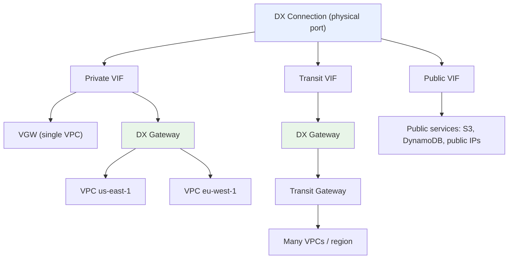
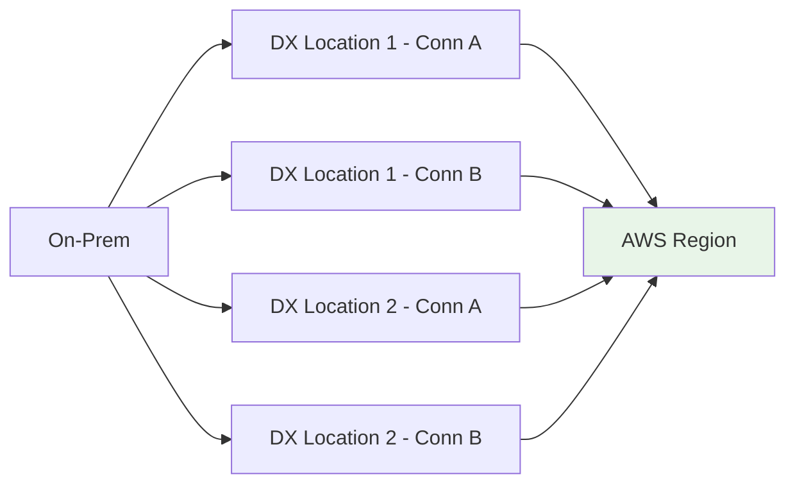

# Virtual Interfaces, Resiliency & DX Gateway - SAA-C03 Deep Dive

> A physical Direct Connect link is just the wire. **Virtual Interfaces (VIFs)** carry the traffic: **Private VIF** reaches VPCs, **Public VIF** reaches AWS public services, **Transit VIF** reaches Transit Gateway. **Direct Connect Gateway** fans one connection out to many VPCs across regions, and **resiliency** comes from multiple links across multiple DX locations.

See also: [01 - Direct Connect Fundamentals & Architecture](01%20-%20Direct%20Connect%20Fundamentals%20%26%20Architecture.md) · [03 - Direct Connect Exam Scenarios & Facts](03%20-%20Direct%20Connect%20Exam%20Scenarios%20%26%20Facts.md)

---

## Table of Contents

- [The Three Virtual Interface Types](#the-three-virtual-interface-types)
- [Private VIF Deep Dive](#private-vif-deep-dive)
- [Public VIF Deep Dive](#public-vif-deep-dive)
- [Transit VIF Deep Dive](#transit-vif-deep-dive)
- [Direct Connect Gateway (DXGW)](#direct-connect-gateway-dxgw)
- [Link Aggregation Groups (LAG)](#link-aggregation-groups-lag)
- [Resiliency Models (Single, High, Maximum)](#resiliency-models-single-high-maximum)
- [DX + VPN Backup](#dx--vpn-backup)
- [Encryption: MACsec vs IPsec over Public VIF](#encryption-macsec-vs-ipsec-over-public-vif)
- [Direct Connect vs Site-to-Site VPN](#direct-connect-vs-site-to-site-vpn)
- [Summary: Key Takeaways for SAA-C03](#summary-key-takeaways-for-saa-c03)

---



---

## The Three Virtual Interface Types

A **Virtual Interface (VIF)** is a BGP-routed logical connection (an 802.1Q VLAN) configured on top of a physical Direct Connect port. The physical fibre carries no traffic until at least one VIF is provisioned. You choose the VIF type based on **what you need to reach**.

| VIF Type | Reaches | Attaches To | Typical Use |
| :--- | :--- | :--- | :--- |
| **Private VIF** | Private IPs inside your VPC(s) | VGW (1 VPC) or DX Gateway (many VPCs) | App servers, databases, internal services |
| **Public VIF** | AWS **public** endpoints (S3, DynamoDB, public service APIs, public IPs) | AWS public region | Reach S3/DynamoDB privately over DX; IPsec endpoint for VPN-over-DX |
| **Transit VIF** | Transit Gateway (and everything attached to it) | DX Gateway → TGW | Hub-and-spoke to dozens/hundreds of VPCs |

> **Exam Tip:** Map the keyword to the VIF. "Reach my **VPC**" → Private VIF. "Reach **S3 / public AWS services** over DX" → Public VIF. "Reach **Transit Gateway / many VPCs at scale**" → Transit VIF.

Each VIF runs **BGP** to exchange routes. You supply an ASN and (optionally) an MD5 BGP authentication key. VIFs use VLAN tags, so a single dedicated connection can host **multiple VIFs of different types simultaneously** (e.g., one Private VIF + one Public VIF on the same 10 Gbps port).

[⬆ Back to top](#table-of-contents)

---

## Private VIF Deep Dive

A **Private VIF** gives you private-network reachability into one or more VPCs using **RFC 1918 private addressing** - your on-prem hosts talk to EC2 private IPs as if they were on the same network.

**Two ways to terminate a Private VIF:**

| Termination | Reaches | Notes |
| :--- | :--- | :--- |
| **Virtual Private Gateway (VGW)** | Exactly **one VPC** | Simple; VGW is attached to a single VPC |
| **Direct Connect Gateway (DXGW)** | **Many VPCs across many regions** | Global resource; associate multiple VGWs |

**Key behaviours:**

- You can advertise on-prem prefixes to AWS via BGP and receive VPC CIDR(s) back.
- Jumbo frames up to **9001 MTU** are supported on Private VIFs (and Transit VIFs at 8500).
- A Private VIF cannot reach public AWS endpoints (use a Public VIF or a Gateway Endpoint inside the VPC for that).

```bash
# Create a private VIF terminating on a Direct Connect Gateway
aws directconnect create-private-virtual-interface \
  --connection-id dxcon-abc123 \
  --new-private-virtual-interface '{
      "virtualInterfaceName": "prod-priv-vif",
      "vlan": 101,
      "asn": 65000,
      "directConnectGatewayId": "dxgw-0123456789abcdef0",
      "addressFamily": "ipv4"
  }'
```

[⬆ Back to top](#table-of-contents)

---

## Public VIF Deep Dive

A **Public VIF** lets you reach AWS **public service endpoints over the Direct Connect link instead of the internet** - for example pulling/pushing large objects to **S3** or querying **DynamoDB** using their public endpoints, but with DX's consistent latency and lower data-transfer-out pricing.

**Important facts:**

- A Public VIF reaches **public IP space** in AWS (S3, DynamoDB, public APIs, EC2 public IPs, even other regions' public endpoints).
- It does **NOT** reach private VPC resources.
- You must use **public IP addresses** (your own/BYOIP or AWS-assigned /31s) for the BGP peering.
- AWS advertises **all AWS public prefixes** to you by default; you can filter with BGP communities.
- A Public VIF is also the foundation for **IPsec VPN over Direct Connect** - you build a Site-to-Site VPN whose tunnel rides across the Public VIF to add encryption.

> **Exam Trap:** "Access S3 privately/without internet" has TWO valid answers depending on context. Over **Direct Connect** → **Public VIF**. From **inside a VPC** with no DX → **Gateway VPC Endpoint**. Read whether on-prem/DX is involved.

[⬆ Back to top](#table-of-contents)

---

## Transit VIF Deep Dive

A **Transit VIF** connects a Direct Connect connection (via a **Direct Connect Gateway**) to one or more **Transit Gateways**, giving on-prem access to every VPC attached to the TGW hub.

| Aspect | Detail |
| :--- | :--- |
| **Attaches to** | Direct Connect Gateway → Transit Gateway association |
| **Connection speed** | Recommended on **1 Gbps or higher** connections |
| **TGWs per DXGW** | Up to 3 Transit Gateways can associate with one DXGW |
| **Scale** | Reach hundreds of VPCs through the TGW without a VIF per VPC |
| **vs Private VIF + DXGW** | Private VIF+DXGW connects VPCs directly (no TGW); Transit VIF routes through the TGW hub |

> **Exam Tip:** "Single Direct Connect must reach **many VPCs across accounts/regions through a central hub**" → **Transit VIF + DX Gateway + Transit Gateway**.

[⬆ Back to top](#table-of-contents)

---

## Direct Connect Gateway (DXGW)

A **Direct Connect Gateway** is a **global** (not region-bound) resource that decouples your physical DX connection/VIF from the VPCs it serves. One VIF to a DXGW can serve **VPCs in any AWS region** (except China).

**What DXGW solves:**

- A VGW is tied to a single VPC in a single region. Without DXGW you'd need a separate VIF per VPC.
- DXGW lets **one Private VIF** reach **multiple VPCs in multiple regions** by associating multiple VGWs to the gateway.
- DXGW lets a **Transit VIF** reach **multiple Transit Gateways**.

| Capability | DX Gateway |
| :--- | :--- |
| **Scope** | Global (cross-region), single AWS account (shareable via associations) |
| **Associations** | Multiple VGWs (Private VIF) or up to 3 TGWs (Transit VIF) |
| **Cross-region** | Yes - reach a VPC in eu-west-1 from a DX location in us-east-1 |
| **VPC-to-VPC transit** | **No** - DXGW does not allow VPCs associated to it to talk to each other (use TGW for that) |
| **Cost** | No charge for the gateway object itself |

> **Exam Trap:** DX Gateway does **NOT** enable VPC-to-VPC communication. It only connects on-prem (via DX) to the VPCs. If VPCs must talk to each other, use a **Transit Gateway**.

[⬆ Back to top](#table-of-contents)

---

## Link Aggregation Groups (LAG)

A **LAG** bundles multiple physical Direct Connect connections into a single logical, higher-bandwidth connection using **LACP**.

| LAG Fact | Detail |
| :--- | :--- |
| **Purpose** | Aggregate bandwidth and treat links as one managed connection |
| **Member uniformity** | All connections must be the **same speed** (e.g., all 10 Gbps) |
| **Max members** | Up to **4** connections (≤ 10 Gbps each) or 2 (100 Gbps) per LAG |
| **Same location** | All members must terminate at the **same DX location / device** |
| **Resiliency caveat** | A LAG is **NOT** a resiliency strategy by itself - all links share one location |

> **Exam Trap:** LAG increases **bandwidth**, not **resiliency** - every member ends at the same DX location, so a location outage takes the whole LAG down. For resiliency you need links in **separate locations**.

[⬆ Back to top](#table-of-contents)

---

## Resiliency Models (Single, High, Maximum)

A single DX connection is a single point of failure (the port, the cross-connect, the location). AWS defines named resiliency models that the exam loves.

| Model | Topology | Survives | SLA Target |
| :--- | :--- | :--- | :--- |
| **No / Development** | 1 connection, 1 location | Nothing (best-effort) | None |
| **High Resiliency** | 2 connections at **2 different DX locations** | Loss of one DX **location** or one device | 99.9% |
| **Maximum Resiliency** | 2 connections at **each** of 2 locations (separate devices) | Device + location failures concurrently | 99.99% |



> **Exam Tip:** Maximum resiliency for **critical workloads** = connections at **two separate DX locations**, with redundant devices/connections at each. Two ports in the **same** location is NOT high resiliency.

[⬆ Back to top](#table-of-contents)

---

## DX + VPN Backup

A common cost-effective resiliency pattern is a **single Direct Connect** as the primary path with a **Site-to-Site VPN** over the internet as **backup**.

| Pattern | Primary | Backup | Trade-off |
| :--- | :--- | :--- | :--- |
| **DX + VPN backup** | Direct Connect | IPsec VPN over internet | Cheap failover; backup has variable internet latency |
| **DX + DX** | Direct Connect | Second Direct Connect | Consistent perf on failover; higher cost |

**How failover works:**

- Both paths advertise routes via BGP; DX is preferred while up.
- If DX fails, BGP withdraws its routes and traffic shifts to the VPN tunnel automatically.
- See [01 - Site-to-Site VPN Fundamentals & Architecture](01%20-%20Site-to-Site%20VPN%20Fundamentals%20%26%20Architecture.md) for the VPN side.

> **Exam Tip:** "Need DX **plus a cheaper resilient failover**" → add a **Site-to-Site VPN as backup**. "Need failover with the **same consistent performance**" → add a **second Direct Connect** in another location.

[⬆ Back to top](#table-of-contents)

---

## Encryption: MACsec vs IPsec over Public VIF

Direct Connect is **private but not encrypted by default**. Two ways to add encryption:

| Method | Layer | Where | Notes |
| :--- | :--- | :--- | :--- |
| **MACsec** | Layer 2 | On the DX link itself | Line-rate encryption; only on **dedicated 10/100 Gbps** connections at supported locations |
| **IPsec VPN over Public VIF** | Layer 3 | Site-to-Site VPN tunnel riding a Public VIF | Encrypts traffic to a VGW/TGW; works on any speed |

**Common exam answer:** To get **both** private connectivity **and** encryption for compliance, run a **Site-to-Site VPN over a Public VIF** (sometimes via a Transit Gateway). MACsec is the higher-end Layer-2 option when available.

> **Exam Trap:** "Direct Connect is secure, so traffic is encrypted" is **FALSE**. DX is private/isolated but plaintext unless you add **MACsec** or **IPsec**.

[⬆ Back to top](#table-of-contents)

---

## Direct Connect vs Site-to-Site VPN

| Attribute | Direct Connect | Site-to-Site VPN |
| :--- | :--- | :--- |
| **Path** | Private dedicated physical link | Encrypted tunnel over public internet |
| **Setup time** | **Weeks to months** (physical provisioning) | **Minutes** |
| **Bandwidth** | Up to 100 Gbps, consistent | Up to ~1.25 Gbps per tunnel, variable |
| **Latency / jitter** | **Low and consistent** | Variable (internet-dependent) |
| **Encryption** | **Not by default** (add MACsec/IPsec) | **Encrypted by default** (IPsec) |
| **Cost** | Higher (port-hours + cross-connect) | Low (hourly tunnel + data) |
| **Best for** | Large, steady throughput; consistent perf; hybrid | Quick, cheap, encrypted; backup for DX |

> **Exam Tip:** Decision shortcut - **consistent low latency / large throughput / dedicated** → **Direct Connect**. **Fast to deploy / encrypted out of the box / cheap** → **VPN**. **Both** → **VPN over DX**. Compare with [01 - Transit Gateway Fundamentals & Architecture](01%20-%20Transit%20Gateway%20Fundamentals%20%26%20Architecture.md) for hub routing.

[⬆ Back to top](#table-of-contents)

---

## Summary: Key Takeaways for SAA-C03

| Concept | What You Must Know |
| :--- | :--- |
| **Private VIF** | Reaches VPC private IPs via VGW (1 VPC) or DXGW (many) |
| **Public VIF** | Reaches AWS **public** endpoints (S3, DynamoDB) over DX |
| **Transit VIF** | Reaches **Transit Gateway** via DXGW; for many VPCs at scale |
| **DX Gateway** | Global; one VIF to many VPCs/regions; **no VPC-to-VPC** transit |
| **LAG** | Bundles links for **bandwidth**, not resiliency (same location) |
| **High resiliency** | 2 connections at **2 separate DX locations** (99.9%) |
| **Maximum resiliency** | Redundant connections at **each** of 2 locations (99.99%) |
| **DX + VPN backup** | Cheapest resilient failover for a single DX |
| **Encryption** | DX not encrypted by default → add **MACsec** (L2) or **IPsec over Public VIF** (L3) |

[⬆ Back to top](#table-of-contents)

---
