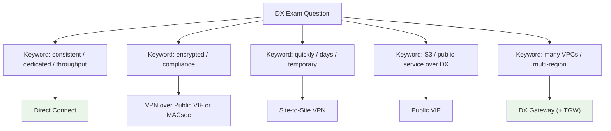

# Direct Connect Exam Scenarios & Facts - SAA-C03 Deep Dive

> The SAA-C03 exam tests Direct Connect through **keyword-to-answer** mapping: consistent low latency/large throughput → DX, encrypted → DX+VPN or MACsec, fast setup → VPN, reach S3 over DX → Public VIF, reach many VPCs/regions → DX Gateway. This file drills the scenarios and the must-memorise facts.

See also: [01 - Direct Connect Fundamentals & Architecture](01%20-%20Direct%20Connect%20Fundamentals%20%26%20Architecture.md) · [02 - Virtual Interfaces, Resiliency & DX Gateway](02%20-%20Virtual%20Interfaces%2C%20Resiliency%20%26%20DX%20Gateway.md)

---

## Table of Contents

- [How to Read a DX Exam Question](#how-to-read-a-dx-exam-question)
- [Scenario 1: Consistent Low Latency for Large Transfers](#scenario-1-consistent-low-latency-for-large-transfers)
- [Scenario 2: Encryption Requirement over DX](#scenario-2-encryption-requirement-over-dx)
- [Scenario 3: Need Connectivity Fast](#scenario-3-need-connectivity-fast)
- [Scenario 4: Access S3 Privately Over DX](#scenario-4-access-s3-privately-over-dx)
- [Scenario 5: One Connection, Many VPCs and Regions](#scenario-5-one-connection-many-vpcs-and-regions)
- [Scenario 6: Maximum Resiliency for Critical Workloads](#scenario-6-maximum-resiliency-for-critical-workloads)
- [Scenario 7: Cheap Resilient Failover](#scenario-7-cheap-resilient-failover)
- [Scenario 8: VPC-to-VPC Over DX Gateway](#scenario-8-vpc-to-vpc-over-dx-gateway)
- [Keyword to Answer Quick Table](#keyword-to-answer-quick-table)
- [Important Facts Cheat Sheet](#important-facts-cheat-sheet)
- [Summary: Key Takeaways for SAA-C03](#summary-key-takeaways-for-saa-c03)

---

---

## How to Read a DX Exam Question

Direct Connect questions almost always hinge on **one or two keywords** in the requirement. Train yourself to scan for them before reading the answer options.

| If the question stresses... | It is steering you toward... |
| :--- | :--- |
| Consistent / predictable latency, dedicated bandwidth | Direct Connect |
| "As fast as possible", "within hours", temporary | Site-to-Site VPN (DX takes weeks) |
| Encryption, in-transit confidentiality, compliance | VPN over Public VIF, or MACsec |
| S3 / DynamoDB / public endpoints **from on-prem over DX** | Public VIF |
| Reach many VPCs / many regions / central hub | DX Gateway (+ Transit VIF/TGW) |
| Survive a DX **location** failure | Connections at 2+ DX locations |

> **Exam Tip:** When two answers both "work", pick the one that matches the **emphasised constraint** (time-to-deploy, cost, encryption, or performance). DX and VPN are frequently played against each other on exactly that axis.

[⬆ Back to top](#table-of-contents)

---

## Scenario 1: Consistent Low Latency for Large Transfers

**Question:** A media company transfers **multiple terabytes daily** from its data center to S3 and runs a latency-sensitive hybrid app. Internet-based VPN gives inconsistent performance. What should they use?

**Answer:** **AWS Direct Connect.** A dedicated physical link delivers consistent low latency and high, predictable bandwidth, and **data-transfer-out pricing over DX is lower** than over the internet - ideal for sustained large transfers.

**Why not VPN:** VPN rides the public internet, so latency/throughput vary and it caps around ~1.25 Gbps per tunnel.

> **Exam Trap:** For a **one-time** petabyte-scale migration with no ongoing hybrid need, **AWS Snowball** may beat DX - DX still needs weeks to provision. DX wins for **ongoing** steady transfer.

[⬆ Back to top](#table-of-contents)

---

## Scenario 2: Encryption Requirement over DX

**Question:** A bank requires all traffic between on-prem and AWS to be **encrypted in transit** and wants the **private, consistent** characteristics of Direct Connect. What design meets both?

**Answer:** Run a **Site-to-Site VPN (IPsec) over a Public VIF** on the Direct Connect connection (terminating on a VGW or Transit Gateway). This combines DX's private path with IPsec encryption. On supported **dedicated 10/100 Gbps** links, **MACsec** is the alternative for Layer-2 line-rate encryption.

**Why DX alone fails:** Direct Connect is **private but not encrypted by default** - it does not satisfy an explicit encryption-in-transit control on its own.

[⬆ Back to top](#table-of-contents)

---

## Scenario 3: Need Connectivity Fast

**Question:** A startup needs **secure hybrid connectivity within a few days** for a project and has no existing DX. What is the best fit?

**Answer:** **AWS Site-to-Site VPN.** It deploys in minutes and is encrypted by default. Direct Connect requires physical cross-connect provisioning that **takes weeks to months**, so it cannot meet a "few days" requirement.

> **Exam Tip:** Any phrase like "quickly", "immediately", "by next week", or "temporary" almost always rules **out** Direct Connect as the primary answer.

[⬆ Back to top](#table-of-contents)

---

## Scenario 4: Access S3 Privately Over DX

**Question:** A company already has Direct Connect for VPC access and now wants to reach **Amazon S3 over the same DX link** (not the internet) for backups. What do they configure?

**Answer:** A **Public VIF** on the Direct Connect connection. A Public VIF reaches AWS **public service endpoints** (S3, DynamoDB, public APIs) over DX with consistent performance and lower data-transfer-out cost.

**Why not Private VIF / Gateway Endpoint:** A Private VIF only reaches private VPC IPs. A **Gateway VPC Endpoint** is for access **from inside a VPC**, not for traffic arriving from on-prem over DX.

> **Exam Trap:** Watch the direction. **On-prem → S3 over DX = Public VIF.** **In-VPC → S3 with no internet = Gateway Endpoint.** See [01 - PrivateLink & VPC Endpoints Deep Dive](01%20-%20PrivateLink%20%26%20VPC%20Endpoints%20Deep%20Dive.md).

[⬆ Back to top](#table-of-contents)

---

## Scenario 5: One Connection, Many VPCs and Regions

**Question:** An enterprise has **one Direct Connect** connection and needs on-prem to reach **VPCs in us-east-1 and eu-west-1** without ordering more connections. What enables this?

**Answer:** A **Direct Connect Gateway**. A single Private VIF to a DXGW can associate VGWs from **multiple VPCs in multiple regions** (cross-region), so one connection serves all of them. For reaching **many** VPCs through a hub, use a **Transit VIF → DXGW → Transit Gateway**.

> **Exam Tip:** "Single DX, multiple regions/VPCs" → **DX Gateway**. Add **Transit Gateway** when the number of VPCs is large or they must also interconnect.

[⬆ Back to top](#table-of-contents)

---

## Scenario 6: Maximum Resiliency for Critical Workloads

**Question:** A healthcare workload over Direct Connect must survive **both a device failure and a full DX location outage**. What topology?

**Answer:** **Maximum resiliency** - **redundant connections at each of two separate DX locations** (with separate devices), terminating on separate routers on-prem. Targets a **99.99%** SLA.

**Why not LAG / two ports same location:** A LAG or two ports in **one** location share that location's fate - a location outage drops everything. Resiliency requires **geographically separate DX locations**.

[⬆ Back to top](#table-of-contents)

---

## Scenario 7: Cheap Resilient Failover

**Question:** A company runs a single Direct Connect and wants **resilient failover at the lowest cost**, accepting reduced performance during failover. What do they add?

**Answer:** A **Site-to-Site VPN over the internet as a backup** path. BGP prefers DX while up and automatically fails over to the VPN if DX drops. Much cheaper than a second DX, with the trade-off of variable internet performance during failover.

**Contrast:** If failover must keep the **same consistent performance**, add a **second Direct Connect** at another location instead.

[⬆ Back to top](#table-of-contents)

---

## Scenario 8: VPC-to-VPC Over DX Gateway

**Question:** Two VPCs are both associated to the same **Direct Connect Gateway**. The team expects them to communicate with each other through the DXGW. Why doesn't it work, and what fixes it?

**Answer:** A **DX Gateway does not provide VPC-to-VPC (transitive) routing** - it only connects on-prem (via DX) to each associated VPC. To let the VPCs talk to each other, use a **Transit Gateway** (or VPC peering), and connect DX to the TGW via a **Transit VIF**.

> **Exam Trap:** DXGW and VGW are **not transit devices**. Inter-VPC traffic needs **Transit Gateway** or **peering** - see [01 - Transit Gateway Fundamentals & Architecture](01%20-%20Transit%20Gateway%20Fundamentals%20%26%20Architecture.md) and [01 - VPC Fundamentals & Architecture](01%20-%20VPC%20Fundamentals%20%26%20Architecture.md).

[⬆ Back to top](#table-of-contents)

---

## Keyword to Answer Quick Table

| Question Says (keyword) | Pick This (answer) |
| :--- | :--- |
| Consistent low latency, large/steady throughput, dedicated | **Direct Connect** |
| Encrypted in transit + private path | **VPN over Public VIF** (or **MACsec** on dedicated 10/100G) |
| Quickly / within days / temporary / cheap | **Site-to-Site VPN** |
| Reach **S3 / DynamoDB / public services** over DX | **Public VIF** |
| Reach a **single VPC** privately over DX | **Private VIF → VGW** |
| Reach **many VPCs / multiple regions** over one DX | **Private VIF → DX Gateway** |
| Reach **many VPCs via a central hub** over DX | **Transit VIF → DX Gateway → Transit Gateway** |
| Survive a **DX location** outage | **Connections at 2 separate DX locations** (High/Max resiliency) |
| Cheapest resilient failover for one DX | **VPN backup over internet** |
| More **bandwidth** on one logical link, same location | **LAG (LACP)** |
| One-time petabyte migration, no hybrid need | **Snowball** (DX too slow to provision) |

[⬆ Back to top](#table-of-contents)

---

## Important Facts Cheat Sheet

| Fact | Value / Detail |
| :--- | :--- |
| **Encryption default** | DX is **NOT** encrypted by default (private only) |
| **Add encryption** | **MACsec** (L2, dedicated 10/100 Gbps) or **IPsec VPN over Public VIF** (L3) |
| **Dedicated port speeds** | 1, 10, 100 Gbps (50/100/200/400 Gbps at select locations) |
| **Hosted connection speeds** | Sub-1G: 50/100/200/300/400/500 Mbps + 1/2/5/10/25 Gbps via partner |
| **Provisioning lead time** | Weeks to months (physical cross-connect) |
| **Private VIF target** | VGW (1 VPC) or DX Gateway (many VPCs/regions) |
| **Public VIF target** | AWS public endpoints (S3, DynamoDB, public IPs) |
| **Transit VIF target** | DX Gateway → Transit Gateway (≤ 3 TGWs per DXGW) |
| **DX Gateway scope** | Global, cross-region; **no VPC-to-VPC transit** |
| **LAG** | LACP bundle, same speed, same location, up to 4 members; bandwidth not resiliency |
| **High resiliency SLA** | 99.9% (2 connections, 2 locations) |
| **Maximum resiliency SLA** | 99.99% (redundant connections at 2 locations) |
| **Jumbo frames** | 9001 MTU (Private VIF), 8500 (Transit VIF) |
| **Cost model** | Port-hours + data transfer out (lower DTO than internet) |
| **Routing protocol** | BGP on every VIF (with optional MD5 auth) |

[⬆ Back to top](#table-of-contents)

---

## Summary: Key Takeaways for SAA-C03

| Concept | What You Must Know |
| :--- | :--- |
| **DX vs VPN** | DX = consistent/dedicated/slow-to-deploy/not-encrypted; VPN = fast/cheap/encrypted/variable |
| **Encryption** | Add VPN over Public VIF or MACsec - DX alone is plaintext |
| **VIF mapping** | VPC → Private VIF; public services → Public VIF; TGW → Transit VIF |
| **DX Gateway** | One connection to many VPCs/regions; **no inter-VPC routing** |
| **Resiliency** | Separate **DX locations** matter; LAG ≠ resiliency |
| **Failover** | VPN backup = cheap; second DX = consistent performance |
| **Keyword discipline** | Match the emphasised constraint (time, cost, encryption, perf) to the answer |

[⬆ Back to top](#table-of-contents)

---
