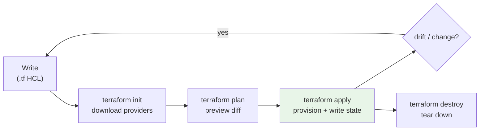

# Terraform Associate (003/004) - Exam Cheatsheet

> Rapid-revision sheet for the **HashiCorp Certified: Terraform Associate** exam. Covers all 9 objective domains: IaC concepts, Terraform basics, the core workflow, state, modules, configuration (HCL), provisioners/debugging, and HCP Terraform. ~57 questions, 1 hour, multiple-choice/multi-select/true-false.

See also: [TF concepts](TF%20concepts.md) · [TF CLI Tricks](TF%20CLI%20Tricks.md) · [TF Interview Prep](TF%20Interview%20Prep.md)

---

## Table of Contents

- [1. IaC Concepts](#1-iac-concepts)
- [2. Purpose of Terraform vs Other Tools](#2-purpose-of-terraform-vs-other-tools)
- [3. Terraform Basics & Providers](#3-terraform-basics--providers)
- [4. The Core Workflow (Write → Plan → Apply)](#4-the-core-workflow-write--plan--apply)
- [5. CLI Command Reference](#5-cli-command-reference)
- [6. State Management](#6-state-management)
- [7. Variables, Outputs & Locals](#7-variables-outputs--locals)
- [8. Resources, Data Sources & Meta-Arguments](#8-resources-data-sources--meta-arguments)
- [9. Built-in Functions & Expressions](#9-built-in-functions--expressions)
- [10. Modules](#10-modules)
- [11. Provisioners (Last Resort)](#11-provisioners-last-resort)
- [12. Provider & Module Versioning](#12-provider--module-versioning)
- [13. Workspaces](#13-workspaces)
- [14. HCP Terraform / Terraform Cloud](#14-hcp-terraform--terraform-cloud)
- [15. Debugging & Crash Logs](#15-debugging--crash-logs)
- [16. Exam Gotchas & Quick Facts](#16-exam-gotchas--quick-facts)

---



---

## 1. IaC Concepts

- **IaC** = manage and provision infrastructure through machine-readable definition files, not manual GUI/console clicks.
- **Benefits**: versioned (Git), repeatable, automated, self-documenting, reduces config drift, enables peer review.
- **Declarative** (Terraform, CloudFormation): you describe the _desired end state_; the tool figures out _how_. Idempotent.
- **Imperative** (scripts, Ansible-ish): you specify the _exact steps/commands_ to reach the state.
- Terraform is **declarative** and **cloud-agnostic** (multi-provider via plugins).

[⬆ Back to top](#table-of-contents)

---

## 2. Purpose of Terraform vs Other Tools

| Aspect   | Terraform                      | CloudFormation          | Ansible/Chef/Puppet   |
| -------- | ------------------------------ | ----------------------- | --------------------- |
| Scope    | **Provisioning** (multi-cloud) | Provisioning (AWS only) | **Config management** |
| Language | HCL (declarative)              | JSON/YAML               | YAML/DSL              |
| State    | Explicit state file            | Managed by AWS          | Mostly stateless      |

- **Provisioning vs Configuration Management**: Terraform _provisions_ infrastructure; tools like Ansible _configure_ software on existing infrastructure. They are complementary.
- **Provider ecosystem**: a single tool/workflow across AWS, Azure, GCP, Kubernetes, etc. via providers from the **Terraform Registry**.
- **State** lets Terraform map real-world resources to config, track metadata, and improve performance (plan diffing).

[⬆ Back to top](#table-of-contents)

---

## 3. Terraform Basics & Providers

- Written in **HCL** (HashiCorp Configuration Language); JSON syntax also valid (`.tf.json`).
- **Providers** are plugins that interact with APIs (aws, azurerm, google, kubernetes, random, null, tls...).
- Pin providers in a `required_providers` block; configure them in a `provider` block.

```hcl
terraform {
  required_version = ">= 1.5.0"
  required_providers {
    aws = {
      source  = "hashicorp/aws"   # namespace/type, fetched from registry
      version = "~> 5.0"
    }
  }
}

provider "aws" {
  region = "us-east-1"
}
```

- **Multiple provider configs** via `alias`; reference with `provider = aws.west` on a resource.
- `source` defaults to `registry.terraform.io/hashicorp/<name>` for HashiCorp providers.

[⬆ Back to top](#table-of-contents)

---

## 4. The Core Workflow (Write → Plan → Apply)

1. **Write** — author `.tf` config.
2. **`terraform init`** — initialize working dir: download providers/modules, configure backend. **Run first / after adding providers/modules/backend.**
3. **`terraform plan`** — dry run; shows `+` create, `-` destroy, `~` update in-place, `-/+` replace.
4. **`terraform apply`** — execute changes, update state. Prompts for approval (or `-auto-approve`).
5. **`terraform destroy`** — tear everything down.

- `terraform fmt` (format) and `terraform validate` (syntax/consistency) fit between write and plan.
- A **saved plan**: `terraform plan -out=tfplan` then `terraform apply tfplan` (applies exactly that plan, no re-prompt).

[⬆ Back to top](#table-of-contents)

---

## 5. CLI Command Reference

| Command                        | Purpose                                                                    |
| ------------------------------ | -------------------------------------------------------------------------- |
| `terraform init`               | Init dir, download providers/modules, set up backend                       |
| `terraform init -upgrade`      | Upgrade providers/modules to newest allowed versions                       |
| `terraform validate`           | Check config is syntactically valid & internally consistent (no API calls) |
| `terraform fmt`                | Rewrite config to canonical style (`-recursive`, `-check`, `-diff`)        |
| `terraform plan`               | Preview changes; `-out`, `-target`, `-var`, `-refresh-only`                |
| `terraform apply`              | Apply changes; `-auto-approve`, `-replace`, `-target`                      |
| `terraform destroy`            | Destroy managed infra (alias for `apply -destroy`)                         |
| `terraform show`               | Human-readable state or saved plan                                         |
| `terraform state list`         | List resources in state                                                    |
| `terraform state show <addr>`  | Show one resource's attributes                                             |
| `terraform state mv`           | Rename/move resource in state                                              |
| `terraform state rm`           | Remove resource from state (stops managing, doesn't destroy)               |
| `terraform state pull / push`  | Read / overwrite remote state manually                                     |
| `terraform import <addr> <id>` | Import existing infra into state                                           |
| `terraform output`             | Show output values; `-json`, `-raw`                                        |
| `terraform refresh`            | Reconcile state w/ real infra (deprecated → use `apply -refresh-only`)     |
| `terraform taint` / `untaint`  | Mark for recreation (deprecated → use `apply -replace=<addr>`)             |
| `terraform graph`              | DOT dependency graph                                                       |
| `terraform workspace ...`      | Manage workspaces (list/new/select/delete)                                 |
| `terraform login` / `logout`   | Auth to HCP Terraform / Terraform Cloud                                    |
| `terraform console`            | Interactive expression evaluation REPL                                     |
| `terraform version`            | Show Terraform & provider versions                                         |
| `terraform providers`          | Show provider requirements/tree                                            |
| `terraform force-unlock <id>`  | Manually release a stuck state lock                                        |

> Modern replacements to remember: `taint` → **`apply -replace=ADDR`**; `refresh` → **`apply -refresh-only`**. See [TF concepts](TF%20concepts.md) for the deprecated `taint` behavior. More CLI tips in [TF CLI Tricks](TF%20CLI%20Tricks.md).

[⬆ Back to top](#table-of-contents)

---

## 6. State Management

- State file (`terraform.tfstate`) maps config → real resources, stores metadata & dependencies, caches attributes.
- **Sensitive data** (passwords, keys) is stored in state **in plain text** → protect it; never commit to Git.
- **Local backend** = `terraform.tfstate` on disk (default). **Remote backend** = shared, supports locking & encryption.

**Common backends**: `s3` (+ DynamoDB or S3-native lockfile for locking), `azurerm`, `gcs`, `remote`/`cloud` (HCP Terraform), `consul`, `http`.

```hcl
terraform {
  backend "s3" {
    bucket         = "my-tf-state"
    key            = "prod/terraform.tfstate"
    region         = "us-east-1"
    dynamodb_table = "tf-locks"   # state locking
    encrypt        = true
  }
}
```

- **State locking** prevents concurrent writes/corruption. Auto on supported backends. Not all backends support it.
- **`terraform_remote_state`** data source reads outputs from another state file (sharing data between configs).
- Changing backends → `terraform init` will offer to **migrate** state.
- Never hand-edit `tfstate`; use `terraform state` subcommands.

[⬆ Back to top](#table-of-contents)

---

## 7. Variables, Outputs & Locals

**Input variables** (`variable`):

```hcl
variable "instance_count" {
  type        = number
  default     = 2
  description = "How many instances"
  sensitive   = false
  validation {
    condition     = var.instance_count > 0
    error_message = "Must be positive."
  }
}
```

- Types: `string`, `number`, `bool`, `list()`, `set()`, `map()`, `object({})`, `tuple([])`, `any`.
- **Sensitive** vars are redacted in CLI output (still plain text in state).
- **Variable precedence** (low → high, last wins):
  1. Environment vars `TF_VAR_name`
  2. `terraform.tfvars`
  3. `terraform.tfvars.json`
  4. `*.auto.tfvars` / `*.auto.tfvars.json` (alphabetical)
  5. `-var` and `-var-file` on the CLI (**highest**)

**Outputs**: expose values (and surface module data to the parent).

```hcl
output "ip" {
  value     = aws_instance.web.public_ip
  sensitive = true
}
```

**Locals**: named expressions, computed once, DRY. `local.name` (singular when referenced).

```hcl
locals {
  common_tags = { Env = "prod", Owner = "team" }
}
```

[⬆ Back to top](#table-of-contents)

---

## 8. Resources, Data Sources & Meta-Arguments

- **Resource**: `resource "aws_instance" "web" {}` → address `aws_instance.web`. Creates/manages infra.
- **Data source**: `data "aws_ami" "ubuntu" {}` → reads existing/external info, read-only. Reference: `data.aws_ami.ubuntu.id`.

**Meta-arguments** (work on most resources):

| Meta-arg     | Purpose                                                                               |
| ------------ | ------------------------------------------------------------------------------------- |
| `depends_on` | Explicit dependency when not inferred from references                                 |
| `count`      | Create N copies; index `count.index`; address `res[0]`                                |
| `for_each`   | Create instances from a **map or set**; `each.key`/`each.value`; address `res["key"]` |
| `provider`   | Pick a non-default (aliased) provider                                                 |
| `lifecycle`  | Control create/destroy behavior                                                       |

**`lifecycle` block**:

- `create_before_destroy = true` — make new before killing old (avoid downtime).
- `prevent_destroy = true` — block accidental destroy.
- `ignore_changes = [tags]` — ignore drift on listed attributes.
- `replace_triggered_by = [...]` — force replace when a referenced thing changes.

> **count vs for_each**: use `for_each` when items have stable identities (map/set) so removing one doesn't reindex/recreate others. `count` reindexes on removal.

**Dependencies**: Terraform builds a dependency graph automatically from references (**implicit**); use `depends_on` only for hidden/**explicit** dependencies.

[⬆ Back to top](#table-of-contents)

---

## 9. Built-in Functions & Expressions

- Terraform has **only built-in functions** — you cannot define custom functions.
- Test them live with **`terraform console`**.

| Category     | Examples                                                                                                       |
| ------------ | -------------------------------------------------------------------------------------------------------------- |
| String       | `lower`, `upper`, `format`, `join`, `split`, `replace`, `substr`, `trimspace`                                  |
| Collection   | `length`, `element`, `lookup`, `keys`, `values`, `merge`, `concat`, `contains`, `flatten`, `distinct`, `toset` |
| Numeric      | `min`, `max`, `abs`, `ceil`, `floor`                                                                           |
| Encoding     | `jsonencode`, `jsondecode`, `base64encode`, `yamlencode`                                                       |
| Filesystem   | `file`, `templatefile`, `fileexists`, `pathexpand`                                                             |
| Type/convert | `tostring`, `tolist`, `tomap`, `tonumber`, `try`, `can`                                                        |
| Date/crypto  | `timestamp`, `formatdate`, `uuid`, `md5`, `sha256`, `bcrypt`                                                   |

**Expressions**:

- Conditional (ternary): `condition ? true_val : false_val`
- Splat: `aws_instance.web[*].id`
- `for` expression: `[for s in var.list : upper(s)]` / `{ for k, v in map : k => v }`
- Dynamic blocks: generate repeatable nested blocks:

```hcl
dynamic "ingress" {
  for_each = var.ports
  content {
    from_port = ingress.value
    to_port   = ingress.value
    protocol  = "tcp"
  }
}
```

- Heredoc strings: `<<EOT ... EOT` (or `<<-EOT` for indented).

[⬆ Back to top](#table-of-contents)

---

## 10. Modules

- A **module** = any directory containing `.tf` files. The **root module** = your working dir.
- **Child module**: called via a `module` block; reused, versioned, sourced locally or remotely.

```hcl
module "vpc" {
  source  = "terraform-aws-modules/vpc/aws"
  version = "5.0.0"
  cidr    = "10.0.0.0/16"   # input variable of the module
}
# reference module output:  module.vpc.vpc_id
```

- **Inputs** = the module's `variable`s; **Outputs** = the module's `output`s (only way parent reads internal values).
- **`source` types**: local path (`./modules/x`), Terraform Registry (`namespace/name/provider`), Git (`git::https://...`), GitHub, HTTP, S3/GCS.
- **`version`** only allowed with registry-based sources (not local paths).
- Module best practices: keep small/focused, use semantic versions, publish to a registry, pass providers explicitly when needed (`providers = {}`).
- Public modules live at **registry.terraform.io**; private modules in **HCP Terraform private registry**.

[⬆ Back to top](#table-of-contents)

---

## 11. Provisioners (Last Resort)

- **Use sparingly** — HashiCorp recommends provisioners as a **last resort** (they break the declarative model and aren't tracked well in state).
- **Types**: `local-exec` (run on the machine running Terraform), `remote-exec` (run on the new resource, needs a `connection` block), `file` (copy files).
- **Creation-time** (default) vs **destroy-time** (`when = destroy`).
- `on_failure = continue | fail` (default `fail`).
- `null_resource` (+ `triggers`) or `terraform_data` runs provisioners without a real resource.

```hcl
resource "aws_instance" "web" {
  provisioner "local-exec" {
    command = "echo ${self.private_ip} >> ips.txt"
  }
}
```

> Prefer cloud-init / `user_data` / configuration management over provisioners when possible.

[⬆ Back to top](#table-of-contents)

---

## 12. Provider & Module Versioning

**Version constraint operators**:

| Operator            | Meaning                                                |
| ------------------- | ------------------------------------------------------ |
| `= 1.2.0` / `1.2.0` | Exactly this version                                   |
| `!= 1.2.0`          | Any except this                                        |
| `> , >= , < , <=`   | Comparison                                             |
| `~> 1.2.0`          | **Pessimistic**: `>= 1.2.0` and `< 1.3.0` (only patch) |
| `~> 1.2`            | `>= 1.2.0` and `< 2.0.0` (minor + patch)               |

- **`.terraform.lock.file`** (`.terraform.lock.hcl`) — the **dependency lock file**; pins exact provider versions + checksums. **Commit it to VCS.** Updated by `init`/`init -upgrade`.
- `required_version` (in `terraform {}`) constrains the **Terraform CLI** version.
- Providers download into `.terraform/` (don't commit that directory).

[⬆ Back to top](#table-of-contents)

---

## 13. Workspaces

- **CLI workspaces** let one config manage **multiple state files** (e.g. dev/staging/prod) using the same backend.
- Default workspace is named **`default`** (cannot be deleted).
- Current workspace in config via `terraform.workspace`.

```bash
terraform workspace list
terraform workspace new dev
terraform workspace select dev
terraform workspace show
terraform workspace delete dev
```

> Local backend stores non-default workspaces under `terraform.tfstate.d/<name>/`. Workspaces are **not** a strong isolation boundary (same backend/credentials) — for strong separation use separate configs/backends. **HCP Terraform workspaces** are a different, richer concept (each is like a separate working dir with its own state, variables, runs).

[⬆ Back to top](#table-of-contents)

---

## 14. HCP Terraform / Terraform Cloud

- **HCP Terraform** (formerly Terraform Cloud) — managed service: remote state, remote runs, locking, VCS-driven workflows, team collaboration.
- **Remote state** stored & encrypted; state locking automatic.
- **Remote operations**: `plan`/`apply` run on HCP, not your laptop. Two execution modes: **remote** and **local**.
- **Run workflows**: **CLI-driven**, **VCS-driven** (auto-plan on PR/commit), **API-driven**.
- **Sentinel** = policy as code (governance/guardrails); **OPA** also supported. (Note: Sentinel is a paid feature.)
- **Private registry** for sharing internal modules/providers.
- **Workspaces** in HCP = isolated environments with their own state, variables, and run history.
- **Variable sets** share variables across workspaces; mark **sensitive**/**environment** (`env`) vs **terraform** variables.
- Connect the CLI with **`terraform login`**; reference via the `cloud {}` block or `remote` backend.

```hcl
terraform {
  cloud {
    organization = "my-org"
    workspaces { name = "prod" }
  }
}
```

**Editions**: Free, Standard, Plus (+ self-hosted **Terraform Enterprise**).

[⬆ Back to top](#table-of-contents)

---

## 15. Debugging & Crash Logs

- **`TF_LOG`** env var sets log verbosity: `TRACE` (most), `DEBUG`, `INFO`, `WARN`, `ERROR`.
- **`TF_LOG_PATH`** writes logs to a file (e.g. `export TF_LOG_PATH=./tf.log`).
- A panic produces a **`crash.log`** in the working dir.
- `terraform validate` catches config errors early (no provider API calls); `terraform fmt` fixes style.

[⬆ Back to top](#table-of-contents)

---

## 16. Exam Gotchas & Quick Facts

- **`init` is required** after: first write, adding/changing providers, adding/changing modules, changing the backend.
- `validate` does **not** access remote APIs or state; it only checks config consistency.
- `plan` does **not** modify infra or state (it may refresh state in memory).
- Secrets live in **plain text** in state and plan files → secure the backend, restrict access.
- **Lock file** (`.terraform.lock.hcl`) → commit. **`.terraform/` dir & `*.tfstate`** → don't commit.
- `~>` = pessimistic ("allow rightmost digit to increment").
- **Implicit dependencies** (references) are preferred; **`depends_on`** only for hidden ones.
- `for_each` needs a **map or set of strings**; `count` needs a **number**. Can't use both on one resource.
- Provisioners = **last resort**; `local-exec` runs locally, `remote-exec` runs on the resource.
- `terraform_remote_state` shares outputs across configurations.
- `terraform import` brings existing resources under management (you still must write matching config; newer Terraform supports `import {}` blocks for plannable imports).
- Modules: `version` only with **registry** sources; outputs are the only way the parent reads child internals.
- `terraform state rm` stops managing a resource **without destroying** it.
- Replace a resource: `terraform apply -replace=ADDR` (modern `taint`).
- A **saved plan file** applies exactly as shown, with no extra approval prompt.
- Workspaces share one backend/credentials → weak isolation; use separate configs for strong isolation.
- Sentinel/OPA = **policy as code** in HCP Terraform.

[⬆ Back to top](#table-of-contents)
