### Question 1

A company is hosting its web application in an Auto Scaling group of Amazon EC2 instances behind an Application Load Balancer. Recently, the Solutions Architect identified a series of SQL injection attempts and cross-site scripting attacks to the application, which had adversely affected its production data.

Which of the following should the Architect implement to mitigate this kind of attack?

**Answer:**

Set up security rules that block SQL injection and cross-site scripting attacks in AWS Web Application Firewall (AWS WAF). Associate the rules to the Application Load Balancer.

**Overall Explanation:**

SQL injection and cross-site scripting (XSS) are application-layer (OSI Layer 7) attacks: the malicious payload is hidden inside the body, headers, query string, or cookies of an otherwise normal HTTP/HTTPS request. To block them you need a control that can actually parse the request and match its contents against attack signatures, which is precisely what **AWS WAF (Web Application Firewall)** does. WAF attaches a Web ACL to a CloudFront distribution, API Gateway, AppSync API, or an Application Load Balancer and inspects every request before it reaches the backend. AWS even ships managed rule groups (such as the SQL database and Known Bad Inputs sets) that recognize these exact patterns, so any request that matches a block rule is answered with an HTTP 403 (Forbidden) and never touches the EC2 fleet. Since the application here already sits behind an ALB, attaching a WAF Web ACL to that ALB is the direct fix.

A WAF rule can run in one of three modes: allow everything except what you specify, block everything except what you specify, or simply count matches (a safe way to validate a rule in production before enforcing it). For this scenario you create block rules for SQLi and XSS and associate them with the ALB.

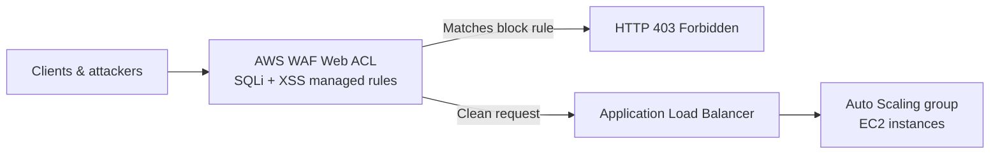

Hence, the correct answer is: **Set up security rules that block SQL injection and cross-site scripting attacks in AWS Web Application Firewall (AWS WAF). Associate the rules to the Application Load Balancer.**

**Why the other options are wrong:**

- **Using AWS X-Ray to detect and block SQL injection and cross-site scripting attacks** is incorrect. X-Ray is a distributed tracing and observability tool used to profile latency and debug request paths across microservices. It is read-only telemetry; it cannot inspect request payloads for attack signatures, and it has no enforcement (block) capability whatsoever.
- **Using AWS Firewall Manager to set up security rules ... then associating the rules to the Application Load Balancer** is incorrect. Firewall Manager is a central management layer for applying WAF, Shield Advanced, and security-group policies across many accounts in an AWS Organization. It does not inspect traffic itself; the actual SQLi/XSS filtering is still performed by AWS WAF. For a single ALB it adds needless overhead, and the wording implies Firewall Manager does the blocking, which it does not.
- **Blocking all the IP addresses where the attacks originated using the Network Access Control List** is incorrect. A NACL is a stateless, subnet-level filter operating at Layers 3/4 (IP, port, protocol). It cannot read HTTP payloads, so it cannot tell a malicious SQLi request from a legitimate one arriving on the same port (443). Attackers also rotate source IPs, making IP blocklists ineffective.

**References:**

[https://aws.amazon.com/waf/](https://aws.amazon.com/waf/)

[https://docs.aws.amazon.com/waf/latest/developerguide/what-is-aws-waf.html](https://docs.aws.amazon.com/waf/latest/developerguide/what-is-aws-waf.html)

**Domain:** Design Secure Architectures

----

### Question 2

A company has a static corporate website hosted in a standard Amazon S3 bucket and a new web domain name that was registered using Amazon Route 53. There is a requirement to integrate these two services in order to successfully launch the corporate website.

What are the prerequisites when routing traffic using Route 53 to a website that is hosted in an S3 Bucket? (Select TWO.)

**Answer:**

- A registered domain name
- The S3 bucket name must be the same as the domain name.

**Overall Explanation:**

To serve a static website from S3 through a custom domain, Route 53 uses an **alias record** that points the domain (the apex/root, e.g. `example.com`) at the S3 website endpoint. For this aliasing to work, S3 imposes a specific naming rule, and Route 53 needs a domain it can actually manage.

Two prerequisites must be satisfied:

- **A registered domain name** — Route 53 can only route traffic for a domain it hosts in a hosted zone. Without a registered domain (and a corresponding hosted zone), there is no DNS namespace to attach the alias record to.
- **The S3 bucket name must match the domain name exactly** — S3 website endpoints derive the hostname from the bucket name. To answer requests for `example.com`, the bucket must be named `example.com`. If the names differ, the S3 website endpoint will not respond to that host header and the site fails to resolve.

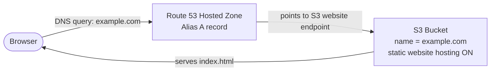

**Why the other options are wrong:**

- **The record set must be of type "MX"** — An MX record only directs incoming email to a mail server; it has nothing to do with serving web pages. Web routing to an S3 site uses an alias A record, not MX.
- **The S3 bucket must be in the same region as the hosted zone** — Route 53 is a global service and a hosted zone is not tied to a region in a way that constrains the bucket. The bucket can live in any region; the alias simply targets that region's S3 website endpoint.
- **CORS must be enabled on the S3 bucket** — CORS only matters when scripts loaded from one origin request resources from a different origin. Serving a static site under its own domain is same-origin, so CORS is irrelevant here.

**References:**

[https://docs.aws.amazon.com/Route53/latest/DeveloperGuide/RoutingToS3Bucket.html](https://docs.aws.amazon.com/Route53/latest/DeveloperGuide/RoutingToS3Bucket.html)

[https://docs.aws.amazon.com/Route53/latest/DeveloperGuide/Welcome.html](https://docs.aws.amazon.com/Route53/latest/DeveloperGuide/Welcome.html)

**Domain:** Design Resilient Architectures

---

### Question 3

A company plans to migrate its suite of containerized applications running on-premises to a container service in AWS. The solution must be cloud-agnostic and use an open-source platform that can automatically manage containerized workloads and services. It should also use the same configuration and tools across various production environments.

What should the Solution Architect do to properly migrate and satisfy the given requirement?

**Answer:**

Migrate the application to Amazon Elastic Kubernetes Service with Amazon EKS worker nodes.

**Overall Explanation:**

The decisive phrase in the scenario is "cloud-agnostic" and "open-source platform." That points directly to **Kubernetes**, and on AWS the managed Kubernetes offering is **Amazon Elastic Kubernetes Service (EKS)**.

EKS runs the upstream, unmodified open-source Kubernetes API. Because of that, the same manifests, Helm charts, kubectl tooling, and community plugins work identically whether the cluster runs on-premises, on EKS, or on another provider's managed Kubernetes. That portability is exactly what "cloud-agnostic" and "use the same configuration and tools across environments" demand: a workload can be lifted and shifted to Azure AKS or Google GKE without rewriting application code. EKS also runs the control plane (API servers and etcd) across multiple Availability Zones, auto-replacing unhealthy control plane nodes, and integrates with IAM, VPC, ELB, and CloudTrail.

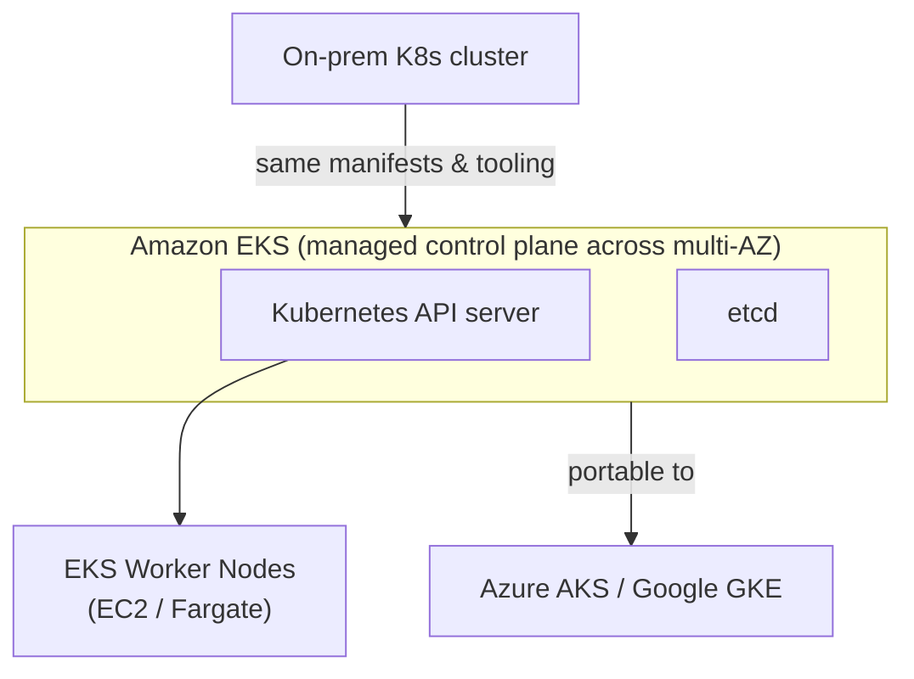

The decision comes down to open-source vs. proprietary:

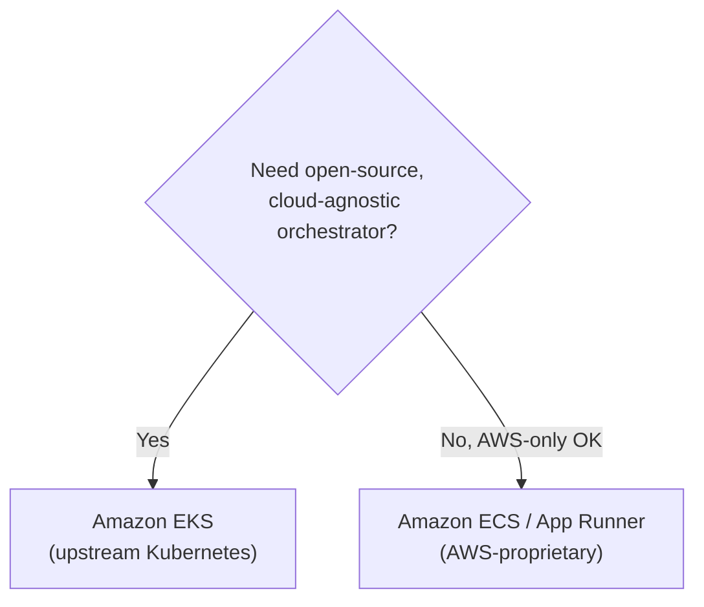

Hence, the correct answer is: **Migrate the application to Amazon Elastic Kubernetes Service with Amazon EKS worker nodes.**

**Why the other options are wrong:**

- **AWS App Runner running containers on an open-source orchestration platform** — App Runner is a fully managed service that hides the orchestrator entirely; you hand it a container image or source repo and it runs it. It is not Kubernetes and exposes no open-source orchestration layer, so it cannot satisfy the cloud-agnostic requirement.
- **Amazon ECS tasks with the AWS Fargate launch type** — Fargate only removes server management; the orchestrator underneath is still ECS, which is AWS-proprietary. You could not move the same task definitions to another cloud, so it is not cloud-agnostic.
- **Amazon ECS tasks with the Amazon EC2 launch type** — Same problem: ECS is a proprietary AWS orchestrator regardless of whether tasks run on EC2 or Fargate. Only Kubernetes (EKS) gives you the portable, open-source tooling the requirement calls for.

**References:**

[https://docs.aws.amazon.com/eks/latest/userguide/what-is-eks.html](https://docs.aws.amazon.com/eks/latest/userguide/what-is-eks.html)

[https://aws.amazon.com/eks/faqs/](https://aws.amazon.com/eks/faqs/)

**Domain:** Design High-Performing Architectures

---

### Question 4

A company has multiple VPCs with IPv6 enabled for its suite of web applications. The Solutions Architect attempted to deploy a new Amazon EC2 instance but encountered an error indicating that there were no available IP addresses on the subnet. The VPC has a combination of IPv4 and IPv6 CIDR blocks, but the IPv4 CIDR blocks are nearing exhaustion. The architect needs a solution that will resolve this issue while allowing future scalability.

How should the Solutions Architect resolve this problem?

**Answer:**

Set up a new IPv6-only subnet with a large CIDR range. Associate the new subnet with the VPC then launch the instance.

**Overall Explanation:**

The error "no available IP addresses on the subnet" means the subnet's IPv4 CIDR is exhausted. The scenario adds two constraints: IPv4 space is nearly used up *across the VPC*, and the fix must scale into the future. The VPC already carries both IPv4 and IPv6 CIDR blocks, so the smart move is to stop consuming the scarce IPv4 pool and launch the new instance into **IPv6 address space**, which is effectively unlimited for practical purposes.

Creating a new **IPv6-only subnet** with a large CIDR and launching the instance there sidesteps IPv4 exhaustion entirely while giving long-term headroom. A VPC can run in dual-stack mode, and within a dual-stack VPC you can carve out IPv6-only subnets for new workloads while existing IPv4 services keep running untouched.

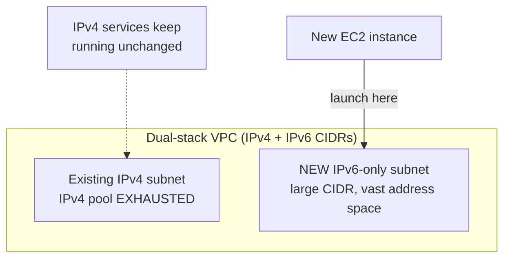

A key constraint to remember: IPv4 is the default, mandatory addressing system for a VPC and its subnets — it cannot be removed or disabled.

Hence, the correct answer is: **Set up a new IPv6-only subnet with a large CIDR range. Associate the new subnet with the VPC then launch the instance.**

**Why the other options are wrong:**

- **Set up a new IPv4 subnet with a larger CIDR range** — This is only a stopgap. A larger IPv4 subnet still draws from the same finite IPv4 space that is already nearly exhausted, so the VPC will hit the wall again. It does not meet the "future scalability" requirement.
- **Make the VPC IPv6-only by removing all IPv4 CIDRs** — Not possible. A VPC must always keep at least one IPv4 CIDR; you cannot have an IPv6-only VPC. IPv6 is added alongside IPv4 (dual-stack), and IPv6-only applies at the subnet level, not the VPC level.
- **Disable IPv4 support in the VPC and use only IPv6** — IPv4 support cannot be disabled at the VPC level; it is foundational. Doing so (if it were possible) would break every existing IPv4-dependent service. The right pattern is dual-stack: new resources on IPv6, existing ones still on IPv4.

**References:**

[https://docs.aws.amazon.com/vpc/latest/userguide/vpc-migrate-ipv6.html](https://docs.aws.amazon.com/vpc/latest/userguide/vpc-migrate-ipv6.html)

[https://docs.aws.amazon.com/vpc/latest/userguide/vpc-ip-addressing.html](https://docs.aws.amazon.com/vpc/latest/userguide/vpc-ip-addressing.html)

[https://aws.amazon.com/vpc/faqs/](https://aws.amazon.com/vpc/faqs/)

**Domain:** Design Resilient Architectures

---

### Question 5

A DevOps Engineer is required to design a cloud architecture in AWS. The Engineer is planning to develop a highly available and fault-tolerant architecture consisting of an Elastic Load Balancer and an Auto Scaling group of EC2 instances deployed across multiple Availability Zones. This will be used by an online accounting application that requires path-based routing, host-based routing, and bi-directional streaming using Remote Procedure Call (gRPC).

Which configuration will satisfy the given requirement?

**Answer:**

Configure an Application Load Balancer in front of the auto-scaling group. Select gRPC as the protocol version.

**Overall Explanation:**

The requirement lists three needs: **path-based routing**, **host-based routing**, and **bi-directional gRPC streaming**. All three are application-layer (Layer 7) features, and on AWS the only load balancer that operates at Layer 7 and natively supports gRPC is the **Application Load Balancer (ALB)**.

An ALB inspects HTTP/HTTPS request content and routes on attributes such as host header, URL path, HTTP method, query string, or source IP — which directly covers path-based and host-based routing. Critically, gRPC runs over HTTP/2, and an ALB can be configured with **gRPC as the protocol version** on its target group, allowing it to terminate, route, and health-check gRPC (including bi-directional streaming) between clients and the backend services without any change to the client or service code.

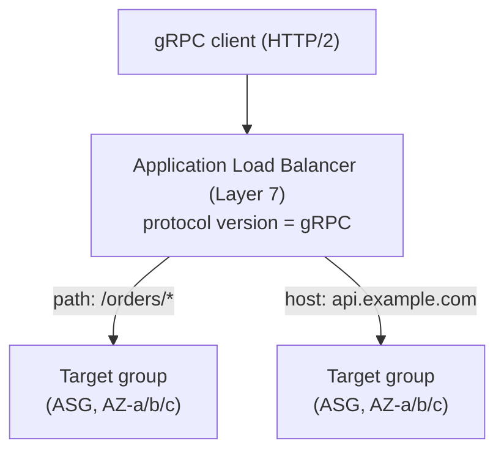

Layer comparison clarifies why only ALB fits:

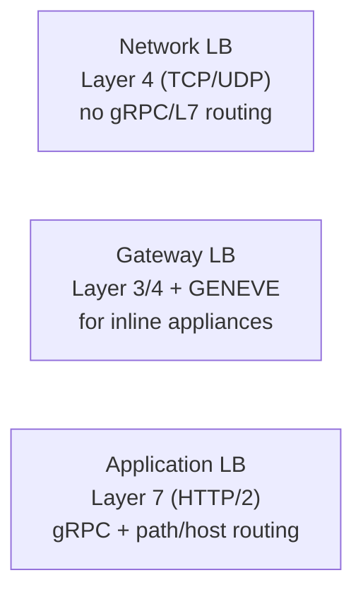

Therefore, the correct answer is: **Configure an Application Load Balancer in front of the auto-scaling group. Select gRPC as the protocol version.**

**Why the other options are wrong:**

- **Network Load Balancer with a UDP listener** — An NLB works at Layer 4 and does not understand HTTP, so it cannot do path- or host-based routing and does not support gRPC. gRPC also runs over HTTP/2 (TCP), not UDP, making a UDP listener doubly wrong.
- **Gateway Load Balancer with a GENEVE listener on port 6081** — A GWLB operates at Layer 3/4 and is designed to insert third-party network appliances (firewalls, IDS/IPS) into the traffic path. It has no concept of Layer 7 gRPC, host headers, or URL paths, so it cannot meet any of the routing requirements.
- **Network Load Balancer fronted by AWS Global Accelerator** — Global Accelerator only improves network performance by moving traffic onto the AWS backbone via anycast IPs; it adds nothing for path/host routing or gRPC. The NLB underneath still lacks Layer 7 capabilities.

**References:**

[https://aws.amazon.com/elasticloadbalancing/features](https://aws.amazon.com/elasticloadbalancing/features)

[https://aws.amazon.com/elasticloadbalancing/faqs/](https://aws.amazon.com/elasticloadbalancing/faqs/)

**Domain:** Design Resilient Architectures

---

### Question 6

A company has a cryptocurrency exchange portal that is hosted in an Auto Scaling group of EC2 instances behind an Application Load Balancer and is deployed across multiple AWS regions. The users can be found all around the globe, but the majority are from Japan and Sweden. Because of the compliance requirements in these two locations, you want the Japanese users to connect to the servers in the `ap-northeast-1` Asia Pacific (Tokyo) region, while the Swedish users should be connected to the servers in the `eu-west-1` EU (Ireland) region.

Which of the following services would allow you to easily fulfill this requirement?

**Answer:**

Use Route 53 Geolocation Routing policy.

**Overall Explanation:**

The requirement is to send users to a *specific* AWS Region based on where they physically are — Japanese users to `ap-northeast-1` (Tokyo) and Swedish users to `eu-west-1` (Ireland) — to satisfy per-country compliance rules. This is exactly what the **Route 53 Geolocation routing policy** does: it selects the endpoint based on the geographic origin of the DNS query.

With geolocation routing you create records keyed to continents, countries, or even US states, plus a default record for everyone else. A query from Japan resolves to the Tokyo ALB; a query from Sweden resolves to the Ireland ALB. Because the decision is deterministic by location (not latency or weighting), each country is consistently pinned to the required Region, which is what compliance demands.

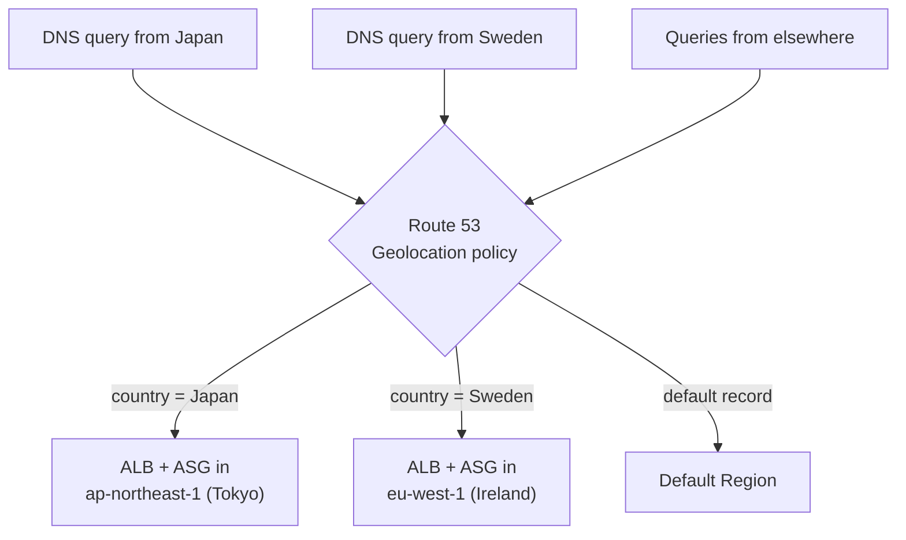

Hence, the correct answer is: **Use Route 53 Geolocation Routing policy.**

**Why the other options are wrong:**

- **An Application Load Balancer that auto-routes to the proper Region** — An ELB only distributes traffic across targets within Availability Zones in a single Region. It has no ability to route users to a *different* Region, so it cannot pin Japanese vs. Swedish users to separate Regions.
- **A CloudFront distribution with geo-restriction enabled** — Geo-restriction is a blocking/allow mechanism: it permits or denies viewers in certain countries from accessing content. It does not steer different countries to different backend Regions, which is the actual requirement.
- **Route 53 Weighted routing policy** — Weighted routing splits traffic across endpoints by assigned percentages, regardless of where the user is. It cannot guarantee that a given country always reaches a specific Region, so it fails the compliance need. Geolocation routing is the correct tool.

**References:**

[https://docs.aws.amazon.com/Route53/latest/DeveloperGuide/routing-policy.html](https://docs.aws.amazon.com/Route53/latest/DeveloperGuide/routing-policy.html)

[https://aws.amazon.com/premiumsupport/knowledge-center/geolocation-routing-policy](https://aws.amazon.com/premiumsupport/knowledge-center/geolocation-routing-policy)

**Domain:** Design High-Performing Architectures

---

### Question 7

A company is running a multi-tier web application farm in a virtual private cloud (VPC) that is not connected to their corporate network. They are connecting to the VPC over the Internet to manage the fleet of Amazon EC2 instances running in both the public and private subnets. The Solutions Architect has added a bastion host with Microsoft Remote Desktop Protocol (RDP) access to the application instance security groups, but the company wants to further limit administrative access to all of the instances in the VPC.

Which of the following bastion host deployment options will meet this requirement?

**Answer:**

Deploy a Windows Bastion host with an Elastic IP address in the public subnet and allow RDP access to bastion only from the corporate IP addresses.

**Overall Explanation:**

A bastion host (jump box) is a hardened EC2 instance that serves as the single, controlled entry point for administrative access into a VPC. Rather than exposing every instance to the Internet, administrators connect to the bastion first and then "hop" from it to the EC2 instances in the private subnets. This shrinks the attack surface to one auditable host.

To be reachable from the corporate office over the Internet, the bastion must sit in a **public subnet** (a subnet whose route table sends 0.0.0.0/0 to an Internet Gateway) and have a stable, routable public address. An **Elastic IP** gives it a fixed IP that survives stop/start, so the firewall rule allowing the corporate range never needs to change.

To "further limit administrative access," the bastion's security group should restrict the management port to the company's known public IP CIDR ranges only, not the whole Internet. Because the fleet is Windows, the management protocol is **RDP (TCP 3389)**, not SSH. Locking RDP down to the corporate IPs means only staff coming from the office network can even open a session, and all admin traffic is funneled through one logged, patched host.

Hence, the correct answer is to deploy a Windows Bastion host with an Elastic IP in the public subnet and allow RDP access to the bastion only from the corporate IP addresses.

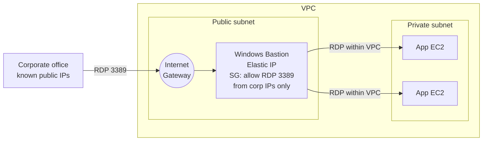

**Why the other options are wrong:**

- **Deploy the bastion on the corporate network with RDP access to all EC2 instances:** A bastion is meant to be the reachable entry point inside the VPC, not a machine on your premises. Putting it on the corporate network would require direct inbound connectivity from the office to every VPC instance, defeating the single-guarded-hop design and contradicting the requirement that the VPC is managed over the Internet.
- **Elastic IP in the private subnet with RDP restricted to corporate IPs:** A private subnet has no route to an Internet Gateway, so an Elastic IP there cannot receive inbound connections from the office. The bastion would simply be unreachable, so nobody could log in to it.
- **Elastic IP in the public subnet but allowing SSH from anywhere:** Two problems. SSH (TCP 22) is the Linux/Unix protocol; a Windows host is administered via RDP (TCP 3389), so SSH grants no useful access. Worse, opening it to 0.0.0.0/0 widens access instead of narrowing it, the opposite of what is asked.

**Reference:**

[https://docs.aws.amazon.com/quickstart/latest/linux-bastion/architecture.html](https://docs.aws.amazon.com/quickstart/latest/linux-bastion/architecture.html)

[https://docs.aws.amazon.com/vpc/latest/userguide/vpc-security-groups.html](https://docs.aws.amazon.com/vpc/latest/userguide/vpc-security-groups.html)

**Domain:** Design High-Performing Architectures

---

### Question 8

A commercial bank has a forex trading application. They created an Auto Scaling group of EC2 instances that allow the bank to cope with the current traffic and achieve cost-efficiency. They want the Auto Scaling group to behave in such a way that it will follow a predefined set of parameters before it scales down the number of EC2 instances, which protects the system from unintended slowdown or unavailability.

Which of the following statements are true regarding the cooldown period? (Select TWO.)

**Answer:**

- Its default value is 300 seconds.
- It ensures that the Auto Scaling group does not launch or terminate additional EC2 instances before the previous scaling activity takes effect.

**Overall Explanation:**

The **cooldown period** is a setting on an Auto Scaling group used with *simple scaling policies*. After a simple scaling action launches or terminates instances, the group enters a cooldown during which it will not start another scaling activity. The purpose is to give the previous action time to take full effect, for example, letting newly launched instances boot, register with the load balancer, and begin reporting metrics, before CloudWatch alarms trigger yet another scale event. Without it, a single sustained spike could fire repeated scaling actions and cause "thrashing" (rapidly adding and removing instances), which hurts stability and wastes money.

Two statements are therefore true: the default cooldown is **300 seconds**, and it **prevents the group from launching or terminating more instances until the previous scaling activity has taken effect**. (The cooldown is also a configurable per-group value, but only two answers were requested.)

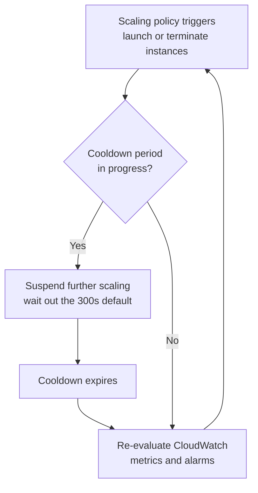

**Why the other options are wrong:**

- **"It ensures the instances have ample time to cool down before scaling out":** This misreads the term. The cooldown does not refer to letting EC2 instances physically or thermally "cool down." It is a timer that pauses further scaling decisions so the prior activity can stabilize.
- **"It ensures the group launches or terminates instances without any downtime":** The cooldown is not a zero-downtime guarantee. Availability during scaling depends on health checks, load balancer registration, and capacity, not on the cooldown timer, which simply throttles how often scaling actions occur.
- **"Its default value is 600 seconds":** Incorrect figure. The default simple-scaling cooldown is **300 seconds**, not 600.

**Reference:**

[https://docs.aws.amazon.com/autoscaling/ec2/userguide/Cooldown.html](https://docs.aws.amazon.com/autoscaling/ec2/userguide/Cooldown.html)

[https://docs.aws.amazon.com/autoscaling/ec2/userguide/as-instance-termination.html](https://docs.aws.amazon.com/autoscaling/ec2/userguide/as-instance-termination.html)

**Domain:** Design Resilient Architectures

---

### Question 9

A company runs a messaging application in the `ap-northeast-1` and `ap-southeast-2` region. A Solutions Architect needs to create a routing policy wherein a larger portion of traffic from the Philippines and North India will be routed to the resource in the `ap-northeast-1` region.

Which Route 53 routing policy should the Solutions Architect use?

**Answer:**

Geoproximity Routing

**Overall Explanation:**

**Amazon Route 53** is a highly available, scalable DNS service that handles domain registration, DNS query routing, and health checking. When you create records in a hosted zone, you attach a *routing policy* that decides which answer Route 53 returns for a given query. The key to this question is needing to *bias* how much of a geographic area is served by a particular region's resource.

**Geoproximity Routing** routes traffic based on the physical distance between the user and your resources, and crucially it lets you apply a **bias**. A positive bias expands the geographic area that a resource serves; a negative bias shrinks it. By tuning the bias on the `ap-northeast-1` (Tokyo) endpoint relative to `ap-southeast-2` (Sydney), you can pull in a larger slice of traffic from the Philippines and northern India toward Tokyo, which is exactly what is required. This adjustable boundary is unique to Geoproximity, so it is the correct answer.

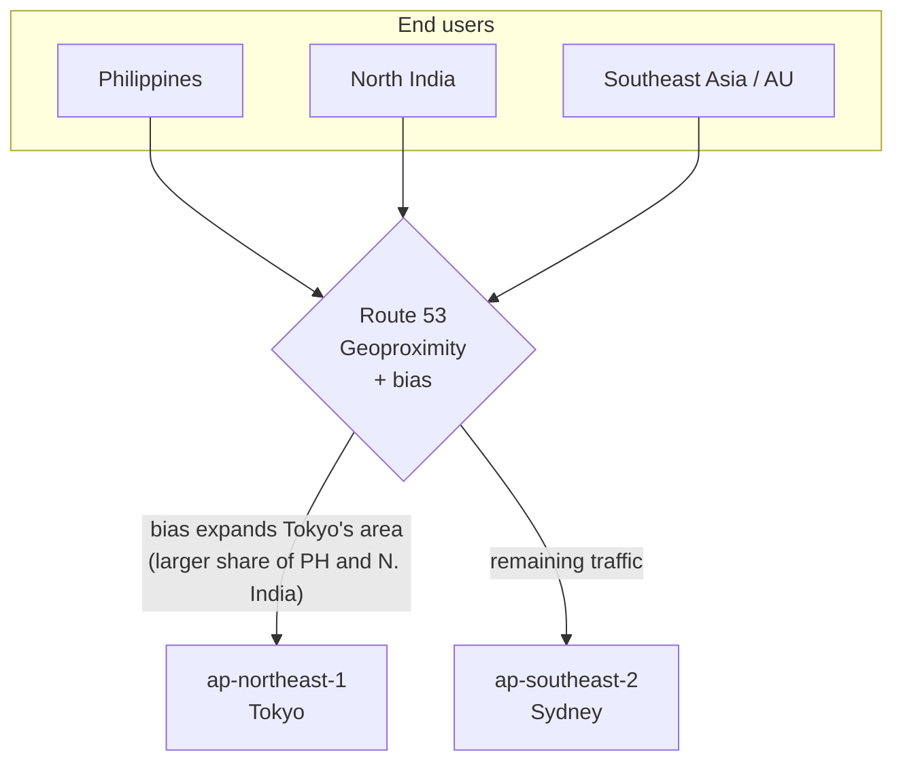

**Why the other options are wrong:**

- **Geolocation Routing:** It picks a resource purely by the country/continent/region a DNS query comes from. You cannot stretch or shrink the served area with a bias, so you cannot pull "a larger portion" of one country toward a region. It is all-or-nothing per mapped location.
- **Latency Routing:** It answers with whichever region gives the user the lowest network latency. The decision is driven by measured latency, not by geography you control, so you cannot deliberately steer a bigger share of a specific country to Tokyo.
- **Weighted Routing:** It splits traffic among resources by numeric weights regardless of where users are. It is great for blue/green or canary rollouts, but it ignores the requester's location, so it cannot route based on the Philippines or North India.

**References:**

[https://docs.aws.amazon.com/Route53/latest/DeveloperGuide/routing-policy.html#routing-policy-geoproximity](https://docs.aws.amazon.com/Route53/latest/DeveloperGuide/routing-policy.html#routing-policy-geoproximity)

[https://docs.aws.amazon.com/Route53/latest/DeveloperGuide/routing-policy.html](https://docs.aws.amazon.com/Route53/latest/DeveloperGuide/routing-policy.html)

**Domain:** Design Resilient Architectures

---

### Question 10

A company wants to organize the way it tracks its spending on AWS resources. A report that summarizes the total billing accrued by each department must be generated at the end of the month. The company already uses a Savings Plan for pricing, but that does not break down costs by department.

Which solution will meet the requirements?

**Answer:**

Tag resources with the department name and enable cost allocation tags.

**Overall Explanation:**

A **tag** is a key/value label you attach to AWS resources. On its own a tag is just metadata, but when you mark a tag as a **cost allocation tag** and activate it in the Billing and Cost Management console, AWS starts breaking your billing data down by that tag's values. So if every resource carries a `Department` tag, AWS can group the monthly charges by department and emit them in the cost allocation report (a CSV with usage and cost organized by your active tags).

This is exactly the requirement: a month-end report that attributes spend to each department. Note that a Savings Plan affects *pricing* (the rate you pay) but does nothing to *categorize* spend, which is why tagging is still needed. Hence the correct answer is to tag resources with the department name and enable cost allocation tags.

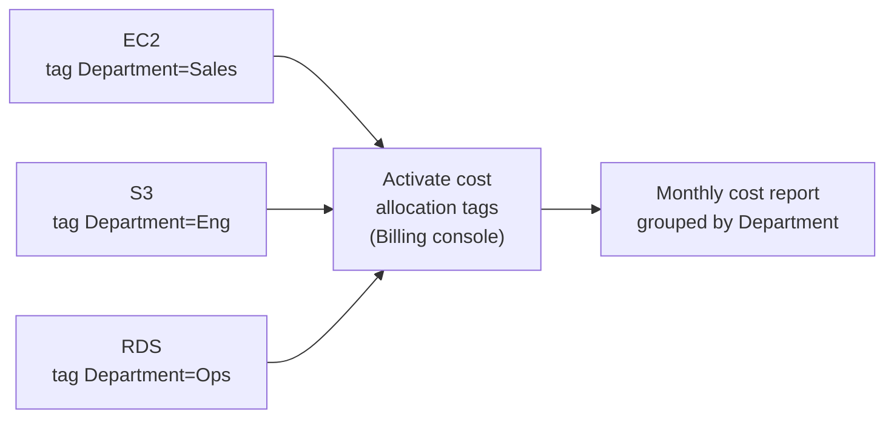

**Why the other options are wrong:**

- **Tag resources and configure a budget action in AWS Budgets:** AWS Budgets is for *alerting and reacting* when spend crosses a threshold (notify, or run an action such as applying a restrictive policy). It is a control/alarm mechanism, not a reporting tool that produces a per-department cost breakdown.
- **Use Cost Explorer filtered by `Resource`:** The `Resource` filter (hourly/resource-level granularity) is centered on EC2-type resources and is far narrower than tag-based grouping. It does not give a clean, business-oriented breakdown of every service's cost by department the way activated cost allocation tags do.
- **Create a Cost and Usage Report for the services each department uses:** The CUR is extremely detailed, but slicing it "by AWS service per department" still groups by service, not by the department dimension. To attribute cost to a department you need the tag dimension; without cost allocation tags the report cannot answer "how much did each department spend."

**References:**

[https://docs.aws.amazon.com/awsaccountbilling/latest/aboutv2/cost-alloc-tags.html](https://docs.aws.amazon.com/awsaccountbilling/latest/aboutv2/cost-alloc-tags.html)

[https://aws.amazon.com/blogs/aws-cloud-financial-management/cost-allocation-blog-series-2-aws-generated-vs-user-defined-cost-allocation-tag/](https://aws.amazon.com/blogs/aws-cloud-financial-management/cost-allocation-blog-series-2-aws-generated-vs-user-defined-cost-allocation-tag/)

**Domain:** Design Cost-Optimized Architectures

---

### Question 11

A company is building an internal application that allows users to upload images. Each upload request must be sent to Amazon Kinesis Data Streams for processing before the pictures are stored in an Amazon S3 bucket.

The application should immediately return a success message to the user after the upload, while the downstream processing is handled asynchronously. The processing typically takes about 5 minutes to complete.

Which solution will enable asynchronous processing from Kinesis to S3 in the most cost-effective way?

**Answer:**

Use Kinesis Data Streams with AWS Lambda consumers to asynchronously process records and write them to S3.

**Overall Explanation:**

The flow is: the app must immediately acknowledge the user's upload, push the request into **Kinesis Data Streams**, and have downstream work (the ~5-minute processing, then writing to S3) happen asynchronously and cheaply.

The natural fit is **Kinesis Data Streams with AWS Lambda consumers**. Lambda integrates with Kinesis through an **event source mapping**: Lambda polls the stream, batches records, invokes your function, and transparently handles checkpoints and retries. Because the producer just writes to the stream and returns, the user gets an instant success response while processing continues in the background. Lambda scales out per shard automatically with no servers to run, and you pay only for shard usage plus actual invocation time. Lambda's 15-minute maximum timeout comfortably covers a 5-minute job, so this serverless pipeline is both the simplest and the most cost-effective design.

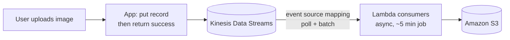

**Why the other options are wrong:**

- **Lambda + Step Functions to orchestrate the requests:** Step Functions is an *orchestration* service for multi-step workflows (branching, sequencing, human approval, complex retries) and bills per state transition. There is no multi-step workflow here, so it adds cost and complexity. A direct Kinesis-to-Lambda event source mapping already gives you polling, batching, and retries.
- **SQS to queue requests, then process on On-Demand EC2:** This violates the explicit requirement that uploads must go to **Kinesis Data Streams**, and swapping serverless processing for EC2 means provisioning, patching, and scaling instances yourself, which is less cost-efficient than Lambda that scales to zero when idle.
- **Kinesis Data Streams to Amazon Data Firehose, delivering directly to S3:** Firehose is a managed *delivery/loading* service optimized for buffering data into destinations. Its optional Lambda transformation runs within buffering constraints and a tight invocation limit, making it a poor fit for a 5-minute processing step and far less flexible than a dedicated Lambda consumer for custom application logic.

**References:**

[https://docs.aws.amazon.com/lambda/latest/dg/with-kinesis.html](https://docs.aws.amazon.com/lambda/latest/dg/with-kinesis.html)

[https://docs.aws.amazon.com/lambda/latest/dg/lambda-invocation.html](https://docs.aws.amazon.com/lambda/latest/dg/lambda-invocation.html)

**Domain:** Design Cost-Optimized Architectures

---

### Question 12

A company has a dynamic web app written in MEAN stack that is going to be launched in the next month. There is a probability that the traffic will be quite high in the first couple of weeks. In the event of a load failure, how can you set up DNS failover to a static website?

**Answer:**

Use Route 53 with the failover option to a static S3 website bucket or CloudFront distribution.

**Overall Explanation:**

The goal is a DNS-level failover: if the dynamic MEAN-stack app becomes unavailable under heavy launch-week traffic, requests should automatically be sent to a lightweight, always-available static backup instead of returning errors.

**Route 53 failover routing** does exactly this. You define a **primary** record (the dynamic app, e.g., behind a load balancer) associated with a **health check**, and a **secondary** record pointing at a static fallback such as an **S3 static website bucket** or a **CloudFront distribution**. While the health check passes, Route 53 serves the primary. The moment the primary is judged unhealthy, Route 53 stops handing out its answer and returns the secondary, so users see a static "we are busy / maintenance" experience rather than a hard failure. A static S3 site or CloudFront origin is cheap and highly durable, making it an ideal standby.

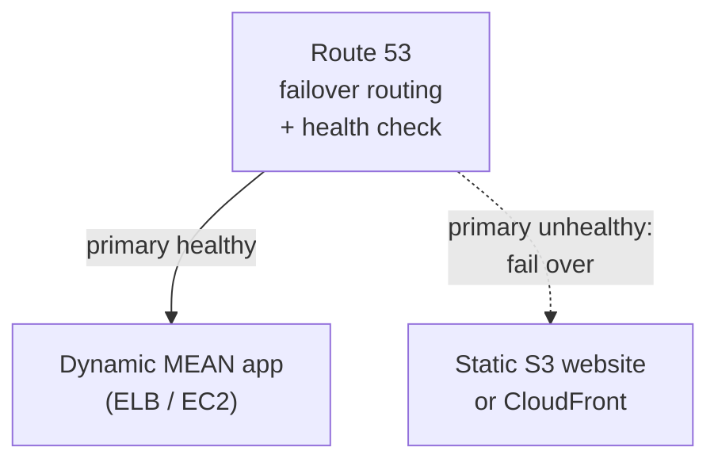

**Why the other options are wrong:**

- **Duplicate the full app in another region with weighted routing:** Running a complete second copy of the dynamic stack is expensive and is a load-distribution / active-active pattern, not a simple failover. The requirement is a cheap standby for outages, not a duplicated production environment.
- **Fail over to an application hosted on-premises:** Technically possible, but it pulls the workload out of AWS and adds the cost and operational burden of maintaining on-prem capacity, when Route 53 plus a static S3/CloudFront target achieves the failover entirely within AWS.
- **Add more servers only when the application fails:** Reacting to a failure by then launching servers introduces a downtime gap while those servers boot and become healthy. During that window the site is unavailable, which is precisely what a pre-provisioned static failover target avoids.

**Reference:**

[https://docs.aws.amazon.com/Route53/latest/DeveloperGuide/dns-failover.html](https://docs.aws.amazon.com/Route53/latest/DeveloperGuide/dns-failover.html)

[https://aws.amazon.com/premiumsupport/knowledge-center/fail-over-s3-r53/](https://aws.amazon.com/premiumsupport/knowledge-center/fail-over-s3-r53/)

**Domain:** Design Resilient Architectures

---

### Question 13

A media company hosts large volumes of archive data that are about 250 TB in size on its internal servers. The company has decided to move this data to Amazon S3 because of its durability and redundancy. The company currently has a 100 Mbps dedicated line connecting its head office to the Internet. The team considered using AWS Storage Gateway Volume Gateway, but determined that the 100 Mbps connection would take weeks to transfer the full dataset.

Which of the following is the FASTEST and MOST COST-EFFECTIVE way to import all this data to S3?

**Answer:**

Request several AWS Snowball devices to upload the data into S3.

**Overall Explanation:**

The constraint is a one-time bulk migration of **250 TB** over a **100 Mbps** Internet link. The bottleneck is raw bandwidth, so the right approach is to physically ship the data rather than push it over the wire.

**AWS Snowball** is a petabyte-scale, secure physical transfer appliance. You request devices, copy your data onto them locally at LAN speeds, ship them back, and AWS imports the contents into S3. This sidesteps the slow Internet connection entirely and is often a fraction of the cost of transferring huge volumes over high-speed Internet, while also being faster.

A quick sanity check on the math: even at a theoretical 100 Mbps fully dedicated to the transfer, 250 TB would take on the order of months (100 TB alone is already roughly 100+ days at that rate). Multiple Snowball devices can move the same data in about a week, so for "fastest and most cost-effective," Snowball wins. As a rule of thumb, if an Internet upload would take more than about a week, choose Snowball.

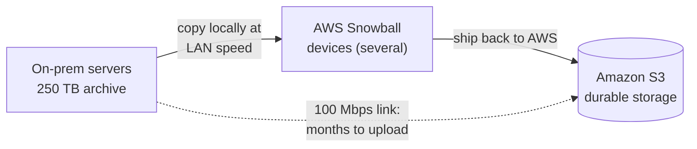

**Why the other options are wrong:**

- **Upload directly to S3:** Bound by the same 100 Mbps pipe, this would take many months for 250 TB and likely contend with normal business traffic. Far too slow for a practical migration.
- **Provision AWS Direct Connect, then transfer to S3:** Direct Connect requires ordering and physically provisioning a dedicated circuit, which takes significant lead time and ongoing cost. It is meant for sustained hybrid connectivity, not a single bulk move, so it is neither the fastest nor the most cost-effective answer here.
- **Use S3 Transfer Acceleration:** Transfer Acceleration speeds uploads by routing through CloudFront edge locations, but it still depends on your origin bandwidth. With only 100 Mbps available, it cannot meaningfully shorten a 250 TB transfer, so the bandwidth ceiling remains the limiting factor.

**References:**

[https://aws.amazon.com/snowball/](https://aws.amazon.com/snowball/)

[https://aws.amazon.com/snowball/faqs/](https://aws.amazon.com/snowball/faqs/)

**Domain:** Design Cost-Optimized Architectures

---

### Question 14

A GraphQL API hosted is hosted in an Amazon EKS cluster with AWS Fargate launch type and deployed using AWS SAM. The API is connected to an Amazon DynamoDB table with DynamoDB Accelerator (DAX) as its data store. Both resources are hosted in the us-east-1 region.

The AWS IAM authenticator for Kubernetes is integrated into the EKS cluster for role-based access control (RBAC) and cluster authentication. A solutions architect must improve network security by preventing database calls from traversing the public internet. An automated cross-account backup for the DynamoDB table is also required for long-term retention.

Which of the following should the solutions architect implement to meet the requirement?

**Answer:**

Create a DynamoDB gateway endpoint. Associate the endpoint to the appropriate route table. Use AWS Backup to automatically copy the on-demand DynamoDB backups to another AWS account for disaster recovery.

**Overall Explanation:**

Amazon DynamoDB is a public AWS service reached over a public service endpoint (for example `dynamodb.us-east-1.amazonaws.com`). By default, an application in a VPC reaches it by routing out through an internet gateway or NAT, so the traffic leaves the Amazon private network. A **DynamoDB Gateway VPC endpoint** changes that: it adds an AWS-managed prefix list entry to the route table you associate with it, so requests to DynamoDB are routed privately through the Amazon backbone using the instances' private IPs. No internet gateway, NAT, or public IP is involved, which satisfies the "must not traverse the public internet" requirement.

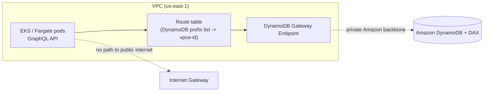

For the backup requirement, the key fact is that **native DynamoDB on-demand backups stay inside the same account and Region** -- they cannot be copied across accounts or Regions on their own, and Point-in-Time Recovery (PITR) is also same-account/same-Region only. **AWS Backup** is the managed service that adds cross-account and cross-Region copy, lifecycle to cold storage, cost-allocation tags, and centralized policies. So pairing the Gateway endpoint with AWS Backup copy jobs meets both the private-networking and the long-term cross-account retention goals.

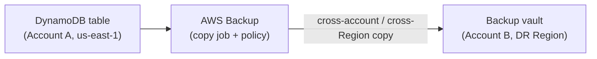

Hence, the correct answer is: **Create a DynamoDB gateway endpoint. Associate the endpoint to the appropriate route table. Use AWS Backup to automatically copy the on-demand DynamoDB backups to another AWS account for disaster recovery.**

**Why the other options are wrong:**

- **Interface endpoint + PITR:** DynamoDB uses a **Gateway** endpoint for general data-plane VPC access, not an Interface endpoint. More importantly, PITR restores a table only within the **same account and Region**, so it cannot satisfy the cross-account, long-term retention requirement -- that needs AWS Backup.
- **Gateway endpoint + NACL rule + on-demand backups:** A NACL rule that "allows outbound traffic" does nothing to keep traffic off the public internet -- routing, not a NACL, decides the path, and the Gateway endpoint is what makes it private. Additionally, native on-demand backups cannot be copied to another account or Region.
- **Interface endpoint + Network Firewall + Timestream:** Since the app already talks to DynamoDB, no firewall is blocking it, so adding allow rules is pointless; AWS Network Firewall is a VPC traffic-filtering service and is unrelated to making the path private. Amazon Timestream is a time-series database for IoT/metrics and has no role in DynamoDB point-in-time recovery or cross-account backup.

**References:**

[https://docs.aws.amazon.com/amazondynamodb/latest/developerguide/vpc-endpoints-dynamodb.html](https://docs.aws.amazon.com/amazondynamodb/latest/developerguide/vpc-endpoints-dynamodb.html)

[https://docs.aws.amazon.com/amazondynamodb/latest/developerguide/BackupRestore.html](https://docs.aws.amazon.com/amazondynamodb/latest/developerguide/BackupRestore.html)

[https://docs.aws.amazon.com/aws-backup/latest/devguide/creating-a-cross-account-backup.html](https://docs.aws.amazon.com/aws-backup/latest/devguide/creating-a-cross-account-backup.html)

**Domain:** Design Secure Architectures

---

### Question 15

A company has two On-Demand EC2 instances inside the Virtual Private Cloud in the same Availability Zone but are deployed to different subnets. One EC2 instance is running a database and the other EC2 instance a web application that connects with the database. You need to ensure that these two instances can communicate with each other for the system to work properly.

What are the things you have to check so that these EC2 instances can communicate inside the VPC? (Select TWO.)

**Answer:**

- Check if all security groups are set to allow the application host to communicate to the database on the right port and protocol.
- Check the Network ACL if it allows communication between the two subnets.

**Overall Explanation:**

For two EC2 instances in different subnets of the same VPC to talk to each other, traffic must be permitted at **both** layers of VPC filtering. First, the **Network ACL** on each subnet must allow the traffic between the two subnets -- NACLs are stateless, so both the request direction and the return traffic must be explicitly allowed. Second, the **security groups** on the instances must allow the database port and protocol (for example TCP 3306 for MySQL) from the web instance to the database instance. Security groups are stateful, so allowing the inbound connection automatically allows the response. Both controls are evaluated, so a deny at either layer blocks communication.

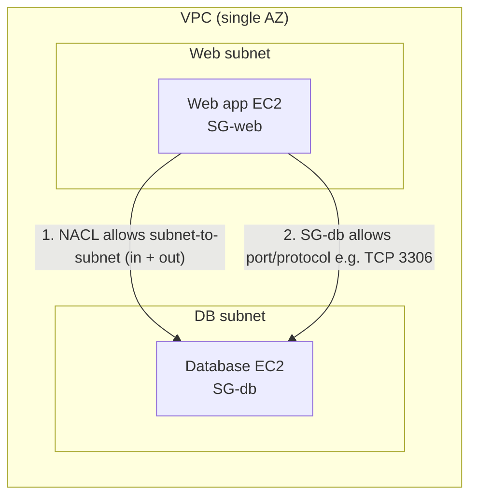

The table below contrasts the two controls you must verify:

| Security Group | Network ACL (NACL) |
|---|---|
| Firewall at the **instance/ENI** level | Firewall at the **subnet** level |
| **Stateful** -- return traffic auto-allowed | **Stateless** -- return traffic must be allowed explicitly |
| Allow rules only | Allow and deny rules |
| All rules evaluated together | Rules evaluated in numbered order, lowest first |
| New SG: denies inbound, allows outbound by default | New custom NACL: denies all in and out by default |

Hence, the correct answers are: **Check if all security groups are set to allow the application host to communicate to the database on the right port and protocol** and **Check the Network ACL if it allows communication between the two subnets.**

**Why the other options are wrong:**

- **Same instance class:** Instance type/class has nothing to do with network reachability -- different sizes communicate fine. This is a compute-sizing concern, not connectivity.
- **Default route to NAT or Internet Gateway:** That route is for reaching the public internet. Traffic between two subnets in the same VPC uses the implicit local route for the VPC CIDR and never leaves the VPC, so an IGW/NAT is irrelevant here.
- **Same Placement Group:** Placement groups influence physical instance placement for low latency or throughput (cluster/spread/partition). They are a performance feature and are not required for, nor do they enable, basic intra-VPC communication.

**Reference:**

[https://docs.aws.amazon.com/vpc/latest/userguide/VPC_Subnets.html](https://docs.aws.amazon.com/vpc/latest/userguide/VPC_Subnets.html)

**Domain:** Design Secure Architectures

---

### Question 16

A Solutions Architect is building a cloud infrastructure where Amazon EC2 instances require access to various AWS services, such as Amazon S3 and Amazon Redshift. The Architect will also need to provide access to system administrators so that the system administrators can deploy and test changes.

Which configuration should be used to ensure that access to the resources is secured and not compromised? (Select TWO.)

**Answer:**

- Assign an IAM role to the EC2 instance.
- Enable Multi-Factor Authentication.

**Overall Explanation:**

Two independent security best practices are needed here. For the EC2 instances that must call S3 and Redshift, attach an **IAM role** to the instance. The instance receives short-lived, automatically rotated credentials through the instance metadata service, so applications make signed API calls without any long-term keys stored on disk. Nothing has to be embedded, distributed, or manually rotated, which removes the biggest source of credential leakage.

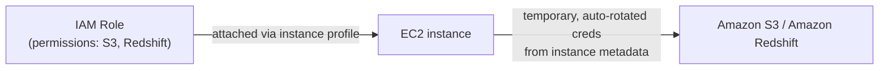

For the administrators who deploy and test, enable **Multi-Factor Authentication (MFA)**. MFA adds a second factor (a code from a hardware or virtual device) on top of the password, so a stolen or guessed password alone cannot be used to sign in or to call sensitive APIs. It is a cheap, high-impact control for human identities with elevated privileges.

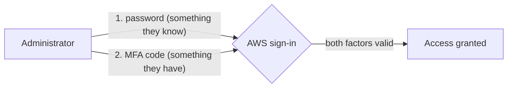

Hence, the correct answers are: **Assign an IAM role to the EC2 instance** and **Enable Multi-Factor Authentication.**

**Why the other options are wrong:**

- **Store AWS access keys on the EC2 instance:** Long-term keys on an instance can be read by anyone who gains access to it and must be rotated manually; AWS explicitly recommends instance roles with temporary credentials instead.
- **Assign an IAM user to each EC2 instance:** IAM users carry long-term credentials and are meant for people or external systems, not instances. Roles are the designed mechanism for granting AWS permissions to EC2 and are easier to manage at scale.
- **Store AWS access keys in ACM:** AWS Certificate Manager only provisions and manages SSL/TLS certificates. It is not a credential store and cannot hold access keys; Secrets Manager or Parameter Store would be the secret-storage services, though a role is still preferable here.

**References:**

[https://aws.amazon.com/iam/features/mfa/](https://aws.amazon.com/iam/features/mfa/)

[https://docs.aws.amazon.com/AWSEC2/latest/UserGuide/iam-roles-for-amazon-ec2.html](https://docs.aws.amazon.com/AWSEC2/latest/UserGuide/iam-roles-for-amazon-ec2.html)

**Domain:** Design Secure Architectures

---

### Question 17

An online events registration system is hosted in AWS and uses ECS to host its front-end tier and an RDS configured with Multi-AZ for its database tier. What are the events that will make Amazon RDS automatically perform a failover to the standby replica? (Select TWO.)

**Answer:**

- Storage failure on primary
- Loss of availability in primary Availability Zone

**Overall Explanation:**

A Multi-AZ RDS deployment keeps a **synchronous standby replica** in a second Availability Zone. Every write to the primary is committed to the standby before it is acknowledged, giving data redundancy and a fast, automatic failover by flipping the database's DNS endpoint to the standby. Failover is triggered only when something affects the **primary** instance or its AZ. The two events listed that meet this condition are a **storage failure on the primary** and a **loss of availability in the primary's Availability Zone**.

```mermaid
flowchart LR
    APP["Application (RDS DNS endpoint)"] --> PRI["Primary DB<br/>(AZ-a)"]
    PRI ==>|"synchronous replication"| STB["Standby replica<br/>(AZ-b)"]
    PRI -. "primary failure / AZ loss" .-> FO{{"Automatic failover:<br/>DNS flips to standby"}}
    FO --> STB
```

The full set of conditions that cause an automatic Multi-AZ failover are: loss of the primary AZ, loss of network connectivity to the primary, compute failure on the primary, and storage failure on the primary. Note that the standby is **not** a read scaling tool -- you cannot read from it; for read scaling you use Read Replicas instead.

Hence, the correct answers are: **Loss of availability in primary Availability Zone** and **Storage failure on primary.**

**Why the other options are wrong:**

- **Storage failure on the secondary DB instance:** A problem on the standby does not interrupt service, because clients are still served by the healthy primary. RDS simply re-establishes a standby; no failover occurs.
- **Read Replica failure:** Read Replicas are a separate, asynchronous read-scaling mechanism and are not part of the Multi-AZ HA pair. Losing one never triggers a Multi-AZ failover.
- **Compute unit failure on the secondary DB instance:** As with secondary storage failure, the primary is still serving traffic, so there is nothing to fail over to or from. Failover is initiated only when the primary itself is impaired.

**References:**

[https://aws.amazon.com/rds/features/multi-az/](https://aws.amazon.com/rds/features/multi-az/)

[https://docs.aws.amazon.com/AmazonRDS/latest/UserGuide/Concepts.MultiAZ.html](https://docs.aws.amazon.com/AmazonRDS/latest/UserGuide/Concepts.MultiAZ.html)

**Domain:** Design Secure Architectures

---

### Question 18

An organization needs to control access to several Amazon S3 buckets. The organization plans to use a gateway endpoint to allow access to trusted buckets. The organization shall not use overly broad policies like `AmazonS3FullAccess`.

Which of the following could help achieve this requirement?

**Answer:**

Generate an endpoint policy for trusted S3 buckets.

**Overall Explanation:**

A **Gateway VPC endpoint** gives private connectivity to Amazon S3 (and DynamoDB) without an internet gateway or NAT device. When you create one you can attach an **endpoint policy** -- a resource policy that scopes exactly which S3 actions, buckets, or principals are reachable *through that endpoint*. Because the requirement is to permit only a set of trusted buckets from a single point of control, one endpoint policy is the efficient choice: you list the trusted bucket ARNs in that single policy instead of writing and maintaining a separate bucket policy on every bucket.

```mermaid
flowchart LR
    EC2["EC2 in VPC"] --> RT["Route table<br/>(S3 prefix list -&gt; endpoint)"]
    RT --> EP["S3 Gateway Endpoint<br/>+ endpoint policy<br/>(allow trusted bucket ARNs only)"]
    EP -->|"allowed"| OK[("Trusted S3 buckets")]
    EP -.->|"denied"| NO[("Other / untrusted buckets")]
```

An endpoint policy does not replace IAM policies or S3 bucket policies -- it is an additional control layered on the endpoint path, and the effective permission is the intersection of all applicable policies. It also keeps the design free of the overly broad `AmazonS3FullAccess` policy the organization wants to avoid.

Hence, the correct answer is: **Generate an endpoint policy for trusted S3 buckets.**

**Why the other options are wrong:**

- **Bucket policy for trusted S3 buckets:** Technically workable, but it forces you to author and maintain a policy on every single bucket. The whole point of the endpoint policy is to centralize this in one place, so the bucket-by-bucket approach is the less efficient, higher-maintenance option.
- **Bucket policy for trusted VPCs:** This targets VPCs rather than buckets. The requirement is to allow access to specific trusted buckets, not to scope by VPC, so it solves the wrong problem.
- **Endpoint policy for trusted VPCs:** Same mismatch -- it would grant based on VPC rather than restricting to the trusted bucket set the scenario asks for.

**References:**

[https://docs.aws.amazon.com/vpc/latest/privatelink/vpc-endpoints-s3.html](https://docs.aws.amazon.com/vpc/latest/privatelink/vpc-endpoints-s3.html)

[https://docs.aws.amazon.com/vpc/latest/privatelink/vpc-endpoints-access.html](https://docs.aws.amazon.com/vpc/latest/privatelink/vpc-endpoints-access.html)

**Domain:** Design Secure Architectures

---

### Question 19

A company owns a photo-sharing app that stores user uploads on Amazon S3. There has been an increase in the number of explicit and offensive images being reported. The company currently relies on human efforts to moderate content, and it wants to streamline this process by using Artificial Intelligence to only flag images for review. For added security, any communication with its resources on its Amazon VPC must not traverse the public Internet.

How can this task be accomplished with the LEAST amount of effort?

ANS: Use Amazon Rekognition to detect images with graphic nudity or violence in S3. Create an Interface VPC endpoint for Rekognition with the necessary policies to prevent any traffic from traversing the public Internet.

**Overall Explanation:**

**Amazon Rekognition** is a managed computer-vision service with ready-made image and video moderation APIs. It returns a hierarchical set of moderation labels (nudity, suggestive content, violence, and similar categories) with no model training required, so it satisfies the "least amount of effort" constraint -- you call the API against objects in S3 and use the labels to flag images for a human reviewer.

To keep traffic off the public internet, create an **Interface VPC endpoint** (powered by AWS PrivateLink) for Rekognition. An interface endpoint is an elastic network interface with a private IP in your subnets; calls to Rekognition then stay on the AWS network and need no internet gateway, NAT, or VPN. You can attach an endpoint policy to further restrict what the endpoint may do.

```mermaid
flowchart LR
    S3[("S3 uploads")] --> APP["App in VPC"]
    APP --> EP["Interface VPC endpoint<br/>(PrivateLink, private IP)"]
    EP -.->|"private path, no internet"| REK["Amazon Rekognition<br/>content moderation API"]
    REK -->|"moderation labels"| FLAG{{"Flag for human review"}}
```

Hence, the correct answer is: **Use Amazon Rekognition to detect images with graphic nudity or violence in S3. Create an Interface VPC endpoint for Rekognition with the necessary policies to prevent any traffic from traversing the public Internet.**

**Why the other options are wrong:**

- **SageMaker image classifier + GuardDuty:** Building a SageMaker model means collecting data, training, and tuning -- far more effort than Rekognition's off-the-shelf API. GuardDuty is a threat-detection service that analyzes logs; it does not make SageMaker traffic private or keep it off the internet.
- **Amazon Detective + AWS Audit Manager:** Detective investigates security findings and the root cause of suspicious activity -- it cannot classify or moderate images. Audit Manager only collects evidence for compliance assessments; neither service controls or blocks outbound VPC traffic.
- **Custom Lambda in a public VPC:** Writing custom moderation logic is more work than using Rekognition, and deploying in a public subnet with internet routing directly violates the requirement that communication must not traverse the public internet.

**References:**

[https://aws.amazon.com/rekognition/content-moderation/](https://aws.amazon.com/rekognition/content-moderation/)

[https://docs.aws.amazon.com/rekognition/latest/dg/vpc.html](https://docs.aws.amazon.com/rekognition/latest/dg/vpc.html)

**Domain:** Design High-Performing Architectures

---

### Question 20

A start-up company has an EC2 instance that is hosting a web application. The volume of users is expected to grow in the coming months, and hence, you need to add more elasticity and scalability in your AWS architecture to cope with the demand.

Which of the following options can satisfy the above requirement for the given scenario? (Select TWO.)

**Answer:**

- Set up two EC2 instances and use Route 53 to route traffic based on a Weighted Routing Policy.
- Set up two EC2 instances and then put them behind an Elastic Load balancer (ELB).

**Overall Explanation:**

The goal is to add **elasticity and scalability** so the single-instance web app can absorb growing demand. Two of the listed options achieve horizontal distribution across more than one EC2 instance.

Putting two (or more) instances **behind an Elastic Load Balancer** spreads incoming requests across the fleet, health-checks targets, and lets you add or remove instances without changing the endpoint clients use -- the classic way to scale a stateless web tier.

Alternatively, **Route 53 with a Weighted routing policy** answers DNS queries for the same record with different instance endpoints according to assigned weights, distributing client traffic across the instances at the DNS layer.

```mermaid
flowchart TD
    U["Users"] --> ELB["Elastic Load Balancer"]
    ELB --> E1["EC2 #1"]
    ELB --> E2["EC2 #2"]
    U2["Users"] --> R53["Route 53<br/>Weighted routing policy"]
    R53 -->|"weight 50"| W1["EC2 #1"]
    R53 -->|"weight 50"| W2["EC2 #2"]
```

Hence, the correct answers are: **Set up two EC2 instances and then put them behind an Elastic Load balancer (ELB)** and **Set up two EC2 instances and use Route 53 to route traffic based on a Weighted Routing Policy.**

**Why the other options are wrong:**

- **S3 cache in front of the EC2 instance:** S3 is object storage; it cannot front-end or serve a dynamic web application's compute requests, and adding it provides no elasticity to the EC2 tier.
- **AWS WAF behind the EC2 instance:** WAF is a web application firewall that filters malicious requests (SQL injection, common exploits). It is a security control, not a scaling mechanism, and it is deployed in front of resources such as ALB/CloudFront, not "behind" an instance.
- **Two instances via Launch Templates integrated with AWS Glue:** AWS Glue is a managed ETL service for data preparation and analytics. It has nothing to do with distributing web traffic and adds neither elasticity nor scalability to the instances.

**References**:

[https://docs.aws.amazon.com/elasticloadbalancing/latest/userguide/what-is-load-balancing.html](https://docs.aws.amazon.com/elasticloadbalancing/latest/userguide/what-is-load-balancing.html)

[https://docs.aws.amazon.com/Route53/latest/DeveloperGuide/routing-policy-weighted.html](https://docs.aws.amazon.com/Route53/latest/DeveloperGuide/routing-policy-weighted.html)

**Domain:** Design Resilient Architectures

---

### Question 21

A company has an on-premises MySQL database that needs to be replicated in Amazon S3 as CSV files. The database will eventually be launched on an Amazon Aurora Serverless cluster and accessed through an Amazon RDS Proxy endpoint to allow the web applications to pool and share database connections. Once data has been fully copied, the ongoing changes to the on-premises database should be continually streamed into the S3 bucket. The company wants a solution that can be implemented with little management overhead yet still highly secure.

Which ingestion pattern should a solutions architect take?

**Answer:**

Create a full load and change data capture (CDC) replication task using AWS Database Migration Service (AWS DMS). Add a new Certificate Authority (CA) certificate and create a DMS endpoint with SSL.

**Overall Explanation:**

The key phrases in this scenario are "fully copy existing data, then continually stream ongoing changes," "little management overhead," and "highly secure." That combination maps directly to **AWS Database Migration Service (AWS DMS)** running a **full load + change data capture (CDC)** task, with the source/target endpoints encrypted using SSL/TLS via a Certificate Authority (CA) certificate.

DMS is a managed service that migrates relational databases, data warehouses, and other data stores into AWS with minimal operational effort. A single DMS task can do two things in sequence: a one-time bulk "full load" of the existing rows, followed by ongoing CDC that reads the source database's transaction/binary log and replays every insert, update, and delete to the target. When the target is Amazon S3, DMS writes the data as CSV by default (Parquet is also available for more compact storage and faster querying), which is exactly what this question asks for.

For the "highly secure" requirement, DMS lets you assign a CA certificate to an endpoint so the connection between DMS and the source/target is wrapped in SSL. You upload the certificate directly in the DMS console (or via the API) and reference it when creating the endpoint — no extra network appliance is involved.

```mermaid
flowchart LR
    SRC["On-prem MySQL"] -->|"SSL endpoint + CA cert"| DMS["AWS DMS task<br/>Full load + CDC"]
    DMS -->|"Continuous .csv writes"| S3["Amazon S3 bucket"]
    S3 -. "later load" .-> AUR["Aurora Serverless"]
    APP["Web apps"] -->|"pool / share connections"| PROXY["RDS Proxy"] --> AUR
```

Hence, the correct answer is: **Create a full load and change data capture (CDC) replication task using AWS Database Migration Service (AWS DMS). Add a new Certificate Authority (CA) certificate and create a DMS endpoint with SSL.**

**Why the other options are wrong:**

- **Full load replication task only, with SSL via AWS Network Firewall** — A full-load-only task copies the existing rows once and then stops; it never captures the "ongoing changes" the scenario requires, so you would still need CDC. Also, AWS Network Firewall is a stateful network-traffic filter for VPCs; it has nothing to do with creating DMS endpoints or assigning SSL certificates. The CA certificate is uploaded straight into DMS, so the firewall is irrelevant here.
- **Snowball Edge cluster + AWS DataSync for ongoing changes, with custom KMS key** — A Snowball Edge cluster (two or more appliances) is meant for large offline bulk transfers measured in tens of terabytes, which is overkill and slow for this use case. DataSync moves files/objects on a schedule but does not natively read a database's transaction log, so replicating continuous row-level changes would require extra custom plumbing — the opposite of "little management overhead."
- **AWS SCT to convert to CSV + AWS Application Migration Service (MGN) for ongoing changes** — AWS Schema Conversion Tool only converts schema/code between heterogeneous database engines; it is not a data-replication tool. AWS MGN is a lift-and-shift server migration service (it block-replicates whole servers from VMware, Hyper-V, physical hosts, EC2, etc.), not a database CDC tool, so it cannot stream MySQL row changes into S3.

**References:**

[https://aws.amazon.com/blogs/big-data/loading-ongoing-data-lake-changes-with-aws-dms-and-aws-glue/](https://aws.amazon.com/blogs/big-data/loading-ongoing-data-lake-changes-with-aws-dms-and-aws-glue/)

[https://docs.aws.amazon.com/dms/latest/userguide/Welcome.html](https://docs.aws.amazon.com/dms/latest/userguide/Welcome.html)

[https://docs.aws.amazon.com/dms/latest/userguide/CHAP_Security.html#CHAP_Security.SSL.Limitations](https://docs.aws.amazon.com/dms/latest/userguide/CHAP_Security.html#CHAP_Security.SSL.Limitations)

**Domain:** Design High-Performing Architectures

---

### Question 22

A multinational company currently operates multiple AWS accounts to support its operations across various branches and business units. The company needs a more efficient and secure approach in managing its vast AWS infrastructure to avoid costly operational overhead.

To address this, they plan to transition to a consolidated, multi-account architecture while integrating a centralized corporate directory service for authentication purposes.

Which combination of options can be used to meet the above requirements? (Select TWO.)

**Answer:**

- Integrate AWS IAM Identity Center with the corporate directory service for centralized authentication. Configure a service control policy (SCP) to manage the AWS accounts.
- Implement AWS Organizations to create a multi-account architecture that provides a consolidated view and centralized management of AWS accounts.

**Overall Explanation:**

This scenario asks for two things at once: (1) a way to consolidate many separate AWS accounts under one roof for unified management and billing, and (2) a way to let employees authenticate using the company's existing corporate directory instead of creating per-account IAM users. The pairing that satisfies both is **AWS Organizations** for the multi-account structure plus **AWS IAM Identity Center** wired to the corporate directory, with **service control policies (SCPs)** acting as organization-wide guardrails.

AWS Organizations groups all of the company's accounts into a single organization, giving consolidated billing and a central place to apply governance. Within that organization, IAM Identity Center federates against the corporate directory (for example, Microsoft Active Directory or an external SAML IdP), so a person signs in once with their corporate credentials and is then presented with all the AWS accounts and roles they are entitled to — no duplicate IAM users to manage. SCPs sit on top as a permission ceiling: even an account administrator cannot exceed what the SCP allows, which is how you enforce consistent security boundaries across every branch and business unit.

```mermaid
flowchart TD
    DIR["Corporate directory<br/>(AD / external IdP)"] -->|"federation"| IIC["IAM Identity Center"]
    IIC -->|"SSO sign-in"| USERS["Employees"]
    ORG["AWS Organizations<br/>(consolidated billing + mgmt)"] --> ACC1["Account: Branch A"]
    ORG --> ACC2["Account: Branch B"]
    ORG --> ACC3["Account: Business Unit C"]
    SCP["Service Control Policies"] -.->|"permission guardrails"| ACC1
    SCP -.-> ACC2
    SCP -.-> ACC3
    IIC --> ORG
```

Hence the correct answers are:

**- Integrate AWS IAM Identity Center with the corporate directory service for centralized authentication. Configure a service control policy (SCP) to manage the AWS accounts.**

**- Implement AWS Organizations to create a multi-account architecture that provides a consolidated view and centralized management of AWS accounts.**

**Why the other options are wrong:**

- **Create a new entity in AWS Organizations and point its authentication directly at AWS Directory Service** — AWS Directory Service simply hosts/connects a managed directory (such as Microsoft AD); it is not itself a sign-in layer for the AWS console across many accounts. Authentication into AWS accounts is brokered by IAM Identity Center, which then consumes a directory. Wiring Organizations "directly" to Directory Service is not how federated multi-account access works.
- **Create an Amazon Cognito identity pool and have IAM Identity Center accept Cognito authentication** — Cognito is built for customer/end-user identity in web and mobile apps (social logins, federated app users), not for federating a corporate workforce directory into the AWS management plane. It is the wrong tool for centralized employee sign-in across organization accounts.
- **Use AWS CloudTrail for centralized logging and monitoring** — CloudTrail records API activity for audit and security analysis. It neither builds a multi-account structure nor provides any authentication mechanism, so it addresses neither requirement.

**References:**

[https://docs.aws.amazon.com/organizations/latest/userguide/orgs_manage_policies_scps.html](https://docs.aws.amazon.com/organizations/latest/userguide/orgs_manage_policies_scps.html)

[https://docs.aws.amazon.com/controltower/latest/userguide/organizations.html](https://docs.aws.amazon.com/controltower/latest/userguide/organizations.html)

[https://docs.aws.amazon.com/singlesignon/latest/userguide/manage-your-accounts.html](https://docs.aws.amazon.com/singlesignon/latest/userguide/manage-your-accounts.html)

**Domain:** Design Secure Architectures

---

### Question 23

A business has a network of surveillance cameras installed within the premises of its data center. Management wants to leverage Artificial Intelligence to monitor and detect unauthorized personnel entering restricted areas. Should an unauthorized person be detected, the security team must be alerted via SMS.

Which solution satisfies the requirement?

**Answer:**

Use Amazon Kinesis Video Streams to stream live feeds from the cameras. Use Amazon Rekognition to detect unauthorized personnel. Set the phone numbers of the security team as subscribers to an Amazon SNS topic.

**Overall Explanation:**

The requirement breaks into three steps: ingest live camera video, run AI on that video to recognize people, and notify the security team by SMS when an unauthorized person is detected. The purpose-built AWS combination for this is **Amazon Kinesis Video Streams** (managed video ingestion) → **Amazon Rekognition** (face/object detection on the stream) → **Amazon SNS** (fan-out to SMS).

Kinesis Video Streams securely ingests live video from many devices (the cameras), automatically provisioning and scaling the ingestion/storage infrastructure so you do not run your own video pipeline. Rekognition consumes that stream and performs face recognition — it can compare detected faces against a stored collection of authorized faces and flag the ones that do not match. When a non-matching (unauthorized) face is found, the workflow publishes a message to an SNS topic, and because the security team's phone numbers are subscribed to that topic, each one receives an SMS alert.

```mermaid
flowchart LR
    CAM["Surveillance cameras"] -->|"live feed"| KVS["Kinesis Video Streams"]
    KVS -->|"video analysis"| REK["Amazon Rekognition<br/>(face recognition)"]
    REK -->|"unauthorized person?"| DEC{"Match in<br/>authorized collection?"}
    DEC -->|"No"| SNS["Amazon SNS topic"]
    SNS -->|"SMS"| TEAM["Security team phones"]
    DEC -->|"Yes"| OK["No alert"]
```

Hence, the correct answer is: **Use Amazon Kinesis Video Streams to stream live feeds from the cameras. Use Amazon Rekognition to detect unauthorized personnel. Set the phone numbers of the security team as subscribers to an Amazon SNS topic.**

**Why the other options are wrong:**

- **Amazon Elastic Transcoder + Amazon Kendra** — Elastic Transcoder only converts media files from one format/resolution to another; it is not a live-video ingestion service. Kendra is an intelligent enterprise search service for documents, so it has no face- or object-detection capability at all.
- **Custom EKS video app + AWS App2Container (A2C) + SageMaker Autopilot** — Running and operating your own containerized video-processing cluster is far more costly and operationally heavy than the managed Kinesis Video Streams + Rekognition path. App2Container is just a CLI for repackaging existing .NET/Java apps into containers, and SageMaker Autopilot auto-builds tabular ML models — neither is a live video face-recognition service.
- **Amazon Managed Service for Prometheus + Amazon Fraud Detector** — Managed Service for Prometheus is a metrics/monitoring and alerting backend for containerized workloads; it cannot ingest video. Fraud Detector scores online activities like payment fraud or fake-account signups, not faces in a live video feed.

**References:**

[https://docs.aws.amazon.com/kinesisvideostreams/latest/dg/what-is-kinesis-video.html](https://docs.aws.amazon.com/kinesisvideostreams/latest/dg/what-is-kinesis-video.html)

[https://aws.amazon.com/blogs/aws/launch-welcoming-amazon-rekognition-video-service/](https://aws.amazon.com/blogs/aws/launch-welcoming-amazon-rekognition-video-service/)

**Domain:** Design High-Performing Architectures

---

### Question 24

A startup has multiple AWS accounts that are assigned to its development teams. Since the company is projected to grow rapidly, the management wants to consolidate all of its AWS accounts into a multi-account setup. To simplify the login process on the AWS accounts, the management wants to utilize its existing directory service for user authentication

Which combination of actions should a solutions architect recommend to meet these requirements? (Select TWO.)

**Answer:**

- On the master account, use AWS Organizations to create a new organization with all features turned on. Invite the child accounts to this new organization.
- Configure AWS IAM Identity Center (AWS Single Sign-On) for the organization and integrate it with the company's directory service using the Active Directory Connector

**Overall Explanation:**

Two needs are stated: consolidate the team accounts into one managed multi-account setup, and let people log in with the company's existing directory rather than fresh per-account credentials. The matching pair is **AWS Organizations** (create the organization and pull the existing accounts in) plus **AWS IAM Identity Center** federated to the directory through an **AD Connector**.

AWS Organizations is the account-management service that lets you create an organization, then invite the existing child accounts to join it. Turning on "all features" enables governance controls (such as SCPs) and consolidated billing, giving central control over budgetary, security, and compliance posture as the startup scales.

IAM Identity Center (the successor to AWS SSO) provides single sign-on across all the organization's accounts. By connecting it to Microsoft Active Directory through AWS Directory Service — using the AD Connector to reach the company's existing self-managed AD — users sign in with their familiar AD username and password and land in a personalized AWS access portal showing only the accounts and roles they are permitted to use. No new identity store has to be built.

```mermaid
flowchart TD
    AD["Existing Active Directory"] -->|"AD Connector"| IIC["IAM Identity Center (SSO)"]
    IIC -->|"single sign-on portal"| DEV["Development team users"]
    MASTER["Master account"] -->|"create org, all features on"| ORG["AWS Organizations"]
    ORG -->|"invite"| C1["Child account 1"]
    ORG -->|"invite"| C2["Child account 2"]
    ORG -->|"invite"| C3["Child account 3"]
    IIC --> ORG
```

Therefore, the correct answers are:

**- On the master account, use AWS Organizations to create a new organization with all features turned on. Invite the child accounts to this new organization.**

**- Configure AWS IAM Identity Center (AWS Single Sign-On) for the organization and integrate it with the company's directory service using the Active Directory Connector**

**Why the other options are wrong:**

- **Create the organization and enable "external authentication" pointing at the directory service** — AWS Organizations has no "external authentication" feature; it manages accounts and policies, not sign-in. To reuse an existing directory you must configure IAM Identity Center, which is what actually performs the federation.
- **Create an Amazon Cognito identity pool tied to the directory, and have IAM Identity Center accept Cognito** — Cognito is meant for sign-in to your own web/mobile applications (and external/social users). When a corporate directory already exists, you federate it directly through IAM Identity Center; routing through Cognito adds an unnecessary, ill-fitting layer.
- **Create SCPs to manage child accounts, and configure IAM Identity Center to use AWS Directory Service** — SCPs are permission guardrails, not a login mechanism, so they are not required to satisfy the authentication requirement here. They are useful for restricting permissions across accounts but do nothing to consolidate accounts or enable sign-in.

**References:**

[https://docs.aws.amazon.com/organizations/latest/userguide/orgs_introduction.html](https://docs.aws.amazon.com/organizations/latest/userguide/orgs_introduction.html)

[https://docs.aws.amazon.com/singlesignon/latest/userguide/what-is.html](https://docs.aws.amazon.com/singlesignon/latest/userguide/what-is.html)

[https://docs.aws.amazon.com/organizations/latest/userguide/services-that-can-integrate-sso.html](https://docs.aws.amazon.com/organizations/latest/userguide/services-that-can-integrate-sso.html)

**Domain:** Design Secure Architectures

---

### Question 25

A company needs to assess and audit all the configurations in its AWS account. It must enforce strict compliance by tracking all configuration changes made to any of its Amazon S3 buckets. Publicly accessible S3 buckets should also be identified automatically to avoid data breaches. The team also evaluated AWS Systems Manager Inventory for resource tracking, but it cannot monitor S3 bucket configurations or detect public buckets.

Which of the following options will meet this requirement?

**Answer:**

Use AWS Config to set up a rule in your AWS account.

**Overall Explanation:**

The requirement is to continuously assess and audit resource configurations, track every change to S3 buckets, and automatically flag publicly accessible buckets — i.e., compliance evaluation against a desired state, not just a record of who did what. That is exactly the job of **AWS Config** and its **Config rules**.

AWS Config continuously records the configuration of your AWS resources and keeps a timeline of how each resource changed over time. On top of that recorded state you attach Config rules (managed or custom) that express your "desired configuration." Config evaluates resources against those rules and marks each one compliant or noncompliant on a dashboard. For this scenario you would use rules such as the managed checks for S3 public read/write access, so any bucket that becomes publicly accessible is automatically detected, and every S3 configuration change is captured in the resource's history.

```mermaid
flowchart TD
    RES["AWS resources<br/>(S3 buckets, etc.)"] -->|"continuous recording"| CFG["AWS Config"]
    CFG -->|"evaluate against"| RULE["Config rules<br/>(e.g. s3-bucket-public-read-prohibited)"]
    RULE --> EVAL{"Compliant?"}
    EVAL -->|"No"| NC["Flagged NON-COMPLIANT<br/>(public bucket detected)"]
    EVAL -->|"Yes"| C["Compliant"]
    CFG --> HIST["Configuration history<br/>(every change tracked)"]
```

Hence, the correct answer is: **Use AWS Config to set up a rule in your AWS account.**

**Why the other options are wrong:**

- **Use AWS Trusted Advisor to analyze your environment** — Trusted Advisor gives best-practice recommendations across cost, performance, security, and limits, but it does not let you define custom configuration rules or continuously evaluate/track per-resource compliance the way Config does.
- **Use AWS IAM to generate a credential report** — The IAM credential report only lists IAM users and the state of their credentials (passwords, access keys, MFA). It says nothing about S3 bucket configuration or public exposure, so it cannot meet the requirement.
- **Use AWS CloudTrail and review event history** — CloudTrail logs API calls (the "who/when/what action"), which is useful for forensics and auditing activity, but it cannot define compliance rules or evaluate whether a bucket's current configuration violates a desired state.

**References:**

[https://aws.amazon.com/config/](https://aws.amazon.com/config/)

[https://docs.aws.amazon.com/config/latest/developerguide/evaluate-config.html](https://docs.aws.amazon.com/config/latest/developerguide/evaluate-config.html)

**Domain:** Design Secure Architectures

---

### Question 26

An insurance company utilizes SAP HANA for its day-to-day ERP operations. Since it can’t migrate this database due to customer preferences, it needs to integrate it with the current AWS workload in the VPC, in which it is required to establish a site-to-site VPN connection.

What needs to be configured outside of the VPC for an AWS Virtual Private Network connection to succeed?

**Answer:**

An Internet-routable IP address (static) of the customer gateway's external interface for the on-premises network

**Overall Explanation:**

The question is specifically asking which piece must be configured outside the VPC for an AWS Site-to-Site VPN to come up. A Site-to-Site VPN has two ends: on the AWS side a **virtual private gateway (VGW)** attached to the VPC, and on your side a **customer gateway** device. The one element that lives outside AWS and that you must supply is the **static, Internet-routable public IP address of the customer gateway's external interface** (your on-premises router/firewall).

When you create the VPN, you register a customer gateway resource in AWS that describes your on-premises device. AWS needs to know where to build the IPsec tunnels to, so it requires the public IP of that device's external interface to be static and reachable over the Internet. On the AWS side you attach the VGW, add routes pointing on-premises-bound traffic to the VGW, and update security groups — but those are inside-the-VPC tasks. The external endpoint IP is the on-premises-side prerequisite.

```mermaid
flowchart LR
    subgraph ONPREM["On-premises (outside VPC)"]
        CGW["Customer gateway device<br/>static public IP required"]
        HANA["SAP HANA ERP DB"]
    end
    subgraph AWSV["AWS VPC"]
        VGW["Virtual private gateway"]
        EC2["AWS workload"]
    end
    CGW <==>|"IPsec Site-to-Site VPN tunnels"| VGW
    HANA --- CGW
    VGW --- EC2
```

Hence, the correct answer is: **An Internet-routable IP address (static) of the customer gateway's external interface for the on-premises network.**

**Why the other options are wrong:**

- **A dedicated NAT instance in a public subnet** — A NAT instance lets private-subnet resources reach the Internet outbound; it plays no role in establishing IPsec tunnels for a Site-to-Site VPN, so it is unnecessary here.
- **The main route table in your VPC to route traffic through a NAT instance** — Routing VPN traffic should target the virtual private gateway, not a NAT instance. Pointing the route table at a NAT instance is both wrong and, like the option above, an inside-the-VPC action rather than the external prerequisite the question asks for.
- **An EIP attached to the virtual private gateway** — You do not, and cannot, attach an Elastic IP to a virtual private gateway. AWS manages the public endpoints for the VPN tunnels automatically on its side; the public IP you must provide is on the customer gateway end.

**References:**

[https://docs.aws.amazon.com/AmazonVPC/latest/UserGuide/VPC_VPN.html](https://docs.aws.amazon.com/AmazonVPC/latest/UserGuide/VPC_VPN.html)

[https://docs.aws.amazon.com/vpc/latest/userguide/SetUpVPNConnections.html](https://docs.aws.amazon.com/vpc/latest/userguide/SetUpVPNConnections.html)

**Domain:** Design Secure Architectures

---

### Question 27

A start-up company that offers an intuitive financial data analytics service has consulted about its AWS architecture. The company has a fleet of Amazon EC2 worker instances that process financial data and then output reports used by its clients. The reports must be stored in a durable storage. The number of files to be stored can grow over time as the start-up company is expanding rapidly overseas, and thus, it also needs a way to distribute the reports faster to clients located across the globe. Although Amazon S3 One Zone-IA saves storage cost, it does not support global distribution.

Which of the following is a cost-efficient and scalable storage option for this scenario?

**Answer:**

Use S3 as the data storage and Amazon CloudFront as the CDN.

**Overall Explanation:**

Two needs drive this answer: a durable, cheap, and effectively unlimited place to keep a growing set of report files, and a way to deliver those reports quickly to clients spread around the world. The cost-efficient and scalable pairing is **Amazon S3** for storage plus **Amazon CloudFront** as the global content delivery network (CDN).

S3 gives 11 nines of durability, virtually unlimited capacity, and pay-for-what-you-use pricing, so it comfortably absorbs an ever-growing number of report objects without capacity planning. CloudFront caches those objects at edge locations (Points of Presence) close to clients worldwide; a request is served from the nearest edge cache instead of fetching from the S3 origin every time. That cuts latency for distant users, reduces repeated load and data-transfer cost on the origin, and scales automatically with global demand.

```mermaid
flowchart TD
    EC2["EC2 worker fleet<br/>(generates reports)"] -->|"write reports"| S3["Amazon S3 (origin)<br/>durable, scalable storage"]
    S3 -->|"origin fetch (cache miss)"| CF["Amazon CloudFront CDN"]
    CF --> E1["Edge PoP - Americas"]
    CF --> E2["Edge PoP - Europe"]
    CF --> E3["Edge PoP - Asia"]
    E1 --> U1["Clients"]
    E2 --> U2["Clients"]
    E3 --> U3["Clients"]
```

Hence, the correct answer is: **Use S3 as the data storage and Amazon CloudFront as the CDN.**

**Why the other options are wrong:**

- **Amazon Redshift as storage + CloudFront as CDN** — Redshift is a columnar data-warehouse for analytical SQL queries, not an object store for serving/distributing files. Using it to hold report files is the wrong storage type and far more expensive for this purpose.
- **S3 Glacier as storage + ElastiCache as CDN** — S3 Glacier is for cold archival data with retrieval delays, so it cannot serve reports that clients access on demand. ElastiCache is an in-memory cache (Redis/Memcached) that lives inside a region for application data caching; it is not a global content delivery network.
- **Multiple EC2 instance stores for storage + ElastiCache as CDN** — Instance store is ephemeral local disk that is lost when the instance stops or fails, so it provides none of the required durability. ElastiCache, again, is not a CDN and does not give global edge distribution.

**References:**

[https://aws.amazon.com/s3/](https://aws.amazon.com/s3/)

[https://aws.amazon.com/caching/cdn/](https://aws.amazon.com/caching/cdn/)

**Domain:** Design Cost-Optimized Architectures

---

### Question 28

Both historical records and frequently accessed data are stored on an on-premises storage system. The amount of current data is growing at an exponential rate. As the storage’s capacity is nearing its limit, the company’s Solutions Architect has decided to move the historical records to AWS to free up space for the active data.

Which of the following architectures deliver the best solution in terms of cost and operational management?

**Answer:**

Use AWS DataSync to move the historical records from on-premises to AWS. Choose Amazon S3 Glacier Deep Archive to be the destination for the data.

**Overall Explanation:**

The decision here is *which transfer mechanism* and *which storage tier* gives the lowest cost with the least ongoing operational effort. The data is **historical records** (cold, rarely read), and the goal is a one-time bulk migration that frees on-premises capacity.

**AWS DataSync** is purpose-built for moving large volumes of file/object data online between on-premises NFS, SMB, or self-managed object storage and AWS. You deploy a lightweight agent, point it at the source and an AWS target, and DataSync handles the scripting, scheduling, parallel transfer, in-flight encryption, and end-to-end data-integrity verification for you. It can saturate the link and run up to ~10x faster than naive open-source copy tools, and you pay only per GB transferred.

Critically, DataSync can write **directly** to archival S3 storage classes, including **S3 Glacier Deep Archive** -- the cheapest S3 tier (designed for data accessed once or twice a year, with ~12-hour retrieval). Because the records are historical and seldom touched, Deep Archive minimizes long-term storage cost without any lifecycle gymnastics.

```mermaid
flowchart LR
    A["On-prem NFS / SMB storage<br/>(historical records)"] --> B["DataSync agent"]
    B -->|"encrypted, verified transfer"| C["AWS DataSync service"]
    C -->|"direct write"| D["S3 Glacier Deep Archive<br/>(lowest-cost archive tier)"]
```

**Why the other options are wrong:**

- **Storage Gateway -> Glacier Deep Archive** and **Storage Gateway -> Glacier (then lifecycle to Deep Archive after 30 days):** Storage Gateway is a *hybrid* service designed to give on-premises apps low-latency access to data backed by AWS (caching hot data locally while persisting to the cloud). It is optimized for ongoing access, not for a high-throughput one-time bulk migration -- so it is the wrong tool, and the lifecycle-after-30-days variant adds needless complexity and 30 days of Standard-tier cost.
- **DataSync -> S3 Standard, then lifecycle to Deep Archive after 30 days:** DataSync can land data in Deep Archive directly, so routing through S3 Standard first wastes money (Standard is far pricier per GB) and forces a 30-day wait plus a lifecycle rule to manage. It is functionally redundant.

**References:**

[https://aws.amazon.com/datasync/faqs/](https://aws.amazon.com/datasync/faqs/)

[https://docs.aws.amazon.com/datasync/latest/userguide/what-is-datasync.html](https://docs.aws.amazon.com/datasync/latest/userguide/what-is-datasync.html)

[https://docs.aws.amazon.com/AmazonS3/latest/userguide/storage-class-intro.html](https://docs.aws.amazon.com/AmazonS3/latest/userguide/storage-class-intro.html)

**Domain:** Design Cost-Optimized Architectures

---

### Question 29

An organization stores and manages financial records of various companies in its on-premises data center, which is almost out of space. The management decided to move all of their existing records to a cloud storage service. All future financial records will also be stored in the cloud. For additional security, all records must be prevented from being deleted or overwritten.

Which of the following should you do to meet the above requirement?

**Answer:**

Use AWS DataSync to move the data. Store all of your data in Amazon S3 and enable object lock.

**Overall Explanation:**

Two requirements drive the answer: (1) **migrate all existing and future records to the cloud** (the on-premises data center is being retired, so no hybrid access is needed), and (2) **prevent any record from being deleted or overwritten** -- a write-once-read-many (WORM) compliance control.

**AWS DataSync** is the right transfer tool because it efficiently and reliably copies large datasets (millions of files) from on-premises storage to **Amazon S3**, with in-flight encryption and integrity checks, and supports an initial full copy plus scheduled incremental syncs.

For the WORM requirement, **Amazon S3 Object Lock** is the key feature. Object Lock applies retention periods and/or legal holds to objects so that, for a defined window, they **cannot be deleted or overwritten** by anyone -- including the root account under Compliance mode. This directly satisfies the financial-records immutability mandate.

```mermaid
flowchart LR
    A["On-prem financial records"] --> B["AWS DataSync<br/>(initial + incremental sync)"]
    B --> C["Amazon S3 bucket"]
    C --> D["S3 Object Lock enabled<br/>(WORM: no delete / no overwrite)"]
```

**Why the other options are wrong:**

- **DataSync -> Amazon EFS with object lock:** EFS is a POSIX file system; it supports byte-range *file* locking for concurrency, but it has no immutability/WORM feature. Object Lock is an S3-only capability, so EFS cannot satisfy the no-delete/no-overwrite rule.
- **Storage Gateway -> S3 with object lock:** Storage Gateway provides *hybrid* storage so on-premises apps keep low-latency access via the cloud. The scenario retires the on-premises center entirely, so a hybrid bridge is unnecessary -- and DataSync is the appropriate migration tool, not Storage Gateway.
- **Storage Gateway -> Amazon EBS with object lock:** EBS is block storage attached to EC2 instances and has no concept of object lock. Only S3 can enforce object-level immutability, so this fails the compliance requirement.

**References:**

[https://aws.amazon.com/datasync/faqs/](https://aws.amazon.com/datasync/faqs/)

[https://docs.aws.amazon.com/datasync/latest/userguide/what-is-datasync.html](https://docs.aws.amazon.com/datasync/latest/userguide/what-is-datasync.html)

[https://docs.aws.amazon.com/AmazonS3/latest/userguide/object-lock.html](https://docs.aws.amazon.com/AmazonS3/latest/userguide/object-lock.html)

**Domain:** Design Secure Architectures

---

### Question 30

A software company has resources hosted in AWS and on-premises servers. You have been requested to create a decoupled architecture for applications which make use of both resources.  

Which of the following options are valid? (Select TWO.)

**Answer:**

- Use SQS to utilize both on-premises servers and EC2 instances for your decoupled application
- Use SWF to utilize both on-premises servers and EC2 instances for your decoupled application

**Overall Explanation:**

A **decoupled** architecture lets independent components communicate without being directly bound to each other, so that one component can scale, fail, or be replaced without breaking the others. The connecting layer must be reachable from *both* AWS EC2 instances **and** on-premises servers, which means it has to be an API-accessible AWS service rather than a network-level construct.

**Amazon SQS** (Simple Queue Service) is a fully managed message queue. A producer (on-prem or EC2) sends messages to the queue over the public/regional API endpoint, and consumers poll and process them independently. The queue buffers load, absorbs spikes, and survives consumer outages -- the textbook decoupling primitive.

**Amazon SWF** (Simple Workflow Service) coordinates multi-step work across distributed components ("workers"), tracking task state and assignments. Workers can run anywhere -- on EC2 or on-premises -- as long as they can call the SWF API, so it also decouples the orchestration logic from where the work physically runs.

```mermaid
flowchart LR
    P1["On-prem server<br/>(producer / worker)"] --> Q["Amazon SQS queue<br/>or SWF coordinator"]
    P2["EC2 instance<br/>(producer / worker)"] --> Q
    Q --> C1["EC2 consumer / worker"]
    Q --> C2["On-prem consumer / worker"]
```

**Why the other options are wrong:**

- **RDS** and **DynamoDB** are database services. They store and query data; they are not messaging or workflow-coordination layers, so they do not provide the asynchronous decoupling the scenario asks for.
- **VPC peering to connect on-premises and an AWS VPC:** VPC peering only connects two *VPCs* to each other. It cannot include an on-premises network (that needs Direct Connect, Site-to-Site VPN, etc.), and peering is a network-routing feature, not an application-decoupling mechanism.

**References:**

[https://aws.amazon.com/sqs/](https://aws.amazon.com/sqs/)

[https://docs.aws.amazon.com/amazonswf/latest/developerguide/swf-welcome.html](https://docs.aws.amazon.com/amazonswf/latest/developerguide/swf-welcome.html)

**Domain:** Design High-Performing Architectures

---

### Question 31

A Solutions Architect of a multinational gaming company develops video games for PS4, Xbox One, and Nintendo Switch consoles, plus a number of mobile games for Android and iOS. Due to the wide range of their products and services, the architect proposed that they use API Gateway.

What are the key features of API Gateway that the architect can tell to the client? (Select TWO.)

**Answer:**

- You pay only for the API calls you receive and the amount of data transferred out.
- Enables you to build RESTful APIs and WebSocket APIs that are optimized for serverless workloads.

**Overall Explanation:**

**Amazon API Gateway** is a fully managed service for creating, publishing, securing, monitoring, and operating APIs at scale. It acts as the "front door" through which clients -- here, game consoles (PS4, Xbox One, Switch) and mobile apps (Android, iOS) -- reach back-end logic running on Lambda, EC2, containers, or any HTTP endpoint. Because it can invoke **AWS Lambda**, you can expose APIs with no servers to manage at all.

Two genuine API Gateway characteristics match the answer:

- **Serverless-optimized REST and WebSocket APIs:** API Gateway builds RESTful APIs (request/response) and WebSocket APIs (persistent, bidirectional connections for real-time gameplay/chat), pairing naturally with Lambda for a fully serverless back end.
- **Pay-per-use pricing:** there are no minimum fees or upfront costs -- you are billed for the API calls received and the data transferred out, which scales cleanly with a variable, multi-platform user base.

```mermaid
flowchart LR
    A["Consoles: PS4 / Xbox One / Switch"] --> G["Amazon API Gateway<br/>(REST + WebSocket)"]
    B["Mobile: Android / iOS"] --> G
    G --> L["AWS Lambda"]
    G --> E["EC2 / containers / HTTP back end"]
```

**Why the other options are wrong:**

- **"Automatically provides a query language similar to GraphQL":** that describes **AWS AppSync**, the managed GraphQL service. API Gateway exposes REST/WebSocket interfaces, not an auto-generated GraphQL query layer.
- **"Static anycast IP addresses as a fixed entry point across Regions":** that is **AWS Global Accelerator**, which fronts apps with two static anycast IPs and routes over the AWS backbone. API Gateway does not provide static anycast IPs.
- **"OS-bypass hardware interface for high inter-node communication at scale":** that is the **Elastic Fabric Adapter (EFA)**, a network interface for tightly coupled HPC/ML workloads. It has nothing to do with API Gateway.

**References:**

[https://aws.amazon.com/api-gateway/](https://aws.amazon.com/api-gateway/)

[https://aws.amazon.com/api-gateway/features/](https://aws.amazon.com/api-gateway/features/)

**Domain:** Design Resilient Architectures

---

### Question 32

A company has an application that continually sends encrypted documents to Amazon S3. The company requires that the configuration for data access is in line with its strict compliance standards. It should also be alerted if there is any risk of unauthorized access or suspicious access patterns.

Which step is needed to meet the requirements?

**Answer:**

Use Amazon GuardDuty to monitor malicious activity on S3.

**Overall Explanation:**

The requirement is to enforce **compliance-aligned access configuration** and to be **alerted on unauthorized or suspicious access patterns** for data in S3. That is a continuous *threat-detection* problem, which is exactly what **Amazon GuardDuty** addresses.

GuardDuty continuously analyzes S3-related signals (S3 data-event logs, VPC flow logs, DNS logs, CloudTrail management events) and uses anomaly detection, machine learning, and AWS-maintained threat intelligence to flag risky behavior. For S3 it produces findings such as access from known-malicious IP addresses, API calls probing for misconfigured bucket permissions, or policy/ACL changes that would expose a bucket publicly -- then surfaces them as actionable findings you can route to alerts. This satisfies both the "detect risk" and "alert" requirements with no agents to manage.

```mermaid
flowchart LR
    S["S3 data events + CloudTrail<br/>+ VPC flow + DNS logs"] --> G["Amazon GuardDuty<br/>(ML + threat intel + anomaly detection)"]
    G --> F["Findings: malicious IP,<br/>public-exposure change,<br/>recon API patterns"]
    F --> N["EventBridge / SNS alert"]
```

**Why the other options are wrong:**

- **Amazon Rekognition:** an image/video analysis service (detects objects, faces, text, unsafe content). It inspects media *content*, not access patterns or security posture, so it cannot detect unauthorized S3 access.
- **AWS CloudTrail:** records API activity for auditing and governance. It is a vital data *source* (GuardDuty even consumes it), but on its own it only logs calls -- it does not analyze them for threats or raise intelligent alerts about suspicious access.
- **Amazon Inspector:** an automated vulnerability-assessment service for EC2 instances, container images, and Lambda functions. It scans for software CVEs and unintended network exposure, not for malicious access patterns against S3 objects.

**References:**

[https://aws.amazon.com/guardduty/](https://aws.amazon.com/guardduty/)

[https://docs.aws.amazon.com/guardduty/latest/ug/what-is-guardduty.html](https://docs.aws.amazon.com/guardduty/latest/ug/what-is-guardduty.html)

**Domain:** Design Secure Architectures

---

### Question 33

A media company is setting up an ECS batch architecture for its image processing application. It will be hosted in an Amazon ECS Cluster with two ECS tasks that will handle image uploads from the users and image processing. The first ECS task will process the user requests, store the image in an S3 input bucket, and push a message to a queue. The second task reads from the queue, parses the message containing the object name, and then downloads the object. Once the image is processed and transformed, it will upload the objects to the S3 output bucket. To complete the architecture, the Solutions Architect must create a queue and the necessary IAM permissions for the ECS tasks.

Which of the following should the Architect do next?

**Answer:**

Launch a new Amazon SQS queue and configure the second ECS task to read from it. Create an IAM role that the ECS tasks can assume in order to get access to the S3 buckets and SQS queue. Declare the IAM Role (`taskRoleArn`) in the task definition.

**Overall Explanation:**

Containers are a great fit for batch jobs, which tend to be short-lived and easily parallelized. In this design the pipeline is: an upload task writes the image to an S3 *input* bucket and enqueues a message; a second task reads the queue, downloads the named object, processes it, and writes the result to an S3 *output* bucket. Two pieces are still missing: the **queue** and the **IAM permissions** the ECS tasks use to reach S3 and the queue.

The correct queue is **Amazon SQS**. It is a fully managed, highly scalable, durable message queue -- ideal as the buffer between the two tasks. Queue depth also becomes a natural scaling signal: the ECS service can scale the processing task up or down based on the number of in-flight messages.

For permissions, ECS tasks get their own credentials through a **task IAM role**, which you declare in the task definition's **`taskRoleArn`** field. The running container then assumes that role to call S3 and SQS -- following least privilege (you scope it tightly rather than granting broad access).

```mermaid
flowchart LR
    U["Users"] --> T1["ECS Task 1<br/>(upload handler)"]
    T1 --> IN["S3 input bucket"]
    T1 --> Q["Amazon SQS queue"]
    Q --> T2["ECS Task 2<br/>(image processor)"]
    IN --> T2
    T2 --> OUT["S3 output bucket"]
    R["Task IAM role<br/>(taskRoleArn in task definition)"] -.->|"assumed by"| T1
    R -.->|"assumed by"| T2
```

**Why the other options are wrong:**

- **Amazon AppStream 2.0 as the queue:** AppStream 2.0 is a managed *application/desktop streaming* service. It is not a message queue and cannot decouple the two tasks; SQS is required.
- **Amazon Data Firehose, with the role in `taskDefinitionArn`:** Firehose is a managed delivery stream for real-time data into destinations like S3 -- it is not a polling queue for a batch worker. The option is also wrong because the task role must be set in **`taskRoleArn`**, not `taskDefinitionArn` (which is just the definition's own ARN, not a permissions field).
- **Amazon MQ with `EnableTaskIAMRole` = true:** Amazon MQ is a managed *message broker* (ActiveMQ/RabbitMQ) aimed at lift-and-shift of existing broker workloads, not the simple scalable queue this pattern wants. And `EnableTaskIAMRole` is a Windows-container-specific setting, not the standard way to grant task permissions.

**References:**

[https://github.com/aws-samples/ecs-refarch-batch-processing](https://github.com/aws-samples/ecs-refarch-batch-processing)

[https://docs.aws.amazon.com/AmazonECS/latest/developerguide/task-iam-roles.html](https://docs.aws.amazon.com/AmazonECS/latest/developerguide/task-iam-roles.html)

[https://aws.amazon.com/ecs/faqs/](https://aws.amazon.com/ecs/faqs/)

**Domain:** Design High-Performing Architectures

---

### Question 34

A company has a requirement to move an 80 TB data warehouse to the cloud. It would take 2 months to transfer the data based on the current bandwidth allocation.

Which option is the most cost-effective for quick data upload to AWS?

**Answer:**

AWS Snowball Edge

**Overall Explanation:**

The constraint is decisive: transferring **80 TB** over the company's current link would take **two months**. Bandwidth, not method, is the bottleneck -- so any solution that still relies on that same internet pipe is ruled out. The cost-effective way to move that much data quickly is to ship it physically.

**AWS Snowball Edge** is a rugged, encrypted device AWS sends to you. You load the data locally (at LAN speed, not internet speed), then ship it back via a regional carrier; AWS imports it into S3. This sidesteps the slow link entirely, completing in days rather than months, and for an 80 TB one-time move it is far cheaper than upgrading bandwidth or paying for two months of streaming transfer. (Snowball Edge also offers on-board compute for edge processing, though that is secondary here.)

```mermaid
flowchart LR
    A["80 TB on-prem data warehouse"] -->|"load at local LAN speed"| B["AWS Snowball Edge device"]
    B -->|"shipped via regional carrier"| C["AWS facility"]
    C -->|"imported"| D["Amazon S3"]
```

**Why the other options are wrong:**

- **AWS DataSync:** an excellent online transfer tool, but it still runs over the network. Since the existing bandwidth already implies a two-month transfer, DataSync cannot meaningfully beat that limit for 80 TB.
- **AWS Direct Connect:** provisions a dedicated private link between the data center and AWS. It takes time to order and install and is meant for sustained, ongoing connectivity -- not a one-off bulk migration where you just need the data moved once.
- **Amazon S3 Multipart Upload:** only splits a large object into parallel parts over the *same* internet connection. It improves resilience of an upload, not the underlying throughput ceiling, so the two-month bottleneck remains.

**References:**

[https://docs.aws.amazon.com/snowball/latest/ug/whatissnowball.html](https://docs.aws.amazon.com/snowball/latest/ug/whatissnowball.html)

[https://docs.aws.amazon.com/snowball/latest/ug/device-differences.html](https://docs.aws.amazon.com/snowball/latest/ug/device-differences.html)

**Domain:** Design Cost-Optimized Architectures

---

### Question 35

A media company has two VPCs: VPC-1 and VPC-2 with peering connection between each other. VPC-1 only contains private subnets while VPC-2 only contains public subnets. The company uses a single AWS Direct Connect connection and a virtual interface to connect their on-premises network with VPC-1.  

Which of the following options increase the fault tolerance of the connection to VPC-1? (Select TWO.)

**Answer:**

- Establish another AWS Direct Connect connection and private virtual interface in the same AWS region as VPC-1.
- Establish a hardware VPN over the Internet between VPC-1 and the on-premises network.

**Overall Explanation:**

The goal is to make the connection **to VPC-1** more fault tolerant. Today there is a single point of failure: one Direct Connect connection terminating on a single virtual interface. If that link, the customer router, or the AWS device behind it fails, on-premises loses all reachability to VPC-1. Resilience comes from adding a **second, independent path that terminates on VPC-1 itself**.

The trap in this question is the VPC peering between VPC-1 and VPC-2. A VPC peering connection does **not** support *edge-to-edge routing* (transitive routing). A connection that lands on one peer cannot be reused by the other peer. If a VPC in a peering relationship has any of the following, instances in the other peered VPC cannot use it:

- A VPN connection or a Direct Connect connection to a corporate network
- An internet connection through an internet gateway
- An internet connection in a private subnet through a NAT device
- A gateway VPC endpoint to an AWS service (for example, an Amazon S3 endpoint)

So any answer that builds the redundant link into **VPC-2** is useless for VPC-1: traffic from on-premises that arrives at VPC-2 cannot transit the peering link to reach VPC-1.

```mermaid
flowchart LR
    OnPrem["On-premises network"]

    subgraph VPC1["VPC-1 private subnets - the target"]
        R1["Resources"]
    end
    subgraph VPC2["VPC-2 public subnets"]
        R2["Resources"]
    end

    OnPrem -- "Primary: Direct Connect + private VIF" --> VPC1
    OnPrem -. "Add #1: 2nd DX + private VIF same region" .-> VPC1
    OnPrem -. "Add #2: hardware VPN over internet" .-> VPC1
    VPC1 <-- "VPC peering: NO edge-to-edge routing" --> VPC2
    OnPrem -. "Landing on VPC-2 cannot reach VPC-1" .-x VPC2

    style VPC1 fill:#1565C0,color:#fff
    style VPC2 fill:#616161,color:#fff
```

Both correct answers add a **second independent path that terminates on VPC-1**:

- **A second Direct Connect connection + private VIF in the same region as VPC-1** removes the single-link dependency. Two physically separate DX links (ideally on different routers or locations) keep private, predictable-bandwidth connectivity alive if one fails.
- **A hardware VPN over the internet to VPC-1** is a low-cost backup riding the public internet. It will not match DX bandwidth or latency, but it is an inexpensive failover that keeps VPC-1 reachable when the DX link is down.

**Why the other options are wrong:**

- **AWS VPN CloudHub + a new DX/private VIF in the same region as VPC-2** — VPN CloudHub connects multiple branch sites to each other through a virtual private gateway; it is not a DX redundancy mechanism. Worse, this lands on VPC-2, and peering will not carry that traffic through to VPC-1.
- **Hardware VPN over the internet between VPC-2 and on-premises** — terminates on the wrong VPC; with no edge-to-edge routing, VPC-1 gains nothing.
- **A new DX connection + private VIF in the same region as VPC-2** — same flaw: redundancy is added to VPC-2, but on-premises cannot transit the peering link to reach VPC-1.

**References:**

[https://docs.aws.amazon.com/vpc/latest/peering/invalid-peering-configurations.html#edge-to-edge-vgw](https://docs.aws.amazon.com/vpc/latest/peering/invalid-peering-configurations.html#edge-to-edge-vgw)

[https://aws.amazon.com/premiumsupport/knowledge-center/configure-vpn-backup-dx/](https://aws.amazon.com/premiumsupport/knowledge-center/configure-vpn-backup-dx/)

**Domain:** Design Secure Architectures

---

### Question 36

A company receives semi-structured and structured data from different sources, which are eventually stored in the Amazon S3 data lake that uses client-side encryption with a custom client-side root key (CSE-Custom). The Solutions Architect plans to use big data processing frameworks to analyze data and access it using various business intelligence tools and standard SQL queries.

Which of the following provides the MOST high-performing solution that fulfills this requirement?

**Answer:**

Create an Amazon EMR cluster and store the processed data in Amazon Redshift.

**Overall Explanation:**

The two key phrases are **"big data processing frameworks"** and **"various business intelligence tools and standard SQL queries."** Together they point to a two-stage pipeline: a distributed processing engine to crunch the raw lake data (ETL), and a SQL-native data warehouse to serve analysts and BI tools at high speed.

**Amazon EMR** is a managed cluster platform for running open-source big-data frameworks such as Apache Spark, Hadoop, Hive, and Pig. It is the natural fit for the "big data processing frameworks" requirement: it can read directly from the S3 data lake, decrypt the CSE-Custom objects on the client side, and transform large volumes of semi-structured and structured data without you managing the cluster software yourself.

**Amazon Redshift** is a fully managed cloud data warehouse built for high-performance analytics. It uses columnar storage and massively parallel processing (MPP) to run complex analytic queries over terabytes-to-petabytes of data using **standard SQL**, and it integrates natively with common BI tools through JDBC/ODBC. That is exactly what "various business intelligence tools and standard SQL queries" calls for.

```mermaid
flowchart LR
    A["S3 data lake<br/>CSE-Custom encrypted<br/>raw structured + semi-structured"]
    A --> B["Amazon EMR<br/>Spark / Hadoop / Hive<br/>process &amp; transform (ETL)"]
    B --> C["Amazon Redshift<br/>MPP columnar warehouse"]
    C --> D["BI tools &amp; standard SQL<br/>analysts, dashboards"]

    style A fill:#4CAF50,color:#fff
    style B fill:#F57C00,color:#fff
    style C fill:#1565C0,color:#fff
    style D fill:#6A1B9A,color:#fff
```

EMR does the heavy distributed processing, then loads the curated results into Redshift, where Redshift's query optimizer and columnar engine deliver the high-performing, BI-friendly SQL layer the scenario demands. Hence the correct answer is **Create an Amazon EMR cluster and store the processed data in Amazon Redshift.**

**Why the other options are wrong:**

- **AWS Batch + store processed data in S3** — AWS Batch only schedules and runs batch compute jobs on managed EC2/Fargate capacity. It is not a big-data framework, and storing results back in plain S3 gives you no interactive SQL engine or BI integration. You would still need a query layer (Athena/Redshift) on top, so this is incomplete.
- **Managed Service for Apache Flink Studio + DynamoDB** — Flink is built for *streaming* data, not the batch big-data processing this lake workload needs. DynamoDB is a key-value/document NoSQL store; it does not support standard analytic SQL or BI tooling and cannot run complex multi-table analytic queries over petabytes.
- **EC2 instance + EBS** — a single EBS-backed EC2 instance is not a distributed framework; it cannot scale out across nodes for big-data processing, and you would have to install, patch, and operate Spark/Hadoop yourself. High operational overhead and limited performance.

**References:**

[https://docs.aws.amazon.com/emr/latest/ManagementGuide/emr-what-is-emr.html](https://docs.aws.amazon.com/emr/latest/ManagementGuide/emr-what-is-emr.html)

[https://docs.aws.amazon.com/redshift/latest/dg/loading-data-from-emr.html](https://docs.aws.amazon.com/redshift/latest/dg/loading-data-from-emr.html)

**Domain:** Design High-Performing Architectures

---

### Question 37

A global company has deployed numerous AWS Outposts servers in various remote locations worldwide. These servers frequently need to download software updates consisting of multiple files from an S3 bucket in the `us-west-2` region. The company is experiencing significant delays in distributing these updates across all servers.  
What solution would most effectively reduce the deployment latency while minimizing operational overhead?

**Answer:**

Create an Amazon CloudFront distribution with the `us-west-2` S3 bucket as the origin. Use signed URLs for software downloads.

**Overall Explanation:**

The problem is **read distribution at global scale**: many Outposts servers worldwide repeatedly pull the same software-update files from a single S3 bucket in `us-west-2`. Every download crosses the public internet back to one region, so servers far from `us-west-2` see high, variable latency, and the same files are fetched over and over with no caching. The fix should cache content close to each location and minimize ongoing operational work.

**Amazon CloudFront** is a content delivery network (CDN) with a global network of edge locations. Pointing a distribution at the `us-west-2` S3 bucket as the origin means each update file is fetched from S3 once, then **cached at the edge** nearest to the Outposts servers. Subsequent downloads are served locally with low latency and high throughput, and repeated requests no longer hammer the origin (lower origin load and data-transfer cost). Because the files are software updates that should not be public, **signed URLs** restrict downloads to authorized requesters. Once configured, CloudFront is fully managed, so operational overhead stays minimal.

```mermaid
flowchart TD
    S3["S3 bucket origin<br/>us-west-2<br/>software update files"]
    CF["CloudFront distribution<br/>caches at global edges<br/>signed URLs for access"]
    S3 --> CF
    CF --> E1["Edge near region A"]
    CF --> E2["Edge near region B"]
    CF --> E3["Edge near region C"]
    E1 --> O1["Outposts servers A"]
    E2 --> O2["Outposts servers B"]
    E3 --> O3["Outposts servers C"]

    style S3 fill:#4CAF50,color:#fff
    style CF fill:#F57C00,color:#fff
```

Hence the correct answer is **Create an Amazon CloudFront distribution with the `us-west-2` S3 bucket as the origin. Use signed URLs for software downloads.**

**Why the other options are wrong:**

- **CloudFront with a secondary origin in another region + a `CachingDisabled` policy** — a secondary origin is an *origin failover* feature for availability, not a latency optimization, and it adds setup complexity for no benefit here. Critically, `CachingDisabled` turns off the very edge caching that solves the repeated-download latency problem, so this defeats the purpose.
- **AWS Global Accelerator + private VIF to the S3 bucket** — Global Accelerator improves availability/performance for applications behind ALB/NLB/EC2 endpoints by routing over the AWS backbone; it does not cache content and does not front S3 object downloads. A private VIF belongs to Direct Connect, not to S3 access, so this combination does not fit the use case.
- **S3 Transfer Acceleration endpoint** — this speeds long-distance *uploads/transfers* by routing through edge locations to S3, but it provides **no caching**, so every server still re-downloads each file from `us-west-2`. It adds per-GB charges and offers little benefit for locations already near `us-west-2`. A CDN is the better fit for repeated reads.

**References:**

[https://docs.aws.amazon.com/AmazonCloudFront/latest/DeveloperGuide/GettingStarted.SimpleDistribution.html](https://docs.aws.amazon.com/AmazonCloudFront/latest/DeveloperGuide/GettingStarted.SimpleDistribution.html)

[https://docs.aws.amazon.com/AmazonCloudFront/latest/DeveloperGuide/private-content-signed-urls.html](https://docs.aws.amazon.com/AmazonCloudFront/latest/DeveloperGuide/private-content-signed-urls.html)

**Domain:** Design Resilient Architectures

---

### Question 38

A solutions architect is designing a three-tier website that will be hosted on an Amazon EC2 Auto Scaling group fronted by an Internet-facing Application Load Balancer (ALB). The website will persist data to an Amazon Aurora Serverless DB cluster, which will also be used for generating monthly reports.

The company requires a network topology that follows a layered approach to reduce the impact of misconfigured security groups or network access lists. Web filtering must also be enabled to automatically stop traffic to known malicious URLs and to immediately drop requests coming from blacklisted fully qualified domain names (FQDNs).

Which network topology provides the minimum resources needed for the website to work?

**Answer:**

Set up an Application Load Balancer deployed in a public subnet, then host the Auto Scaling Group of EC2 instances and the Aurora Serverless DB cluster in private subnets. Launch an AWS Network Firewall with the appropriate firewall policy to automatically stop traffic to known malicious URLs and drop requests coming from blacklisted FQDNs. Reroute your Amazon VPC network traffic through the firewall endpoints.

**Overall Explanation:**

Two requirements drive this design. First, a **layered (defense-in-depth)** network topology so a single misconfigured security group or NACL does not expose the whole stack. Second, **FQDN/URL-based web filtering** that automatically blocks traffic to known malicious URLs and drops requests to blacklisted fully qualified domain names.

Defense-in-depth means segmenting components into subnets according to their reachability needs. Only the **Application Load Balancer** must accept traffic from the internet, so it belongs in a **public subnet**. The **Auto Scaling group of EC2 instances** and the **Aurora Serverless DB cluster** have no need for inbound internet access, so they belong in **private subnets** with no route from the internet. If a security group on the EC2 tier were misconfigured, the private subnet boundary still prevents direct internet exposure of the database.

For the filtering requirement, **AWS Network Firewall** is the right tool. It is a managed, *stateful* firewall for the VPC built on the open-source Suricata IPS engine, and it supports **domain-name (FQDN) stateful inspection** via allow/deny domain lists. You deploy firewall endpoints in the VPC and **reroute VPC traffic through them**, so it inspects traffic to and from the internet gateway, NAT gateway, VPN, or Direct Connect and drops requests to malicious URLs/blacklisted FQDNs.

```mermaid
flowchart TD
    IGW["Internet gateway"]
    NFW["AWS Network Firewall endpoint<br/>Suricata IPS, domain allow/deny lists<br/>blocks malicious URLs &amp; FQDNs"]
    IGW --> NFW
    subgraph Public["Public subnet"]
        ALB["Application Load Balancer"]
    end
    subgraph Private1["Private subnets - app tier"]
        ASG["Auto Scaling group of EC2"]
    end
    subgraph Private2["Private subnets - data tier"]
        DB["Aurora Serverless cluster"]
    end
    NFW --> ALB
    ALB --> ASG
    ASG --> DB

    style Public fill:#1565C0,color:#fff
    style Private1 fill:#2E7D32,color:#fff
    style Private2 fill:#4E342E,color:#fff
    style NFW fill:#C62828,color:#fff
```

This is the *minimum* set of resources: a public ALB, private app and data tiers, and a Network Firewall doing the FQDN filtering. Hence the correct answer is the option that places the ALB in a public subnet, the ASG and Aurora cluster in private subnets, and launches AWS Network Firewall with VPC traffic rerouted through its endpoints.

**Why the other options are wrong:**

- **ALB + NAT Gateway in public subnets, "directly integrate Network Firewall with the ALB"** — a NAT Gateway is not required for the site to function (the app tier needs no outbound internet for the described workload), so it is not minimal. More importantly, you **cannot** attach AWS Network Firewall directly to an ALB; that direct integration exists for AWS WAF, not Network Firewall. Network Firewall is deployed via VPC routing to its endpoints.
- **ALB fronting ASG + Aurora, NAT Gateway "to drop unauthorized FQDNs," everything else private** — a NAT Gateway only provides outbound internet access for private resources; it has **no** FQDN filtering or URL-blocking capability, so it cannot meet the security requirement.
- **All resources in a single public subnet, ALB host-based routing to block malicious URLs** — putting everything (including Aurora) in one public subnet violates the layered/defense-in-depth requirement and needlessly exposes the database. ALB host-based routing only routes by Host header; it cannot block traffic to malicious URLs or drop blacklisted FQDNs. AWS Network Firewall is required for that.

**References:**

[https://docs.aws.amazon.com/wellarchitected/latest/security-pillar/protecting-networks.html](https://docs.aws.amazon.com/wellarchitected/latest/security-pillar/protecting-networks.html)

[https://docs.aws.amazon.com/network-firewall/latest/developerguide/stateful-rule-groups-domain-names.html](https://docs.aws.amazon.com/network-firewall/latest/developerguide/stateful-rule-groups-domain-names.html)

**Domain:** Design Secure Architectures

---

### Question 39

A company plans to migrate all of their applications to AWS. The Solutions Architect suggested to store all the data to EBS volumes. The Chief Technical Officer is worried that EBS volumes are not appropriate for the existing workloads due to compliance requirements, downtime scenarios, and IOPS performance.

Which of the following are valid points in proving that EBS is the best service to use for migration? (Select TWO.)

**Answer:**

- EBS volumes support live configuration changes while in production which means that you can modify the volume type, volume size, and IOPS capacity without service interruptions.
- An EBS volume is off-instance storage that can persist independently from the life of an instance.

**Overall Explanation:**

The CTO's three concerns are **compliance**, **downtime/availability**, and **IOPS performance**. The two correct statements are the ones that are factually true about Amazon EBS *and* directly address those concerns. The wrong choices are statements that misstate how EBS actually behaves.

An Amazon EBS volume is a durable, block-level storage device attached to a single EC2 instance at a time. It is ideal for data needing frequent updates (boot volumes, databases) and for throughput-intensive workloads. Key facts that matter here:

- **Persistence (availability/downtime):** an EBS volume is *off-instance* storage that lives independently of the instance lifecycle. You can set the volume not to delete on instance termination, so data survives an instance being stopped, terminated, or replaced — directly answering the downtime concern.
- **Live (elastic) changes (IOPS performance):** EBS supports modifying volume type, size, and provisioned IOPS **while the volume is in production**, with no service interruption. This lets you raise IOPS to meet performance needs without downtime — answering the IOPS concern.
- Within an Availability Zone, a volume is automatically replicated across hardware to guard against single-component failure.
- A volume attaches to only one instance and only within the **same** Availability Zone.
- EBS encryption uses AES-256, supporting compliance requirements, and EBS offers a 99.999% availability SLA.

```mermaid
flowchart LR
    EC2["EC2 instance<br/>(can be terminated/replaced)"]
    EBS["EBS volume<br/>off-instance, persists independently<br/>AES-256, live IOPS/size/type changes"]
    EC2 -- "attach (single instance, same AZ)" --> EBS
    EBS -- "snapshot (backup)" --> S3["Amazon S3<br/>(snapshots stored here, multi-AZ durable)"]
    EBS -. "auto-replicated within the AZ" .- EBS

    style EBS fill:#F57C00,color:#fff
    style S3 fill:#4CAF50,color:#fff
    style EC2 fill:#1565C0,color:#fff
```

Hence the two correct points are: **EBS supports live configuration changes in production (modify type, size, and IOPS without interruption)** and **an EBS volume is off-instance storage that persists independently from the life of the instance.**

**Why the other options are wrong:**

- **"Automatically replicated on a separate AWS region"** — false. EBS replication is *within a single Availability Zone* only; it is not replicated to another region. (For cross-region durability you copy snapshots to S3 and replicate those.)
- **"Can be attached to any EC2 instance in any Availability Zone"** — false. A volume can only attach to an instance in the **same** AZ as the volume. To use it elsewhere you snapshot it and create a new volume in the target AZ.
- **"Snapshots are written to Amazon RDS"** — false. EBS snapshots are stored in **Amazon S3** (managed by AWS, redundantly across multiple AZs), not in RDS.

**References:**

[http://docs.aws.amazon.com/AWSEC2/latest/UserGuide/EBSVolumes.html](http://docs.aws.amazon.com/AWSEC2/latest/UserGuide/EBSVolumes.html)

[https://aws.amazon.com/ebs/features/](https://aws.amazon.com/ebs/features/)

**Domain:** Design Resilient Architectures

---

### Question 40

A solutions architect is instructed to host a website that consists of HTML, CSS, and some Javascript files. The web pages will display several high-resolution images. The website should have optimal loading times and be able to respond to high request rates.

Which of the following architectures can provide the most cost-effective and fastest loading experience?

Upload the HTML, CSS, Javascript, and the images in a single bucket. Then enable website hosting. Create a CloudFront distribution and point the domain on the S3 website endpoint.

**Overall Explanation:**

The site is **purely static**: HTML, CSS, JavaScript, and high-resolution images. There is no server-side processing. The requirements are **lowest cost**, **fast loading**, and the ability to absorb **high request rates**. The cheapest, fastest pattern for static content on AWS is S3 static website hosting fronted by a CloudFront CDN — no servers to run, patch, or scale.

**Amazon S3 static website hosting** serves the files directly from object storage. S3 is highly durable, scales automatically to very high request rates, and you pay only for storage and requests — there is no idle EC2 cost. Putting all assets (pages and images) in one bucket keeps the architecture simple.

**Amazon CloudFront** then caches those objects at global edge locations close to users, which is what delivers the *fast loading* for the large, high-resolution images. Serving repeat requests from the edge also reduces load on the origin and is generally **cheaper** than serving the same bytes directly from S3, while comfortably handling spikes in request volume.

```mermaid
flowchart LR
    Bucket["S3 bucket (one bucket)<br/>HTML / CSS / JS + images<br/>static website hosting enabled"]
    CF["CloudFront distribution<br/>caches at global edges"]
    Bucket --> CF
    CF --> U1["Users (low latency)"]
    CF --> U2["Users (high request rates)"]

    style Bucket fill:#4CAF50,color:#fff
    style CF fill:#F57C00,color:#fff
```

Hence the correct answer is **Upload the HTML, CSS, JavaScript, and images into a single bucket, enable website hosting, create a CloudFront distribution, and point the domain at the S3 website endpoint.**

**Why the other options are wrong:**

- **Nginx on EC2 for the site + S3/CloudFront only for images** — running your own web server to serve static files is unnecessary cost and operational overhead. EC2 web servers make sense for *dynamic* apps (DB access, server-side logic), not fixed static content. S3 hosting is cheaper and auto-scaling.
- **Auto Scaling group with Apache AMI + images on EBS + Global Accelerator** — over-engineered and expensive. Maintaining an ASG to serve a static site adds instance, scaling, and management costs; EBS is single-AZ block storage, not a scalable web content store; and Global Accelerator (a network-layer accelerator for app endpoints) does not cache static assets the way a CDN does. S3 already scales to high request rates with pay-per-use pricing.
- **AWS Elastic Beanstalk for the site + images on S3/CloudFront** — Beanstalk provisions EC2 instances, a load balancer, and an Auto Scaling group behind the scenes. That is heavier and more costly than needed for a bundle of client-side files; it suits dynamic applications, not a static website.

**References:**

[https://docs.aws.amazon.com/AmazonS3/latest/dev/WebsiteHosting.html](https://docs.aws.amazon.com/AmazonS3/latest/dev/WebsiteHosting.html)

[https://aws.amazon.com/blogs/networking-and-content-delivery/amazon-s3-amazon-cloudfront-a-match-made-in-the-cloud/](https://aws.amazon.com/blogs/networking-and-content-delivery/amazon-s3-amazon-cloudfront-a-match-made-in-the-cloud/)

**Domain:** Design Cost-Optimized Architectures

---

### Question 41

A company is running a custom application in an Auto Scaling group of Amazon EC2 instances. Several instances are failing due to insufficient swap space. The Solutions Architect has been instructed to troubleshoot the issue and effectively monitor the available swap space of each EC2 instance.

Which of the following options fulfills this requirement?

**Answer:**

Install the CloudWatch agent on each instance and monitor the `SwapUtilization` metric.

**Overall Explanation:**

The requirement is to monitor each instance's **available swap space** so the team can troubleshoot instances failing from insufficient swap. The catch tested here is that **swap utilization is not a default EC2 CloudWatch metric**. CloudWatch's built-in EC2 metrics come from the hypervisor and cover things like CPU, network, and disk I/O — but the hypervisor cannot see inside the guest OS, so memory and swap usage are **not** published by default.

To expose OS-level metrics like swap, you must run an agent **inside** the instance. The **Amazon CloudWatch agent** collects in-guest system metrics (including memory and swap) and pushes them to CloudWatch as **custom metrics**. The relevant metric it emits is **`SwapUtilization`** (the percentage of swap space in use). Installing the agent on each instance — for example, baked into the launch template/AMI used by the Auto Scaling group — lets you build alarms and dashboards on `SwapUtilization`.

```mermaid
flowchart LR
    subgraph Instance["Each EC2 instance (in the ASG)"]
        OS["Guest OS swap usage<br/>(invisible to hypervisor)"]
        Agent["CloudWatch agent<br/>reads in-guest metrics"]
        OS --> Agent
    end
    Agent -- "publishes custom metric" --> CW["CloudWatch<br/>SwapUtilization metric<br/>+ alarms / dashboards"]

    style Agent fill:#F57C00,color:#fff
    style CW fill:#1565C0,color:#fff
    style OS fill:#616161,color:#fff
```

Hence the correct answer is **Install the CloudWatch agent on each instance and monitor the `SwapUtilization` metric.**

**Why the other options are wrong:**

- **Enable detailed monitoring and monitor `SwapUtilization`** — detailed monitoring only increases the *frequency* of the existing default metrics (from 5-minute to 1-minute periods). It does not add any new metric, and `SwapUtilization` is not among the defaults, so it still requires the CloudWatch agent.
- **Create a dashboard and monitor `SwapUsed`** — a dashboard can only display metrics that already exist. Since swap metrics are not collected until the CloudWatch agent is installed, there is nothing to chart. (And the metric name is `SwapUtilization`.) The agent must be installed first.
- **Create an AWS CloudTrail trail and send logs to CloudWatch Logs** — CloudTrail records management/API activity in the account; it has nothing to do with in-guest OS metrics like swap usage and cannot produce a `SwapUtilization` metric.

**References:**

[https://docs.aws.amazon.com/AmazonCloudWatch/latest/monitoring/Install-CloudWatch-Agent.html](https://docs.aws.amazon.com/AmazonCloudWatch/latest/monitoring/Install-CloudWatch-Agent.html)

[https://aws.amazon.com/cloudwatch/faqs/](https://aws.amazon.com/cloudwatch/faqs/)

**Domain:** Design Resilient Architectures

---

### Question 42

A company plans to conduct a network security audit. The web application is hosted on an Auto Scaling group of EC2 Instances with an Application Load Balancer in front to evenly distribute the incoming traffic. A Solutions Architect has been tasked to enhance the security posture of the company’s cloud infrastructure and minimize the impact of DDoS attacks on its resources.

Which of the following is the most effective solution that should be implemented?

**Answer:**

Configure Amazon CloudFront distribution and set Application Load Balancer as the origin. Create a rate-based web ACL rule using AWS WAF and associate it with Amazon CloudFront.

**Overall Explanation:**

**AWS WAF** is a web application firewall that helps protect your web applications or APIs against common web exploits that may affect availability, compromise security, or consume excessive resources. AWS WAF gives you control over how traffic reaches your applications by enabling you to create security rules that block common attack patterns, such as SQL injection or cross-site scripting, and rules that filter out specific traffic patterns you define. You can deploy AWS WAF on Amazon CloudFront as part of your CDN solution, the Application Load Balancer that fronts your web servers or origin servers running on EC2, or Amazon API Gateway for your APIs.

To detect and mitigate DDoS attacks, you can use **AWS WAF** in addition to AWS Shield. AWS WAF is a web application firewall that helps detect and mitigate web application layer DDoS attacks by inspecting traffic inline. Application layer DDoS attacks use well-formed but malicious requests to evade mitigation and consume application resources. You can define custom security rules that contain a set of conditions, rules, and actions to block attacking traffic. After you define web ACLs, you can apply them to CloudFront distributions, and web ACLs are evaluated in the priority order you specified when you configured them.


By using AWS WAF, you can configure web access control lists (Web ACLs) on your CloudFront distributions or Application Load Balancers to filter and block requests based on request signatures. Each Web ACL consists of rules that you can configure to string match or regex match one or more request attributes, such as the URI, query-string, HTTP method, or header key. In addition, by using AWS WAF's rate-based rules, you can automatically block the IP addresses of bad actors when requests matching a rule exceed a threshold that you define. Requests from offending client IP addresses will receive 403 Forbidden error responses and will remain blocked until request rates drop below the threshold. This is useful for mitigating HTTP flood attacks that are disguised as regular web traffic.

It is recommended that you add web ACLs with rate-based rules as part of your AWS Shield Advanced protection. These rules can alert you to sudden spikes in traffic that might indicate a potential DDoS event. A rate-based rule counts the requests that arrive from any individual address in any five-minute period. If the number of requests exceeds the limit that you define, the rule can trigger an action such as sending you a notification.

Hence, the correct answer is: **Configure Amazon CloudFront distribution and set Application Load Balancer as the origin. Create a rate-based web ACL rule using AWS WAF and associate it with Amazon CloudFront.**

The option that says: **Configure Amazon CloudFront distribution and set a Network Load Balancer as the origin. Use VPC Flow Logs to monitor abnormal traffic patterns. Set up a custom AWS Lambda function that processes the flow logs and invokes Amazon SNS for notification** is incorrect because this option only allows you to monitor the traffic that is reaching your instance. You can't use VPC Flow Logs to mitigate DDoS attacks.

The option that says: **Configure Amazon CloudFront distribution and set an Application Load Balancer as the origin. Create a security group rule and deny all the suspicious addresses. Use Amazon SNS for notification** is incorrect. To deny suspicious addresses, you must manually insert the IP addresses of these hosts. This is a manual task which is not a sustainable solution. Take note that attackers generate large volumes of packets or requests to overwhelm the target system. Using a security group in this scenario won't help you mitigate DDoS attacks.

The option that says: **Configure Amazon CloudFront distribution and set a Network Load Balancer as the origin. Use Amazon GuardDuty to block suspicious hosts based on its security findings. Set up a custom AWS Lambda function that processes the security logs and invokes Amazon SNS for notification** is incorrect because Amazon GuardDuty is just a threat detection service. You should use AWS WAF and create your own AWS WAF rate-based rules for mitigating HTTP flood attacks that are disguised as regular web traffic.

**References:**

[https://docs.aws.amazon.com/waf/latest/developerguide/ddos-overview.html](https://docs.aws.amazon.com/waf/latest/developerguide/ddos-overview.html)

[https://docs.aws.amazon.com/waf/latest/developerguide/ddos-get-started-rate-based-rules.html](https://docs.aws.amazon.com/waf/latest/developerguide/ddos-get-started-rate-based-rules.html)

[https://d0.awsstatic.com/whitepapers/Security/DDoS_White_Paper.pdf](https://d0.awsstatic.com/whitepapers/Security/DDoS_White_Paper.pdf)

**Check out this AWS WAF Cheat Sheet:**

[https://tutorialsdojo.com/aws-waf/](https://tutorialsdojo.com/aws-waf/?src=udemy)

**Domain:** Design Secure Architectures

---

### Question 43

A company is running a dashboard application on a Spot EC2 instance inside a private subnet. The dashboard is reachable via a domain name that maps to the private IPv4 address of the instance’s network interface. A solutions architect needs to increase network availability by allowing the traffic flow to resume in another instance if the primary instance is terminated.

Which solution accomplishes these requirements?

**Answer:**

Create a secondary elastic network interface and point its private IPv4 address to the application’s domain name. Attach the new network interface to the primary instance. If the instance goes down, move the secondary network interface to another instance.

**Overall Explanation:**

If one of your instances serving a particular function fails, its network interface can be attached to a replacement or hot standby instance pre-configured for the same role in order to rapidly recover the service. For example, you can use a network interface as your primary or secondary network interface to a critical service such as a database instance or a NAT instance. If the instance fails, you (or more likely, the code running on your behalf) can attach the network interface to a hot standby instance.


Because the interface maintains its private IP addresses, Elastic IP addresses, and MAC address, network traffic begins flowing to the standby instance as soon as you attach the network interface to the replacement instance. Users experience a brief loss of connectivity between the time the instance fails and the time that the network interface is attached to the standby instance, but no changes to the route table or your DNS server are required.

Hence, the correct answer is **Create a secondary elastic network interface and point its private IPv4 address to the application’s domain name. Attach the new network interface to the primary instance. If the instance goes down, move the secondary network interface to another instance.**

The option that says: **Attach an elastic IP address to the instance’s primary network interface and point its IP address to the application’s domain name. Automatically move the EIP to a secondary instance if the primary instance becomes unavailable using the AWS Transit Gateway** is incorrect. Elastic IPs are not needed in the solution since the application is private. Furthermore, an AWS Transit Gateway is primarily used to connect your Amazon Virtual Private Clouds (VPCs) and on-premises networks through a central hub. This particular networking service cannot be used to automatically move an Elastic IP address to another EC2 instance.

The option that says: **Set up AWS Transfer for FTPS service in Implicit FTPS mode to automatically disable the** `**source/destination**` **checks on the instance’s primary elastic network interface and reassociate it to another instance** is incorrect. First of all, the AWS Transfer for FTPS service is not capable of automatically disabling the source/destination checks and it only supports Explicit FTPS mode. Disabling the source/destination check only allows the instance to which the ENI is connected to act as a gateway (both a sender and a receiver). It is not possible to make the primary ENI of any EC2 instance detachable. A more appropriate solution would be to use an Elastic IP address which can be reassociated with your secondary instance.

The option that says: **Use the AWS Network Firewall to detach the instance’s primary elastic network interface and move it to a new instance upon failure** is incorrect. It's not possible to detach the primary network interface of an EC2 instance. In addition, the AWS Network Firewall is only used for filtering traffic at the perimeter of your VPC and not for detaching ENIs.

**References:**

[https://docs.aws.amazon.com/AWSEC2/latest/UserGuide/using-eni.html](https://docs.aws.amazon.com/AWSEC2/latest/UserGuide/using-eni.html)

[https://docs.aws.amazon.com/AWSEC2/latest/UserGuide/scenarios-enis.html](https://docs.aws.amazon.com/AWSEC2/latest/UserGuide/scenarios-enis.html)

[https://aws.amazon.com/aws-transfer-family/faqs/](https://aws.amazon.com/aws-transfer-family/faqs/)

**Check out this Amazon EC2 Cheat Sheet:**

[https://tutorialsdojo.com/amazon-elastic-compute-cloud-amazon-ec2/](https://tutorialsdojo.com/amazon-elastic-compute-cloud-amazon-ec2/?src=udemy)

**Domain:** Design Resilient Architectures

---

### Question 44

A company wants to streamline the process of creating multiple AWS accounts within an AWS Organization. Each organization unit (OU) must be able to launch new accounts with preapproved configurations from the security team which will standardize the baselines and network configurations for all accounts in the organization.

Which solution entails the least amount of effort to implement?

**Answer:**

Set up an AWS Control Tower Landing Zone. Enable pre-packaged guardrails to enforce policies or detect violations.

**Overall Explanation:**

**AWS Control Tower** provides a single location to easily set up your new well-architected multi-account environment and govern your AWS workloads with rules for security, operations, and internal compliance. You can automate the setup of your AWS environment with best-practices blueprints for multi-account structure, identity, access management, and account provisioning workflow. For ongoing governance, you can select and apply pre-packaged policies enterprise-wide or to specific groups of accounts.


AWS Control Tower provides three methods for creating member accounts:

- Through the Account Factory console that is part of AWS Service Catalog.

- Through the Enroll account feature within AWS Control Tower.

- From your AWS Control Tower landing zone's management account, using Lambda code and appropriate IAM roles.

AWS Control Tower offers "guardrails" for ongoing governance of your AWS environment. Guardrails provide governance controls by preventing the deployment of resources that don’t conform to selected policies or detecting non-conformance of provisioned resources. AWS Control Tower automatically implements guardrails using multiple building blocks such as AWS CloudFormation to establish a baseline, AWS Organizations service control policies (SCPs) to prevent configuration changes, and AWS Config rules to continuously detect non-conformance.

In this scenario, the requirement is to simplify the creation of AWS accounts that have governance guardrails and a defined baseline in place. To save time and resources, you can use AWS Control Tower to automate account creation. With the appropriate user group permissions, you can specify standardized baselines and network configurations for all accounts in the organization.

Hence, the correct answer is: **Set up an AWS Control Tower Landing Zone. Enable pre-packaged guardrails to enforce policies or detect violations.**

The option that says: **Configure AWS Resource Access Manager (AWS RAM) to launch new AWS accounts as well as standardize the baselines and network configurations for each organization unit** is incorrect. The AWS Resource Access Manager (RAM) service simply helps you to securely share your resources across AWS accounts or within your organization or organizational units (OUs) in AWS Organizations. It is not capable of launching new AWS accounts with preapproved configurations.

The option that says: **Set up an AWS Config aggregator on the root account of the organization to enable multi-account, multi-region data aggregation. Deploy conformance packs to standardize the baselines and network configurations for all accounts** is incorrect. AWS Config cannot provision accounts. A conformance pack is only a collection of AWS Config rules and remediation actions that can be easily deployed as a single entity in an account and a Region or across an organization in AWS Organizations.

The option that says: **Centralized the creation of AWS accounts using AWS Systems Manager OpsCenter. Enforce policies and detect violations to all AWS accounts using AWS Security Hub** is incorrect. AWS Systems Manager is just a collection of services used to manage applications and infrastructure running in AWS that is usually in a single AWS account. The AWS Systems Manager OpsCenter service is just one of the capabilities of AWS Systems Manager, provides a central location where operations engineers and IT professionals can view, investigate, and resolve operational work items (OpsItems) related to AWS resources.

**References:**

[https://docs.aws.amazon.com/controltower/latest/userguide/account-factory.html](https://docs.aws.amazon.com/controltower/latest/userguide/account-factory.html)

[https://aws.amazon.com/blogs/mt/how-to-automate-the-creation-of-multiple-accounts-in-aws-control-tower/](https://aws.amazon.com/blogs/mt/how-to-automate-the-creation-of-multiple-accounts-in-aws-control-tower/)

[https://aws.amazon.com/blogs/aws/aws-control-tower-set-up-govern-a-multi-account-aws-environment/](https://aws.amazon.com/blogs/aws/aws-control-tower-set-up-govern-a-multi-account-aws-environment/)

**Domain:** Design Secure Architectures

---

### Question 45

An insurance company plans to implement a message filtering feature in its web application. To implement this solution, it needs to create separate Amazon SQS queues for each type of quote request. The entire message processing should not exceed 24 hours.

As the Solutions Architect for the company, which of the following solutions should be implemented to meet the above requirement?

**Answer:**

Create one Amazon SNS topic and configure the SQS queues to subscribe to the SNS topic. Set the filter policies in the SNS subscriptions to publish the message to the designated SQS queue based on its quote request type.

**Overall Explanation:**

**Amazon SNS** is a fully managed pub/sub messaging service. With Amazon SNS, you can use topics to simultaneously distribute messages to multiple subscribing endpoints such as Amazon SQS queues, AWS Lambda functions, HTTP endpoints, email addresses, and mobile devices (SMS, Push).

**Amazon SQS** is a message queue service used by distributed applications to exchange messages through a polling model. It can be used to decouple sending and receiving components without requiring each component to be concurrently available.

A fanout scenario occurs when a message published to an SNS topic is replicated and pushed to multiple endpoints, such as Amazon SQS queues, HTTP(S) endpoints, and Lambda functions. This allows for parallel asynchronous processing.

```mermaid
flowchart LR
    A[📢 Publisher<br/>Application / Service]

    A --> B[📨 Amazon SNS Topic<br/>Fan-out notifications]

    B --> C[📬 Amazon SQS Queue 1<br/>Decouple messages]
    B --> D[📬 Amazon SQS Queue 2<br/>Independent processing]

    C --> E[🖥️ EC2 Instance 1<br/>Consumes messages]
    D --> F[🖥️ EC2 Instance 2<br/>Consumes messages]

    style A fill:#E0E0E0,stroke:#616161,stroke-width:2px
    style B fill:#424242,color:#fff,stroke:#212121,stroke-width:2px
    style C fill:#BDB76B,color:#000,stroke:#827717,stroke-width:2px
    style D fill:#BDB76B,color:#000,stroke:#827717,stroke-width:2px
    style E fill:#FB8C00,color:#fff,stroke:#E65100,stroke-width:2px
    style F fill:#FB8C00,color:#fff,stroke:#E65100,stroke-width:2px
```

For example, you can develop an application that publishes a message to an SNS topic whenever an order is placed for a product. Then, two or more SQS queues that are subscribed to the SNS topic receive identical notifications for the new order. An Amazon Elastic Compute Cloud (Amazon EC2) server instance attached to one of the SQS queues can handle the processing or fulfillment of the order. And you can attach another Amazon EC2 server instance to a data warehouse for analysis of all orders received.

By default, an Amazon SNS topic subscriber receives every message published to the topic. You can use Amazon SNS message filtering to assign a filter policy to the topic subscription, and the subscriber will only receive a message that they are interested in. Using Amazon SNS and Amazon SQS together, messages can be delivered to applications that require immediate notification of an event. This method is known as fanout to Amazon SQS queues.

Hence, the correct answer is: **Create one Amazon SNS topic and configure the SQS queues to subscribe to the SNS topic. Set the filter policies in the SNS subscriptions to publish the message to the designated SQS queue based on its quote request type.**

The option that says: **Create one Amazon SNS topic and configure the SQS queues to subscribe to the SNS topic. Publish the same messages to all SQS queues. Filter the messages in each queue based on the quote request type** is incorrect because this will only distribute the same messages on all SQS queues instead of its designated queue. You need to fan-out the messages to multiple SQS queues using a filter policy in Amazon SNS subscriptions to allow parallel asynchronous processing. By doing so, the entire message processing will not exceed 24 hours.

The option that says: **Create multiple Amazon SNS topics and configure the SQS queues to subscribe to the SNS topics. Publish the message to the designated SQS queue based on the quote request type** is incorrect because to implement the solution asked in the scenario, you only need to use one Amazon SNS topic. To publish it to the designated SQS queue, you must set a filter policy that allows you to fan out the messages. If you didn't set a filter policy in Amazon SNS, the subscribers would receive all the messages published to the SNS topic. Thus, using multiple SNS topics is not an appropriate solution for this scenario.

The option that says:**Create a data stream in Amazon Kinesis Data Streams. Use the Kinesis Client Library to deliver all the records to the designated SQS queues based on the quote request type** is incorrect because Amazon KDS is not a message filtering service. You should use Amazon SNS and SQS to distribute the topic to the designated queue.

**References:**

[https://aws.amazon.com/getting-started/hands-on/filter-messages-published-to-topics/](https://aws.amazon.com/getting-started/hands-on/filter-messages-published-to-topics/)

[https://docs.aws.amazon.com/sns/latest/dg/sns-message-filtering.html](https://docs.aws.amazon.com/sns/latest/dg/sns-message-filtering.html)

[https://docs.aws.amazon.com/sns/latest/dg/sns-sqs-as-subscriber.html](https://docs.aws.amazon.com/sns/latest/dg/sns-sqs-as-subscriber.html)

**Check out these Amazon SNS and SQS Cheat Sheets:**

[https://tutorialsdojo.com/amazon-sns/](https://tutorialsdojo.com/amazon-sns/?src=udemy)

[https://tutorialsdojo.com/amazon-sqs/](https://tutorialsdojo.com/amazon-sqs/?src=udemy)

**Domain:** Design High-Performing Architectures

---

### Question 46

A company has a top priority requirement to monitor certain database metrics and send email notifications to the Operations team if any issues occur.

Which combination of AWS services can accomplish this requirement? (Select TWO.)

**Answer:**

- Amazon CloudWatch
- Amazon Simple Notification Service (SNS)

**Overall Explanation:**

**Amazon CloudWatch** and **Amazon Simple Notification Service (SNS)** are correct. In this requirement, you can use Amazon CloudWatch to monitor the database and then Amazon SNS to send the emails to the Operations team. Take note that you should use SNS instead of SES (Simple Email Service) when you want to monitor your EC2 instances.


CloudWatch collects monitoring and operational data in the form of logs, metrics, and events, providing you with a unified view of AWS resources, applications, and services that run on AWS, and on-premises servers.

SNS is a highly available, durable, secure, fully managed pub/sub messaging service that enables you to decouple microservices, distributed systems, and serverless applications.

**Amazon Simple Email Service** is incorrect. SES is primarily designed for sending bulk emails, transactional emails, and marketing communications, rather than system notifications.

**Amazon Simple Queue Service (SQS)** is incorrect. SQS is a fully-managed message queuing service. It does not monitor applications nor send email notifications, unlike SES.

**Amazon EC2 Instance with a running Berkeley Internet Name Domain (BIND) Server** is incorrect because BIND is primarily used as a Domain Name System (DNS) web service. This is only applicable if you have a private hosted zone in your AWS account. It does not monitor applications nor send email notifications.

**References:**

[https://aws.amazon.com/cloudwatch/](https://aws.amazon.com/cloudwatch/)

[https://aws.amazon.com/sns/](https://aws.amazon.com/sns/)

**Check out this Amazon CloudWatch Cheat Sheet:**

[https://tutorialsdojo.com/amazon-cloudwatch/](https://tutorialsdojo.com/amazon-cloudwatch/?src=udemy)

**Domain:** Design Resilient Architectures

---

1. An e-commerce company is receiving a large volume of sales data files in .csv format from its external partners on a daily basis. These data files are then stored in an Amazon S3 Bucket for processing and reporting purposes.

The company wants to create an automated solution to convert these .csv files into Apache Parquet format and store the output of the processed files in a new S3 bucket called “`tutorialsdojo-data-transformed`”. This new solution is meant to enhance the company’s data processing and analytics workloads while keeping its operating costs low.

Which of the following options must be implemented to meet these requirements with the LEAST operational overhead?

**Answer:**

Use AWS Glue crawler to automatically discover the raw data file in S3 as well as check its corresponding schema. Create a scheduled ETL job in AWS Glue that will convert .csv files to Apache Parquet format and store the output of the processed files in the “`tutorialsdojo-data-transformed`" bucket.

**Overall Explanation:**

**AWS Glue** is a fully managed extract, transform, and load (ETL) service. AWS Glue makes it cost-effective to categorize your data, clean it, enrich it, and move it reliably between various data stores and data streams. This pattern provides different job types in AWS Glue and uses three different scripts to demonstrate authoring ETL jobs.

Apache Parquet is built to support efficient compression and encoding schemes. It can speed up your analytics workloads because it stores data in a columnar fashion. Converting data to Parquet can save you storage space, cost, and time in the longer run.  


AWS Glue retrieves data from sources and writes data to targets stored and transported in various data formats. AWS Glue supports using the Parquet format. This format is a performance-oriented, column-based data format You can use AWS Glue to read Parquet files from Amazon S3 and from streaming sources as well as write Parquet files to Amazon S3. You can read and write `bzip` and `gzip` archives containing Parquet files from S3.

When a crawler runs, it takes the following actions to interrogate a data store:

**Classifies data to determine the format, schema, and associated properties of the raw data** – You can configure the results of classification by creating a custom classifier.

**Groups data into tables or partitions** – Data is grouped based on crawler heuristics.

**Writes metadata to the Data Catalog** – You can configure how the crawler adds, updates, and deletes tables and partitions.

Hence, the correct answer is the option that says: **Use AWS Glue crawler to automatically discover the raw data file in S3 as well as check its corresponding schema. Create a scheduled ETL job in AWS Glue that will convert .csv files to Apache Parquet format and store the output of the processed files in the “**`**tutorialsdojo-data-transformed**`**" bucket.**

The option that says: **Integrate Amazon EMR File System (EMRFS) with the source S3 bucket to automatically discover the new data files. Use an Amazon EMR Serverless with Apache Spark to convert the .csv files to the Apache Parquet format and then store the output in the "**`**tutorialsdojo-data-transformed**`**" bucket** is incorrect. Although Amazon EMR Serverless is a cost-effective managed cluster platform that simplifies running big data frameworks, using EMRFS in detecting new data files from an Amazon S3 bucket is not a suitable choice. EMRFS is simply an implementation of HDFS that all Amazon EMR clusters use for reading and writing regular files from Amazon EMR directly to Amazon S3. You should either use the S3 Event Notification or AWS Glue to discover the new data files in your source bucket.

The option that says: **Utilize an AWS Batch job definition with Bash syntax to convert the .csv files to the Apache Parquet format. Configure the job definition to run automatically whenever a new .csv file is uploaded to the source bucket** is incorrect because AWS Batch is mainly intended for managing batch processing tasks in Docker containers, which can make things complicated due to containerization and Bash script execution. The setup and maintenance of AWS Batch resources, such as compute environments and job queues, can be more challenging than using serverless or fully managed services. Furthermore, AWS Batch still requires manual scaling configuration and incurs costs based on resource usage, which can make cost management and optimization more difficult. Although AWS Batch can trigger jobs automatically when new files are uploaded, the overall setup and maintenance of the Batch environment require more manual effort.

The option that says: **Use Amazon S3 event notifications to trigger an AWS Lambda function that converts .csv files to Apache Parquet format using Apache Spark on an Amazon EMR cluster. Save the processed files to the “**`**tutorialsdojo-data-transformed**`**" bucket** is incorrect because setting up and managing an Amazon EMR cluster can be complex and require additional configuration, maintenance, and monitoring efforts. This can result in higher costs associated with running and maintaining the cluster, which may not be cost-effective for solutions requiring minimal operational management. Additionally, the complexities involved in provisioning and scaling resources with EMR could cause delays in real-time data processing.

**References:**

[https://docs.aws.amazon.com/prescriptive-guidance/latest/patterns/three-aws-glue-etl-job-types-for-converting-data-to-apache-parquet.html](https://docs.aws.amazon.com/prescriptive-guidance/latest/patterns/three-aws-glue-etl-job-types-for-converting-data-to-apache-parquet.html)

[https://docs.aws.amazon.com/glue/latest/dg/aws-glue-programming-etl-format-parquet-home.html](https://docs.aws.amazon.com/glue/latest/dg/aws-glue-programming-etl-format-parquet-home.html)

[https://docs.aws.amazon.com/glue/latest/dg/crawler-running.html](https://docs.aws.amazon.com/glue/latest/dg/crawler-running.html)

**Check out this AWS Glue Cheat Sheet:**

[https://tutorialsdojo.com/aws-glue/](https://tutorialsdojo.com/aws-glue/)

**Domain:** Design Resilient Architectures

---

### Question 48

A music publishing company is building a multitier web application that requires a key-value store with provisioned capacity mode that will save the document models. Each model is composed of band ID, album ID, song ID, composer ID, lyrics, and other data. The web tier will be hosted in an Amazon ECS cluster with AWS Fargate launch type.

Which of the following is the MOST suitable setup for the database tier?

**Answer:**

Launch an Amazon DynamoDB table.

**Overall Explanation:**

**Amazon DynamoDB** is a fast and flexible NoSQL database service for all applications that need consistent, single-digit millisecond latency at any scale. It is a fully managed cloud database and supports both document and key-value store models. Its flexible data model, reliable performance, and automatic scaling of throughput capacity make it a great fit for mobile, web, gaming, ad tech, IoT, and many other applications.


Hence, the correct answer is: **Launch an Amazon DynamoDB table.**

The option that says: **Launch an Amazon RDS database with Read Replicas** is incorrect because it simply refers to a relational database. This is not suitable to be used as a key-value store. A better option is to use DynamoDB, as it supports both document and key-value store models.

The option that says: **Use Amazon WorkDocs to store the document models** is incorrect because Amazon WorkDocs simply enables you to share content, provide rich feedback, and collaboratively edit documents. It is not a key-value store like DynamoDB.

The option that says: **Launch an Amazon Aurora Serverless database** is incorrect because this type of database is not suitable to be used as a key-value store. Amazon Aurora Serverless is primarily an on-demand, auto-scaling configuration for Amazon Aurora where the database will automatically start-up, shut down, and scale capacity up or down based on your application's needs. It enables you to run your database in the cloud without managing any database instances. It's a simple, cost-effective option for infrequent, intermittent, or unpredictable workloads and not as a key-value store.

**References:**

[https://aws.amazon.com/dynamodb/](https://aws.amazon.com/dynamodb/)

[https://aws.amazon.com/nosql/key-value/](https://aws.amazon.com/nosql/key-value/)

**Check out this Amazon DynamoDB Cheat Sheet:**

[https://tutorialsdojo.com/amazon-dynamodb/](https://tutorialsdojo.com/amazon-dynamodb/?src=udemy)

**Domain:** Design Resilient Architectures

---

### Question 49

An application is hosted in AWS Fargate and uses RDS database in Multi-AZ Deployments configuration with several Read Replicas. A Solutions Architect was instructed to ensure that all of their database credentials, API keys, and other secrets are encrypted and rotated on a regular basis to improve data security. The application should also use the latest version of the encrypted credentials when connecting to the RDS database.

Which of the following is the MOST appropriate solution to secure the credentials?

**Answer:**

Use AWS Secrets Manager to store and encrypt the database credentials, API keys, and other secrets. Enable automatic rotation for all of the credentials.

**Overall Explanation:**

**AWS Secrets Manager** is an AWS service that makes it easier for you to manage secrets. *Secrets* can be database credentials, passwords, third-party API keys, and even arbitrary text. You can store and control access to these secrets centrally by using the Secrets Manager console, the Secrets Manager command line interface (CLI), or the Secrets Manager API and SDKs.

In the past, when you created a custom application that retrieves information from a database, you typically had to embed the credentials (the secret) for accessing the database directly in the application. When it came time to rotate the credentials, you had to do much more than just create new credentials. You had to invest time in updating the application to use the new credentials. Then you had to distribute the updated application. If you had multiple applications that shared credentials and you missed updating one of them, the application would break. Because of this risk, many customers have chosen not to regularly rotate their credentials, which effectively substitutes one risk for another.

```mermaid
flowchart LR
    A[👨‍💼 Admin]

    B[🖥️ MyCustomApp]

    C[🔐 AWS Secrets Manager]

    D[🗄️ Personnel Database]

    A -- "1️⃣ Configure / rotate secrets" --> D

    A -- "2️⃣ Store credentials" --> C

    B -- "3️⃣ Request database credentials" --> C

    C -- "4️⃣ Return temporary credentials" --> B

    B -- "5️⃣ Connect securely to database" --> D

    style A fill:#64B5F6,color:#000,stroke:#1565C0,stroke-width:2px
    style B fill:#90CAF9,color:#000,stroke:#1565C0,stroke-width:2px
    style C fill:#E3F2FD,color:#1565C0,stroke:#1E88E5,stroke-width:2px
    style D fill:#42A5F5,color:#fff,stroke:#1565C0,stroke-width:2px

```

**Secrets Manager** enables you to replace hardcoded credentials in your code (including passwords), with an API call to Secrets Manager to retrieve the secret programmatically. This helps ensure that the secret can't be compromised by someone examining your code because the secret simply isn't there. Also, you can configure Secrets Manager to automatically rotate the secret for you according to the schedule that you specify. This enables you to replace long-term secrets with short-term ones, which helps to significantly reduce the risk of compromise.

Hence, the most appropriate solution for this scenario is: **Use AWS Secrets Manager to store and encrypt the database credentials, API keys, and other secrets. Enable automatic rotation for all of the credentials.**

The option that says: **Store the database credentials, API keys, and other secrets to Systems Manager Parameter Store each with a** `**SecureString**` **data type. The credentials are automatically rotated by default** is incorrect because the Systems Manager Parameter Store doesn't rotate its parameters by default.

The option that says: **Store the database credentials, API keys, and other secrets to AWS ACM** is incorrect because it is just a managed private CA service that helps you easily and securely manage the lifecycle of your private certificates to allow SSL communication to your application. This is not a suitable service for storing databases or any other confidential credentials.

The option that says: **Store the database credentials, API keys, and other secrets in AWS KMS** is incorrect because this only makes it easy for you to create and manage encryption keys and control the use of encryption across a wide range of AWS services. This is primarily used for encryption and not for hosting your credentials.

**References:**

[https://aws.amazon.com/secrets-manager/](https://aws.amazon.com/secrets-manager/)

[https://aws.amazon.com/blogs/security/how-to-securely-provide-database-credentials-to-lambda-functions-by-using-aws-secrets-manager/](https://aws.amazon.com/blogs/security/how-to-securely-provide-database-credentials-to-lambda-functions-by-using-aws-secrets-manager/)

**Check out these AWS Secrets Manager and Systems Manager Cheat Sheets:**

[https://tutorialsdojo.com/aws-secrets-manager/](https://tutorialsdojo.com/aws-secrets-manager/?src=udemy)

[https://tutorialsdojo.com/aws-systems-manager/](https://tutorialsdojo.com/aws-systems-manager/?src=udemy)

**Domain:** Design Secure Architectures

---

### Question 50

An organization is currently using a tape backup solution to store its application data on-premises. Plans are in place to use a cloud storage service to preserve the backup data for up to 10 years, which may be accessed about once or twice a year.

Which of the following is the most cost-effective option to implement this solution?

**Answer:**

Use AWS Storage Gateway to backup the data and transition it to Amazon S3 Glacier Deep Archive.

**Overall Explanation:**

**Tape Gateway** enables you to replace physical tapes on-premises with virtual tapes in AWS without changing existing backup workflows. Tape Gateway supports all leading backup applications and caches virtual tapes on-premises for low-latency data access. Tape Gateway encrypts data between the gateway and AWS for secure data transfer and compresses data and transitions virtual tapes between Amazon S3 and Amazon S3 Glacier Flexible Retrieval, or Amazon S3 Glacier Deep Archive, to minimize storage costs.


The scenario requires you to back up your application data to a cloud storage service for long-term retention of data that will be retained for 10 years. Given that the organization uses a tape backup solution, an option that uses AWS Storage Gateway must be the possible answer. Tape Gateway can transition virtual tapes archived in Amazon S3 Glacier Flexible Retrieval or Amazon S3 Glacier Deep Archive storage class, enabling you to further reduce the monthly cost to store long-term data in the cloud by up to 75%.

Hence, the correct answer is: **Use AWS Storage Gateway to backup the data and transition it to Amazon S3 Glacier Deep Archive.**

The option that says: **Use AWS Storage Gateway to backup the data directly to Amazon S3 Glacier Flexible Retrieval** is incorrect. Although this is a valid solution, moving to S3 Glacier Flexible Retrieval is typically more expensive than directly backing it up to Glacier Deep Archive.

The option that says: **Order an AWS Snowball Edge appliance to import the backup directly to Amazon S3 Glacier Flexible Retrieval** is incorrect because Snowball Edge can't directly integrate backups to S3 Glacier Flexible Retrieval. Moreover, you have to primarily use the Amazon S3 Glacier Deep Archive storage class as it is more cost-effective than the Glacier Flexible Retrieval.

The option that says: **Use Amazon S3 to store the backup data and add a lifecycle rule to transition the current version to S3 Glacier Flexible Retrieval** is incorrect. Although this is a possible solution, it is difficult to directly integrate a tape backup solution to S3 without using Storage Gateway. Additionally, S3 Glacier Deep Archive is the most cost-effective storage class for long-term retention.

**References:**

[https://aws.amazon.com/storagegateway/faqs/](https://aws.amazon.com/storagegateway/faqs/)

[https://aws.amazon.com/s3/storage-classes/](https://aws.amazon.com/s3/storage-classes/)

**Check out this AWS Storage Gateway Cheat Sheet:**

[https://tutorialsdojo.com/aws-storage-gateway/](https://tutorialsdojo.com/aws-storage-gateway/?src=udemy)

**Domain:** Design Cost-Optimized Architectures

---

### Question 51

A Solutions Architect created a new Standard-class Amazon S3 bucket to store financial reports that are not frequently accessed but should immediately be available when an auditor requests the reports. To save costs, the Architect changed the storage class of the S3 bucket from Standard to Infrequent Access storage class.

In S3 Standard - Infrequent Access storage class, which of the following statements are true? (Select TWO.)

**Answer:**

- It is designed for data that is accessed less frequently.
- It is designed for data that requires rapid access when needed.

**Overall Explanation:**

**Amazon S3 Standard - Infrequent Access (Standard - IA)** is an Amazon S3 storage class for data that is accessed less frequently, but requires rapid access when needed. Standard - IA offers the high durability, throughput, and low latency of Amazon S3 Standard, with a low per GB storage price and per GB retrieval fee.

|Feature|S3 Standard|S3 Standard-IA (Infrequent Access)|S3 One Zone-IA (Infrequent Access)|S3 Intelligent-Tiering|S3 Glacier Instant Retrieval|S3 Glacier Flexible Retrieval|S3 Glacier Deep Archive|
|---|---|---|---|---|---|---|---|
|**Description**|General-purpose storage for frequently accessed data|For long-lived, rarely accessed data; lower cost than S3 Standard|For long-lived, rarely accessed data stored in a single AZ; lowest cost for IA|Automatically moves data between access tiers based on usage patterns|Archive storage with millisecond retrieval|Low-cost archive storage with retrieval times from minutes to hours|Lowest-cost archive storage for long-term retention (7-12 hours retrieval)|
|**Durability**|99.999999999% (11 9's)|99.999999999% (11 9's)|99.999999999% (11 9's)|99.999999999% (11 9's)|99.999999999% (11 9's)|99.999999999% (11 9's)|99.999999999% (11 9's)|
|**Availability**|99.99%|99.9%|99.5%|99.9%|99.9%|99.99% (for Expedited retrievals)|99.99% (for Expedited retrievals)|
|**Availability SLA**|99.9%|99%|99%|99%|99%|99.9% (for Expedited retrievals)|99.9% (for Expedited retrievals)|
|**Number of Availability Zones**|≥3|≥3|1|≥3|≥3|≥3|≥3|
|**Minimum Capacity Charge**|N/A|128KB|128KB|N/A|128KB|128KB|128KB|
|**Minimum Storage Duration**|N/A|30 days|30 days|N/A|30 days|90 days (for Standard retrievals)|180 days|
|**Retrieval Fee**|N/A|Per GB retrieved|Per GB retrieved|N/A|Per GB retrieved|Per GB retrieved (varies by retrieval speed)|Per GB retrieved|
|**First Byte Latency**|Milliseconds|Milliseconds|Milliseconds|Milliseconds|Milliseconds|Minutes to hours|7-12 hours|
|**Storage Transition**|To all other S3 tiers (including Glacier)|To S3 One Zone-IA or S3 Glacier|To S3 Glacier|To S3 One Zone-IA or S3 Glacier|To S3 Glacier Flexible Retrieval or Deep Archive|To S3 Glacier Deep Archive|N/A|
|**Use Cases**|Cloud applications, dynamic websites, content distribution, mobile/gaming apps, big data analytics|Long-term file storage, older sync and share data, backups|Infrequently accessed storage, backup copies, disaster recovery|Data with unknown or changing access patterns, unpredictable workloads|Archive data requiring immediate access (e.g., medical images, financial records)|Archive data with flexible retrieval needs (e.g., backups, compliance archives)|Long-term retention (e.g., regulatory compliance, financial records, media archives)|
|**Cost (as of 2026)**|~$0.023/GB/month (varies by region)|~$0.0125/GB/month|~$0.01/GB/month|~$0.023/GB/month (Frequent Access tier)|~$0.004/GB/month|~$0.0036/GB/month|~$0.00099/GB/month|
|**Lifecycle Policies**|Yes|Yes|Yes|Yes|Yes|Yes|Yes|
|**Encryption**|SSE-S3, SSE-KMS, SSE-C, or client-side|SSE-S3, SSE-KMS, SSE-C, or client-side|SSE-S3, SSE-KMS, SSE-C, or client-side|SSE-S3, SSE-KMS, SSE-C, or client-side|SSE-S3, SSE-KMS, SSE-C, or client-side|SSE-S3, SSE-KMS, SSE-C, or client-side|SSE-S3, SSE-KMS, SSE-C, or client-side|

1. **S3 Intelligent-Tiering** automatically moves objects between two access tiers (Frequent and Infrequent) based on usage. No retrieval fees apply.
2. **S3 Glacier Instant Retrieval** is ideal for archive data that requires millisecond retrieval.
3. **S3 Glacier Flexible Retrieval** offers three retrieval options: Expedited (1-5 minutes), Standard (3-5 hours), and Bulk (5-12 hours).
4. **S3 Glacier Deep Archive** is the lowest-cost storage class, designed for long-term retention (e.g., 7+ years).
5. **Pricing** is approximate and varies by AWS region. Always check the [AWS Pricing Page](https://aws.amazon.com/s3/pricing/) for the latest rates.

This combination of low cost and high performance make Standard - IA ideal for long-term storage, backups, and as a data store for disaster recovery. The Standard - IA storage class is set at the object level and can exist in the same bucket as Standard, allowing you to use lifecycle policies to automatically transition objects between storage classes without any application changes.

**Key Features:**

- Same low latency and high throughput performance of Standard

- Designed for durability of 99.999999999% of objects

- Designed for 99.9% availability over a given year

- Backed with the Amazon S3 Service Level Agreement for availability

- Supports SSL encryption of data in transit and at rest

- Lifecycle management for automatic migration of objects

Hence, the correct answers are:

- **It is designed for data that is accessed less frequently.**

- **It is designed for data that requires rapid access when needed.**

The option that says: **It automatically moves data to the most cost-effective access tier without any operational overhead** is incorrect because it actually refers to Amazon S3 - Intelligent Tiering, which is the only cloud storage class that delivers automatic cost savings by moving objects between different access tiers when access patterns change.

The option that says: **It provides high latency and low throughput performance** is incorrect because it should just be "low latency" and "high throughput" instead. S3 automatically scales performance to meet user demands.

The option that says: **Ideal to use for data archiving** is incorrect because this statement refers to Amazon S3 Glacier. Glacier is a secure, durable, and extremely low-cost cloud storage service for data archiving and long-term backup.

**References:**

[https://aws.amazon.com/s3/storage-classes/](https://aws.amazon.com/s3/storage-classes/)

[https://aws.amazon.com/s3/faqs](https://aws.amazon.com/s3/faqs)

**Check out this Amazon S3 Cheat Sheet:**

[https://tutorialsdojo.com/amazon-s3/](https://tutorialsdojo.com/amazon-s3/?src=udemy)

**Domain:** Design High-Performing Architectures

---

### Question 52

An accounting application uses an Amazon RDS database configured with Multi-AZ deployments to improve availability. What would happen to RDS if the primary database instance fails?

**Answer:**

The canonical name record (CNAME) is switched from the primary to standby instance.

**Overall Explanation:**

In **Amazon RDS**, failover is automatically handled so that you can resume database operations as quickly as possible without administrative intervention in the event that your primary database instance goes down. When failing over, Amazon RDS simply flips the canonical name record (CNAME) for your DB instance to point at the standby, which is in turn promoted to become the new primary.

```mermaid
flowchart TD
    A[Client<br/>Application]

    subgraph AZ1[Availability Zone]
        P[RDS Primary<br/>MySQL]
    end

    subgraph AZ2[Availability Zone]
        S[RDS Standby<br/>MySQL]
    end

    A --> P
    A --> S

    P <-->|Synchronous<br/>Data Replication| S
    P -->|Automatic<br/>Failover| S

    classDef client fill:#9ACD32,stroke:#6B8E23,color:#000,stroke-width:2px;
    classDef primary fill:#6FA8DC,stroke:#3D85C6,color:#000,stroke-width:2px;
    classDef standby fill:#B4A7D6,stroke:#8E7CC3,color:#000,stroke-width:2px;

    class A client;
    class P primary;
    class S standby;
```

Failover scenario:

```mermaid
flowchart TD
    A[Client<br/>Application]

    subgraph AZ1[Availability Zone - Primary]
        P[RDS Primary<br/>MySQL]
    end

    subgraph AZ2[Availability Zone - Standby]
        S[RDS Standby<br/>MySQL]
    end

    A -->|DB Connection via<br/>RDS Endpoint / CNAME| P

    P <-->|Synchronous<br/>Data Replication| S

    P -. Failure Detected .-> F[Automatic RDS Failover]

    F --> C[CNAME Updated<br/>to Point to Standby]

    C --> PR[Standby Promoted<br/>as New Primary]

    PR --> S

    S -->|Client Reconnects<br/>Using Same Endpoint| A

    classDef client fill:#9ACD32,stroke:#6B8E23,color:#000,stroke-width:2px;
    classDef primary fill:#6FA8DC,stroke:#3D85C6,color:#000,stroke-width:2px;
    classDef standby fill:#B4A7D6,stroke:#8E7CC3,color:#000,stroke-width:2px;
    classDef failover fill:#D9D9D9,stroke:#7F7F7F,color:#000,stroke-width:2px;

    class A client;
    class P primary;
    class S standby;
    class F,C,PR failover;
```

Hence, the correct answer is: **The canonical name record (CNAME) is switched from the primary to standby instance.**

The option that says: **The IP address of the primary DB instance is switched to the standby DB instance** is incorrect because IP addresses are per subnet, and subnets simply cannot span multiple AZs.

The option that says: **The primary database instance will reboot** is incorrect because, in the event of a failure, there is typically no database to reboot with.

The option that says: **A new database instance is created in the standby Availability Zone** is incorrect because with multi-AZ enabled, you already have a standby database in another AZ.

**References:**

[https://aws.amazon.com/rds/details/multi-az/](https://aws.amazon.com/rds/details/multi-az/)

[https://aws.amazon.com/rds/faqs/](https://aws.amazon.com/rds/faqs/)

**Check out this Amazon RDS Cheat Sheet:**

[https://tutorialsdojo.com/amazon-relational-database-service-amazon-rds/](https://tutorialsdojo.com/amazon-relational-database-service-amazon-rds/?src=udemy)

**Domain:** Design Resilient Architectures

---

### Question 53

A media company wants to ensure that the images it delivers through Amazon CloudFront are compatible across various user devices. The company plans to serve images in WebP format to user agents that support it and return to JPEG format for those that don't. Additionally, the company wants to add a custom header to the response for tracking purposes.

As a solution architect, what approach would one recommend to meet these requirements while minimizing operational overhead?

**Answer:**

Configure CloudFront behaviors to handle different image formats based on the User-Agent header. Use Lambda@Edge functions to modify the response headers and serve the appropriate format.

**Overall Explanation:**

**Amazon CloudFront** is a content delivery network (CDN) service that enables the efficient distribution of web content to users across the globe. It reduces latency by caching static and dynamic content in multiple edge locations worldwide and improves the overall user experience.

**Lambda@Edge** allows you to run Lambda functions at the edge locations of the CloudFront CDN. With this, you can perform various tasks, such as modifying HTTP headers, generating dynamic responses, implementing security measures, and customizing content based on user preferences, device type, location, or other criteria.


When a request is made to a CloudFront distribution, Lambda@Edge enables you to intercept the request and execute custom code before CloudFront processes it. Similarly, you can intercept the response generated by CloudFront and modify it before it's returned to the viewer. In the given scenario, Lambda@Edge can be used to dynamically serve different image formats based on the User-agent header received by CloudFront. Additionally, you can inject custom response headers before CloudFront returns the response to the viewer.

Hence the correct answer is: **Configure CloudFront behaviors to handle different image formats based on the User-Agent header. Use Lambda@Edge functions to modify the response headers and serve the appropriate format.**

The option that says: **Create multiple CloudFront distributions, each serving a specific image format (WebP or JPEG). Route incoming requests based on the User-Agent header to the respective distribution using Amazon Route 53** is incorrect because creating multiple CloudFront distributions for each image format is unnecessary and just increases operational overhead.

The option that says: **Generate a CloudFront response headers policy. Utilize the policy to deliver the suitable image format according to the User-Agent HTTP header in the incoming request** is incorrect. CloudFront response headers policies simply tell which HTTP headers should be included or excluded in the responses sent by CloudFront. You cannot use them to dynamically select and serve image formats based on the User-agent.

The option that says: **Implement an image conversion service on Amazon EC2 instances and integrate it with CloudFront. Use AWS Lambda functions to modify the response headers and serve the appropriate format based on the User-Agent header** is incorrect. Building an image conversion service using EC2 instances requires additional operational management. You can instead use Lambda@Edge functions to modify response headers and serve the correct image format based on the User-agent header.

**References:**

[https://docs.aws.amazon.com/AmazonCloudFront/latest/DeveloperGuide/lambda-at-the-edge.html](https://docs.aws.amazon.com/AmazonCloudFront/latest/DeveloperGuide/lambda-at-the-edge.html)

[https://docs.aws.amazon.com/lambda/latest/dg/lambda-edge.html](https://docs.aws.amazon.com/lambda/latest/dg/lambda-edge.html)

**Check out these AWS Lambda and Amazon CloudFront Cheat Sheets:**

[https://tutorialsdojo.com/aws-lambda/](https://tutorialsdojo.com/aws-lambda/?src=udemy)

[https://tutorialsdojo.com/amazon-cloudfront/](https://tutorialsdojo.com/amazon-cloudfront/?src=udemy)

**Domain:** Design High-Performing Architectures

---

### Question 54

All objects uploaded to an Amazon S3 bucket must be encrypted for security compliance. The bucket will use server-side encryption with Amazon S3-Managed encryption keys (SSE-S3) to encrypt data using 256-bit Advanced Encryption Standard (AES-256) block cipher.

Which of the following request headers must be used?

**Answer:**

x-amz-server-side-encryption

**Overall Explanation:**

**Server-side encryption** protects data at rest. If you use Server-Side Encryption with Amazon S3-Managed Encryption Keys (SSE-S3), Amazon S3 will encrypt each object with a unique key and as an additional safeguard, it encrypts the key itself with a master key that it rotates regularly. Amazon S3 server-side encryption uses one of the strongest block ciphers available, 256-bit Advanced Encryption Standard (AES-256), to encrypt your data.

```mermaid

graph LR
    subgraph Local
        A[📄 Object]
        B[🔑 Per-object Key]
        C[Object + Per-object Key]
        A --> C
        B --> C
    end

    subgraph AWS Cloud
        D[🔒 AES-256 Encryption] --> E[🗃️ Encrypted Object]
        E --> F[🌐 Amazon S3 Bucket]
    end

    C -->|SSL| D
    
```

If you need server-side encryption for all of the objects that are stored in a bucket, use a bucket policy. For example, the following bucket policy denies permissions to upload an object unless the request includes the **x-amz-server-side-encryption** header to request server-side encryption:

However, if you choose to use server-side encryption with customer-provided encryption keys (SSE-C), you must provide encryption key information using the following request headers:

`x-amz-server-side-encryption-customer-algorithm`

`x-amz-server-side-encryption-customer-key`

`x-amz-server-side-encryption-customer-key-MD5`

Hence, using the **x-amz-server-side-encryption** header is correct as this is the one being used for Amazon S3-Managed Encryption Keys (SSE-S3).

All other options are incorrect since they are used for SSE-C.

**References:**

[https://docs.aws.amazon.com/AmazonS3/latest/dev/serv-side-encryption.html](https://docs.aws.amazon.com/AmazonS3/latest/dev/serv-side-encryption.html)

[https://docs.aws.amazon.com/AmazonS3/latest/dev/UsingServerSideEncryption.html](https://docs.aws.amazon.com/AmazonS3/latest/dev/UsingServerSideEncryption.html)

[https://docs.aws.amazon.com/AmazonS3/latest/dev/ServerSideEncryptionCustomerKeys.html](https://docs.aws.amazon.com/AmazonS3/latest/dev/ServerSideEncryptionCustomerKeys.html)

**Check out this Amazon S3 Cheat Sheet:**

[https://tutorialsdojo.com/amazon-s3/](https://tutorialsdojo.com/amazon-s3/?src=udemy)

**Domain:** Design Secure Architectures

---

### Question 55

A solutions architect is designing a secure, cost-effective, and highly available storage solution for a company’s data. One of the requirements is to ensure that the previous version of a file is preserved and can be retrieved if a modified version is uploaded. Additionally, the company must comply with strict regulatory requirements that mandate data retention in an immutable state for at least 3 years before being moved to an archive. Once archived, the data will only be accessed once a year.

How should the solutions architect build the solution?

Create an Amazon S3 Standard bucket, enable object-level versioning, and then enable S3 Object Lock in compliance mode. After that, configure a lifecycle rule to move the files to S3 Glacier Deep Archive after 3 years.

**Overall Explanation:**

Amazon S3 has capabilities like versioning, Object Lock, and lifecycle policies to help with data preservation and archiving. Object Lock enables you to store objects using a write-once, read-many (WORM) model, which can assist prevent objects from being deleted or rewritten for a set period of time or indefinitely.

- **S3 Object Lock in Compliance Mode** ensures that an object version cannot be overwritten or deleted by any user, including the root user of the AWS account. This mode is typically used for regulatory compliance purposes.

- **S3 Glacier Deep Archive** is an Amazon S3 storage class that provides secure, durable, and extremely low-cost storage for long-term data archiving and digital preservation. Data can be retained in Glacier Deep Archive to meet the requirement of keeping it for 3 years and accessing it only once a year.

```mermaid

%% AWS S3 Storage Class Transitions
graph TD
    %% Define nodes with styling
    S3Standard["📦 S3 Standard"]:::main
    S3StandardIA["📦 S3 Standard-IA"]:::secondary
    S3IntelligentTiering["🧠 S3 Intelligent-Tiering"]:::secondary
    S3OneZoneIA["📦 S3 One Zone-IA"]:::secondary
    S3GlacierInstantRetrieval["❄️ S3 Glacier Instant Retrieval"]:::archive
    S3GlacierFlexibleRetrieval["❄️ S3 Glacier Flexible Retrieval"]:::archive
    S3GlacierDeepArchive["❄️ S3 Glacier Deep Archive"]:::deeparchive

    %% Define transitions
    S3Standard --> S3StandardIA
    S3Standard --> S3IntelligentTiering
    S3Standard --> S3OneZoneIA
    S3Standard --> S3GlacierInstantRetrieval
    S3Standard --> S3GlacierFlexibleRetrieval
    S3Standard --> S3GlacierDeepArchive

    S3StandardIA --> S3IntelligentTiering
    S3StandardIA --> S3OneZoneIA
    S3StandardIA --> S3GlacierInstantRetrieval
    S3StandardIA --> S3GlacierFlexibleRetrieval
    S3StandardIA --> S3GlacierDeepArchive

    S3IntelligentTiering --> S3OneZoneIA
    S3IntelligentTiering --> S3GlacierInstantRetrieval
    S3IntelligentTiering --> S3GlacierFlexibleRetrieval
    S3IntelligentTiering --> S3GlacierDeepArchive

    S3OneZoneIA --> S3GlacierInstantRetrieval
    S3OneZoneIA --> S3GlacierFlexibleRetrieval
    S3OneZoneIA --> S3GlacierDeepArchive

    S3GlacierInstantRetrieval --> S3GlacierFlexibleRetrieval
    S3GlacierInstantRetrieval --> S3GlacierDeepArchive

    S3GlacierFlexibleRetrieval --> S3GlacierDeepArchive

    %% Define styles for better visual hierarchy
    classDef main fill:#ff9900,stroke:#333,stroke-width:2px,color:#fff
    classDef secondary fill:#6699ff,stroke:#333,stroke-width:2px,color:#fff
    classDef archive fill:#00ccff,stroke:#333,stroke-width:2px,color:#000
    classDef deeparchive fill:#9999cc,stroke:#333,stroke-width:2px,color:#fff
    
```

Hence, the correct answer is: **Create an Amazon S3 Standard bucket, enable object-level versioning, and then enable S3 Object Lock in compliance mode. After that, configure a lifecycle rule to move the files to S3 Glacier Deep Archive after 3 years.**

The option that says: **Create an Amazon S3 Standard bucket with object-level versioning enabled and configure a lifecycle rule that transfers files to S3 Glacier Deep Archive after 3 years** is incorrect because it doesn't meet regulatory compliance. Although it preserves versions and archives data, it simply lacks S3 Object Lock in compliance mode, which is essential to prevent deletion or modification during the retention period. Without this feature, the data is at risk, leading to potential non-compliance.

The option that says: **Create an Amazon S3 Standard bucket and enable S3 Object Lock in governance mode** is incorrect because it does not only provide the same level of protection as compliance mode. Governance mode allows certain users to remove the lock, which may not meet the strict regulatory compliance requirement.

The option that says: **Create a One-Zone-IA bucket with object-level versioning enabled and configure a lifecycle rule that transfers files to Amazon S3 Glacier Deep Archive after 3 years** is incorrect because it does not typically offer the same durability and availability as S3 Standard, and it is not recommended for critical data that needs to be retained for compliance reasons. Moreover, like Option 1, it also lacks S3 Object Lock in compliance mode.

**References:**

[https://docs.aws.amazon.com/AmazonS3/latest/userguide/Versioning.html](https://docs.aws.amazon.com/AmazonS3/latest/userguide/Versioning.html)

[https://aws.amazon.com/blogs/aws/new-amazon-s3-storage-class-glacier-deep-archive/](https://aws.amazon.com/blogs/aws/new-amazon-s3-storage-class-glacier-deep-archive/)

[https://docs.aws.amazon.com/AmazonS3/latest/userguide/object-lock.html#object-lock-overview](https://docs.aws.amazon.com/AmazonS3/latest/userguide/object-lock.html#object-lock-overview)

**Check out this Amazon S3 Cheat Sheet:**

[https://tutorialsdojo.com/amazon-s3/](https://tutorialsdojo.com/amazon-s3/?src=udemy)

**Domain:** Design Cost-Optimized Architectures

---

### Question 56

A company has an enterprise web application hosted on Amazon ECS Docker containers that use an Amazon FSx for Lustre filesystem for its high-performance computing workloads. A warm standby environment is running in another AWS region for disaster recovery. A Solutions Architect was assigned to design a system that will automatically route the live traffic to the disaster recovery (DR) environment only in the event that the primary application stack experiences an outage.

What should the Architect do to satisfy this requirement?

**Answer:**

Set up a failover routing policy configuration in Route 53 by adding a health check on the primary service endpoint. Configure Route 53 to direct the DNS queries to the secondary record when the primary resource is unhealthy. Configure the network access control list and the route table to allow Route 53 to send requests to the endpoints specified in the health checks. Enable the `Evaluate Target Health` option by setting it to `Yes`.

**Overall Explanation:**

Use an active-passive failover configuration when you want a primary resource or group of resources to be available majority of the time and you want a secondary resource or group of resources to be on standby in case all the primary resources become unavailable. When responding to queries, Route 53 includes only the healthy primary resources. If all the primary resources are unhealthy, Route 53 begins to include only the healthy secondary resources in response to DNS queries.

To create an active-passive failover configuration with one primary record and one secondary record, you just create the records and specify **Failover** for the routing policy. When the primary resource is healthy, Route 53 responds to DNS queries using the primary record. When the primary resource is unhealthy, Route 53 responds to DNS queries using the secondary record.

You can configure a health check that monitors an endpoint that you specify either by IP address or by domain name. At regular intervals that you specify, Route 53 submits automated requests over the Internet to your application, server, or other resource to verify that it's reachable, available, and functional. Optionally, you can configure the health check to make requests similar to those that your users make, such as requesting a web page from a specific URL.


When Route 53 checks the health of an endpoint, it sends an HTTP, HTTPS, or TCP request to the IP address and port that you specified when you created the health check. For a health check to succeed, your router and firewall rules must allow inbound traffic from the IP addresses that the Route 53 health checkers use.

Hence, the correct answer is: **Set up a failover routing policy configuration in Route 53 by adding a health check on the primary service endpoint. Configure Route 53 to direct the DNS queries to the secondary record when the primary resource is unhealthy. Configure the network access control list and the route table to allow Route 53 to send requests to the endpoints specified in the health checks. Enable the** `**_Evaluate Target Health_**` **option by setting it to** `**_Yes._**`

The option that says: **Set up a Weighted routing policy configuration in Route 53 by adding health checks on both the primary stack and the DR environment. Configure the network access control list and the route table to allow Route 53 to send requests to the endpoints specified in the health checks. Enable the** `**Evaluate Target Health**` **option by setting it to** `**Yes**` is incorrect because Weighted routing simply lets you associate multiple resources with a single domain name (tutorialsdojo.com) or subdomain name (blog.tutorialsdojo.com) and choose how much traffic is routed to each resource. This can be useful for a variety of purposes, including load balancing and testing new versions of software, but not for a failover configuration. Remember that the scenario says that the solution should automatically route the live traffic to the disaster recovery (DR) environment only in the event that the primary application stack experiences an outage. This configuration is incorrectly distributing the traffic on both the primary and DR environment.

The option that says: **Set up an Amazon CloudWatch Alarm to monitor the primary Route 53 DNS endpoint and create a custom AWS Lambda function. Execute the** `**ChangeResourceRecordSets**` **API call using the function to initiate the failover to the secondary DNS record** is incorrect because setting up a CloudWatch Alarm and using the Route 53 API is not applicable nor useful at all in this scenario. Remember that CloudWatch Alam is primarily used for monitoring CloudWatch metrics. You have to use a Failover routing policy instead.

The option that says: **Set up an Amazon EventBridge rule to monitor the primary Route 53 DNS endpoint and create a custom AWS Lambda function. Execute the** `**ChangeResourceRecordSets**` **API call using the function to initiate the failover to the secondary DNS record** is incorrect because the Amazon Amazon EventBridge service is commonly used to deliver a near real-time stream of system events that describe changes in some Amazon Web Services (AWS) resources. There is no direct way for Amazon EventBridge to monitor the status of your Route 53 endpoints. You have to configure a health check and a failover configuration in Route 53 instead to satisfy the requirement in this scenario.

**References:**

[https://docs.aws.amazon.com/Route53/latest/DeveloperGuide/dns-failover-types.html](https://docs.aws.amazon.com/Route53/latest/DeveloperGuide/dns-failover-types.html)

[https://docs.aws.amazon.com/Route53/latest/DeveloperGuide/health-checks-types.html](https://docs.aws.amazon.com/Route53/latest/DeveloperGuide/health-checks-types.html)

[https://docs.aws.amazon.com/Route53/latest/DeveloperGuide/dns-failover-router-firewall-rules.html](https://docs.aws.amazon.com/Route53/latest/DeveloperGuide/dns-failover-router-firewall-rules.html)

**Check out this Amazon Route 53 Cheat Sheet:**

[https://tutorialsdojo.com/amazon-route-53/](https://tutorialsdojo.com/amazon-route-53/?src=udemy)

**Domain:** Design Resilient Architectures

---

### Question 57

A company developed a meal planning application that provides meal recommendations for the week, as well as the food consumption of the users. The application resides on an Amazon EC2 instance, which requires access to various AWS services for its day-to-day operations.

Which of the following is the best way to allow the EC2 instance to access the Amazon S3 bucket and other AWS services?

**Answer:**

Create a role in IAM and assign it to the EC2 instance.

**Overall Explanation:**

The best practice in handling API Credentials is to create a new role in the Identity Access Management (IAM) service and then assign it to a specific EC2 instance. In this way, you have a secure and centralized way of storing and managing your credentials.


Hence, the correct answer is: **Create a role in IAM and assign it to the EC2 instance.**

The option that says: **Use BatchGetSecretValue to retrieve long-term API credentials from AWS Secrets Manager and store them on the EC2 instance** is incorrect because it stores long-term API credentials on the EC2 instance. Even if those credentials are fetched securely using BatchGetSecretValue, they remain static secrets that can be compromised if the instance is ever accessed by an unauthorized user.

The option that says: **Add the API Credentials in the Security Group and assign it to the EC2 instance**, and **Store the API credentials in a bastion host** is incorrect because it is just not secure to store or use the API credentials from an EC2 instance. You should use the IAM service instead.

**References:**

[http://docs.aws.amazon.com/AWSEC2/latest/UserGuide/iam-roles-for-amazon-ec2.html](http://docs.aws.amazon.com/AWSEC2/latest/UserGuide/iam-roles-for-amazon-ec2.html)

[https://docs.aws.amazon.com/IAM/latest/UserGuide/id_roles_use_switch-role-ec2.html](https://docs.aws.amazon.com/IAM/latest/UserGuide/id_roles_use_switch-role-ec2.html)

**Check out this AWS IAM Cheat Sheet:**

[https://tutorialsdojo.com/aws-identity-and-access-management-iam/](https://tutorialsdojo.com/aws-identity-and-access-management-iam/?src=udemy)

**Domain:** Design Secure Architectures

---

### Question 58

A company has developed public APIs hosted in Amazon EC2 instances behind an Elastic Load Balancer. The APIs will be used by various clients from their respective on-premises data centers. A Solutions Architect received a report that the web service clients can only access trusted IP addresses whitelisted on their firewalls.

What should you do to accomplish the above requirement?

**Answer:**

Associate an Elastic IP address to a Network Load Balancer.

**Overall Explanation:**

A **Network Load Balancer** functions at the fourth layer of the Open Systems Interconnection (OSI) model. It can handle millions of requests per second. After the load balancer receives a connection request, it selects a target from the default rule's target group. It attempts to open a TCP connection to the selected target on the port specified in the listener configuration.


Based on the given scenario, web service clients can only access trusted IP addresses. To resolve this requirement, you can use the Bring Your Own IP (BYOIP) feature to use the trusted IPs as Elastic IP addresses (EIP) to a Network Load Balancer (NLB). This way, there's no need to re-establish the whitelists with new IP addresses.

Hence, the correct answer is: **Associate an Elastic IP address to a Network Load Balancer.**

The option that says: **Associate an Elastic IP address to an Application Load Balancer** is incorrect because you can't assign an Elastic IP address to an Application Load Balancer. The alternative method you can do is assign an Elastic IP address to a Network Load Balancer in front of the Application Load Balancer.

The option that says: **Create a CloudFront distribution whose origin points to the private IP addresses of your web servers** is incorrect because web service clients can only access trusted IP addresses. The fastest way to resolve this requirement is to attach an Elastic IP address to a Network Load Balancer.

The option that says: **Create an Alias Record in Route 53 which maps to the DNS name of the load balancer** is incorrect. This approach won't still allow them to access the application because of trusted IP addresses on their firewalls.

**References:**

[https://aws.amazon.com/premiumsupport/knowledge-center/elb-attach-elastic-ip-to-public-nlb/](https://aws.amazon.com/premiumsupport/knowledge-center/elb-attach-elastic-ip-to-public-nlb/)

[https://aws.amazon.com/blogs/networking-and-content-delivery/using-static-ip-addresses-for-application-load-balancers/](https://aws.amazon.com/blogs/networking-and-content-delivery/using-static-ip-addresses-for-application-load-balancers/)

[https://docs.aws.amazon.com/elasticloadbalancing/latest/network/introduction.html](https://docs.aws.amazon.com/elasticloadbalancing/latest/network/introduction.html)

**Check out this AWS Elastic Load Balancing Cheat Sheet:**

[https://tutorialsdojo.com/aws-elastic-load-balancing-elb/](https://tutorialsdojo.com/aws-elastic-load-balancing-elb/?src=udemy)

**Domain:** Design High-Performing Architectures

---

### Question 59

A company has a serverless application made up of AWS Amplify, Amazon API Gateway and a Lambda function. The application is connected to an Amazon RDS MySQL database instance inside a private subnet. A Lambda Function URL is also implemented as the dedicated HTTPS endpoint for the function, which has the following value:

`https://12june1898pil1pinas.lambda-url.us-west-2.on.aws/`

There are times during peak loads when the database throws a “too many connections” error preventing the users from accessing the application.

Which solution could the company take to resolve the issue?

**Answer:**

Provision an RDS Proxy between the Lambda function and RDS database instance

**Overall Explanation:**

If a "Too Many Connections" error happens to a client connecting to a MySQL database, it means all available connections are in use by other clients. Opening a connection consumes resources on the database server. Since Lambda functions can scale to tens of thousands of concurrent connections, your database needs more resources to open and maintain connections instead of executing queries. The maximum number of connections a database can support is largely determined by the amount of memory allocated to it. Upgrading to a database instance with higher memory is a straightforward way of solving the problem. Another approach would be to maintain a connection pool that clients can reuse. This is where RDS Proxy comes in.


RDS Proxy helps you manage a large number of connections from Lambda to an RDS database by establishing a warm connection pool to the database. Your Lambda functions interact with RDS Proxy instead of your database instance. It handles the connection pooling necessary for scaling many simultaneous connections created by concurrent Lambda functions. This allows your Lambda applications to reuse existing connections, rather than creating new connections for every function invocation.

Thus, the correct answer is: **Provision an RDS Proxy between the Lambda function and RDS database instance format**

The option that says: **Increase the concurrency limit of the Lambda function** is incorrect. The concurrency limit refers to the maximum requests AWS Lambda can handle at the same time. Increasing the limit will allow for more requests to open a database connection, which could potentially worsen the problem.

The option that says: **Increase the rate limit of API Gateway** is incorrect. This won't fix the issue at all as all it does is increase the number of API requests a client can make.

The option that says: **Increase the memory allocation of the Lambda function** is incorrect. Increasing the Lambda function's memory would only make it run processes faster. It can help but it won't likely do any significant effect to get rid of the error. The "too many connections" error is a database-related issue. Solutions that have to do with databases, like upgrading to a larger database instance or, in this case, creating a database connection pool using RDS Proxy have better chance of resolving the problem.

**References:**

[https://aws.amazon.com/rds/proxy/](https://aws.amazon.com/rds/proxy/)

[https://aws.amazon.com/blogs/compute/using-amazon-rds-proxy-with-aws-lambda/](https://aws.amazon.com/blogs/compute/using-amazon-rds-proxy-with-aws-lambda/)

**Check out this Amazon RDS Cheat Sheet:**

[https://tutorialsdojo.com/amazon-relational-database-service-amazon-rds/](https://tutorialsdojo.com/amazon-relational-database-service-amazon-rds/?src=udemy)

**Domain:** Design High-Performing Architectures

---

### Question 60

An Intelligence Agency developed a missile tracking application that is hosted on both development and production AWS accounts. The Intelligence agency’s junior developer only has access to the development account. The developer has received security clearance to access the agency’s production account but the access is only temporary and only write access to Amazon EC2 and Amazon S3 is allowed.

Which of the following allows the developer to issue short-lived access tokens that act as temporary security credentials to allow access to AWS resources?

**Answer:**

Use AWS Security Token Service (STS)

**Overall Explanation:**

**AWS Security Token Service (STS)** is the service that you can use to create and provide trusted users with temporary security credentials that can control access to your AWS resources. Temporary security credentials work almost identically to the long-term access key credentials that your IAM users can use.

In this diagram, IAM user Alice in the Dev account (the role-assuming account) needs to access the Prod account (the role-owning account). Here’s how it works:

1. Alice in the Dev account assumes an IAM role (WriteAccess) in the Prod account by calling AssumeRole.
2. STS returns a set of temporary security credentials.
3. Alice uses the temporary security credentials to access services and resources in the Prod account. Alice could, for example, make calls to Amazon S3 and Amazon EC2, which are granted by the WriteAccess role.


Hence, the correct answer is: **Use AWS Security Token Service (STS).**

The option that says: **Using Amazon Cognito to issue JSON Web Tokens (JWT)** is incorrect because the Amazon Cognito service is primarily used for user authentication and not for providing access to your AWS resources. A JSON Web Token (JWT) is meant to be used for user authentication and session management.

The option that says: **Using AWS IAM Identity Center** is incorrect because this simply helps you securely create or connect your workforce identities and manage their access centrally across AWS accounts and applications. IAM Identity Center is the recommended approach for workforce authentication and authorization on AWS for organizations of any size and type, but not for generating tokens.

The option that says: **All of the above** is incorrect, as only STS has the ability to provide temporary security credentials.

**References:**

[https://docs.aws.amazon.com/IAM/latest/UserGuide/id_credentials_temp.html](https://docs.aws.amazon.com/IAM/latest/UserGuide/id_credentials_temp.html)

[https://docs.aws.amazon.com/IAM/latest/UserGuide/id_credentials_temp_request.html](https://docs.aws.amazon.com/IAM/latest/UserGuide/id_credentials_temp_request.html)

**Check out this AWS IAM Cheat Sheet:**

[https://tutorialsdojo.com/aws-identity-and-access-management-iam/](https://tutorialsdojo.com/aws-identity-and-access-management-iam/?src=udemy)

**Tutorials Dojo's AWS Certified Solutions Architect Associate Exam Study Guide:**

[https://tutorialsdojo.com/aws-certified-solutions-architect-associate/](https://tutorialsdojo.com/aws-certified-solutions-architect-associate/?src=udemy)

**Domain:** Design Secure Architectures

---

### Question 61

A company hosts its web application on a set of Amazon EC2 instances in an Auto Scaling group behind an Application Load Balancer (ALB). The application has an embedded NoSQL database. As the application receives more traffic, the application becomes overloaded mainly due to database requests. The management wants to ensure that the database is eventually consistent and highly available.

Which of the following options can meet the company requirements with the least operational overhead?

**Answer:**

Configure the Auto Scaling group to spread the EC2 instances across three Availability Zones. Use the AWS Database Migration Service (AWS DMS) with a replication server and an ongoing replication task to migrate the embedded NoSQL database to Amazon DynamoDB.

**AWS Database Migration Service (AWS DMS)** is a cloud service that makes it easy to migrate relational databases, data warehouses, NoSQL databases, and other types of data stores. You can use AWS DMS to migrate your data into the AWS Cloud or between combinations of cloud and on-premises setups.

With AWS DMS, you can perform one-time migrations, and you can replicate ongoing changes to keep sources and targets in sync. If you want to migrate to a different database engine, you can use the AWS Schema Conversion Tool (AWS SCT) to translate your database schema to the new platform. You then use AWS DMS to migrate the data. Because AWS DMS is a part of the AWS Cloud, you get the cost efficiency, speed to market, security, and flexibility that AWS services offer.

You can use AWS DMS to migrate data to an Amazon DynamoDB table. Amazon DynamoDB is a fully managed NoSQL database service that provides fast and predictable performance with seamless scalability. AWS DMS supports using a relational database or MongoDB as a source.

[](https://media.tutorialsdojo.com/saa_aws_dms_replication.png)

[](https://media.tutorialsdojo.com/saa_aws_dms_replication.png)

Therefore, the correct answer is: **Configure the Auto Scaling group to spread the EC2 instances across three Availability Zones. Use the AWS Database Migration Service (AWS DMS) with a replication server and an ongoing replication task to migrate the embedded NoSQL database to Amazon DynamoDB.** Using an Auto Scaling group of EC2 instances and migrating the embedded database to Amazon DynamoDB will ensure that both the application and database are highly available with low operational overhead.

The option that says: **Change the ALB with a Network Load Balancer (NLB) to handle more traffic and integrate AWS Global Accelerator to ensure high availability. Configure replication of the NoSQL database on the set of EC2 instances to spread the database load** is incorrect. It is not recommended to run a production system with an embedded database on EC2 instances. A better option is to migrate the database to a managed AWS service such as Amazon DynamoDB, so you won't have to manually maintain, patch, provision and scale your database yourself. In addition, using an AWS Global Accelerator is not warranted since the architecture is only hosted in a single AWS region and not in multiple regions.

The option that says: **Change the ALB with a Network Load Balancer (NLB) to handle more traffic. Use the AWS Glue DynamoDB export connector to export data from Amazon DynamoDB to Amazon S3 for analytics periodically, and continue running the application’s NoSQL database on the EC2 instances** is incorrect. The AWS Glue DynamoDB export connector is designed primarily for analytics workloads, enabling exports of DynamoDB data to Amazon S3. However, this option leaves the application running its NoSQL database on EC2, which only continues the same scalability and availability issues. It does not provide a highly available, production-grade database.

The option that says: **Configure the Auto Scaling group to spread the EC2 instances across three Availability Zones. Configure replication of the NoSQL database on the set of EC2 instances to spread the database load** is incorrect. This may be possible, but it entails an operational overhead of manually configuring the embedded database to replicate and scale with the EC2 instances. It would be better to migrate the database to a managed AWS database service such as Amazon DynamoDB.

**References:**

[https://docs.aws.amazon.com/dms/latest/userguide/CHAP_Target.DynamoDB.html](https://docs.aws.amazon.com/dms/latest/userguide/CHAP_Target.DynamoDB.html)

[https://docs.aws.amazon.com/dms/latest/userguide/Welcome.html](https://docs.aws.amazon.com/dms/latest/userguide/Welcome.html)

[https://docs.aws.amazon.com/autoscaling/ec2/userguide/as-add-availability-zone.html](https://docs.aws.amazon.com/autoscaling/ec2/userguide/as-add-availability-zone.html)

**Check out these Amazon DynamoDB and AWS DMS Cheat Sheets:**

[https://tutorialsdojo.com/amazon-dynamodb/](https://tutorialsdojo.com/amazon-dynamodb/?src=udemy)

[https://tutorialsdojo.com/aws-database-migration-service/](https://tutorialsdojo.com/aws-database-migration-service/?src=udemy)

**Domain:** Design Resilient Architectures

---

### Question 62

A company is implementing its Business Continuity Plan. As part of this initiative, the IT Director instructed the IT team to set up an automated backup of all the Amazon EBS volumes attached to the company’s Amazon EC2 instances. The solution must be implemented as soon as possible and should be both cost-effective and simple to maintain.

What is the fastest and most cost-effective solution to automatically back up all of the EBS volumes?

**Answer:**

Use Amazon Data Lifecycle Manager (Amazon DLM) to automate the creation of EBS snapshots.

**Amazon Data Lifecycle Manager (DLM)** automates the creation, retention, and deletion of Amazon Elastic Block Store (EBS) snapshots. It simplifies EBS volume management by allowing you to define policies that govern the lifecycle of these snapshots, ensuring regular backups are created and obsolete snapshots are automatically removed.

You can use Amazon Data Lifecycle Manager (Amazon DLM) to automate the creation, retention, and deletion of snapshots taken to back up your Amazon EBS volumes. Automating snapshot management helps you to:

- Protect valuable data by enforcing a regular backup schedule.

- Retain backups as required by auditors or internal compliance.

- Reduce storage costs by deleting outdated backups.


Combined with the monitoring features of Amazon EventBridge and AWS CloudTrail, Amazon DLM provides a complete backup solution for EBS volumes at no additional cost.

Hence, the correct answer is: **Use Amazon Data Lifecycle Manager (Amazon DLM) to automate the creation of EBS snapshots.**

The option that says: **For an automated solution, create a scheduled job that calls the "create-snapshot" command via the AWS CLI to take a snapshot of production EBS volumes periodically** is incorrect because even though this is just a valid solution, you would still need additional time to create a scheduled job that calls the "create-snapshot" command. It would be better to use Amazon Data Lifecycle Manager (Amazon DLM) instead, as this provides you with the fastest solution, which enables you to automate the creation, retention, and deletion of the EBS snapshots without having to write custom shell scripts or creating scheduled jobs.

The option that says: **Set your Amazon Storage Gateway with EBS volumes as the data source and store the backups in your on-premises servers through the storage gateway** is incorrect as the Amazon Storage Gateway is only used for creating a backup of data from your on-premises server and not from the Amazon Virtual Private Cloud.

The option that says: **Use an EBS snapshot retention rule in AWS Backup to automatically manage snapshot retention and expiration** is incorrect. AWS Backup can manage retention rules, but is typically used for centralized backup across multiple AWS services. It is not just focused on automating EBS snapshot creation. While possible, it is not the most cost-effective or straightforward solution for this specific use case.

**References:**

[https://docs.aws.amazon.com/AWSEC2/latest/UserGuide/snapshot-lifecycle.html](https://docs.aws.amazon.com/AWSEC2/latest/UserGuide/snapshot-lifecycle.html)

[http://docs.aws.amazon.com/AWSEC2/latest/UserGuide/ebs-creating-snapshot.html](http://docs.aws.amazon.com/AWSEC2/latest/UserGuide/ebs-creating-snapshot.html)

**Check out this Amazon EBS Cheat Sheet:**

[https://tutorialsdojo.com/amazon-ebs/](https://tutorialsdojo.com/amazon-ebs/?src=udemy)

**Domain:** Design Resilient Architectures

---

### Question 63

For data privacy, a healthcare company has been asked to comply with the Health Insurance Portability and Accountability Act (HIPAA). The company stores all its backups on an Amazon S3 bucket. It is required that data stored on the S3 bucket must be encrypted.

What is the best option to do this? (Select TWO.)

**Answer:**

- Enable Server-Side Encryption on an S3 bucket to make use of AES-256 encryption.
- Before sending the data to S3 over HTTPS, encrypt the data locally first using your own encryption keys.

**Overall Explanation:**

Server-side encryption is about data encryption at rest—that is, Amazon S3 encrypts your data at the object level as it writes it to disks in its data centers and decrypts it for you when you access it. As long as you authenticate your request and you have access permissions, there is no difference in the way you access encrypted or unencrypted objects. For example, if you share your objects using a pre-signed URL, that URL works the same way for both encrypted and unencrypted objects.


You have three mutually exclusive options depending on how you choose to manage the encryption keys:

1. Use Server-Side Encryption with Amazon S3-Managed Keys (SSE-S3)

2. Use Server-Side Encryption with AWS KMS Keys (SSE-KMS)

3. Use Server-Side Encryption with Customer-Provided Keys (SSE-C)

Hence, the correct answers are:

**- Before sending the data to S3 over HTTPS, encrypt the data locally first using your own encryption keys.**

**- Enable Server-Side Encryption on an S3 bucket to make use of AES-256 encryption.**

The option that says: **Store the data on Amazon EBS volumes with encryption enabled instead of using S3** is incorrect because tit applies just to EBS encryption and not S3. EBS volumes are for block storage, and while they primarily focus on disk-level encryption, S3 requires object-level encryption, which is a different storage mechanism.

The option that says: **Store the data in encrypted Amazon EBS snapshots** is incorrect because EBS snapshots are just backups of data in EBS and primarily related to block storage. S3 encryption applies to object storage, and this does not meet the requirement for S3 storage.

The option that says: **Enable Server-Side Encryption on an S3 bucket to make use of AES-128 encryption.** is incorrect because Amazon S3 only supports AES-256 for server-side encryption, typically offering a higher level of security than AES-128. AES-128 encryption is not available in S3, and only AES-256 is supported for server-side encryption.

**References:**

[http://docs.aws.amazon.com/AmazonS3/latest/dev/UsingEncryption.html](http://docs.aws.amazon.com/AmazonS3/latest/dev/UsingEncryption.html)

[https://docs.aws.amazon.com/AmazonS3/latest/dev/UsingClientSideEncryption.html](https://docs.aws.amazon.com/AmazonS3/latest/dev/UsingClientSideEncryption.html)

**Check out this Amazon S3 Cheat Sheet:**

[https://tutorialsdojo.com/amazon-s3/](https://tutorialsdojo.com/amazon-s3/?src=udemy)

**Tutorials Dojo's AWS Certified Solutions Architect Associate Exam Study Guide:**

[https://tutorialsdojo.com/aws-certified-solutions-architect-associate/](https://tutorialsdojo.com/aws-certified-solutions-architect-associate/?src=udemy)

**Domain:** Design Secure Architectures

---

### Question 64

A digital media company shares static content to its premium users around the world and also to their partners who syndicate their media files. The company is looking for ways to reduce its server costs and securely deliver their data to their customers globally with low latency.

Which combination of services should be used to provide the MOST suitable and cost-effective architecture? (Select TWO.)

**Answer:**

- Amazon CloudFront
- Amazon S3

**Overall Explanation:**

Amazon CloudFront is a fast content delivery network (CDN) service that securely delivers data, videos, applications, and APIs to customers globally with low latency, high transfer speeds, all within a developer-friendly environment.

CloudFront is integrated with AWS – both physical locations that are directly connected to the AWS global infrastructure, as well as other AWS services. CloudFront works seamlessly with services, including AWS Shield for DDoS mitigation, Amazon S3, Elastic Load Balancing or Amazon EC2 as origins for your applications, and Lambda@Edge to run custom code closer to customers’ users and to customize the user experience. Lastly, if you use AWS origins such as Amazon S3, Amazon EC2 or Elastic Load Balancing, you don’t pay for any data transferred between these services and CloudFront.


Amazon S3 is object storage built to store and retrieve any amount of data from anywhere on the Internet. It’s a simple storage service that offers an extremely durable, highly available, and infinitely scalable data storage infrastructure at very low costs.

AWS Global Accelerator and Amazon CloudFront are separate services that use the AWS global network and its edge locations around the world. CloudFront improves performance for both cacheable content (such as images and videos) and dynamic content (such as API acceleration and dynamic site delivery). Global Accelerator improves performance for a wide range of applications over TCP or UDP by proxying packets at the edge to applications running in one or more AWS Regions. Global Accelerator is a good fit for non-HTTP use cases, such as gaming (UDP), IoT (MQTT), or Voice over IP, as well as for HTTP use cases that specifically require static IP addresses or deterministic, fast regional failover. Both services integrate with AWS Shield for DDoS protection.

Hence, the correct options are **Amazon CloudFront** and **Amazon S3.**

**AWS Fargate** is incorrect because this service is just a serverless compute engine for containers that work with both Amazon Elastic Container Service (ECS) and Amazon Elastic Kubernetes Service (EKS). Although this service is more cost-effective than its server-based counterpart, Amazon S3 still costs way less than Fargate, especially for storing static content.

**AWS Lambda** is incorrect because this simply lets you run your code serverless without provisioning or managing servers. Although this is also a cost-effective service since you have to pay only for the compute time you consume, you can't use this to store static content or as a Content Delivery Network (CDN). A better combination is Amazon CloudFront and Amazon S3.

**AWS Global Accelerator** is incorrect because this service is more suitable for non-HTTP use cases, such as gaming (UDP), IoT (MQTT), or Voice over IP, as well as for HTTP use cases that specifically require static IP addresses or deterministic, fast regional failover. Moreover, there is no direct way that you can integrate AWS Global Accelerator with Amazon S3. It's more suitable to use Amazon CloudFront instead in this scenario.

**References:**

[https://aws.amazon.com/premiumsupport/knowledge-center/cloudfront-serve-static-website/](https://aws.amazon.com/premiumsupport/knowledge-center/cloudfront-serve-static-website/)

[https://aws.amazon.com/blogs/networking-and-content-delivery/amazon-s3-amazon-cloudfront-a-match-made-in-the-cloud/](https://aws.amazon.com/blogs/networking-and-content-delivery/amazon-s3-amazon-cloudfront-a-match-made-in-the-cloud/)

[https://aws.amazon.com/global-accelerator/faqs/](https://aws.amazon.com/global-accelerator/faqs/)

**Domain:** Design Cost-Optimized Architectures

---

### Question 65

A company launched a website that accepts high-quality photos and turns the photos into a downloadable video montage. The website offers both a free and a premium account, with the premium account guaranteeing faster processing. All requests by both free and premium members go through a single Amazon SQS queue and are then processed by a group of Amazon EC2 instances that generate the videos. The company needs to ensure that premium users, who paid for the service, have higher priority than free members.

How should the company re-design its architecture to address this requirement?

**Answer:**

Create an SQS queue for free members and another one for premium members. Configure your EC2 instances to consume messages from the premium queue first and if it is empty, poll from the free members' SQS queue.

**Overall Explanation:**

**Amazon Simple Queue Service (SQS)** is a fully managed message queuing service that enables you to decouple and scale microservices, distributed systems, and serverless applications. SQS eliminates the complexity and overhead associated with managing and operating message-oriented middleware and empowers developers to focus on differentiating work. Using SQS, you can send, store, and receive messages between software components at any volume without losing messages or requiring other services to be available.


In this scenario, it is best to create 2 separate SQS queues for each type of member. The SQS queues for the premium members can be polled first by the EC2 Instances and once completed, the messages from the free members can be processed next.

Hence, the correct answer is: **Create an SQS queue for free members and another one for premium members. Configure your EC2 instances to consume messages from the premium queue first and if it is empty, poll from the free members' SQS queue.**

The option that says: **For the requests made by premium members, set a higher priority in the SQS queue so it will be processed first compared to the requests made by free members** is incorrect because you cannot only set a priority to individual items in the SQS queue.

The option that says: **Using Amazon Kinesis to process the photos and generate the video montage in real time** is incorrect because Amazon Kinesis is just used to process streaming data and it is not applicable in this scenario.

The option that says: **Using Amazon S3 to store and process the photos and then generating the video montage afterward** is incorrect because Amazon S3 is used for durable storage and not for processing data.

**References:**

[https://aws.amazon.com/sqs/](https://aws.amazon.com/sqs/)

[https://docs.aws.amazon.com/AWSSimpleQueueService/latest/SQSDeveloperGuide/sqs-best-practices.html](https://docs.aws.amazon.com/AWSSimpleQueueService/latest/SQSDeveloperGuide/sqs-best-practices.html)

**Check out this Amazon SQS Cheat Sheet:**

[https://tutorialsdojo.com/amazon-sqs/](https://tutorialsdojo.com/amazon-sqs/?src=udemy)

**Domain:** Design High-Performing Architectures
