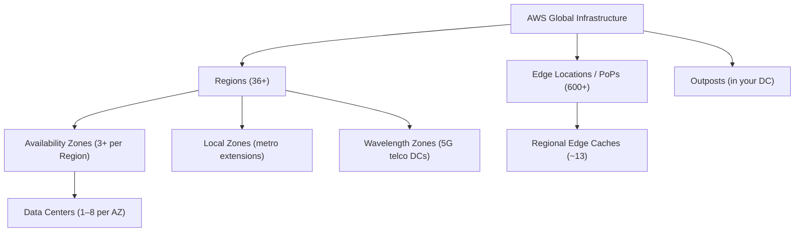
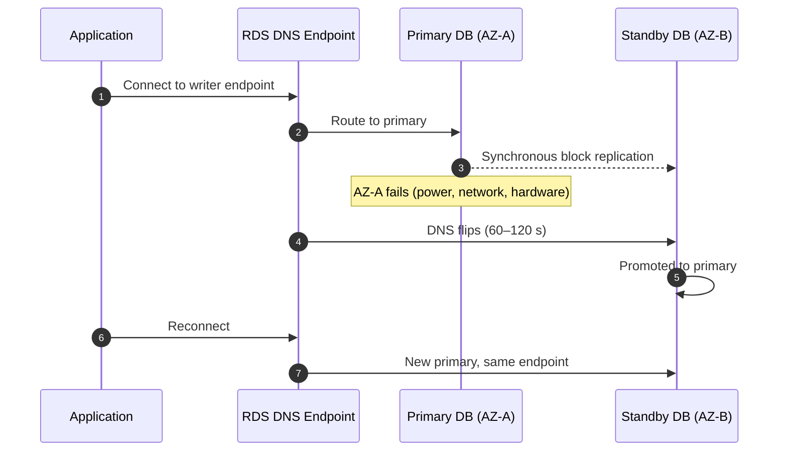
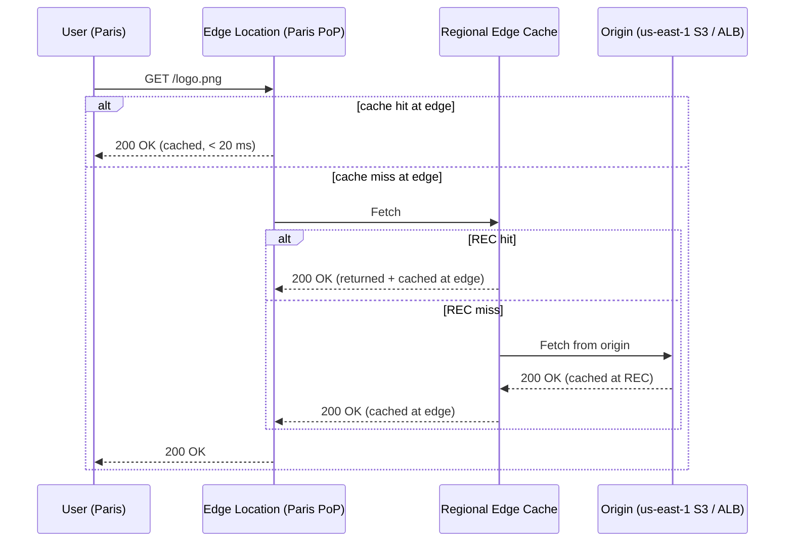
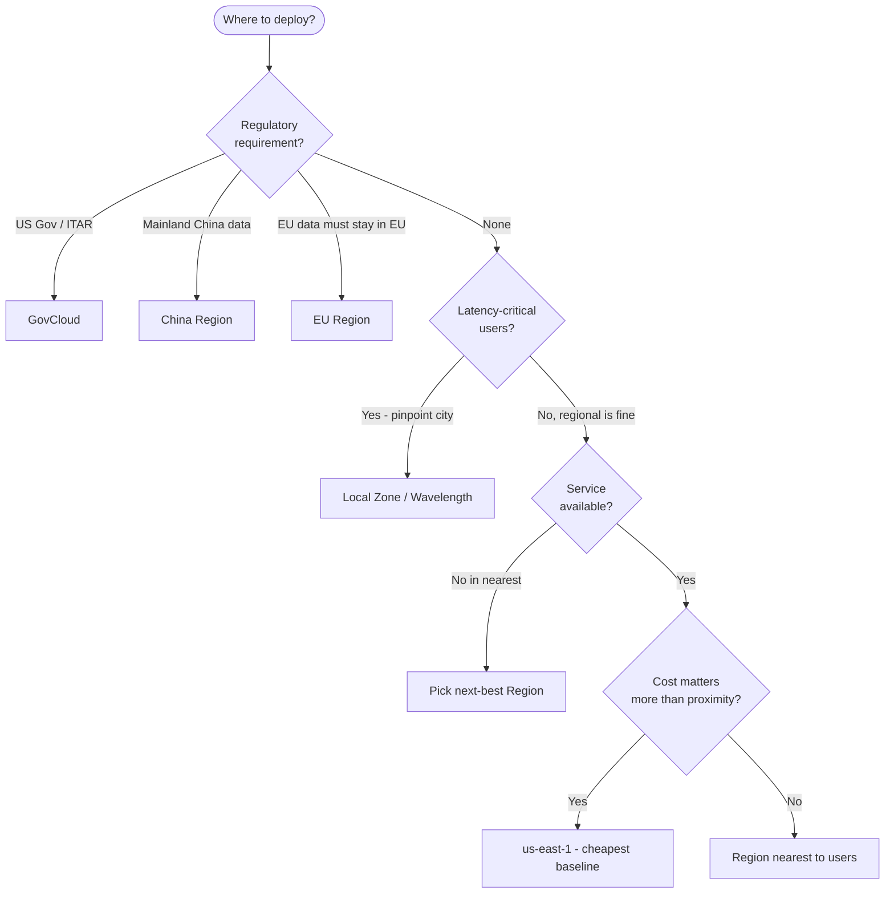
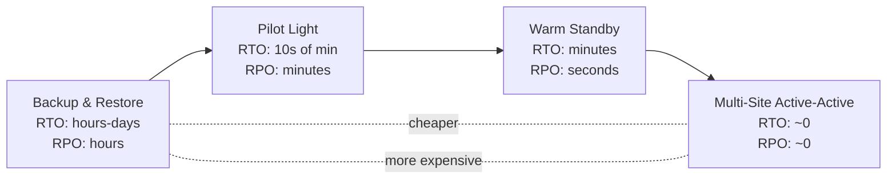

# AWS Global Infrastructure

> Where your stuff physically runs, why it matters, and how to use the geography to design for resilience, performance, compliance, and cost. The first thing every SAA-C03 problem asks you to reason about - implicitly or explicitly.

---

## Table of Contents

- [1. The Global Infrastructure Hierarchy](#1-the-global-infrastructure-hierarchy)
- [2. AWS Regions](#2-aws-regions)
- [3. Availability Zones (AZs)](#3-availability-zones-azs)
- [4. Edge Locations & CloudFront](#4-edge-locations--cloudfront)
- [5. Specialized Infrastructure - Local Zones, Wavelength, Outposts](#5-specialized-infrastructure---local-zones-wavelength-outposts)
- [6. Dedicated Local Zones](#6-dedicated-local-zones)
- [7. Special-Purpose Regions - GovCloud & China](#7-special-purpose-regions---govcloud--china)
- [8. Choosing a Region](#8-choosing-a-region)
- [9. Region Pairs for Disaster Recovery](#9-region-pairs-for-disaster-recovery)
- [10. Global vs Regional Services](#10-global-vs-regional-services)
- [11. Exam Tips (SAA-C03)](#11-exam-tips-saa-c03)
- [Summary](#summary)

---

## 1. The Global Infrastructure Hierarchy

Think of AWS's physical footprint as concentric circles, with edge facilities sitting outside the core regions as a global overlay.



| Layer                      | What it is                                                        | Primary Purpose                                               |
| :------------------------- | :---------------------------------------------------------------- | :------------------------------------------------------------ |
| **Region**                 | A separate geographic area (e.g. N. Virginia, Ireland, Singapore) | Hosts the main services. Picked for compliance and proximity. |
| **Availability Zone (AZ)** | One or more isolated data centers within a Region                 | High availability - the unit of resilience.                   |
| **Edge Location / PoP**    | A small cache facility in a major city                            | Low latency content delivery via CloudFront.                  |
| **Regional Edge Cache**    | A "mid-tier" cache between Edge and Origin                        | Larger cache, holds objects longer than Edge.                 |
| **Local Zone**             | Region extension placed in a metro area                           | Single-digit-ms latency for latency-sensitive apps.           |
| **Wavelength Zone**        | Compute/storage inside a 5G telco DC                              | Ultra-low latency to mobile devices.                          |
| **Outposts**               | A rack of AWS hardware in your own DC                             | Hybrid: run AWS APIs on-premises.                             |
| **Dedicated Local Zone**   | Customer-/community-exclusive Local Zone                          | Sovereign workloads (gov, regulated industries).              |

[⬆ Back to top](#table-of-contents)

---

## 2. AWS Regions

An **AWS Region** is a physical geographic location where AWS clusters its data centers. Examples: `us-east-1` (N. Virginia), `eu-west-1` (Ireland), `ap-south-1` (Mumbai).

### Region Code Anatomy

```
us-east-1
│  │    │
│  │    └── sequence number
│  └─────── geographic area (east, west, north, south, central, northeast, southeast, …)
└────────── partition / continent prefix (us, eu, ap, sa, ca, af, me, …)
```

### Key Characteristics

- **Independence** - Each Region is isolated. Data, traffic, and outages do **not** cross Region boundaries automatically; replication across Regions is opt-in.
- **Compliance / Data Sovereignty** - If law requires data to stay in Germany, deploy to `eu-central-1` (Frankfurt). This single rule decides many architectures.
- **Service Availability Disparity** - Not every service is in every Region. New features almost always launch first in `us-east-1`, `us-west-2`, and `eu-west-1`.
- **Pricing Varies** - `us-east-1` is typically cheapest; specialty regions (São Paulo, Bahrain, Cape Town) are noticeably more expensive.
- **AWS owns 36+ Regions** globally as of 2026, with more announced (Malaysia, Thailand, New Zealand, etc.).

### How to Choose a Region (quick framework - full version: [8. Choosing a Region](#8-choosing-a-region))

1. **Compliance:** Where must the data legally live?
2. **Proximity:** Where are your users / other dependent systems?
3. **Service availability:** Is the service you need offered there?
4. **Cost:** Same workload can cost 30–40 % more in some regions than `us-east-1`.

[⬆ Back to top](#table-of-contents)

---

## 3. Availability Zones (AZs)

An **AZ** is one or more _discrete data centers_ with redundant power, networking, and connectivity, located within a Region.

### Reality vs the Common Myth

- **Myth:** 1 AZ = 1 data center.
- **Reality:** A single AZ can be **up to 8 separate data centers** acting as one logical unit. The 8 DCs share the AZ's identity but are physically distinct buildings.

### Distance & Latency

- AZs are separated by a "meaningful distance" (often tens of km) so that one disaster - flood, fire, regional power outage - cannot take down more than one.
- They're connected by **ultra-low-latency, high-bandwidth, redundant fiber** (within ~100 km / 60 mi).
- Round-trip between AZs is typically **< 2 ms** - low enough for **synchronous replication**.

### Multi-AZ Failover (RDS pattern)



The application doesn't change its connection string - RDS swaps the DNS record under the hood.

### AZ Name vs AZ ID - Critical Exam Gotcha

AZ names (`us-east-1a`, `us-east-1b`) are **mapped differently per AWS account**. Your `us-east-1a` may physically be a different AZ than your colleague's `us-east-1a` in another account. AWS does this on purpose to spread load.

For cross-account guarantees (e.g. VPC sharing, cross-account peering at the AZ level), use the **AZ ID** instead:

| AZ Name (per-account) | AZ ID (global, stable) |
| :-------------------- | :--------------------- |
| `us-east-1a`          | `use1-az1`             |
| `us-east-1b`          | `use1-az2`             |
| `us-east-1c`          | `use1-az4`             |
| …                     | …                      |

Find them in: Console → EC2 → "Account attributes" → "Zones", or `aws ec2 describe-availability-zones`.

### Minimums

- Every Region launched after 2018 has **at least 3 AZs** (some have 6, e.g. `us-east-1`).
- Production architectures should span **at least 2 AZs**; many AWS services require 3 for quorum (e.g. EKS control plane, Aurora, MSK).

[⬆ Back to top](#table-of-contents)

---

## 4. Edge Locations & CloudFront

While Regions and AZs host your _infrastructure_, **Edge Locations** serve your _users_.

### CloudFront Request Flow



### Key Facts

- **600+ Edge Locations** globally - dramatically more than the ~120 Availability Zones.
- **~13 Regional Edge Caches** sit between Edge and Origin; larger size, longer TTL.
- Used by: **CloudFront**, **Route 53** (DNS resolution at edge), **AWS Shield** (DDoS), **AWS Global Accelerator**, **Lambda@Edge**, **CloudFront Functions**.

### Lambda@Edge vs CloudFront Functions (high-yield SAA-C03 distinction)

| Aspect       | CloudFront Functions                        | Lambda@Edge                              |
| :----------- | :------------------------------------------ | :--------------------------------------- |
| Runtime      | JavaScript (lightweight V8)                 | Node.js / Python (full Lambda)           |
| Max duration | < 1 ms                                      | 5 s (viewer) / 30 s (origin)             |
| Triggers     | Viewer Request / Response only              | Viewer + Origin Request / Response       |
| Cost         | ~1/6 of Lambda@Edge                         | More expensive                           |
| Use case     | Header manipulation, redirects, A/B routing | Real auth, dynamic origins, body rewrite |

[⬆ Back to top](#table-of-contents)

---

## 5. Specialized Infrastructure - Local Zones, Wavelength, Outposts

Three lesser-known offerings that solve specific latency or data-residency problems.

### Local Zones

Extension of an AWS Region placed in a metropolitan area to bring compute and storage closer to users.

- **Use case:** Single-digit-ms latency for real-time apps - gaming, live video, media production, EDA workloads.
- **Parent Region:** Each Local Zone is attached to a parent Region (e.g. `us-west-2-lax-1a` is parented to `us-west-2`).
- **Subset of services:** EC2, EBS, FSx, ELB, RDS, ECS, EKS data plane. **Not everything** - control planes still live in the parent Region.
- **Routing:** Your VPC can carve a subnet inside the Local Zone; traffic routes via a parent-Region path under the hood.
- **Data Residency Compliance:** Keeps data within compliant geographic boundaries.

### Wavelength Zones

Even tighter latency - AWS compute embedded inside **5G carrier data centers** (Verizon, KDDI, Vodafone, etc.).

- **Use case:** AR/VR, autonomous vehicles, industrial robotics, real-time ML at the 5G edge.
- **Path savings:** Phone → cell tower → Wavelength server (skips the public internet hop), instead of phone → tower → ISP → AWS Region.

### AWS Outposts

A physical rack (or 1U/2U servers) of AWS-designed hardware that AWS ships and installs in **your** data center.

- **Use case:** On-premises latency requirements, data residency that even Local Zones can't satisfy, hybrid workloads needing identical APIs as cloud.
- **Variants:**
  - **Outposts Rack** - 42U rack, multi-tenant capable, fully managed by AWS.
  - **Outposts Servers** - 1U/2U for small footprints (retail, branch offices).
- **Services:** EC2, EBS, S3 on Outposts, ECS, EKS, RDS, EMR.
- **Connectivity:** A persistent VPN/Direct Connect link back to the parent Region for control-plane operations.

### Quick Decision

| Need                                                   | Pick           |
| :----------------------------------------------------- | :------------- |
| Lowest latency to a city, but I'm flexible on services | **Local Zone** |
| Lowest latency to mobile users on 5G                   | **Wavelength** |
| Hardware must live in my building                      | **Outposts**   |

[⬆ Back to top](#table-of-contents)

---

## 6. Dedicated Local Zones

A **Dedicated Local Zone** is a Local Zone built for the **exclusive use of a single customer or community** (e.g. a government, regulated industry, sovereign cloud).

- **Use case:** Public sector or regulated industries with strict data residency / isolation requirements beyond what regular Local Zones provide.
- **Placement:** Customer-specified location - could be a government facility or a chosen colocation site.
- **Operation:** Fully managed by AWS, just dedicated to one tenant.
- **First customer:** **Singapore's SNDGG** (Smart Nation and Digital Government Group), 2023.

[⬆ Back to top](#table-of-contents)

---

## 7. Special-Purpose Regions - GovCloud & China

These are **separate AWS partitions** - they share the AWS technology but are operationally / contractually isolated from the global ("commercial") AWS.

### AWS GovCloud (US)

- Two Regions: `us-gov-west-1` and `us-gov-east-1`.
- **Operated by U.S. citizens on U.S. soil**, in compliance with **ITAR**, **FedRAMP High**, **DoD SRG IL-2/4/5**, **CJIS**, **HIPAA**.
- **Separate accounts** - a GovCloud account is **not** the same as your regular AWS account. You apply for it separately and get distinct credentials.
- **Service subset** - most major services available, but new releases often arrive months later than commercial.
- **No internet route from commercial to GovCloud** - they're logically and physically separated.

### AWS in China

- Two Regions: `cn-north-1` (Beijing, operated by Sinnet) and `cn-northwest-1` (Ningxia, operated by NWCD).
- **Operated by Chinese partners under Chinese law** - not by AWS directly.
- **Separate accounts**, separate console (`amazonaws.com.cn`), separate billing.
- **No cross-region traffic** to global AWS without a commercial inter-region path (Direct Connect or VPN).
- **ICP license required** for any public-facing internet workload.

### Why this matters for the exam

If a question says "must comply with ITAR" or "Chinese citizens' personal data must stay in mainland China" - answer is GovCloud or China region respectively, even if it's not the cheapest or most service-rich.

[⬆ Back to top](#table-of-contents)

---

## 8. Choosing a Region

A complete decision tree:



Quick cost order (typical, cheapest → most expensive for the same workload):
`us-east-1` < `us-west-2` < `eu-west-1` < other EU < AP < SA / Africa / Middle East specialty regions.

[⬆ Back to top](#table-of-contents)

---

## 9. Region Pairs for Disaster Recovery

For DR strategies above "single-region multi-AZ," you replicate data and standby capacity to a **second Region**. AWS does not enforce pairings, but practitioners reuse a small set:

| Primary                      | Common DR Partner          | Why                                                 |
| :--------------------------- | :------------------------- | :-------------------------------------------------- |
| `us-east-1` (N. Virginia)    | `us-west-2` (Oregon)       | Same partition, opposite coast, full service parity |
| `us-east-2` (Ohio)           | `us-east-1`                | Closest geographic backup                           |
| `eu-west-1` (Ireland)        | `eu-central-1` (Frankfurt) | Both EU jurisdiction                                |
| `ap-southeast-1` (Singapore) | `ap-southeast-2` (Sydney)  | Same partition, distinct natural-disaster zones     |
| `ap-northeast-1` (Tokyo)     | `ap-northeast-3` (Osaka)   | Domestic DR within Japan                            |

### DR Patterns by RTO/RPO



Services that natively support cross-Region replication:

- **S3** - Cross-Region Replication (CRR) and Same-Region Replication (SRR).
- **RDS** - cross-region read replicas (manual promote on failover).
- **Aurora Global Database** - < 1 s replication, < 1 min failover.
- **DynamoDB Global Tables** - active-active multi-region, < 1 s replication.
- **AWS Backup** - cross-Region copies for EBS, RDS, EFS, FSx, DynamoDB.
- **Route 53** - health-check-based failover routing between regional endpoints.

[⬆ Back to top](#table-of-contents)

---

## 10. Global vs Regional Services

A high-yield question pattern: "Which service do you create in only one place but it works everywhere?"

| Scope                                  | Services                                                                                                                                                                                                               |
| :------------------------------------- | :--------------------------------------------------------------------------------------------------------------------------------------------------------------------------------------------------------------------- |
| **Global** (one endpoint, all regions) | IAM, AWS Organizations, Route 53, CloudFront, WAF (global), Shield, AWS Global Accelerator, AWS Account, Trusted Advisor, IAM Identity Center directory, ACM (when used with CloudFront - cert must be in `us-east-1`) |
| **Regional** (per-Region resource)     | VPC, EC2, EBS, RDS, DynamoDB, SQS, SNS, S3 _(bucket name is global, data is regional)_, Lambda, ECS, EKS, KMS keys, Secrets Manager, ACM (per region, except the CloudFront special case)                              |
| **Per-AZ** (resource pinned to one AZ) | EC2 instance, EBS volume, RDS DB instance (without Multi-AZ), an ElastiCache node, an EFS mount target                                                                                                                 |

> **S3 oddity:** the bucket **name** is in a global namespace (no two buckets can share a name, ever), but the **data and the bucket's region attribute** are regional. Cross-Region Replication is opt-in.

> **STS oddity:** `sts.amazonaws.com` resolves to `us-east-1` by default; you should switch to the regional endpoint (`sts.eu-west-1.amazonaws.com`, etc.) for latency and to keep STS available when `us-east-1` has an outage.

[⬆ Back to top](#table-of-contents)

---

## 11. Exam Tips (SAA-C03)

High-yield patterns the exam loves:

1. **"Across AZs" = HA. "Across Regions" = DR.** If the question says "survive a fire that destroys an entire data center," that's multi-AZ. "Survive a regional outage" - multi-region.
2. **Multi-AZ ≠ Read Replica.** Multi-AZ RDS is for HA (synchronous, standby is unreachable by clients). Read replicas are for read scaling (asynchronous, can be promoted manually).
3. **CloudFront with S3 origin:** lock down the bucket with **Origin Access Control (OAC)** - the modern replacement for Origin Access Identity (OAI).
4. **IAM, Route 53, CloudFront, WAF (global) are global.** Don't pick a region for them.
5. **ACM certs for CloudFront must be in `us-east-1`.** Anywhere else won't work with a CloudFront distribution. (For ALBs / API Gateway, ACM is per-region.)
6. **GovCloud and China are separate partitions** - separate accounts, separate console, no cross-partition traffic without explicit configuration.
7. **AZ IDs vs AZ names** - for cross-account VPC sharing or co-locating workloads in the same physical AZ, you must compare AZ IDs.
8. **Pricing pattern:** if a question is cost-sensitive and otherwise equal, `us-east-1` is usually the answer.
9. **Edge services to remember:** CloudFront, Route 53, AWS Shield, AWS Global Accelerator, Lambda@Edge, CloudFront Functions. Anything DNS, CDN, DDoS, or "latency to global users" lives here.
10. **Local Zones, Wavelength, Outposts - pick by the question's keyword:** "metropolitan / city / single-digit ms" → Local Zone. "5G / mobile / cellular" → Wavelength. "On-prem / data center / consistent APIs" → Outposts.

[⬆ Back to top](#table-of-contents)

---

## Summary

- **Region** = isolated geography. **AZ** = isolated data centers within a Region. **Edge** = global cache overlay.
- Build for **HA** with at least 2 AZs in a Region; build for **DR** with a second Region.
- Most services are **regional**; remember the small set of **global** ones (IAM, Route 53, CloudFront, Organizations, WAF-global, Shield, Global Accelerator).
- **GovCloud** and **China** are separate partitions - different accounts, different rules.
- Use **AZ IDs**, not AZ names, when you need cross-account guarantees.
- For sub-10 ms latency to a specific city, reach for **Local Zones**, **Wavelength**, or **Outposts** in that order of "how close do you need to be."
- Region selection: **compliance → latency → service availability → cost.** In that order.

Next up in the study path:

- [01 - IAM Intro bits & bytes](01%20-%20IAM%20Intro%20bits%20%26%20bytes.md) - identities, policies, evaluation logic
- [05 - IAM Scenarios](05%20-%20IAM%20Scenarios.md) - applied IAM with real JSON

[⬆ Back to top](#table-of-contents)
