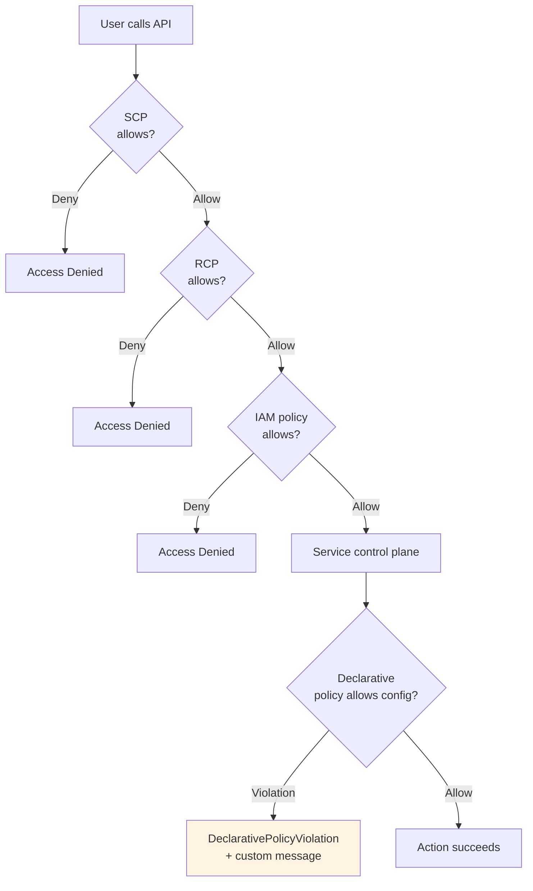

# Declarative Policies - SAA-C03 Deep Dive

> The **newest** AWS governance layer (re:Invent 2024). Where SCPs/RCPs intercept API calls, **declarative policies enforce service configurations at the control plane** - so new APIs and features are governed automatically, and you get **custom error messages**. EC2, EBS, and VPC at launch.

See also: [08 - SCP](08%20-%20SCP.md) · [09 - RCP](09%20-%20RCP.md) · [11 - Permissions Boundaries](11%20-%20Permissions%20Boundaries.md) · [06 - IAM Identity Center & Organizations](06%20-%20IAM%20Identity%20Center%20%26%20Organizations.md) · [23 - IAM Security Tools](23%20-%20IAM%20Security%20Tools.md) · [29 - Ex Qns](29%20-%20Ex%20Qns.md)

---

## Table of Contents

- [Part 1: What Are Declarative Policies? The Core Concept](#part-1-what-are-declarative-policies-the-core-concept)
- [Part 2: How Declarative Policies Differ from SCPs and RCPs](#part-2-how-declarative-policies-differ-from-scps-and-rcps)
- [Part 3: Supported Services and Attributes (Current)](#part-3-supported-services-and-attributes-current)
- [Part 4: Real-World Declarative Policy Examples](#part-4-real-world-declarative-policy-examples)
- [Part 5: Attachment Hierarchy and Inheritance](#part-5-attachment-hierarchy-and-inheritance)
- [Part 6: The Assessment and Readiness Workflow](#part-6-the-assessment-and-readiness-workflow)
- [Part 7: What Happens When a User Violates a Declarative Policy](#part-7-what-happens-when-a-user-violates-a-declarative-policy)
- [Part 8: Exam Scenario Analysis](#part-8-exam-scenario-analysis)
- [Part 9: Implementation Methods](#part-9-implementation-methods)
- [Part 10: SAA-C03 Exam Summary Table](#part-10-saa-c03-exam-summary-table)
- [The Complete Policy Framework Summary](#the-complete-policy-framework-summary)

---



---

Declarative Policies are the **newest** addition to AWS's governance toolkit (announced at re:Invent 2024, appearing in exams from late 2025 onward). They represent a fundamental shift from **permissions-based** controls to **configuration-enforcement** controls .

---

## Part 1: What Are Declarative Policies? The Core Concept

### Definition

A **Declarative Policy** is a management policy in AWS Organizations that enforces **desired configurations** for AWS services across your organization. Unlike SCPs and RCPs (which control _who_ can do _what_), declarative policies control _how services are configured_ .

### The Simple Analogy

Think of the three policy types as different types of building rules:

| Policy Type            | Analogy                                             | Question It Answers                  |
| :--------------------- | :-------------------------------------------------- | :----------------------------------- |
| **SCP**                | "No one under 18 can enter the building"            | Who can enter?                       |
| **RCP**                | "Visitors cannot enter the server room"             | Which areas can people access?       |
| **Declarative Policy** | "All emergency exits must be unlocked at all times" | How must the building be configured? |

### Key Characteristics

| Characteristic            | Details                                                                   |
| :------------------------ | :------------------------------------------------------------------------ |
| **What it controls**      | Service configurations (not permissions)                                  |
| **How it works**          | Applies directly to the service's control plane, not via API interception |
| **Future-proofing**       | Automatically applies to new APIs and features as they're released        |
| **Custom error messages** | Can display organization-specific guidance when users hit restrictions    |
| **Service link roles**    | Uses service-linked roles to operate                                      |

---

## Part 2: How Declarative Policies Differ from SCPs and RCPs

This is **critical exam knowledge**. The differences aren't subtle - they're fundamental .

| Aspect                             | SCP                                    | RCP                      | Declarative Policy                  |
| :--------------------------------- | :------------------------------------- | :----------------------- | :---------------------------------- |
| **Governs**                        | IAM principals                         | AWS resources            | Service configuration               |
| **Mechanism**                      | Intercepts API calls                   | Intercepts API calls     | Direct service control plane        |
| **New API/future features**        | Must be explicitly added to deny lists | Must be explicitly added | Automatically enforced              |
| **Custom error messages**          | ❌ No                                  | ❌ No                    | ✅ Yes                              |
| **Service-linked roles**           | ❌ No                                  | ❌ No                    | ✅ Yes                              |
| **Can grant permissions?**         | No (only limits)                       | No (only limits)         | N/A (configures, doesn't authorize) |
| **Applies to management account?** | No (principals exempt)                 | No (resources exempt)    | ✅ Yes (full organization)          |

### The "Future-Proof" Advantage

This is the **#1 exam talking point** for declarative policies .

**The Old Problem:** When AWS releases a new feature or API, your SCPs and RCPs don't automatically block it. An attacker or uninformed user could use the new API to bypass your controls until you update your policies.

**The Declarative Solution:** Declarative policies are enforced at the service's control plane. When AWS adds new features, the declarative policy applies to them automatically. No gap period. No manual updates .

### The Custom Error Message Feature

When a user is blocked by an SCP or RCP, they get a generic permission denied error. With declarative policies, you can provide **custom error messages** that guide users to internal wikis, ticketing systems, or support channels .

**Example custom error:**

```
This functionality has been disabled by a Declarative Policy.
Custom Message: Public EBS snapshots are prohibited for security compliance.
Please contact security@company.com for exceptions.
```

---

## Part 3: Supported Services and Attributes (Current)

As of launch, declarative policies support **Amazon EC2, Amazon EBS, and Amazon VPC** configurations .

### Supported Attributes

| Service | Attribute                                     | What It Controls                                    |
| :------ | :-------------------------------------------- | :-------------------------------------------------- |
| **EC2** | `ec2_attributes.snapshot_block_public_access` | Blocks public sharing of EBS snapshots              |
| **EC2** | `ec2_attributes.ami_block_public_access`      | Blocks public sharing of AMIs                       |
| **EC2** | `ec2_attributes.imdsv2`                       | Enforces Instance Metadata Service v2               |
| **EC2** | `ec2_attributes.serial_console_access`        | Controls serial console access for troubleshooting  |
| **VPC** | `vpc_attributes.block_public_access`          | Prevents internet access from VPCs/subnets via IGWs |
| **EBS** | `ebs_attributes.snapshot_block_public_access` | Blocks public EBS snapshot sharing                  |

This list will expand over time. For the exam, focus on **EC2, EBS, and VPC** as the core supported services .

---

## Part 4: Real-World Declarative Policy Examples

### Example 1: Block Public EBS Snapshots Organization-Wide

**Scenario:** Your security team wants to ensure no EBS snapshot in any account can be shared publicly. This policy goes on the organization root.

**Declarative Policy:**

```json
{
  "ec2_attributes": {
    "snapshot_block_public_access": {
      "state": {
        "@@assign": "block_all_sharing"
      }
    },
    "exception_message": {
      "@@assign": "Public EBS snapshots are prohibited by organizational security policy. Contact #security-team for approved sharing mechanisms."
    }
  }
}
```

**What it does:**

- `block_all_sharing` = Completely prevents any public sharing of EBS snapshots
- The custom message appears when users attempt to share snapshots publicly

**Exam Tip:** `block_all_sharing` vs `block_new_sharing`:

- `block_all_sharing`: Blocks both existing and new public shares (strictest)
- `block_new_sharing`: Blocks new public shares but leaves existing ones intact (for migration)

### Example 2: Enforce IMDSv2 Across All EC2 Instances

**Scenario:** IMDSv1 is vulnerable to SSRF attacks. You want all EC2 instances to require IMDSv2.

**Declarative Policy:**

```json
{
  "ec2_attributes": {
    "imdsv2": {
      "state": {
        "@@assign": "required"
      }
    },
    "exception_message": {
      "@@assign": "IMDSv2 is required for security. Use 'aws ec2 modify-instance-metadata-options --http-tokens required' to fix."
    }
  }
}
```

### Example 3: Block Public Internet Access from VPCs

**Scenario:** Your organization prohibits any resources from having direct internet access via Internet Gateways.

**Declarative Policy:**

```json
{
  "vpc_attributes": {
    "block_public_access": {
      "state": {
        "@@assign": "block_all"
      }
    },
    "exception_message": {
      "@@assign": "Direct internet access is prohibited. Use approved NAT gateways or VPC endpoints only."
    }
  }
}
```

**Exam Tip:** This is different from network ACLs or security groups. This declarative policy prevents IGWs from being created or used at the service level.

### Example 4: Allow-List Specific AMI Providers

**Scenario:** You only want EC2 instances launched using AMIs from approved vendors (e.g., official AWS or your own hardened images).

**Declarative Policy:**

```json
{
  "ec2_attributes": {
    "allowed_amis": {
      "state": {
        "@@assign": {
          "account_ids": ["123456789012", "aws-marketplace"],
          "owners": ["self"]
        }
      }
    },
    "exception_message": {
      "@@assign": "Only approved AMIs from internal accounts or AWS Marketplace may be used."
    }
  }
}
```

---

## Part 5: Attachment Hierarchy and Inheritance

Like SCPs and RCPs, declarative policies attach to **organization root, OUs, or individual accounts** .

### The Inheritance Rules

| Attachment Level       | Effect                                                 |
| :--------------------- | :----------------------------------------------------- |
| **Organization root**  | Applies to ALL accounts in the organization            |
| **OU**                 | Applies to all accounts in that OU (unless overridden) |
| **Individual account** | Overrides or refines policies from higher levels       |

### Creating Exceptions (The Override Pattern)

One of the most powerful features: you can attach a **different** declarative policy directly to an account to override the policy applied at the OU or root level .

**Example Scenario:**

- Root OU policy: Blocks all public EBS snapshots (`block_all_sharing`)
- Audit account: Needs to share a snapshot publicly for a compliance review

**Solution:** Attach this policy directly to the audit account:

```json
{
  "ec2_attributes": {
    "snapshot_block_public_access": {
      "state": {
        "@@assign": "unblocked"
      }
    }
  }
}
```

**Result:** The audit account can share snapshots publicly; all other accounts remain blocked .

---

## Part 6: The Assessment and Readiness Workflow

This is a **critical exam scenario** - AWS expects you to know that you should **assess before enforcing** .

### Step 1: Generate Account Status Report

Before attaching a declarative policy, run a readiness assessment to understand current configurations across your organization.

```bash
aws organizations generate-declarative-policies-account-status-report \
    --target-id r-abcd \
    --region us-east-1
```

**The report shows:**

- Which accounts already comply with the desired configuration
- Which accounts have exceptions or deviations
- The most frequent configuration value across your organization

### Step 2: Start Small

Attach the policy to a single test account first. Validate behavior before scaling.

### Step 3: Scale Gradually

Move the policy up to the OU level, then the root level, after confirming it works as intended.

### Step 4: Monitor Effective Policies

Use the `DescribeEffectivePolicy` API to verify what policy actually applies to a given account:

```bash
aws organizations describe-effective-policy \
    --policy-type DECLARATIVE_POLICY_EC2 \
    --target-id arn:aws:organizations::123456789012:account/o-abcd/111111111111
```

---

## Part 7: What Happens When a User Violates a Declarative Policy

The user experience is different from SCPs .

**SCP violation:**

```
An error occurred (AccessDenied) when calling the DisableSnapshotBlockPublicAccess operation:
User: arn:aws:iam::111111111111:user/alice is not authorized to perform: ec2:DisableSnapshotBlockPublicAccess
```

**Declarative Policy violation:**

```
An error occurred (DeclarativePolicyViolation) when calling the DisableSnapshotBlockPublicAccess operation:
This functionality has been disabled by a Declarative Policy.
Custom Message: Public EBS snapshots are prohibited by organizational security policy.
Contact #security-team for approved sharing mechanisms.
```

**Key differences:**

- Error code is `DeclarativePolicyViolation` (not `AccessDenied`)
- Custom message can provide guidance and next steps
- Users understand it's a _configuration restriction_, not a _permissions issue_

---

## Part 8: Exam Scenario Analysis

### Scenario 1: The "Future API" Question

**Question:** An organization uses SCPs to block public AMI sharing. AWS releases a new API called `ec2:SharePubliclyV2`. Users begin sharing AMIs publicly using the new API. Why isn't the SCP blocking this?

**Answer:** SCPs operate at the API level and must explicitly list actions. The new API wasn't in the deny list, so it wasn't blocked. A declarative policy would have prevented this because it enforces configuration at the service level, not API level.

**Exam Tip:** This is the **signature use case** for declarative policies over SCPs.

### Scenario 2: The "Custom Error Message" Question

**Question:** A company wants users who attempt to create public EBS snapshots to see a message directing them to an internal request form. Which policy type supports this?

**Answer:** Declarative Policy. Only declarative policies support custom error messages .

### Scenario 3: The "Management Account" Question

**Question:** An organization attaches a declarative policy at the root level blocking public AMIs. Does this apply to the management account?

**Answer:** Yes. Unlike SCPs (which don't affect management account principals), declarative policies apply to **all accounts** in the organization, including the management account .

---

## Part 9: Implementation Methods

### AWS Console

1. Navigate to AWS Organizations > Policies
2. Select "Declarative policies for EC2" (or other service)
3. Create policy with JSON
4. Attach to root, OU, or account

### AWS CLI

```bash
# Create a declarative policy
aws organizations create-policy \
    --name "BlockPublicSnapshots" \
    --type DECLARATIVE_POLICY_EC2 \
    --content file://policy.json \
    --description "Blocks public EBS snapshots across organization"

# Attach to an OU
aws organizations attach-policy \
    --policy-id p-declarative123 \
    --target-id ou-abc12345
```

### AWS CloudFormation

```yaml
Resources:
  BlockPublicSnapshotsPolicy:
    Type: AWS::Organizations::Policy
    Properties:
      Name: BlockPublicSnapshots
      Type: DECLARATIVE_POLICY_EC2
      Content: |
        {
          "ec2_attributes": {
            "snapshot_block_public_access": {
              "state": {
                "@@assign": "block_all_sharing"
              }
            }
          }
        }
```

---

## Part 10: SAA-C03 Exam Summary Table

| Concept                               | What You Must Know                                      |
| :------------------------------------ | :------------------------------------------------------ |
| **What declarative policies control** | Service configuration (not permissions)                 |
| **Key differentiator from SCP/RCP**   | Enforced at service control plane, not API interception |
| **Future-proofing benefit**           | Automatically applies to new APIs and features          |
| **Custom messages**                   | ✅ Yes (unique to declarative policies)                 |
| **Service-linked roles**              | ✅ Yes (unique to declarative policies)                 |
| **Supported services (launch)**       | EC2, EBS, VPC                                           |
| **Management account**                | ✅ Affected (unlike SCPs)                               |
| **Pre-enforcement step**              | Generate account status report for readiness assessment |
| **Inheritance**                       | Root → OU → Account (override possible at each level)   |

---

## The Complete Policy Framework Summary

| Policy Type              | Controls                  | Mechanism               | Future APIs    | Custom Errors | Exam Frequency |
| :----------------------- | :------------------------ | :---------------------- | :------------- | :------------ | :------------- |
| **SCP**                  | Principal permissions     | API interception (Deny) | ❌ Must update | ❌ No         | Very High      |
| **RCP**                  | Resource access           | API interception (Deny) | ❌ Must update | ❌ No         | Medium         |
| **Declarative**          | Service config            | Control plane           | ✅ Automatic   | ✅ Yes        | High (new)     |
| **Permissions Boundary** | Principal max permissions | IAM evaluation          | ❌ Must update | ❌ No         | Medium         |

---
