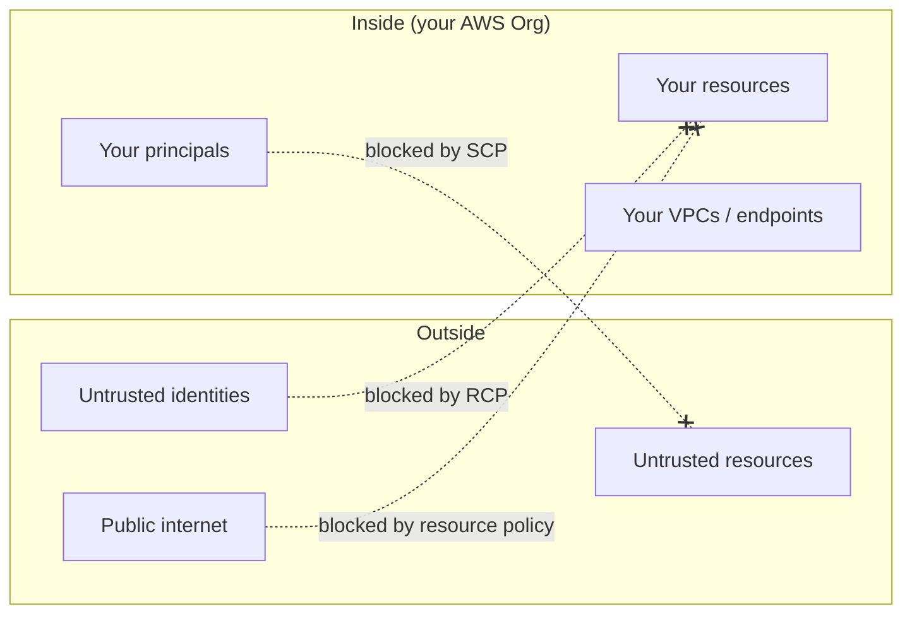
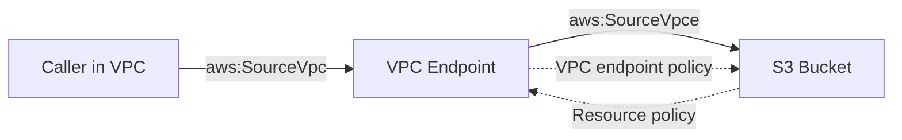

# Data Perimeter Playbook

> The **complete combo pattern** that puts a firm boundary around your AWS environment: which identities can do what, which resources can be accessed by whom, which networks traffic must come from. Brings together **SCPs + RCPs + VPC endpoint policies + KMS key policies** into one coherent design. Appears on the SAA-C03 as "how do you make sure data can never leave / arrive from outside the company?"

See also: [08 - SCP](08%20-%20SCP.md) · [09 - RCP](09%20-%20RCP.md) · [10 - Declarative Policies](10%20-%20Declarative%20Policies.md) · [11 - Permissions Boundaries](11%20-%20Permissions%20Boundaries.md) · [20 - KMS & Envelope Encryption](20%20-%20KMS%20%26%20Envelope%20Encryption.md) · [06 - IAM Identity Center & Organizations](06%20-%20IAM%20Identity%20Center%20%26%20Organizations.md)

---

## Table of Contents

- [1. What "Data Perimeter" Means](#1-what-data-perimeter-means)
- [2. The Three Dimensions](#2-the-three-dimensions)
- [3. Identities You Trust - `aws:PrincipalOrgID`](#3-identities-you-trust---awsprincipalorgid)
- [4. Resources You Trust - `aws:ResourceOrgID`](#4-resources-you-trust---awsresourceorgid)
- [5. Networks You Trust - `aws:SourceVpc` / `aws:SourceVpce`](#5-networks-you-trust---awssourcevpc--awssourcevpce)
- [6. Full SCP + RCP + VPC Endpoint + KMS Policy Pattern](#6-full-scp--rcp--vpc-endpoint--kms-policy-pattern)
- [7. The "Service Calls Itself" Trap](#7-the-service-calls-itself-trap)
- [8. Exam Tips (SAA-C03)](#8-exam-tips-saa-c03)
- [Summary](#summary)

---

## 1. What "Data Perimeter" Means

A **data perimeter** is a set of preventive controls that ensures:

- Only **trusted identities** can perform actions on company resources
- Only **trusted resources** can be accessed by company identities
- Only **trusted networks** can carry the traffic between them



[⬆ Back to top](#table-of-contents)

---

## 2. The Three Dimensions

| Dimension      | Direction                               | Primary control                                                                 |
| :------------- | :-------------------------------------- | :------------------------------------------------------------------------------ |
| **Identities** | "My principals → my resources"          | SCP (with `aws:ResourceOrgID`)                                                  |
| **Resources**  | "External principals → my resources"    | RCP (with `aws:PrincipalOrgID`)                                                 |
| **Networks**   | "Any access → my resources from where?" | VPC endpoint policy + resource policy (with `aws:SourceVpc` / `aws:SourceVpce`) |

The three together close every escape route. Missing one is how data exfiltration tends to happen in practice.

[⬆ Back to top](#table-of-contents)

---

## 3. Identities You Trust - `aws:PrincipalOrgID`

The condition key that says "the caller must belong to my organization."

```json
{
  "Effect": "Deny",
  "Principal": "*",
  "Action": "*",
  "Resource": "arn:aws:s3:::sensitive-bucket/*",
  "Condition": {
    "StringNotEqualsIfExists": {
      "aws:PrincipalOrgID": "o-abc1234567"
    }
  }
}
```

- Lives in a **resource policy** (S3 bucket policy, KMS key policy, SQS queue policy, etc.).
- Or, in an **RCP** (organization-wide) - see [09 - RCP](09%20-%20RCP.md).
- `IfExists` is important so internal AWS service-linked principals (which don't carry an org context) aren't accidentally blocked.

[⬆ Back to top](#table-of-contents)

---

## 4. Resources You Trust - `aws:ResourceOrgID`

Mirror of the above - used in **SCPs** to stop your own principals from sending data to external resources.

```json
{
  "Effect": "Deny",
  "Action": ["s3:PutObject", "s3:CopyObject"],
  "Resource": "*",
  "Condition": {
    "StringNotEqualsIfExists": {
      "aws:ResourceOrgID": "o-abc1234567"
    }
  }
}
```

- Lives in an **SCP** attached to the OU containing your workloads.
- Stops an attacker (or unwitting developer) from exfiltrating to an S3 bucket in _another_ AWS organization.

[⬆ Back to top](#table-of-contents)

---

## 5. Networks You Trust - `aws:SourceVpc` / `aws:SourceVpce`

The condition keys that say "the request must come from inside our network."

| Key              | What it pins                                                | Stable across VPC re-create?           |
| :--------------- | :---------------------------------------------------------- | :------------------------------------- |
| `aws:SourceVpc`  | The VPC ID of the caller (must come through a VPC endpoint) | ❌ Recreate VPC → new ID               |
| `aws:SourceVpce` | The VPC endpoint ID                                         | ❌ Recreate endpoint → new ID          |
| `aws:SourceIp`   | Public IP                                                   | Doesn't work for traffic via endpoints |

Two layers needed:



- **VPC endpoint policy** restricts what the endpoint can talk to (e.g. "only buckets in our org").
- **Resource policy on the bucket** restricts who can reach it (e.g. "only via this endpoint").

[⬆ Back to top](#table-of-contents)

---

## 6. Full SCP + RCP + VPC Endpoint + KMS Policy Pattern

A worked example: lock down S3 + KMS so sensitive data can only flow inside the org, over the corporate VPC, encrypted with the corporate KMS key.

### a) SCP on the Workloads OU - block outbound to untrusted orgs

```json
{
  "Effect": "Deny",
  "Action": ["s3:*", "kms:*"],
  "Resource": "*",
  "Condition": {
    "StringNotEqualsIfExists": {
      "aws:ResourceOrgID": "o-abc1234567"
    }
  }
}
```

### b) RCP at the Org root - block inbound from untrusted identities

```json
{
  "Effect": "Deny",
  "Principal": "*",
  "Action": "*",
  "Resource": "*",
  "Condition": {
    "StringNotEqualsIfExists": {
      "aws:PrincipalOrgID": "o-abc1234567"
    }
  }
}
```

### c) S3 bucket policy - require traffic through corporate VPC endpoint

```json
{
  "Effect": "Deny",
  "Principal": "*",
  "Action": "s3:*",
  "Resource": [
    "arn:aws:s3:::sensitive-bucket",
    "arn:aws:s3:::sensitive-bucket/*"
  ],
  "Condition": {
    "StringNotEqualsIfExists": {
      "aws:SourceVpce": "vpce-0a1b2c3d4e"
    }
  }
}
```

### d) KMS key policy - only this bucket can use the key for S3 ops

```json
{
  "Effect": "Allow",
  "Principal": { "AWS": "arn:aws:iam::111111111111:root" },
  "Action": "kms:Decrypt",
  "Resource": "*",
  "Condition": {
    "StringEquals": {
      "kms:EncryptionContext:aws:s3:arn": "arn:aws:s3:::sensitive-bucket"
    }
  }
}
```

All four together = a perimeter that's hard to escape with a single mis-config.

[⬆ Back to top](#table-of-contents)

---

## 7. The "Service Calls Itself" Trap

AWS services routinely call other AWS services on your behalf (CloudFormation reading templates from S3, Athena querying Glue, Lambda fetching from ECR…). Many of these calls **don't carry `aws:PrincipalOrgID`** because the calling principal is an AWS service.

Mitigations:

- Use the `aws:ViaAWSService` condition key (true when an AWS service is in the call path) - exclude these from your Deny.
- Use the `aws:PrincipalIsAWSService` condition.
- Always use `IfExists` operators on data-perimeter conditions to gracefully handle missing keys.

A common workable Deny:

```json
"Condition": {
  "StringNotEqualsIfExists": { "aws:PrincipalOrgID": "o-abc1234567" },
  "BoolIfExists": { "aws:PrincipalIsAWSService": "false" }
}
```

[⬆ Back to top](#table-of-contents)

---

## 8. Exam Tips (SAA-C03)

1. **"Block any access from outside the organization"** → RCP with `aws:PrincipalOrgID`.
2. **"Block our principals from sending data to external resources"** → SCP with `aws:ResourceOrgID`.
3. **"Restrict S3 access to a specific VPC endpoint"** → bucket policy with `aws:SourceVpce`.
4. **`aws:SourceIp` does not work for VPC-endpoint traffic.** Use `aws:SourceVpc` / `aws:SourceVpce` instead.
5. Always use **`IfExists`** for data-perimeter conditions - avoids breaking AWS service-linked calls.
6. **Data perimeter = SCP + RCP + Endpoint policy + Resource policy + KMS policy** - all five layers, all enforced.
7. **`aws:ViaAWSService` / `aws:PrincipalIsAWSService`** are the safety valves for "AWS itself is calling on my behalf."
8. KMS **encryption context** is the often-forgotten perimeter - bind a key to a specific resource ARN with `kms:EncryptionContext:*`.

[⬆ Back to top](#table-of-contents)

---

## Summary

- A data perimeter has three dimensions: **identities, resources, networks**.
- Five policy types layered together: **SCP, RCP, VPC endpoint policy, resource policy, KMS key policy**.
- Key condition keys: `aws:PrincipalOrgID`, `aws:ResourceOrgID`, `aws:SourceVpc`, `aws:SourceVpce`.
- Always `IfExists` + the `ViaAWSService` / `PrincipalIsAWSService` escape valves.
- The exam loves "make sure data cannot leave / arrive from outside the organization" - this pattern is the answer.

[⬆ Back to top](#table-of-contents)
