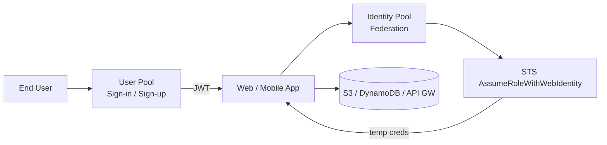
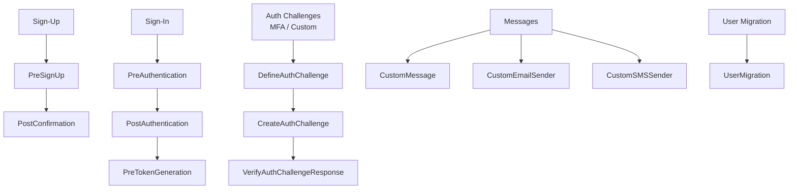
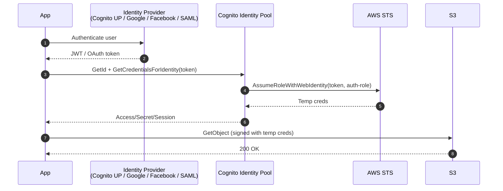
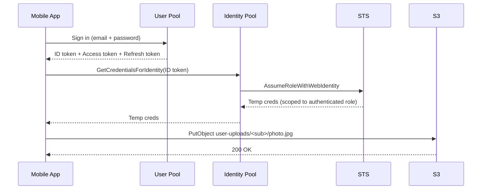
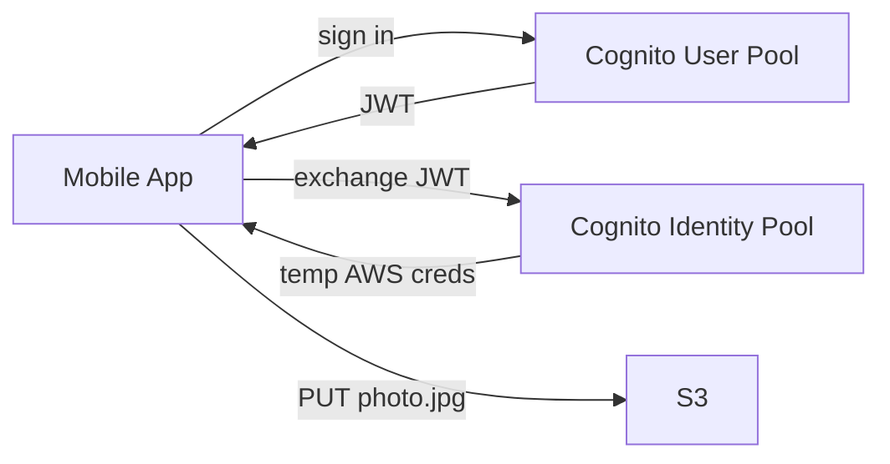
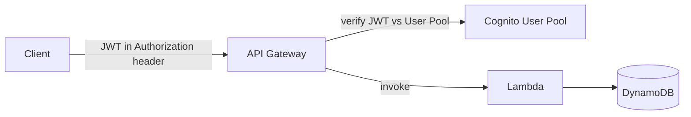
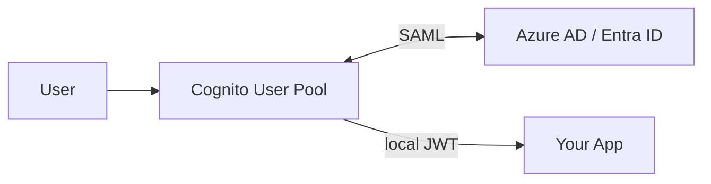

# Amazon Cognito - User Pools & Identity Pools

> AWS's identity service for **end-user apps** (web, mobile, IoT). Two distinct components that work together and are constantly confused on the exam: **User Pools** answer "who is signing in?", **Identity Pools** answer "what AWS credentials does that signed-in user get?".

See also: [01 - IAM Intro bits & bytes](01%20-%20IAM%20Intro%20bits%20%26%20bytes.md) · [13 - STS & Federation](13%20-%20STS%20%26%20Federation.md) · [06 - IAM Identity Center & Organizations](06%20-%20IAM%20Identity%20Center%20%26%20Organizations.md)

---

## Table of Contents

- [1. Cognito in 30 Seconds](#1-cognito-in-30-seconds)
- [2. User Pools - Authentication](#2-user-pools---authentication)
- [3. User Pool Features](#3-user-pool-features)
- [4. App Clients](#4-app-clients)
- [5. Lambda Triggers](#5-lambda-triggers)
- [6. Identity Pools - AWS Credentials](#6-identity-pools---aws-credentials)
- [7. User Pool + Identity Pool Together](#7-user-pool--identity-pool-together)
- [8. Hosted UI & Federated Sign-In](#8-hosted-ui--federated-sign-in)
- [9. Cognito vs IAM vs SAML](#9-cognito-vs-iam-vs-saml)
- [10. Common Architectures](#10-common-architectures)
- [11. Exam Tips (SAA-C03)](#11-exam-tips-saa-c03)
- [Summary](#summary)

---

## 1. Cognito in 30 Seconds

| Component                                | Solves                                                               | Output                                                                |
| :--------------------------------------- | :------------------------------------------------------------------- | :-------------------------------------------------------------------- |
| **User Pool**                            | Authentication & user directory                                      | Cognito-issued **JWT tokens** (ID token, access token, refresh token) |
| **Identity Pool** (Federated Identities) | Authorization - getting **AWS STS credentials** for a signed-in user | Temporary `ASIA…` AWS credentials                                     |

The naming is unfortunate. Many architectures use **both**: the User Pool authenticates the human, then the Identity Pool exchanges the user-pool token for AWS credentials.



[⬆ Back to top](#table-of-contents)

---

## 2. User Pools - Authentication

A **User Pool** is a managed user directory. Think of it as "your own Auth0 / Firebase Auth, but on AWS."

### What you get out of the box

- **Sign-up & sign-in** flows (username + password, email + password, phone + password).
- **MFA** - SMS, TOTP (Google Authenticator), or both. Optional / Required / Adaptive.
- **Password policies** - length, complexity, history.
- **Forgot password** flows.
- **Email / phone verification** with one-time codes.
- **Account lockout** after N failed attempts (built-in).
- **Custom attributes** on user profiles (immutable or mutable).
- **JWT tokens** issued on successful sign-in: ID token (user info), Access token (API authz), Refresh token (renew the others).

[⬆ Back to top](#table-of-contents)

---

## 3. User Pool Features

| Feature                                | Notes                                                                                                                 |
| :------------------------------------- | :-------------------------------------------------------------------------------------------------------------------- |
| **Hosted UI**                          | Cognito-hosted sign-in / sign-up pages. Customizable CSS + logo. No code to build the UI.                             |
| **Federated sign-in**                  | Users can sign in via Google, Facebook, Apple, Amazon, or any SAML 2.0 / OIDC provider. User Pool acts as the broker. |
| **Adaptive auth**                      | Risk-based MFA: prompts for MFA only on suspicious sign-ins (new device, geo anomaly). Cognito assigns a risk score.  |
| **Advanced security features**         | Compromised-credential detection (matches against known-breached password lists), bot detection.                      |
| **JWT customization**                  | Add custom claims via Pre-Token-Generation Lambda trigger.                                                            |
| **Scaling**                            | Supports up to ~40 M users per User Pool (recently raised).                                                           |
| **Integration with API Gateway / ALB** | Cognito User Pool can serve as a built-in authorizer - no Lambda needed.                                              |

[⬆ Back to top](#table-of-contents)

---

## 4. App Clients

An **app client** is a credential pair (client ID + optional client secret) representing a particular front-end consumer of a User Pool. You typically create one app client per platform:

- `web-spa` - no client secret (public client; SPA / JS can't keep secrets).
- `mobile-ios` - no client secret.
- `mobile-android` - no client secret.
- `backend-api` - with client secret (server-side, can keep secrets safe).

Each app client can have **different OAuth scopes**, **allowed auth flows** (USER_PASSWORD_AUTH, SRP, REFRESH_TOKEN, AUTH_CODE, etc.), and **callback URLs**.

[⬆ Back to top](#table-of-contents)

---

## 5. Lambda Triggers

Cognito User Pools support **Lambda triggers** at key lifecycle points - your escape hatch for custom logic.



**High-yield uses:**

- `PreSignUp` - auto-confirm users from a corporate email domain, block disposable email domains.
- `PreTokenGeneration` - inject custom claims (tenant ID, role) into the JWT.
- `UserMigration` - lazy migration from an old user store on first sign-in.
- `DefineAuthChallenge` / `CreateAuthChallenge` / `VerifyAuthChallengeResponse` - implement passwordless or custom MFA flows.

[⬆ Back to top](#table-of-contents)

---

## 6. Identity Pools - AWS Credentials

An **Identity Pool** (a.k.a. **Cognito Federated Identities**) is the bridge from "a user signed in somewhere" to "temporary AWS credentials."



### Two roles on an Identity Pool

- **Authenticated role** - assumed for users who signed in to an IdP.
- **Unauthenticated role** - assumed for guests (anonymous visitors). Useful for "anyone can see the catalog without logging in."

### Identity providers it can federate

- Cognito User Pools
- Login with Amazon
- Facebook
- Google
- Sign in with Apple
- Any SAML 2.0 provider
- Any OIDC provider
- Developer-authenticated identities (custom IdP)

### Fine-grained per-user access - Policy Variables

```json
"Resource": "arn:aws:s3:::user-uploads/${cognito-identity.amazonaws.com:sub}/*"
```

The `sub` claim is unique per Identity Pool identity, so each user can only access their own folder - same trick as the [05 - IAM Scenarios > Scenario 1 - Users Can Only Access Their Own S3 Folder](05%20-%20IAM%20Scenarios.md#scenario-1---users-can-only-access-their-own-s3-folder) but for app users.

[⬆ Back to top](#table-of-contents)

---

## 7. User Pool + Identity Pool Together

The classic "user signs in to my app and uploads photos directly to S3" architecture:



The app never holds long-term AWS credentials. The temp creds expire (default 1 h), and the refresh token from User Pool lets the app silently re-authenticate.

[⬆ Back to top](#table-of-contents)

---

## 8. Hosted UI & Federated Sign-In

The **Hosted UI** is Cognito's drop-in sign-in page. URL pattern:

```
https://<your-domain>.auth.<region>.amazoncognito.com/login
  ?client_id=...
  &response_type=code
  &scope=openid+email+profile
  &redirect_uri=https://yourapp.com/callback
```

After sign-in, Cognito redirects to your app with an OAuth 2.0 authorization code (or implicit token, depending on the flow). Exchange the code at `/oauth2/token` for ID + access + refresh tokens.

### OAuth flows

| Flow                          | Use case                                                              |
| :---------------------------- | :-------------------------------------------------------------------- |
| **Authorization code + PKCE** | Public clients (SPA, mobile) - recommended modern flow                |
| **Authorization code**        | Server-side web apps with a client secret                             |
| **Implicit (deprecated)**     | SPA - superseded by code + PKCE                                       |
| **Client credentials**        | Machine-to-machine (no end user) - typically for backend service auth |

[⬆ Back to top](#table-of-contents)

---

## 9. Cognito vs IAM vs SAML

The most common confusion on the exam:

| You want to …                                                                        | Use                                                                                                                      |
| :----------------------------------------------------------------------------------- | :----------------------------------------------------------------------------------------------------------------------- | --------------------- |
| Let **employees** sign in to AWS Console / CLI of many accounts with corporate creds | [IAM Identity Center](06%20-%20IAM%20Identity%20Center%20%26%20Organizations.md) |
| Let your **mobile / web app users** sign in and access AWS resources                 | **Cognito User Pool + Identity Pool**                                                                                    |
| Programmatic service account, long-term keys                                         | **IAM User** (last resort)                                                                                               |
| EC2 / Lambda / ECS task calling AWS APIs                                             | **IAM Role** (instance profile / task role / execution role)                                                             |
| Sign in to AWS via corporate AD without rolling out Identity Center                  | **AssumeRoleWithSAML** via an IAM Identity Provider (see [13 - STS & Federation](13%20-%20STS%20%26%20Federation.md))                                      |
| EKS pods calling AWS APIs                                                            | **IRSA** (`AssumeRoleWithWebIdentity`, see [13 - STS & Federation > 7. AssumeRoleWithWebIdentity - OIDC / Web Identity](13%20-%20STS%20%26%20Federation.md#7-assumerolewithwebidentity---oidc--web-identity)) |

[⬆ Back to top](#table-of-contents)

---

## 10. Common Architectures

### A. Public mobile app with per-user uploads



Authenticated role grants `s3:PutObject` only on `user-uploads/${cognito-identity.amazonaws.com:sub}/*`.

### B. API Gateway with Cognito authorizer



No Identity Pool needed - API Gateway validates the User Pool JWT natively.

### C. Federate corporate Azure AD into your app via User Pool



Users see a familiar Azure AD sign-in page; your app only deals with a single User Pool JWT regardless of which IdP authenticated.

[⬆ Back to top](#table-of-contents)

---

## 11. Exam Tips (SAA-C03)

1. **Two pools, two purposes.** **User Pool** = sign-in. **Identity Pool** = AWS credentials. Don't mix them up.
2. **API Gateway authorizers** - built-in support for **Cognito User Pool** authorizers (validates JWT), or **Lambda authorizers** (custom logic). No Identity Pool needed for this pattern.
3. **Per-user S3 isolation** via `${cognito-identity.amazonaws.com:sub}` policy variable.
4. **Identity Pools support unauthenticated guests** - useful for "anonymous read but signed-in write."
5. **Cognito is the answer for mobile / web app users.** If the question mentions iOS, Android, React Native, web SPA → Cognito.
6. **For workforce / multi-account console access**, use **IAM Identity Center**, not Cognito. (Identity Center is for _employees_ signing into AWS; Cognito is for your _customers_ signing into your app.)
7. **MFA & adaptive auth** are User Pool features - included.
8. **Cognito sync** is deprecated. New designs should use AppSync + DynamoDB for cross-device state.
9. **OAuth 2.0 flows:** auth code + PKCE for SPA/mobile, auth code (with secret) for server-side, client credentials for M2M.
10. **Lambda triggers** are your escape hatch for everything custom - `PreSignUp`, `PreTokenGeneration`, `UserMigration` come up often.

[⬆ Back to top](#table-of-contents)

---

## Summary

- **User Pool** is auth + user directory; issues JWTs.
- **Identity Pool** trades a JWT (or other token) for **AWS STS credentials** so the app can call AWS APIs as that user.
- Together they let an app authenticate users _and_ give them scoped AWS access - without baking long-term keys into the client.
- **Cognito = customer / consumer identity**. **Identity Center = workforce / employee identity**. Don't swap them.
- Lambda triggers handle every "I need custom behavior here" requirement.
- API Gateway has native Cognito User Pool authorizers - no Identity Pool required for that pattern.

Next in the security path: [20 - KMS & Envelope Encryption](20%20-%20KMS%20%26%20Envelope%20Encryption.md) · [22 - Secrets Manager vs SSM Parameter Store](22%20-%20Secrets%20Manager%20vs%20SSM%20Parameter%20Store.md) · [23 - IAM Security Tools](23%20-%20IAM%20Security%20Tools.md)

[⬆ Back to top](#table-of-contents)
