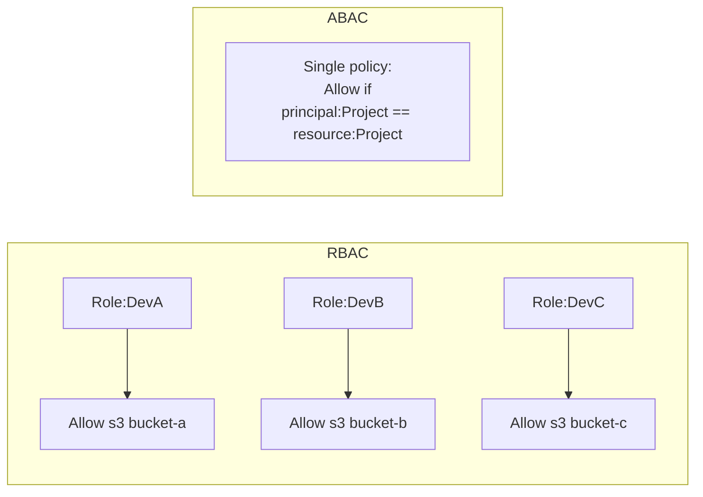

# ABAC - Attribute-Based Access Control

> Permissions decided by **tags** rather than by enumerating principals and resources. One policy fits hundreds of users and thousands of resources, scales with growth, and survives team / project changes that would otherwise require constant policy edits. Increasingly tested on the SAA-C03 as "how do you grant access without rewriting policies for every new project?"

See also: [01 - IAM Intro bits & bytes](01%20-%20IAM%20Intro%20bits%20%26%20bytes.md) · [03 - IAM Policy Structure](03%20-%20IAM%20Policy%20Structure.md) · [05 - IAM Scenarios](05%20-%20IAM%20Scenarios.md) · [06 - IAM Identity Center & Organizations](06%20-%20IAM%20Identity%20Center%20%26%20Organizations.md) · [11 - Permissions Boundaries](11%20-%20Permissions%20Boundaries.md)

---

## Table of Contents

- [1. RBAC vs ABAC](#1-rbac-vs-abac)
- [2. The Three Tag Types in ABAC](#2-the-three-tag-types-in-abac)
- [3. Canonical ABAC Pattern - "Match Project Tags"](#3-canonical-abac-pattern---match-project-tags)
- [4. Session Tags & Identity Center](#4-session-tags--identity-center)
- [5. Tag Policies & Enforcement](#5-tag-policies--enforcement)
- [6. Pitfalls & Limits](#6-pitfalls--limits)
- [7. Exam Tips (SAA-C03)](#7-exam-tips-saa-c03)
- [Summary](#summary)

---

## 1. RBAC vs ABAC

| Aspect                | RBAC (Role-Based Access Control)           | ABAC (Attribute-Based Access Control)   |
| :-------------------- | :----------------------------------------- | :-------------------------------------- |
| Permission decided by | The role / group you're in                 | Tags on you AND on the resource         |
| Policy count          | Grows with # of teams × resources          | One policy can cover everything         |
| Onboarding a new team | Create new role + policies                 | Just tag the new resources / users      |
| Resource discovery    | Hard - admins must know which roles exist  | Trivial - tag = the answer              |
| Common pitfalls       | Role sprawl, "give me access to X" tickets | Tag-policy enforcement, casing mistakes |



In ABAC, all three teams share one policy; the **tags** discriminate.

[⬆ Back to top](#table-of-contents)

---

## 2. The Three Tag Types in ABAC

| Tag context       | Lives on                                                              | Accessed in policy as                                                      |
| :---------------- | :-------------------------------------------------------------------- | :------------------------------------------------------------------------- |
| **Principal tag** | An IAM user, role, or federated session                               | `aws:PrincipalTag/<key>`                                                   |
| **Resource tag**  | An AWS resource (EC2, S3, etc.)                                       | `aws:ResourceTag/<key>` (or service-specific like `ec2:ResourceTag/<key>`) |
| **Request tag**   | A tag being set by _the current request_ (e.g. `RunInstances --tags`) | `aws:RequestTag/<key>`                                                     |

The signature ABAC pattern compares **PrincipalTag** to **ResourceTag** for the same key (e.g. `Project`).

[⬆ Back to top](#table-of-contents)

---

## 3. Canonical ABAC Pattern - "Match Project Tags"

**Goal:** Anyone on Project Phoenix can manage EC2 instances tagged `Project=Phoenix`, regardless of which IAM role they assume.

### Identity setup

- Every IAM user or role has a **`Project`** tag (e.g. `Project=Phoenix`).
- Every EC2 instance has a **`Project`** tag matching one of the project names.

### One policy fits all teams

```json
{
  "Version": "2012-10-17",
  "Statement": [
    {
      "Sid": "ManageEC2InOwnProject",
      "Effect": "Allow",
      "Action": [
        "ec2:StartInstances",
        "ec2:StopInstances",
        "ec2:RebootInstances"
      ],
      "Resource": "arn:aws:ec2:*:*:instance/*",
      "Condition": {
        "StringEquals": {
          "aws:ResourceTag/Project": "${aws:PrincipalTag/Project}"
        }
      }
    }
  ]
}
```

The trick is the **policy variable** `${aws:PrincipalTag/Project}`. At evaluation time AWS substitutes the value of the caller's `Project` tag. So an Alice tagged `Project=Phoenix` can only act on resources tagged `Project=Phoenix`; Bob tagged `Project=Mercury` can only touch Mercury resources.

### Force the tag on creation too

To prevent users from creating un-tagged resources or tagging them with the wrong project, add `aws:RequestTag/Project` to the policy:

```json
{
  "Sid": "RunInstancesMustTagOwnProject",
  "Effect": "Allow",
  "Action": "ec2:RunInstances",
  "Resource": "arn:aws:ec2:*:*:instance/*",
  "Condition": {
    "StringEquals": {
      "aws:RequestTag/Project": "${aws:PrincipalTag/Project}"
    },
    "ForAllValues:StringEquals": {
      "aws:TagKeys": ["Project"]
    }
  }
}
```

[⬆ Back to top](#table-of-contents)

---

## 4. Session Tags & Identity Center

When users sign in via **IAM Identity Center**, **SAML**, or a custom IdP, you can have the IdP pass attributes as **session tags** that become `aws:PrincipalTag/*` for the duration of the session.

```mermaid
sequenceDiagram
    User->>IDC: Sign in
    IDC->>STS: AssumeRoleWithSAML + PrincipalTags
    Note over STS: Session inherits<br/>aws:PrincipalTag/Project = Phoenix<br/>aws:PrincipalTag/Department = Eng
    STS-->>User: Temp creds with session tags
    User->>EC2: Use creds; policy compares tags
```

- Configured in Identity Center's **Attribute Mapping** section (or directly in the SAML/OIDC IdP).
- A single role + policy now powers access for every user - their permissions follow their _attributes_, not their role membership.

[⬆ Back to top](#table-of-contents)

---

## 5. Tag Policies & Enforcement

ABAC only works if tags are **consistent and trustworthy**. Tooling for that:

| Mechanism                               | Purpose                                                                                            |
| :-------------------------------------- | :------------------------------------------------------------------------------------------------- |
| **AWS Organizations Tag Policies**      | Define the allowed `Project` values, case rules, required-on-resource lists; report non-compliance |
| **SCPs requiring `aws:RequestTag/...`** | Block resource creation that omits a required tag                                                  |
| **AWS Config rule `required-tags`**     | Detect untagged resources after creation                                                           |
| **Permissions Boundary**                | Stop a delegated admin from creating resources with a `Project` tag they don't own                 |
| **Resource Groups + Tag Editor**        | Bulk-tag clean-up tool                                                                             |

[⬆ Back to top](#table-of-contents)

---

## 6. Pitfalls & Limits

| Pitfall                                         | Mitigation                                                                                                                        |
| :---------------------------------------------- | :-------------------------------------------------------------------------------------------------------------------------------- |
| Case mismatch (`project` vs `Project`)          | Tag policy enforces canonical casing                                                                                              |
| Service doesn't support `ResourceTag` condition | Check the [Service Authorization Reference](https://docs.aws.amazon.com/service-authorization/) - not every action evaluates tags |
| Tagging via `CreateXxx` API isn't always atomic | Some services tag after creation - gap window exists; SCP `aws:RequestTag` may not catch this                                     |
| User changes their own tag                      | Lock down `iam:TagUser` / `iam:TagRole` so users can't self-promote                                                               |
| Cross-account scenario                          | Session tags don't cross account boundaries unless `Transitive` is set on the AssumeRole call                                     |
| Wildcards in tag values                         | Use `StringLike` for prefix matching, but exact `StringEquals` is preferred                                                       |

[⬆ Back to top](#table-of-contents)

---

## 7. Exam Tips (SAA-C03)

1. "Scale permissions to many projects/teams **without** writing more policies" → **ABAC**.
2. Key condition keys: **`aws:PrincipalTag/X`**, **`aws:ResourceTag/X`**, **`aws:RequestTag/X`**.
3. The signature pattern is `aws:ResourceTag/Foo == ${aws:PrincipalTag/Foo}` - tag matching via policy variable.
4. **Session tags** carry attributes from the IdP into AWS - set in Identity Center / SAML attribute mapping.
5. **Tag Policies** govern _which tags are allowed_; **SCPs** govern _whether actions can run without them_; **Config rules** flag the strays.
6. Not every service supports `ResourceTag` in IAM conditions - check first.
7. Lock down `iam:TagUser` / `iam:TagRole` / `iam:UntagRole` so users can't change their own attributes.
8. **Cross-account session tags** require `Transitive=true` on `AssumeRole` to survive the second hop.

[⬆ Back to top](#table-of-contents)

---

## Summary

- **ABAC** decides access from **tags on principal + resource (+ request)**, not from role membership.
- One canonical pattern: `aws:ResourceTag/Project == ${aws:PrincipalTag/Project}`.
- Identity providers feed attributes via **session tags**.
- **Tag Policies + SCPs + Config rules** keep the tag namespace clean.
- Replaces role sprawl with attribute hygiene - scales much better past 5–10 teams.

[⬆ Back to top](#table-of-contents)
