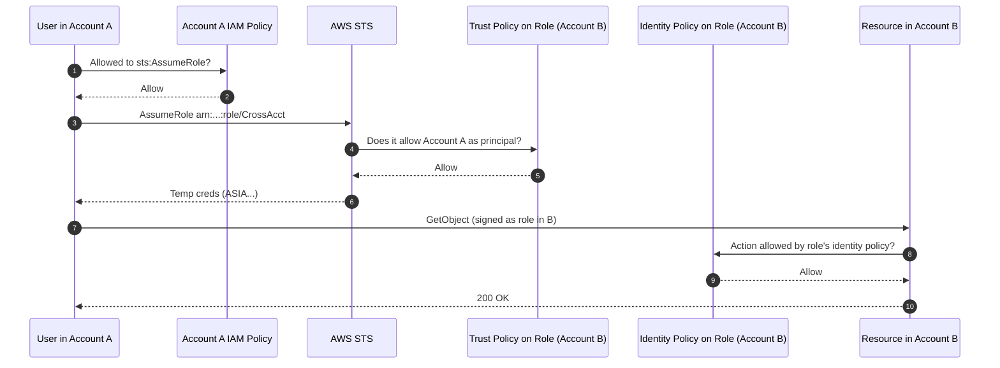

# Cross-Account Access - SAA-C03 Deep Dive

> Cross-account access is a **guaranteed topic** on the SAA-C03 exam. Every "the company has a security account / a logging account / a billing account" question routes through here. Covers both **resource-based** and **role-assumption** patterns with service-specific quirks.

See also: [13 - STS & Federation](13%20-%20STS%20%26%20Federation.md) · [16 - Directory Service & RAM](16%20-%20Directory%20Service%20%26%20RAM.md) · [06 - IAM Identity Center & Organizations](06%20-%20IAM%20Identity%20Center%20%26%20Organizations.md) · [05 - IAM Scenarios](05%20-%20IAM%20Scenarios.md) · [20 - KMS & Envelope Encryption](20%20-%20KMS%20%26%20Envelope%20Encryption.md)

---

## Table of Contents

- [Part 1: Core Concepts (Must-Know for Exam)](#part-1-core-concepts-must-know-for-exam)
- [Part 2: Real-World Examples](#part-2-real-world-examples)
- [Part 3: Exam Scenario Analysis](#part-3-exam-scenario-analysis)
- [Part 4: Organization-Level Controls (Advanced Exam Topics)](#part-4-organization-level-controls-advanced-exam-topics)
- [Part 5: Quick Reference Table for SAA-C03](#part-5-quick-reference-table-for-saa-c03)
- [Part 6: Exam-Taking Strategy](#part-6-exam-taking-strategy)

---



---

## Part 1: Core Concepts (Must-Know for Exam)

### What is Cross-Account Access?

Cross-account access allows a principal (user/role) in one AWS account to access resources in another AWS account. The account with the **principal** is the **trusted account**, and the account with the **resource** is the **trusting account**.

**Exam Tip:** Remember which is which:

- **Trusted Account** = The one with the **user/role** (the "source")
- **Trusting Account** = The one with the **resource** (the "target")

### How AWS Evaluates Cross-Account Requests

This is **critical exam knowledge**. When a cross-account request is made, AWS performs **two separate evaluations**:

```
Account A (Trusted)                    Account B (Trusting)
    │                                        │
    ▼                                        ▼
Identity-based policy ✅/❌            Resource-based policy ✅/❌
    │                                        │
    └──────────────┬─────────────────────────┘
                   ▼
        ALLOW only if BOTH allow
```

**The Rule:** The request is allowed **only if both evaluations return Allow**.

### Two Methods for Cross-Account Access

| Method                         | How It Works                                                                                      | When to Use                                                                                                     |
| :----------------------------- | :------------------------------------------------------------------------------------------------ | :-------------------------------------------------------------------------------------------------------------- |
| **Resource-Based Policy**      | Attach policy directly to resource (S3 bucket, ECR repo, SQS queue) specifying external principal | Sharing specific resources like S3, ECR, SQS, SNS                                                               |
| **IAM Role with Trust Policy** | Create role in resource account that external account can assume                                  | When resource doesn't support resource-based policies (EC2, Lambda, RDS), or when you need fine-grained control |

**Exam Tip:** The exam loves asking which method to use. Remember:

- **S3, ECR, SQS, SNS, KMS, Lambda (event source mappings?)** → Resource-based policies possible
- **EC2, RDS, VPC resources** → Must use IAM Role assumption

---

## Part 2: Real-World Examples

### Example 1: Cross-Account S3 Access

**Scenario:** Account A (111111111111) needs to read objects from `production-logs` bucket in Account B (222222222222).

#### Step 1: Resource-Based Policy (Bucket Policy) in Account B

Attach this policy to the S3 bucket in Account B:

```json
{
  "Version": "2012-10-17",
  "Statement": [
    {
      "Effect": "Allow",
      "Principal": {
        "AWS": "arn:aws:iam::111111111111:role/DataProcessor"
      },
      "Action": ["s3:GetObject", "s3:ListBucket"],
      "Resource": [
        "arn:aws:s3:::production-logs",
        "arn:aws:s3:::production-logs/*"
      ]
    }
  ]
}
```

#### Step 2: Identity-Based Policy in Account A

The `DataProcessor` role in Account A needs this policy:

```json
{
  "Version": "2012-10-17",
  "Statement": [
    {
      "Effect": "Allow",
      "Action": ["s3:GetObject", "s3:ListBucket"],
      "Resource": [
        "arn:aws:s3:::production-logs",
        "arn:aws:s3:::production-logs/*"
      ]
    }
  ]
}
```

#### How the Two Policies Interact

**Scenario: Access to `production-logs` bucket**

- Account A identity-based policy: ✅ Allows
- Account B bucket policy: ✅ Allows (specifies the role)
- **Result: ALLOW**

**Scenario: Access to `production-logs-archive` bucket (no bucket policy)**

- Account A identity-based policy: ✅ Allows (same permissions)
- Account B bucket policy: ❌ No policy allowing access
- **Result: DENY** (fails the trusting account evaluation)

**Exam Tip:** The bucket policy must explicitly name the external principal. A bucket policy allowing `"Principal": "*"` grants public access, not cross-account access in a controlled way.

---

### Example 2: Cross-Account ECR Access

**Scenario:** Account A needs to pull Docker images from an ECR repository in Account B.

#### Resource-Based Policy on ECR Repository (Account B)

ECR repositories support resource-based policies attached directly to the repository:

```json
{
  "Version": "2012-10-17",
  "Statement": [
    {
      "Sid": "AllowCrossAccountPull",
      "Effect": "Allow",
      "Principal": {
        "AWS": "arn:aws:iam::111111111111:root"
      },
      "Action": [
        "ecr:GetDownloadUrlForLayer",
        "ecr:BatchGetImage",
        "ecr:BatchCheckLayerAvailability",
        "ecr:DescribeImages",
        "ecr:ListImages"
      ]
    }
  ]
}
```

**Important:** The principal can be an entire AWS account (`:root`) or a specific IAM role. Using `:root` grants access to **any identity** in that account that has permissions to pull from ECR.

#### Applying the Policy via AWS CLI

```bash
# Set repository policy from file
aws ecr set-repository-policy \
    --repository-name my-shared-repo \
    --policy-text file://policy.json \
    --region us-east-1 \
    --profile account-b
```

#### Automation for Multiple Repositories

If you have many ECR repositories, you can script it:

```bash
#!/bin/bash
for repo in $(aws ecr describe-repositories --output text | awk '{print $6}'); do
    echo "Setting policy on repository $repo"
    aws ecr set-repository-policy --repository-name $repo --policy-text file://policy.json
done
```

**Exam Tip:** ECR cross-account access is commonly tested. Remember you need:

1. Resource-based policy on ECR repository in source account
2. IAM permissions (ecr:GetDownloadUrlForLayer, etc.) in the consuming account's role

---

### Example 3: Cross-Account Lambda with DynamoDB Streams

**Major Update (2026):** Lambda now supports cross-account DynamoDB Streams as event source mappings.

**Scenario:** Account A has a DynamoDB table with streams enabled. Account B has a Lambda function that processes stream records.

#### Step 1: Resource-Based Policy on DynamoDB Stream (Account A)

The DynamoDB stream needs a policy allowing Account B's Lambda to read it:

```json
{
  "Version": "2012-10-17",
  "Statement": [
    {
      "Effect": "Allow",
      "Principal": {
        "AWS": "arn:aws:iam::222222222222:role/LambdaExecutionRole"
      },
      "Action": [
        "dynamodb:DescribeStream",
        "dynamodb:GetRecords",
        "dynamodb:GetShardIterator",
        "dynamodb:ListStreams"
      ],
      "Resource": "arn:aws:dynamodb:us-east-1:111111111111:table/CrossAccountTest/stream/*"
    }
  ]
}
```

#### Step 2: Create Event Source Mapping (Account B)

```bash
aws lambda create-event-source-mapping \
    --function-name CrossAccountDynamoDBHandler \
    --event-source-arn arn:aws:dynamodb:us-east-1:111111111111:table/CrossAccountTest/stream/2026-02-01T06:30:25.829 \
    --starting-position LATEST \
    --region us-east-1 \
    --profile account-b
```

**Important Limitation (Exam Critical):** Before this 2026 update, Lambda event source mappings did **not** support cross-account. For exam questions about legacy cross-account event processing, the answer was typically Amazon EventBridge. For current exams, this update may appear.

---

### Example 4: Cross-Account VPC Access (No Resource Policy - Uses IAM Roles)

**Scenario:** Account A needs to launch EC2 instances in a subnet shared from Account B. VPC resources (subnets, route tables) **do not support resource-based policies**.

#### Solution: IAM Role with Trust Policy + RAM (Resource Access Manager)

This is the exam pattern for sharing VPC resources:

**Step 1:** Use AWS RAM to share the subnet from Account B to Account A

**Step 2:** Create an IAM role in Account B that Account A can assume

**Trust Policy (Account B role):**

```json
{
  "Version": "2012-10-17",
  "Statement": [
    {
      "Effect": "Allow",
      "Principal": {
        "AWS": "arn:aws:iam::111111111111:root"
      },
      "Action": "sts:AssumeRole"
    }
  ]
}
```

**Step 3:** Attach permissions policy allowing EC2 actions in the shared subnet

**Permissions Policy (attached to same role):**

```json
{
  "Version": "2012-10-17",
  "Statement": [
    {
      "Effect": "Allow",
      "Action": ["ec2:RunInstances", "ec2:DescribeInstances"],
      "Resource": "*",
      "Condition": {
        "StringEquals": {
          "ec2:Subnet": "arn:aws:ec2:us-east-1:222222222222:subnet/subnet-abc12345"
        }
      }
    }
  ]
}
```

**Step 4:** From Account A, assume the role

```bash
aws sts assume-role \
    --role-arn arn:aws:iam::222222222222:role/SharedSubnetRole \
    --role-session-name CrossAccountSession
```

**Exam Tip:** VPC resources (subnets, security groups, route tables) cannot be accessed via resource-based policies. Use RAM + IAM roles.

---

## Part 3: Exam Scenario Analysis

### Scenario 1: The Lambda + SQS Cross-Account Question

**Question Pattern:** "A Lambda function in Account A needs to process messages from an SQS queue in Account B. What is the minimum configuration required?"

**Answer:**

1. SQS queue in Account B needs a resource-based policy allowing Account A's Lambda role to `sqs:ReceiveMessage`, `sqs:DeleteMessage`, `sqs:GetQueueAttributes`
2. Lambda execution role in Account A needs permissions for those same SQS actions
3. Create event source mapping in Account A pointing to Account B's queue ARN

**Trick Option:** Some answers suggest creating an IAM role in Account B for Lambda to assume. **Wrong** - Lambda event source mappings work with resource-based policies on SQS, not role assumption for the source.

---

### Scenario 2: The "Explicit Deny" Cross-Account Trap

**Question Pattern:** "A user in Account A has an IAM policy allowing `s3:GetObject` on `*`. The S3 bucket in Account B has a bucket policy explicitly denying access from Account A. Can the user access the bucket?"

**Answer:** **No.** The explicit deny in the bucket policy (trusting account) overrides any allow in the identity policy (trusted account).

This tests your understanding that **both accounts must allow** AND **explicit deny anywhere = final deny**.

---

### Scenario 3: The Network Connectivity Question

**Question Pattern:** "You need to enable cross-account communication between EC2 instances in two different VPCs. The VPC CIDRs overlap. What should you use?"

**Answer:** AWS PrivateLink or VPC Lattice.

**Why not VPC Peering?** VPC peering requires non-overlapping CIDR blocks. If CIDRs overlap, peering is impossible.

**Exam Table for Network Connectivity:**

| Service         | Overlapping CIDRs Allowed? | Use Case                                  |
| :-------------- | :------------------------- | :---------------------------------------- |
| VPC Peering     | ❌ No                      | Simple point-to-point VPC connections     |
| AWS PrivateLink | ✅ Yes                     | Service-to-VPC connections, cross-account |
| Transit Gateway | ❌ No                      | Hub-and-spoke, multiple VPCs              |
| VPC Lattice     | ✅ Yes                     | Application-level service connectivity    |

---

## Part 4: Organization-Level Controls (Advanced Exam Topics)

### Service Control Policies (SCPs) vs Resource Control Policies (RCPs)

The exam tests your understanding of **centralized governance**:

| Policy Type | Attached To                    | Controls                       | Cross-Account Relevance                                        |
| :---------- | :----------------------------- | :----------------------------- | :------------------------------------------------------------- |
| **SCP**     | AWS Organization OU or account | What principals can do         | Can block all cross-account access at org level                |
| **RCP**     | AWS Organization OU or account | What resources can be accessed | Can enforce data perimeter, block external access to resources |

**RCP Example - Blocking External Access to S3:**

```json
{
  "Effect": "Deny",
  "Principal": "*",
  "Action": "s3:*",
  "Resource": "*",
  "Condition": {
    "StringNotEquals": {
      "aws:PrincipalOrgID": "o-your-organization-id"
    }
  }
}
```

**This pattern appears on exams** - using `aws:PrincipalOrgID` condition to restrict access to only principals within your AWS Organization.

---

## Part 5: Quick Reference Table for SAA-C03

| Service                   | Resource Policy Support | Cross-Account Method                                    | Exam Frequency |
| :------------------------ | :---------------------- | :------------------------------------------------------ | :------------- |
| **S3**                    | ✅ Yes                  | Bucket policy + IAM                                     | Very High      |
| **ECR**                   | ✅ Yes                  | Repository policy                                       | High           |
| **SQS**                   | ✅ Yes                  | Queue policy                                            | High           |
| **SNS**                   | ✅ Yes                  | Topic policy                                            | Medium         |
| **KMS**                   | ✅ Yes                  | Key policy                                              | High           |
| **Lambda (event source)** | ⚠️ Limited              | DynamoDB streams now supported; SQS via resource policy | Medium         |
| **EC2**                   | ❌ No                   | IAM role + RAM                                          | Medium         |
| **VPC Subnets**           | ❌ No                   | RAM + IAM role                                          | Medium         |
| **RDS**                   | ❌ No                   | IAM role + snapshot sharing                             | Low            |
| **EventBridge**           | ✅ Yes                  | Event bus policy                                        | Medium         |

---

## Part 6: Exam-Taking Strategy

When you see a cross-account question, run this mental checklist:

1. **What resource is being accessed?** (S3/ECR/SQS = resource policy possible; EC2/Lambda = role assumption)
2. **Do both accounts have appropriate policies?** (Principal in trusting account's resource policy + identity policy in trusted account)
3. **Is there an explicit deny anywhere?** (If yes, answer is DENY)
4. **For network questions:** Check CIDR overlap first (determines peering vs PrivateLink)
5. **For organization questions:** Remember SCPs limit, RCPs limit resources

---
