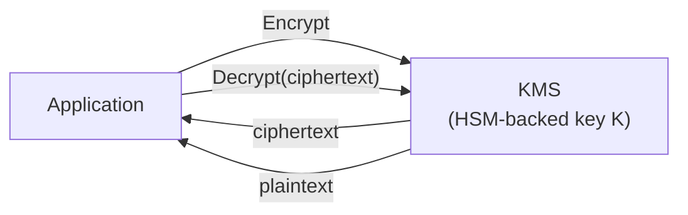
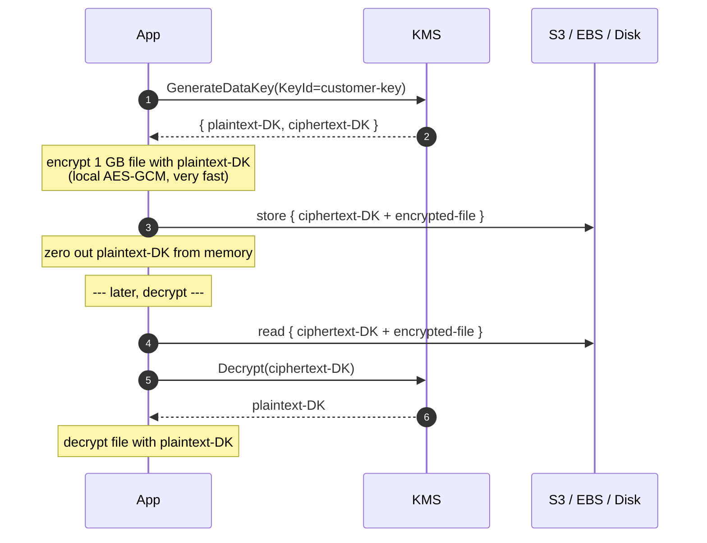
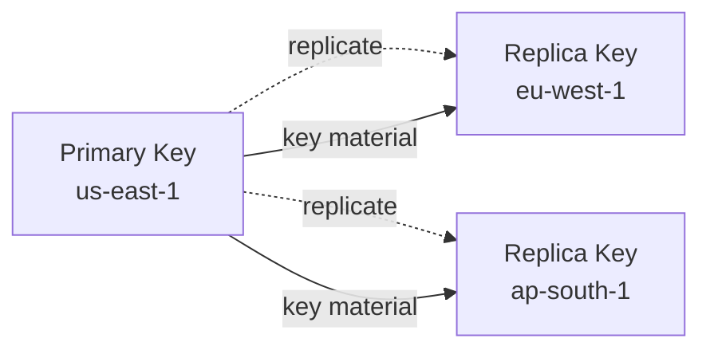
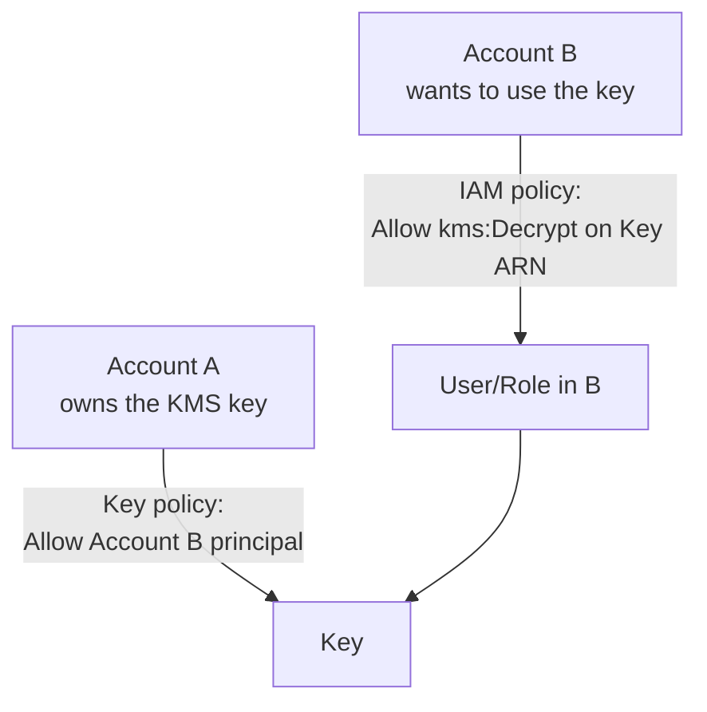

# AWS KMS & Envelope Encryption

> **AWS Key Management Service (KMS)** is the cryptography backbone of AWS. It doesn't directly encrypt your gigabytes of data - it encrypts the **keys that encrypt** your data, via **envelope encryption**. Every "encryption at rest" question on the SAA-C03 routes through here.

See also: [01 - IAM Intro bits & bytes](01%20-%20IAM%20Intro%20bits%20%26%20bytes.md) · [22 - Secrets Manager vs SSM Parameter Store](22%20-%20Secrets%20Manager%20vs%20SSM%20Parameter%20Store.md) · [28 - AWS Certificate Manager (ACM)](28%20-%20AWS%20Certificate%20Manager%20%28ACM%29.md) · [05 - IAM Scenarios](05%20-%20IAM%20Scenarios.md)

---

## Table of Contents

- [1. KMS in a Sentence](#1-kms-in-a-sentence)
- [2. Key Types](#2-key-types)
- [3. Key Policies](#3-key-policies)
- [4. Envelope Encryption](#4-envelope-encryption)
- [5. Grants](#5-grants)
- [6. Symmetric vs Asymmetric Keys](#6-symmetric-vs-asymmetric-keys)
- [7. Multi-Region Keys](#7-multi-region-keys)
- [8. Key Rotation & Deletion](#8-key-rotation--deletion)
- [9. Cross-Account KMS](#9-cross-account-kms)
- [10. KMS API Cheat Sheet](#10-kms-api-cheat-sheet)
- [11. CloudHSM - When KMS Isn't Enough](#11-cloudhsm---when-kms-isnt-enough)
- [12. Exam Tips (SAA-C03)](#12-exam-tips-saa-c03)
- [Summary](#summary)

---

## 1. KMS in a Sentence

KMS is a **managed service that creates, stores, and uses cryptographic keys** - backed by FIPS 140-2 Level 3 validated hardware (HSMs), keys never leave the HSM in plaintext.

You ask KMS to encrypt or decrypt; KMS does the work inside its hardware and returns the result.



| Why KMS exists          | What it gives you                                                   |
| :---------------------- | :------------------------------------------------------------------ |
| Centralized key custody | One place to audit, rotate, deny                                    |
| Hardware protection     | Keys never visible to AWS staff or to you                           |
| Integration             | 100+ AWS services accept a KMS key reference for at-rest encryption |
| Auditability            | Every operation logged in CloudTrail                                |

[⬆ Back to top](#table-of-contents)

---

## 2. Key Types

Every KMS key has a **type** and an **ownership / management** category. The exam loves the management distinction.

### By management category

| Category                                         | Who creates it                        | Who pays                        | Who manages key policy            | Visible in your console? |
| :----------------------------------------------- | :------------------------------------ | :------------------------------ | :-------------------------------- | :----------------------- |
| **AWS Owned**                                    | AWS                                   | Free                            | AWS                               | ❌ No                    |
| **AWS Managed** (`aws/<service>`, e.g. `aws/s3`) | AWS, per service                      | Free for key, you pay API calls | AWS (you can read but not modify) | ✅ Yes                   |
| **Customer Managed (CMK)**                       | You                                   | $1/month per key + API calls    | You                               | ✅ Yes                   |
| **Imported key material**                        | You generate elsewhere, import to KMS | $1/month + API                  | You                               | ✅ Yes                   |
| **External key (XKS)**                           | Stored in _your_ HSM outside AWS      | $1/month + API                  | You                               | ✅ Yes                   |

> **Customer managed keys** are what the exam usually wants. Default to those when the question says "control over rotation" or "I want to deny access via key policy."

### By cryptographic type

| Type                        | Used for                                                            |
| :-------------------------- | :------------------------------------------------------------------ |
| **Symmetric (AES-256-GCM)** | The default. Most data-at-rest encryption (S3, EBS, RDS) uses this. |
| **Asymmetric RSA**          | Signing, encryption (private stays in KMS, public is downloadable)  |
| **Asymmetric ECC**          | Signing only (NIST and SECG curves)                                 |
| **HMAC**                    | Generate/verify MACs                                                |

[⬆ Back to top](#table-of-contents)

---

## 3. Key Policies

Every KMS key has a **key policy** - a resource-based policy that's the **primary** access-control mechanism. Without an entry in the key policy, even a user with `kms:*` IAM permission can't use the key.

### Default key policy (when you create a CMK)

```json
{
  "Version": "2012-10-17",
  "Statement": [
    {
      "Sid": "EnableIAMUserPermissions",
      "Effect": "Allow",
      "Principal": { "AWS": "arn:aws:iam::123456789012:root" },
      "Action": "kms:*",
      "Resource": "*"
    }
  ]
}
```

The `Principal: root` here means "delegate to IAM" - IAM policies in this account can grant `kms:*`. **Do not** confuse this with the AWS root _user_.

### Cross-account use

To let another account use this key, name them in the key policy:

```json
{
  "Sid": "AllowAcctB",
  "Effect": "Allow",
  "Principal": { "AWS": "arn:aws:iam::222222222222:root" },
  "Action": ["kms:Decrypt", "kms:DescribeKey"],
  "Resource": "*"
}
```

Plus the IAM principal in Account B needs `kms:Decrypt` permission on the key's ARN.

[⬆ Back to top](#table-of-contents)

---

## 4. Envelope Encryption

**The single most-tested KMS concept.** KMS doesn't encrypt large blobs directly - it would be too slow and expensive. Instead, KMS encrypts a small **data key**, and your application uses the data key to encrypt the actual data.



### Why this design

- **Performance:** KMS is small-payload (max 4 KB encrypt/decrypt). Bulk encryption is local AES-GCM at full disk/network speed.
- **Cost:** One KMS call per object, not one per byte.
- **Scale:** S3 / EBS / RDS use this internally - every object gets its own data key.

### S3 server-side encryption flavors

| Flavor               | What encrypts the data key                             | When to use                                                       |
| :------------------- | :----------------------------------------------------- | :---------------------------------------------------------------- |
| **SSE-S3** (default) | S3-managed key (you never see it)                      | Cheapest, no auditing needs                                       |
| **SSE-KMS**          | A KMS CMK (your choice)                                | You need an audit trail of who decrypted what, key policy control |
| **DSSE-KMS**         | Two layers of KMS encryption                           | Regulated workloads requiring "encrypted twice"                   |
| **SSE-C**            | A customer-supplied key (you send it on every request) | Rare - when you must hold the key entirely                        |

[⬆ Back to top](#table-of-contents)

---

## 5. Grants

**Grants** are an alternative to key policies for granting _temporary, programmatic_ access. Common pattern: an AWS service (EBS, RDS) needs to use a CMK on your behalf during a lifecycle event.

| Aspect         | Key policy                          | Grant                                          |
| :------------- | :---------------------------------- | :--------------------------------------------- |
| Best for       | Long-lived, declarative permissions | Short-lived, dynamic - issued by SDK / service |
| Who can create | Anyone with `kms:PutKeyPolicy`      | Anyone with `kms:CreateGrant`                  |
| Limit per key  | 1 policy                            | 50,000 grants                                  |
| Revoke         | Edit the policy                     | `kms:RevokeGrant`                              |

You rarely write grants by hand - services do it. But "EBS snapshot in another account couldn't decrypt because the grant was missing" is a recurring exam scenario.

[⬆ Back to top](#table-of-contents)

---

## 6. Symmetric vs Asymmetric Keys

| Operation             | Symmetric (AES-GCM)              | Asymmetric (RSA / ECC)                                            |
| :-------------------- | :------------------------------- | :---------------------------------------------------------------- |
| Encrypt / Decrypt     | ✅ Both inside KMS               | Encrypt with public key (outside KMS OK), decrypt only inside KMS |
| Sign / Verify         | ❌ Not supported (use HMAC type) | ✅ Sign with private (KMS), verify with public (anywhere)         |
| Key material exposure | Never leaves KMS                 | Public half is downloadable; private stays in KMS                 |
| Speed                 | Fast                             | Slow (~100×)                                                      |
| Typical use           | Bulk at-rest encryption          | JWT signing, document signing, mTLS                               |

**Default to symmetric.** Only choose asymmetric when you need (a) external parties to verify a signature without calling KMS, or (b) external parties to encrypt to you without calling KMS.

[⬆ Back to top](#table-of-contents)

---

## 7. Multi-Region Keys

A **multi-region key** is a set of KMS keys that share **the same key material** across regions, so ciphertext encrypted with the key in `us-east-1` can be decrypted with the key in `eu-west-1` **without re-encrypting**.



### When to use

- **DynamoDB Global Tables** with encryption - needs same key material in every region.
- **Cross-region S3 replication** with encryption - replica region must be able to decrypt.
- **Active-active multi-region apps** - clients in any region encrypt/decrypt using their local key.

Each replica is a **separate KMS key** with its own ARN, policy, alias - but cryptographically identical to its peers.

[⬆ Back to top](#table-of-contents)

---

## 8. Key Rotation & Deletion

### Automatic rotation

- **AWS-managed keys** (`aws/<service>`): rotated by AWS, typically every **1 year**, transparent to you.
- **Customer-managed symmetric keys**: opt-in `kms:EnableKeyRotation`, rotates **every 365 days**, old key material kept indefinitely for decrypting old ciphertext.
- **Asymmetric & imported keys**: no automatic rotation - you must create a new key and re-encrypt manually.

### Manual rotation

Create a new key, point your application's alias at the new key, optionally re-encrypt old data.

### Deletion

- KMS deletion is **pending**, not immediate.
- Pending window: **7 to 30 days** (default 30).
- During the window, the key is disabled but data encrypted with it can still be recovered by canceling the deletion.
- **Once deleted, data encrypted with that key is unrecoverable.** This is the most dangerous KMS operation; pair it with deny SCPs in production.

[⬆ Back to top](#table-of-contents)

---

## 9. Cross-Account KMS

Two parties to consider:



**Both are required:**

1. Key policy in Account A must Allow the principal (or whole account) from Account B.
2. The IAM principal in Account B must have the KMS permission in their identity policy.

Common scenario: S3 bucket in A encrypted with KMS, accessed by user in B. The bucket policy must allow Account B AND the KMS key policy must allow Account B AND the user in B must have S3 + KMS permissions in their IAM.

[⬆ Back to top](#table-of-contents)

---

## 10. KMS API Cheat Sheet

| API                               | What it does                              | Caller-side use                                   |
| :-------------------------------- | :---------------------------------------- | :------------------------------------------------ |
| `Encrypt`                         | Encrypt small payload (≤ 4 KB) with key   | Encrypt a password directly                       |
| `Decrypt`                         | Decrypt a KMS ciphertext blob             | Decrypt anything KMS-produced                     |
| `GenerateDataKey`                 | Return plaintext + encrypted data key     | Envelope encryption - the workhorse               |
| `GenerateDataKeyWithoutPlaintext` | Return just the encrypted data key        | Pre-stage data keys for later use                 |
| `Sign` / `Verify`                 | Asymmetric signing                        | JWT, document signing                             |
| `GetPublicKey`                    | Download asymmetric public key            | Distribute for external verification              |
| `ReEncrypt`                       | Decrypt + re-encrypt with a different key | Key rotation without exposing plaintext to caller |
| `DescribeKey`                     | Get metadata about a key                  | Health checks, discovery                          |
| `CreateGrant`                     | Issue a temporary grant                   | Programmatic delegation                           |
| `EnableKeyRotation`               | Turn on yearly rotation                   | One-time setup                                    |

[⬆ Back to top](#table-of-contents)

---

## 11. CloudHSM - When KMS Isn't Enough

| Aspect               | KMS                            | CloudHSM                                                     |
| :------------------- | :----------------------------- | :----------------------------------------------------------- |
| Tenancy              | Multi-tenant HSM               | Single-tenant, dedicated HSM cluster                         |
| Compliance           | FIPS 140-2 Level 3             | FIPS 140-2 Level 3 (same hardware)                           |
| Key material control | AWS sees ciphertext metadata   | Only you have key material                                   |
| API                  | AWS KMS API                    | PKCS #11, JCE, KSP (industry standards)                      |
| Cost                 | $1/month per CMK               | ~$1.45/hr per HSM (much pricier)                             |
| Use when             | Default for at-rest encryption | Regulatory requirement for dedicated HSM (some PCI, banking) |

If the question mentions **"single-tenant HSM"** or **"customer-controlled key material with PKCS #11"** → CloudHSM. Otherwise → KMS.

[⬆ Back to top](#table-of-contents)

---

## 12. Exam Tips (SAA-C03)

1. **KMS = envelope encryption.** Never directly encrypts > 4 KB. Bulk data is encrypted by data keys.
2. **Key policies are mandatory** - IAM permission alone isn't enough. Both must Allow.
3. **AWS-managed key (`aws/s3`) vs Customer-managed key:** if the question wants control over rotation, deny via key policy, or cross-account access → **CMK**.
4. **Cross-account KMS:** key policy in owner + IAM permission in user account. Always both.
5. **Multi-region keys** are the answer to "DynamoDB Global Tables encryption" and "cross-region replication with encryption without re-encryption."
6. **Rotation:** customer-managed symmetric → yearly opt-in. Asymmetric and imported → manual only.
7. **Deletion is pending, 7–30 days.** Once deleted, encrypted data is gone.
8. **Grants** are issued by services for temporary use of a key (e.g. EBS during snapshot copy). 50,000 grants per key limit.
9. **S3 encryption modes:** SSE-S3 (default), SSE-KMS (auditable, CMK), DSSE-KMS (double-encrypted), SSE-C (customer-supplied).
10. **KMS or CloudHSM?** Default KMS. CloudHSM only if the question says **single-tenant** or **PKCS #11** or specific regulatory ask.

> TLS certificates (ACM) moved to their own note - see [28 - AWS Certificate Manager (ACM)](28%20-%20AWS%20Certificate%20Manager%20%28ACM%29.md).

[⬆ Back to top](#table-of-contents)

---

## Summary

- KMS encrypts the **data key**; your app or AWS service uses the data key to encrypt the **payload** (envelope encryption).
- **Customer-managed keys** are what you want for control; **AWS-managed** are free defaults.
- Both **key policy** AND **IAM policy** must Allow - for cross-account, both sides too.
- **Multi-region keys** solve "same key material across regions."
- **Rotation** is yearly for symmetric CMKs (opt-in), manual otherwise.
- **Deletion** is pending - irreversible once the window passes.
- **CloudHSM** for single-tenant HSM requirements; otherwise KMS.
- **TLS certs?** That's **ACM**, not KMS - see [28 - AWS Certificate Manager (ACM)](28%20-%20AWS%20Certificate%20Manager%20%28ACM%29.md).

Next in the security path: [22 - Secrets Manager vs SSM Parameter Store](22%20-%20Secrets%20Manager%20vs%20SSM%20Parameter%20Store.md) · [16 - Directory Service & RAM](16%20-%20Directory%20Service%20%26%20RAM.md) · [23 - IAM Security Tools](23%20-%20IAM%20Security%20Tools.md)

[⬆ Back to top](#table-of-contents)
