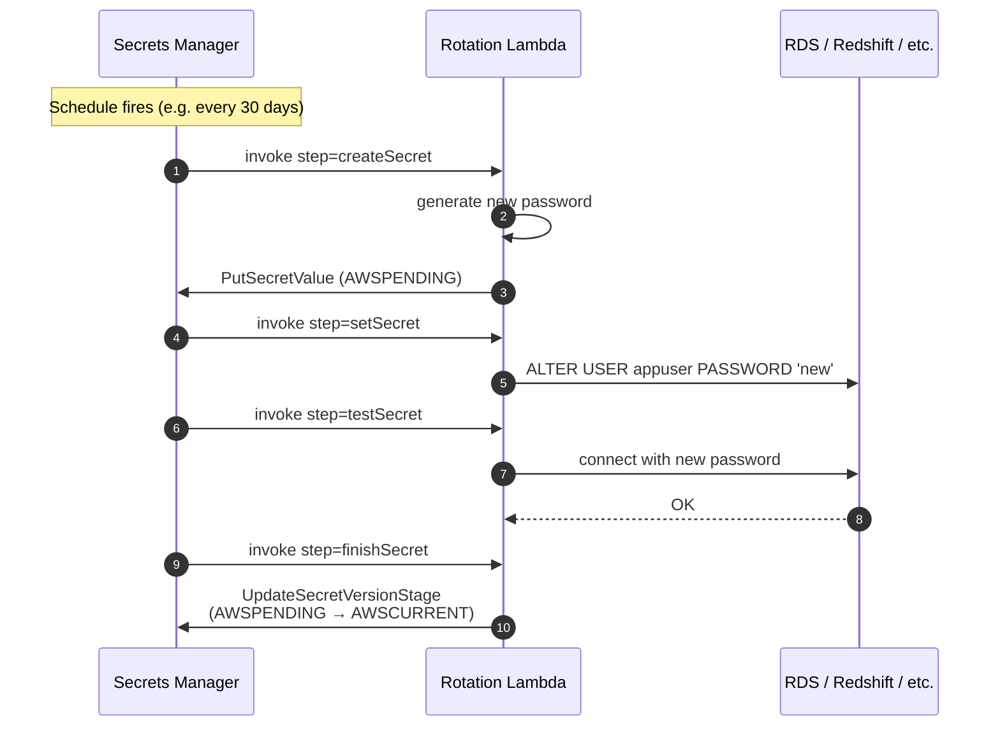
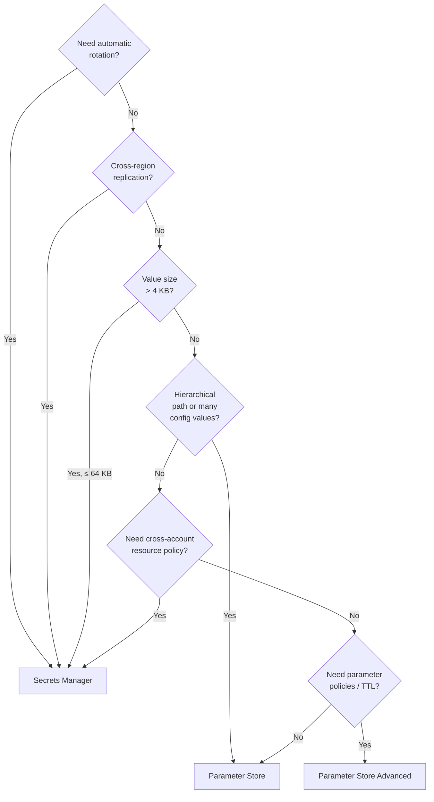

# Secrets Manager vs SSM Parameter Store

> Two services that both hold "values your app reads at runtime." Pick the wrong one and you're either over-paying or under-protected. The SAA-C03 loves head-to-heads between them - usually a "which is cheapest while still supporting feature X" question.

See also: [20 - KMS & Envelope Encryption](20%20-%20KMS%20%26%20Envelope%20Encryption.md) · [01 - IAM Intro bits & bytes](01%20-%20IAM%20Intro%20bits%20%26%20bytes.md) · [05 - IAM Scenarios](05%20-%20IAM%20Scenarios.md)

---

## Table of Contents

- [1. The 60-Second Answer](#1-the-60-second-answer)
- [2. AWS Secrets Manager Deep Dive](#2-aws-secrets-manager-deep-dive)
- [3. Automatic Rotation](#3-automatic-rotation)
- [4. SSM Parameter Store Deep Dive](#4-ssm-parameter-store-deep-dive)
- [5. Standard vs Advanced Tiers](#5-standard-vs-advanced-tiers)
- [6. Access Patterns (CLI + SDK)](#6-access-patterns-cli--sdk)
- [7. Encryption & KMS](#7-encryption--kms)
- [8. Cost Comparison](#8-cost-comparison)
- [9. Decision Tree](#9-decision-tree)
- [10. Exam Tips (SAA-C03)](#10-exam-tips-saa-c03)
- [Summary](#summary)

---

## 1. The 60-Second Answer

| Aspect                     | Secrets Manager                                    | SSM Parameter Store                                     |
| :------------------------- | :------------------------------------------------- | :------------------------------------------------------ |
| Primary purpose            | **Secrets** (DB passwords, API keys) with rotation | **Config + Secrets**; rotation is bring-your-own        |
| Automatic rotation         | ✅ Native (Lambda-driven, free)                    | ❌ Not native (you build it)                            |
| Cost (per item, per month) | **$0.40** per secret + $0.05 per 10 k API calls    | **Free (standard tier)** / $0.05 per advanced parameter |
| Max value size             | 64 KB                                              | 4 KB (standard) / 8 KB (advanced)                       |
| Versioning                 | ✅ Yes (`AWSCURRENT`, `AWSPREVIOUS` labels)        | ✅ Yes (numeric versions)                               |
| Hierarchical paths         | ❌ No structure                                    | ✅ `/prod/db/password` style                            |
| Cross-region replication   | ✅ Built-in                                        | ❌ Not built-in                                         |
| Resource policy            | ✅ Yes (`SecretsManager:*`)                        | ❌ No (IAM only)                                        |
| Audit                      | CloudTrail                                         | CloudTrail                                              |
| Encrypted at rest          | Always (KMS)                                       | Optional per parameter (`SecureString` = KMS encrypted) |

**Rule of thumb:** If the question mentions **"automatic rotation"** → Secrets Manager. If it mentions **"cost-effective"** or **"plain config values"** → Parameter Store.

[⬆ Back to top](#table-of-contents)

---

## 2. AWS Secrets Manager Deep Dive

A purpose-built service for storing, rotating, retrieving, and replicating **secrets**.

### Features

| Feature                                 | Detail                                                                         |
| :-------------------------------------- | :----------------------------------------------------------------------------- |
| Storage                                 | JSON blob up to 64 KB per secret                                               |
| Encryption                              | Always at rest (KMS, AWS-managed `aws/secretsmanager` or your CMK)             |
| Versioning                              | Multiple versions; access by stage label (`AWSCURRENT`, `AWSPREVIOUS`, custom) |
| Resource policy                         | Per-secret resource policy → cross-account access without IAM gymnastics       |
| Automatic rotation                      | Optional, Lambda-based - see § 3                                               |
| Cross-region replication                | Specify replica regions; rotation propagates                                   |
| RDS / Redshift / DocumentDB integration | Native rotation Lambdas provided                                               |
| Tagging                                 | Yes                                                                            |
| Cost                                    | $0.40 per secret per month + $0.05 per 10 k API calls                          |

### Typical secret payload

```json
{
  "username": "appuser",
  "password": "Fn39$kdJ29q",
  "host": "mydb.cluster-abc.us-east-1.rds.amazonaws.com",
  "port": 5432,
  "dbname": "appdb"
}
```

[⬆ Back to top](#table-of-contents)

---

## 3. Automatic Rotation

The headline feature. Secrets Manager invokes a Lambda function on a schedule to rotate the secret.



### Rotation strategies

| Strategy                      | When to use                                                                                                     |
| :---------------------------- | :-------------------------------------------------------------------------------------------------------------- |
| **Single-user, in-place**     | App reconnects automatically when AWSCURRENT changes                                                            |
| **Alternating-users**         | Two DB users, alternate which one is "current" - zero-downtime rotation for apps that don't tolerate reconnects |
| **User + cluster** (Redshift) | Specific Redshift-flavored rotation Lambda                                                                      |

### Pre-built Lambdas

AWS provides ready-made rotation Lambdas for **RDS** (MySQL, PostgreSQL, MariaDB, SQL Server, Oracle), **Amazon DocumentDB**, **Amazon Redshift**. For everything else (Mongo Atlas, custom APIs), you write your own.

### Rotation cadence

Configurable from 1 to 1095 days. Common: 30 or 90.

[⬆ Back to top](#table-of-contents)

---

## 4. SSM Parameter Store Deep Dive

Part of **AWS Systems Manager**. Originally for runtime configuration; secrets came as a "good enough" feature later.

### Parameter types

| Type           | Use                                         |
| :------------- | :------------------------------------------ |
| `String`       | Plaintext value (e.g. AMI ID, feature flag) |
| `StringList`   | Comma-separated list                        |
| `SecureString` | KMS-encrypted value (passwords, tokens)     |

### Hierarchical paths

```
/myapp/prod/db/host
/myapp/prod/db/port
/myapp/prod/db/password   (SecureString)
/myapp/stage/db/host
```

Fetch a whole subtree with `aws ssm get-parameters-by-path --path /myapp/prod --recursive --with-decryption`.

### Public parameters

AWS publishes hundreds of read-only parameters under `/aws/service/...`:

```bash
# Latest Amazon Linux 2023 AMI:
aws ssm get-parameter \
  --name /aws/service/ami-amazon-linux-latest/al2023-ami-kernel-default-x86_64
```

[⬆ Back to top](#table-of-contents)

---

## 5. Standard vs Advanced Tiers

| Aspect                                        | Standard                                                                                        | Advanced                      |
| :-------------------------------------------- | :---------------------------------------------------------------------------------------------- | :---------------------------- |
| Cost                                          | Free                                                                                            | **$0.05 / parameter / month** |
| Max value size                                | 4 KB                                                                                            | 8 KB                          |
| Max parameters per account                    | 10,000                                                                                          | 100,000                       |
| Parameter policies (expiration, notification) | ❌                                                                                              | ✅                            |
| Throughput limits                             | 40/s (default; can request higher to 10,000/s as Higher Throughput tier - costs ~$0.05/10k API) | Same                          |

### Parameter policies (advanced only)

- **Expiration** - auto-delete after a timestamp.
- **ExpirationNotification** - fire EventBridge event N days before expiry.
- **NoChangeNotification** - fire event if value hasn't been updated in N days (rotation tripwire).

[⬆ Back to top](#table-of-contents)

---

## 6. Access Patterns (CLI + SDK)

### Secrets Manager

```bash
# Create
aws secretsmanager create-secret \
  --name prod/db/main \
  --secret-string '{"username":"app","password":"abc123"}'

# Retrieve
aws secretsmanager get-secret-value --secret-id prod/db/main

# Rotate manually
aws secretsmanager rotate-secret --secret-id prod/db/main

# Cross-account access (resource policy)
aws secretsmanager put-resource-policy \
  --secret-id prod/db/main \
  --resource-policy file://policy.json
```

### Parameter Store

```bash
# Put plaintext
aws ssm put-parameter --name /app/log_level --value info --type String

# Put encrypted
aws ssm put-parameter --name /app/db_pass --value 'abc123' \
  --type SecureString --key-id alias/my-cmk

# Get
aws ssm get-parameter --name /app/db_pass --with-decryption

# Get by path
aws ssm get-parameters-by-path --path /app --recursive --with-decryption
```

### In-app retrieval

| Use case                               | Approach                                                                                                    |
| :------------------------------------- | :---------------------------------------------------------------------------------------------------------- |
| Lambda fetching a secret on cold start | Cache in `/tmp` or module-level globals between invocations                                                 |
| EC2 fetching at boot                   | User data script + `aws ssm get-parameter`                                                                  |
| ECS / Fargate task                     | **Native env-var injection** - declare the SSM / Secrets ARN in task definition, ECS resolves at task start |
| EKS pod                                | External Secrets Operator / CSI driver fetches at pod start, mounts as files                                |
| Lambda extension                       | **Secrets and Configuration Lambda Extension** caches with TTL - fewer KMS calls                            |

[⬆ Back to top](#table-of-contents)

---

## 7. Encryption & KMS

Both services rely on [KMS](20%20-%20KMS%20%26%20Envelope%20Encryption.md):

- **Secrets Manager** - **always** encrypted. Default key is `aws/secretsmanager` (AWS-managed). You can switch to a customer-managed CMK per secret.
- **Parameter Store** - only `SecureString` is encrypted. Default `aws/ssm`; or your CMK.

### Implications

- Reading a `SecureString` requires both `ssm:GetParameter` _and_ `kms:Decrypt` on the underlying KMS key.
- Cross-account access to a `SecureString` requires sharing the KMS key (not just the parameter).
- KMS costs $0.03 per 10,000 API calls - usually negligible unless you read parameters in a tight loop without caching.

[⬆ Back to top](#table-of-contents)

---

## 8. Cost Comparison

For **100 secrets, each fetched 10,000 times per month**:

| Service                        | Storage           | API                             | Total / month |
| :----------------------------- | :---------------- | :------------------------------ | :------------ |
| **Secrets Manager**            | 100 × $0.40 = $40 | 1,000,000 / 10,000 × $0.05 = $5 | **~$45**      |
| **Parameter Store** (Standard) | $0                | $0 (standard throughput)        | **$0**        |
| **Parameter Store** (Advanced) | 100 × $0.05 = $5  | $0                              | **$5**        |

For **1 secret with auto-rotation**, Secrets Manager pays for itself by avoiding the engineering cost of building rotation. For **100 plain config values**, Parameter Store standard is free.

[⬆ Back to top](#table-of-contents)

---

## 9. Decision Tree



[⬆ Back to top](#table-of-contents)

---

## 10. Exam Tips (SAA-C03)

1. **"Automatic rotation of DB credentials"** → **Secrets Manager** (always, for SAA-C03 purposes).
2. **"Cheapest way to store config / API endpoints"** → **Parameter Store Standard**.
3. **"Store a Stripe API key with rotation every 30 days"** → Secrets Manager + custom rotation Lambda.
4. **Reading a SecureString needs both `ssm:GetParameter` and `kms:Decrypt`.** A common Access Denied root cause.
5. **Parameter Store can reference Secrets Manager secrets** via `{{resolve:secretsmanager:my-secret:SecretString:password}}` in things like CloudFormation - useful when a tool only speaks one of the two.
6. **ECS task definitions** can pull from either service directly (no Lambda glue needed).
7. **CloudFormation / CDK** can resolve dynamic references from both at deploy time: `{{resolve:ssm:...}}` and `{{resolve:secretsmanager:...}}`.
8. **Cross-account secret access:** Secrets Manager has a resource policy → simpler; Parameter Store relies purely on IAM identity policies + shared KMS key.
9. **Parameter expiration / notifications** require **Advanced tier**.
10. **Both integrate with CloudTrail** for audit - every Get/Put is logged.
11. **Hardcoded credentials in code or env vars are wrong answers.** The exam expects you to fetch at runtime from one of these services.

[⬆ Back to top](#table-of-contents)

---

## Summary

- **Secrets Manager** if you need rotation, replication, larger payloads, or resource policies. ($$$, but cheaper than building it.)
- **Parameter Store** if you need hierarchical config, lots of values, or just plain free storage of plaintext.
- **`SecureString` parameters use KMS** - caller needs both SSM and KMS permissions.
- For ECS / Lambda / CloudFormation, **prefer native references** over fetching at startup - less code, automatic IAM, cleaner audit trail.
- The exam keyword **"rotation"** almost always picks Secrets Manager.

Next in the security path: [16 - Directory Service & RAM](16%20-%20Directory%20Service%20%26%20RAM.md) · [23 - IAM Security Tools](23%20-%20IAM%20Security%20Tools.md)

[⬆ Back to top](#table-of-contents)
