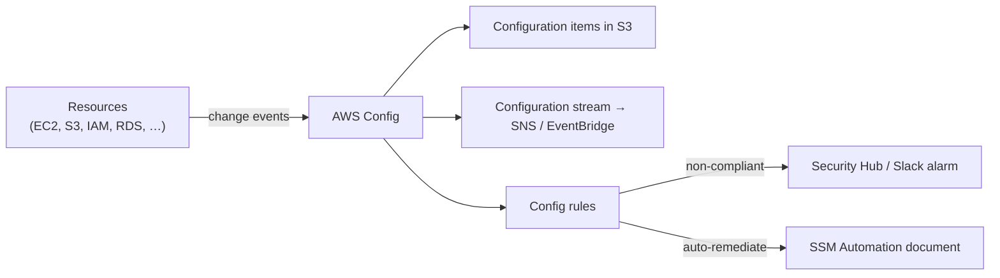
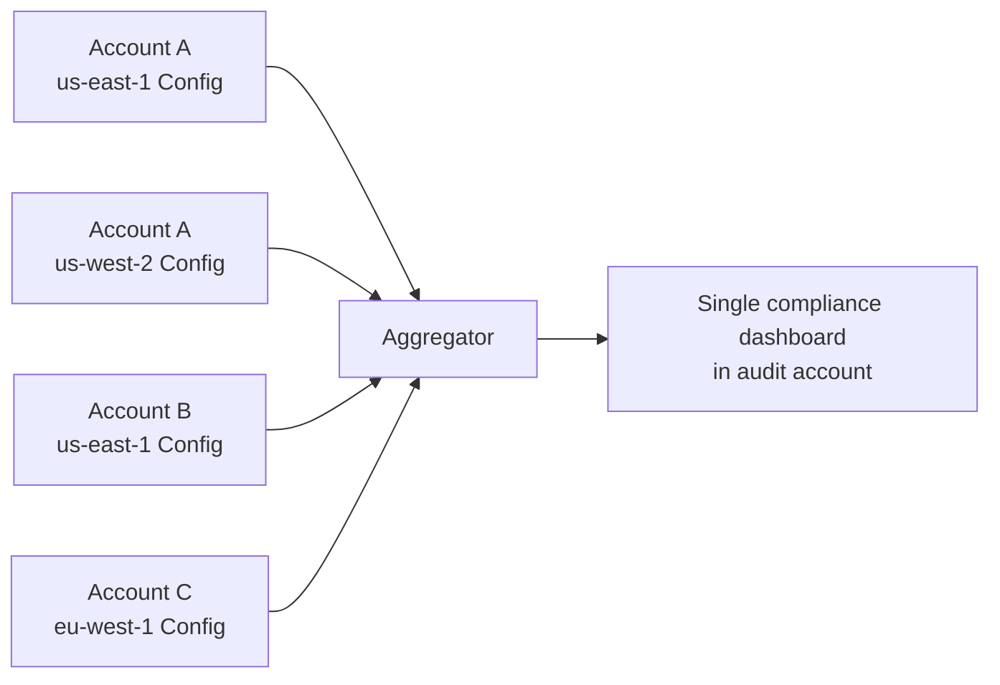
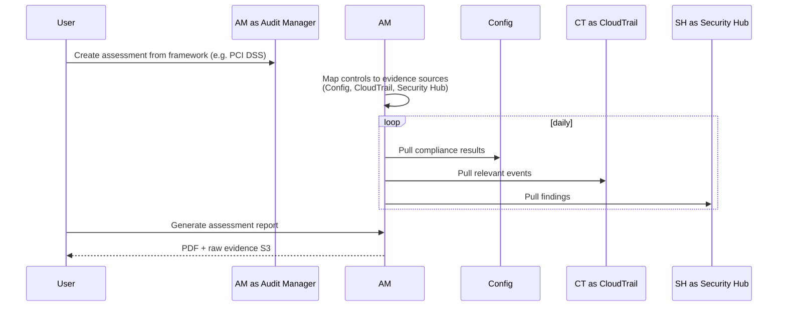

# AWS Config & AWS Audit Manager

> **Config** is the "what is the current configuration, and what was it 30 days ago?" service. **Audit Manager** is the "is the org compliant with PCI / HIPAA / SOC 2 _as of right now_?" service. Together they form the compliance-as-code backbone - high-yield in the SAA-C03 Security domain.

See also: [23 - IAM Security Tools](23%20-%20IAM%20Security%20Tools.md) · [07 - AWS Control Tower](07%20-%20AWS%20Control%20Tower.md) · [25 - GuardDuty Inspector Macie Security Hub](25%20-%20GuardDuty%20Inspector%20Macie%20Security%20Hub.md) · [26 - AWS Detective & AWS Artifact](26%20-%20AWS%20Detective%20%26%20AWS%20Artifact.md)

---

## Table of Contents

- [1. AWS Config - What It Records](#1-aws-config---what-it-records)
- [2. Config Rules](#2-config-rules)
- [3. Remediation Actions](#3-remediation-actions)
- [4. Conformance Packs](#4-conformance-packs)
- [5. Multi-Account, Multi-Region Aggregation](#5-multi-account-multi-region-aggregation)
- [6. AWS Audit Manager](#6-aws-audit-manager)
- [7. Config vs CloudTrail vs Audit Manager](#7-config-vs-cloudtrail-vs-audit-manager)
- [8. Exam Tips (SAA-C03)](#8-exam-tips-saa-c03)
- [Summary](#summary)

---

## 1. AWS Config - What It Records

Config inventories **every supported resource** in your account and records **every configuration change** as a versioned snapshot in S3 + a stream of events to SNS / EventBridge.

| What Config records                                           | What CloudTrail records              |
| :------------------------------------------------------------ | :----------------------------------- |
| **State** of resources over time (what they look like)        | **API calls** (who did what)         |
| Snapshots of every resource                                   | Discrete events with caller identity |
| Answers "Was the security group open to 0.0.0.0/0 yesterday?" | Answers "Who opened it, and when?"   |

Both are needed; they're complementary.

[⬆ Back to top](#table-of-contents)

---

## 2. Config Rules

**Rules** evaluate resource configurations against desired state and emit `COMPLIANT` / `NON_COMPLIANT` findings.

| Rule type                 | Examples                                                                        |
| :------------------------ | :------------------------------------------------------------------------------ |
| **AWS-managed rules**     | `s3-bucket-public-read-prohibited`, `iam-user-mfa-enabled`, `encrypted-volumes` |
| **Custom rules (Lambda)** | "Reject any RDS instance without `Environment` tag"                             |
| **Custom rules (Guard)**  | DSL-based; cheaper than Lambda                                                  |

Triggers:

- **Configuration changes** (real-time)
- **Periodic** (e.g. every 24 h)

[⬆ Back to top](#table-of-contents)

---

## 3. Remediation Actions

When a rule reports non-compliant, Config can **auto-remediate** via an **SSM Automation document**.

Typical pattern:

1. Rule `s3-bucket-public-read-prohibited` flags a bucket.
2. Remediation action invokes `AWS-DisableS3BucketPublicReadWrite` SSM document.
3. The document patches the bucket policy / BPA setting.
4. Re-evaluation marks it compliant.

You can also notify-only - push to EventBridge → SNS → Slack / PagerDuty - and let a human decide.

[⬆ Back to top](#table-of-contents)

---

## 4. Conformance Packs

A **conformance pack** is a YAML bundle of Config rules + remediations deployable in one shot. AWS publishes packs for common frameworks; you can write your own.

| Pack                                       | What it enforces                                               |
| :----------------------------------------- | :------------------------------------------------------------- |
| **CIS AWS Foundations Benchmark**          | The de facto baseline (MFA, no root keys, encrypted EBS, etc.) |
| **PCI DSS**                                | Payment-card hardening                                         |
| **HIPAA**                                  | Healthcare PHI controls                                        |
| **NIST 800-53 / 800-171**                  | Federal / regulated industries                                 |
| **AWS Well-Architected - Security Pillar** | Architecture review baseline                                   |
| **Operational best practices for…**        | Service-specific (S3, Lambda, EKS, …)                          |

Deploy a pack:

- To **one account** via Config console / CLI.
- To **every account in an OU** via AWS Organizations + Config (uses StackSets under the hood).

[⬆ Back to top](#table-of-contents)

---

## 5. Multi-Account, Multi-Region Aggregation

**Config aggregator** centralizes findings from many accounts and regions into one dashboard.

- Aggregator typically lives in the **Audit account** (Control Tower puts it there by default).
- Read-only - non-compliance is visible but remediation still runs in the source account.

[⬆ Back to top](#table-of-contents)

---

## 6. AWS Audit Manager

A managed service that **continuously collects evidence** about your AWS environment and maps it to **compliance framework controls** - so when the auditor asks "show me proof your encryption is enabled," you click → download → done.

### How it works

### Key concepts

| Object                | Purpose                                                                              |
| :-------------------- | :----------------------------------------------------------------------------------- |
| **Framework**         | PCI DSS, HIPAA, SOC 2, AWS Foundational Security Best Practices, custom              |
| **Assessment**        | An ongoing collection of evidence against a framework, scoped to selected accounts   |
| **Control**           | One requirement in the framework (e.g. "PCI Req 3.5.1 - protect cryptographic keys") |
| **Evidence**          | Auto-collected (Config rule results, CloudTrail events) or manual (uploaded PDF)     |
| **Assessment Report** | One-click bundle of evidence - the deliverable for auditors                          |

### Audit Manager vs Config Conformance Pack

| Aspect   | Conformance Pack                    | Audit Manager                                             |
| :------- | :---------------------------------- | :-------------------------------------------------------- |
| Purpose  | **Enforce** rules in real time      | **Collect evidence** of compliance                        |
| Output   | Compliant / non-compliant resources | Audit report (PDF + raw evidence)                         |
| Audience | Engineers, SecOps                   | External auditors, regulators                             |
| Cost     | Free (you pay underlying Config)    | Per-assessment fee + Config / CloudTrail underlying costs |

Use both together: pack **enforces**, Audit Manager **proves**.

[⬆ Back to top](#table-of-contents)

---

## 7. Config vs CloudTrail vs Audit Manager

| Question                                                      | Service                                    |
| :------------------------------------------------------------ | :----------------------------------------- |
| "What did this security group look like last Tuesday?"        | **Config** (timeline of states)            |
| "Who modified this security group last Tuesday at 3 PM?"      | **CloudTrail** (API call log)              |
| "Are any S3 buckets in the org publicly readable right now?"  | **Config rule** evaluation                 |
| "Generate the PCI evidence pack for our annual auditor visit" | **Audit Manager**                          |
| "Auto-fix any non-encrypted EBS volume the moment it appears" | **Config rule + remediation action**       |
| "Centralize compliance across 30 accounts"                    | **Config aggregator** in the Audit account |

[⬆ Back to top](#table-of-contents)

---

## 8. Exam Tips (SAA-C03)

1. **Config records state over time;** **CloudTrail records API calls.** Both = full picture.
2. **Config rules** flag non-compliance; **remediation actions** auto-fix via SSM Automation documents.
3. **Conformance packs** bundle rules + remediations for frameworks (CIS, PCI, HIPAA…).
4. **Aggregator** centralizes findings across accounts/regions - lives in the Audit account in Control Tower setups.
5. **Audit Manager** turns Config + CloudTrail data into an **audit-ready report** mapped to a framework's controls.
6. Cost trap: Config charges per resource recorded + per rule evaluation. Enable recording **selectively** in cost-sensitive scenarios.
7. **Periodic vs Change-triggered rules** - periodic for things that aren't config-driven (like access keys age).
8. **Custom rules in Guard** (DSL) are cheaper than custom Lambda rules.
9. Audit Manager isn't a _control_ - it's _evidence collection_. Pair with Config / Security Hub for the actual controls.

[⬆ Back to top](#table-of-contents)

---

## Summary

- **AWS Config** = configuration recorder + rules engine + auto-remediation.
- **Conformance Packs** ship pre-built rule sets for CIS, PCI, HIPAA, NIST.
- **Aggregator** unifies compliance across many accounts/regions.
- **Audit Manager** turns the raw findings into framework-mapped evidence bundles for auditors.
- For the exam: "what was it?" → Config. "Who did it?" → CloudTrail. "Prove compliance to an auditor" → Audit Manager.

[⬆ Back to top](#table-of-contents)
