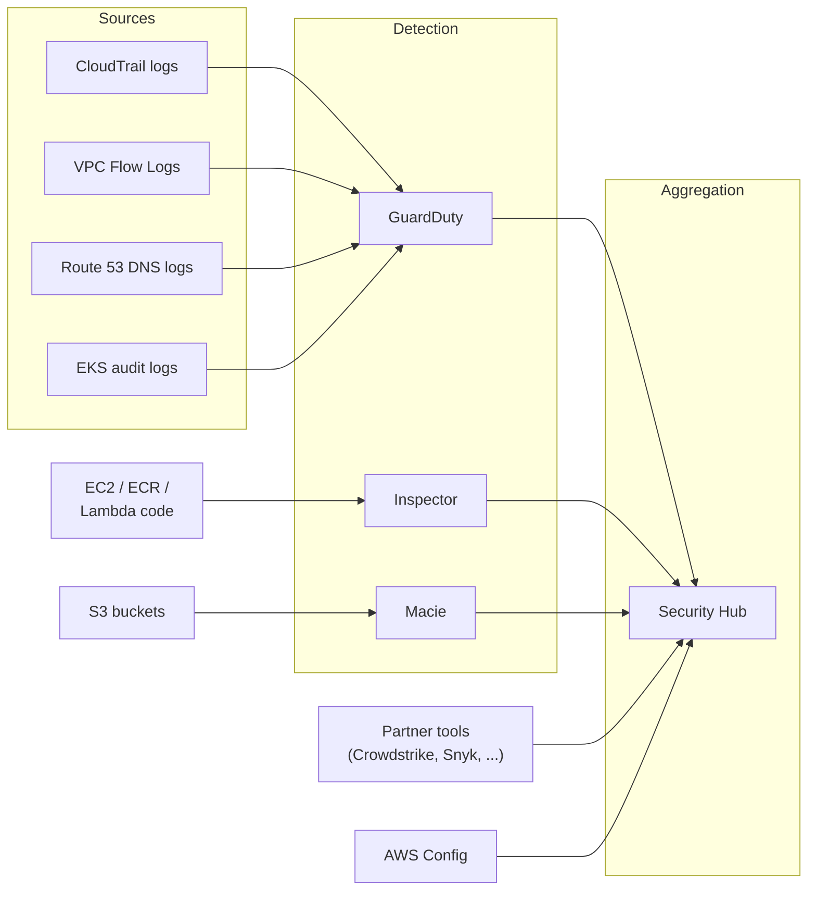
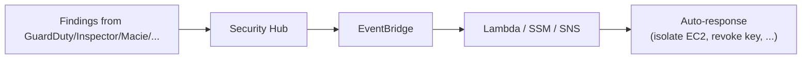

# GuardDuty, Inspector, Macie & Security Hub

> AWS's **threat-detection trio plus the central aggregator**. Each tool watches a different angle:
>
> - **GuardDuty** - bad behavior (network, IAM, EKS, RDS, Lambda anomalies)
> - **Inspector** - vulnerabilities (EC2, ECR images, Lambda code)
> - **Macie** - sensitive data discovery in S3 (PII, financial, health)
> - **Security Hub** - single pane of glass for findings from all of the above (plus partner products)
>
> These together are the "we got hacked, what now?" toolkit and a major SAA-C03 Security domain topic.

See also: [23 - IAM Security Tools](23%20-%20IAM%20Security%20Tools.md) · [24 - AWS Config & Audit Manager](24%20-%20AWS%20Config%20%26%20Audit%20Manager.md) · [26 - AWS Detective & AWS Artifact](26%20-%20AWS%20Detective%20%26%20AWS%20Artifact.md) · [07 - AWS Control Tower](07%20-%20AWS%20Control%20Tower.md)

---

## Table of Contents

- [1. The Big Picture](#1-the-big-picture)
- [2. Amazon GuardDuty](#2-amazon-guardduty)
- [3. Amazon Inspector](#3-amazon-inspector)
- [4. Amazon Macie](#4-amazon-macie)
- [5. AWS Security Hub](#5-aws-security-hub)
- [6. How They Connect to Other Services](#6-how-they-connect-to-other-services)
- [7. Picking the Right Tool - Decision Table](#7-picking-the-right-tool---decision-table)
- [8. Exam Tips (SAA-C03)](#8-exam-tips-saa-c03)
- [Summary](#summary)

---

## 1. The Big Picture

**One mental model:** Sources stream raw logs into Detection services, which produce findings, which flow into Security Hub for triage. Detective (separate file) takes Security Hub findings + raw logs and lets you **investigate** them.

[⬆ Back to top](#table-of-contents)

---

## 2. Amazon GuardDuty

A **managed threat detector** that ingests several AWS data sources and uses ML + threat intelligence to spot bad behavior.

| Detects                 | Examples                                          |
| :---------------------- | :------------------------------------------------ |
| Compromised credentials | "IAM credentials used from Tor exit node"         |
| Cryptocurrency mining   | Outbound DNS to known mining pools                |
| Data exfiltration       | "Unusual outbound traffic from EC2"               |
| Reconnaissance          | "Port scanning from your VPC"                     |
| IAM anomalies           | "API never called before from this principal"     |
| Container threats       | "Privileged container in EKS"                     |
| Malware (EBS scan)      | Scans EBS volumes of affected EC2                 |
| RDS attacks             | Brute-force on Aurora                             |
| S3 anomalies            | "Unusual `s3:GetObject` pattern by IAM principal" |

### Data sources (enabled per feature)

- **CloudTrail management events** (always on, free)
- **CloudTrail S3 data events** (paid extra)
- **VPC Flow Logs** (no setup)
- **Route 53 DNS query logs** (no setup)
- **EKS audit logs**
- **EKS runtime monitoring**
- **Malware Protection for EC2/EBS** (paid)
- **RDS Protection** (Aurora today)
- **Lambda Protection**

### Findings & integrations

- Findings stream into **Security Hub** automatically.
- Severity: Low / Medium / High.
- Can auto-respond via **EventBridge → Lambda / SSM Automation** (isolate instance, revoke creds).

### Cross-account setup

Delegate a **Delegated Administrator** account (typically the Audit account) and enable GuardDuty org-wide. New accounts join automatically.

[⬆ Back to top](#table-of-contents)

---

## 3. Amazon Inspector

Continuous **vulnerability scanning** for EC2, ECR container images, and Lambda functions.

| Target               | What it scans                                                               |
| :------------------- | :-------------------------------------------------------------------------- |
| **EC2 instances**    | OS packages, CVEs; uses SSM Agent - no install needed beyond agent          |
| **ECR images**       | Container-image OS packages + language libraries on push, then continuously |
| **Lambda functions** | Function dependencies + zip layers for CVEs                                 |

### Output

- **Findings** with CVE IDs, CVSS scores, fix availability.
- Auto-integrated into **Security Hub** and **EventBridge**.
- Suppression rules to ignore known-accepted risks.

### Inspector v2 (current) vs v1 (legacy)

- v2 is **on-demand activation per region** - pay only for what's scanned.
- v1 (the "Classic" one) is being deprecated. Always pick **v2** on the exam.

[⬆ Back to top](#table-of-contents)

---

## 4. Amazon Macie

A **data-classification service** that scans S3 buckets to find **sensitive data** (PII, financial, health) and surfaces who can access it.

| Capability           | Detail                                                                             |
| :------------------- | :--------------------------------------------------------------------------------- |
| Discovery            | Scans S3 objects (text, CSV, JSON, parquet, …) for PII patterns                    |
| Built-in classifiers | SSN, credit card, passport, IP address, AWS keys, names, addresses                 |
| Custom classifiers   | Regex + keyword rules for company-specific data                                    |
| Bucket inventory     | Lists buckets, encryption status, public-access status, shared-with-other-accounts |
| Findings             | Public buckets, unencrypted buckets, sensitive-data hits                           |
| Integrates with      | Security Hub, EventBridge, S3 Object Lambda                                        |

Common SAA-C03 phrase: **"discover and protect sensitive data in S3"** → **Macie**.

[⬆ Back to top](#table-of-contents)

---

## 5. AWS Security Hub

The **central aggregation point** for security findings across AWS. Not a detector - a **dashboard + rule engine** on top of findings from many sources.

### What it ingests

- **GuardDuty**, **Inspector**, **Macie**, **IAM Access Analyzer**, **AWS Config**, **AWS Firewall Manager**, **AWS Audit Manager**, **AWS Health**
- **Partner products** (Crowdstrike, Snyk, Tenable, Sumo Logic, …)
- **Your own custom findings** via `BatchImportFindings`

### Standards

Out-of-the-box checks against multiple security standards:

- **AWS Foundational Security Best Practices**
- **CIS AWS Foundations Benchmark**
- **PCI DSS**
- **NIST 800-53**

Each standard runs a battery of checks; non-compliance becomes a finding.

### Cross-account & cross-region

- One **Delegated Administrator** account aggregates all findings from member accounts.
- **Cross-region aggregator** unifies findings into a single region.

### Automation

[⬆ Back to top](#table-of-contents)

---

## 6. How They Connect to Other Services

| You see a finding in… | Investigate further with…                        |
| :-------------------- | :----------------------------------------------- |
| GuardDuty             | **AWS Detective** (entity timeline)              |
| Inspector             | **SSM Patch Manager** to roll the fix out        |
| Macie                 | **S3 Block Public Access** + bucket-policy audit |
| Security Hub          | The originating service for full context         |

Common automated responses (via EventBridge → Lambda or SSM):

- GuardDuty "compromised EC2" → **isolate via SG**, snapshot EBS, deactivate IAM keys.
- Inspector "critical CVE on Lambda" → **block new function deploys** until patched.
- Macie "public bucket with PII" → **set BPA**, alert SecOps.

[⬆ Back to top](#table-of-contents)

---

## 7. Picking the Right Tool - Decision Table

| You want to…                                                     | Pick                                                             |
| :--------------------------------------------------------------- | :--------------------------------------------------------------- | -------------------------- |
| Detect compromised IAM credentials, port scanning, crypto-mining | **GuardDuty**                                                    |
| Find unpatched CVEs on EC2 / ECR images / Lambda                 | **Inspector**                                                    |
| Discover sensitive data (PII, etc.) in S3                        | **Macie**                                                        |
| Centralize all findings in one console                           | **Security Hub**                                                 |
| Check the org against the **CIS Benchmark**                      | **Security Hub standards** (or [Config Conformance Pack](24%20-%20AWS%20Config%20%26%20Audit%20Manager.md)) |
| Investigate "who, what, when" of a security event                | **Detective** + [CloudTrail](#7-config-vs-cloudtrail-vs-audit-manager)               |
| Continuous compliance proof for auditors                         | **Audit Manager** ([24 - AWS Config & Audit Manager](24%20-%20AWS%20Config%20%26%20Audit%20Manager.md))          |

[⬆ Back to top](#table-of-contents)

---

## 8. Exam Tips (SAA-C03)

1. **"Detect malicious activity / anomalous behavior" → GuardDuty.**
2. **"Find software vulnerabilities" → Inspector.**
3. **"Find PII / sensitive data in S3" → Macie.**
4. **"Single pane of glass / aggregate findings from many tools" → Security Hub.**
5. **Always v2 for Inspector** - Classic is deprecated.
6. **Delegated Administrator** is the org-wide enablement pattern for all four services - typically the **Audit account**.
7. GuardDuty data sources are **mostly free** (CloudTrail mgmt, VPC Flow, DNS); paid ones are EBS malware, S3 protection, RDS protection, EKS runtime, Lambda - disable in cost-sensitive answers.
8. **Macie scans S3 only.** Don't pick it for EC2 / RDS data classification questions.
9. **Inspector uses SSM Agent** for EC2 scans - SSM must be set up first.
10. Security Hub can run **automation** via EventBridge - "auto-disable IAM keys on compromise" pattern.
11. **GuardDuty + Detective** is the investigation combo: GuardDuty finds it, Detective explains it.

[⬆ Back to top](#table-of-contents)

---

## Summary

- **GuardDuty** = anomaly / threat detection from CloudTrail, VPC Flow, DNS, EKS, etc.
- **Inspector v2** = vulnerability scanning of EC2 / ECR images / Lambda.
- **Macie** = sensitive-data discovery in S3.
- **Security Hub** = central aggregator + standards-based compliance checks + automation pivot.
- All four enabled org-wide via a **Delegated Administrator** account (typically Audit).
- Pair with **Detective** for investigation and **Audit Manager** for evidence.

[⬆ Back to top](#table-of-contents)
