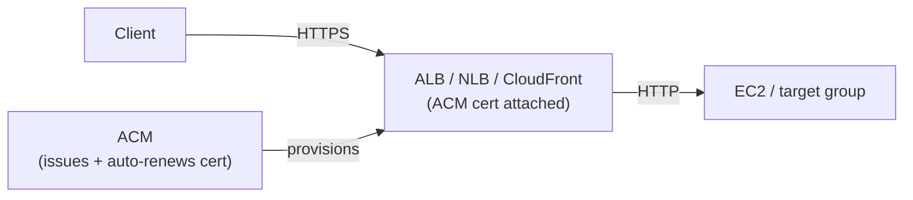

# AWS Certificate Manager (ACM)

> **AWS Certificate Manager (ACM)** provisions, manages, and **auto-renews TLS/SSL certificates** for HTTPS. Distinct from KMS - KMS protects _keys for data at rest_; ACM provides _certs for data in transit_. On the SAA-C03 it shows up as "free public certs," "auto-renewal," and the **CloudFront `us-east-1`** gotcha.

See also: [20 - KMS & Envelope Encryption](20%20-%20KMS%20%26%20Envelope%20Encryption.md) · [27 - WAF Shield & Network Firewall](27%20-%20WAF%20Shield%20%26%20Network%20Firewall.md) · [21 - CloudHSM](21%20-%20CloudHSM.md)

---

## Table of Contents

- [1. ACM in a Sentence](#1-acm-in-a-sentence)
- [2. Public vs Private Certificates](#2-public-vs-private-certificates)
- [3. Where You Can Deploy ACM Certs](#3-where-you-can-deploy-acm-certs)
- [4. Validation & Auto-Renewal](#4-validation--auto-renewal)
- [5. The Regional Rule (CloudFront = us-east-1)](#5-the-regional-rule-cloudfront--us-east-1)
- [6. ACM vs Importing Your Own Cert](#6-acm-vs-importing-your-own-cert)
- [7. Exam Tips (SAA-C03)](#7-exam-tips-saa-c03)
- [Summary](#summary)

---

## 1. ACM in a Sentence

ACM **issues and manages TLS certificates** so you can serve HTTPS without buying, installing, or remembering to renew certs yourself.

> The cert terminates TLS **at the load balancer / edge**, not on the EC2 instance.

[⬆ Back to top](#table-of-contents)

---

## 2. Public vs Private Certificates

| Type              | Detail                                                                                |
| :---------------- | :------------------------------------------------------------------------------------ |
| **Public certs**  | **Free**, issued by Amazon Trust Services. Trusted by browsers. Auto-renew.           |
| **Private certs** | Use **ACM Private CA** (paid). For internal services / **mTLS**, not browser-trusted. |
| **Wildcards**     | Supported (`*.example.com`).                                                          |

[⬆ Back to top](#table-of-contents)

---

## 3. Where You Can Deploy ACM Certs

| Integrates with                                     | Notes                                                            |
| :-------------------------------------------------- | :--------------------------------------------------------------- |
| **ALB**                                             | Native.                                                          |
| **NLB**                                             | Supported since 2018.                                            |
| **CloudFront**                                      | Cert **must be in `us-east-1`**.                                 |
| **API Gateway**                                     | Regional cert in the same Region (edge-optimized → `us-east-1`). |
| **App Runner**, **Elastic Beanstalk** (via its ALB) | Supported.                                                       |

> **EC2 can't directly use a public ACM cert** - put an ALB / NLB in front of EC2 and attach the cert there. **Private** ACM certs _can_ be installed on EC2.

[⬆ Back to top](#table-of-contents)

---

## 4. Validation & Auto-Renewal

| Aspect             | Detail                                                                                                                                 |
| :----------------- | :------------------------------------------------------------------------------------------------------------------------------------- |
| **Validation**     | Prove domain ownership via **DNS** (CNAME record) or **email**.                                                                        |
| **Auto-renewal**   | Public certs auto-renew **~60 days before expiry** _if_ **DNS validation** is configured. Email-validated renewals need manual action. |
| **Imported certs** | **No auto-renewal** - you track and re-import before expiry.                                                                           |

> Exam cue: "**certs keep expiring / want zero-touch renewal**" → ACM public cert with **DNS validation**.

[⬆ Back to top](#table-of-contents)

---

## 5. The Regional Rule (CloudFront = us-east-1)

- An ACM cert lives in **one Region** and can only attach to resources **in that Region**.
- **EXCEPTION:** **CloudFront** is global and reads its cert from **`us-east-1`** - so a CloudFront cert _must_ be requested/imported in `us-east-1`, regardless of where your origin is.
- For ALB / NLB / API Gateway, the cert must be in the **same Region as the resource**.

[⬆ Back to top](#table-of-contents)

---

## 6. ACM vs Importing Your Own Cert

|              | ACM-issued public cert               | Imported cert                               |
| :----------- | :----------------------------------- | :------------------------------------------ |
| Cost         | Free                                 | (cost of your external CA)                  |
| Auto-renewal | Yes (DNS validation)                 | **No**                                      |
| Use when     | You want AWS to manage the lifecycle | You must use an externally-issued / EV cert |

[⬆ Back to top](#table-of-contents)

---

## 7. Exam Tips (SAA-C03)

1. **ACM public certs are free** and **auto-renew with DNS validation**. Imported certs do **not** auto-renew.
2. **CloudFront certs must be in `us-east-1`.** ALB / NLB / API Gateway certs live in the **same Region** as the resource.
3. **EC2 can't use a public ACM cert directly** - terminate TLS at an ALB / NLB instead.
4. **Private CA / mTLS / internal-only** → **ACM Private CA** (paid), not the free public path.
5. ACM ≠ KMS. ACM = **certs (in transit)**; KMS = **keys (at rest)**. See [20 - KMS & Envelope Encryption](20%20-%20KMS%20%26%20Envelope%20Encryption.md).

[⬆ Back to top](#table-of-contents)

---

## Summary

- **ACM** issues, deploys, and **auto-renews TLS certs**; public certs are **free**.
- **DNS validation** enables hands-off auto-renewal; **imported** certs never auto-renew.
- Certs are **regional**; **CloudFront** is the exception and needs the cert in **`us-east-1`**.
- Attach certs at the **ALB / NLB / CloudFront / API Gateway** layer - **not** directly on EC2 (public certs).

Next in the security path: [29 - Ex Qns](29%20-%20Ex%20Qns.md)

[⬆ Back to top](#table-of-contents)
