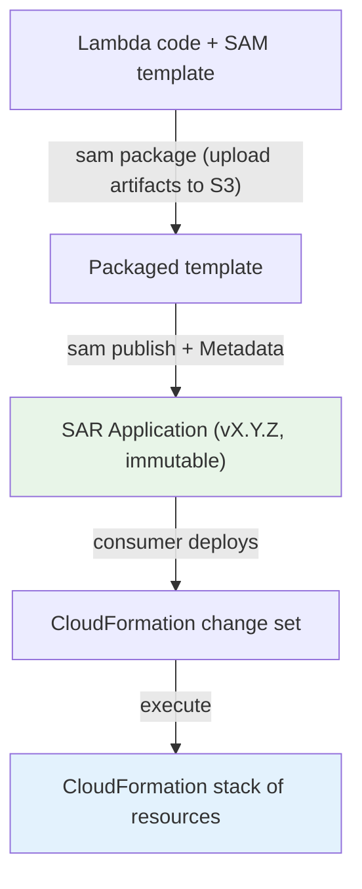
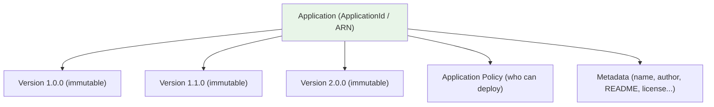
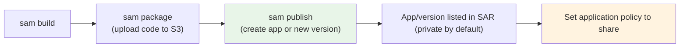
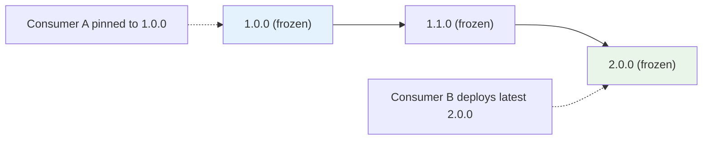
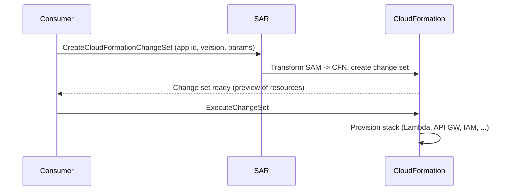

# AWS SAR - Architecture & Publishing Deep Dive

> How a serverless app actually becomes a SAR listing and then a running stack: the **SAM template + `Metadata` section**, the **publish workflow** (`sam publish` / `CreateApplication`), **immutable semantic versioning**, and how SAR drives **CloudFormation change sets** at deploy time. This is where the "what's required to publish" and "how does deploy work" exam details live.

See also: [01 - SAR Intro](01%20-%20SAR%20Intro.md) · [03 - SAR Sharing, Nested Apps & Governance Deep Dive](03%20-%20SAR%20Sharing%2C%20Nested%20Apps%20%26%20Governance%20Deep%20Dive.md) · [04 - SAR Examples & Patterns](04%20-%20SAR%20Examples%20%26%20Patterns.md) · [05 - SAR Scenario Questions](05%20-%20SAR%20Scenario%20Questions.md) · [06 - SAR Important Facts & Cheat Sheet](06%20-%20SAR%20Important%20Facts%20%26%20Cheat%20Sheet.md)

---

## Table of Contents

- [Part 1: The SAR Object Model](#part-1-the-sar-object-model)
- [Part 2: Anatomy of a Publishable SAM Template](#part-2-anatomy-of-a-publishable-sam-template)
- [Part 3: The Metadata Section (Required to Publish)](#part-3-the-metadata-section-required-to-publish)
- [Part 4: The Publish Workflow](#part-4-the-publish-workflow)
- [Part 5: Semantic Versioning & Immutability](#part-5-semantic-versioning--immutability)
- [Part 6: How Deployment Drives CloudFormation](#part-6-how-deployment-drives-cloudformation)
- [Part 7: Deploy-Time Capabilities](#part-7-deploy-time-capabilities)
- [Part 8: Code Storage & the Packaging Step](#part-8-code-storage--the-packaging-step)
- [Summary](#summary)

---



---

## Part 1: The SAR Object Model

A SAR **Application** is a top-level object identified by an **ApplicationId** (an ARN like `arn:aws:serverlessrepo:us-east-1:123456789012:applications/my-app`). Under it hang one or more **versions**.



| Object                  | Notes                                                                                                                                 |
| :---------------------- | :------------------------------------------------------------------------------------------------------------------------------------ | ----------- |
| **Application**         | The named, owned unit. Has metadata + a resource-based application policy.                                                            |
| **Application version** | A specific **immutable** semantic version with its own template + code references.                                                    |
| **Application policy**  | Resource-based policy listing principals + allowed `serverlessrepo:*` actions ([details](03%20-%20SAR%20Sharing%2C%20Nested%20Apps%20%26%20Governance%20Deep%20Dive.md)). |

[⬆ Back to top](#table-of-contents)

---

## Part 2: Anatomy of a Publishable SAM Template

A SAR app is a normal **AWS SAM** template plus a **`Metadata`** section. Minimal example:

```yaml
AWSTemplateFormatVersion: "2010-09-09"
Transform: AWS::Serverless-2016-10-31 # <- marks this as a SAM template
Description: Resize images dropped into an S3 bucket.

Resources:
  ResizerFunction:
    Type: AWS::Serverless::Function
    Properties:
      Handler: app.handler
      Runtime: python3.12
      CodeUri: ./src # local code; sam package uploads it to S3
      Events:
        ImageUpload:
          Type: S3
          Properties:
            Bucket: !Ref SourceBucket
            Events: s3:ObjectCreated:*

  SourceBucket:
    Type: AWS::S3::Bucket

Metadata: # <- REQUIRED to publish to SAR
  AWS::ServerlessRepo::Application:
    Name: image-resizer
    Description: Resizes images uploaded to an S3 bucket.
    Author: platform-team
    SpdxLicenseId: Apache-2.0
    LicenseUrl: ./LICENSE
    ReadmeUrl: ./README.md
    Labels: ["images", "s3", "lambda"]
    HomePageUrl: https://example.com/image-resizer
    SemanticVersion: 1.0.0
    SourceCodeUrl: https://github.com/example/image-resizer
```

> **Exam nugget:** The presence of `Transform: AWS::Serverless-2016-10-31` is what makes it a **SAM** template; the `Metadata > AWS::ServerlessRepo::Application` block is what makes it **publishable to SAR**.

[⬆ Back to top](#table-of-contents)

---

## Part 3: The Metadata Section (Required to Publish)

Publishing fails without the right metadata. Know which fields are required vs optional, and which become _mandatory for public apps_.

| Field                          | Required?                    | Purpose                                                      |
| :----------------------------- | :--------------------------- | :----------------------------------------------------------- |
| `Name`                         | ✅                           | Application name (unique within your account)                |
| `Description`                  | ✅                           | Short description shown in the catalog                       |
| `Author`                       | ✅                           | Publisher name                                               |
| `SemanticVersion`              | ✅ (recommended)             | The immutable version string (e.g., `1.0.0`)                 |
| `SpdxLicenseId` / `LicenseUrl` | License info                 | Required for **public** apps                                 |
| `ReadmeUrl`                    | ✅                           | Markdown README rendered in the catalog (usage/instructions) |
| `SourceCodeUrl`                | Required for **public** apps | A **publicly accessible** link to the source                 |
| `Labels`, `HomePageUrl`        | Optional                     | Discoverability / extra links                                |

> **Exam nugget:** To publish a **public** application, you must provide a **publicly readable `SourceCodeUrl`** and a license, and the app is subject to **AWS review**. Private/shared apps have lighter requirements.

[⬆ Back to top](#table-of-contents)

---

## Part 4: The Publish Workflow

The producer side, end to end:



1. **Build & package** — `sam build` then `sam package` (a.k.a. `aws cloudformation package`) uploads the Lambda code/artifacts to an **S3 bucket** and rewrites `CodeUri` to the S3 location.
2. **Publish** — `sam publish --template packaged.yaml` calls `serverlessrepo:CreateApplication` (first time) or `serverlessrepo:CreateApplicationVersion` (subsequent versions).
3. **Result** — the app is listed, **private by default** (only your account can deploy it).
4. **Share** — attach/extend the **application policy** to grant other accounts, your **AWS Organization**, or everyone (public). See [03 - SAR Sharing, Nested Apps & Governance Deep Dive](03%20-%20SAR%20Sharing%2C%20Nested%20Apps%20%26%20Governance%20Deep%20Dive.md).

```bash
# Publish (or add a version) to SAR
sam publish --template packaged.yaml --region us-east-1

# Make it deployable by specific accounts
aws serverlessrepo put-application-policy \
  --application-id arn:aws:serverlessrepo:us-east-1:111122223333:applications/image-resizer \
  --statements Principals=444455556666,Actions=Deploy
```

[⬆ Back to top](#table-of-contents)

---

## Part 5: Semantic Versioning & Immutability

- Each version uses **semantic versioning** (`MAJOR.MINOR.PATCH`, e.g., `2.1.0`).
- A published version is **immutable** — you **cannot overwrite or edit** it. To change anything, you **publish a new version**.
- Consumers explicitly choose **which version** to deploy, so existing deployments aren't disrupted by a new release.



> **Exam nugget:** You can't mutate a published version — immutability is the point. "Update the app" always means **publish a new semantic version**; nested-app references pin to a specific version for reproducibility.

[⬆ Back to top](#table-of-contents)

---

## Part 6: How Deployment Drives CloudFormation

SAR does not invent a new provisioning engine — it **hands the SAM template to CloudFormation**:



- The consumer calls **`serverlessrepo:CreateCloudFormationChangeSet`** (the Console "Deploy" button does this), then executes the change set.
- The deployed app is an ordinary **CloudFormation stack** in the consumer's account — manage, update (to a new version), or delete it like any stack.

> **Exam nugget:** "How is a SAR app deployed?" → it becomes a **CloudFormation stack** via a change set. This is why SAR deployments are repeatable and fully managed.

[⬆ Back to top](#table-of-contents)

---

## Part 7: Deploy-Time Capabilities

Because deployment runs CloudFormation, the consumer must **acknowledge capabilities** when the app creates sensitive resources:

| Capability                       | Required when the app...                                             |
| :------------------------------- | :------------------------------------------------------------------- |
| **`CAPABILITY_IAM`**             | Creates IAM roles/policies (most apps do)                            |
| **`CAPABILITY_NAMED_IAM`**       | Creates IAM resources with **custom names**                          |
| **`CAPABILITY_RESOURCE_POLICY`** | Creates resource-based policies (e.g., on SQS, SNS, Lambda)          |
| **`CAPABILITY_AUTO_EXPAND`**     | Contains **nested applications** / macros that expand at deploy time |

> **Exam nugget:** A SAR app that includes **nested applications** requires **`CAPABILITY_AUTO_EXPAND`** — a frequent detail in nested-app questions. Apps creating IAM need **`CAPABILITY_IAM`**.

[⬆ Back to top](#table-of-contents)

---

## Part 8: Code Storage & the Packaging Step

| Concern                     | Where it lives                                                                                                               |
| :-------------------------- | :--------------------------------------------------------------------------------------------------------------------------- |
| **Lambda code / artifacts** | Uploaded to **Amazon S3** by `sam package`; the template references the S3 object                                            |
| **Template + metadata**     | Stored by SAR as part of the application version                                                                             |
| **Cross-Region**            | SAR is **regional** — to deploy in another Region, the app/artifacts must be available there (publish/replicate accordingly) |

> **Exam nugget:** `sam package` (≡ `aws cloudformation package`) uploads artifacts to **S3** and rewrites `CodeUri`/`ContentUri` to S3 URIs before publishing. You don't ship raw zips to SAR directly.

[⬆ Back to top](#table-of-contents)

---

## Summary

- A SAR app is a **SAM template + a `Metadata: AWS::ServerlessRepo::Application` block**; that block carries `Name`, `Description`, `Author`, `SemanticVersion`, `ReadmeUrl`, and (for public apps) a **license + public `SourceCodeUrl`**.
- **Publish** with `sam publish` (→ `CreateApplication` / `CreateApplicationVersion`); apps are **private by default** and shared via the **application policy**.
- Versions use **semantic versioning** and are **immutable** — update = publish a new version; consumers pin/choose versions.
- **Deploy** creates a **CloudFormation change set → stack**; sensitive resources require **capability acknowledgements** (`CAPABILITY_IAM`, `CAPABILITY_AUTO_EXPAND` for nested apps).
- Code artifacts are staged in **S3** by `sam package`; SAR is **regional**.

> Next: [03 - SAR Sharing, Nested Apps & Governance Deep Dive](03%20-%20SAR%20Sharing%2C%20Nested%20Apps%20%26%20Governance%20Deep%20Dive.md) — application policies, org-wide sharing, public verification, and composing apps with `AWS::Serverless::Application`.
