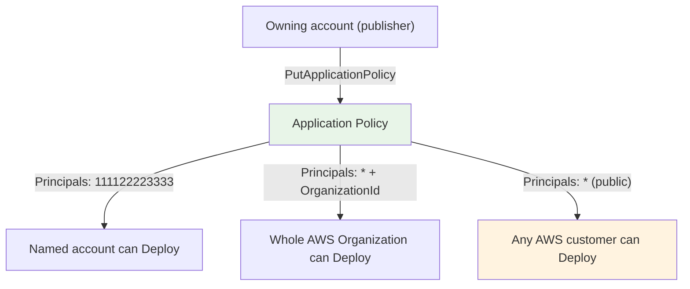
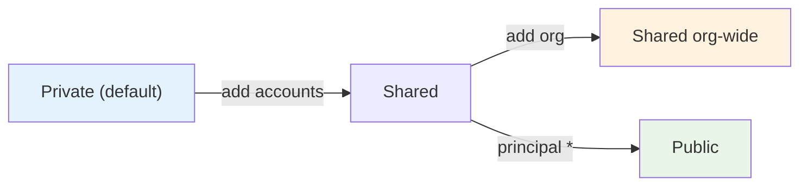
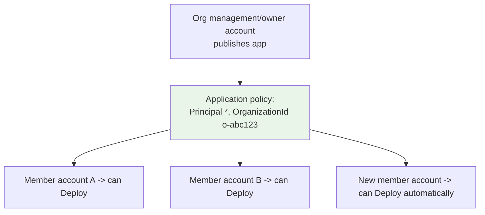
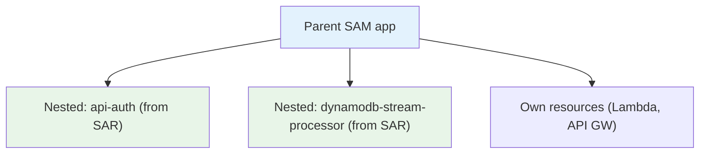

# AWS SAR - Sharing, Nested Apps & Governance Deep Dive

> The control plane of SAR: **application policies** (who can find/deploy), **org-wide sharing without going public**, **public apps + verified authors**, and **nested applications** (`AWS::Serverless::Application`) for composing architectures. These are the governance details the exam likes to probe.

See also: [01 - SAR Intro](01%20-%20SAR%20Intro.md) · [02 - SAR Architecture & Publishing Deep Dive](02%20-%20SAR%20Architecture%20%26%20Publishing%20Deep%20Dive.md) · [04 - SAR Examples & Patterns](04%20-%20SAR%20Examples%20%26%20Patterns.md) · [05 - SAR Scenario Questions](05%20-%20SAR%20Scenario%20Questions.md) · [06 - SAR Important Facts & Cheat Sheet](06%20-%20SAR%20Important%20Facts%20%26%20Cheat%20Sheet.md)

Related governance/security topics: [08 - SCP](08%20-%20SCP.md) · [03 - IAM Policy Structure](03%20-%20IAM%20Policy%20Structure.md)

---

## Table of Contents

- [Part 1: The Application Policy (Resource-Based)](#part-1-the-application-policy-resource-based)
- [Part 2: The Three Sharing Models in Detail](#part-2-the-three-sharing-models-in-detail)
- [Part 3: Sharing With an AWS Organization](#part-3-sharing-with-an-aws-organization)
- [Part 4: Public Applications & Verified Authors](#part-4-public-applications--verified-authors)
- [Part 5: Nested Applications](#part-5-nested-applications)
- [Part 6: Governance & Least-Privilege Patterns](#part-6-governance--least-privilege-patterns)
- [Part 7: Common Sharing/Permission Mistakes](#part-7-common-sharingpermission-mistakes)
- [Summary](#summary)

---



---

## Part 1: The Application Policy (Resource-Based)

Sharing in SAR is governed by a **resource-based policy attached to the application** — managed with `PutApplicationPolicy` / `GetApplicationPolicy`. It lists **principals** and the **`serverlessrepo` actions** they may perform.

| Action                         | What it allows                                                                                                                  |
| :----------------------------- | :------------------------------------------------------------------------------------------------------------------------------ |
| **`Deploy`**                   | The headline grant — create a change set and deploy the app (`serverlessrepo:CreateCloudFormationChangeSet` + `GetApplication`) |
| `GetApplication`               | View the application                                                                                                            |
| `ListApplicationVersions`      | See available versions                                                                                                          |
| `SearchApplications`           | Discover the app in search                                                                                                      |
| `CreateCloudFormationTemplate` | Generate a template for deployment                                                                                              |

```json
{
  "Principals": ["444455556666"],
  "Actions": ["Deploy"]
}
```

> **Exam nugget:** Granting **`Deploy`** is what lets another account actually launch the app. Sharing is done through the **application policy**, not by copying the app or attaching IAM policies to the consumer.

[⬆ Back to top](#table-of-contents)

---

## Part 2: The Three Sharing Models in Detail



| Model                     | Principal in policy                | Notes                                                                    |
| :------------------------ | :--------------------------------- | :----------------------------------------------------------------------- |
| **Private**               | none (only owner)                  | Default after publishing                                                 |
| **Shared (accounts)**     | specific 12-digit account IDs      | Each listed account can `Deploy`                                         |
| **Shared (organization)** | `*` **scoped by `OrganizationId`** | Every account in the org can `Deploy`, without exposing the app publicly |
| **Public**                | `*` (unscoped)                     | Any AWS customer; requires public `SourceCodeUrl` + AWS review           |

> **Exam trap:** "Make a serverless app available to **all accounts in our organization** but **not** to the public." → Share with the **Organization** (org-scoped policy), _not_ a public listing.

[⬆ Back to top](#table-of-contents)

---

## Part 3: Sharing With an AWS Organization

SAR integrates with **AWS Organizations** so you can grant deploy rights to the **entire org** in one statement instead of enumerating account IDs.



- Use `PutApplicationPolicy` with principal `*` **plus** an `OrganizationId` condition (Console: "Share with organization").
- **New accounts** that later join the org inherit deploy access automatically — no per-account updates.
- This keeps the app **private to the org** (not on the public catalog).

```bash
aws serverlessrepo put-application-policy \
  --application-id <app-arn> \
  --statements Principals=*,Actions=Deploy,PrincipalOrgIDs=o-abc123example
```

> **Exam nugget:** Org-wide internal distribution of a vetted serverless component = SAR **shared with the AWS Organization**. Combine with [SCPs](08%20-%20SCP.md) if you also need to _restrict_ what member accounts can do.

[⬆ Back to top](#table-of-contents)

---

## Part 4: Public Applications & Verified Authors

To publish to the **public** catalog (visible to every AWS customer):

| Requirement                | Detail                                                                                    |
| :------------------------- | :---------------------------------------------------------------------------------------- |
| **Public `SourceCodeUrl`** | A publicly accessible link to the source (e.g., GitHub)                                   |
| **License**                | `SpdxLicenseId` / `LicenseUrl`                                                            |
| **AWS review**             | Public apps are reviewed before listing                                                   |
| **Verified author**        | A **badge** AWS grants confirming the publisher's identity/domain — builds consumer trust |

> **Exam nugget:** Public listing requires a **publicly readable `SourceCodeUrl`**; the **verified author** badge signals a confirmed publisher. If a scenario wants distribution to _external_ customers, public + verified is the path; if it's _internal_, use org sharing.

[⬆ Back to top](#table-of-contents)

---

## Part 5: Nested Applications

A **nested application** lets you embed an existing SAR app _inside another SAM template_ as a building block — composition instead of copy-paste.



```yaml
Resources:
  AuthLayer:
    Type: AWS::Serverless::Application
    Properties:
      Location:
        ApplicationId: arn:aws:serverlessrepo:us-east-1:111122223333:applications/api-auth
        SemanticVersion: 1.3.0 # pin a specific immutable version
      Parameters:
        StageName: prod
```

- A nested app is referenced by its **`ApplicationId` + `SemanticVersion`** (pinning guarantees reproducible builds).
- Deploying a template with nested apps requires **`CAPABILITY_AUTO_EXPAND`**.
- Nesting is how teams build **bigger architectures from small, owned, versioned pieces** — each piece patched/released independently.

> **Exam nugget:** `AWS::Serverless::Application` + `Location.ApplicationId/SemanticVersion` = **nested SAR app**. The deploy needs **`CAPABILITY_AUTO_EXPAND`**.

[⬆ Back to top](#table-of-contents)

---

## Part 6: Governance & Least-Privilege Patterns

| Goal                                                                 | How                                                                            |
| :------------------------------------------------------------------- | :----------------------------------------------------------------------------- | ----------------------------- |
| Only certain teams can **deploy** an internal app                    | Grant `Deploy` to specific accounts / org units via application policy         |
| Restrict who can **publish**                                         | Control `serverlessrepo:CreateApplication*` via **IAM policies** on publishers |
| Enforce org-wide **service guardrails** on what deployed apps may do | Layer \*\*[SCPs](08%20-%20SCP.md)\*\* on member accounts |
| Vet third-party apps before use                                      | Review the SAM template / README; deploy into an isolated account first        |
| Reproducible composition                                             | **Pin nested-app `SemanticVersion`s**                                          |

> **Two distinct permission layers:** the **application policy** (resource-based, SAR-side) controls _who can deploy the app_; **IAM policies** (identity-based) control _who in your account can call SAR APIs and what the resulting CloudFormation stack may create_.

[⬆ Back to top](#table-of-contents)

---

## Part 7: Common Sharing/Permission Mistakes

| Mistake                                              | Consequence                      | Fix                                     |
| :--------------------------------------------------- | :------------------------------- | :-------------------------------------- |
| Made an app **public** just to share internally      | Exposed it to the world          | Share with the **Organization** instead |
| Forgot to grant **`Deploy`**                         | Consumers can see but not deploy | Add `Deploy` to the application policy  |
| Tried to **edit a published version**                | Not allowed (immutable)          | Publish a **new semantic version**      |
| Omitted **`CAPABILITY_AUTO_EXPAND`** for nested apps | Deployment fails                 | Acknowledge the capability at deploy    |
| Public app without **`SourceCodeUrl`/license**       | Rejected in review               | Provide public source + SPDX license    |

[⬆ Back to top](#table-of-contents)

---

## Summary

- Sharing is controlled by the application's **resource-based application policy** (`PutApplicationPolicy`); granting **`Deploy`** is what enables another principal to launch the app.
- Three models: **private** (default), **shared** (named accounts **or** the whole **AWS Organization**), **public** (principal `*`, requires public `SourceCodeUrl` + license + AWS review, with a **verified author** badge).
- **Org sharing** distributes a vetted app internally without exposing it publicly; new member accounts inherit access.
- **Nested applications** (`AWS::Serverless::Application` with `ApplicationId` + pinned `SemanticVersion`) compose bigger apps from reusable pieces and require **`CAPABILITY_AUTO_EXPAND`**.
- Keep two permission layers straight: **application policy** (who deploys the app) vs **IAM** (who can call SAR / what the stack may create); add **SCPs** for org guardrails.

> Next: [04 - SAR Examples & Patterns](04%20-%20SAR%20Examples%20%26%20Patterns.md) — concrete architectures: org-wide component library, nested composition, CI/CD publishing, and common public apps.
