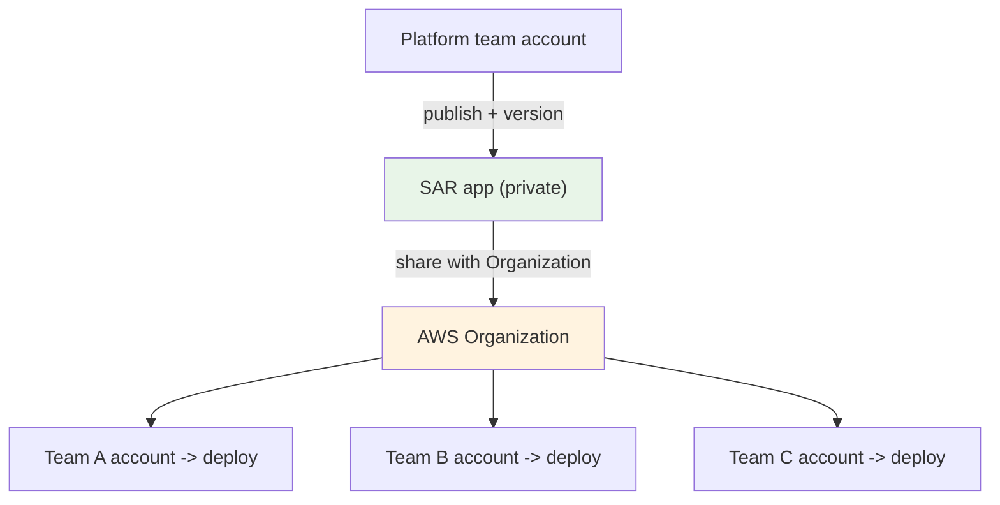
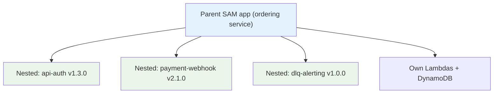
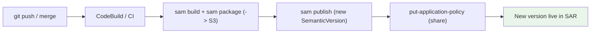
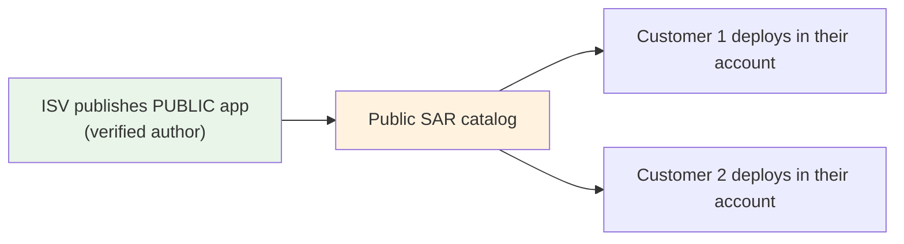
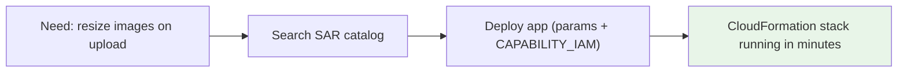

# AWS SAR - Examples & Patterns

> Concrete, exam-relevant ways SAR shows up in real architectures: an **org-wide reusable component library**, **nested-app composition**, **CI/CD publishing**, **distributing to external customers**, and the **common public apps** you should recognize. Each pattern ends with the "why SAR" justification an exam answer would use.

See also: [01 - SAR Intro](01%20-%20SAR%20Intro.md) · [02 - SAR Architecture & Publishing Deep Dive](02%20-%20SAR%20Architecture%20%26%20Publishing%20Deep%20Dive.md) · [03 - SAR Sharing, Nested Apps & Governance Deep Dive](03%20-%20SAR%20Sharing%2C%20Nested%20Apps%20%26%20Governance%20Deep%20Dive.md) · [05 - SAR Scenario Questions](05%20-%20SAR%20Scenario%20Questions.md) · [06 - SAR Important Facts & Cheat Sheet](06%20-%20SAR%20Important%20Facts%20%26%20Cheat%20Sheet.md)

---

## Table of Contents

- [Pattern 1: Org-Wide Reusable Component Library](#pattern-1-org-wide-reusable-component-library)
- [Pattern 2: Composing Architectures with Nested Apps](#pattern-2-composing-architectures-with-nested-apps)
- [Pattern 3: CI/CD Publishing Pipeline](#pattern-3-cicd-publishing-pipeline)
- [Pattern 4: Distributing a Product to External Customers](#pattern-4-distributing-a-product-to-external-customers)
- [Pattern 5: Rapid Deployment of Common Patterns](#pattern-5-rapid-deployment-of-common-patterns)
- [Pattern 6: Standardized Observability/Security Add-ons](#pattern-6-standardized-observabilitysecurity-add-ons)
- [Common Public Apps to Recognize](#common-public-apps-to-recognize)
- [Anti-Patterns](#anti-patterns)

---

## Pattern 1: Org-Wide Reusable Component Library

A platform team builds vetted serverless components (audit-log shipper, standardized API auth, alarm-to-Slack notifier) and wants every account in the org to deploy the **approved version** consistently.



**Why SAR:** publish once, **share with the AWS Organization**, and teams self-serve a consistent, version-pinned deployment. New accounts inherit access. No public exposure.

[⬆ Back to top](#table-of-contents)

---

## Pattern 2: Composing Architectures with Nested Apps

Instead of one monolithic template, assemble an app from independently-owned SAR building blocks.



```yaml
Resources:
  Auth:
    Type: AWS::Serverless::Application
    Properties:
      Location:
        ApplicationId: arn:aws:serverlessrepo:us-east-1:111122223333:applications/api-auth
        SemanticVersion: 1.3.0
```

**Why SAR:** each block is **versioned and independently maintained**; pinning `SemanticVersion` makes builds **reproducible**. Deploy needs **`CAPABILITY_AUTO_EXPAND`**.

[⬆ Back to top](#table-of-contents)

---

## Pattern 3: CI/CD Publishing Pipeline

Automate publishing so each merged release becomes a new SAR version.



**Why SAR:** versions are **immutable**, so a pipeline that bumps `SemanticVersion` on every release gives a clean, auditable release history that consumers can pin to.

[⬆ Back to top](#table-of-contents)

---

## Pattern 4: Distributing a Product to External Customers

An ISV wants customers to deploy its serverless integration into their own accounts with one click.



**Why SAR:** **public** listing + **verified author** badge + **public `SourceCodeUrl`** lets external customers discover and deploy into _their own_ accounts — they run/pay for their own resources. (For paid commercial software, **AWS Marketplace** is the billing-integrated alternative.)

[⬆ Back to top](#table-of-contents)

---

## Pattern 5: Rapid Deployment of Common Patterns

A team needs an S3-upload-thumbnail generator today, not next sprint.



**Why SAR:** skip rebuilding boilerplate — find a vetted app, supply parameters, deploy as a stack in minutes.

[⬆ Back to top](#table-of-contents)

---

## Pattern 6: Standardized Observability/Security Add-ons

Bundle "must-have" cross-cutting functions (centralized logging, metric filters, GuardDuty finding routing, cost anomaly alerts) as SAR apps that every workload account deploys.

| Add-on app      | What it deploys                                               |
| :-------------- | :------------------------------------------------------------ |
| Log forwarder   | Lambda subscribed to CloudWatch Logs → central account/SIEM   |
| Alarm router    | SNS → Lambda → Slack/PagerDuty                                |
| Tag enforcer    | Event-driven Lambda checking resource tags                    |
| Finding handler | EventBridge rule + Lambda for GuardDuty/Security Hub findings |

**Why SAR:** consistent, versioned guardrail components rolled out org-wide; pair with [SCPs](08%20-%20SCP.md) for hard restrictions.

[⬆ Back to top](#table-of-contents)

---

## Common Public Apps to Recognize

You don't need to memorize specific apps, but recognizing the _category_ helps decode scenarios:

| Category         | Examples                                                   |
| :--------------- | :--------------------------------------------------------- |
| Chat / bots      | Slack/Alexa integrations, chatops handlers                 |
| Media processing | Image resize/thumbnail, video transcode triggers           |
| Ops / monitoring | CloudWatch alarm → Slack, log shippers, scheduled cleanups |
| Data             | DynamoDB stream processors, Kinesis/S3 ETL starters        |
| Security         | Finding routers, automated remediation functions           |

[⬆ Back to top](#table-of-contents)

---

## Anti-Patterns

| Anti-pattern                              | Why it's wrong             | Better                           |
| :---------------------------------------- | :------------------------- | :------------------------------- |
| Publishing **public** to share internally | Exposes app to the world   | Share with the **Organization**  |
| Using SAR for **container images**        | SAR is for serverless apps | **Amazon ECR**                   |
| Using SAR for **package dependencies**    | Not a package manager      | **CodeArtifact**                 |
| Expecting to **edit** a released version  | Versions are immutable     | Publish a **new version**        |
| Hand-copying a component into many repos  | Drift, no versioning       | Publish once as a **nested app** |

[⬆ Back to top](#table-of-contents)

---

> Next: [05 - SAR Scenario Questions](05%20-%20SAR%20Scenario%20Questions.md) — exam-style questions with full reasoning and distractor analysis.
