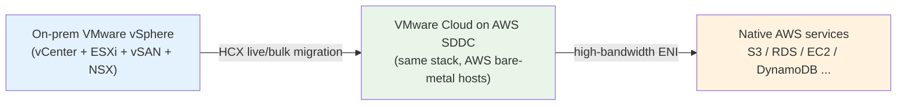
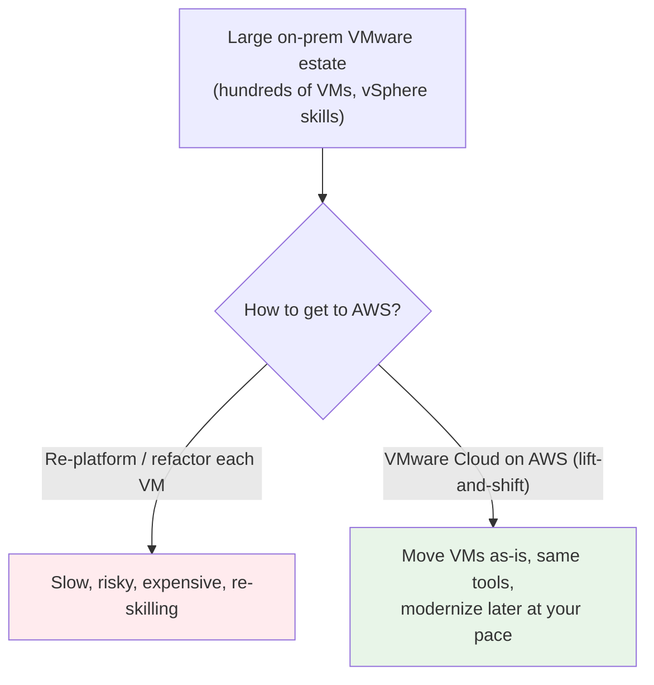
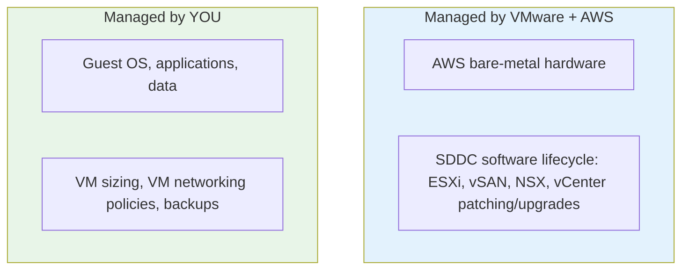
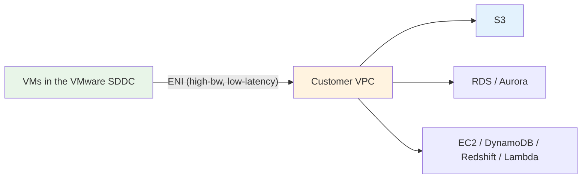
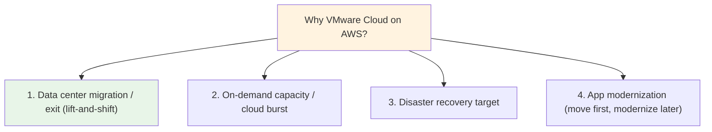
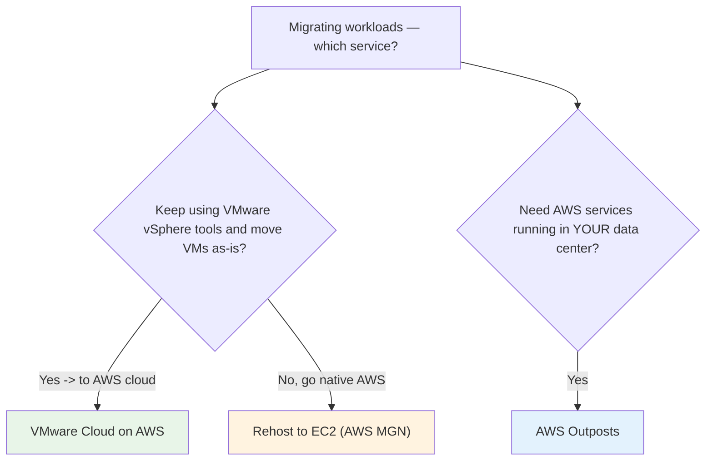

# VMware Cloud on AWS - SAA-C03 Intro

> **VMware Cloud on AWS (VMC)** runs the full **VMware SDDC stack** (vSphere/ESXi, vSAN, NSX, vCenter) on **dedicated AWS bare-metal hosts inside AWS data centers**. It's the "**lift-and-shift VMware to AWS with no re-platforming**" service: enterprises migrate existing vSphere VMs **as-is**, keep their **same VMware tools and operating model**, and gain a high-speed link to native AWS services. For the exam, the trigger is _"migrate/extend our existing **VMware vSphere** workloads to AWS with **minimal changes** and **familiar tooling**."_

See also: [02 - VMware Cloud Architecture Deep Dive](02%20-%20VMware%20Cloud%20Architecture%20Deep%20Dive.md) · [03 - VMware Cloud Networking, Migration & Integration Deep Dive](03%20-%20VMware%20Cloud%20Networking%2C%20Migration%20%26%20Integration%20Deep%20Dive.md) · [04 - VMware Cloud Examples & Patterns](04%20-%20VMware%20Cloud%20Examples%20%26%20Patterns.md) · [05 - VMware Cloud Scenario Questions](05%20-%20VMware%20Cloud%20Scenario%20Questions.md) · [06 - VMware Cloud Important Facts & Cheat Sheet](06%20-%20VMware%20Cloud%20Important%20Facts%20%26%20Cheat%20Sheet.md)

Related hybrid/edge topics: [01 - Outposts Intro](01%20-%20Outposts%20Intro.md) · [01 - Wavelength Intro](01%20-%20Wavelength%20Intro.md) · [01 - EC2 Intro](01%20-%20EC2%20Intro.md)

---

## Table of Contents

- [Core Concept: What is VMware Cloud on AWS?](#core-concept-what-is-vmware-cloud-on-aws)
- [The Problem It Solves](#the-problem-it-solves)
- [What Runs Where (The SDDC on Bare Metal)](#what-runs-where-the-sddc-on-bare-metal)
- [Who Manages What (Shared Responsibility)](#who-manages-what-shared-responsibility)
- [The Native AWS Connection (ENI)](#the-native-aws-connection-eni)
- [The Four Primary Use Cases](#the-four-primary-use-cases)
- [VMware Cloud on AWS vs Outposts vs Native EC2 (Exam Favorite)](#vmware-cloud-on-aws-vs-outposts-vs-native-ec2-exam-favorite)
- [Pricing Model at a Glance](#pricing-model-at-a-glance)
- [VMware Cloud Across the Four Exam Domains](#vmware-cloud-across-the-four-exam-domains)

---

---

## Core Concept: What is VMware Cloud on AWS?

**VMware Cloud on AWS** is a service — **jointly engineered by VMware and AWS** — that lets you run a **VMware Software-Defined Data Center (SDDC)** on **dedicated, single-tenant AWS bare-metal EC2 hosts** located inside AWS Regions/Availability Zones.

Three facts define it:

1. **It's the real VMware stack**, not an emulation: **vSphere (ESXi)** for compute, **vSAN** for storage, **NSX** for networking, all managed by **vCenter Server** — the exact tools your VMware admins already use.
2. **It runs on AWS bare-metal hardware** in AWS data centers (you don't bring hardware; unlike [Outposts](01%20-%20Outposts%20Intro.md), the hardware lives in _AWS's_ facility).
3. **Migration is lift-and-shift**: existing vSphere VMs move **without conversion or re-platforming**, keeping the same VM format, networking, and operational model.

> [!note] One-line mental model
> VMware Cloud on AWS = **"your VMware data center, but the hardware is AWS bare-metal in an AWS Region."** You manage it with the **same vCenter/vSphere tools** and bridge to native AWS over a fast link.

[⬆ Back to top](#table-of-contents)

---

## The Problem It Solves

Enterprises with large VMware estates want cloud benefits (elasticity, exit the data center, access AWS services) but **can't afford to re-architect hundreds/thousands of VMs** or retrain teams on a new operating model.

VMware Cloud on AWS lets you **migrate first (fast, low-risk), then modernize at your own pace** — once VMs are in AWS, they can reach native AWS services (RDS, S3, Lambda, etc.) to evolve incrementally.

[⬆ Back to top](#table-of-contents)

---

## What Runs Where (The SDDC on Bare Metal)

| Layer          | Component                    | Role                                                         |
| :------------- | :--------------------------- | :----------------------------------------------------------- |
| **Compute**    | **vSphere / ESXi**           | Hypervisor running your VMs                                  |
| **Storage**    | **vSAN**                     | Software-defined storage pooled across hosts                 |
| **Networking** | **NSX**                      | Software-defined networking, micro-segmentation, firewalling |
| **Management** | **vCenter Server**           | Single console to manage the SDDC (same UI as on-prem)       |
| **Migration**  | **VMware HCX**               | Live/bulk VM migration from on-prem                          |
| **Hardware**   | **AWS bare-metal EC2 hosts** | Dedicated, single-tenant hosts in an AWS AZ                  |

> **Exam nugget:** VMware Cloud on AWS runs on **dedicated bare-metal AWS hosts** — single-tenant Amazon EC2 hardware — so the ESXi hypervisor runs directly on the metal. You manage **VMs via vCenter**, exactly like on-prem.

[⬆ Back to top](#table-of-contents)

---

## Who Manages What (Shared Responsibility)

VMware Cloud on AWS is a **managed service** — the line is different from running EC2 yourself.

| Responsibility                                                | Owner                |
| :------------------------------------------------------------ | :------------------- |
| Physical hardware, host availability                          | **AWS**              |
| SDDC software (ESXi/vSAN/NSX/vCenter) install, patch, upgrade | **VMware** (managed) |
| Guest OS, application, data, VM configuration                 | **Customer**         |
| Backups of VM/app data                                        | **Customer**         |

> **Exam nugget:** Unlike self-managed EC2, you **don't patch the hypervisor or the SDDC software** — VMware operates it. You still own **guest OS, apps, and data** (and their backups).

[⬆ Back to top](#table-of-contents)

---

## The Native AWS Connection (ENI)

Each SDDC is wired to a **customer-owned VPC** through a **high-bandwidth, low-latency Elastic Network Interface (ENI)**. This is what makes VMC more than "VMware in a colo."

- VMs reach **native AWS services privately** (no public internet) over the ENI.
- When the SDDC and the AWS services are in the **same AZ**, there are **no data egress charges** across that ENI.
- This enables incremental modernization: keep the VM, offload data/analytics/managed databases to native AWS.

> **Exam nugget:** The **ENI** gives VMC VMs **high-bandwidth, low-latency, private** access to native AWS services, with **no egress charge within the same AZ**. Place the SDDC in the **same AZ** as the AWS services it talks to.

[⬆ Back to top](#table-of-contents)

---

## The Four Primary Use Cases

| Use case                               | What it looks like                                                                  |
| :------------------------------------- | :---------------------------------------------------------------------------------- |
| **Data center migration / evacuation** | Exit or shrink on-prem DCs by moving VMware workloads to AWS **as-is**              |
| **On-demand capacity**                 | Burst into AWS for seasonal/spiky demand without buying on-prem hardware            |
| **Disaster recovery**                  | Use VMC as a **DR target** (VMware Cloud DR / Site Recovery) for on-prem vSphere    |
| **App modernization**                  | Land in AWS quickly, then adopt native services (RDS, S3, containers) incrementally |

[⬆ Back to top](#table-of-contents)

---

## VMware Cloud on AWS vs Outposts vs Native EC2 (Exam Favorite)

This comparison decides many questions. The discriminators are **where the hardware lives** and **whether you keep the VMware operating model**.

| Aspect                  | **VMware Cloud on AWS**            | **AWS Outposts**                                                      | **Native EC2 (rehost via MGN)** |
| :---------------------- | :--------------------------------- | :-------------------------------------------------------------------- | :------------------------------ |
| **Hardware location**   | AWS data center (AWS bare-metal)   | **Your** data center / co-lo                                          | AWS data center                 |
| **Operating model**     | **VMware tools** (vCenter/vSphere) | **AWS-native** APIs/services on-prem                                  | **AWS-native** (EC2/EBS/etc.)   |
| **Migration effort**    | **Lift-and-shift, no conversion**  | N/A (extends AWS to on-prem)                                          | Convert VMs to EC2 instances    |
| **Best when**           | Keep VMware, move VMs to AWS fast  | Need **AWS services on-prem**, low latency to on-prem, data residency | OK converting to native AWS     |
| **Who manages SDDC/HW** | VMware + AWS                       | AWS (in your facility)                                                | You manage EC2                  |

> **Exam trap:** "Keep our **VMware/vSphere** environment and tooling, migrate to AWS with **minimal changes**" → **VMware Cloud on AWS**. "Run **AWS services in our own data center** / data must stay on-prem" → **Outposts**. "We'll **convert** VMs to native AWS instances" → **EC2 via AWS Application Migration Service (MGN)**.

[⬆ Back to top](#table-of-contents)

---

## Pricing Model at a Glance

| Aspect                 | Detail                                                                      |
| :--------------------- | :-------------------------------------------------------------------------- |
| **Billing unit**       | Per **host** (bare-metal), per cluster                                      |
| **Commitment options** | **On-demand**, **1-year**, and **3-year** subscriptions (longer = cheaper)  |
| **Scaling**            | Add/remove hosts; **Elastic DRS** can auto-scale hosts by utilization       |
| **Data transfer**      | **No egress charge** to native AWS services in the **same AZ** over the ENI |

> **Exam nugget:** You pay for **dedicated hosts** (on-demand or 1/3-yr commitments). Cost-optimize with **commitments** for steady workloads and **Elastic DRS** to right-size cluster host count.

[⬆ Back to top](#table-of-contents)

---

## VMware Cloud Across the Four Exam Domains

| Domain                            | VMware Cloud on AWS angle                                                                                                                          |
| :-------------------------------- | :------------------------------------------------------------------------------------------------------------------------------------------------- |
| **Secure architectures**          | **NSX** micro-segmentation/firewalling; private **ENI** path to AWS (no internet); customer owns guest OS/app security                             |
| **Resilient architectures**       | **Stretched clusters across two AZs** (synchronous vSAN), **vSphere HA**, and DR via **VMware Cloud DR / Site Recovery**                           |
| **High-performing architectures** | Bare-metal performance; **high-bandwidth, low-latency ENI** to native AWS; **DRS** load balancing                                                  |
| **Cost-optimized architectures**  | **1/3-year commitments**, **Elastic DRS** host right-sizing, **no same-AZ egress** to AWS services; modernize to cheaper native services over time |

[⬆ Back to top](#table-of-contents)

---

> Next: [02 - VMware Cloud Architecture Deep Dive](02%20-%20VMware%20Cloud%20Architecture%20Deep%20Dive.md) — the SDDC components, host/cluster model, stretched clusters across AZs, and the resilience design in detail.
