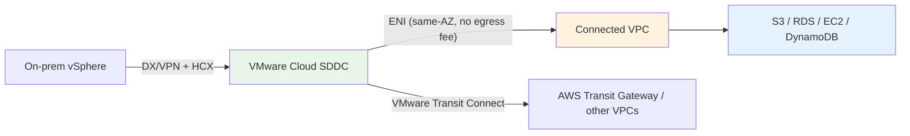
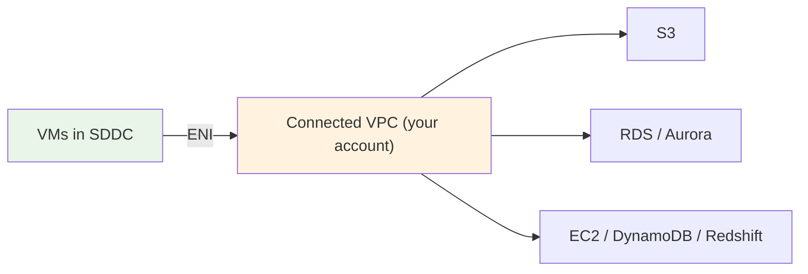
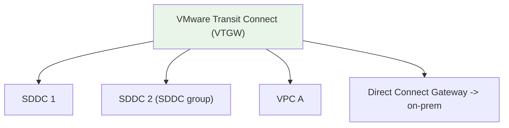
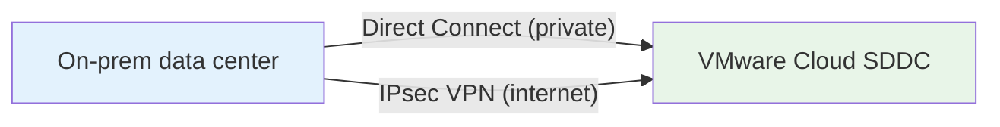
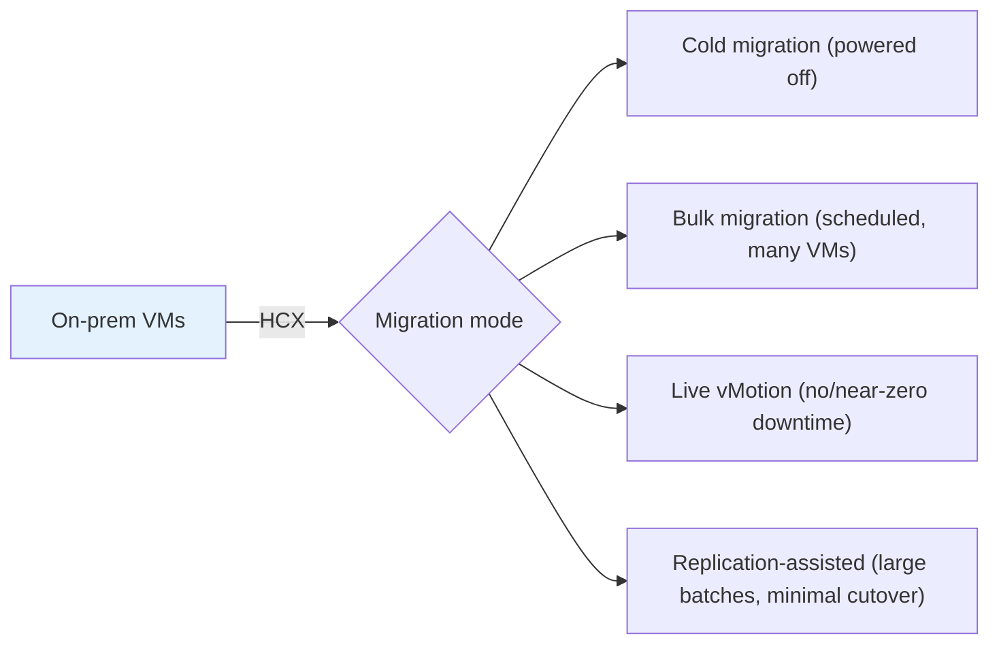
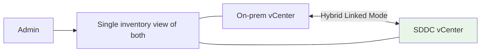
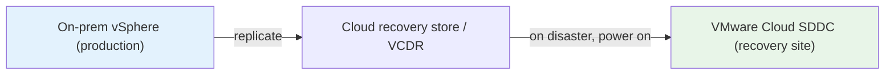
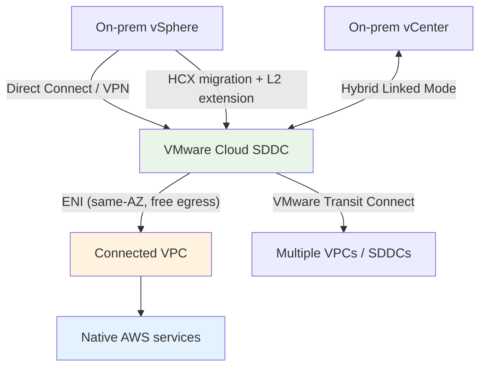

# VMware Cloud on AWS - Networking, Migration & Integration Deep Dive

> The connectivity and movement story: the **native-AWS ENI**, the **connected VPC**, **VMware Transit Connect (VTGW)**, **on-prem links (Direct Connect / VPN)**, **HCX migration** (live/bulk/cold), **Hybrid Linked Mode**, and **disaster-recovery** options. These are the "how do VMs reach S3/RDS", "how do I migrate with no downtime", and "how do I use VMC for DR" exam questions.

See also: [01 - VMware Cloud on AWS Intro](01%20-%20VMware%20Cloud%20on%20AWS%20Intro.md) · [02 - VMware Cloud Architecture Deep Dive](02%20-%20VMware%20Cloud%20Architecture%20Deep%20Dive.md) · [04 - VMware Cloud Examples & Patterns](04%20-%20VMware%20Cloud%20Examples%20%26%20Patterns.md) · [05 - VMware Cloud Scenario Questions](05%20-%20VMware%20Cloud%20Scenario%20Questions.md) · [06 - VMware Cloud Important Facts & Cheat Sheet](06%20-%20VMware%20Cloud%20Important%20Facts%20%26%20Cheat%20Sheet.md)

---

## Table of Contents

- [Part 1: The Native-AWS ENI & Connected VPC](#part-1-the-native-aws-eni--connected-vpc)
- [Part 2: VMware Transit Connect (VTGW)](#part-2-vmware-transit-connect-vtgw)
- [Part 3: Connecting to On-Premises (Direct Connect & VPN)](#part-3-connecting-to-on-premises-direct-connect--vpn)
- [Part 4: Migration with VMware HCX](#part-4-migration-with-vmware-hcx)
- [Part 5: Hybrid Linked Mode](#part-5-hybrid-linked-mode)
- [Part 6: Integrating with Native AWS Services](#part-6-integrating-with-native-aws-services)
- [Part 7: Disaster Recovery Options](#part-7-disaster-recovery-options)
- [Part 8: The Complete Connectivity Picture](#part-8-the-complete-connectivity-picture)
- [Summary](#summary)

---

---

## Part 1: The Native-AWS ENI & Connected VPC

When you deploy an SDDC you link it to a **customer-owned VPC** (the **connected VPC**) through a **high-bandwidth, low-latency Elastic Network Interface (ENI)**.

| Property      | Detail                                                                         |
| :------------ | :----------------------------------------------------------------------------- |
| Path          | Private (no public internet)                                                   |
| Performance   | **High-bandwidth, low-latency**                                                |
| Cost          | **No data egress charge** when SDDC and the AWS service are in the **same AZ** |
| Placement tip | Put the SDDC in the **same AZ** as the services it talks to most               |

> **Exam nugget:** The **ENI to the connected VPC** is the private, fast path from VMware VMs to **native AWS services** — and it's **free of egress charges within the same AZ**. This is the key cost/perf reason to align the SDDC AZ with your AWS services.

[⬆ Back to top](#table-of-contents)

---

## Part 2: VMware Transit Connect (VTGW)

For connecting an SDDC to **multiple VPCs, multiple SDDCs, or on-prem at scale**, VMware Cloud offers **Transit Connect**, backed by a **VMware-managed Transit Gateway (VTGW)**.

| Use Transit Connect when...                 | Why                                          |
| :------------------------------------------ | :------------------------------------------- |
| You have **multiple SDDCs** (an SDDC group) | High-bandwidth interconnect between them     |
| You must reach **many VPCs**                | Hub-and-spoke routing like a Transit Gateway |
| You aggregate **on-prem connectivity**      | Attach a Direct Connect Gateway              |

> **Exam nugget:** **VMware Transit Connect (VTGW)** is the scalable, Transit-Gateway-style hub for **SDDC-to-VPC, SDDC-to-SDDC, and SDDC-to-on-prem** connectivity. A single connected-VPC ENI suffices for simple cases; VTGW is for **scale / multiple SDDCs**.

[⬆ Back to top](#table-of-contents)

---

## Part 3: Connecting to On-Premises (Direct Connect & VPN)

To bridge your existing data center and the SDDC:

| Option                             | Characteristics                                                                                                   |
| :--------------------------------- | :---------------------------------------------------------------------------------------------------------------- |
| **AWS Direct Connect**             | Private, dedicated, **consistent low latency/high bandwidth** — preferred for migration and steady hybrid traffic |
| **IPsec VPN**                      | Over the internet; quick to set up; good for lower-bandwidth or backup paths                                      |
| **Route-based / policy-based VPN** | Supported via NSX edge                                                                                            |

> **Exam nugget:** For **large migrations** and **predictable performance**, use **Direct Connect**; VPN is the quicker/cheaper or backup option. HCX rides over either.

[⬆ Back to top](#table-of-contents)

---

## Part 4: Migration with VMware HCX

**VMware HCX** is the migration engine that moves VMs from on-prem vSphere to the SDDC (and back), securely over DX/VPN.

| HCX mode                       | Downtime        | Best for                                  |
| :----------------------------- | :-------------- | :---------------------------------------- |
| **Cold migration**             | VM powered off  | Non-critical VMs                          |
| **Bulk migration**             | Brief cutover   | Migrating **many VMs** on a schedule      |
| **Live vMotion**               | **Near-zero**   | Critical VMs needing **no downtime**      |
| **Replication-Assisted (RAV)** | Minimal cutover | **Large-scale** batches with low downtime |

Other HCX capabilities:

- **Network Extension (L2)** — stretch on-prem VLANs into the SDDC so **VMs keep their IP addresses** during migration (no re-IP).
- **WAN optimization** and encryption for efficient, secure transfer.

> **Exam nugget:** "Migrate **many VMs to AWS with little/no downtime and without changing IPs**" → **VMware HCX** (bulk/vMotion + **L2 Network Extension**). HCX is the go-to migration answer for VMware Cloud on AWS.

[⬆ Back to top](#table-of-contents)

---

## Part 5: Hybrid Linked Mode

**Hybrid Linked Mode** links your **on-prem vCenter** with the **cloud SDDC vCenter** so you manage **both environments from a single pane of glass**.

- One inventory, consistent roles/permissions across on-prem and cloud.
- Simplifies operations during a **phased migration** (manage source and target together).

> **Exam nugget:** **Hybrid Linked Mode** = **single-pane-of-glass** management across on-prem and cloud vCenters. It's about _management visibility_, not data movement (that's HCX).

[⬆ Back to top](#table-of-contents)

---

## Part 6: Integrating with Native AWS Services

Once VMs are in the SDDC, they can consume native AWS services over the **ENI** for incremental modernization:

| Native service                   | How VMC uses it                                 |
| :------------------------------- | :---------------------------------------------- |
| **Amazon S3**                    | Object storage, backups, data lake landing      |
| **Amazon RDS / Aurora**          | Offload databases from VMs to managed databases |
| **Amazon EC2 / Auto Scaling**    | Burst stateless tiers natively alongside VMs    |
| **Amazon FSx**                   | File storage for VM workloads                   |
| **DynamoDB / Redshift / Lambda** | Add modern serverless/analytics components      |
| **CloudWatch / IAM / KMS**       | Monitoring, access control, encryption keys     |

> **Exam nugget:** The pattern is **"migrate first, modernize later."** Land VMs in VMC, then offload pieces to managed AWS services (RDS, S3, Lambda) over the **same-AZ ENI** without re-architecting everything up front.

[⬆ Back to top](#table-of-contents)

---

## Part 7: Disaster Recovery Options

VMware Cloud on AWS is a strong **DR target** for on-prem vSphere — no need to build a second physical DR site.

| Option                                    | What it is                                                                                    | Model                                        |
| :---------------------------------------- | :-------------------------------------------------------------------------------------------- | :------------------------------------------- |
| **VMware Cloud Disaster Recovery (VCDR)** | On-demand DR with an efficient cloud backup/recovery store; spin up SDDC capacity when needed | **Pilot-light / on-demand** — cost-efficient |
| **VMware Site Recovery (SRM)**            | Site Recovery Manager-based orchestrated failover/failback between sites                      | Classic DR orchestration                     |

> **Exam nugget:** "Use AWS as a **DR site for our VMware workloads** without building a second data center" → **VMware Cloud DR** (on-demand/pilot-light) or **VMware Site Recovery (SRM)**.

[⬆ Back to top](#table-of-contents)

---

## Part 8: The Complete Connectivity Picture

| Connection                 | Purpose                                        |
| :------------------------- | :--------------------------------------------- |
| **Direct Connect / VPN**   | On-prem ↔ SDDC data path                       |
| **HCX**                    | Migrate VMs (live/bulk/cold) + extend L2       |
| **Hybrid Linked Mode**     | Unified vCenter management                     |
| **ENI / connected VPC**    | Private, fast, same-AZ-free path to native AWS |
| **Transit Connect (VTGW)** | Scale to many VPCs/SDDCs/on-prem               |

[⬆ Back to top](#table-of-contents)

---

## Summary

- The SDDC connects to a **connected VPC** via a **high-bandwidth, low-latency ENI**; same-AZ traffic to native AWS has **no egress charge** — align the SDDC AZ with your AWS services.
- **VMware Transit Connect (VTGW)** scales connectivity across **multiple VPCs/SDDCs/on-prem** (Transit-Gateway-style hub).
- On-prem links via **Direct Connect** (preferred, consistent) or **VPN**.
- **VMware HCX** migrates VMs (**cold / bulk / live vMotion / RAV**) and **extends L2** so VMs keep their IPs; **Hybrid Linked Mode** gives single-pane management.
- VMC is a strong **DR target** via **VMware Cloud DR** (on-demand/pilot-light) or **VMware Site Recovery (SRM)**; modernize via native AWS over the ENI.

> Next: [04 - VMware Cloud Examples & Patterns](04%20-%20VMware%20Cloud%20Examples%20%26%20Patterns.md) — migration, DR, burst, and modernization architectures end to end.
