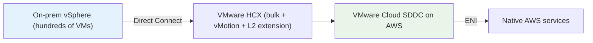
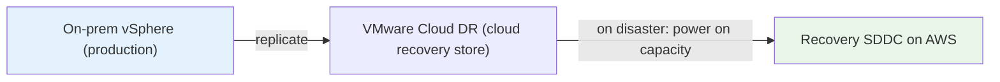
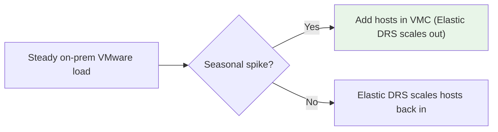
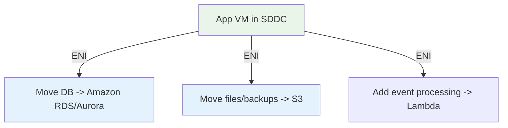
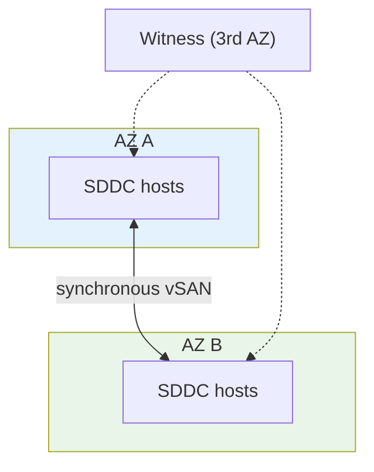
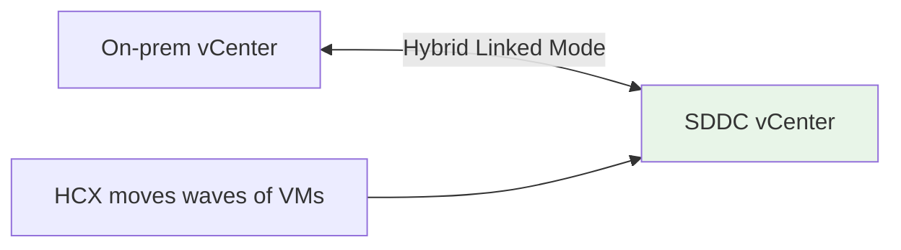

# VMware Cloud on AWS - Examples & Patterns

> End-to-end architectures the exam draws from: **data-center evacuation/migration**, **disaster recovery to the cloud**, **on-demand burst capacity**, **app modernization in place**, and **AZ-resilient production**. Each pattern names the building blocks and the "why VMC" an exam answer would use.

See also: [01 - VMware Cloud on AWS Intro](01%20-%20VMware%20Cloud%20on%20AWS%20Intro.md) · [02 - VMware Cloud Architecture Deep Dive](02%20-%20VMware%20Cloud%20Architecture%20Deep%20Dive.md) · [03 - VMware Cloud Networking, Migration & Integration Deep Dive](03%20-%20VMware%20Cloud%20Networking%2C%20Migration%20%26%20Integration%20Deep%20Dive.md) · [05 - VMware Cloud Scenario Questions](05%20-%20VMware%20Cloud%20Scenario%20Questions.md) · [06 - VMware Cloud Important Facts & Cheat Sheet](06%20-%20VMware%20Cloud%20Important%20Facts%20%26%20Cheat%20Sheet.md)

---

## Table of Contents

- [Pattern 1: Data Center Evacuation / Migration](#pattern-1-data-center-evacuation--migration)
- [Pattern 2: Disaster Recovery to the Cloud](#pattern-2-disaster-recovery-to-the-cloud)
- [Pattern 3: On-Demand Burst Capacity](#pattern-3-on-demand-burst-capacity)
- [Pattern 4: Modernize In Place (Migrate First, Then Refactor)](#pattern-4-modernize-in-place-migrate-first-then-refactor)
- [Pattern 5: AZ-Resilient Production with Stretched Clusters](#pattern-5-az-resilient-production-with-stretched-clusters)
- [Pattern 6: Hybrid Operations During a Phased Migration](#pattern-6-hybrid-operations-during-a-phased-migration)
- [Anti-Patterns](#anti-patterns)

---

## Pattern 1: Data Center Evacuation / Migration

A retailer must **exit its on-prem data center** within a tight deadline but can't re-platform hundreds of VMware VMs.

**Building blocks:** Direct Connect → **HCX** (bulk migration + **L2 Network Extension** so VMs keep IPs) → SDDC.

**Why VMC:** lift-and-shift **as-is**, no VM conversion, same vCenter tooling, **minimal downtime** — the fastest low-risk path off the on-prem floor.

[⬆ Back to top](#table-of-contents)

---

## Pattern 2: Disaster Recovery to the Cloud

A company wants a DR site for its VMware production **without building/maintaining a second physical data center**.

**Building blocks:** **VMware Cloud DR** (on-demand / pilot-light) or **VMware Site Recovery (SRM)** for orchestrated failover/failback.

**Why VMC:** cloud DR target with **pilot-light economics** — pay for full SDDC capacity mainly during a real failover/test, not 24/7.

[⬆ Back to top](#table-of-contents)

---

## Pattern 3: On-Demand Burst Capacity

A business has seasonal spikes and doesn't want to buy on-prem hardware sized for the peak.

**Building blocks:** SDDC + **Elastic DRS** auto host scaling; **Hybrid Linked Mode** to manage both sides.

**Why VMC:** absorb peaks in AWS with the **same operating model**; **Elastic DRS** right-sizes host count so you don't pay for idle peak capacity.

[⬆ Back to top](#table-of-contents)

---

## Pattern 4: Modernize In Place (Migrate First, Then Refactor)

A team migrates monolithic VMs, then incrementally offloads components to managed AWS services.

**Building blocks:** SDDC VMs + **same-AZ ENI** to RDS, S3, Lambda, DynamoDB.

**Why VMC:** decouple modernization from migration — land fast, then refactor piece by piece over the **free same-AZ ENI** without a big-bang rewrite.

[⬆ Back to top](#table-of-contents)

---

## Pattern 5: AZ-Resilient Production with Stretched Clusters

A production workload must survive a full **Availability Zone** outage.

**Building blocks:** **Stretched cluster** across two AZs (synchronous vSAN) + a witness; vSphere HA.

**Why VMC:** **stretched clusters** deliver **AZ-level fault tolerance** for VMware workloads — the answer when "host-level HA" isn't enough.

[⬆ Back to top](#table-of-contents)

---

## Pattern 6: Hybrid Operations During a Phased Migration

While migrating over months, ops teams need one view of on-prem and cloud.

**Building blocks:** **Hybrid Linked Mode** (single pane) + **HCX** migration waves + **Transit Connect** if many VPCs/SDDCs.

**Why VMC:** consistent management and gradual cutover instead of a risky single migration event.

[⬆ Back to top](#table-of-contents)

---

## Anti-Patterns

| Anti-pattern                                                          | Why it's wrong                        | Better                                         |
| :-------------------------------------------------------------------- | :------------------------------------ | :--------------------------------------------- |
| Choosing VMC when you'll **convert VMs to native EC2** anyway         | Pays for VMware stack you won't keep  | **Rehost to EC2 with AWS MGN**                 |
| Choosing VMC to run **AWS services in your own data center**          | VMC hardware is in **AWS** facilities | **AWS Outposts**                               |
| Relying on **vSphere HA alone** for **AZ** resilience                 | HA only covers host failure           | **Stretched cluster** across 2 AZs             |
| Putting the SDDC in a **different AZ** than the AWS services it calls | Cross-AZ egress charges + latency     | Co-locate SDDC and services in the **same AZ** |
| Hand-migrating VMs with downtime                                      | Slow, risky, re-IP pain               | **HCX** bulk/vMotion + **L2 extension**        |

[⬆ Back to top](#table-of-contents)

---

> Next: [05 - VMware Cloud Scenario Questions](05%20-%20VMware%20Cloud%20Scenario%20Questions.md) — exam-style questions with full reasoning and distractor analysis.
