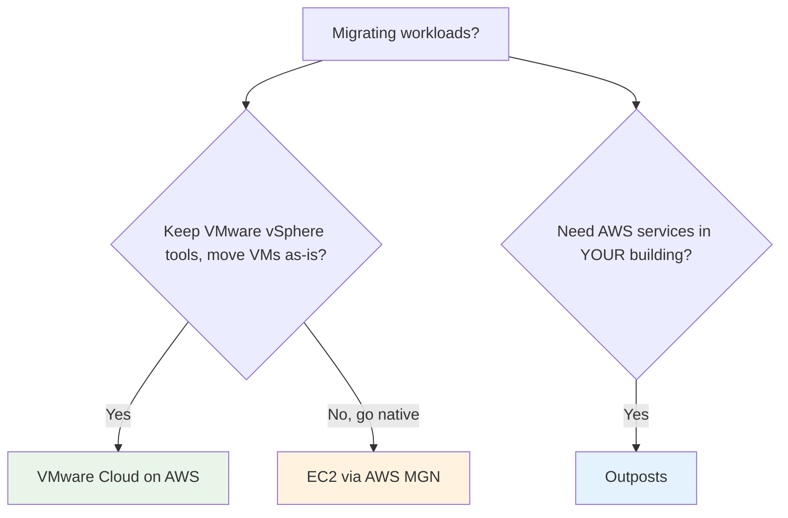

# VMware Cloud on AWS - Important Facts & Cheat Sheet

> One-page cram: high-yield facts, gotchas, comparison tables, and trigger words for SAA-C03. If you review only one VMware Cloud file before the exam, make it this one.

See also: [01 - VMware Cloud on AWS Intro](01%20-%20VMware%20Cloud%20on%20AWS%20Intro.md) · [02 - VMware Cloud Architecture Deep Dive](02%20-%20VMware%20Cloud%20Architecture%20Deep%20Dive.md) · [03 - VMware Cloud Networking, Migration & Integration Deep Dive](03%20-%20VMware%20Cloud%20Networking%2C%20Migration%20%26%20Integration%20Deep%20Dive.md) · [04 - VMware Cloud Examples & Patterns](04%20-%20VMware%20Cloud%20Examples%20%26%20Patterns.md) · [05 - VMware Cloud Scenario Questions](05%20-%20VMware%20Cloud%20Scenario%20Questions.md)

---

## The 12 facts most likely to be tested

1. **VMware Cloud on AWS = the VMware SDDC** (vSphere/ESXi + vSAN + NSX + vCenter) on **dedicated AWS bare-metal hosts** inside AWS Regions/AZs.
2. **Jointly engineered by VMware + AWS**; it's a **managed service** (VMware/AWS run the hardware + SDDC software lifecycle).
3. Core value: **lift-and-shift VMware VMs to AWS with no conversion/re-platforming**, keeping **the same tools and operating model**.
4. **The customer still owns** the **guest OS, applications, data, and backups**; **VMware/AWS patch ESXi/vCenter/vSAN/NSX and the hardware**.
5. **Native-AWS access via a high-bandwidth, low-latency ENI** to a **connected VPC** — **no egress charge in the same AZ**.
6. **VMware HCX** migrates VMs: **cold / bulk / live vMotion / replication-assisted**, plus **L2 Network Extension** (keep IPs, near-zero downtime).
7. **Hybrid Linked Mode** = **single-pane** management across on-prem and cloud vCenters.
8. **vSphere HA** covers **host** failure (in one AZ); **stretched clusters across two AZs** (synchronous vSAN) cover a **full-AZ** failure.
9. **Elastic DRS** auto-scales the **host count** of a cluster by utilization (cost/performance lever).
10. Connect on-prem via **Direct Connect** (preferred) or **VPN**; scale connectivity with **VMware Transit Connect (VTGW)**.
11. **DR target** via **VMware Cloud DR** (on-demand/pilot-light) or **VMware Site Recovery (SRM)**.
12. Pricing = **per dedicated host**, with **on-demand / 1-year / 3-year** commitments.

---

## VMC vs Outposts vs native EC2 (the big differentiator table)

| Aspect            | **VMware Cloud on AWS**           | **AWS Outposts**                          | **Native EC2 (rehost via MGN)** |
| :---------------- | :-------------------------------- | :---------------------------------------- | :------------------------------ |
| Hardware location | **AWS** data center               | **Your** data center                      | **AWS** data center             |
| Operating model   | **VMware tools** (vCenter)        | **AWS-native** on-prem                    | **AWS-native**                  |
| Migration effort  | **Lift-and-shift, no conversion** | n/a (extends AWS on-prem)                 | Convert VMs to EC2              |
| Pick when...      | Keep VMware, move to AWS fast     | AWS services **on-prem** / data residency | OK going fully native           |

---

## The SDDC stack (memorize)

| Component          | Layer      | Role                                                |
| :----------------- | :--------- | :-------------------------------------------------- |
| **vSphere / ESXi** | Compute    | Hypervisor for VMs                                  |
| **vSAN**           | Storage    | Hyper-converged software-defined storage            |
| **NSX**            | Network    | SDN + **micro-segmentation** + distributed firewall |
| **vCenter**        | Management | Single console (same as on-prem)                    |
| **HCX**            | Migration  | Move VMs (live/bulk/cold) + L2 extension            |

---

## Availability / resilience cheat sheet

| Failure to survive              | Mechanism                                             |
| :------------------------------ | :---------------------------------------------------- |
| **Host** failure (within an AZ) | **vSphere HA** restarts VMs                           |
| **Full AZ** failure             | **Stretched cluster** across 2 AZs (synchronous vSAN) |
| Performance balancing           | **vSphere DRS**                                       |
| Capacity fluctuation            | **Elastic DRS** (auto host scaling)                   |
| **Disaster** (whole site)       | **VMware Cloud DR** / **Site Recovery (SRM)**         |

---

## Connectivity cheat sheet

| Need                                 | Use                                                    |
| :----------------------------------- | :----------------------------------------------------- |
| VMs → native AWS (S3/RDS/...)        | **ENI** to **connected VPC** (same-AZ = no egress fee) |
| On-prem ↔ SDDC, large/steady         | **Direct Connect**                                     |
| On-prem ↔ SDDC, quick/backup         | **VPN**                                                |
| Many SDDCs/VPCs/on-prem at scale     | **VMware Transit Connect (VTGW)**                      |
| Migrate VMs (keep IPs, low downtime) | **HCX** (+ L2 Network Extension)                       |
| Unified vCenter management           | **Hybrid Linked Mode**                                 |

---

## Per-topic gotchas

| Topic                     | Gotcha                                                                      |
| :------------------------ | :-------------------------------------------------------------------------- |
| **Where it runs**         | **AWS** data centers (bare metal) — **not** your building (that's Outposts) |
| **Conversion**            | **No VM conversion** — keep VMware format/tools                             |
| **AZ HA**                 | vSphere HA ≠ AZ-resilient; need a **stretched cluster**                     |
| **Egress**                | Same-AZ ENI to AWS services = **free**; cross-AZ = charged                  |
| **Shared responsibility** | You still own **guest OS/app/data/backups**                                 |
| **Migration tool**        | **HCX** (+ L2 extension), not DataSync/DMS/Snowball                         |
| **DR economics**          | **VMware Cloud DR** = **pilot-light/on-demand**                             |
| **Scaling**               | Add **hosts** (Elastic DRS), not "instances"                                |

---

## Trigger-word → answer (final cram)

| Question says...                                        | Answer                            |
| :------------------------------------------------------ | :-------------------------------- |
| "Migrate **VMware vSphere** to AWS, **minimal change**" | **VMware Cloud on AWS**           |
| "AWS services **in our own data center**"               | **Outposts**                      |
| "**Convert** VMs to native EC2"                         | **AWS MGN** (not VMC)             |
| "Many VMs, **near-zero downtime**, keep IPs"            | **HCX** + **L2 extension**        |
| "Survive a **full AZ** outage"                          | **Stretched cluster (2 AZs)**     |
| "Tolerate only **host** failure"                        | **vSphere HA**                    |
| "VMs reach **S3/RDS** privately & cheaply"              | **ENI to connected VPC, same AZ** |
| "**Single pane** for both vCenters"                     | **Hybrid Linked Mode**            |
| "AWS as **DR site** for VMware (pilot-light)"           | **VMware Cloud DR** / **SRM**     |
| "Connect **many SDDCs/VPCs**"                           | **Transit Connect (VTGW)**        |
| "What **hardware**?"                                    | **Dedicated bare-metal hosts**    |
| "Auto-scale **host count**"                             | **Elastic DRS**                   |
| "Who patches the **hypervisor**?"                       | **VMware/AWS** (managed)          |

---

## Domain mapping recap

| Exam domain     | VMware Cloud on AWS angle                                                                                   |
| :-------------- | :---------------------------------------------------------------------------------------------------------- |
| Secure          | **NSX** micro-segmentation; private **ENI** (no internet); customer owns guest OS/app security              |
| Resilient       | **vSphere HA** (host) + **stretched clusters** (AZ) + **VMware Cloud DR/SRM** (disaster)                    |
| High-performing | Bare-metal performance; **high-bw, low-latency ENI**; **DRS** balancing                                     |
| Cost-optimized  | **1/3-yr commitments**, **Elastic DRS** right-sizing, **same-AZ free egress**, modernize to native services |

---

> Back to start: [01 - VMware Cloud on AWS Intro](01%20-%20VMware%20Cloud%20on%20AWS%20Intro.md)
