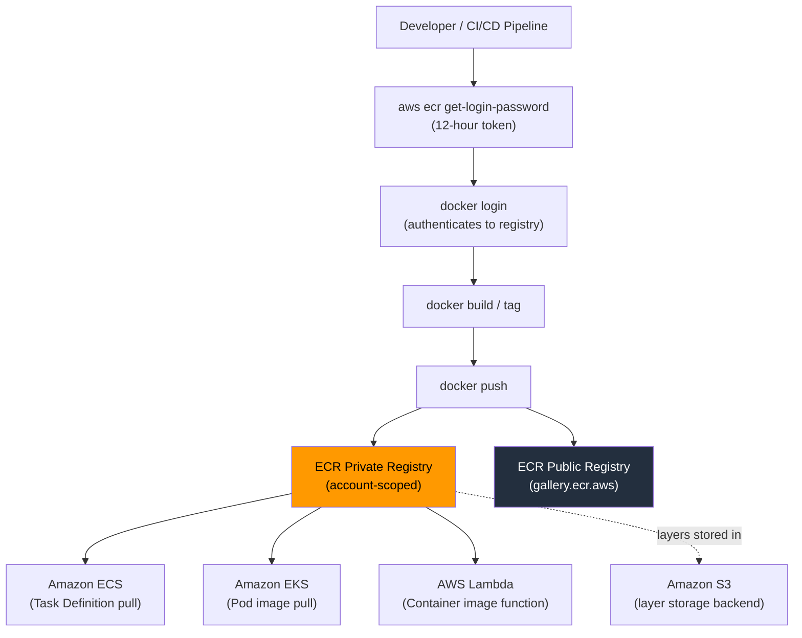

# ECR Fundamentals & Architecture - SAA-C03 Deep Dive

> Amazon ECR is a **fully managed, highly available container image registry** that stores, manages, and deploys OCI-compliant container images and artifacts — natively integrated with ECS, EKS, Lambda, and the broader AWS ecosystem.

See also: [02 - ECR Security, Encryption & Access](02%20-%20ECR%20Security%2C%20Encryption%20%26%20Access.md) · [03 - ECR Lifecycle Policies & Replication](03%20-%20ECR%20Lifecycle%20Policies%20%26%20Replication.md) · [04 - ECR Exam Scenarios & Q&A](04%20-%20ECR%20Exam%20Scenarios%20%26%20Q%26A.md)

---

## Table of Contents

- [What Is Amazon ECR?](#what-is-amazon-ecr)
- [Registry Types - Private vs Public](#registry-types---private-vs-public)
- [Core Concepts - Registry, Repository, Image, Tag](#core-concepts---registry-repository-image-tag)
- [Image Push & Pull Workflow](#image-push--pull-workflow)
- [Authentication - get-login-password Flow](#authentication---get-login-password-flow)
- [Immutable vs Mutable Tags](#immutable-vs-mutable-tags)
- [OCI Artifacts Support](#oci-artifacts-support)
- [Integration with AWS Compute Services](#integration-with-aws-compute-services)
- [Pricing Model Basics](#pricing-model-basics)
- [Regional Architecture](#regional-architecture)
- [Important Facts for SAA-C03](#important-facts-for-saa-c03)

---



---

## What Is Amazon ECR?

Amazon Elastic Container Registry (ECR) is a **fully managed container image registry** service that makes it easy to store, manage, share, and deploy container images and OCI (Open Container Initiative) artifacts.

### Key Service Characteristics

| Attribute         | Detail                                                         |
| :---------------- | :------------------------------------------------------------- |
| **Type**          | Managed PaaS (no infrastructure to manage)                     |
| **Availability**  | 99.9% SLA; data stored redundantly across multiple AZs         |
| **Standards**     | OCI Image Spec + Docker Image Manifest V2, Schema 2            |
| **Storage**       | Image layers backed by Amazon S3 (managed by AWS)              |
| **Protocol**      | HTTPS only; TLS in transit                                     |
| **Compression**   | Layers stored compressed (gzip)                                |
| **Deduplication** | Shared layers stored once per repository; no redundant storage |

### Why ECR Instead of Self-Hosted?

- No registry infrastructure to patch or scale
- Native AWS IAM integration — no separate user database
- Built-in image scanning (Basic and Enhanced via Amazon Inspector)
- Direct pull by ECS task scheduler, EKS kubelet, and Lambda without extra credentials configuration when using proper IAM roles

---

## Registry Types - Private vs Public

### Private Registry

- **One private registry per AWS account per region** (automatically created)
- URI format: `<account-id>.dkr.ecr.<region>.amazonaws.com`
- Access controlled by **IAM + repository policies**
- Supports cross-account and cross-region replication
- Supports **pull through cache** rules

### Public Registry

- **Single global public registry**: `public.ecr.aws`
- Hosted at `gallery.ecr.aws` (ECR Public Gallery — publicly browsable)
- **Any unauthenticated user** can pull images (no auth required for reads)
- Publishing requires an AWS account and IAM authentication
- Rate limits: unauthenticated = 1 pull/sec; authenticated AWS account = higher limits; authenticated in us-east-1 = highest limits
- Use case: distributing open-source or community images (e.g., AWS-published base images)

| Feature                | Private Registry             | Public Registry            |
| :--------------------- | :--------------------------- | :------------------------- |
| **Visibility**         | Account-scoped               | Globally public            |
| **Auth to pull**       | Required (IAM/token)         | Not required               |
| **Replication**        | Cross-region + cross-account | N/A                        |
| **Lifecycle policies** | Yes                          | No                         |
| **Image scanning**     | Basic + Enhanced             | Basic only                 |
| **Pull through cache** | Yes                          | N/A                        |
| **Cost**               | Storage + data transfer      | Storage (first 50 GB free) |

---

## Core Concepts - Registry, Repository, Image, Tag

### Hierarchy

```
Account (one private registry per region)
  └── Repository (e.g., myapp/backend)
        └── Image Manifest (identified by digest SHA-256)
              └── Tag (human-readable alias, e.g., "latest", "v1.2.3")
```

### Repository

- Logical grouping of related container images
- Full URI: `<account-id>.dkr.ecr.<region>.amazonaws.com/<repo-name>`
- Repo names support `/` namespacing: `myorg/myteam/myapp`
- Each repo has its own **repository policy** (resource-based)
- Settings per repo: tag immutability, scan on push, encryption

### Image

- Uniquely identified by its **content-addressable digest** (SHA-256 hash of manifest)
- A single image digest can have zero, one, or many tags
- Stored as **layers** (each layer is a compressed tar archive) + a manifest JSON
- Multi-architecture images supported via **image index manifests** (OCI image index / Docker manifest list)

### Tag

- Human-readable pointer to an image manifest
- Tags are **mutable by default** (can be reassigned); can be made **immutable** per repository
- Special tag `:latest` is just a convention — not automatically updated by ECR

### Image Digest

- Format: `sha256:<64-hex-chars>`
- **Immutable by nature** — the SHA-256 of the manifest content
- Pull by digest for guaranteed reproducibility: `docker pull <uri>@sha256:<digest>`

---

## Image Push & Pull Workflow

### Push Workflow (Step by Step)

```bash
# 1. Authenticate Docker to the private registry
aws ecr get-login-password --region us-east-1 \
  | docker login --username AWS \
    --password-stdin 123456789012.dkr.ecr.us-east-1.amazonaws.com

# 2. Build your image locally
docker build -t myapp:v1.0 .

# 3. Tag with full ECR URI
docker tag myapp:v1.0 \
  123456789012.dkr.ecr.us-east-1.amazonaws.com/myapp:v1.0

# 4. Push
docker push 123456789012.dkr.ecr.us-east-1.amazonaws.com/myapp:v1.0
```

### Pull Workflow

```bash
# Authenticate (same token as push)
aws ecr get-login-password --region us-east-1 \
  | docker login --username AWS \
    --password-stdin 123456789012.dkr.ecr.us-east-1.amazonaws.com

# Pull by tag
docker pull 123456789012.dkr.ecr.us-east-1.amazonaws.com/myapp:v1.0

# Pull by digest (more reliable — immune to tag reassignment)
docker pull 123456789012.dkr.ecr.us-east-1.amazonaws.com/myapp@sha256:abc123...
```

### Layer Deduplication on Push

When you push an image, the Docker client checks each layer against what ECR already has. Layers already present are skipped with `Layer already exists` — you only upload new or changed layers. This is why pushing a small code change is fast even for large images.

---

## Authentication - get-login-password Flow

ECR uses a short-lived token system rather than long-lived passwords.

### Token Mechanics

| Property         | Value                                      |
| :--------------- | :----------------------------------------- |
| **Command**      | `aws ecr get-login-password`               |
| **Token type**   | Base64-encoded bearer token                |
| **Username**     | Always literally `AWS`                     |
| **Expiry**       | **12 hours** from issuance                 |
| **Scope**        | One region, one account (private registry) |
| **IAM required** | `ecr:GetAuthorizationToken` permission     |

### How the Token Is Obtained

```bash
# The modern approach (outputs only the password, pipes cleanly)
aws ecr get-login-password --region <region>

# The legacy approach (deprecated, creates docker login command)
# aws ecr get-login --no-include-email   <-- DO NOT USE IN NEW SCRIPTS
```

### CI/CD Token Refresh Pattern

Because the token expires in 12 hours, CI/CD pipelines must re-authenticate at the start of each job or use a pattern like:

```bash
# In a GitHub Actions workflow step:
- name: Login to Amazon ECR
  uses: aws-actions/amazon-ecr-login@v2
```

The `amazon-ecr-login` action automatically calls `get-login-password` and runs `docker login`.

### ECS/EKS/Lambda — No Explicit Token Needed

When the **task execution role** (ECS), **node instance role** (EKS), or **function execution role** (Lambda) has `ecr:GetAuthorizationToken` + `ecr:BatchGetImage` + `ecr:GetDownloadUrlForLayer`, AWS handles authentication transparently — you never write credentials to the container runtime.

> **Exam Trap:** The question may say "the ECS task cannot pull the image." The fix is almost always granting `ecr:GetAuthorizationToken`, `ecr:BatchGetImage`, and `ecr:GetDownloadUrlForLayer` to the **task execution role** (not the task role).

---

## Immutable vs Mutable Tags

### Mutable Tags (Default)

- A tag like `:latest` can be **overwritten** by pushing a new image with the same tag
- Risk: A deployment that references `:latest` may pull a different image than expected
- Suitable for: development environments, rapid iteration

### Immutable Tags

- Once a tag is pushed to a repository with immutability enabled, **any attempt to push the same tag again returns an error**
- Enforcement is at the repository level (not the tag level)
- Configured via: Console → Repository → Edit → Image tag mutability = IMMUTABLE

```bash
# Enable immutability via CLI
aws ecr put-image-tag-mutability \
  --repository-name myapp \
  --image-tag-mutability IMMUTABLE
```

| Scenario                      | Mutable                         | Immutable                                            |
| :---------------------------- | :------------------------------ | :--------------------------------------------------- |
| Push `:v1.0` twice            | Second push silently overwrites | Second push returns `ImageTagAlreadyExistsException` |
| Production deployments        | Risky (silent overwrites)       | Recommended (guarantees reproducibility)             |
| Dev/test iteration            | Convenient                      | Can be annoying                                      |
| Compliance/audit requirements | Fails                           | Passes                                               |

> **Exam Tip:** Questions about ensuring a **specific image version always deploys** → enable immutable tags + reference by digest or immutable tag.

---

## OCI Artifacts Support

ECR stores more than just container images. Any OCI-compliant artifact can be stored:

| Artifact Type                         | Use Case                                |
| :------------------------------------ | :-------------------------------------- |
| **Container images**                  | Standard Docker / OCI images            |
| **Helm charts**                       | Kubernetes application packaging        |
| **WASM modules**                      | WebAssembly binaries                    |
| **Sigstore signatures**               | Image signing (Cosign)                  |
| **SBOM (Software Bill of Materials)** | Supply chain security (CycloneDX, SPDX) |
| **OPA policies**                      | Open Policy Agent bundles               |

Helm push/pull example:

```bash
# Push a Helm chart to ECR
helm push mychart-0.1.0.tgz \
  oci://123456789012.dkr.ecr.us-east-1.amazonaws.com/helm-charts
```

---

## Integration with AWS Compute Services

### ECR + Amazon ECS

- Task definition specifies the full ECR image URI
- ECS **task execution role** pulls the image before container starts
- Supports both EC2 launch type and Fargate
- Fargate requires the image to be in ECR (or a public registry) — private Docker Hub requires credentials via Secrets Manager

### ECR + Amazon EKS

- Pod spec references the ECR URI in `spec.containers[].image`
- Node group instance profile (EC2 nodes) or IRSA pod role must have ECR pull permissions
- Amazon EKS add-ons (CoreDNS, kube-proxy, VPC CNI) are distributed via ECR

### ECR + AWS Lambda

- Lambda supports container image functions (up to 10 GB)
- Image must be in **the same account's ECR** (no cross-account by default without resource policy)
- Lambda pulls the image on cold start; cached for subsequent invocations
- ECR URI set in the Lambda function configuration

### ECR + AWS CodePipeline / CodeBuild

- CodeBuild has a native `ECR` source stage type — no manual auth script needed
- The CodeBuild service role needs `ecr:GetAuthorizationToken` + repo permissions

```yaml
# buildspec.yml login step (alternative to service role auto-auth)
pre_build:
  commands:
    - aws ecr get-login-password --region $AWS_DEFAULT_REGION
      | docker login --username AWS --password-stdin $ECR_REGISTRY
```

---

## Pricing Model Basics

| Component                                    | Pricing                                                  |
| :------------------------------------------- | :------------------------------------------------------- |
| **Storage (private)**                        | $0.10/GB-month (after 500 MB free per account per month) |
| **Data transfer IN**                         | Free                                                     |
| **Data transfer OUT (same region)**          | Free (e.g., pull from ECS in same region)                |
| **Data transfer OUT (cross-region)**         | Standard EC2 data transfer rates                         |
| **Data transfer OUT (internet)**             | Standard EC2 internet data transfer rates                |
| **Public registry storage**                  | First 50 GB/month free; $0.10/GB after                   |
| **Public registry transfer (authenticated)** | Free up to 500 GB/month from us-east-1                   |
| **Image scanning (Basic)**                   | Free                                                     |
| **Image scanning (Enhanced/Inspector)**      | Amazon Inspector charges apply                           |

> **Cost Optimization Tip:** Use lifecycle policies to automatically delete old/untagged images. Without lifecycle policies, storage costs accumulate silently.

---

## Regional Architecture

- ECR is a **regional service** — each region has its own endpoint
- Images are stored in the region where the repository is created
- For global deployments, use **cross-region replication** to replicate to target regions
- Private registry endpoint per region: `<account-id>.dkr.ecr.<region>.amazonaws.com`
- ECR supports **VPC interface endpoints** (AWS PrivateLink) so ECS/EKS can pull without traversing the public internet

### Available Endpoints (for PrivateLink)

| Endpoint                         | Purpose                                     |
| :------------------------------- | :------------------------------------------ |
| `com.amazonaws.<region>.ecr.api` | ECR API calls (GetAuthorizationToken, etc.) |
| `com.amazonaws.<region>.ecr.dkr` | Docker registry protocol (push/pull)        |
| `com.amazonaws.<region>.s3`      | S3 Gateway endpoint for layer downloads     |

> **Important:** You need **both** the `ecr.api` and `ecr.dkr` interface endpoints **plus** an **S3 gateway endpoint** for fully private ECR access from a VPC. Missing the S3 endpoint causes pulls to fail because image layers are fetched from S3.

---

## Important Facts for SAA-C03

| Fact                                                    | Why It Matters                                                         |
| :------------------------------------------------------ | :--------------------------------------------------------------------- |
| **One private registry per account per region**         | Cross-account sharing requires repository policies or replication      |
| **Auth token valid for 12 hours**                       | CI/CD jobs must refresh; cannot use static credentials                 |
| **ECS task execution role** pulls images                | Task role is for app permissions; execution role is for infrastructure |
| **Immutable tags prevent overwrites**                   | Key for compliance and reproducible deployments                        |
| **S3 gateway endpoint required for private pulls**      | Common VPC networking trap                                             |
| **ECR Public is global, Private is regional**           | Replication needed for multi-region private image availability         |
| **Layer deduplication**                                 | Storage cost is per unique layer, not per tag                          |
| **Lambda container images must be in same account ECR** | Without explicit cross-account resource policy                         |
| **10 GB max image size for Lambda**                     | Larger images rejected                                                 |

[⬆ Back to top](#table-of-contents)
