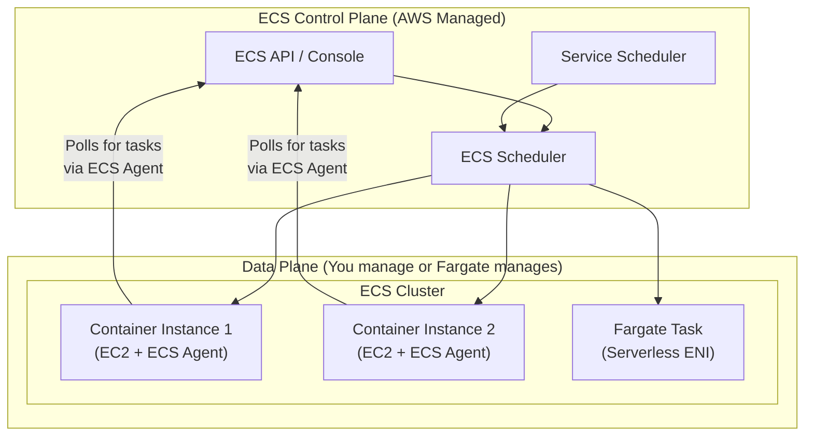
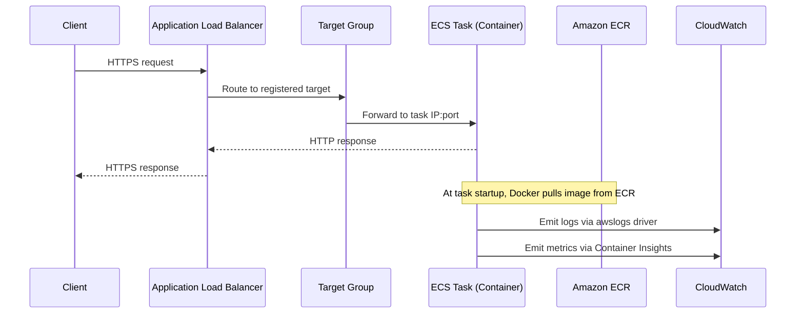

# ECS Fundamentals & Architecture - SAA-C03 Deep Dive

> Amazon ECS is AWS's fully managed container orchestration service — a control plane that schedules, runs, and manages Docker containers on a cluster of resources you define, without the operational overhead of running Kubernetes yourself.

See also: [02 - ECS Launch Types - EC2 vs Fargate](02%20-%20ECS%20Launch%20Types%20-%20EC2%20vs%20Fargate.md) · [03 - ECS Task Definitions, Tasks & Services](03%20-%20ECS%20Task%20Definitions%2C%20Tasks%20%26%20Services.md) · [04 - ECS Networking & Load Balancing](04%20-%20ECS%20Networking%20%26%20Load%20Balancing.md) · [05 - ECS IAM & Security](05%20-%20ECS%20IAM%20%26%20Security.md) · [06 - ECS Auto Scaling & Capacity](06%20-%20ECS%20Auto%20Scaling%20%26%20Capacity.md) · [07 - ECS Storage, Logging & Observability](07%20-%20ECS%20Storage%2C%20Logging%20%26%20Observability.md) · [08 - ECS Exam Scenarios & Q&A](08%20-%20ECS%20Exam%20Scenarios%20%26%20Q%26A.md) · [01 - ECR Fundamentals & Architecture](01%20-%20ECR%20Fundamentals%20%26%20Architecture.md) · [01 - EKS Fundamentals & Architecture](01%20-%20EKS%20Fundamentals%20%26%20Architecture.md) · [01 - ECS Anywhere Fundamentals & Architecture](01%20-%20ECS%20Anywhere%20Fundamentals%20%26%20Architecture.md)

---

## Table of Contents

- [What is Amazon ECS?](#what-is-amazon-ecs)
- [ECS Architecture: Control Plane vs Data Plane](#ecs-architecture-control-plane-vs-data-plane)
- [ECS Clusters](#ecs-clusters)
- [Container Instances & the ECS Agent](#container-instances--the-ecs-agent)
- [Tasks vs Services: The Core Abstractions](#tasks-vs-services-the-core-abstractions)
- [ECS vs Kubernetes: When to Choose What](#ecs-vs-kubernetes-when-to-choose-what)
- [High-Level Request Flow](#high-level-request-flow)
- [Key Terms Cheat Sheet](#key-terms-cheat-sheet)

---



---

## What is Amazon ECS?

Amazon Elastic Container Service (ECS) is a **fully managed container orchestration service** that lets you run Docker containers at scale without managing orchestration software.

### The One-Line Mental Model

> ECS = a smart scheduler that says "run container X, put it somewhere in my cluster, keep N copies alive, restart it if it dies."

### Core Value Propositions

| Benefit                             | Detail                                                               |
| :---------------------------------- | :------------------------------------------------------------------- |
| **No orchestration infrastructure** | AWS runs the control plane — no etcd, no API servers to patch        |
| **Deep AWS integration**            | Native IAM, ALB/NLB, CloudWatch, Secrets Manager, ECR, VPC           |
| **Two compute models**              | EC2 (you manage servers) or Fargate (AWS manages servers)            |
| **Simpler than Kubernetes**         | Fewer abstractions, faster learning curve, same container primitives |
| **Proven at scale**                 | Runs Amazon.com workloads; production-hardened                       |

### What ECS is NOT

- It is **not** a container registry (that is [01 - ECR Fundamentals & Architecture](01%20-%20ECR%20Fundamentals%20%26%20Architecture.md))
- It is **not** Kubernetes (no CRDs, Helm charts, or Operators natively)
- It is **not** a build system (use CodeBuild or a CI pipeline to build images)

---

[⬆ Back to top](#table-of-contents)

---

## ECS Architecture: Control Plane vs Data Plane

Understanding this split is critical for both the exam and real-world use.

### Control Plane (Always AWS-Managed)

The ECS control plane is a **fully managed, regional service** run by AWS. You never see, patch, or pay for its infrastructure directly.

| Component               | Responsibility                                         |
| :---------------------- | :----------------------------------------------------- |
| **ECS API**             | Accepts all API/SDK/console calls                      |
| **Task Scheduler**      | Decides which cluster resource runs which task         |
| **Service Scheduler**   | Maintains desired service count, triggers replacements |
| **Cluster State Store** | Tracks task state, health, placement                   |

### Data Plane (Compute Layer)

The data plane is where containers **actually run**. You choose:

| Data Plane Option       | Who Manages It                       | Underlying Resource                 |
| :---------------------- | :----------------------------------- | :---------------------------------- |
| **EC2 Launch Type**     | You manage the EC2 instances         | Your EC2 instances in a VPC         |
| **Fargate Launch Type** | AWS manages compute                  | AWS-managed micro-VMs (Firecracker) |
| **ECS Anywhere**        | You manage on-prem/other-cloud hosts | Your own servers                    |

### Why the Split Matters for the Exam

**Exam Trap:** "Who is responsible for patching the ECS cluster?"

- If EC2 launch type: **You** patch the EC2 instances (OS, Docker daemon, ECS Agent)
- If Fargate: **AWS** manages all of that (shared responsibility shifts)
- The ECS control plane (scheduler, API): always **AWS** regardless of launch type

---

[⬆ Back to top](#table-of-contents)

---

## ECS Clusters

A **cluster** is the logical grouping that ties everything together. It is the top-level ECS resource.

### Cluster Characteristics

| Property            | Details                                               |
| :------------------ | :---------------------------------------------------- |
| **Scope**           | Regional (spans multiple AZs)                         |
| **Infrastructure**  | Can mix EC2 and Fargate in the same cluster           |
| **Isolation**       | One cluster per environment (prod/staging) is common  |
| **Cost**            | No charge for the cluster itself; you pay for compute |
| **Default cluster** | AWS creates one named `default` automatically         |

### Cluster Components

```
ECS Cluster
├── Capacity Providers (how tasks get compute)
│   ├── FARGATE
│   ├── FARGATE_SPOT
│   └── ASG Capacity Provider (links to an EC2 Auto Scaling Group)
├── Container Instances (EC2 nodes registered to this cluster)
├── Tasks (running container groups — one-off)
└── Services (long-running, desired-count-maintained task groups)
```

### Creating a Cluster (CLI)

```bash
aws ecs create-cluster \
  --cluster-name my-production-cluster \
  --capacity-providers FARGATE FARGATE_SPOT \
  --default-capacity-provider-strategy \
      capacityProvider=FARGATE,weight=1,base=1 \
      capacityProvider=FARGATE_SPOT,weight=3
```

---

[⬆ Back to top](#table-of-contents)

---

## Container Instances & the ECS Agent

> This section applies only to the **EC2 launch type**. Fargate does not use container instances.

### What is a Container Instance?

A **container instance** is an EC2 instance that:

1. Runs a Docker daemon
2. Runs the **ECS Agent** (a Go daemon maintained by AWS)
3. Is registered with an ECS cluster

### ECS Agent Deep Dive

The ECS Agent is the bridge between the AWS control plane and your EC2 instance.

| Responsibility       | Detail                                                        |
| :------------------- | :------------------------------------------------------------ |
| **Polling**          | Long-polls ECS API for new task assignments                   |
| **Task lifecycle**   | Starts/stops containers via Docker API                        |
| **Status reporting** | Reports container health, CPU/memory usage to ECS             |
| **IAM credentials**  | Provides task-level IAM credentials via a local HTTP endpoint |
| **Updates**          | Can be updated independently from the host OS                 |

### ECS-Optimized AMIs

AWS publishes **ECS-Optimized AMIs** per region that include:

- Amazon Linux 2 / Amazon Linux 2023 base
- Docker CE pre-installed
- ECS Agent pre-installed and configured to start on boot
- CloudWatch Agent (optional)

```bash
# Find the latest ECS-Optimized AMI for your region
aws ssm get-parameters --names \
  /aws/service/ecs/optimized-ami/amazon-linux-2/recommended \
  --query "Parameters[0].Value" --output text
```

### Instance Registration

When the ECS Agent starts on an EC2 instance, it:

1. Reads `/etc/ecs/ecs.config` for the cluster name
2. Calls `ecs:RegisterContainerInstance` API
3. Advertises available CPU, memory, GPU, and ENI slots to the cluster

```bash
# /etc/ecs/ecs.config (user-data or pre-baked into AMI)
ECS_CLUSTER=my-production-cluster
ECS_ENABLE_TASK_IAM_ROLE=true
ECS_ENABLE_CONTAINER_METADATA=true
```

**Exam Trap:** If tasks are not being placed on an EC2 instance, check:

- Is the ECS Agent running? (`systemctl status ecs`)
- Is the instance profile attached with `ecs:RegisterContainerInstance` permission?
- Is `ECS_CLUSTER` set to the correct cluster name?

---

[⬆ Back to top](#table-of-contents)

---

## Tasks vs Services: The Core Abstractions

ECS has two primary runtime primitives you must know cold for the exam.

### ECS Task

A **task** is a running instantiation of a task definition — essentially one or more containers running together as a unit.

| Property        | Details                                                   |
| :-------------- | :-------------------------------------------------------- |
| **Lifetime**    | Run-to-completion or long-running (controlled externally) |
| **Use cases**   | Batch jobs, data migrations, one-off scripts              |
| **Replacement** | Not automatically restarted if it exits                   |
| **Launched by** | `RunTask` API, EventBridge Scheduler, Step Functions      |

### ECS Service

A **service** is a long-running controller that maintains a **desired count** of identical tasks.

| Property                      | Details                                                |
| :---------------------------- | :----------------------------------------------------- |
| **Desired count**             | Number of task instances to keep running at all times  |
| **Health replacement**        | Automatically replaces failed/unhealthy tasks          |
| **Load balancer integration** | Registers/deregisters tasks with ALB/NLB target groups |
| **Deployment types**          | Rolling update, Blue/Green (CodeDeploy), External      |
| **Use cases**                 | Web servers, APIs, microservices                       |

### Task vs Service Decision

```
Is the workload...
├── Short-lived / run-once?          → Use a TASK (RunTask)
├── Event-driven / scheduled?        → Use a TASK + EventBridge
└── Always-on / needs N copies?      → Use a SERVICE
```

### Task Definition

Both tasks and services are launched from a **task definition** — a JSON blueprint describing the containers, CPU, memory, network mode, volumes, and IAM roles. See [03 - ECS Task Definitions, Tasks & Services](03%20-%20ECS%20Task%20Definitions%2C%20Tasks%20%26%20Services.md) for the full anatomy.

---

[⬆ Back to top](#table-of-contents)

---

## ECS vs Kubernetes: When to Choose What

This is a common exam question framing and a real architectural decision.

| Dimension                | Amazon ECS                                  | Amazon EKS (Kubernetes)                               |
| :----------------------- | :------------------------------------------ | :---------------------------------------------------- |
| **Learning curve**       | Low — ECS-native concepts only              | High — Kubernetes API, controllers, CRDs              |
| **AWS integration**      | Deep native (IAM, ALB, CloudWatch built-in) | Requires add-ons (AWS Load Balancer Controller, etc.) |
| **Portability**          | AWS-only (proprietary control plane)        | Portable — same YAML works on any K8s cluster         |
| **Ecosystem**            | AWS services only                           | Helm, Operators, CNCF ecosystem                       |
| **Operational overhead** | Lower                                       | Higher                                                |
| **Advanced scheduling**  | Limited                                     | Rich (node affinity, taints, tolerations)             |
| **Multi-cloud / hybrid** | ECS Anywhere                                | EKS Anywhere, K8s everywhere                          |
| **Cost**                 | No control plane fee                        | $0.10/hr per EKS cluster                              |

### When to Choose ECS (SAA-C03 Signals)

Choose ECS when the scenario mentions:

- "Simplest way to run containers on AWS"
- "Team has no Kubernetes experience"
- "Migrate Docker Compose workloads"
- "Serverless containers" (→ Fargate on ECS)
- Deep ALB/IAM/Secrets Manager integration with minimal setup

### When to Choose EKS (SAA-C03 Signals)

Choose EKS when the scenario mentions:

- "Already using Kubernetes on-premises"
- "Need Helm charts / Operators"
- "Multi-cloud portability required"
- "Need advanced pod scheduling"

---

[⬆ Back to top](#table-of-contents)

---

## High-Level Request Flow

Tracing a web request end-to-end through ECS helps cement architecture understanding.



---

[⬆ Back to top](#table-of-contents)

---

## Key Terms Cheat Sheet

| Term                    | Definition                                                                |
| :---------------------- | :------------------------------------------------------------------------ |
| **Cluster**             | Logical grouping of compute (EC2 + Fargate) that runs ECS workloads       |
| **Container instance**  | EC2 instance registered to an ECS cluster with the ECS Agent running      |
| **ECS Agent**           | AWS-maintained daemon on EC2 that bridges control plane to Docker         |
| **Task definition**     | JSON blueprint for one or more containers (CPU, memory, image, IAM roles) |
| **Task**                | A running instantiation of a task definition (one or more containers)     |
| **Service**             | ECS controller maintaining a desired number of running tasks              |
| **Capacity provider**   | Maps cluster capacity to FARGATE, FARGATE_SPOT, or an ASG                 |
| **Task execution role** | IAM role used by ECS Agent to pull images and write logs                  |
| **Task role**           | IAM role the application code inside the container uses                   |
| **Service Connect**     | ECS-native service mesh for inter-service communication                   |
| **ECS Anywhere**        | ECS on your own on-premises or edge servers                               |
| **Fargate**             | Serverless compute engine — no EC2 instances to manage                    |

---

[⬆ Back to top](#table-of-contents)
