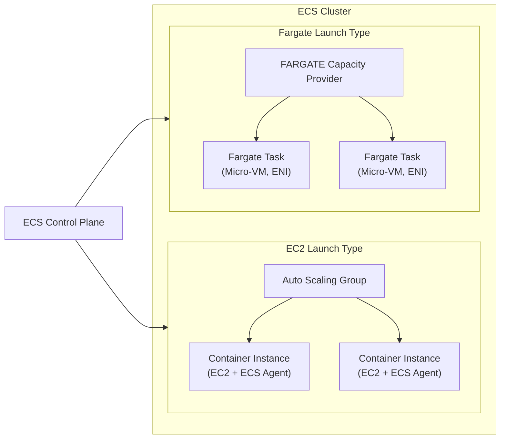
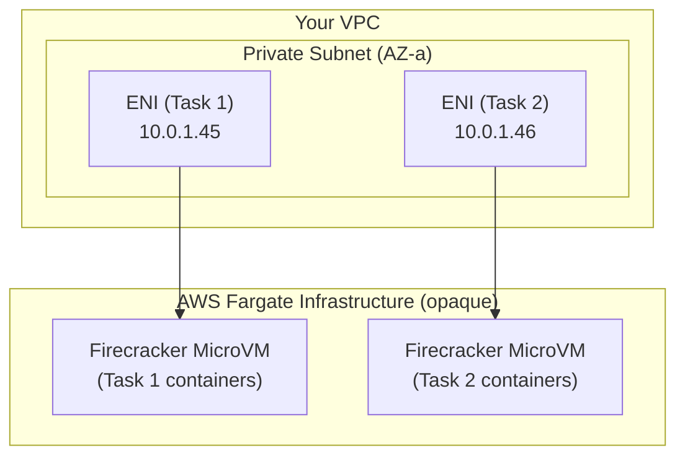
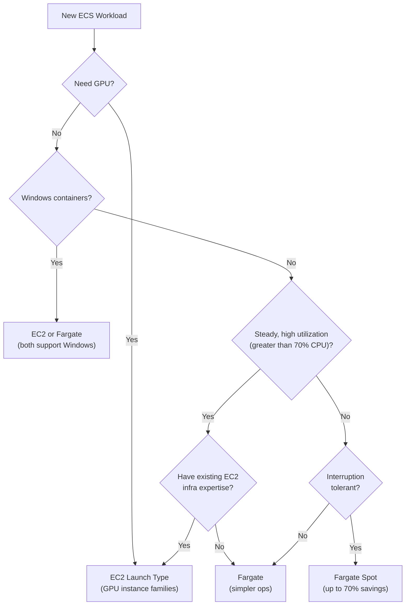

# ECS Launch Types - EC2 vs Fargate - SAA-C03 Deep Dive

> ECS offers two launch types — EC2 (you manage the underlying instances) and Fargate (AWS manages all compute) — plus capacity providers that let you mix both and enable features like Fargate Spot for cost savings up to 70%.

See also: [01 - ECS Fundamentals & Architecture](01%20-%20ECS%20Fundamentals%20%26%20Architecture.md) · [03 - ECS Task Definitions, Tasks & Services](03%20-%20ECS%20Task%20Definitions%2C%20Tasks%20%26%20Services.md) · [04 - ECS Networking & Load Balancing](04%20-%20ECS%20Networking%20%26%20Load%20Balancing.md) · [05 - ECS IAM & Security](05%20-%20ECS%20IAM%20%26%20Security.md) · [06 - ECS Auto Scaling & Capacity](06%20-%20ECS%20Auto%20Scaling%20%26%20Capacity.md) · [07 - ECS Storage, Logging & Observability](07%20-%20ECS%20Storage%2C%20Logging%20%26%20Observability.md) · [08 - ECS Exam Scenarios & Q&A](08%20-%20ECS%20Exam%20Scenarios%20%26%20Q%26A.md) · [01 - ECR Fundamentals & Architecture](01%20-%20ECR%20Fundamentals%20%26%20Architecture.md) · [01 - EKS Fundamentals & Architecture](01%20-%20EKS%20Fundamentals%20%26%20Architecture.md) · [01 - ECS Anywhere Fundamentals & Architecture](01%20-%20ECS%20Anywhere%20Fundamentals%20%26%20Architecture.md)

---

## Table of Contents

- [Launch Type Overview](#launch-type-overview)
- [EC2 Launch Type Deep Dive](#ec2-launch-type-deep-dive)
- [Fargate Launch Type Deep Dive](#fargate-launch-type-deep-dive)
- [Shared Responsibility Model Comparison](#shared-responsibility-model-comparison)
- [Cost Model Comparison](#cost-model-comparison)
- [Fargate Spot](#fargate-spot)
- [Capacity Providers](#capacity-providers)
- [When to Choose EC2 vs Fargate](#when-to-choose-ec2-vs-fargate)
- [Mixed Cluster Architecture](#mixed-cluster-architecture)

---



---

## Launch Type Overview

| Property                      | EC2 Launch Type                                | Fargate Launch Type                            |
| :---------------------------- | :--------------------------------------------- | :--------------------------------------------- |
| **Infrastructure**            | Your EC2 instances                             | AWS micro-VMs (Firecracker)                    |
| **You manage**                | OS, Docker, ECS Agent, instance type, patching | Nothing below the task                         |
| **AWS manages**               | ECS control plane only                         | ECS control plane + all compute infrastructure |
| **Billing unit**              | EC2 instance hours (always-on)                 | Per task: vCPU-seconds + GB-seconds            |
| **Min container granularity** | Bin-packed onto shared instances               | 0.25 vCPU / 0.5 GB per task                    |
| **Network mode**              | bridge, host, awsvpc                           | awsvpc only                                    |
| **GPU support**               | Yes (p/g instance families)                    | Yes (limited — NVIDIA T4G)                     |
| **Windows containers**        | Yes                                            | Yes                                            |
| **ECS Anywhere**              | Your own servers                               | N/A                                            |

---

[⬆ Back to top](#table-of-contents)

---

## EC2 Launch Type Deep Dive

### How it Works

1. You provision EC2 instances (manually or via Auto Scaling Group)
2. Instances run the ECS Agent and register with the cluster
3. ECS scheduler places tasks onto instances based on available CPU/memory
4. Tasks share the host OS kernel (standard Docker isolation)

### Instance Registration Flow

```bash
# 1. Launch EC2 with ECS-Optimized AMI and user-data:
cat <<'EOF' > /etc/ecs/ecs.config
ECS_CLUSTER=my-cluster
ECS_ENABLE_TASK_IAM_ROLE=true
ECS_AVAILABLE_LOGGING_DRIVERS=["json-file","awslogs"]
EOF

# 2. Verify registration
aws ecs list-container-instances --cluster my-cluster
```

### EC2 Launch Type — Key Responsibilities

| Responsibility                       | Who Handles It                                     |
| :----------------------------------- | :------------------------------------------------- |
| OS patching                          | **You**                                            |
| Docker version upgrades              | **You**                                            |
| ECS Agent upgrades                   | **You** (or use SSM automation)                    |
| Instance type sizing                 | **You**                                            |
| Capacity headroom for task placement | **You** (or managed scaling via capacity provider) |
| ECS scheduler, API                   | **AWS**                                            |
| Task placement decisions             | **AWS** (based on your strategies)                 |

### When EC2 Placement Fails

If ECS cannot place a task, it logs an event:

```
(service my-service) was unable to place a task because no container instance
met all of its requirements. The closest matching container instance ...
has insufficient memory available.
```

Solutions:

- Scale out the ASG (add more instances)
- Use a capacity provider with managed scaling
- Reduce task CPU/memory reservation
- Use Fargate for overflow capacity

### ECS-Optimized AMI Versions

| AMI Family                   | Notes                                                             |
| :--------------------------- | :---------------------------------------------------------------- |
| **Amazon Linux 2023**        | Recommended for new workloads, systemd, kernel 6.x                |
| **Amazon Linux 2**           | LTS, widely used, kernel 5.x                                      |
| **Bottlerocket**             | AWS-built minimal container OS, automatic updates, immutable root |
| **Windows Server 2019/2022** | For Windows containers                                            |

---

[⬆ Back to top](#table-of-contents)

---

## Fargate Launch Type Deep Dive

### How it Works

Fargate abstracts away all instance management. When you launch a Fargate task:

1. ECS allocates a dedicated **micro-VM** (AWS Firecracker) per task
2. Each task gets its own **ENI** in your VPC (awsvpc mode mandatory)
3. Docker image is pulled from ECR/public registry into isolated storage
4. Task runs; billing starts
5. Task stops; VM is destroyed; billing stops

### Fargate Isolation Model



**Key isolation properties:**

- Each task runs in its own micro-VM kernel — no shared kernel with other customers
- The ENI is injected into your VPC — tasks are network-reachable just like EC2 instances
- Security groups apply at the ENI level (per task)

### Fargate CPU and Memory Combinations

Fargate uses a fixed table of valid CPU/memory pairings — you cannot use arbitrary values:

| vCPU | Valid Memory Options        |
| :--- | :-------------------------- |
| 0.25 | 0.5 GB, 1 GB, 2 GB          |
| 0.5  | 1–4 GB (1 GB increments)    |
| 1    | 2–8 GB (1 GB increments)    |
| 2    | 4–16 GB (1 GB increments)   |
| 4    | 8–30 GB (1 GB increments)   |
| 8    | 16–60 GB (4 GB increments)  |
| 16   | 32–120 GB (8 GB increments) |

**Exam Trap:** You must specify CPU and memory at the **task definition level** for Fargate (not just at the container level). The task-level values are the allocated Fargate VM size.

### Fargate Task Definition Fragment

```json
{
  "family": "api-task",
  "networkMode": "awsvpc",
  "requiresCompatibilities": ["FARGATE"],
  "cpu": "512",
  "memory": "1024",
  "executionRoleArn": "arn:aws:iam::123456789012:role/ecsTaskExecutionRole",
  "taskRoleArn": "arn:aws:iam::123456789012:role/myAppRole",
  "containerDefinitions": [
    {
      "name": "api",
      "image": "123456789012.dkr.ecr.us-east-1.amazonaws.com/api:latest",
      "portMappings": [{ "containerPort": 8080 }],
      "logConfiguration": {
        "logDriver": "awslogs",
        "options": {
          "awslogs-group": "/ecs/api-task",
          "awslogs-region": "us-east-1",
          "awslogs-stream-prefix": "ecs"
        }
      }
    }
  ]
}
```

---

[⬆ Back to top](#table-of-contents)

---

## Shared Responsibility Model Comparison

| Layer                                     | EC2 Launch Type             | Fargate Launch Type                            |
| :---------------------------------------- | :-------------------------- | :--------------------------------------------- |
| **Application code**                      | You                         | You                                            |
| **Docker image / OS packages**            | You                         | You                                            |
| **Container runtime (Docker/containerd)** | You                         | AWS                                            |
| **Guest OS kernel**                       | You                         | AWS                                            |
| **Host OS**                               | You                         | AWS                                            |
| **Hypervisor / bare metal**               | AWS                         | AWS                                            |
| **Physical security**                     | AWS                         | AWS                                            |
| **ECS Agent**                             | You (must update)           | AWS (managed)                                  |
| **Security patches for host**             | You                         | AWS                                            |
| **Network isolation**                     | VPC security groups + NACLs | VPC security groups per ENI + kernel isolation |

**Key Exam Point:** With Fargate, you are responsible for:

- Container image content (your app code, libraries, base image CVEs)
- IAM roles (task role, execution role)
- Network security (security groups on the task ENI)

You are NOT responsible for: OS patching, kernel, Docker daemon, ECS Agent.

---

[⬆ Back to top](#table-of-contents)

---

## Cost Model Comparison

### EC2 Launch Type Costs

You pay for **EC2 instances** regardless of whether they are running tasks:

```
Cost = EC2 instance hours × instance price
     + (optional) EBS volumes
     + data transfer
```

**Optimization:** Use Spot Instances for the ASG backing EC2 launch type tasks (interruption-tolerant workloads).

### Fargate Launch Type Costs

You pay only for what your tasks consume, billed per-second with a 1-minute minimum:

```
Cost = (vCPU allocated × $0.04048/vCPU-hour)
     + (Memory allocated × $0.004445/GB-hour)
     + (Ephemeral storage > 20 GB × $0.000111/GB-hour)
```

_(Prices are us-east-1 on-demand as a reference; always check current pricing)_

### Cost Comparison Example

| Scenario              | EC2 (t3.medium, 2vCPU/4GB)        | Fargate (2 tasks: 0.5vCPU/1GB each)                   |
| :-------------------- | :-------------------------------- | :---------------------------------------------------- |
| **Running 24/7**      | ~$30/month                        | ~$15/month (if tasks use less than instance capacity) |
| **Running 2 hrs/day** | ~$30/month (instance stays up)    | ~$1/month (pay only for task hours)                   |
| **Spiky traffic**     | Over-provision or complex scaling | Pay exactly for what you use                          |

**Rule of Thumb:**

- High, steady utilization → EC2 (cheaper per vCPU-hour)
- Low utilization or spiky → Fargate (no idle cost)
- Batch / short jobs → Fargate (pay only while running)

---

[⬆ Back to top](#table-of-contents)

---

## Fargate Spot

**Fargate Spot** uses spare AWS compute capacity at up to **70% discount** compared to Fargate on-demand pricing.

### How Fargate Spot Works

- AWS can **interrupt** a Fargate Spot task with a 2-minute warning
- ECS sends a `SIGTERM` to the task, then a `SIGKILL` 2 minutes later
- Your task should handle `SIGTERM` gracefully (checkpoint work, drain connections)

### Fargate Spot Use Cases

| Suitable              | Not Suitable                            |
| :-------------------- | :-------------------------------------- |
| Batch/data processing | Web APIs (must stay up)                 |
| CI/CD build tasks     | Databases                               |
| ML training jobs      | Stateful services without checkpointing |
| Queue consumers       | Low-latency, user-facing services       |

### Enabling Fargate Spot via Capacity Provider Strategy

```json
{
  "capacityProviderStrategy": [
    { "capacityProvider": "FARGATE", "weight": 1, "base": 1 },
    { "capacityProvider": "FARGATE_SPOT", "weight": 3 }
  ]
}
```

This configuration runs the "base" 1 task on on-demand Fargate, then scales additional tasks 3:1 Spot to on-demand — delivering ~70% savings on surge traffic.

---

[⬆ Back to top](#table-of-contents)

---

## Capacity Providers

Capacity providers are the modern, recommended way to manage how ECS tasks get compute resources.

### Types of Capacity Providers

| Capacity Provider         | Data Plane                  | Use Case                               |
| :------------------------ | :-------------------------- | :------------------------------------- |
| **FARGATE**               | AWS Fargate on-demand       | Reliable serverless compute            |
| **FARGATE_SPOT**          | AWS Fargate Spot            | Cost-optimized, interruption-tolerant  |
| **ASG Capacity Provider** | Your EC2 Auto Scaling Group | EC2 launch type with automated scaling |

### ASG Capacity Provider Features

When you associate an ASG with an ECS cluster as a capacity provider, you unlock:

#### Managed Scaling

ECS automatically adjusts the ASG's desired count based on task demand.

| Setting                       | Description                                                                         |
| :---------------------------- | :---------------------------------------------------------------------------------- |
| **Target capacity %**         | ECS targets this utilization (e.g., 100% = pack instances fully before scaling out) |
| **Minimum scaling step size** | Minimum number of instances to add per scale-out event                              |
| **Maximum scaling step size** | Maximum instances to add per event                                                  |

```bash
aws ecs put-cluster-capacity-providers \
  --cluster my-cluster \
  --capacity-providers my-asg-cp \
  --default-capacity-provider-strategy \
    capacityProvider=my-asg-cp,weight=1,base=0 \
  --auto-scaling-group-provider '{"autoScalingGroupArn":"arn:aws:...",
    "managedScaling":{"status":"ENABLED","targetCapacity":100},
    "managedTerminationProtection":"ENABLED"}'
```

#### Managed Termination Protection

Prevents ECS from terminating an EC2 instance that still has running tasks during a scale-in event.

**How it works:**

1. ECS sets an EC2 Scale-In Protection flag on the instance
2. Scale-in is blocked while tasks are running
3. When tasks finish/move, protection is removed
4. ASG can then terminate the instance

**Exam Trap:** Managed Termination Protection requires that your ASG has instance protection enabled AND that you use the ECS capacity provider. It does NOT work with manually managed ASGs or without the capacity provider linkage.

### Capacity Provider Strategy

A strategy assigns weights to multiple providers for a cluster/service:

```json
{
  "capacityProviderStrategy": [
    {
      "capacityProvider": "FARGATE",
      "weight": 1,
      "base": 2
    },
    {
      "capacityProvider": "FARGATE_SPOT",
      "weight": 4
    }
  ]
}
```

- **base**: Minimum number of tasks always placed on this provider
- **weight**: Relative proportion for tasks beyond the base (higher = more tasks)

---

[⬆ Back to top](#table-of-contents)

---

## When to Choose EC2 vs Fargate

### Decision Framework



### Quick-Reference Signals

| If the scenario says...                    | Choose                        |
| :----------------------------------------- | :---------------------------- |
| "Serverless containers"                    | Fargate                       |
| "No EC2 instances to manage"               | Fargate                       |
| "Batch jobs, cost sensitive"               | Fargate Spot                  |
| "Need GPU for ML inference"                | EC2 (GPU instances)           |
| "Existing EC2 fleet, maximize utilization" | EC2 + ASG Capacity Provider   |
| "Compliance requires dedicated hardware"   | EC2 on Dedicated Hosts        |
| "Mixed: always-on core + burst"            | EC2 base + FARGATE_SPOT burst |

---

[⬆ Back to top](#table-of-contents)

---

## Mixed Cluster Architecture

A single ECS cluster can run both EC2 and Fargate tasks simultaneously, which is a powerful pattern for cost optimization.

### Pattern: Reserved Base + Fargate Burst

```
ECS Cluster
├── EC2 ASG Capacity Provider
│   ├── Reserved Instances (baseline steady-state traffic)
│   └── Managed scaling for predictable surge
└── FARGATE_SPOT Capacity Provider
    └── Handles unpredictable burst (cheap, interruption-tolerant)
```

### Pattern: Microservices with Mixed Requirements

| Service                     | Launch Type       | Reason                       |
| :-------------------------- | :---------------- | :--------------------------- |
| Web API (latency sensitive) | Fargate on-demand | No interruptions, simple ops |
| Background workers          | Fargate Spot      | Cost savings, retryable      |
| ML inference                | EC2 (g4dn)        | GPU required                 |
| Scheduled reports           | Fargate Spot      | Short-lived, cheap           |

---

[⬆ Back to top](#table-of-contents)
