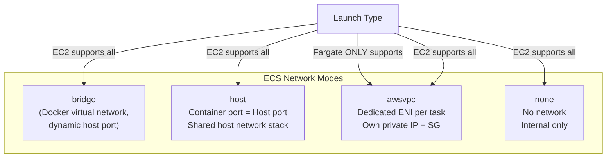
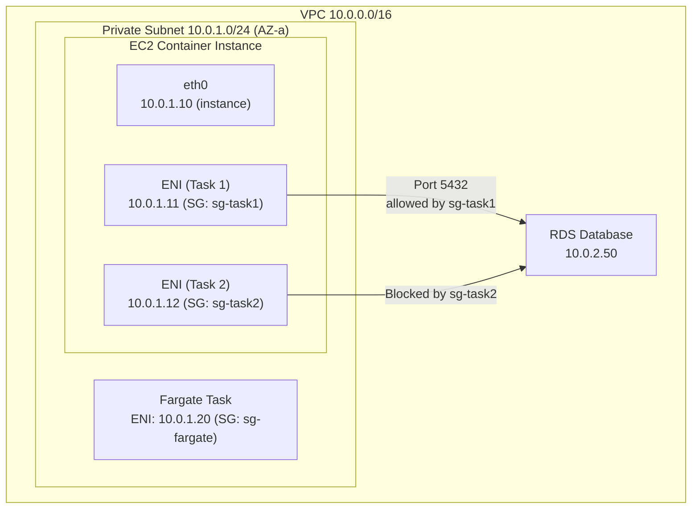
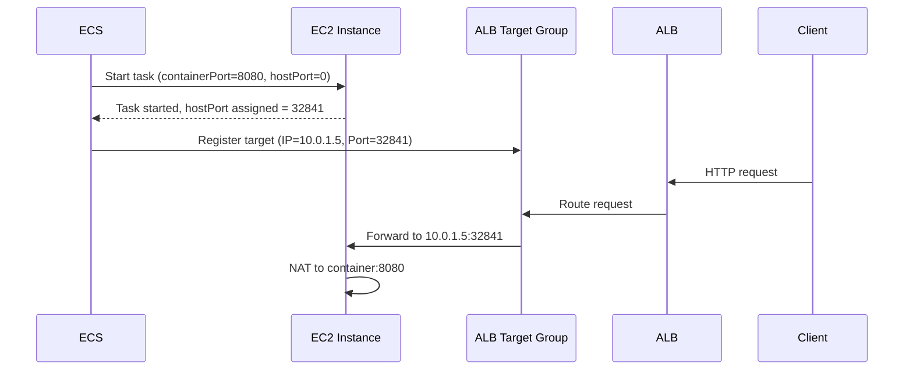
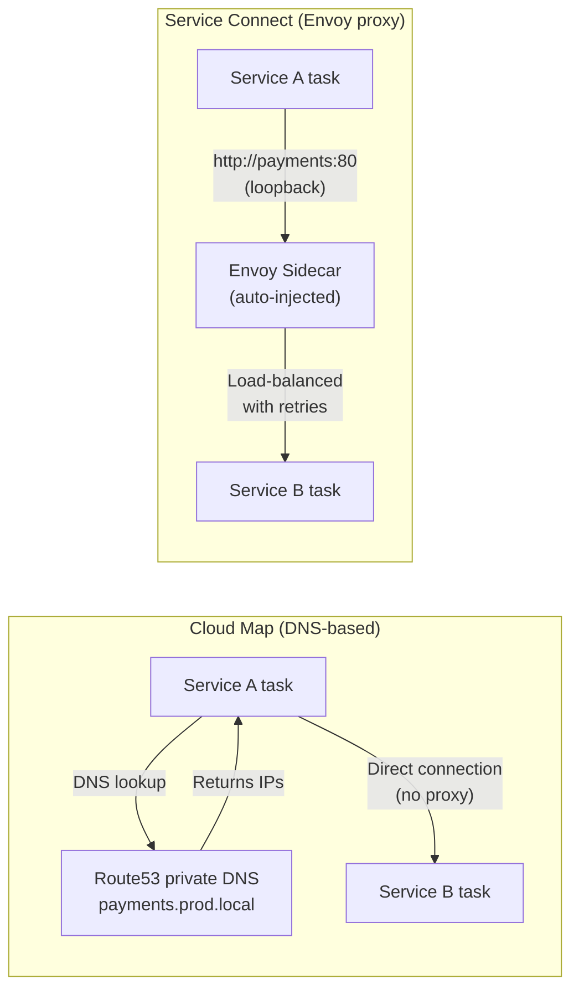
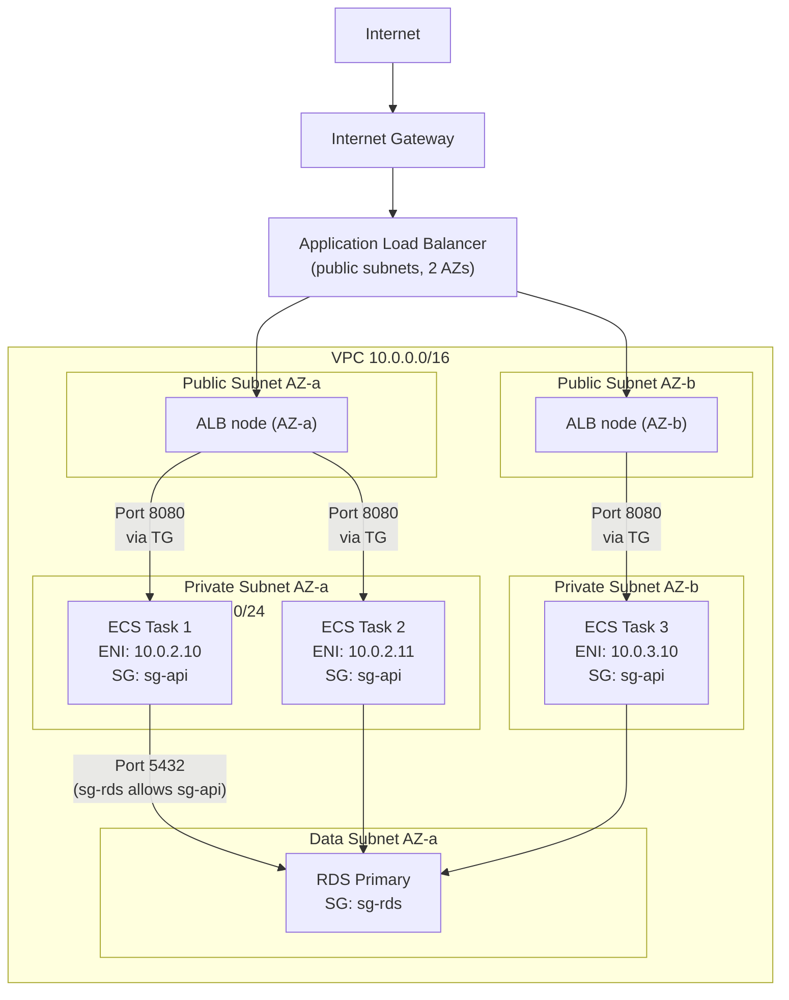

# ECS Networking & Load Balancing - SAA-C03 Deep Dive

> ECS supports four Docker network modes — bridge, host, awsvpc, and none — with awsvpc being mandatory for Fargate and the recommended choice for EC2 because each task gets a dedicated ENI, its own IP, and security group isolation, enabling fine-grained network security.

See also: [01 - ECS Fundamentals & Architecture](01%20-%20ECS%20Fundamentals%20%26%20Architecture.md) · [02 - ECS Launch Types - EC2 vs Fargate](02%20-%20ECS%20Launch%20Types%20-%20EC2%20vs%20Fargate.md) · [03 - ECS Task Definitions, Tasks & Services](03%20-%20ECS%20Task%20Definitions%2C%20Tasks%20%26%20Services.md) · [05 - ECS IAM & Security](05%20-%20ECS%20IAM%20%26%20Security.md) · [06 - ECS Auto Scaling & Capacity](06%20-%20ECS%20Auto%20Scaling%20%26%20Capacity.md) · [07 - ECS Storage, Logging & Observability](07%20-%20ECS%20Storage%2C%20Logging%20%26%20Observability.md) · [08 - ECS Exam Scenarios & Q&A](08%20-%20ECS%20Exam%20Scenarios%20%26%20Q%26A.md) · [01 - ECR Fundamentals & Architecture](01%20-%20ECR%20Fundamentals%20%26%20Architecture.md) · [01 - EKS Fundamentals & Architecture](01%20-%20EKS%20Fundamentals%20%26%20Architecture.md) · [01 - ECS Anywhere Fundamentals & Architecture](01%20-%20ECS%20Anywhere%20Fundamentals%20%26%20Architecture.md)

---

## Table of Contents

- [Network Mode Comparison](#network-mode-comparison)
- [Bridge Mode Deep Dive](#bridge-mode-deep-dive)
- [Host Mode Deep Dive](#host-mode-deep-dive)
- [awsvpc Mode Deep Dive](#awsvpc-mode-deep-dive)
- [Dynamic Port Mapping with ALB](#dynamic-port-mapping-with-alb)
- [Load Balancer Types for ECS](#load-balancer-types-for-ecs)
- [Service Discovery with Cloud Map](#service-discovery-with-cloud-map)
- [ECS Service Connect](#ecs-service-connect)
- [Network Diagram: awsvpc Multi-AZ](#network-diagram-awsvpc-multi-az)

---



---

## Network Mode Comparison

| Feature                     | bridge                     | host                          | awsvpc                | none          |
| :-------------------------- | :------------------------- | :---------------------------- | :-------------------- | :------------ |
| **Container IP**            | Docker virtual IP          | Host IP                       | VPC private IP        | Loopback only |
| **Port isolation**          | Dynamic host ports         | No isolation (collision risk) | Full (own IP)         | N/A           |
| **Security groups**         | At instance level only     | At instance level only        | At task ENI level     | N/A           |
| **Fargate compatible**      | No                         | No                            | Yes (required)        | No            |
| **EC2 compatible**          | Yes                        | Yes                           | Yes                   | Yes           |
| **ALB integration**         | Yes (dynamic port mapping) | Yes                           | Yes (direct IP)       | No            |
| **NLB integration**         | Limited                    | Yes                           | Yes                   | No            |
| **Multiple tasks per host** | Yes                        | Yes (port conflicts possible) | Yes (own IP per task) | Yes           |

**Exam Rule:** Fargate always uses `awsvpc`. For EC2 launch type, AWS recommends `awsvpc` for security and simplicity.

---

[⬆ Back to top](#table-of-contents)

---

## Bridge Mode Deep Dive

Bridge mode creates a Docker virtual network on the host (`docker0` bridge). Containers get Docker-assigned IPs not reachable from outside the host.

### How Bridge Mode Port Mapping Works

```
Host EC2 Instance
  ├── eth0: 10.0.1.5 (VPC private IP)
  ├── docker0: 172.17.0.1 (Docker bridge)
  │
  ├── Container A: 172.17.0.2:8080 → Host port 32768 (dynamic)
  ├── Container B: 172.17.0.3:8080 → Host port 32769 (dynamic)
  └── Container C: 172.17.0.4:8080 → Host port 32770 (dynamic)

Traffic flow: ALB → 10.0.1.5:32768 → NAT → Container A:8080
```

### Dynamic Port Mapping Configuration

Set `hostPort: 0` in the container definition to enable dynamic port allocation:

```json
{
  "portMappings": [
    {
      "containerPort": 8080,
      "hostPort": 0,
      "protocol": "tcp"
    }
  ]
}
```

ECS automatically registers the assigned host port with the ALB target group.

### Bridge Mode Limitations

- Security groups apply at the **instance level**, not per-task
- Container-to-container communication requires knowledge of the bridge network
- `hostPort` conflicts possible if you accidentally set a static host port
- Not available on Fargate

---

[⬆ Back to top](#table-of-contents)

---

## Host Mode Deep Dive

In host mode, the container shares the host's network namespace directly. The container port IS the host port.

```
Host EC2 Instance (10.0.1.5)
  ├── Container A binds :8080 → 10.0.1.5:8080 directly
  └── Container B cannot also bind :8080 (port already taken)
```

### Use Cases for Host Mode

| Use Case                             | Why Host Mode                          |
| :----------------------------------- | :------------------------------------- |
| High-performance networking          | No NAT overhead; lowest latency        |
| Network monitoring tools             | Need access to host network interfaces |
| Legacy apps expecting specific ports | No port remapping                      |

### Host Mode Limitations

- **Port conflicts:** Only one task can bind to each port on a given host
- **No task isolation:** All containers share the host's IP and ports
- Requires careful capacity planning (one task per port per host)
- Not available on Fargate

---

[⬆ Back to top](#table-of-contents)

---

## awsvpc Mode Deep Dive

The `awsvpc` network mode is the most important for the exam. Each ECS task gets:

- Its own **Elastic Network Interface (ENI)** in your VPC
- Its own **private IP address** from your subnet
- Its own **security group(s)** — separate from the host's security groups

### awsvpc Architecture



### ENI Trunking (EC2 Only)

By default, EC2 instances have a limited number of ENIs based on instance type. This limits the number of `awsvpc` tasks per instance.

**ENI Trunking** (available on Nitro-based instances) allows significantly more ENIs per instance:

| Without Trunking                                         | With Trunking                        |
| :------------------------------------------------------- | :----------------------------------- |
| Limited by instance ENI limit (e.g., t3.medium = 3 ENIs) | Up to hundreds of tasks per instance |
| 1 ENI per task + 1 for the instance                      | Uses a trunk ENI shared by all tasks |
| Practical limit: ~2 awsvpc tasks per t3.medium           | Limited by vCPU/memory, not ENIs     |

Enable ENI trunking at the account level:

```bash
aws ecs put-account-setting \
  --name awsvpcTrunking \
  --value enabled
```

### Security Groups in awsvpc Mode

Each task can have 1–5 security groups. This enables:

- **Task-level micro-segmentation** — different tasks in the same cluster have different network access
- **Zero-trust networking** — only allow exactly what each task needs
- **Principle of least privilege** for network access

**Example: Only allow the API task to reach the database:**

```
Task: web-frontend → sg-web: allows :443 from ALB, outbound to sg-api only
Task: api-service   → sg-api: allows :8080 from sg-web, outbound to sg-rds only
RDS: database       → sg-rds: allows :5432 from sg-api only
```

---

[⬆ Back to top](#table-of-contents)

---

## Dynamic Port Mapping with ALB

ALB + ECS is the most common and exam-relevant load balancing pattern.

### Why Dynamic Port Mapping?

With the EC2 bridge network mode, multiple tasks of the same service run on the same instance but can't all bind to the same port. Dynamic port mapping assigns each task a random high port on the host, and ECS automatically registers/deregisters these with the ALB target group.

### Setup Flow



### ALB Security Group Configuration

For bridge mode dynamic ports, the ALB's security group must allow the **entire ephemeral port range** to reach the EC2 instance:

```
ALB Security Group:    outbound 32768-65535 → EC2 Security Group
EC2 Security Group:    inbound  32768-65535 from ALB Security Group
```

**Exam Tip:** If using `awsvpc` mode, the ALB connects directly to the task IP on the container port — no dynamic port mapping needed. This is simpler and more secure.

### awsvpc Mode ALB Configuration

```
ALB Security Group:    outbound 8080 → Task Security Group
Task Security Group:   inbound  8080 from ALB Security Group
```

No ephemeral port ranges. Clean, predictable security group rules.

---

[⬆ Back to top](#table-of-contents)

---

## Load Balancer Types for ECS

### Application Load Balancer (ALB) — Recommended

| Feature                      | ECS Benefit                                            |
| :--------------------------- | :----------------------------------------------------- |
| **Path-based routing**       | Route `/api/*` to one ECS service, `/web/*` to another |
| **Host-based routing**       | Multiple domains to different ECS services on one ALB  |
| **HTTP/2 and gRPC**          | Modern microservice communication                      |
| **Sticky sessions**          | Session affinity to specific tasks                     |
| **WebSocket support**        | Long-lived connections to tasks                        |
| **WAF integration**          | Protect ECS services with AWS WAF                      |
| **Target group per service** | Each ECS service registers its tasks in its own TG     |

**Best for:** HTTP/HTTPS workloads, microservices, REST APIs, gRPC services.

### Network Load Balancer (NLB)

| Feature               | ECS Benefit                                                |
| :-------------------- | :--------------------------------------------------------- |
| **Ultra-low latency** | Layer 4, no HTTP processing overhead                       |
| **Static IP per AZ**  | Stable IP addresses for firewall rules                     |
| **TLS termination**   | Offload TLS from containers                                |
| **TCP/UDP support**   | Non-HTTP protocols (game servers, IoT, custom protocols)   |
| **PrivateLink**       | Expose ECS services to other VPCs/accounts via PrivateLink |

**Best for:** Non-HTTP protocols, latency-sensitive applications, UDP traffic.

### Classic Load Balancer (CLB) — Legacy

- Does **not** support dynamic port mapping with bridge mode properly
- Does **not** support target groups
- Avoid for new ECS architectures — use ALB or NLB

### Load Balancer Selection Table

| If you need...                             | Use |
| :----------------------------------------- | :-- |
| HTTP/HTTPS with path routing               | ALB |
| Multiple services behind one load balancer | ALB |
| gRPC                                       | ALB |
| WebSocket                                  | ALB |
| TCP/UDP                                    | NLB |
| Lowest possible latency                    | NLB |
| Static IP for firewall rules               | NLB |
| AWS PrivateLink                            | NLB |

---

[⬆ Back to top](#table-of-contents)

---

## Service Discovery with Cloud Map

AWS Cloud Map provides DNS-based service discovery. ECS can automatically register task IPs as health-checked DNS records.

### How It Works

```
1. Create a Cloud Map namespace (private DNS namespace in your VPC)
2. Create a Cloud Map service within the namespace
3. Configure ECS service with serviceRegistries pointing to Cloud Map service
4. ECS registers each task's IP as a Cloud Map instance on task start
5. ECS deregisters on task stop
6. Consuming services do DNS lookup: payments.prod.local → [10.0.1.5, 10.0.1.6]
```

### Configuration

```json
{
  "serviceRegistries": [
    {
      "registryArn": "arn:aws:servicediscovery:us-east-1:123456789012:service/srv-xyz123",
      "containerName": "payments-api",
      "containerPort": 8080
    }
  ]
}
```

### Limitations of Cloud Map Discovery

| Limitation                  | Impact                                        |
| :-------------------------- | :-------------------------------------------- |
| **DNS TTL caching**         | Clients may continue sending to dead task IPs |
| **No load balancing logic** | Client gets all IPs; client must choose       |
| **No circuit breaking**     | No automatic failure detection/isolation      |
| **No retries**              | Application must handle retries               |

---

[⬆ Back to top](#table-of-contents)

---

## ECS Service Connect

Service Connect is the modern replacement for Cloud Map-based discovery. It injects an Envoy proxy sidecar into each task transparently.

### Service Connect vs Cloud Map



### Service Connect Benefits Over Cloud Map

| Feature              | Cloud Map              | Service Connect              |
| :------------------- | :--------------------- | :--------------------------- |
| **Proxy**            | None                   | Envoy (auto-injected by ECS) |
| **Load balancing**   | DNS round-robin        | Envoy per-request LB         |
| **Retries**          | Client responsibility  | Automatic                    |
| **Circuit breaking** | None                   | Built-in via Envoy           |
| **Observability**    | Basic                  | Per-path CloudWatch metrics  |
| **mTLS**             | No                     | Yes (optional)               |
| **Configuration**    | Manual Cloud Map setup | Cluster namespace config     |

### Enabling Service Connect

1. Enable a namespace on the cluster:

```bash
aws ecs update-cluster \
  --cluster my-cluster \
  --service-connect-defaults namespace=prod
```

1. Configure the service:

```json
{
  "serviceConnectConfiguration": {
    "enabled": true,
    "namespace": "prod",
    "services": [
      {
        "portName": "http",
        "discoveryName": "payments",
        "clientAliases": [{ "port": 80, "dnsName": "payments" }]
      }
    ],
    "logConfiguration": {
      "logDriver": "awslogs",
      "options": {
        "awslogs-group": "/ecs/service-connect-proxy",
        "awslogs-region": "us-east-1",
        "awslogs-stream-prefix": "proxy"
      }
    }
  }
}
```

1. Any service in the `prod` namespace can now reach payments at `http://payments:80` — with automatic load balancing, retries, and observability.

---

[⬆ Back to top](#table-of-contents)

---

## Network Diagram: awsvpc Multi-AZ



---

[⬆ Back to top](#table-of-contents)
