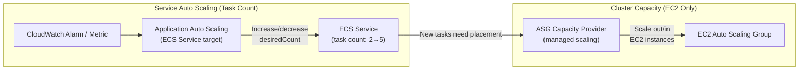
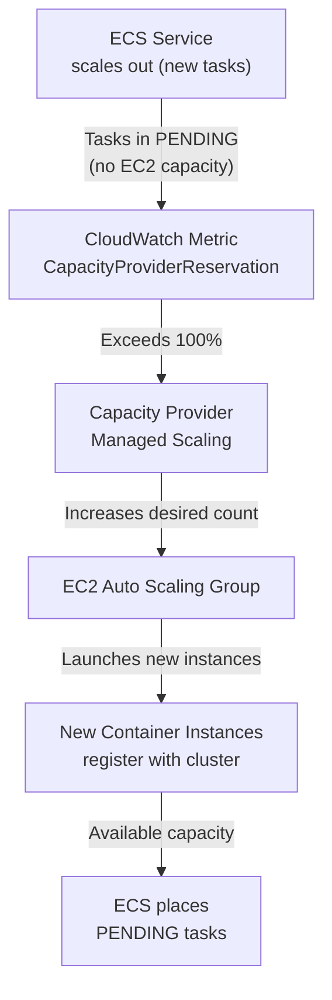
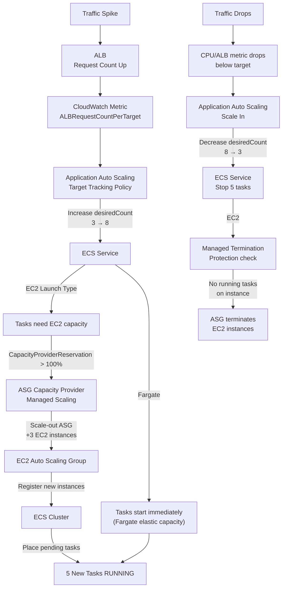

# ECS Auto Scaling & Capacity - SAA-C03 Deep Dive

> ECS has two separate scaling planes that must be coordinated: Service Auto Scaling (scales the number of ECS tasks) and Cluster capacity scaling (scales the number of EC2 instances or Fargate capacity). Getting both working together is critical for zero-downtime scaling.

See also: [01 - ECS Fundamentals & Architecture](01%20-%20ECS%20Fundamentals%20%26%20Architecture.md) · [02 - ECS Launch Types - EC2 vs Fargate](02%20-%20ECS%20Launch%20Types%20-%20EC2%20vs%20Fargate.md) · [03 - ECS Task Definitions, Tasks & Services](03%20-%20ECS%20Task%20Definitions%2C%20Tasks%20%26%20Services.md) · [04 - ECS Networking & Load Balancing](04%20-%20ECS%20Networking%20%26%20Load%20Balancing.md) · [05 - ECS IAM & Security](05%20-%20ECS%20IAM%20%26%20Security.md) · [07 - ECS Storage, Logging & Observability](07%20-%20ECS%20Storage%2C%20Logging%20%26%20Observability.md) · [08 - ECS Exam Scenarios & Q&A](08%20-%20ECS%20Exam%20Scenarios%20%26%20Q%26A.md) · [01 - ECR Fundamentals & Architecture](01%20-%20ECR%20Fundamentals%20%26%20Architecture.md) · [01 - EKS Fundamentals & Architecture](01%20-%20EKS%20Fundamentals%20%26%20Architecture.md) · [01 - ECS Anywhere Fundamentals & Architecture](01%20-%20ECS%20Anywhere%20Fundamentals%20%26%20Architecture.md)

---

## Table of Contents

- [Two Scaling Planes: Tasks vs Cluster Capacity](#two-scaling-planes-tasks-vs-cluster-capacity)
- [ECS Service Auto Scaling](#ecs-service-auto-scaling)
- [Target Tracking Scaling](#target-tracking-scaling)
- [Step Scaling](#step-scaling)
- [Scheduled Scaling](#scheduled-scaling)
- [Cluster Auto Scaling with Capacity Providers](#cluster-auto-scaling-with-capacity-providers)
- [Managed Scaling (ASG Capacity Provider)](#managed-scaling-asg-capacity-provider)
- [Scaling on Custom CloudWatch Metrics](#scaling-on-custom-cloudwatch-metrics)
- [Fargate Scaling (Serverless)](#fargate-scaling-serverless)
- [Scale-In Protection](#scale-in-protection)
- [End-to-End Scaling Architecture](#end-to-end-scaling-architecture)

---



---

## Two Scaling Planes: Tasks vs Cluster Capacity

This separation is the most important concept in ECS scaling, and the most common exam trap.

### Plane 1: Service Auto Scaling (Task Count)

- **What scales:** The number of ECS tasks in a service (`desiredCount`)
- **Controlled by:** Application Auto Scaling (ECS service target)
- **Applies to:** Both EC2 and Fargate launch types
- **Metric examples:** CPU utilization, memory utilization, ALB request count per target, custom CloudWatch metrics

### Plane 2: Cluster Capacity (EC2 Only)

- **What scales:** The number of EC2 container instances in the cluster
- **Controlled by:** ASG Capacity Provider managed scaling OR your own ASG scaling policies
- **Applies to:** EC2 launch type ONLY (Fargate handles this transparently)
- **Trigger:** When ECS cannot place a task due to insufficient cluster capacity

### Why Both Must Be Tuned

| Problem                                      | Root Cause                          | Fix                                                          |
| :------------------------------------------- | :---------------------------------- | :----------------------------------------------------------- |
| Tasks scale out but sit in PENDING           | Not enough EC2 capacity             | Scale out EC2 ASG (or use capacity provider managed scaling) |
| EC2 instances scale out but are nearly empty | Service Auto Scaling not triggered  | Lower scaling thresholds or add custom metrics               |
| Scale-in removes EC2 with running tasks      | No managed termination protection   | Enable managed termination protection on capacity provider   |
| Tasks scaled to 0 but EC2 instances stay up  | EC2 ASG min=1 or no scale-in policy | Tune ASG scale-in policy or use capacity provider            |

---

[⬆ Back to top](#table-of-contents)

---

## ECS Service Auto Scaling

ECS Service Auto Scaling is implemented via **AWS Application Auto Scaling** (the same service used for DynamoDB, Aurora, etc.).

### Setting Up Service Auto Scaling

```bash
# Step 1: Register the ECS service as a scalable target
aws application-autoscaling register-scalable-target \
  --service-namespace ecs \
  --resource-id service/my-cluster/my-service \
  --scalable-dimension ecs:service:DesiredCount \
  --min-capacity 2 \
  --max-capacity 20

# Step 2: Create a scaling policy (see sections below)
```

### Predefined ECS Metrics for Auto Scaling

| Metric                               | Description                       | Scale On                  |
| :----------------------------------- | :-------------------------------- | :------------------------ |
| `ECSServiceAverageCPUUtilization`    | Average CPU % across all tasks    | High CPU → scale out      |
| `ECSServiceAverageMemoryUtilization` | Average memory % across all tasks | High memory → scale out   |
| `ALBRequestCountPerTarget`           | ALB requests per task per minute  | High requests → scale out |

---

[⬆ Back to top](#table-of-contents)

---

## Target Tracking Scaling

Target tracking is the **simplest and most recommended** scaling policy type. You set a target metric value and ECS automatically adjusts task count to maintain it.

### How Target Tracking Works

```
Target: ECSServiceAverageCPUUtilization = 70%

Current: 5 tasks, CPU = 85% → Over target → Scale OUT (add tasks)
Current: 5 tasks, CPU = 70% → At target → No change
Current: 5 tasks, CPU = 40% → Under target → Scale IN (remove tasks)
```

### CLI Configuration

```bash
aws application-autoscaling put-scaling-policy \
  --service-namespace ecs \
  --resource-id service/my-cluster/my-service \
  --scalable-dimension ecs:service:DesiredCount \
  --policy-name cpu-tracking \
  --policy-type TargetTrackingScaling \
  --target-tracking-scaling-policy-configuration '{
    "TargetValue": 70.0,
    "PredefinedMetricSpecification": {
      "PredefinedMetricType": "ECSServiceAverageCPUUtilization"
    },
    "ScaleOutCooldown": 60,
    "ScaleInCooldown": 300,
    "DisableScaleIn": false
  }'
```

### Target Tracking with ALB Request Count

```bash
aws application-autoscaling put-scaling-policy \
  ...
  --target-tracking-scaling-policy-configuration '{
    "TargetValue": 1000.0,
    "PredefinedMetricSpecification": {
      "PredefinedMetricType": "ALBRequestCountPerTarget",
      "ResourceLabel": "app/my-alb/50dc6c495c0c9188/targetgroup/my-tg/73e2d6bc24d8a067"
    },
    "ScaleOutCooldown": 60,
    "ScaleInCooldown": 120
  }'
```

**ResourceLabel format:** `app/<alb-name>/<alb-id>/targetgroup/<tg-name>/<tg-id>` — find this in the ALB console.

### Cooldown Periods

| Parameter          | Description                                                   | Typical Value |
| :----------------- | :------------------------------------------------------------ | :------------ |
| `ScaleOutCooldown` | Seconds after a scale-out before another scale-out can happen | 60–120s       |
| `ScaleInCooldown`  | Seconds after a scale-in before another scale-in can happen   | 120–300s      |

**Exam Rule:** Scale-in cooldown should be **longer** than scale-out cooldown to prevent flapping (rapid scale-out/scale-in cycles).

---

[⬆ Back to top](#table-of-contents)

---

## Step Scaling

Step scaling gives you more control — you define exact task count adjustments for different alarm thresholds.

### Step Scaling Configuration

```bash
aws application-autoscaling put-scaling-policy \
  ...
  --policy-type StepScaling \
  --step-scaling-policy-configuration '{
    "AdjustmentType": "ChangeInCapacity",
    "StepAdjustments": [
      {
        "MetricIntervalLowerBound": 0,
        "MetricIntervalUpperBound": 20,
        "ScalingAdjustment": 2
      },
      {
        "MetricIntervalLowerBound": 20,
        "ScalingAdjustment": 4
      }
    ],
    "Cooldown": 60
  }'
```

### Step Scaling Behavior

| CPU Above Alarm Threshold By | Scale Out By |
| :--------------------------- | :----------- |
| 0–20%                        | +2 tasks     |
| 20%+                         | +4 tasks     |

**Adjustment types:**

| Type                      | Effect                                |
| :------------------------ | :------------------------------------ |
| `ChangeInCapacity`        | Add/remove N tasks from current count |
| `ExactCapacity`           | Set desired count to exactly N        |
| `PercentChangeInCapacity` | Change desired count by N%            |

**When to use step over target tracking:**

- You need asymmetric scale-out vs scale-in behavior
- You want to scale aggressively on large spikes but conservatively on small ones
- You have complex multi-threshold requirements

---

[⬆ Back to top](#table-of-contents)

---

## Scheduled Scaling

Scheduled scaling adjusts task count on a predetermined schedule — useful for known traffic patterns.

```bash
aws application-autoscaling put-scheduled-action \
  --service-namespace ecs \
  --resource-id service/my-cluster/my-service \
  --scalable-dimension ecs:service:DesiredCount \
  --scheduled-action-name "scale-up-business-hours" \
  --schedule "cron(0 8 * * ? *)" \
  --scalable-target-action MinCapacity=10,MaxCapacity=50

aws application-autoscaling put-scheduled-action \
  --service-namespace ecs \
  --resource-id service/my-cluster/my-service \
  --scalable-dimension ecs:service:DesiredCount \
  --scheduled-action-name "scale-down-nights" \
  --schedule "cron(0 20 * * ? *)" \
  --scalable-target-action MinCapacity=2,MaxCapacity=10
```

### Scheduled Scaling Use Cases

| Pattern                   | Schedule                   | Action        |
| :------------------------ | :------------------------- | :------------ |
| Business hours (weekdays) | `cron(0 8 ? * MON-FRI *)`  | Scale out     |
| Off-hours                 | `cron(0 18 ? * MON-FRI *)` | Scale in      |
| Known traffic event       | `at(2025-12-25T00:00:00)`  | Pre-scale out |
| End of event              | `at(2025-12-26T00:00:00)`  | Scale back    |

---

[⬆ Back to top](#table-of-contents)

---

## Cluster Auto Scaling with Capacity Providers

For EC2 launch type, you need the cluster to scale alongside your services. The ASG Capacity Provider handles this automatically.

### Capacity Provider Managed Scaling Architecture



### CapacityProviderReservation Metric

AWS publishes this metric to CloudWatch:

```
CapacityProviderReservation =
  (TasksNeedingInstances / TotalAvailableInstances) × 100

= 100 → exactly right-sized
> 100 → need more instances
< 100 → over-provisioned (scale-in opportunity)
```

Target capacity = 100% means: provision just enough EC2 capacity for all running + pending tasks with no spare headroom. Use 85–90% to keep a small buffer.

### ASG Capacity Provider Configuration

```json
{
  "autoScalingGroupProvider": {
    "autoScalingGroupArn": "arn:aws:autoscaling:us-east-1:123456789012:autoScalingGroup:...",
    "managedScaling": {
      "status": "ENABLED",
      "targetCapacity": 100,
      "minimumScalingStepSize": 1,
      "maximumScalingStepSize": 10,
      "instanceWarmupPeriod": 300
    },
    "managedTerminationProtection": "ENABLED"
  }
}
```

| Parameter                | Description                              | Recommended         |
| :----------------------- | :--------------------------------------- | :------------------ |
| `targetCapacity`         | % reservation to target (100 = no spare) | 85–100%             |
| `minimumScalingStepSize` | Min instances to add per scale event     | 1                   |
| `maximumScalingStepSize` | Max instances to add per scale event     | Depends on ASG size |
| `instanceWarmupPeriod`   | Seconds for new instance to be healthy   | 180–300s            |

---

[⬆ Back to top](#table-of-contents)

---

## Managed Scaling (ASG Capacity Provider)

### Scale-Out Flow

```
1. Service Auto Scaling increases desiredCount from 5 → 10
2. ECS scheduler tries to place 5 new tasks
3. Cluster has insufficient capacity → tasks go to PENDING
4. CapacityProviderReservation metric > target
5. Managed Scaling sends scale-out action to ASG
6. ASG launches new EC2 instances
7. New instances register with cluster (ECS Agent starts)
8. ECS scheduler places pending tasks on new instances
```

### Scale-In Flow (Managed Termination Protection Critical)

```
1. Traffic drops → Service Auto Scaling decreases desiredCount from 10 → 5
2. ECS stops 5 tasks
3. CapacityProviderReservation drops below target
4. Managed Scaling identifies over-provisioned instances
5. FOR EACH INSTANCE TO TERMINATE:
   a. Check if managed termination protection is on task
   b. If YES → wait for remaining tasks to finish/move
   c. Remove instance protection → ASG terminates instance
```

**Without managed termination protection:** ASG can terminate an instance that still has running tasks, causing task failures and downtime.

---

[⬆ Back to top](#table-of-contents)

---

## Scaling on Custom CloudWatch Metrics

For workloads where CPU/memory/ALB metrics don't capture the real load, you can use custom metrics.

### Example: Scale on SQS Queue Depth

A common pattern for queue-consumer services:

```python
# Application publishes this metric
import boto3
cw = boto3.client('cloudwatch')
cw.put_metric_data(
    Namespace='MyApp/ECS',
    MetricData=[{
        'MetricName': 'QueueDepth',
        'Value': queue_depth,
        'Unit': 'Count'
    }]
)
```

```bash
# Scale out when queue has > 100 messages per task
aws application-autoscaling put-scaling-policy \
  ...
  --policy-type TargetTrackingScaling \
  --target-tracking-scaling-policy-configuration '{
    "TargetValue": 100.0,
    "CustomizedMetricSpecification": {
      "MetricName": "QueueDepth",
      "Namespace": "MyApp/ECS",
      "Statistic": "Average",
      "Unit": "Count"
    }
  }'
```

### Backlog Per Instance Formula

AWS recommends this formula for SQS-based scaling:

```
acceptableBacklogPerTask = processingRate × scalingCooldown

Example:
  Task processes 10 messages/second
  Cooldown = 300 seconds
  → acceptableBacklogPerTask = 10 × 300 = 3000 messages per task

If SQS queue has 15,000 messages and 3 tasks running:
  backlogPerTask = 15,000 / 3 = 5,000 > 3,000 target → scale out
```

---

[⬆ Back to top](#table-of-contents)

---

## Fargate Scaling (Serverless)

Fargate dramatically simplifies cluster capacity management. There is no EC2 ASG to manage — just Service Auto Scaling.

### Fargate Scaling Characteristics

| Property             | Detail                                                 |
| :------------------- | :----------------------------------------------------- |
| **Cluster capacity** | AWS manages automatically — unlimited elastic capacity |
| **Scale-out speed**  | New Fargate tasks typically start in 30–60 seconds     |
| **Scale-in**         | Tasks stopped immediately (after SIGTERM/draining)     |
| **No pending tasks** | New tasks always have compute available (no EC2 wait)  |
| **Cost on scale-in** | Billing stops when task stops                          |

### Fargate + Application Auto Scaling

The same Service Auto Scaling setup works identically for Fargate — you only configure task count scaling, not cluster capacity.

```bash
# Exact same commands as EC2 launch type
aws application-autoscaling register-scalable-target \
  --service-namespace ecs \
  --resource-id service/my-cluster/my-fargate-service \
  --scalable-dimension ecs:service:DesiredCount \
  --min-capacity 1 \
  --max-capacity 100
```

**Exam Tip:** For Fargate, you do NOT need capacity providers for scaling purposes. Service Auto Scaling alone is sufficient. Capacity providers for Fargate (FARGATE, FARGATE_SPOT) are about **cost optimization** (Spot vs on-demand), not about capacity availability.

---

[⬆ Back to top](#table-of-contents)

---

## Scale-In Protection

You can protect individual tasks from being stopped during scale-in events. This is useful for tasks processing long-running jobs.

### Setting Scale-In Protection on a Task

```bash
# Protect a specific task from scale-in
aws ecs update-task-protection \
  --cluster my-cluster \
  --tasks <task-arn> \
  --protection-enabled \
  --expires-in-minutes 60

# Remove protection when done processing
aws ecs update-task-protection \
  --cluster my-cluster \
  --tasks <task-arn> \
  --no-protection-enabled
```

### Common Pattern: Long-Running Job Protection

```python
import boto3

ecs = boto3.client('ecs')

def process_job(task_arn, cluster, job_id):
    # Enable protection before starting long job
    ecs.update_task_protection(
        cluster=cluster,
        tasks=[task_arn],
        protectionEnabled=True,
        expiresInMinutes=120  # Safety expiry if we forget to remove
    )

    try:
        # Do the long work
        process(job_id)
    finally:
        # Always remove protection when done
        ecs.update_task_protection(
            cluster=cluster,
            tasks=[task_arn],
            protectionEnabled=False
        )
```

---

[⬆ Back to top](#table-of-contents)

---

## End-to-End Scaling Architecture



---

[⬆ Back to top](#table-of-contents)
