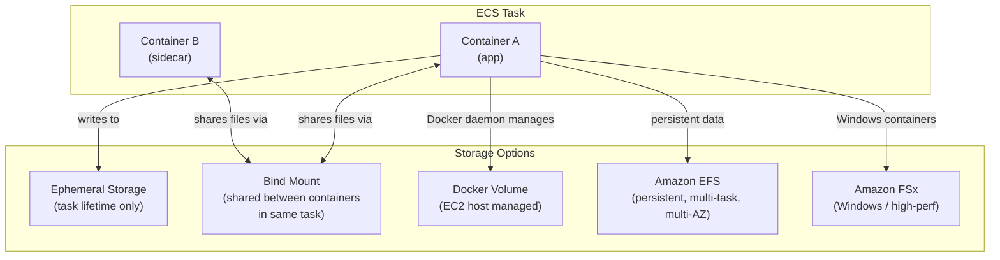
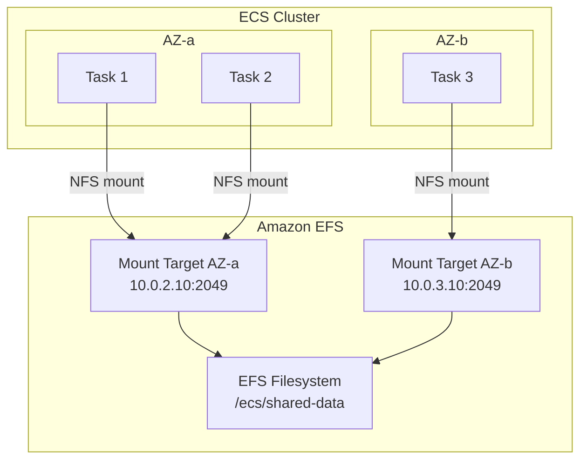
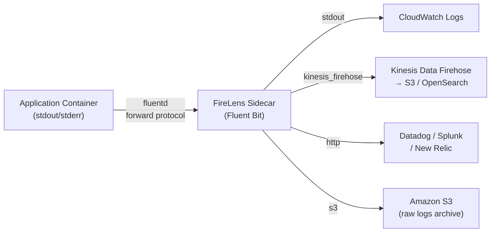
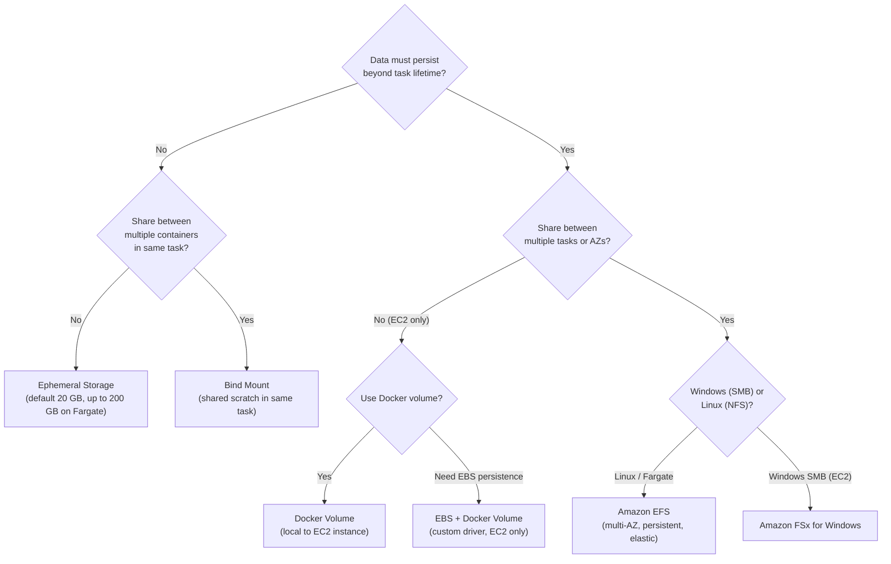

# ECS Storage, Logging & Observability - SAA-C03 Deep Dive

> ECS tasks can use ephemeral storage (lost when the task stops), bind mounts (share files between containers in the same task), Docker volumes (managed by Docker daemon), or Amazon EFS (persistent, shared, multi-AZ storage). Fargate ephemeral storage defaults to 20 GB and can be expanded up to 200 GB.

See also: [01 - ECS Fundamentals & Architecture](01%20-%20ECS%20Fundamentals%20%26%20Architecture.md) · [02 - ECS Launch Types - EC2 vs Fargate](02%20-%20ECS%20Launch%20Types%20-%20EC2%20vs%20Fargate.md) · [03 - ECS Task Definitions, Tasks & Services](03%20-%20ECS%20Task%20Definitions%2C%20Tasks%20%26%20Services.md) · [04 - ECS Networking & Load Balancing](04%20-%20ECS%20Networking%20%26%20Load%20Balancing.md) · [05 - ECS IAM & Security](05%20-%20ECS%20IAM%20%26%20Security.md) · [06 - ECS Auto Scaling & Capacity](06%20-%20ECS%20Auto%20Scaling%20%26%20Capacity.md) · [08 - ECS Exam Scenarios & Q&A](08%20-%20ECS%20Exam%20Scenarios%20%26%20Q%26A.md) · [01 - ECR Fundamentals & Architecture](01%20-%20ECR%20Fundamentals%20%26%20Architecture.md) · [01 - EKS Fundamentals & Architecture](01%20-%20EKS%20Fundamentals%20%26%20Architecture.md) · [01 - ECS Anywhere Fundamentals & Architecture](01%20-%20ECS%20Anywhere%20Fundamentals%20%26%20Architecture.md)

---

## Table of Contents

- [ECS Storage Options Overview](#ecs-storage-options-overview)
- [Bind Mounts](#bind-mounts)
- [Docker Volumes (EC2 Only)](#docker-volumes-ec2-only)
- [Amazon EFS Volumes](#amazon-efs-volumes)
- [Fargate Ephemeral Storage](#fargate-ephemeral-storage)
- [Amazon FSx for Windows](#amazon-fsx-for-windows)
- [Logging with the awslogs Driver](#logging-with-the-awslogs-driver)
- [FireLens - Advanced Log Routing](#firelens---advanced-log-routing)
- [Container Insights](#container-insights)
- [CloudWatch Metrics for ECS](#cloudwatch-metrics-for-ecs)
- [Storage and Logging Decision Guide](#storage-and-logging-decision-guide)

---



---

## ECS Storage Options Overview

| Storage Type      | Persistence         | Shared Across Tasks             | Fargate Support | EC2 Support   | Use Case                 |
| :---------------- | :------------------ | :------------------------------ | :-------------- | :------------ | :----------------------- |
| **Ephemeral**     | Task lifetime only  | No                              | Yes (20–200 GB) | Yes           | Temp files, cache        |
| **Bind Mount**    | Task lifetime       | Between containers in same task | Yes             | Yes           | Sidecar file sharing     |
| **Docker Volume** | Configurable (host) | No (local to instance)          | No              | Yes           | Local persistence        |
| **Amazon EFS**    | Permanent           | Yes (all tasks, any AZ)         | Yes             | Yes           | Shared data, ML datasets |
| **Amazon FSx**    | Permanent           | Yes (Windows)                   | No              | Yes (Windows) | Windows SMB workloads    |

---

[⬆ Back to top](#table-of-contents)

---

## Bind Mounts

A **bind mount** maps a host path (or a shared scratch space in Fargate) into one or more containers in the same task. It is the primary mechanism for sharing files between containers within a task.

### How Bind Mounts Work

```
Task
 ├── Container A mounts /mnt/shared at /app/input  (readOnly: false)
 └── Container B mounts /mnt/shared at /data/output (readOnly: false)

Both containers read/write the same directory — no network required.
```

### Task Definition Configuration

```json
{
  "volumes": [
    {
      "name": "shared-scratch",
      "host": {}
    }
  ],
  "containerDefinitions": [
    {
      "name": "writer",
      "mountPoints": [
        {
          "sourceVolume": "shared-scratch",
          "containerPath": "/output",
          "readOnly": false
        }
      ]
    },
    {
      "name": "reader",
      "mountPoints": [
        {
          "sourceVolume": "shared-scratch",
          "containerPath": "/input",
          "readOnly": true
        }
      ]
    }
  ]
}
```

### Bind Mount Locations

| Launch Type | Where Bind Mount Lives               | Notes                                                                                           |
| :---------- | :----------------------------------- | :---------------------------------------------------------------------------------------------- |
| **EC2**     | EC2 host filesystem                  | Survives task stop if you set a specific `host.sourcePath`; otherwise Docker picks the location |
| **Fargate** | Fargate ephemeral storage allocation | Lost when task stops; isolated per task                                                         |

**Exam Tip:** Bind mounts share data between containers in the **same task** only. To share data between different tasks or services, use Amazon EFS.

---

[⬆ Back to top](#table-of-contents)

---

## Docker Volumes (EC2 Only)

Docker volumes are managed by the Docker daemon and stored in `/var/lib/docker/volumes/` on the EC2 host.

### Docker Volume Types

| Driver                              | Description                    | Use Case                  |
| :---------------------------------- | :----------------------------- | :------------------------ |
| `local` (default)                   | Data stored on host filesystem | Simple local persistence  |
| Custom drivers (e.g., `rexray/ebs`) | Third-party volume plugins     | EBS attachment via Docker |

### Task Definition Configuration

```json
{
  "volumes": [
    {
      "name": "data-volume",
      "dockerVolumeConfiguration": {
        "scope": "shared",
        "autoprovision": true,
        "driver": "local",
        "driverOpts": {},
        "labels": { "app": "my-service" }
      }
    }
  ]
}
```

| `scope` Value | Lifetime                                                                              |
| :------------ | :------------------------------------------------------------------------------------ |
| `task`        | Volume created at task start, deleted when task stops                                 |
| `shared`      | Volume persists on the EC2 instance even after task stops; can be reused by new tasks |

**Limitations of Docker Volumes:**

- Data is local to one EC2 instance — not shared across tasks on different instances
- If instance is terminated, data is lost (unless backed by EBS with a custom driver)
- Not supported on Fargate

---

[⬆ Back to top](#table-of-contents)

---

## Amazon EFS Volumes

Amazon EFS is the recommended persistent storage solution for ECS tasks. It provides:

- **Persistent** storage (survives task stop/restart)
- **Shared** access (multiple tasks across multiple AZs read/write simultaneously)
- **Elastic** capacity (scales to petabytes automatically)
- **NFSv4** protocol (POSIX-compliant filesystem)

### EFS + ECS Architecture



### Task Definition Configuration

```json
{
  "volumes": [
    {
      "name": "efs-data",
      "efsVolumeConfiguration": {
        "fileSystemId": "fs-0abc12345def67890",
        "rootDirectory": "/",
        "transitEncryption": "ENABLED",
        "authorizationConfig": {
          "accessPointId": "fsap-0123456789abcdef",
          "iam": "ENABLED"
        }
      }
    }
  ],
  "containerDefinitions": [
    {
      "name": "ml-worker",
      "mountPoints": [
        {
          "sourceVolume": "efs-data",
          "containerPath": "/data/models",
          "readOnly": false
        }
      ]
    }
  ]
}
```

### EFS Access Points

Access points are application-specific entry points into an EFS filesystem:

| Feature              | Benefit                                                                                   |
| :------------------- | :---------------------------------------------------------------------------------------- |
| **Root directory**   | Each access point enforces a root directory — app only sees its own subtree               |
| **POSIX user/group** | Enforce specific UID/GID regardless of container user                                     |
| **IAM enforcement**  | With `iam: ENABLED`, mount requires ECS task role to have `elasticfilesystem:ClientMount` |

### EFS Security Group

EFS mount targets need a security group that allows NFS traffic (port 2049):

```
EFS Mount Target SG: inbound TCP 2049 from Task SG
Task SG: outbound TCP 2049 to EFS Mount Target SG
```

### EFS Performance Modes

| Mode                          | Use Case                                                 |
| :---------------------------- | :------------------------------------------------------- |
| **General Purpose** (default) | Latency-sensitive: web serving, content management       |
| **Max I/O**                   | Highly parallel: big data, media processing, ML training |

### EFS Throughput Modes

| Mode            | How It Works                           | Use Case                         |
| :-------------- | :------------------------------------- | :------------------------------- |
| **Bursting**    | Throughput scales with storage size    | Variable workloads               |
| **Provisioned** | Fixed throughput regardless of storage | Consistently high throughput     |
| **Elastic**     | Auto-scales throughput up and down     | Unpredictable or spiky workloads |

**Exam Rule:** EFS is the go-to answer when the scenario requires:

- Persistent storage that survives task restarts
- Multiple tasks sharing the same data
- Multi-AZ access to the same filesystem

---

[⬆ Back to top](#table-of-contents)

---

## Fargate Ephemeral Storage

Every Fargate task gets **ephemeral storage** that is:

- Isolated to that task (not shared with other tasks)
- Deleted permanently when the task stops
- Encrypted at rest with AES-256

### Default and Maximum Sizes

| Property                        | Value                                                    |
| :------------------------------ | :------------------------------------------------------- |
| **Default size**                | 20 GB                                                    |
| **Maximum size (configurable)** | 200 GB                                                   |
| **Billing**                     | First 20 GB free; additional storage charged per GB-hour |

### Configuring Ephemeral Storage

```json
{
  "family": "large-batch-job",
  "requiresCompatibilities": ["FARGATE"],
  "cpu": "4096",
  "memory": "8192",
  "ephemeralStorage": {
    "sizeInGiB": 100
  },
  "containerDefinitions": [...]
}
```

### What Lives in Ephemeral Storage

| Content                   | Location                                   |
| :------------------------ | :----------------------------------------- |
| Container images (layers) | Deducted from ephemeral storage allocation |
| Container writable layer  | In ephemeral storage                       |
| `tmpfs` mounts            | RAM, not ephemeral storage                 |
| Bind mounts               | In ephemeral storage                       |

**Exam Trap:** If a Fargate task fails with `no space left on device` errors, increase ephemeral storage — especially for tasks pulling large Docker images.

---

[⬆ Back to top](#table-of-contents)

---

## Amazon FSx for Windows

For Windows container workloads that need shared SMB storage, ECS supports Amazon FSx for Windows File Server.

| Property            | Detail                                                               |
| :------------------ | :------------------------------------------------------------------- |
| **Protocol**        | SMB (Windows file sharing)                                           |
| **Fargate support** | No — EC2 Windows launch type only                                    |
| **Use case**        | Windows apps requiring shared .NET config files, user profiles, etc. |
| **Authentication**  | Active Directory integration                                         |

---

[⬆ Back to top](#table-of-contents)

---

## Logging with the awslogs Driver

The `awslogs` log driver is the simplest way to send container stdout/stderr to CloudWatch Logs. It requires no sidecar containers.

### Configuration

```json
{
  "logConfiguration": {
    "logDriver": "awslogs",
    "options": {
      "awslogs-group": "/ecs/my-service",
      "awslogs-region": "us-east-1",
      "awslogs-stream-prefix": "ecs",
      "awslogs-create-group": "true",
      "awslogs-multiline-pattern": "^\\d{4}-\\d{2}-\\d{2}"
    }
  }
}
```

### Log Stream Naming

With `awslogs-stream-prefix: ecs`:

```
Log Group: /ecs/my-service
Log Stream: ecs/<container-name>/<task-id>
             ecs/api/a1b2c3d4-1234-5678-abcd-ef1234567890
```

### awslogs Options Reference

| Option                      | Required    | Description                              |
| :-------------------------- | :---------- | :--------------------------------------- |
| `awslogs-group`             | Yes         | CloudWatch Logs log group name           |
| `awslogs-region`            | Yes         | AWS region for the log group             |
| `awslogs-stream-prefix`     | Recommended | Prefix for log stream names              |
| `awslogs-create-group`      | Optional    | Auto-create log group if not exists      |
| `awslogs-multiline-pattern` | Optional    | Regex to detect multi-line log entries   |
| `awslogs-datetime-format`   | Optional    | strftime format for multi-line detection |

### Required IAM Permission

The **task execution role** needs:

```json
{
  "Effect": "Allow",
  "Action": [
    "logs:CreateLogStream",
    "logs:PutLogEvents",
    "logs:CreateLogGroup"
  ],
  "Resource": "arn:aws:logs:*:*:log-group:/ecs/*:*"
}
```

---

[⬆ Back to top](#table-of-contents)

---

## FireLens - Advanced Log Routing

FireLens is ECS's log routing framework. It uses **Fluent Bit** or **Fluentd** as a sidecar container to route logs to multiple destinations simultaneously.

### FireLens Architecture



### FireLens Task Definition

```json
{
  "containerDefinitions": [
    {
      "name": "log-router",
      "image": "amazon/aws-for-fluent-bit:stable",
      "essential": true,
      "firelensConfiguration": {
        "type": "fluentbit",
        "options": {
          "enable-ecs-log-metadata": "true"
        }
      }
    },
    {
      "name": "app",
      "image": "my-app:latest",
      "logConfiguration": {
        "logDriver": "awsfirelens",
        "options": {
          "Name": "cloudwatch",
          "region": "us-east-1",
          "log_group_name": "/ecs/my-app",
          "log_stream_prefix": "ecs/",
          "auto_create_group": "true"
        }
      },
      "dependsOn": [{ "containerName": "log-router", "condition": "START" }]
    }
  ]
}
```

### FireLens vs awslogs

| Feature                | awslogs              | FireLens                                      |
| :--------------------- | :------------------- | :-------------------------------------------- |
| **Destinations**       | CloudWatch Logs only | Any (CW, S3, Firehose, Datadog, Splunk, etc.) |
| **Log transformation** | None                 | Filter, parse, enrich logs                    |
| **Multi-destination**  | No                   | Yes                                           |
| **Complexity**         | Low                  | Medium                                        |
| **Sidecar required**   | No                   | Yes (Fluent Bit container)                    |
| **Best for**           | Simple CW logging    | Advanced routing, third-party SIEMs           |

---

[⬆ Back to top](#table-of-contents)

---

## Container Insights

**CloudWatch Container Insights** provides cluster-level and service-level metrics and logs for ECS clusters.

### Enabling Container Insights

```bash
# For new clusters
aws ecs create-cluster \
  --cluster-name my-cluster \
  --settings name=containerInsights,value=enabled

# For existing clusters
aws ecs update-cluster-settings \
  --cluster my-cluster \
  --settings name=containerInsights,value=enabled
```

### Container Insights Metrics

| Metric              | Granularity            | Description                         |
| :------------------ | :--------------------- | :---------------------------------- |
| `CpuUtilized`       | Task, Service, Cluster | Actual CPU consumed                 |
| `CpuReserved`       | Task, Service, Cluster | CPU allocated in task definition    |
| `MemoryUtilized`    | Task, Service, Cluster | Actual memory consumed              |
| `MemoryReserved`    | Task, Service, Cluster | Memory allocated in task definition |
| `NetworkRxBytes`    | Task                   | Bytes received                      |
| `NetworkTxBytes`    | Task                   | Bytes transmitted                   |
| `StorageReadBytes`  | Task                   | Disk read bytes                     |
| `StorageWriteBytes` | Task                   | Disk write bytes                    |
| `RunningTaskCount`  | Service, Cluster       | Number of running tasks             |
| `PendingTaskCount`  | Service, Cluster       | Tasks waiting for capacity          |

### Container Insights Performance Log Events

Container Insights also publishes detailed JSON performance log events to CloudWatch Logs:

```
Log Group: /aws/ecs/containerinsights/<cluster-name>/performance
```

These events contain granular per-task, per-container performance data that you can query with CloudWatch Logs Insights.

---

[⬆ Back to top](#table-of-contents)

---

## CloudWatch Metrics for ECS

### Default ECS Metrics (No Container Insights Required)

These metrics are published automatically for every ECS service:

| Metric              | Namespace | Description                          |
| :------------------ | :-------- | :----------------------------------- |
| `CPUUtilization`    | `AWS/ECS` | CPU usage as % of reserved CPU       |
| `MemoryUtilization` | `AWS/ECS` | Memory usage as % of reserved memory |
| `RunningTaskCount`  | `AWS/ECS` | Tasks in RUNNING state               |
| `PendingTaskCount`  | `AWS/ECS` | Tasks in PENDING state               |

**Important:** ECS default CPU/memory metrics are percentages of **reserved** (allocated) CPU/memory, not of the EC2 instance capacity. A task using 50% of its reservation might be at 25% of the underlying instance.

### CloudWatch Dashboard for ECS

Key metrics to put on an ECS operations dashboard:

```
- RunningTaskCount (target = desiredCount)
- PendingTaskCount (should be 0 in steady state)
- CPUUtilization per service (use as scaling trigger)
- MemoryUtilization per service
- ALBRequestCountPerTarget (from ALB namespace)
- HTTPCode_Target_5XX_Count (from ALB)
```

---

[⬆ Back to top](#table-of-contents)

---

## Storage and Logging Decision Guide

### Storage Decision Tree



### Logging Decision Guide

| Requirement                               | Solution                      |
| :---------------------------------------- | :---------------------------- |
| Send logs to CloudWatch only              | `awslogs` driver              |
| Send logs to S3, Firehose, or third-party | FireLens (Fluent Bit)         |
| Route logs to multiple destinations       | FireLens                      |
| Parse/filter/transform logs               | FireLens                      |
| No extra containers wanted                | `awslogs` driver              |
| Full cluster metrics and performance data | CloudWatch Container Insights |
| Query logs with SQL-like syntax           | CloudWatch Logs Insights      |

---

[⬆ Back to top](#table-of-contents)
