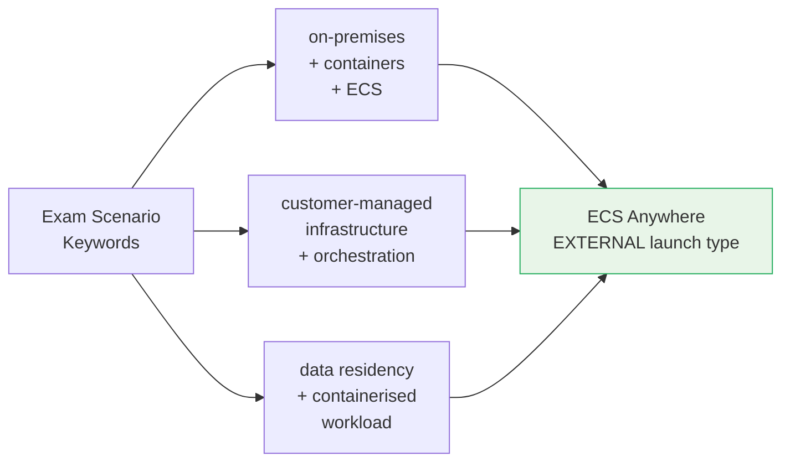

# ECS Anywhere Exam Scenarios & Q&A - SAA-C03 Deep Dive

> Exam-ready MCQs, a decision table comparing ECS / ECS Anywhere / EKS Anywhere / Outposts, and a one-page cheat sheet to cement ECS Anywhere for SAA-C03.

See also: [01 - ECS Anywhere Fundamentals & Architecture](01%20-%20ECS%20Anywhere%20Fundamentals%20%26%20Architecture.md) · [02 - ECS Anywhere Setup, Networking & Use Cases](02%20-%20ECS%20Anywhere%20Setup%2C%20Networking%20%26%20Use%20Cases.md) · [01 - ECS Fundamentals & Architecture](01%20-%20ECS%20Fundamentals%20%26%20Architecture.md) · [01 - EKS Anywhere Fundamentals & Architecture](01%20-%20EKS%20Anywhere%20Fundamentals%20%26%20Architecture.md)

---

## Table of Contents

- [Part 1: Exam-Style MCQs](#part-1-exam-style-mcqs)
- [Part 2: Decision Table — ECS vs ECS Anywhere vs EKS Anywhere vs Outposts](#part-2-decision-table--ecs-vs-ecs-anywhere-vs-eks-anywhere-vs-outposts)
- [Part 3: Cheat Sheet](#part-3-cheat-sheet)
- [Part 4: Common Exam Traps Summary](#part-4-common-exam-traps-summary)

---



---

## Part 1: Exam-Style MCQs

---

### Question 1

A company runs containerised microservices on Amazon ECS using the Fargate launch type. New compliance requirements mandate that payment processing containers must execute on servers physically located within the company's own data centre and must not transmit raw payment data to any cloud provider. The team wants to keep using ECS for operational consistency.

**Which solution meets these requirements with the LEAST operational overhead?**

A. Migrate the payment containers to EC2 instances in a VPC and use AWS PrivateLink to restrict data from leaving the VPC.

B. Use ECS Anywhere with the EXTERNAL launch type, running the payment containers on on-premises servers registered via SSM activation.

C. Deploy the payment containers on AWS Outposts racks installed in the company's data centre.

D. Re-architect the payment workload as Lambda functions and use VPC endpoints to ensure data stays within the company's AWS account.

**Answer: B**

**Explanation:** ECS Anywhere (EXTERNAL launch type) is the purpose-built solution for running ECS-managed containers on customer-owned on-premises infrastructure. The containers execute locally — raw payment data never transits to AWS. Outposts (C) would also keep data physically on-prem, but AWS owns and manages the Outposts hardware, meaning the physical server is not the customer's own infrastructure — and Outposts has significantly higher cost and setup time.

**Exam Tip:** "Physically within company data centre" + "existing ECS tooling" = ECS Anywhere. "Company must own the hardware" rules out Outposts.

---

### Question 2

A solutions architect is designing an ECS Anywhere deployment. On-premises servers have been registered as EXTERNAL container instances. The architect wants to front the containerised API with an Application Load Balancer to enable HTTPS termination and path-based routing.

**What should the architect do?**

A. Configure the ALB target group to use IP targets and specify the on-premises server IP addresses.

B. Create an ECS service with the EXTERNAL launch type and attach an ALB target group in the `--load-balancers` parameter.

C. Use AWS Cloud Map for DNS-based service discovery instead, as ALB integration is not supported for EXTERNAL instances.

D. Install an AWS Load Balancer Controller on the on-premises servers to enable ALB integration with EXTERNAL instances.

**Answer: C**

**Explanation:** EXTERNAL container instances are not inside a VPC. AWS cannot route traffic from an ALB to an on-premises IP address without a Direct Connect or VPN connection, and even then ALB target group registration for EXTERNAL ECS instances is not supported. Cloud Map provides DNS-based service discovery as the recommended alternative.

**Exam Trap:** Option A is tempting because ALB does support IP targets — but that is for Fargate tasks using awsvpc networking inside a VPC. EXTERNAL instances have no VPC subnet membership and no security group association.

---

### Question 3

An engineer runs the ECS Anywhere installation script on an on-premises Ubuntu server. The script fails during SSM Agent registration with the error: "ActivationCode is expired."

**What is the MOST likely cause?**

A. The IAM role attached to the SSM activation does not have the `AmazonSSMManagedInstanceCore` policy.

B. The SSM activation was created with an expiration date that has already passed.

C. The ECS cluster does not exist in the specified region.

D. The server's Docker version is incompatible with the ECS Agent.

**Answer: B**

**Explanation:** SSM activations have an expiration date (default 24 hours from creation). If the activation was created earlier and the engineer tries to register after expiry, the SSM Agent registration fails with an expired code error. The fix is to create a new SSM activation and re-run the script.

**Exam Tip:** Remember the lifecycle of SSM activations — they expire. IAM role issues would produce an `AccessDenied` error, not an "expired" error.

---

### Question 4

A company needs to run ECS tasks on servers in their data centre. They want tasks to continue running if the internet connection between the data centre and AWS is temporarily lost.

**What happens to ALREADY RUNNING ECS tasks on EXTERNAL instances when connectivity to AWS is lost?**

A. ECS detects the loss of connectivity and immediately stops all running tasks on the external instances.

B. Tasks continue running. The ECS Agent cannot receive new instructions but does not stop running containers. State is reconciled when connectivity is restored.

C. Tasks continue running, but the ECS Agent automatically restarts all tasks once connectivity is restored to ensure they are in a known good state.

D. ECS automatically fails over the tasks to EC2 instances in the nearest AWS region.

**Answer: B**

**Explanation:** The ECS Agent is responsible for starting and stopping containers. When connectivity is lost, the agent cannot poll the ECS control plane for new instructions, but it does not proactively terminate running containers. Containers continue to run. Once connectivity is restored, the agent reconnects, reports current state, and the ECS scheduler reconciles desired vs actual state.

**Exam Tip:** ECS Anywhere is designed for environments with intermittent connectivity. This resilience behaviour is architecturally intentional.

---

### Question 5

A development team wants to use ECS Anywhere to run containers on Windows Server 2022 machines in their data centre. They plan to deploy Windows containers.

**Is this configuration supported? What should they do?**

A. Yes. ECS Anywhere supports Windows Server 2016, 2019, and 2022 as EXTERNAL container instances.

B. No. ECS Anywhere only supports Linux. They should use EKS Anywhere with Windows node support or standard ECS on EC2 for Windows containers.

C. Yes, but they must use the `WINDOWS_SERVER_2022_FULL` task definition OS family attribute with the EXTERNAL launch type.

D. Yes, but Windows external instances must be registered manually via the `RegisterContainerInstance` API, not via the installation script.

**Answer: B**

**Explanation:** ECS Anywhere supports Linux operating systems only. Windows containers on customer-managed hardware are not supported via ECS Anywhere. For Windows containers, customers must use ECS on EC2 (Windows EC2 instances) or ECS on Windows Server (using the `WINDOWS_SERVER_*` platform family), both of which run in AWS — not on-premises via ECS Anywhere.

**Exam Trap:** Windows support exists for standard ECS (on EC2). This is frequently offered as a distractor to trick candidates into thinking ECS Anywhere supports it.

---

### Question 6

A company is evaluating the cost of ECS Anywhere for 50 on-premises servers running 24/7 for 30 days. They understand ECS Anywhere charges $0.01025 per registered external instance per hour.

**What is the approximate monthly cost for the ECS Anywhere management fee?**

A. $5.13
B. $37.41
C. $374.13
D. $3,741.25

**Answer: C**

**Explanation:** 50 instances × 720 hours/month × $0.01025 = **$369.00** (approximately $374 using 730 hours). Option C ($374.13) matches 50 × 730 × $0.01025. Note: this fee is only for the ECS orchestration layer — the company also pays for its own hardware, network, and power separately.

**Exam Tip:** Pricing questions on SAA-C03 usually test concepts rather than arithmetic, but understanding the billing unit (per registered instance per hour) is important. Key point: you are billed whether or not tasks are running.

---

### Question 7

An organisation runs a three-tier application: a web tier on Fargate, an application tier on EC2, and a legacy database tier that must remain on-premises due to licensing agreements. The application tier containers need to communicate with the on-premises database.

**Which service should the architect use to extend ECS management to the on-premises database servers while maintaining the existing architecture?**

A. AWS Outposts — deploy the database tier on an Outposts rack for seamless VPC integration.

B. ECS Anywhere — register the on-premises database servers as EXTERNAL container instances in the same ECS cluster.

C. AWS Direct Connect — establish a dedicated network connection to allow the EC2 application tier to reach the on-premises database.

D. This architecture is not possible with ECS; the database tier must be migrated to Amazon RDS.

**Answer: C**

**Explanation:** The database tier is a legacy application, not a containerised workload. ECS Anywhere is for running **container workloads** on external infrastructure — it cannot manage a bare-metal database process. The correct solution for network connectivity between EC2 and an on-premises database is Direct Connect (or VPN). ECS Anywhere (B) is incorrect because the database is not a container. Outposts (A) could provide VPC extension, but the scenario says the database must remain due to licensing — implying no movement of the software.

**Exam Trap:** Do not apply ECS Anywhere to non-container workloads. It is a container orchestration extension, not a general hybrid connectivity tool.

---

### Question 8

A solutions architect needs to run containerised batch jobs on customer-managed GPU servers in a private data centre. The servers have no outbound internet access but do have AWS Direct Connect to a VPC with interface endpoints for AWS services.

**Which statement about this ECS Anywhere configuration is TRUE?**

A. ECS Anywhere requires a public internet connection; Direct Connect with interface endpoints is not sufficient.

B. ECS Anywhere can work without public internet access if the servers can reach SSM, ECS, ECR, and CloudWatch Logs endpoints via Direct Connect and interface endpoints in the VPC.

C. ECS Anywhere requires the FARGATE_SPOT launch type for GPU workloads to reduce costs.

D. The external instances must be placed in a VPC subnet to use Direct Connect.

**Answer: B**

**Explanation:** ECS Anywhere communicates over HTTPS (port 443) to a set of AWS service endpoints. If those endpoints are reachable via AWS PrivateLink interface endpoints connected through Direct Connect, the external instances do not need public internet access. The required endpoints include `ssm`, `ssmmessages`, `ec2messages`, `ecs`, `ecr.api`, `*.dkr.ecr`, and `logs`. This enables fully private ECS Anywhere deployments.

**Exam Tip:** Public internet is the simplest path but not the only path. For air-gapped or highly secure environments, Direct Connect + interface endpoints is the supported alternative.

---

## Part 2: Decision Table — ECS vs ECS Anywhere vs EKS Anywhere vs Outposts

Use this table to quickly identify the right service in exam scenarios.

| Criteria                   | Standard ECS (EC2/Fargate)         | ECS Anywhere                                    | EKS Anywhere                         | AWS Outposts                              |
| :------------------------- | :--------------------------------- | :---------------------------------------------- | :----------------------------------- | :---------------------------------------- |
| **Compute owner**          | AWS                                | Customer                                        | Customer                             | AWS (rack)                                |
| **Container orchestrator** | ECS                                | ECS                                             | Kubernetes                           | ECS / EKS                                 |
| **On-premises capable**    | No                                 | Yes                                             | Yes                                  | Yes                                       |
| **Hardware provisioning**  | AWS                                | Customer                                        | Customer                             | AWS ships rack                            |
| **Kubernetes API**         | No                                 | No                                              | Yes                                  | Yes (EKS on Outposts)                     |
| **Windows containers**     | Yes (EC2)                          | No                                              | Yes                                  | Yes                                       |
| **ALB integration**        | Yes                                | No                                              | Via Ingress                          | Yes                                       |
| **VPC networking**         | Yes                                | No                                              | No                                   | Yes (VPC extended)                        |
| **EBS volumes**            | Yes                                | No                                              | No                                   | Yes                                       |
| **Offline operation**      | N/A                                | Partial                                         | Partial                              | Partial                                   |
| **Setup time**             | Minutes                            | Minutes                                         | Hours                                | Weeks                                     |
| **Cost model**             | Per compute used                   | Per instance/hour + HW                          | Per instance/hour + HW               | Outpost rack fee (high)                   |
| **Keyword triggers**       | "serverless containers", "managed" | "ECS on-prem", "own hardware", "data residency" | "Kubernetes on-prem", "own hardware" | "full AWS stack on-prem", "VPC extension" |

### Quick Decision Rules

1. **ECS + "must stay on customer hardware"** → ECS Anywhere
2. **Kubernetes + "must stay on customer hardware"** → EKS Anywhere
3. **"Full AWS services on-prem" + budget for AWS rack** → Outposts
4. **"Serverless" or "no server management"** → Fargate
5. **"Containers" + "Windows" + "on-prem"** → EKS Anywhere (not ECS Anywhere)
6. **"VPC extension to data centre"** → Outposts

[⬆ Back to top](#table-of-contents)

---

## Part 3: Cheat Sheet

```
ECS ANYWHERE — SAA-C03 CHEAT SHEET
═══════════════════════════════════════════════════════════════════

WHAT:   Run ECS-managed container tasks on CUSTOMER-OWNED infrastructure
        (on-prem, edge, other cloud)

LAUNCH TYPE:   EXTERNAL   ← this exact word on the exam

AGENTS REQUIRED:
  1. AWS SSM Agent  — channel to AWS, instance authentication
  2. Amazon ECS Agent — task lifecycle, resource tracking

REGISTRATION:
  Step 1: aws ssm create-activation  (get ActivationId + ActivationCode)
  Step 2: Run ecs-anywhere-install.sh on the external instance
  Step 3: Instance appears as EXTERNAL in ECS cluster

NETWORKING:
  ✅ Outbound HTTPS 443 to AWS endpoints (SSM, ECS, ECR, CW Logs)
  ✅ Works with public internet OR Direct Connect + PrivateLink
  ❌ No inbound connections from AWS required
  ❌ Instances are NOT in a VPC

WHAT IS SUPPORTED:
  ✅ Linux (x86_64 and ARM64)
  ✅ Task definitions (same as EC2 launch type, minus awsvpc)
  ✅ CloudWatch Logs
  ✅ ECR image pulls
  ✅ Cloud Map service discovery
  ✅ Placement strategies and constraints
  ✅ IAM task roles

WHAT IS NOT SUPPORTED:
  ❌ ALB / NLB target group registration
  ❌ Fargate launch type
  ❌ Windows containers
  ❌ awsvpc networking mode
  ❌ EBS / EFS auto-attach via ECS
  ❌ Capacity providers / Auto Scaling
  ❌ Security groups

PRICING:
  $0.01025 per registered external instance per hour
  (charged whether tasks are running or not)

KEY USE CASES:
  • Data residency / regulatory compliance
  • Low-latency edge processing
  • Leverage existing hardware investment
  • Hybrid: on-prem + cloud in same ECS cluster
  • Intermittently connected environments

EXAM TRAPS:
  ❌ "ALB for ECS Anywhere" — WRONG (no load balancer)
  ❌ "ECS Anywhere supports Windows" — WRONG (Linux only)
  ❌ "Fargate for on-prem" — WRONG (Fargate = AWS compute)
  ❌ "ECS Anywhere = Outposts" — WRONG (Outposts = AWS hardware)
  ❌ "Need VPN for ECS Anywhere" — WRONG (outbound HTTPS is enough)

COMPARED TO OUTPOSTS:
  ECS Anywhere: YOUR hardware, ECS only, fast setup, low cost
  Outposts:     AWS hardware, full AWS stack, weeks to deploy, high cost

═══════════════════════════════════════════════════════════════════
```

[⬆ Back to top](#table-of-contents)

---

## Part 4: Common Exam Traps Summary

| Trap                     | What Exam Says                                           | Correct Understanding                                                                           |
| :----------------------- | :------------------------------------------------------- | :---------------------------------------------------------------------------------------------- |
| **ALB trap**             | "Configure ALB to route traffic to ECS Anywhere tasks"   | NOT POSSIBLE. EXTERNAL instances are not in a VPC and cannot be ALB targets. Use Cloud Map.     |
| **Windows trap**         | "ECS Anywhere for Windows containers on-prem"            | NOT SUPPORTED. ECS Anywhere is Linux-only. Use EKS Anywhere or move workload to EC2.            |
| **Fargate trap**         | "Use Fargate launch type for on-prem cost savings"       | NOT POSSIBLE. Fargate runs exclusively on AWS-managed compute. On-prem requires EXTERNAL.       |
| **VPN requirement trap** | "ECS Anywhere requires VPN or Direct Connect"            | FALSE. Outbound HTTPS is sufficient. VPN/DX is optional for private environments.               |
| **Outposts confusion**   | "AWS Outposts lets you use your own on-prem hardware"    | FALSE. Outposts is AWS-owned hardware that AWS ships to you. ECS Anywhere is your hardware.     |
| **Billing trap**         | "You are charged per task running on EXTERNAL instances" | FALSE. Billing is per registered EXTERNAL instance per hour, regardless of task count.          |
| **awsvpc trap**          | "Use awsvpc for better isolation on EXTERNAL instances"  | NOT SUPPORTED. awsvpc requires VPC/ENI integration. EXTERNAL instances use bridge or host mode. |
| **EFS auto-mount trap**  | "ECS Anywhere auto-mounts EFS volumes like Fargate does" | FALSE. EFS must be manually mounted at the OS level on external instances.                      |

[⬆ Back to top](#table-of-contents)
