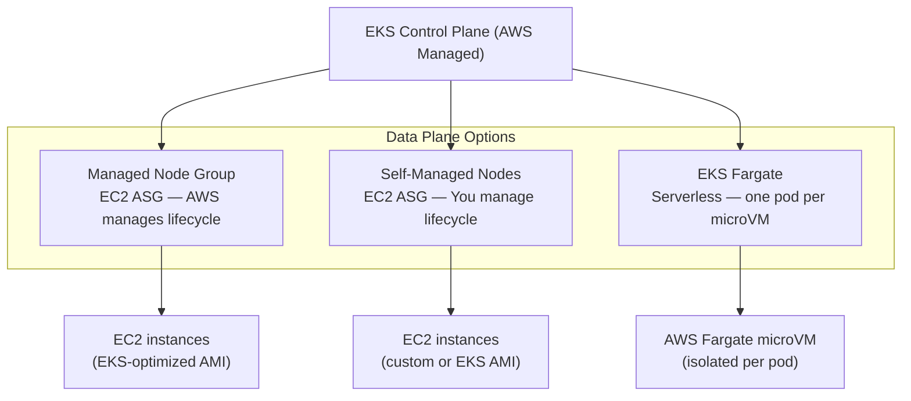
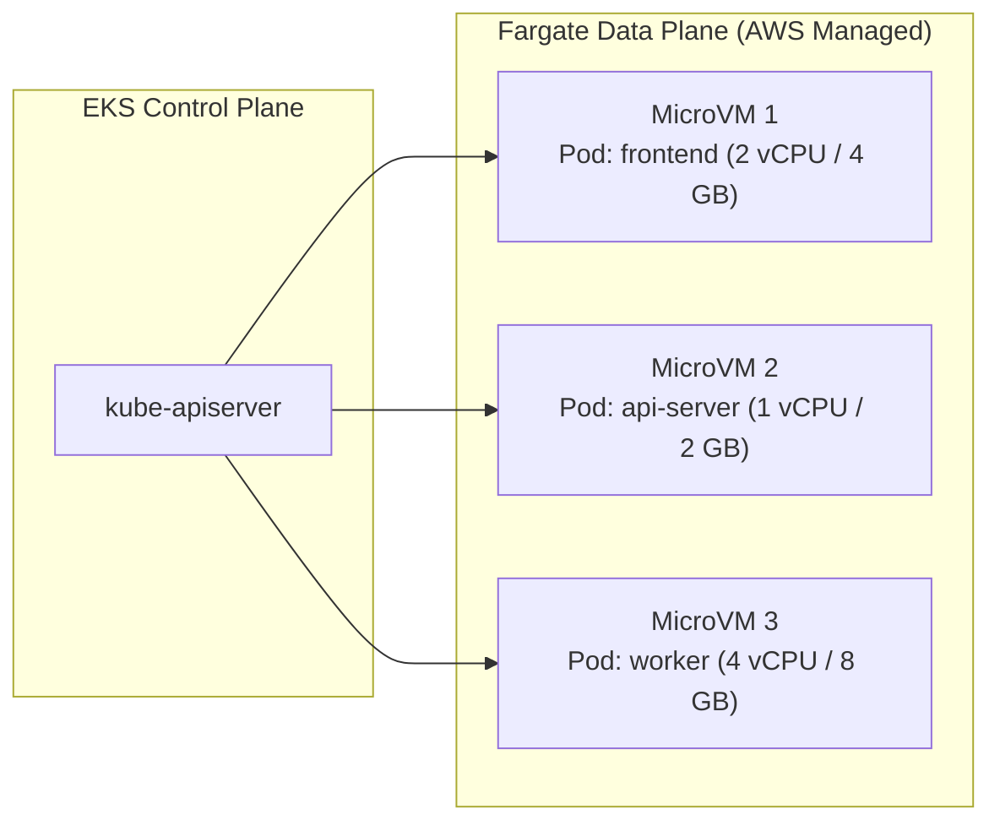
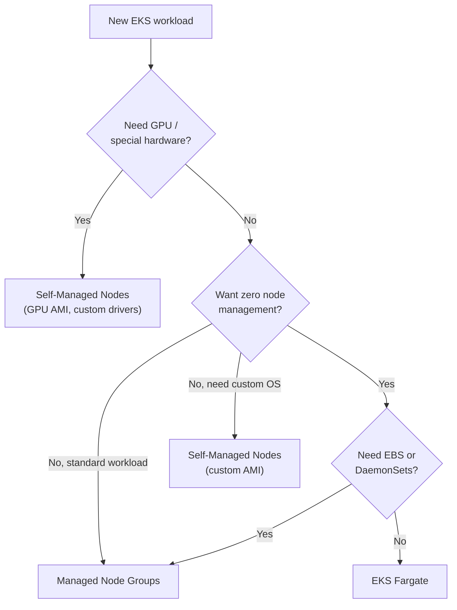

# EKS Node Types - Managed, Self-Managed, Fargate - SAA-C03 Deep Dive

> EKS gives you three data-plane models: Managed Node Groups (AWS patches the OS), Self-Managed Nodes (full control), and Fargate (serverless, per-pod micro-VMs) — pick based on ops overhead vs customisation needs.

See also: [01 - EKS Fundamentals & Architecture](01%20-%20EKS%20Fundamentals%20%26%20Architecture.md) · [03 - EKS Networking - VPC CNI, Load Balancing & Ingress](03%20-%20EKS%20Networking%20-%20VPC%20CNI%2C%20Load%20Balancing%20%26%20Ingress.md) · [04 - EKS IAM, IRSA, Pod Identity & Security](04%20-%20EKS%20IAM%2C%20IRSA%2C%20Pod%20Identity%20%26%20Security.md) · [06 - EKS Scaling & Observability](06%20-%20EKS%20Scaling%20%26%20Observability.md) · [07 - EKS Exam Scenarios & Q&A](07%20-%20EKS%20Exam%20Scenarios%20%26%20Q%26A.md)

---

## Table of Contents

- [Managed Node Groups](#managed-node-groups)
- [Self-Managed Nodes](#self-managed-nodes)
- [EKS on Fargate](#eks-on-fargate)
- [Node Type Comparison Table](#node-type-comparison-table)
- [EKS-Optimized AMIs](#eks-optimized-amis)
- [Node Lifecycle & Upgrades](#node-lifecycle--upgrades)
- [When to Use Each Node Type](#when-to-use-each-node-type)
- [eksctl Examples](#eksctl-examples)

---



---

## Managed Node Groups

### What They Are

A **Managed Node Group (MNG)** is the recommended default way to run worker nodes in EKS. AWS automates the provisioning and lifecycle management of the underlying EC2 instances using an Auto Scaling Group (ASG) that AWS owns and manages on your behalf.

### Key Characteristics

| Feature             | Details                                                 |
| :------------------ | :------------------------------------------------------ |
| **Provisioning**    | AWS creates and owns the ASG                            |
| **AMI**             | AWS publishes and maintains EKS-optimized AMIs          |
| **OS patching**     | AWS releases new AMI versions; you trigger the upgrade  |
| **Node draining**   | AWS automatically drains nodes before termination       |
| **Launch template** | Supported — customize instance types, storage, userdata |
| **Instance types**  | Any EC2 instance type (including GPU, Graviton)         |
| **Spot instances**  | Supported (configure capacity type in the node group)   |
| **Multi-AZ**        | Nodes distributed across AZs you specify                |

### Node Group Configuration

```yaml
# eksctl cluster config with Managed Node Group
apiVersion: eksctl.io/v1alpha5
kind: ClusterConfig

metadata:
  name: prod-cluster
  region: us-east-1

managedNodeGroups:
  - name: general-workers
    instanceType: m5.xlarge
    minSize: 2
    maxSize: 10
    desiredCapacity: 3
    volumeSize: 50
    ssh:
      allow: false
    labels:
      workload: general
    tags:
      Environment: production
    iam:
      withAddonPolicies:
        autoScaler: true
        albIngress: true
        cloudWatch: true

  - name: gpu-workers
    instanceType: p3.2xlarge
    minSize: 0
    maxSize: 4
    desiredCapacity: 0
    labels:
      hardware: gpu
    taints:
      - key: nvidia.com/gpu
        value: "true"
        effect: NoSchedule
```

### Managed Node Group Limitations

| Limitation           | Details                                                                                                   |
| :------------------- | :-------------------------------------------------------------------------------------------------------- |
| **Custom AMI**       | Limited support — must use AL2/AL2023/Bottlerocket-based or provide custom AMI that passes EKS validation |
| **Windows nodes**    | Supported but requires Windows-specific managed node groups                                               |
| **Control over ASG** | AWS owns the ASG; you cannot directly modify ASG launch configs                                           |

[⬆ Back to top](#table-of-contents)

---

## Self-Managed Nodes

### What They Are

With self-managed nodes, **you** create and manage the Auto Scaling Group and EC2 instances that join the EKS cluster. You are responsible for the full node lifecycle: provisioning, joining the cluster, patching the OS, and draining before termination.

### Key Characteristics

| Feature              | Details                                                               |
| :------------------- | :-------------------------------------------------------------------- |
| **ASG ownership**    | You create and own the ASG                                            |
| **AMI choice**       | Any AMI you want (must have kubelet + container runtime)              |
| **OS patching**      | Fully your responsibility                                             |
| **Node draining**    | Must configure lifecycle hooks yourself (or use Karpenter)            |
| **Flexibility**      | Maximum — custom kernels, custom AMIs, any instance type              |
| **Use cases**        | Custom OS hardening, specific kernel modules, GPU drivers, Windows    |
| **Bootstrap script** | `/etc/eks/bootstrap.sh` or custom — registers node with control plane |

### Joining a Self-Managed Node to EKS

```bash
#!/bin/bash
# User data script for self-managed node bootstrap
/etc/eks/bootstrap.sh my-cluster-name \
  --b64-cluster-ca ${CLUSTER_CA} \
  --apiserver-endpoint ${API_SERVER_URL} \
  --kubelet-extra-args '--node-labels=workload=custom,env=prod'
```

### Self-Managed Node with CloudFormation

AWS provides a CloudFormation template for self-managed node groups. You pass it the cluster name and it creates the ASG and IAM role automatically:

```bash
aws cloudformation create-stack \
  --stack-name my-worker-nodes \
  --template-url https://s3.amazonaws.com/amazon-eks/cloudformation/2022-12-23/amazon-eks-nodegroup.yaml \
  --parameters ParameterKey=ClusterName,ParameterValue=my-cluster \
               ParameterKey=NodeGroupName,ParameterValue=custom-workers \
               ParameterKey=NodeAutoScalingGroupMinSize,ParameterValue=1 \
               ParameterKey=NodeAutoScalingGroupMaxSize,ParameterValue=5
```

[⬆ Back to top](#table-of-contents)

---

## EKS on Fargate

### What It Is

EKS Fargate runs each Kubernetes pod in its own **isolated microVM** using AWS Fargate technology. There are no EC2 nodes to manage — you define a **Fargate Profile** that tells EKS which pods should run serverlessly.

### Fargate Architecture



### Fargate Profiles

A **Fargate Profile** selects which pods run on Fargate based on namespace and label selectors. Pods matching the profile are automatically scheduled onto Fargate; pods not matching run on EC2 nodes.

```yaml
# eksctl Fargate profile
apiVersion: eksctl.io/v1alpha5
kind: ClusterConfig

metadata:
  name: prod-cluster
  region: us-east-1

fargateProfiles:
  - name: serverless-apps
    selectors:
      - namespace: serverless
      - namespace: kube-system
        labels:
          k8s-app: kube-dns # run CoreDNS on Fargate

  - name: batch-jobs
    selectors:
      - namespace: batch
        labels:
          workload-type: batch
```

### Fargate Key Properties

| Property                  | Details                                                                     |
| :------------------------ | :-------------------------------------------------------------------------- |
| **Isolation**             | Each pod runs in a dedicated microVM (stronger isolation than shared nodes) |
| **Sizing**                | Pod resource requests determine vCPU/memory allocation                      |
| **Pricing**               | Per vCPU-second and per GB-second of memory (no idle node cost)             |
| **Networking**            | Each pod gets its own ENI (IP from your VPC subnet)                         |
| **Storage**               | Ephemeral storage only (up to 20 GB); no EBS attachment                     |
| **DaemonSets**            | Not supported on Fargate (no node-level daemon concept)                     |
| **Privileged containers** | Not supported                                                               |
| **Node selectors**        | Pods must match a Fargate profile                                           |
| **Stateful workloads**    | Not recommended (no persistent block storage)                               |

### Fargate Pod Sizing

Fargate allocates the smallest available resource combination that fits your pod's `requests`:

| vCPU | Memory Options |
| :--- | :------------- |
| 0.25 | 0.5, 1, 2 GB   |
| 0.5  | 1 – 4 GB       |
| 1    | 2 – 8 GB       |
| 2    | 4 – 16 GB      |
| 4    | 8 – 30 GB      |
| 8    | 16 – 60 GB     |
| 16   | 32 – 120 GB    |

> **Exam Trap:** Fargate pods cannot use EBS volumes. Use EFS for shared persistent storage with Fargate workloads.

[⬆ Back to top](#table-of-contents)

---

## Node Type Comparison Table

| Dimension           | Managed Node Groups                    | Self-Managed Nodes      | EKS Fargate               |
| :------------------ | :------------------------------------- | :---------------------- | :------------------------ |
| **Infrastructure**  | EC2 (AWS-managed ASG)                  | EC2 (your ASG)          | Serverless microVMs       |
| **OS management**   | AWS provides AMI versions              | You manage              | AWS manages               |
| **Node draining**   | Automatic                              | Manual/hooks required   | N/A                       |
| **Custom AMI**      | Limited (AL2/AL2023/Bottlerocket base) | Full flexibility        | N/A                       |
| **GPU/Inferentia**  | Supported                              | Supported               | Not supported             |
| **DaemonSets**      | Supported                              | Supported               | Not supported             |
| **EBS volumes**     | Supported                              | Supported               | Not supported             |
| **EFS volumes**     | Supported                              | Supported               | Supported                 |
| **Spot instances**  | Supported                              | Supported               | Not applicable            |
| **Pod density**     | High (many pods per node)              | High                    | One pod per microVM       |
| **Idle cost**       | EC2 instance cost                      | EC2 instance cost       | Zero (pay per pod-second) |
| **Startup latency** | Seconds (node already running)         | Seconds                 | 30–60 sec (cold start)    |
| **Best for**        | Most production workloads              | Custom OS/GPU workloads | Burst, batch, serverless  |

[⬆ Back to top](#table-of-contents)

---

## EKS-Optimized AMIs

AWS publishes and maintains **EKS-optimized AMIs** that include:

- Container runtime (containerd)
- kubelet configured for EKS
- AWS VPC CNI plugin
- SSM agent
- CloudWatch agent (optional)

### AMI Variants

| Variant                        | Base OS           | Use Case                                 |
| :----------------------------- | :---------------- | :--------------------------------------- |
| **Amazon Linux 2 (AL2)**       | Amazon Linux 2    | Standard workloads (legacy)              |
| **Amazon Linux 2023 (AL2023)** | Amazon Linux 2023 | Current default for new clusters         |
| **Bottlerocket**               | Bottlerocket OS   | Security-focused, minimal attack surface |
| **Windows Server 2019/2022**   | Windows Server    | Windows containers                       |
| **GPU** (AL2/AL2023 variant)   | AL2/AL2023        | NVIDIA GPU workloads                     |

### Finding the Latest AMI

```bash
# Get the latest AL2023 EKS-optimized AMI for k8s 1.30
aws ssm get-parameter \
  --name /aws/service/eks/optimized-ami/1.30/amazon-linux-2023/x86_64/standard/recommended/image_id \
  --query "Parameter.Value" \
  --output text
```

> **Exam Note:** EKS-optimized AMIs are published by AWS and available in AWS Marketplace. The AMI ID is region-specific and Kubernetes-version-specific. Managed Node Groups handle AMI selection automatically.

[⬆ Back to top](#table-of-contents)

---

## Node Lifecycle & Upgrades

### Managed Node Group Upgrade Process

When you upgrade a Managed Node Group (or AWS releases a new AMI version):

```
1. AWS creates new nodes with new AMI
2. AWS cordons old nodes (marks unschedulable)
3. AWS drains old nodes (evicts pods gracefully)
4. Pods reschedule onto new nodes
5. AWS terminates old nodes
```

This process respects Pod Disruption Budgets (PDBs) — if draining would violate a PDB, the upgrade waits.

### Self-Managed Node Upgrade

You must handle draining manually:

```bash
# 1. Cordon the node (prevent new scheduling)
kubectl cordon ip-10-0-1-25.ec2.internal

# 2. Drain the node (evict all pods)
kubectl drain ip-10-0-1-25.ec2.internal \
  --ignore-daemonsets \
  --delete-emptydir-data \
  --force

# 3. Terminate the EC2 instance
aws ec2 terminate-instances --instance-ids i-0abc123def456

# 4. ASG launches a replacement with new AMI (if configured)
```

### Node Upgrade Sequence (Control Plane First)

> **Critical Exam Rule:** Always upgrade the **control plane first**, then the worker nodes. The control plane can be at most one minor version ahead of the nodes. You cannot skip minor versions.

```
k8s 1.28 cluster:
  ✅ Control plane → 1.29, then nodes → 1.29
  ❌ Control plane → 1.30 (skipping 1.29)
  ❌ Nodes upgraded before control plane
```

[⬆ Back to top](#table-of-contents)

---

## When to Use Each Node Type

### Decision Guide



### Scenario-Based Selection

| Scenario                                                      | Best Choice                      |
| :------------------------------------------------------------ | :------------------------------- |
| Standard web application, want minimal ops                    | Managed Node Groups              |
| ML training workloads requiring NVIDIA A100 GPUs              | Self-Managed Nodes (GPU AMI)     |
| Stateless batch jobs, bursty, pay-per-use                     | Fargate                          |
| CRON jobs that run infrequently                               | Fargate                          |
| Custom kernel modules required                                | Self-Managed Nodes               |
| Compliance requiring OS-level hardening with specific patches | Self-Managed Nodes               |
| Microservices with shared NFS storage                         | Managed Node Groups + EFS        |
| Running CoreDNS/kube-proxy on serverless                      | Fargate profiles for kube-system |

[⬆ Back to top](#table-of-contents)

---

## eksctl Examples

```bash
# Create cluster with managed node group
eksctl create cluster \
  --name production \
  --region us-east-1 \
  --nodegroup-name standard-workers \
  --node-type m5.large \
  --nodes 3 \
  --nodes-min 1 \
  --nodes-max 5 \
  --managed

# Create cluster with Fargate only (no EC2 nodes)
eksctl create cluster \
  --name serverless-cluster \
  --region us-east-1 \
  --fargate

# Add a Fargate profile to existing cluster
eksctl create fargateprofile \
  --cluster production \
  --name batch-profile \
  --namespace batch \
  --labels workload=batch

# Upgrade managed node group to new AMI
eksctl upgrade nodegroup \
  --name standard-workers \
  --cluster production \
  --kubernetes-version 1.30

# Scale a node group
eksctl scale nodegroup \
  --cluster production \
  --name standard-workers \
  --nodes 5 \
  --nodes-min 2 \
  --nodes-max 10
```

[⬆ Back to top](#table-of-contents)
