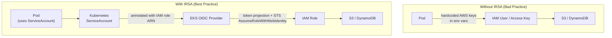
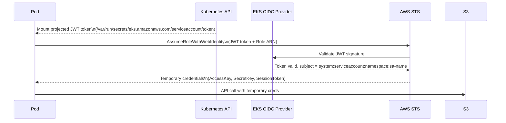

# EKS IAM, IRSA, Pod Identity & Security - SAA-C03 Deep Dive

> IRSA (IAM Roles for Service Accounts) is the critical EKS security topic on the exam — it lets pods assume IAM roles using Kubernetes service accounts and OIDC federation, avoiding the need to store long-lived credentials anywhere.

See also: [01 - EKS Fundamentals & Architecture](01%20-%20EKS%20Fundamentals%20%26%20Architecture.md) · [03 - EKS Networking - VPC CNI, Load Balancing & Ingress](03%20-%20EKS%20Networking%20-%20VPC%20CNI%2C%20Load%20Balancing%20%26%20Ingress.md) · [05 - EKS Storage - EBS, EFS, FSx CSI Drivers](05%20-%20EKS%20Storage%20-%20EBS%2C%20EFS%2C%20FSx%20CSI%20Drivers.md) · [06 - EKS Scaling & Observability](06%20-%20EKS%20Scaling%20%26%20Observability.md) · [07 - EKS Exam Scenarios & Q&A](07%20-%20EKS%20Exam%20Scenarios%20%26%20Q%26A.md) · [13 - STS & Federation](13%20-%20STS%20%26%20Federation.md) · [20 - KMS & Envelope Encryption](20%20-%20KMS%20%26%20Envelope%20Encryption.md)

---

## Table of Contents

- [IAM Roles in EKS - Overview](#iam-roles-in-eks---overview)
- [Cluster IAM Role](#cluster-iam-role)
- [Node IAM Role](#node-iam-role)
- [aws-auth ConfigMap - Cluster Access Control](#aws-auth-configmap---cluster-access-control)
- [IRSA - IAM Roles for Service Accounts](#irsa---iam-roles-for-service-accounts)
- [EKS Pod Identity - The Newer Approach](#eks-pod-identity---the-newer-approach)
- [IRSA vs Pod Identity Comparison](#irsa-vs-pod-identity-comparison)
- [Kubernetes RBAC](#kubernetes-rbac)
- [Secrets Encryption with KMS](#secrets-encryption-with-kms)
- [Security Best Practices](#security-best-practices)

---



---

## IAM Roles in EKS - Overview

EKS involves multiple layers of IAM, each serving a different purpose:

| IAM Entity                   | Purpose                                                            | Who Creates It                        |
| :--------------------------- | :----------------------------------------------------------------- | :------------------------------------ |
| **Cluster IAM Role**         | EKS control plane calls AWS APIs on your behalf                    | You (passed at cluster creation)      |
| **Node IAM Role**            | EC2 nodes join the cluster, pull ECR images, write CloudWatch logs | You (passed when creating node group) |
| **IRSA / Pod Identity Role** | Pods assume IAM roles for AWS service access                       | You (per application)                 |
| **aws-auth ConfigMap**       | Maps IAM identities to Kubernetes RBAC                             | You (managed config in cluster)       |

[⬆ Back to top](#table-of-contents)

---

## Cluster IAM Role

The **Cluster IAM Role** is assumed by the EKS service itself to manage AWS resources on behalf of your cluster — such as creating ENIs in your VPC, creating ELBs for Services, and managing node registration.

### Required Managed Policies

| Policy                           | Purpose                                            |
| :------------------------------- | :------------------------------------------------- |
| `AmazonEKSClusterPolicy`         | Core permissions: EC2, ELB, IAM describe/create    |
| `AmazonEKSVPCResourceController` | Manages VPC resources for security groups for pods |

### Creating the Cluster Role

```bash
# Trust policy for EKS service
cat > cluster-trust-policy.json <<EOF
{
  "Version": "2012-10-17",
  "Statement": [{
    "Effect": "Allow",
    "Principal": { "Service": "eks.amazonaws.com" },
    "Action": "sts:AssumeRole"
  }]
}
EOF

aws iam create-role \
  --role-name EKSClusterRole \
  --assume-role-policy-document file://cluster-trust-policy.json

aws iam attach-role-policy \
  --role-name EKSClusterRole \
  --policy-arn arn:aws:iam::aws:policy/AmazonEKSClusterPolicy
```

[⬆ Back to top](#table-of-contents)

---

## Node IAM Role

The **Node IAM Role** is attached to EC2 instances (worker nodes) via an instance profile. Every node in a node group shares this role. It is assumed by EC2, not by individual pods.

### Required Managed Policies

| Policy                               | Purpose                                                           |
| :----------------------------------- | :---------------------------------------------------------------- |
| `AmazonEKSWorkerNodePolicy`          | Allows nodes to register with EKS, describe cluster               |
| `AmazonEC2ContainerRegistryReadOnly` | Pull images from ECR                                              |
| `AmazonEKS_CNI_Policy`               | VPC CNI plugin — manage ENIs, IPs (can be scoped to IRSA instead) |

### Optional Policies

| Policy                         | When Needed                          |
| :----------------------------- | :----------------------------------- |
| `CloudWatchAgentServerPolicy`  | Container Insights / CloudWatch logs |
| `AmazonSSMManagedInstanceCore` | SSM Session Manager access to nodes  |

### Creating the Node Role

```bash
cat > node-trust-policy.json <<EOF
{
  "Version": "2012-10-17",
  "Statement": [{
    "Effect": "Allow",
    "Principal": { "Service": "ec2.amazonaws.com" },
    "Action": "sts:AssumeRole"
  }]
}
EOF

aws iam create-role \
  --role-name EKSNodeRole \
  --assume-role-policy-document file://node-trust-policy.json

aws iam attach-role-policy --role-name EKSNodeRole \
  --policy-arn arn:aws:iam::aws:policy/AmazonEKSWorkerNodePolicy

aws iam attach-role-policy --role-name EKSNodeRole \
  --policy-arn arn:aws:iam::aws:policy/AmazonEC2ContainerRegistryReadOnly

aws iam attach-role-policy --role-name EKSNodeRole \
  --policy-arn arn:aws:iam::aws:policy/AmazonEKS_CNI_Policy
```

> **Exam Trap:** Never give the Node IAM Role more permissions than needed. Pods that run on those nodes do NOT automatically inherit the node role (they need IRSA or Pod Identity). However, a pod CAN call the EC2 instance metadata endpoint to get the node role credentials — which is why you should use IRSA and block IMDS on pods when possible.

[⬆ Back to top](#table-of-contents)

---

## aws-auth ConfigMap - Cluster Access Control

The `aws-auth` ConfigMap in the `kube-system` namespace is the **bridge between AWS IAM and Kubernetes RBAC**. It maps IAM ARNs (users, roles) to Kubernetes usernames and groups.

### Structure

```yaml
apiVersion: v1
kind: ConfigMap
metadata:
  name: aws-auth
  namespace: kube-system
data:
  mapRoles: |
    - rolearn: arn:aws:iam::123456789:role/EKSNodeRole
      username: system:node:{{EC2PrivateDNSName}}
      groups:
        - system:bootstrappers
        - system:nodes
    - rolearn: arn:aws:iam::123456789:role/AdminRole
      username: admin
      groups:
        - system:masters     # full cluster admin
    - rolearn: arn:aws:iam::123456789:role/DevRole
      username: developer
      groups:
        - dev-team           # custom RBAC group
  mapUsers: |
    - userarn: arn:aws:iam::123456789:user/alice
      username: alice
      groups:
        - system:masters
```

### IAM Authenticator Flow

```
kubectl command
    ↓
AWS IAM Authenticator (local exec credential provider)
    ↓ generates a short-lived token signed with AWS credentials
EKS API server webhook
    ↓ validates token with AWS STS (GetCallerIdentity)
    ↓ looks up ARN in aws-auth ConfigMap
    ↓ maps to Kubernetes username + groups
Kubernetes RBAC authorization
```

### Creating kubeconfig

```bash
# Add cluster to local kubeconfig
aws eks update-kubeconfig \
  --name my-cluster \
  --region us-east-1 \
  --role-arn arn:aws:iam::123456789:role/AdminRole
```

> **Exam Note:** The cluster creator (IAM user or role that called `CreateCluster`) automatically has `system:masters` access. This is NOT reflected in `aws-auth` — it is implicit. If you lose the creator credentials, you may need to recreate the cluster or use another method.

> **Access Entry (New Feature):** AWS now offers **EKS Access Entries** as an alternative to managing `aws-auth` manually. Access Entries are managed via the EKS API/console and are more auditable.

[⬆ Back to top](#table-of-contents)

---

## IRSA - IAM Roles for Service Accounts

### The Problem IRSA Solves

Without IRSA, there are two bad options for giving pods AWS access:

1. Put AWS credentials in environment variables or Secrets (secret sprawl, rotation burden)
2. Use the node IAM role (all pods on the node share the same role — over-permissive)

**IRSA provides fine-grained, per-pod IAM permissions using temporary credentials.**

### How IRSA Works



### Setting Up IRSA — Step by Step

**Step 1: Create the OIDC Provider for your cluster**

```bash
# Get the OIDC issuer URL
aws eks describe-cluster --name my-cluster \
  --query "cluster.identity.oidc.issuer" --output text
# Output: https://oidc.eks.us-east-1.amazonaws.com/id/EXAMPLED539D4633E53DE1B71EXAMPLE

# Associate the OIDC provider (creates it in IAM)
eksctl utils associate-iam-oidc-provider \
  --cluster my-cluster \
  --approve
```

**Step 2: Create an IAM role with a trust policy allowing the ServiceAccount**

```json
{
  "Version": "2012-10-17",
  "Statement": [
    {
      "Effect": "Allow",
      "Principal": {
        "Federated": "arn:aws:iam::123456789:oidc-provider/oidc.eks.us-east-1.amazonaws.com/id/EXAMPLED539D4633E53DE1B71EXAMPLE"
      },
      "Action": "sts:AssumeRoleWithWebIdentity",
      "Condition": {
        "StringEquals": {
          "oidc.eks.us-east-1.amazonaws.com/id/EXAMPLED539D4633E53DE1B71EXAMPLE:sub": "system:serviceaccount:production:s3-reader",
          "oidc.eks.us-east-1.amazonaws.com/id/EXAMPLED539D4633E53DE1B71EXAMPLE:aud": "sts.amazonaws.com"
        }
      }
    }
  ]
}
```

```bash
aws iam create-role \
  --role-name S3ReaderRole \
  --assume-role-policy-document file://trust-policy.json

aws iam attach-role-policy \
  --role-name S3ReaderRole \
  --policy-arn arn:aws:iam::aws:policy/AmazonS3ReadOnlyAccess
```

**Step 3: Create a Kubernetes ServiceAccount annotated with the role ARN**

```yaml
apiVersion: v1
kind: ServiceAccount
metadata:
  name: s3-reader
  namespace: production
  annotations:
    eks.amazonaws.com/role-arn: arn:aws:iam::123456789:role/S3ReaderRole
```

**Step 4: Use the ServiceAccount in your Pod**

```yaml
apiVersion: v1
kind: Pod
metadata:
  name: s3-reader-pod
  namespace: production
spec:
  serviceAccountName: s3-reader # the annotated SA
  containers:
    - name: app
      image: amazon/aws-cli
      command: ["aws", "s3", "ls"]
      # AWS SDK automatically uses the projected token
```

### IRSA Quick Setup with eksctl

```bash
eksctl create iamserviceaccount \
  --name s3-reader \
  --namespace production \
  --cluster my-cluster \
  --attach-policy-arn arn:aws:iam::aws:policy/AmazonS3ReadOnlyAccess \
  --approve \
  --override-existing-serviceaccounts
```

> **CRITICAL Exam Knowledge:** IRSA uses **OIDC federation** + **STS AssumeRoleWithWebIdentity**. The trust policy `Condition` scopes the role to a specific ServiceAccount in a specific namespace. Without the Condition, ANY pod on the cluster could assume the role.

[⬆ Back to top](#table-of-contents)

---

## EKS Pod Identity - The Newer Approach

### What It Is

**EKS Pod Identity** is a newer AWS-managed mechanism (launched 2023) that also lets pods assume IAM roles, but uses a simpler setup than IRSA — no OIDC provider management required.

### How Pod Identity Works

```
Pod starts
  ↓
EKS Pod Identity Agent (DaemonSet) intercepts AWS SDK credential requests
  ↓
Agent calls EKS Pod Identity endpoint (169.254.170.23:80)
  ↓
EKS service validates pod identity and returns temporary credentials
  ↓
Pod uses temporary credentials to call AWS APIs
```

### Setup

**Step 1: Install the EKS Pod Identity Agent add-on**

```bash
aws eks create-addon \
  --cluster-name my-cluster \
  --addon-name eks-pod-identity-agent
```

**Step 2: Create the IAM role with EKS trust policy**

```json
{
  "Version": "2012-10-17",
  "Statement": [
    {
      "Effect": "Allow",
      "Principal": {
        "Service": "pods.eks.amazonaws.com"
      },
      "Action": ["sts:AssumeRole", "sts:TagSession"]
    }
  ]
}
```

**Step 3: Create a Pod Identity Association**

```bash
aws eks create-pod-identity-association \
  --cluster-name my-cluster \
  --namespace production \
  --service-account s3-reader \
  --role-arn arn:aws:iam::123456789:role/S3ReaderRole
```

No annotation on the ServiceAccount is required.

[⬆ Back to top](#table-of-contents)

---

## IRSA vs Pod Identity Comparison

| Dimension                       | IRSA                                            | EKS Pod Identity                               |
| :------------------------------ | :---------------------------------------------- | :--------------------------------------------- |
| **Mechanism**                   | OIDC federation + STS AssumeRoleWithWebIdentity | EKS-native credential provider                 |
| **OIDC provider**               | Required (manual setup)                         | Not required                                   |
| **ServiceAccount annotation**   | Required                                        | Not required                                   |
| **Trust policy principal**      | `Federated: OIDC provider ARN`                  | `Service: pods.eks.amazonaws.com`              |
| **Session tags**                | Limited                                         | Supported (`sts:TagSession`)                   |
| **Reusability across clusters** | Requires separate trust per cluster             | Association is per cluster (centrally managed) |
| **Cross-account**               | Supported                                       | Supported                                      |
| **Fargate support**             | Yes                                             | Yes (with add-on)                              |
| **Windows nodes**               | Yes                                             | Yes                                            |
| **AWS SDK version required**    | SDK that supports web identity tokens           | SDK that supports container credentials        |
| **Exam frequency**              | Very high (established, well-tested)            | Medium (newer, appearing more)                 |
| **Best for**                    | Existing setups, Fargate-heavy                  | New clusters, simpler management               |

> **Exam Tip:** If the question says "OIDC" or "service account annotation," it is describing IRSA. If it says "Pod Identity Agent" or "pods.eks.amazonaws.com trust principal," it is describing Pod Identity. Both provide temporary credentials — neither uses long-lived access keys.

[⬆ Back to top](#table-of-contents)

---

## Kubernetes RBAC

RBAC (Role-Based Access Control) is the authorization layer inside Kubernetes. After IAM authenticates a caller via `aws-auth`, RBAC determines what they can do.

### Key RBAC Objects

| Object                 | Scope        | Purpose                                                             |
| :--------------------- | :----------- | :------------------------------------------------------------------ |
| **Role**               | Namespace    | Defines allowed verbs on resources within one namespace             |
| **ClusterRole**        | Cluster-wide | Defines allowed verbs on cluster-scoped or all namespaced resources |
| **RoleBinding**        | Namespace    | Binds a Role to a user/group/serviceaccount in a namespace          |
| **ClusterRoleBinding** | Cluster-wide | Binds a ClusterRole to a user/group/serviceaccount everywhere       |

### Example: Namespace-Scoped Developer Role

```yaml
apiVersion: rbac.authorization.k8s.io/v1
kind: Role
metadata:
  name: developer
  namespace: production
rules:
  - apiGroups: ["apps"]
    resources: ["deployments", "replicasets"]
    verbs: ["get", "list", "watch", "create", "update", "patch"]
  - apiGroups: [""]
    resources: ["pods", "pods/log", "services"]
    verbs: ["get", "list", "watch"]
---
apiVersion: rbac.authorization.k8s.io/v1
kind: RoleBinding
metadata:
  name: developer-binding
  namespace: production
subjects:
  - kind: Group
    name: dev-team # mapped from aws-auth configmap
    apiGroup: rbac.authorization.k8s.io
roleRef:
  kind: Role
  name: developer
  apiGroup: rbac.authorization.k8s.io
```

### Built-In Cluster Roles

| ClusterRole      | Access Level                      |
| :--------------- | :-------------------------------- |
| `system:masters` | Full admin (equivalent to root)   |
| `cluster-admin`  | Full admin via ClusterRoleBinding |
| `admin`          | Namespace admin                   |
| `edit`           | Read/write most resources         |
| `view`           | Read-only                         |

[⬆ Back to top](#table-of-contents)

---

## Secrets Encryption with KMS

By default, Kubernetes Secrets are stored base64-encoded in etcd — **not encrypted**. EKS supports envelope encryption of Secrets using AWS KMS.

### How It Works

```
Kubernetes Secret created
  ↓
EKS control plane generates a Data Encryption Key (DEK)
  ↓
DEK encrypts the secret value (AES-256)
  ↓
KMS CMK encrypts the DEK (envelope encryption)
  ↓
Encrypted DEK + encrypted secret stored in etcd
```

### Enabling Secrets Encryption

```bash
# At cluster creation
eksctl create cluster \
  --name my-cluster \
  --region us-east-1 \
  --encryption-config-kms-key-arn arn:aws:kms:us-east-1:123456789:key/mrk-abc123

# For existing cluster
aws eks associate-encryption-config \
  --cluster-name my-cluster \
  --encryption-config '[{"resources":["secrets"],"provider":{"keyArn":"arn:aws:kms:us-east-1:123456789:key/mrk-abc123"}}]'
```

### IAM Permissions Required

The Cluster IAM Role needs:

```json
{
  "Effect": "Allow",
  "Action": [
    "kms:Encrypt",
    "kms:Decrypt",
    "kms:DescribeKey",
    "kms:GenerateDataKey"
  ],
  "Resource": "arn:aws:kms:us-east-1:123456789:key/mrk-abc123"
}
```

> **Exam Tip:** KMS encryption for EKS Secrets protects against unauthorized etcd access but does NOT protect against a Kubernetes API call — if a pod has RBAC access to read a Secret, it can still read the plaintext value. For tighter secret management, use AWS Secrets Manager with the external-secrets operator or Secrets Store CSI Driver.

[⬆ Back to top](#table-of-contents)

---

## Security Best Practices

| Practice                                  | Why It Matters                                      |
| :---------------------------------------- | :-------------------------------------------------- |
| **Use IRSA or Pod Identity per workload** | Least-privilege; pods don't share node role         |
| **Restrict IMDS access on pods**          | Prevents pods from stealing the node IAM role       |
| **Enable KMS Secrets encryption**         | Encrypts secrets at rest in etcd                    |
| **Use private API endpoint**              | Removes control plane from public internet          |
| **Enable control plane logging**          | Audit, API server, authenticator logs to CloudWatch |
| **Use EKS managed add-ons**               | AWS patches CoreDNS, kube-proxy, VPC CNI            |
| **Apply Pod Security Standards**          | Prevent privileged containers, hostPath mounts      |
| **Use Security Groups for Pods**          | Network-level isolation per workload                |
| **Audit aws-auth ConfigMap**              | Regularly review who has cluster access             |
| **Enable GuardDuty EKS Protection**       | Detects anomalous Kubernetes API calls              |

### Block IMDS from Pods (Hop Limit)

```bash
# Reduce IMDSv2 hop limit so pods cannot reach EC2 metadata
aws ec2 modify-instance-metadata-options \
  --instance-id i-0abc123 \
  --http-put-response-hop-limit 1 \
  --http-endpoint enabled
# hop-limit 1 = only the node itself can reach IMDS; pods (which are a hop away) cannot
```

[⬆ Back to top](#table-of-contents)
