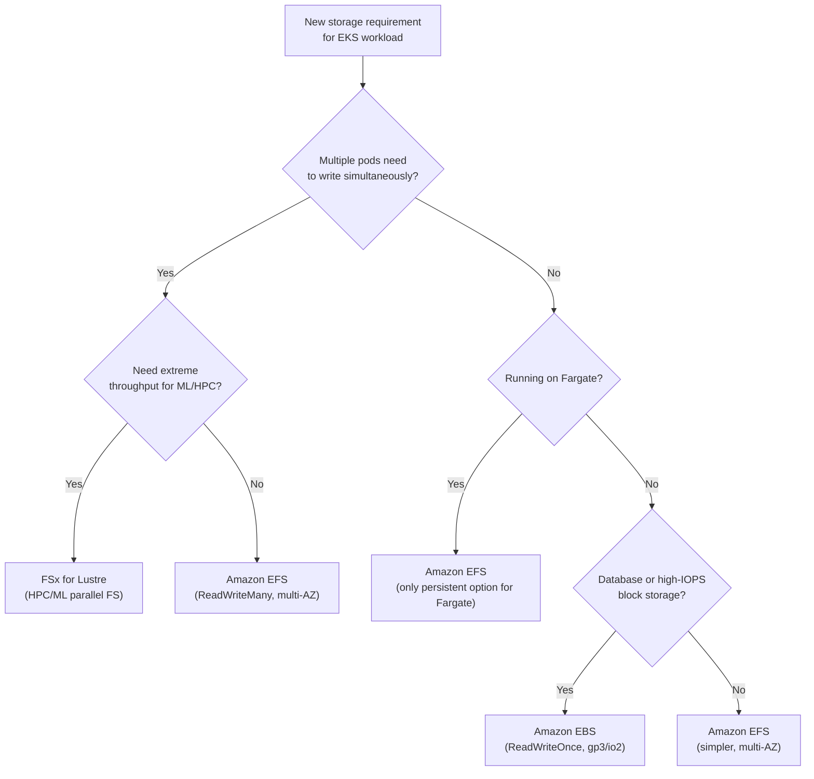

```mermaid
graph TD
    App["Application Pod"]

    App -->|"ReadWriteOnce\n(single node)"| PVC_EBS["PVC - EBS"]
    App -->|"ReadWriteMany\n(multi-node/AZ)"| PVC_EFS["PVC - EFS"]
    App -->|"HPC / ML training\nhigh throughput"| PVC_FSx["PVC - FSx Lustre"]

    PVC_EBS --> SC_EBS["StorageClass: gp3"]
    PVC_EFS --> SC_EFS["StorageClass: efs-sc"]
    PVC_FSx --> SC_FSx["StorageClass: fsx-sc"]

    SC_EBS -->|"EBS CSI Driver"| EBS["Amazon EBS Volume\n(AZ-specific)"]
    SC_EFS -->|"EFS CSI Driver"| EFS["Amazon EFS File System\n(multi-AZ)"]
    SC_FSx -->|"FSx CSI Driver"| FSx["Amazon FSx for Lustre\n(single-AZ, S3-linked)"]
```

# EKS Storage - EBS, EFS, FSx CSI Drivers - SAA-C03 Deep Dive

> EKS uses the Container Storage Interface (CSI) driver model — EBS CSI for single-AZ block storage, EFS CSI for multi-AZ shared file storage, and FSx for Lustre CSI for HPC/ML workloads; choose based on access mode requirements.

See also: [01 - EKS Fundamentals & Architecture](01%20-%20EKS%20Fundamentals%20%26%20Architecture.md) · [02 - EKS Node Types - Managed, Self-Managed, Fargate](02%20-%20EKS%20Node%20Types%20-%20Managed%2C%20Self-Managed%2C%20Fargate.md) · [04 - EKS IAM, IRSA, Pod Identity & Security](04%20-%20EKS%20IAM%2C%20IRSA%2C%20Pod%20Identity%20%26%20Security.md) · [06 - EKS Scaling & Observability](06%20-%20EKS%20Scaling%20%26%20Observability.md) · [07 - EKS Exam Scenarios & Q&A](07%20-%20EKS%20Exam%20Scenarios%20%26%20Q%26A.md)

---

## Table of Contents

- [The CSI Driver Model](#the-csi-driver-model)
- [Kubernetes Storage Primitives](#kubernetes-storage-primitives)
- [EBS CSI Driver](#ebs-csi-driver)
- [EFS CSI Driver](#efs-csi-driver)
- [FSx for Lustre CSI Driver](#fsx-for-lustre-csi-driver)
- [Storage Class Comparison](#storage-class-comparison)
- [Dynamic vs Static Provisioning](#dynamic-vs-static-provisioning)
- [Stateful Workloads with StatefulSets](#stateful-workloads-with-statefulsets)
- [Storage Decision Guide](#storage-decision-guide)

---



---

## The CSI Driver Model

### What CSI Is

**Container Storage Interface (CSI)** is a standard API between container orchestrators (Kubernetes) and storage drivers. AWS provides first-party CSI drivers for EBS, EFS, and FSx so Kubernetes can dynamically provision and manage these storage systems.

### Why CSI Replaced In-Tree Plugins

Before CSI, storage logic was compiled directly into the Kubernetes binary ("in-tree" plugins). CSI moves storage drivers out-of-tree — they run as Pods and can be updated independently from Kubernetes.

| Era     | Mechanism                                   | Status                            |
| :------ | :------------------------------------------ | :-------------------------------- |
| Legacy  | In-tree `kubernetes.io/aws-ebs` provisioner | Deprecated / removed in k8s 1.27+ |
| Current | AWS EBS CSI Driver (`ebs.csi.aws.com`)      | Required for k8s 1.23+            |

### CSI Driver Architecture

```
PVC created by user
  ↓
external-provisioner sidecar (watches PVCs)
  ↓
CSI driver controller (creates the AWS resource)
  ↓
PV created by Kubernetes
  ↓
kubelet + node-driver-registrar (mounts volume onto node)
  ↓
Volume available inside pod at mountPath
```

Each AWS CSI driver runs as two components:

- **Controller** (Deployment) — creates/deletes/snapshots volumes via AWS APIs
- **Node plugin** (DaemonSet) — mounts/unmounts volumes on each node

[⬆ Back to top](#table-of-contents)

---

## Kubernetes Storage Primitives

Understanding these objects is essential before diving into specific drivers.

| Object                          | Role                                                                              |
| :------------------------------ | :-------------------------------------------------------------------------------- |
| **PersistentVolume (PV)**       | Cluster resource representing a piece of storage (EBS vol, EFS mount, etc.)       |
| **PersistentVolumeClaim (PVC)** | User request for storage — consumed by a Pod                                      |
| **StorageClass (SC)**           | Template for dynamic PV provisioning — defines driver, parameters, reclaim policy |
| **VolumeSnapshot**              | Point-in-time copy of a PV (CSI feature)                                          |

### Access Modes

| Access Mode                 | Description                                 | Supported By         |
| :-------------------------- | :------------------------------------------ | :------------------- |
| **ReadWriteOnce (RWO)**     | One node can mount read-write               | EBS, EFS, FSx Lustre |
| **ReadOnlyMany (ROX)**      | Multiple nodes can mount read-only          | EFS, FSx Lustre      |
| **ReadWriteMany (RWX)**     | Multiple nodes can mount read-write         | EFS, FSx Lustre      |
| **ReadWriteOncePod (RWOP)** | Only one pod (not just one node) read-write | EBS (CSI 1.x+)       |

> **Critical Exam Rule:** EBS is **ReadWriteOnce only**. It can be attached to only ONE node at a time. For workloads that need multiple pods on different nodes to share storage, use EFS (ReadWriteMany).

### Reclaim Policies

| Policy                   | What Happens to PV When PVC is Deleted                  |
| :----------------------- | :------------------------------------------------------ |
| **Delete**               | PV and underlying storage (EBS vol) are deleted         |
| **Retain**               | PV and data remain; admin must manually clean up        |
| **Recycle** (deprecated) | Data is scrubbed (`rm -rf`) and PV made available again |

[⬆ Back to top](#table-of-contents)

---

## EBS CSI Driver

### Key Characteristics

| Property            | Details                                               |
| :------------------ | :---------------------------------------------------- |
| **Volume type**     | Block storage (like a hard drive)                     |
| **Access mode**     | ReadWriteOnce (one node at a time)                    |
| **AZ scope**        | Single AZ — volume and pod must be in the same AZ     |
| **Fargate support** | No (Fargate cannot attach EBS)                        |
| **Snapshots**       | Yes — via VolumeSnapshot CRD                          |
| **Resize**          | Yes — expand PVC; no restart needed for online resize |
| **Encryption**      | Default with AWS-managed key; supports CMK            |

### Install the EBS CSI Driver Add-on

```bash
# Via EKS managed add-on (recommended)
aws eks create-addon \
  --cluster-name my-cluster \
  --addon-name aws-ebs-csi-driver \
  --service-account-role-arn arn:aws:iam::123456789:role/EbsCsiRole

# The add-on needs an IAM role (IRSA) with AmazonEBSCSIDriverPolicy
eksctl create iamserviceaccount \
  --name ebs-csi-controller-sa \
  --namespace kube-system \
  --cluster my-cluster \
  --attach-policy-arn arn:aws:iam::aws:policy/service-role/AmazonEBSCSIDriverPolicy \
  --approve
```

### StorageClass Definition

```yaml
apiVersion: storage.k8s.io/v1
kind: StorageClass
metadata:
  name: gp3
  annotations:
    storageclass.kubernetes.io/is-default-class: "true"
provisioner: ebs.csi.aws.com
volumeBindingMode: WaitForFirstConsumer # wait until pod is scheduled; bind to same AZ
reclaimPolicy: Delete
parameters:
  type: gp3
  iops: "3000"
  throughput: "125"
  encrypted: "true"
  kmsKeyId: arn:aws:kms:us-east-1:123456789:key/mrk-abc123
```

> **Exam Note:** `volumeBindingMode: WaitForFirstConsumer` is critical for EBS. If you use `Immediate`, the EBS volume may be created in a different AZ than where the pod is eventually scheduled, causing mount failures.

### PVC and Pod Using EBS

```yaml
apiVersion: v1
kind: PersistentVolumeClaim
metadata:
  name: mysql-data
  namespace: production
spec:
  accessModes:
    - ReadWriteOnce
  storageClassName: gp3
  resources:
    requests:
      storage: 20Gi
---
apiVersion: v1
kind: Pod
metadata:
  name: mysql
  namespace: production
spec:
  containers:
    - name: mysql
      image: mysql:8.0
      env:
        - name: MYSQL_ROOT_PASSWORD
          valueFrom:
            secretKeyRef:
              name: mysql-secret
              key: password
      volumeMounts:
        - name: data
          mountPath: /var/lib/mysql
  volumes:
    - name: data
      persistentVolumeClaim:
        claimName: mysql-data
```

### EBS Volume Snapshots

```yaml
# Create a VolumeSnapshotClass
apiVersion: snapshot.storage.k8s.io/v1
kind: VolumeSnapshotClass
metadata:
  name: ebs-vsc
driver: ebs.csi.aws.com
deletionPolicy: Delete
---
# Take a snapshot
apiVersion: snapshot.storage.k8s.io/v1
kind: VolumeSnapshot
metadata:
  name: mysql-snapshot
spec:
  volumeSnapshotClassName: ebs-vsc
  source:
    persistentVolumeClaimName: mysql-data
```

[⬆ Back to top](#table-of-contents)

---

## EFS CSI Driver

### Key Characteristics

| Property              | Details                                                     |
| :-------------------- | :---------------------------------------------------------- |
| **Volume type**       | Network file system (NFS-based)                             |
| **Access mode**       | ReadWriteMany — multiple pods, multiple nodes, multiple AZs |
| **AZ scope**          | Multi-AZ — EFS is a regional service                        |
| **Fargate support**   | Yes — Fargate pods can mount EFS                            |
| **Capacity**          | Elastic — grows/shrinks automatically; no provisioned size  |
| **Performance modes** | General Purpose (default), Max I/O                          |
| **Throughput modes**  | Elastic (default), Bursting, Provisioned                    |
| **Encryption**        | At rest (KMS) and in transit (TLS)                          |

### Install the EFS CSI Driver Add-on

```bash
# Create IRSA for EFS CSI driver
eksctl create iamserviceaccount \
  --name efs-csi-controller-sa \
  --namespace kube-system \
  --cluster my-cluster \
  --attach-policy-arn arn:aws:iam::aws:policy/service-role/AmazonEFSCSIDriverPolicy \
  --approve

# Install as managed add-on
aws eks create-addon \
  --cluster-name my-cluster \
  --addon-name aws-efs-csi-driver \
  --service-account-role-arn arn:aws:iam::123456789:role/EfsCsiRole
```

### StorageClass and Dynamic Provisioning

The EFS CSI driver supports **dynamic provisioning** — it creates a new EFS Access Point per PVC:

```yaml
apiVersion: storage.k8s.io/v1
kind: StorageClass
metadata:
  name: efs-sc
provisioner: efs.csi.aws.com
parameters:
  provisioningMode: efs-ap # use EFS Access Points
  fileSystemId: fs-0abc123def456 # your EFS file system ID
  directoryPerms: "700"
  basePath: "/dynamic-pv"
reclaimPolicy: Delete
volumeBindingMode: Immediate # EFS is multi-AZ; no need to wait
```

### PVC and Pod Using EFS

```yaml
apiVersion: v1
kind: PersistentVolumeClaim
metadata:
  name: shared-data
  namespace: production
spec:
  accessModes:
    - ReadWriteMany # multiple pods can write simultaneously
  storageClassName: efs-sc
  resources:
    requests:
      storage: 5Gi # informational for EFS; actual capacity is elastic
---
apiVersion: apps/v1
kind: Deployment
metadata:
  name: content-processors
spec:
  replicas: 5 # all 5 pods share the same EFS PVC
  template:
    spec:
      containers:
        - name: processor
          image: my-processor:v1
          volumeMounts:
            - name: shared
              mountPath: /data/shared
      volumes:
        - name: shared
          persistentVolumeClaim:
            claimName: shared-data
```

> **Critical Exam Pattern:** If the question describes **multiple pods or nodes needing shared, concurrent read-write access to the same data**, the answer is **EFS + ReadWriteMany**. EBS cannot do this.

[⬆ Back to top](#table-of-contents)

---

## FSx for Lustre CSI Driver

### Key Characteristics

| Property            | Details                                                 |
| :------------------ | :------------------------------------------------------ |
| **Volume type**     | Parallel file system (POSIX-compliant, high-throughput) |
| **Access mode**     | ReadWriteMany                                           |
| **AZ scope**        | Single AZ (scratch) or multi-AZ (persistent)            |
| **S3 integration**  | Can be linked to an S3 bucket as a data repository      |
| **Throughput**      | Hundreds of GB/s; millions of IOPS                      |
| **Use cases**       | ML training, HPC, genomics, video rendering             |
| **Fargate support** | No                                                      |

### StorageClass for FSx Lustre

```yaml
apiVersion: storage.k8s.io/v1
kind: StorageClass
metadata:
  name: fsx-sc
provisioner: fsx.csi.aws.com
parameters:
  subnetId: subnet-0abc123
  securityGroupIds: sg-0abc123
  s3ImportPath: s3://my-ml-data-bucket/training-data # link to S3
  s3ExportPath: s3://my-ml-data-bucket/output
  deploymentType: SCRATCH_2
  automaticBackups: "false"
  copyTagsToBackups: "false"
reclaimPolicy: Delete
volumeBindingMode: Immediate
```

### When to Choose FSx Lustre

```
Need shared storage         → EFS (general purpose)
Need extreme throughput     → FSx Lustre
Need S3-linked data lake    → FSx Lustre
Need Windows file shares    → FSx for Windows File Server
```

[⬆ Back to top](#table-of-contents)

---

## Storage Class Comparison

| Dimension        | EBS                      | EFS                             | FSx for Lustre                  |
| :--------------- | :----------------------- | :------------------------------ | :------------------------------ |
| **Storage type** | Block                    | File (NFS)                      | Parallel file system            |
| **Access mode**  | ReadWriteOnce            | ReadWriteMany                   | ReadWriteMany                   |
| **Multi-AZ**     | No (single AZ)           | Yes (regional)                  | No (scratch) / Yes (persistent) |
| **Fargate**      | No                       | Yes                             | No                              |
| **Performance**  | High IOPS (up to 256K)   | Elastic, latency variable       | Extreme (ML/HPC grade)          |
| **Cost model**   | GB provisioned           | GB used (elastic)               | GB provisioned                  |
| **Snapshots**    | Yes (EBS snapshots)      | EFS Backup / AWS Backup         | FSx backups                     |
| **CSI driver**   | `ebs.csi.aws.com`        | `efs.csi.aws.com`               | `fsx.csi.aws.com`               |
| **Typical use**  | Databases, stateful apps | Shared config, content, ML data | ML training, HPC, video         |

[⬆ Back to top](#table-of-contents)

---

## Dynamic vs Static Provisioning

### Dynamic Provisioning

The CSI driver creates the underlying AWS resource automatically when a PVC is created:

```
User creates PVC → StorageClass → CSI Driver Controller → AWS creates EBS/EFS resource → PV bound to PVC
```

Requires a StorageClass with a `provisioner` field. This is the recommended approach for most use cases.

### Static Provisioning

An admin creates the PV manually, pointing to a pre-existing AWS resource:

```yaml
apiVersion: v1
kind: PersistentVolume
metadata:
  name: existing-efs-pv
spec:
  capacity:
    storage: 100Gi
  accessModes:
    - ReadWriteMany
  persistentVolumeReclaimPolicy: Retain
  storageClassName: efs-sc
  csi:
    driver: efs.csi.aws.com
    volumeHandle: fs-0abc123def456::fsap-0abc123 # fileSystemId::accessPointId
```

### When to Use Static Provisioning

| Scenario                                                         | Use Static Provisioning |
| :--------------------------------------------------------------- | :---------------------- |
| Pre-existing EBS/EFS resource must be reused                     | Yes                     |
| Sharing a single EFS filesystem root (not per-PVC access points) | Yes                     |
| Migration from another storage system                            | Yes                     |
| Greenfield new deployments                                       | No — use dynamic        |

[⬆ Back to top](#table-of-contents)

---

## Stateful Workloads with StatefulSets

For stateful applications (databases, message queues), Kubernetes provides **StatefulSets** which give each pod:

- A stable, predictable hostname (`pod-0`, `pod-1`, ...)
- A dedicated PVC (via `volumeClaimTemplates`)
- Ordered startup and shutdown

### StatefulSet with EBS

```yaml
apiVersion: apps/v1
kind: StatefulSet
metadata:
  name: postgres
  namespace: production
spec:
  serviceName: postgres
  replicas: 3
  selector:
    matchLabels:
      app: postgres
  template:
    metadata:
      labels:
        app: postgres
    spec:
      containers:
        - name: postgres
          image: postgres:15
          volumeMounts:
            - name: data
              mountPath: /var/lib/postgresql/data
  volumeClaimTemplates:
    - metadata:
        name: data
      spec:
        accessModes: ["ReadWriteOnce"]
        storageClassName: gp3
        resources:
          requests:
            storage: 50Gi
```

This creates:

- `postgres-0` with PVC `data-postgres-0` (dedicated EBS in its AZ)
- `postgres-1` with PVC `data-postgres-1` (dedicated EBS in its AZ)
- `postgres-2` with PVC `data-postgres-2` (dedicated EBS in its AZ)

> **Exam Trap:** StatefulSet pods have persistent identity — if `postgres-0` is rescheduled to a different node in the **same AZ**, it reattaches to the same EBS volume. But if the AZ changes, EBS volumes are AZ-specific and the pod will fail to start. Design node affinity rules or use EFS for cross-AZ stateful workloads.

[⬆ Back to top](#table-of-contents)

---

## Storage Decision Guide



| Scenario                                       | Storage Choice              |
| :--------------------------------------------- | :-------------------------- |
| MySQL / PostgreSQL database on EC2 nodes       | EBS gp3 (ReadWriteOnce)     |
| Shared content directory for web app pods      | EFS (ReadWriteMany)         |
| ML training job reading from S3-linked dataset | FSx for Lustre (S3 import)  |
| Fargate pod needing persistent storage         | EFS only                    |
| WordPress with multiple replicas sharing media | EFS (ReadWriteMany)         |
| Redis cluster with persistence                 | EBS per pod via StatefulSet |
| Jenkins with build artifacts                   | EFS (shared workspace)      |
| Video rendering farm                           | FSx for Lustre              |

[⬆ Back to top](#table-of-contents)
