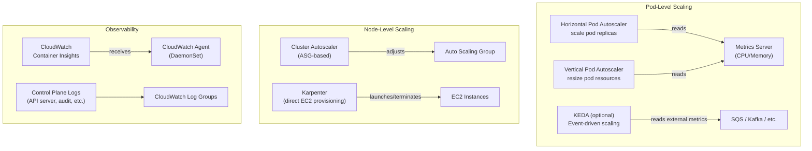
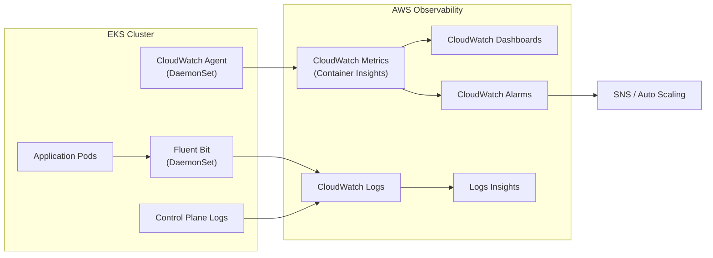

# EKS Scaling & Observability - SAA-C03 Deep Dive

> EKS scaling operates at two levels — pod scaling (HPA/VPA) and node scaling (Cluster Autoscaler/Karpenter); Container Insights and CloudWatch provide observability without leaving the AWS ecosystem.

See also: [01 - EKS Fundamentals & Architecture](01%20-%20EKS%20Fundamentals%20%26%20Architecture.md) · [02 - EKS Node Types - Managed, Self-Managed, Fargate](02%20-%20EKS%20Node%20Types%20-%20Managed%2C%20Self-Managed%2C%20Fargate.md) · [04 - EKS IAM, IRSA, Pod Identity & Security](04%20-%20EKS%20IAM%2C%20IRSA%2C%20Pod%20Identity%20%26%20Security.md) · [05 - EKS Storage - EBS, EFS, FSx CSI Drivers](05%20-%20EKS%20Storage%20-%20EBS%2C%20EFS%2C%20FSx%20CSI%20Drivers.md) · [07 - EKS Exam Scenarios & Q&A](07%20-%20EKS%20Exam%20Scenarios%20%26%20Q%26A.md)

---

## Table of Contents

- [Scaling Architecture Overview](#scaling-architecture-overview)
- [Horizontal Pod Autoscaler - HPA](#horizontal-pod-autoscaler---hpa)
- [Vertical Pod Autoscaler - VPA](#vertical-pod-autoscaler---vpa)
- [Metrics Server](#metrics-server)
- [Cluster Autoscaler](#cluster-autoscaler)
- [Karpenter](#karpenter)
- [Cluster Autoscaler vs Karpenter](#cluster-autoscaler-vs-karpenter)
- [Control Plane Logging](#control-plane-logging)
- [Container Insights - CloudWatch Observability](#container-insights---cloudwatch-observability)
- [CloudWatch Alarms and Auto Scaling Integration](#cloudwatch-alarms-and-auto-scaling-integration)

---



---

## Scaling Architecture Overview

EKS scaling operates at two independent levels:

| Level          | What Scales                                  | Tool                          |
| :------------- | :------------------------------------------- | :---------------------------- |
| **Pod level**  | Number of pod replicas OR pod resource sizes | HPA, VPA, KEDA                |
| **Node level** | Number/type of EC2 nodes                     | Cluster Autoscaler, Karpenter |

These two levels work together: HPA adds more pods → node-level scaler adds nodes to fit them.

[⬆ Back to top](#table-of-contents)

---

## Horizontal Pod Autoscaler - HPA

### What It Does

The **HPA** automatically scales the number of pod replicas in a Deployment, ReplicaSet, or StatefulSet based on observed metrics (CPU utilization, memory, custom metrics).

### How It Works

```
HPA controller (runs in control plane)
  ↓ polls Metrics Server (or custom metrics API) every 15 seconds
  ↓ calculates desired replicas:
    desiredReplicas = ceil(currentReplicas × (currentMetric / targetMetric))
  ↓ updates Deployment replica count
  ↓ Deployment controller creates/destroys pods
```

### HPA Manifest

```yaml
apiVersion: autoscaling/v2
kind: HorizontalPodAutoscaler
metadata:
  name: my-app-hpa
  namespace: production
spec:
  scaleTargetRef:
    apiVersion: apps/v1
    kind: Deployment
    name: my-app
  minReplicas: 2
  maxReplicas: 20
  metrics:
    - type: Resource
      resource:
        name: cpu
        target:
          type: Utilization
          averageUtilization: 70 # scale up when avg CPU > 70%
    - type: Resource
      resource:
        name: memory
        target:
          type: AverageValue
          averageValue: 512Mi
```

### HPA with Custom Metrics (e.g., SQS Queue Depth)

Using KEDA (Kubernetes Event Driven Autoscaler):

```yaml
apiVersion: keda.sh/v1alpha1
kind: ScaledObject
metadata:
  name: sqs-consumer-scaler
spec:
  scaleTargetRef:
    name: sqs-consumer
  minReplicaCount: 1
  maxReplicaCount: 50
  triggers:
    - type: aws-sqs-queue
      metadata:
        queueURL: https://sqs.us-east-1.amazonaws.com/123456789/my-queue
        queueLength: "10" # 1 pod per 10 messages
        awsRegion: us-east-1
```

> **Exam Note:** HPA requires resource `requests` to be set on containers. Without `requests`, CPU/memory metrics cannot be calculated as a percentage. This is the #1 reason HPA fails in practice — and on the exam.

### Scale-Down Behavior

By default, HPA waits 5 minutes before scaling down (to avoid thrashing). Configurable:

```yaml
spec:
  behavior:
    scaleDown:
      stabilizationWindowSeconds: 300 # 5 minutes default
      policies:
        - type: Percent
          value: 10
          periodSeconds: 60 # scale down max 10% every minute
```

[⬆ Back to top](#table-of-contents)

---

## Vertical Pod Autoscaler - VPA

### What It Does

The **VPA** automatically adjusts the CPU and memory **requests and limits** of containers based on observed usage. Instead of scaling the number of pods (like HPA), it resizes existing pods.

### VPA Components

| Component                | Role                                                   |
| :----------------------- | :----------------------------------------------------- |
| **Recommender**          | Monitors resource usage; generates recommendations     |
| **Updater**              | Evicts pods that need to be resized (restart required) |
| **Admission Controller** | Modifies pod requests/limits at creation time          |

### VPA Modes

| Mode       | Behaviour                                            |
| :--------- | :--------------------------------------------------- |
| `Off`      | Only generates recommendations; no automatic changes |
| `Initial`  | Sets resources at pod creation; no ongoing updates   |
| `Recreate` | Updates resources by evicting and recreating pods    |
| `Auto`     | Same as `Recreate` currently                         |

### VPA Manifest

```yaml
apiVersion: autoscaling.k8s.io/v1
kind: VerticalPodAutoscaler
metadata:
  name: my-app-vpa
  namespace: production
spec:
  targetRef:
    apiVersion: "apps/v1"
    kind: Deployment
    name: my-app
  updatePolicy:
    updateMode: "Auto"
  resourcePolicy:
    containerPolicies:
      - containerName: "*"
        minAllowed:
          cpu: 100m
          memory: 50Mi
        maxAllowed:
          cpu: 4
          memory: 4Gi
```

> **Exam Note:** VPA and HPA **cannot both manage CPU** for the same pods simultaneously (conflict). You can use HPA on custom metrics + VPA on CPU/memory, but never both on the same resource type. For the exam: HPA = scale out (more pods), VPA = right-size (bigger pods).

[⬆ Back to top](#table-of-contents)

---

## Metrics Server

The **Metrics Server** is a required prerequisite for HPA and VPA. It collects CPU and memory metrics from kubelets and exposes them via the Kubernetes Metrics API.

```bash
# Install Metrics Server via managed add-on
aws eks create-addon \
  --cluster-name my-cluster \
  --addon-name metrics-server

# Or via kubectl
kubectl apply -f https://github.com/kubernetes-sigs/metrics-server/releases/latest/download/components.yaml

# Verify it works
kubectl top nodes
kubectl top pods -n production
```

> **Note:** Metrics Server stores metrics in memory only (no historical data). For historical metrics and dashboards, use CloudWatch Container Insights or Prometheus/Grafana.

[⬆ Back to top](#table-of-contents)

---

## Cluster Autoscaler

### What It Does

The **Cluster Autoscaler (CA)** watches for pods that cannot be scheduled (Pending state) due to insufficient node capacity, and scales **Auto Scaling Groups** up to add more nodes. It also scales ASGs down when nodes are underutilized.

### How Scale-Up Works

```
Pod enters Pending state (not enough CPU/memory on any node)
  ↓
CA identifies which ASG can accept the pod
  ↓
CA calls AWS Auto Scaling API to increase DesiredCapacity
  ↓
New node joins cluster
  ↓
kube-scheduler assigns pod to new node
```

### How Scale-Down Works

```
CA checks all nodes every 10 seconds
  ↓
If node utilization < 50% AND all pods can be moved to other nodes
  ↓
CA cordons + drains the node
  ↓
CA calls ASG API to terminate the instance
```

### Installation

```bash
# CA runs as a Deployment in kube-system
# Requires IAM permissions via IRSA
eksctl create iamserviceaccount \
  --name cluster-autoscaler \
  --namespace kube-system \
  --cluster my-cluster \
  --attach-policy-arn arn:aws:iam::123456789:policy/ClusterAutoscalerPolicy \
  --approve

# Install via Helm
helm repo add autoscaler https://kubernetes.github.io/autoscaler
helm install cluster-autoscaler autoscaler/cluster-autoscaler \
  --namespace kube-system \
  --set autoDiscovery.clusterName=my-cluster \
  --set awsRegion=us-east-1 \
  --set rbac.serviceAccount.create=false \
  --set rbac.serviceAccount.name=cluster-autoscaler
```

### CA IAM Policy

```json
{
  "Version": "2012-10-17",
  "Statement": [
    {
      "Effect": "Allow",
      "Action": [
        "autoscaling:DescribeAutoScalingGroups",
        "autoscaling:DescribeAutoScalingInstances",
        "autoscaling:DescribeLaunchConfigurations",
        "autoscaling:SetDesiredCapacity",
        "autoscaling:TerminateInstanceInAutoScalingGroup",
        "ec2:DescribeLaunchTemplateVersions"
      ],
      "Resource": "*"
    }
  ]
}
```

### CA ASG Tags Required

Node group ASGs must be tagged for CA auto-discovery:

```
k8s.io/cluster-autoscaler/my-cluster  = owned
k8s.io/cluster-autoscaler/enabled     = true
```

[⬆ Back to top](#table-of-contents)

---

## Karpenter

### What Karpenter Is

**Karpenter** is an open-source, AWS-developed node provisioner that is a **modern replacement for Cluster Autoscaler**. It provisions EC2 instances directly (without ASGs) in seconds, selecting the optimal instance type for the pending pods.

### Key Differences from Cluster Autoscaler

Karpenter does NOT use Auto Scaling Groups. It calls EC2 directly via `RunInstances`.

### How Karpenter Works

```
Pods become Pending
  ↓
Karpenter analyzes pod requirements
  (CPU, memory, GPU, AZ, instance family preferences)
  ↓
Karpenter selects the cheapest/best instance type(s) that fit
  ↓
Karpenter calls ec2:RunInstances directly
  ↓
Node joins cluster in ~60 seconds
  ↓
Pods schedule onto new node
```

### Karpenter Concepts

| Concept               | Description                                                          |
| :-------------------- | :------------------------------------------------------------------- |
| **NodePool**          | Defines allowed instance types, zones, capacity types, node lifetime |
| **EC2NodeClass**      | AWS-specific config: AMI, subnet, security group, instance profile   |
| **Disruption Budget** | Controls how aggressively Karpenter consolidates/replaces nodes      |

### NodePool Manifest

```yaml
apiVersion: karpenter.sh/v1
kind: NodePool
metadata:
  name: default
spec:
  template:
    spec:
      requirements:
        - key: kubernetes.io/arch
          operator: In
          values: ["amd64", "arm64"]
        - key: karpenter.sh/capacity-type
          operator: In
          values: ["spot", "on-demand"]
        - key: karpenter.k8s.aws/instance-category
          operator: In
          values: ["c", "m", "r"]
        - key: karpenter.k8s.aws/instance-generation
          operator: Gt
          values: ["2"]
      nodeClassRef:
        group: karpenter.k8s.aws
        kind: EC2NodeClass
        name: default
  limits:
    cpu: "1000"
    memory: 4000Gi
  disruption:
    consolidationPolicy: WhenEmptyOrUnderutilized
    consolidateAfter: 1m
---
apiVersion: karpenter.k8s.aws/v1
kind: EC2NodeClass
metadata:
  name: default
spec:
  amiSelectorTerms:
    - alias: al2023@latest
  subnetSelectorTerms:
    - tags:
        karpenter.sh/discovery: my-cluster
  securityGroupSelectorTerms:
    - tags:
        karpenter.sh/discovery: my-cluster
  role: KarpenterNodeRole-my-cluster
```

[⬆ Back to top](#table-of-contents)

---

## Cluster Autoscaler vs Karpenter

| Dimension                 | Cluster Autoscaler            | Karpenter                             |
| :------------------------ | :---------------------------- | :------------------------------------ |
| **Approach**              | Scales existing ASGs          | Provisions EC2 directly               |
| **Instance selection**    | Fixed instance type per ASG   | Dynamic — picks best fit per workload |
| **Scale-up speed**        | Minutes (ASG warm-up)         | ~60 seconds                           |
| **Spot instance support** | With mixed-instances ASG      | Native, across instance families      |
| **Bin packing**           | Limited (ASG-constrained)     | Excellent (picks right size)          |
| **Graviton/ARM support**  | With separate ASG             | Mixed within single NodePool          |
| **Node consolidation**    | Basic                         | Advanced (WhenEmptyOrUnderutilized)   |
| **Configuration**         | ASG annotations + Helm values | NodePool + EC2NodeClass CRDs          |
| **Maturity**              | Mature, well-proven           | Newer, rapidly becoming default       |
| **AWS recommendation**    | Legacy option                 | Preferred for new clusters            |

> **Exam Tip:** If the question says "minimize cost by right-sizing instances" or "provision the cheapest instance type that fits," Karpenter is the answer. If it mentions ASGs and pre-defined node groups, Cluster Autoscaler is more likely implied.

[⬆ Back to top](#table-of-contents)

---

## Control Plane Logging

EKS can send **control plane logs** to CloudWatch Logs. There are five log types, all opt-in:

| Log Type              | What It Contains                          | Use For                |
| :-------------------- | :---------------------------------------- | :--------------------- |
| **api**               | All requests to the Kubernetes API server | Audit, debugging       |
| **audit**             | Detailed who-did-what audit trail         | Security compliance    |
| **authenticator**     | IAM authentication attempts (aws-auth)    | Access troubleshooting |
| **controllerManager** | Controller reconciliation events          | Debugging deployments  |
| **scheduler**         | Pod scheduling decisions                  | Performance tuning     |

### Enabling Control Plane Logging

```bash
aws eks update-cluster-config \
  --name my-cluster \
  --region us-east-1 \
  --logging '{"clusterLogging":[{"types":["api","audit","authenticator","controllerManager","scheduler"],"enabled":true}]}'
```

### Log Group Location

Logs appear in CloudWatch Logs at:

```
/aws/eks/my-cluster/cluster
```

> **Exam Tip:** For a scenario asking how to investigate "why a deployment failed to scale" or "what API calls were made to the cluster," enabling the **api** and **audit** log types and querying CloudWatch Logs Insights is the answer.

[⬆ Back to top](#table-of-contents)

---

## Container Insights - CloudWatch Observability

### What Container Insights Does

**CloudWatch Container Insights** collects, aggregates, and summarizes metrics and logs from EKS clusters. It provides pre-built dashboards in CloudWatch for cluster, node, pod, and container-level visibility.

### Metrics Collected

| Level         | Metrics                                               |
| :------------ | :---------------------------------------------------- |
| **Cluster**   | Total node count, CPU/memory utilization cluster-wide |
| **Node**      | CPU/memory/disk/network per node                      |
| **Pod**       | CPU/memory requests vs usage, restart count           |
| **Container** | CPU/memory per container within a pod                 |
| **Namespace** | Aggregated metrics per namespace                      |

### Installation via CloudWatch Observability Add-on

```bash
# Quickest path: managed add-on
aws eks create-addon \
  --cluster-name my-cluster \
  --addon-name amazon-cloudwatch-observability \
  --service-account-role-arn arn:aws:iam::123456789:role/CloudWatchAgentRole

# Requires node IAM role (or IRSA) with:
# - CloudWatchAgentServerPolicy
# - AmazonEC2ReadOnlyAccess (for instance metadata)
```

### What Gets Deployed

The add-on deploys:

- **CloudWatch Agent** (DaemonSet) — collects node/pod/container metrics
- **Fluent Bit** (DaemonSet) — ships container logs to CloudWatch Logs

### Log Groups Created

| Log Group                                         | Contents                   |
| :------------------------------------------------ | :------------------------- |
| `/aws/containerinsights/cluster-name/application` | Container stdout/stderr    |
| `/aws/containerinsights/cluster-name/host`        | Node-level system logs     |
| `/aws/containerinsights/cluster-name/dataplane`   | kube-proxy, VPC CNI logs   |
| `/aws/containerinsights/cluster-name/performance` | Performance metrics (JSON) |

### CloudWatch Logs Insights Query Example

```
# Find pods that restarted more than 5 times in the last hour
fields @timestamp, kubernetes.pod_name, kubernetes.namespace_name, kubernetes.container_name, restartCount
| filter restartCount > 5
| sort @timestamp desc
| limit 50
```

[⬆ Back to top](#table-of-contents)

---

## CloudWatch Alarms and Auto Scaling Integration

### Pod-Level Alarm (via Container Insights Metrics)

```bash
# Create alarm when pod CPU > 80% for 3 consecutive periods
aws cloudwatch put-metric-alarm \
  --alarm-name "EKS-Pod-HighCPU" \
  --metric-name pod_cpu_utilization \
  --namespace ContainerInsights \
  --dimensions Name=ClusterName,Value=my-cluster \
               Name=Namespace,Value=production \
  --statistic Average \
  --period 60 \
  --evaluation-periods 3 \
  --threshold 80 \
  --comparison-operator GreaterThanThreshold \
  --alarm-actions arn:aws:sns:us-east-1:123456789:ops-alerts
```

### Node-Level Auto Scaling via CloudWatch

While Karpenter and CA handle node scaling reactively (pending pods), you can also use CloudWatch alarms on node-level metrics to trigger ASG scaling proactively:

```
CloudWatch Alarm (node CPU > 70%) → SNS Topic → Lambda → EKS ASG scale-out
```

Or directly:

```
CloudWatch Alarm → ASG Scaling Policy (step scaling)
```

### Full Observability Stack



[⬆ Back to top](#table-of-contents)
