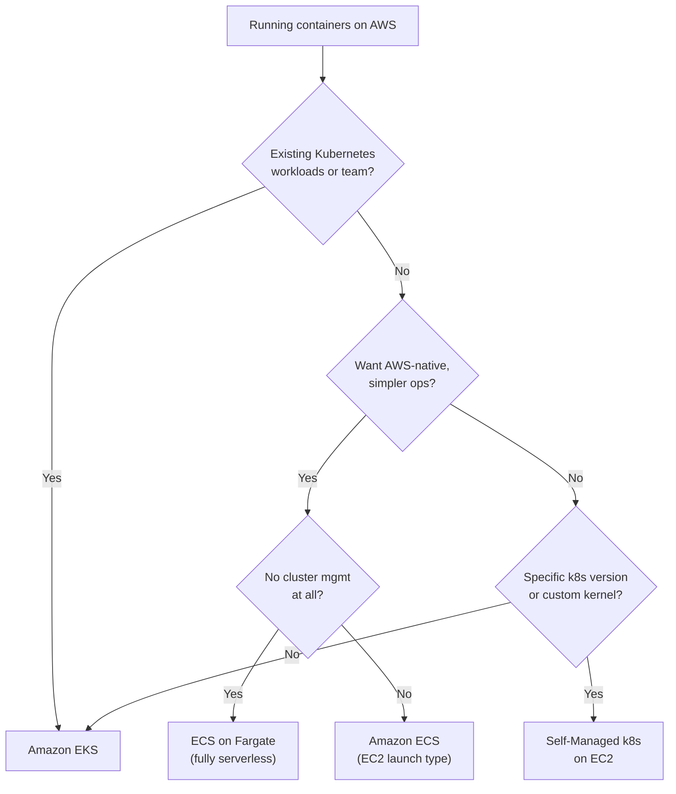
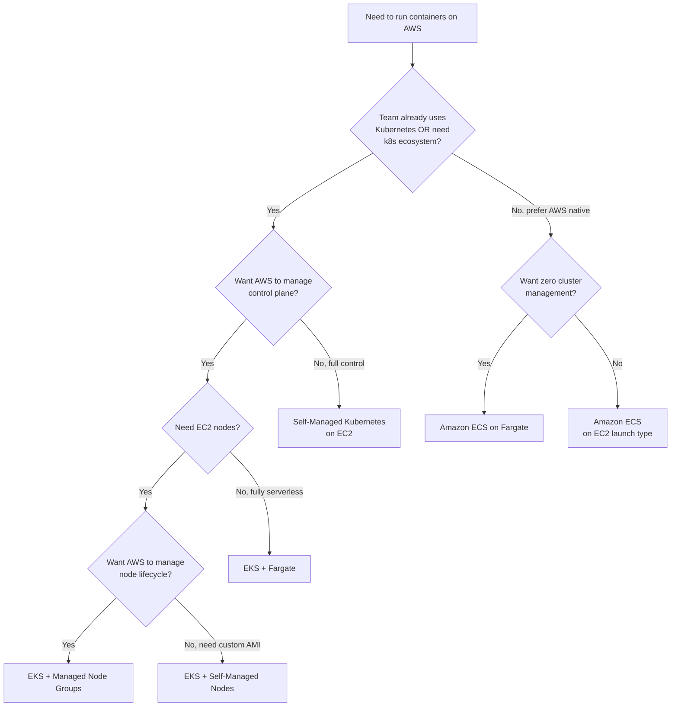

# EKS Exam Scenarios & Q&A - SAA-C03 Deep Dive

> 12+ exam-style MCQs covering every major EKS topic, plus a decision tree for choosing between ECS, EKS, and Fargate, and a full cheat sheet.

See also: [01 - EKS Fundamentals & Architecture](01%20-%20EKS%20Fundamentals%20%26%20Architecture.md) · [02 - EKS Node Types - Managed, Self-Managed, Fargate](02%20-%20EKS%20Node%20Types%20-%20Managed%2C%20Self-Managed%2C%20Fargate.md) · [03 - EKS Networking - VPC CNI, Load Balancing & Ingress](03%20-%20EKS%20Networking%20-%20VPC%20CNI%2C%20Load%20Balancing%20%26%20Ingress.md) · [04 - EKS IAM, IRSA, Pod Identity & Security](04%20-%20EKS%20IAM%2C%20IRSA%2C%20Pod%20Identity%20%26%20Security.md) · [05 - EKS Storage - EBS, EFS, FSx CSI Drivers](05%20-%20EKS%20Storage%20-%20EBS%2C%20EFS%2C%20FSx%20CSI%20Drivers.md) · [06 - EKS Scaling & Observability](06%20-%20EKS%20Scaling%20%26%20Observability.md)

---

## Table of Contents

- [Exam-Style Questions](#exam-style-questions)
- [Decision Tree - ECS vs EKS vs Fargate vs Self-Managed](#decision-tree---ecs-vs-eks-vs-fargate-vs-self-managed)
- [EKS Cheat Sheet](#eks-cheat-sheet)
- [Common Exam Traps Summary](#common-exam-traps-summary)

---

---

## Exam-Style Questions

---

### Question 1 - IRSA Setup

A company runs an EKS cluster. An application pod needs to read objects from an S3 bucket. A solutions architect needs to grant the pod the minimum necessary permissions without storing credentials in the container image or environment variables.

**Which approach should the architect use?**

A. Attach the `AmazonS3ReadOnlyAccess` policy to the EC2 node IAM role used by the node group.

B. Create an IAM user with S3 read permissions, generate access keys, and store them as a Kubernetes Secret.

C. Create an IAM role with S3 read permissions, create a Kubernetes ServiceAccount annotated with the role ARN, configure the trust policy for the cluster OIDC provider, and use the ServiceAccount in the pod spec.

D. Add `AWS_ACCESS_KEY_ID` and `AWS_SECRET_ACCESS_KEY` to the pod's environment variables using a ConfigMap.

**Answer: C**

**Explanation:** This is IRSA (IAM Roles for Service Accounts). Option C provides temporary credentials scoped to a specific pod/ServiceAccount without storing long-lived credentials. Option A over-provisions (all pods on the node get S3 access). Options B and D use long-lived credentials — a security anti-pattern. IRSA uses OIDC federation + STS AssumeRoleWithWebIdentity to generate temporary, auto-rotating credentials.

**Exam Tip:** Any question about "pods needing AWS access without storing credentials" → IRSA or Pod Identity.

---

### Question 2 - Node Storage Access Mode

A company runs a stateless web application on EKS. The application requires a shared directory where all pod replicas across multiple nodes can simultaneously read and write uploaded files. The application is deployed in a multi-AZ EKS cluster.

**Which storage solution meets these requirements?**

A. Amazon EBS with `gp3` StorageClass and `ReadWriteOnce` access mode.

B. Amazon EFS with the EFS CSI driver and `ReadWriteMany` access mode.

C. Instance store volumes on the EC2 worker nodes.

D. Amazon EBS with `io2` StorageClass and `ReadWriteMany` access mode.

**Answer: B**

**Explanation:** EFS supports `ReadWriteMany` — multiple pods on multiple nodes in multiple AZs can mount and write simultaneously. EBS (options A and D) is `ReadWriteOnce` — it can only be attached to ONE node at a time, regardless of volume type. EBS does NOT support `ReadWriteMany`. Instance store (option C) is ephemeral and node-local.

**Exam Trap:** EBS options mentioning `ReadWriteMany` are always wrong — EBS does not support this mode.

---

### Question 3 - Node Type for Fargate

A company wants to run Kubernetes batch jobs on EKS. The jobs run for 10–15 minutes, are triggered by S3 events, and the company wants to pay only when jobs are actively running. The company does not want to manage EC2 instances.

**Which EKS data plane option should they use?**

A. Managed Node Groups with Spot instances and Cluster Autoscaler.

B. EKS Fargate with a Fargate profile targeting the batch namespace.

C. Self-Managed Nodes with a custom AMI.

D. Managed Node Groups with Reserved instances.

**Answer: B**

**Explanation:** EKS Fargate is serverless — there are no EC2 nodes to manage, and you pay per pod-second (vCPU and memory). For short-lived batch jobs that run infrequently, Fargate eliminates idle node cost. Fargate profiles can target specific namespaces/labels so only batch pods run serverlessly. Options A and D involve managing EC2 instances with continuous idle cost. Option C has the highest management overhead.

**Exam Tip:** "Pay only when running + no EC2 management + Kubernetes" → EKS Fargate.

---

### Question 4 - Control Plane Endpoint Security

An organization's security team requires that the Kubernetes API server of an EKS cluster must not be reachable from the public internet. Developers access the cluster from within a corporate network connected to the VPC via AWS Direct Connect.

**Which configuration achieves this?**

A. Enable public endpoint access only, but restrict CIDR to the corporate IP range.

B. Enable private endpoint access only and disable public endpoint access.

C. Enable both public and private endpoint access.

D. Deploy an NLB in front of the EKS API server endpoint.

**Answer: B**

**Explanation:** "Must not be reachable from the public internet" requires disabling the public endpoint entirely. With private-only endpoint, the API server is only accessible from within the VPC (and connected networks like Direct Connect). Option A still exposes the endpoint publicly, even if restricted to a CIDR. Option C still has a public endpoint. Option D is not possible — EKS manages the control plane infrastructure.

**Exam Trap:** Restricting public access with CIDR (Option A) still means the endpoint is technically public — it does not meet a "must not be reachable from internet" requirement.

---

### Question 5 - Pod Scaling Trigger

A company runs a message-processing application on EKS. The application reads messages from an SQS queue. During business hours, the queue depth rises to thousands of messages. After hours, the queue is nearly empty. The team wants the number of pod replicas to automatically match the queue depth.

**Which scaling solution should they use?**

A. Horizontal Pod Autoscaler (HPA) with CPU utilization metric.

B. Vertical Pod Autoscaler (VPA) in Auto mode.

C. KEDA with the SQS scaler, setting `queueLength` to target messages-per-pod.

D. Cluster Autoscaler watching for Pending pods.

**Answer: C**

**Explanation:** KEDA (Kubernetes Event Driven Autoscaler) scales pods based on external event sources including SQS queue depth — exactly what this scenario requires. Standard HPA (option A) scales on CPU/memory, not SQS depth. VPA (option B) resizes pods, it does not scale replicas. Cluster Autoscaler (option D) scales nodes, not pods, and only responds to Pending pods — it does not watch SQS.

**Exam Tip:** "Scale based on SQS queue depth / external event source" → KEDA.

---

### Question 6 - Node Autoscaling Right-Sizing

A solutions architect is designing an EKS cluster that runs dozens of microservices with highly varied CPU and memory requirements — some pods are CPU-heavy, others are memory-heavy, and workloads fluctuate throughout the day. The architect wants to minimize EC2 costs by always using the cheapest instance type that can fit the pending pods.

**Which node autoscaling solution should the architect choose?**

A. Cluster Autoscaler with one Auto Scaling Group per instance type.

B. Cluster Autoscaler with a single mixed-instance ASG.

C. Karpenter with a NodePool allowing multiple instance families and both Spot and On-Demand.

D. Manual scaling of ASGs based on CloudWatch alarms.

**Answer: C**

**Explanation:** Karpenter dynamically selects the cheapest available instance type that fits the pending pod requirements at the time of provisioning. It considers Spot vs On-Demand pricing, instance family, and bin-packing. Cluster Autoscaler (options A/B) is constrained to pre-defined ASG configurations — it cannot dynamically pick instance types per workload. Option D is manual and cannot respond quickly enough.

**Exam Tip:** "Cheapest instance type that fits + dynamic selection + Spot" → Karpenter.

---

### Question 7 - aws-auth ConfigMap

A DevOps engineer creates an EKS cluster using an IAM role called `PlatformTeamRole`. The engineer then tries to access the cluster using a different IAM role called `DevTeamRole`, but receives "Unauthorized" errors from kubectl.

**What is the most likely cause and fix?**

A. The DevTeamRole does not have the `AmazonEKSClusterPolicy` attached.

B. The DevTeamRole must be added to the `aws-auth` ConfigMap in `kube-system` with an appropriate Kubernetes RBAC group.

C. The DevTeamRole needs `eks:DescribeCluster` permission in IAM.

D. The kubectl context must specify the DevTeamRole credentials.

**Answer: B**

**Explanation:** EKS uses a two-step auth process: (1) AWS IAM authenticates the caller, (2) the `aws-auth` ConfigMap maps the IAM ARN to a Kubernetes user/group, and RBAC authorizes the action. The cluster creator (`PlatformTeamRole`) is automatically admin. Any other IAM role must be explicitly added to `aws-auth`. Option A — `AmazonEKSClusterPolicy` is for the cluster service role, not for users. Option C — `eks:DescribeCluster` is needed in IAM to generate kubeconfig, but after that, `aws-auth` is the gating factor. Option D — kubectl context selection doesn't solve the authorization issue.

**Exam Trap:** IAM permissions alone are not sufficient for `kubectl` access to EKS. The IAM identity must also be mapped in `aws-auth`.

---

### Question 8 - EBS AZ Affinity

A developer deploys a StatefulSet on EKS using an EBS-backed PVC with `gp3` StorageClass. The `volumeBindingMode` is set to `Immediate`. When the pod is rescheduled after a node failure, it enters a `Pending` state and cannot start.

**What is the most likely reason?**

A. The EBS volume does not support the `ReadWriteOnce` access mode.

B. The EBS volume was created in a different Availability Zone than the node where the pod was rescheduled.

C. The EBS CSI driver is not installed on the cluster.

D. The pod needs an EFS volume instead of EBS for StatefulSets.

**Answer: B**

**Explanation:** EBS volumes are AZ-specific. With `volumeBindingMode: Immediate`, the EBS volume is created as soon as the PVC is created — potentially in a different AZ than where the pod later gets scheduled. When the pod moves to a node in a different AZ, it cannot attach the EBS volume. The fix is `volumeBindingMode: WaitForFirstConsumer` — this delays EBS volume creation until the pod is scheduled, ensuring they end up in the same AZ.

**Exam Tip:** `Immediate` binding mode + EBS = AZ mismatch risk. Always use `WaitForFirstConsumer` for EBS StorageClasses.

---

### Question 9 - Fargate Storage Limitation

A company wants to migrate a PostgreSQL database workload to EKS Fargate to eliminate EC2 management overhead. The database requires persistent block storage.

**What should the solutions architect recommend?**

A. Use EKS Fargate with an EBS-backed PVC and `gp3` StorageClass.

B. Use EKS Fargate is not suitable for this workload. Use EKS Managed Node Groups with EBS-backed storage instead.

C. Use EKS Fargate with an EFS-backed PVC for persistent storage.

D. Use EKS Fargate with ephemeral storage up to 20 GB.

**Answer: B**

**Explanation:** Fargate pods cannot attach EBS volumes — this is a fundamental Fargate limitation. EFS is supported on Fargate (option C), but EFS is a file system, not block storage, and PostgreSQL requires a block storage device (`ReadWriteOnce` block semantics) for optimal performance and compatibility. Ephemeral storage (option D) is non-persistent. For stateful database workloads requiring EBS, Managed Node Groups are the correct choice.

**Exam Trap:** EFS works on Fargate, EBS does NOT. Database workloads typically need block storage (EBS), not NFS (EFS).

---

### Question 10 - HPA Prerequisite

A team deploys an application on EKS with an HPA configured to scale at 70% CPU utilization. After deploying, the `kubectl get hpa` output shows `<unknown>` for current CPU utilization, and the HPA does not scale.

**What is the most likely cause?**

A. The Cluster Autoscaler is not installed.

B. The pod's container does not have CPU `requests` defined in the pod spec.

C. The HPA must be configured with `autoscaling/v1` API version instead of `v2`.

D. CloudWatch Container Insights is not enabled.

**Answer: B**

**Explanation:** HPA calculates CPU utilization as `(current CPU usage) / (CPU request)`. If no CPU `request` is defined, the calculation cannot be performed and the metric shows `<unknown>`. Cluster Autoscaler (option A) handles node scaling, not pod scaling metrics. The HPA API version (option C) does not affect whether metrics are collected. Container Insights (option D) is for CloudWatch dashboards, not the Metrics API used by HPA.

**Exam Tip:** HPA requires `requests` (not just `limits`) to be set on every container being monitored.

---

### Question 11 - KMS Secrets Encryption

A security auditor flags that Kubernetes Secrets in an EKS cluster are not encrypted at rest and could be read if someone gains access to the etcd backup.

**Which solution addresses this finding?**

A. Store all secrets in Kubernetes Secrets objects with base64 encoding.

B. Enable EKS envelope encryption using an AWS KMS Customer Managed Key.

C. Use AWS Secrets Manager and inject values as environment variables in the pod spec.

D. Enable VPC Flow Logs for the EKS cluster.

**Answer: B**

**Explanation:** By default, Kubernetes Secrets are base64-encoded (not encrypted) in etcd. Enabling envelope encryption with KMS means etcd stores an encrypted ciphertext — even with etcd backup access, the data cannot be read without the KMS key. Option A is the current (insecure) state — base64 is encoding, not encryption. Option C (AWS Secrets Manager) is a good complementary control but doesn't encrypt existing Kubernetes Secrets in etcd. Option D (VPC Flow Logs) addresses network visibility, not storage encryption.

**Exam Tip:** "Encrypt Kubernetes Secrets at rest in etcd" → EKS envelope encryption with KMS CMK.

---

### Question 12 - Multi-AZ Shared Storage

A solutions architect needs to deploy a CMS (content management system) on EKS. Multiple frontend pods running across three AZs need to read and write to a shared media upload directory. The solution must be highly available.

**Which storage configuration is correct?**

A. EBS `gp3` volume with `ReadWriteMany` access mode and `WaitForFirstConsumer` binding.

B. One EBS volume per AZ, each mounted by pods in that AZ only.

C. Amazon EFS with the EFS CSI driver, `ReadWriteMany` access mode, and a PVC referencing an EFS file system.

D. S3 bucket mounted via a FUSE driver on each node.

**Answer: C**

**Explanation:** EFS is a regional, multi-AZ managed NFS service with native `ReadWriteMany` support. All pods across all AZs can mount the same EFS PVC and write simultaneously. Option A is invalid — EBS does not support `ReadWriteMany`. Option B creates data isolation between AZs — the pods cannot share a single directory. Option D uses a third-party FUSE driver and S3, which has much higher latency and is not the AWS-native solution.

**Exam Tip:** "Multiple pods, multiple AZs, shared write access" → Amazon EFS + ReadWriteMany.

---

### Question 13 - Container Insights Setup

A platform engineering team needs to collect CPU and memory metrics at the pod level from their EKS cluster and create CloudWatch dashboards and alarms. They want the simplest setup using AWS-native tooling.

**Which approach should they use?**

A. Install Prometheus and Grafana in the cluster and configure them to scrape kubelet metrics.

B. Enable the `amazon-cloudwatch-observability` EKS managed add-on, which deploys the CloudWatch Agent and Fluent Bit DaemonSets.

C. Configure VPC Flow Logs and parse them in CloudWatch Logs Insights.

D. Use AWS X-Ray to trace pod-to-pod communication and derive metrics.

**Answer: B**

**Explanation:** The `amazon-cloudwatch-observability` managed add-on is the simplest AWS-native solution — it automatically deploys the CloudWatch Agent (for metrics) and Fluent Bit (for logs) DaemonSets, enabling Container Insights dashboards with no manual configuration. Option A (Prometheus + Grafana) is a valid alternative but requires more setup and is not AWS-native. Option C (VPC Flow Logs) captures network flows, not CPU/memory metrics. Option D (X-Ray) is for distributed tracing, not infrastructure metrics.

---

## Decision Tree - ECS vs EKS vs Fargate vs Self-Managed

### Scenario-to-Service Mapping

| Scenario                                            | Best Choice                |
| :-------------------------------------------------- | :------------------------- |
| Migrate existing k8s workload from GKE/on-prem      | EKS                        |
| New AWS-native microservices app, small team        | ECS on Fargate             |
| ML training jobs on GPU, custom CUDA drivers        | EKS + Self-Managed Nodes   |
| Run Helm charts, ArgoCD, Istio service mesh         | EKS                        |
| Simple web API with auto-scaling, minimal ops       | ECS on Fargate             |
| Batch jobs with zero idle cost                      | ECS Fargate or EKS Fargate |
| Custom OS kernel hardening required                 | EKS + Self-Managed Nodes   |
| "Kubernetes is too complex, just run my containers" | ECS                        |

[⬆ Back to top](#table-of-contents)

---

## EKS Cheat Sheet

### Core Architecture

| Component                     | Who Manages     | Details                             |
| :---------------------------- | :-------------- | :---------------------------------- |
| Control plane (masters, etcd) | AWS             | Multi-AZ, $0.10/hr                  |
| Managed Node Groups           | AWS (lifecycle) | EC2, AWS-managed ASG                |
| Self-Managed Nodes            | You             | Custom AMI, your ASG                |
| Fargate                       | AWS (fully)     | Per-pod microVMs, RWO not supported |

### IAM

| Concept            | Key Detail                                                                               |
| :----------------- | :--------------------------------------------------------------------------------------- |
| Cluster IAM Role   | Assumed by EKS service; needs `AmazonEKSClusterPolicy`                                   |
| Node IAM Role      | Attached to EC2 via instance profile; needs `AmazonEKSWorkerNodePolicy`, ECR readonly    |
| IRSA               | OIDC provider + STS AssumeRoleWithWebIdentity + SA annotation; scoped per ServiceAccount |
| Pod Identity       | Newer; uses EKS Pod Identity Agent; `pods.eks.amazonaws.com` trust principal             |
| aws-auth ConfigMap | Maps IAM ARNs to k8s RBAC roles; must add roles manually                                 |

### Networking

| Concept                  | Key Detail                                                  |
| :----------------------- | :---------------------------------------------------------- |
| VPC CNI                  | Pods get real VPC IPs; no overlay; consumes ENI/IP capacity |
| ENI limit                | Instance-type-dependent; limits max pods per node           |
| Prefix delegation        | 16× pod density boost without changing instance type        |
| Service LoadBalancer     | Creates NLB via AWS LBC                                     |
| Ingress                  | Creates ALB via AWS LBC; L7 host/path routing               |
| Security Groups for Pods | Per-pod SG via branch ENI; Nitro instances only             |

### Storage

| Driver         | Access Mode   | Multi-AZ     | Fargate |
| :------------- | :------------ | :----------- | :------ |
| EBS CSI        | ReadWriteOnce | No           | No      |
| EFS CSI        | ReadWriteMany | Yes          | Yes     |
| FSx Lustre CSI | ReadWriteMany | No (scratch) | No      |

### Scaling

| Tool               | Scales                 | Trigger                            |
| :----------------- | :--------------------- | :--------------------------------- |
| HPA                | Pod replicas           | CPU / memory / custom metrics      |
| VPA                | Pod resource requests  | CPU / memory usage history         |
| KEDA               | Pod replicas           | External events (SQS, Kafka, etc.) |
| Cluster Autoscaler | ASG nodes              | Pending pods                       |
| Karpenter          | EC2 instances directly | Pending pods (smarter selection)   |

### Observability

| Tool                  | What It Does                               |
| :-------------------- | :----------------------------------------- |
| Control Plane Logging | 5 log types → CloudWatch Logs              |
| Container Insights    | Pod/node/container CPU+memory → CloudWatch |
| Fluent Bit            | Container stdout/stderr → CloudWatch Logs  |
| CloudWatch Alarms     | Alert on pod/node metrics                  |

[⬆ Back to top](#table-of-contents)

---

## Common Exam Traps Summary

| Trap                                                  | Correct Understanding                                                              |
| :---------------------------------------------------- | :--------------------------------------------------------------------------------- |
| "EBS supports ReadWriteMany"                          | FALSE — EBS is ReadWriteOnce only                                                  |
| "Fargate supports EBS volumes"                        | FALSE — Fargate supports EFS only for persistence                                  |
| "Node IAM role gives pods AWS access"                 | WRONG — pods get node role access only if IMDS is reachable; use IRSA/Pod Identity |
| "aws-auth not needed for cluster creator"             | Creator is auto-admin; all OTHER identities need aws-auth                          |
| "HPA works without resource requests"                 | FALSE — CPU requests are required for HPA CPU metric                               |
| "Immediate binding mode is safe for EBS"              | RISKY — use WaitForFirstConsumer to avoid AZ mismatch                              |
| "SCPs don't apply to EKS nodes"                       | WRONG in a different way — SCPs apply to ALL IAM calls from the account            |
| "Cluster Autoscaler picks cheapest instance"          | FALSE — CA scales fixed ASGs; Karpenter picks cheapest                             |
| "EKS is just Kubernetes on EC2"                       | NO — AWS manages the entire control plane; you never see master nodes              |
| "Private endpoint means no internet access for nodes" | Nodes still need internet (or VPC endpoints) to reach ECR, S3, CloudWatch          |

[⬆ Back to top](#table-of-contents)
