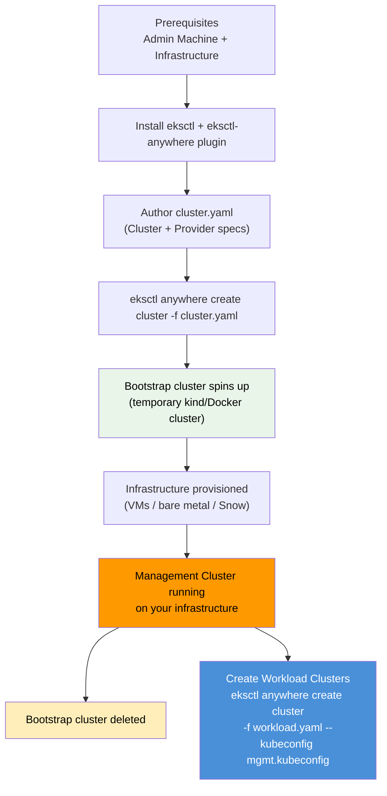
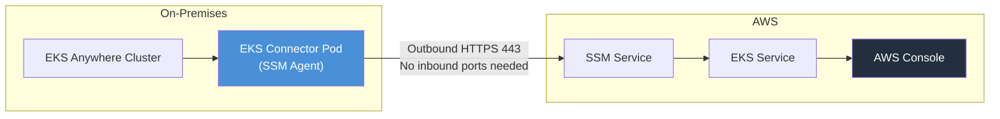

# EKS Anywhere Deployment, Curated Packages & Support - SAA-C03 Deep Dive

> EKS Anywhere is installed and managed via the `eksctl anywhere` CLI, supports a curated add-on package ecosystem, and offers an **Enterprise Subscription** for AWS support — making it the only on-prem Kubernetes solution with an AWS-backed support path.

See also: [01 - EKS Anywhere Fundamentals & Architecture](01%20-%20EKS%20Anywhere%20Fundamentals%20%26%20Architecture.md) · [03 - EKS Anywhere Exam Scenarios & Q&A](03%20-%20EKS%20Anywhere%20Exam%20Scenarios%20%26%20Q%26A.md) · [01 - EKS Fundamentals & Architecture](01%20-%20EKS%20Fundamentals%20%26%20Architecture.md) · [01 - EKS Distro Fundamentals & Architecture](01%20-%20EKS%20Distro%20Fundamentals%20%26%20Architecture.md) · [01 - ECS Anywhere Fundamentals & Architecture](01%20-%20ECS%20Anywhere%20Fundamentals%20%26%20Architecture.md)

---

## Table of Contents

- [Part 1: Installation Prerequisites & Tooling](#part-1-installation-prerequisites--tooling)
- [Part 2: Cluster Creation Flow — Step by Step](#part-2-cluster-creation-flow--step-by-step)
- [Part 3: Cluster Configuration Spec](#part-3-cluster-configuration-spec)
- [Part 4: Cluster Lifecycle Management](#part-4-cluster-lifecycle-management)
- [Part 5: EKS Anywhere Curated Packages](#part-5-eks-anywhere-curated-packages)
- [Part 6: EKS Connector — Viewing in AWS Console](#part-6-eks-connector--viewing-in-aws-console)
- [Part 7: Enterprise Subscription & Support](#part-7-enterprise-subscription--support)
- [Part 8: Use Cases — Data Residency, Air-Gap, Edge](#part-8-use-cases--data-residency-air-gap-edge)
- [Part 9: Licensing & Cost Model](#part-9-licensing--cost-model)
- [Part 10: EKS Anywhere vs EKS vs EKS Distro — Full Comparison](#part-10-eks-anywhere-vs-eks-vs-eks-distro--full-comparison)
- [Summary: Key Takeaways for SAA-C03](#summary-key-takeaways-for-saa-c03)

---



---

## Part 1: Installation Prerequisites & Tooling

### Admin Machine Requirements

The admin machine is where you run the `eksctl anywhere` CLI. It is **not** part of the cluster itself.

| Requirement         | Detail                                                                     |
| :------------------ | :------------------------------------------------------------------------- |
| **OS**              | Linux (amd64 or arm64), macOS, or Windows WSL2                             |
| **Docker**          | Must be installed (used for the bootstrap cluster)                         |
| **kubectl**         | For post-creation cluster interaction                                      |
| **Internet access** | Required during install to pull images (air-gap needs pre-pulled registry) |
| **Connectivity**    | Must be able to reach the target infrastructure                            |

### Installing the CLI

```bash
# Install eksctl (if not already installed)
curl --silent --location \
  "https://github.com/weaveworks/eksctl/releases/latest/download/eksctl_$(uname -s)_amd64.tar.gz" \
  | tar xz -C /tmp
sudo mv /tmp/eksctl /usr/local/bin

# Install the eksctl-anywhere plugin
export EKSA_RELEASE="v0.20.0"
curl -LO "https://anywhere-assets.eks.amazonaws.com/releases/eks-a/${EKSA_RELEASE}/artifacts/eks-a/${EKSA_RELEASE}/linux/amd64/eksctl-anywhere-${EKSA_RELEASE}-linux-amd64.tar.gz"
tar xzf eksctl-anywhere-${EKSA_RELEASE}-linux-amd64.tar.gz
sudo install -m 0755 ./eksctl-anywhere /usr/local/bin/eksctl-anywhere

# Verify
eksctl anywhere version
```

### Generating a Cluster Config Template

```bash
# Generate a starter cluster config for vSphere
eksctl anywhere generate clusterconfig my-cluster \
  --provider vsphere > cluster.yaml

# Generate for bare metal
eksctl anywhere generate clusterconfig my-cluster \
  --provider baremetal > cluster.yaml

# Generate for Snow
eksctl anywhere generate clusterconfig my-cluster \
  --provider snow > cluster.yaml
```

[⬆ Back to top](#table-of-contents)

---

## Part 2: Cluster Creation Flow — Step by Step

### Phase 1: Bootstrap Cluster

When you run `eksctl anywhere create cluster`, the CLI:

1. Spins up a **temporary kind cluster** inside Docker on the admin machine
2. Installs Cluster API (CAPI) controllers into the bootstrap cluster
3. Uses CAPI to provision the first control plane node on your target infrastructure

### Phase 2: Pivot to Management Cluster

1. Once the management cluster's control plane is healthy, CAPI controllers are **moved (pivoted)** from the bootstrap cluster to the new management cluster
2. The management cluster now manages its own lifecycle

### Phase 3: Bootstrap Cleanup

1. The temporary bootstrap cluster is **deleted**
2. The admin machine now connects directly to the management cluster

### Full Creation Command

```bash
# Create from a config file
eksctl anywhere create cluster \
  --filename cluster.yaml \
  --hardware-csv hardware.csv    # only needed for bare metal

# With verbose logging
eksctl anywhere create cluster \
  --filename cluster.yaml \
  -v 9
```

### Air-Gapped Installation

For environments without internet access:

```bash
# 1. Pre-pull and mirror all required images to a local registry
eksctl anywhere import images \
  --input ./eks-a-bundle.tar \
  --bundles ./eks-anywhere-bundles.yaml

# 2. Point cluster config to your private registry
# (registryMirrorConfiguration in cluster.yaml)

# 3. Create cluster normally
eksctl anywhere create cluster --filename cluster.yaml
```

[⬆ Back to top](#table-of-contents)

---

## Part 3: Cluster Configuration Spec

EKS Anywhere clusters are defined as **Kubernetes-style YAML manifests** — a key design principle that enables GitOps.

### Cluster Spec (Core)

```yaml
apiVersion: anywhere.eks.amazonaws.com/v1alpha1
kind: Cluster
metadata:
  name: my-production-cluster
  namespace: default
spec:
  clusterNetwork:
    pods:
      cidrBlocks:
        - 192.168.0.0/16
    services:
      cidrBlocks:
        - 10.96.0.0/12
    cni: cilium
  controlPlaneConfiguration:
    count: 3 # HA control plane — odd number
    endpoint:
      host: "10.10.0.100" # VIP for k8s API server
    machineGroupRef:
      kind: VSphereMachineConfig
      name: my-cluster-cp
  workerNodeGroupConfigurations:
    - count: 5
      machineGroupRef:
        kind: VSphereMachineConfig
        name: my-cluster-worker
      name: md-0
  kubernetesVersion: "1.30"
  managementCluster:
    name: my-management-cluster # omit if this IS the management cluster
  datacenterRef:
    kind: VSphereDatacenterConfig
    name: my-cluster
  externalEtcdConfiguration: # optional: separate etcd nodes for HA
    count: 3
    machineGroupRef:
      kind: VSphereMachineConfig
      name: my-cluster-etcd
```

### Registry Mirror (Air-Gap)

```yaml
spec:
  registryMirrorConfiguration:
    endpoint: "registry.internal.company.com"
    port: "443"
    caCertContent: |
      -----BEGIN CERTIFICATE-----
      ...
      -----END CERTIFICATE-----
    authenticate: true
```

[⬆ Back to top](#table-of-contents)

---

## Part 4: Cluster Lifecycle Management

### Cluster Upgrades

```bash
# Upgrade a cluster to a new Kubernetes version
# 1. Edit cluster.yaml to bump kubernetesVersion
# 2. Apply the upgrade
eksctl anywhere upgrade cluster \
  --filename cluster.yaml

# Check upgrade status
eksctl anywhere get cluster my-cluster
```

**Upgrade Strategy:**

- Rolling update — control plane upgraded first, then workers
- Can only upgrade **one minor version at a time** (e.g., 1.29 → 1.30, NOT 1.28 → 1.30)

### Scaling

```bash
# Scale worker nodes — edit cluster.yaml workerNodeGroupConfigurations.count
# then apply:
kubectl apply -f cluster.yaml \
  --kubeconfig my-mgmt-cluster.kubeconfig
```

### Deleting a Cluster

```bash
# Delete workload cluster
eksctl anywhere delete cluster \
  --filename workload-cluster.yaml \
  --kubeconfig my-mgmt-cluster.kubeconfig

# Delete management cluster (cleans up all infrastructure)
eksctl anywhere delete cluster \
  --filename cluster.yaml
```

### Cluster Status Check

```bash
eksctl anywhere get cluster
eksctl anywhere describe cluster my-cluster

# Check underlying CAPI objects
kubectl get clusters -A --kubeconfig mgmt.kubeconfig
kubectl get machines -A --kubeconfig mgmt.kubeconfig
```

[⬆ Back to top](#table-of-contents)

---

## Part 5: EKS Anywhere Curated Packages

One of the key differentiators of EKS Anywhere over raw EKS Distro is the **Curated Packages** ecosystem — AWS-tested, AWS-supported add-ons for on-prem Kubernetes.

### What Are Curated Packages?

- Pre-validated, AWS-supported Helm charts for common Kubernetes add-ons
- Hosted in AWS ECR Public and signed by AWS
- Available **only with an Enterprise Subscription** (some packages also have community tiers)
- Installed and managed via the Package Controller (runs in your cluster)

### Available Curated Packages

| Package                                 | Category           | Description                                            |
| :-------------------------------------- | :----------------- | :----------------------------------------------------- |
| **Harbor**                              | Container Registry | Private container registry for air-gapped environments |
| **MetalLB**                             | Networking         | Bare-metal load balancer (Layer 2 / BGP)               |
| **Emissary Ingress**                    | Ingress            | API Gateway and Ingress controller                     |
| **Cert Manager**                        | Security           | TLS certificate management and rotation                |
| **Prometheus**                          | Observability      | Metrics collection and alerting                        |
| **Grafana**                             | Observability      | Dashboards for Prometheus metrics                      |
| **Fluentbit**                           | Logging            | Log forwarding and aggregation                         |
| **AWS Distro for OpenTelemetry (ADOT)** | Observability      | OpenTelemetry collector from AWS                       |
| **Kubernetes Metrics Server**           | Monitoring         | HPA-required metrics aggregation                       |
| **External DNS**                        | DNS                | Automatic DNS record management                        |

### Installing a Curated Package

```bash
# List available packages
eksctl anywhere list packages --cluster my-cluster

# Generate a package config
eksctl anywhere generate package harbor \
  --cluster my-cluster > harbor-package.yaml

# Install the package
eksctl anywhere create packages -f harbor-package.yaml \
  --cluster my-cluster

# Check package status
eksctl anywhere get packages --cluster my-cluster
```

### Package Controller

The Package Controller is automatically deployed to every EKS Anywhere cluster. It:

- Watches for `Package` custom resources
- Pulls signed images from AWS ECR
- Reconciles installed packages to desired state

**Exam Note:** Curated Packages require an **active Enterprise Subscription** for full support. They are a key reason organizations choose EKS Anywhere over raw EKS Distro.

[⬆ Back to top](#table-of-contents)

---

## Part 6: EKS Connector — Viewing in AWS Console

### Registration Steps

```bash
# Step 1: Register the cluster with EKS Connector
aws eks register-cluster \
  --name my-eks-anywhere-cluster \
  --connector-config roleArn=arn:aws:iam::123456789012:role/AmazonEKSConnectorAgentRole,\
resources=[OTHER] \
  --region us-east-1

# Step 2: Download the connector manifest
aws eks describe-cluster \
  --name my-eks-anywhere-cluster \
  --region us-east-1 \
  --query "cluster.connectorConfig.activationCode"

# Step 3: Apply the connector manifest to your on-prem cluster
kubectl apply -f eks-connector.yaml \
  --kubeconfig my-cluster.kubeconfig

# Step 4: Apply RBAC to allow console access
kubectl apply -f eks-connector-clusterrole.yaml \
  --kubeconfig my-cluster.kubeconfig
```

### IAM Requirements for Console Access

To view workloads in the AWS console, each IAM user/role needs a corresponding **ClusterRole + ClusterRoleBinding** in the on-prem cluster:

```yaml
apiVersion: rbac.authorization.k8s.io/v1
kind: ClusterRole
metadata:
  name: eks-connector-console-viewer
rules:
  - apiGroups: [""]
    resources: ["pods", "nodes", "namespaces", "services"]
    verbs: ["get", "list"]
---
apiVersion: rbac.authorization.k8s.io/v1
kind: ClusterRoleBinding
metadata:
  name: eks-connector-console-viewer-binding
subjects:
  - kind: User
    name: "arn:aws:iam::123456789012:user/my-admin"
roleRef:
  kind: ClusterRole
  name: eks-connector-console-viewer
  apiGroup: rbac.authorization.k8s.io
```

### EKS Connector Architecture



**Security Note:** EKS Connector uses **outbound-only** HTTPS connections via SSM. No inbound firewall rules are required on the on-prem cluster.

[⬆ Back to top](#table-of-contents)

---

## Part 7: Enterprise Subscription & Support

### What Is the Enterprise Subscription?

The **EKS Anywhere Enterprise Subscription** is an annual subscription that provides:

| Benefit                         | Detail                                                  |
| :------------------------------ | :------------------------------------------------------ |
| **AWS Support**                 | Access to AWS Premium Support for EKS Anywhere issues   |
| **Curated Packages**            | Full access to all AWS-supported add-on packages        |
| **Extended Kubernetes support** | Patches for Kubernetes versions beyond standard EOL     |
| **Proactive guidance**          | Access to AWS specialists for deployment best practices |
| **License**                     | Per cluster, annual                                     |

### Support Tiers

| Support Level               | Coverage                                                |
| :-------------------------- | :------------------------------------------------------ |
| **Community (free)**        | GitHub issues, community forums, limited packages       |
| **Enterprise Subscription** | AWS Support, all curated packages, extended k8s support |

### Extended Kubernetes Version Support

EKS Anywhere Enterprise Subscription customers receive **extended support** for Kubernetes versions — aligning with the AWS EKS Extended Support windows (up to 26 months of support per minor version vs. standard 14 months upstream).

**Exam Tip:** If a question asks "which AWS offering provides supported on-prem Kubernetes with AWS technical support," the answer is **EKS Anywhere with Enterprise Subscription**.

[⬆ Back to top](#table-of-contents)

---

## Part 8: Use Cases — Data Residency, Air-Gap, Edge

### Use Case 1: Data Residency & Compliance

**Scenario:** A financial services company must keep all data — including Kubernetes control plane data (etcd) — on-premises in a specific country due to regulatory requirements.

**Why EKS Anywhere:**

- Control plane (including etcd) runs on-prem — data never leaves
- Can be fully disconnected from AWS
- EKS Connector optional for operational visibility without data egress

**Why NOT cloud EKS:**

- Control plane (including etcd) is managed by AWS in an AWS Region
- May not satisfy strict data residency regulations

### Use Case 2: Air-Gapped / Disconnected Environments

**Scenario:** A defense contractor runs applications in classified networks with no internet connectivity.

**Why EKS Anywhere:**

- Full air-gap support — pre-pull images to local registry
- `registryMirrorConfiguration` points to internal registry
- No ongoing AWS connectivity needed
- Snow family for physically isolated edge sites

### Use Case 3: Edge Computing

**Scenario:** A retailer needs Kubernetes at thousands of store locations with unreliable connectivity.

**Why EKS Anywhere:**

- Single-node clusters supported for edge sites
- Operates autonomously when disconnected
- GitOps (Flux) syncs configuration when connectivity restores
- Snow device option for extreme edge

### Use Case 4: Hybrid Cloud Consistency

**Scenario:** A company runs EKS in AWS and wants the same tooling, APIs, and add-ons for their on-prem workloads.

**Why EKS Anywhere:**

- Same `kubectl` interface, same k8s API
- Same EKS Distro base
- Same curated packages available in both environments
- Consistent security posture

[⬆ Back to top](#table-of-contents)

---

## Part 9: Licensing & Cost Model

### Cost Components

| Component                   | Cost                                                        |
| :-------------------------- | :---------------------------------------------------------- |
| **EKS Anywhere software**   | Free (open source, Apache 2.0)                              |
| **EKS Distro**              | Free                                                        |
| **EKS Connector**           | Free (pay for AWS SSM data transfer)                        |
| **Enterprise Subscription** | Paid — per cluster, annual fee                              |
| **Curated Packages**        | Included with Enterprise Subscription                       |
| **Infrastructure**          | Your own cost (servers, VMware licenses, etc.)              |
| **AWS Support**             | Separate — requires Business or Enterprise AWS Support plan |

### Comparison with Cloud EKS

|                   | Cloud EKS                           | EKS Anywhere            |
| :---------------- | :---------------------------------- | :---------------------- |
| **Cluster fee**   | $0.10/hour per cluster (~$73/month) | Free (software)         |
| **Worker nodes**  | EC2 instance costs                  | Your hardware costs     |
| **Control plane** | Included in cluster fee             | Your hardware costs     |
| **Support**       | AWS Support plan                    | Enterprise Subscription |

**Exam Note:** EKS Anywhere software is **free**. The only AWS charge is the optional Enterprise Subscription for support and curated packages.

[⬆ Back to top](#table-of-contents)

---

## Part 10: EKS Anywhere vs EKS vs EKS Distro — Full Comparison

| Dimension                      | Cloud EKS              | EKS Distro           | EKS Anywhere                                   |
| :----------------------------- | :--------------------- | :------------------- | :--------------------------------------------- |
| **Where it runs**              | AWS Regions            | Any infrastructure   | Any infrastructure                             |
| **Control plane managed by**   | AWS                    | You (DIY)            | You (via eksctl anywhere)                      |
| **Installation**               | `eksctl` / console     | Manual / Kops / etc. | `eksctl anywhere create cluster`               |
| **Lifecycle management**       | AWS (automatic)        | Manual               | `eksctl anywhere upgrade`                      |
| **Air-gap capable**            | No                     | Yes (DIY)            | Yes (built-in support)                         |
| **GitOps**                     | Via external tools     | Via external tools   | **Built-in Flux**                              |
| **Curated packages**           | EKS Add-ons            | None                 | **EKS Anywhere Curated Packages**              |
| **AWS support**                | Included               | Community only       | Enterprise Subscription                        |
| **EKS Connector**              | N/A (already in AWS)   | N/A                  | Optional                                       |
| **Cost**                       | Per cluster/hour + EC2 | Free software        | Free software + optional subscription          |
| **Platforms**                  | EC2, Fargate           | Any                  | vSphere, Bare Metal, Snow, Nutanix, CloudStack |
| **CNI**                        | AWS VPC CNI            | Your choice          | Cilium (default)                               |
| **Kubernetes version control** | AWS controls           | You control          | You control                                    |

### Decision Framework

```
Need Kubernetes in AWS cloud?
  → Amazon EKS (cloud)

Need Kubernetes on your own hardware with full lifecycle tooling + AWS support path?
  → Amazon EKS Anywhere

Need just the EKS-compatible k8s binaries to build your own tooling/platform?
  → Amazon EKS Distro

Need containers on-prem but NOT Kubernetes?
  → Amazon ECS Anywhere
```

[⬆ Back to top](#table-of-contents)

---

## Summary: Key Takeaways for SAA-C03

| Concept                            | What You Must Know                                                                    |
| :--------------------------------- | :------------------------------------------------------------------------------------ |
| **CLI**                            | `eksctl anywhere` is the primary management tool                                      |
| **Bootstrap cluster**              | Temporary — created and deleted during initial cluster creation                       |
| **Management vs Workload cluster** | Management cluster manages lifecycle of workload clusters                             |
| **Curated Packages**               | AWS-tested add-ons (Harbor, MetalLB, Prometheus, etc.) — need Enterprise Subscription |
| **EKS Connector**                  | Optional SSM-based agent for AWS console read-only visibility                         |
| **Enterprise Subscription**        | Provides AWS support + curated packages + extended k8s support                        |
| **Air-gap**                        | Fully supported via registry mirror configuration                                     |
| **Use cases**                      | Data residency, disconnected/air-gapped, edge, hybrid consistency                     |
| **Cost**                           | Software is free; Enterprise Subscription is paid                                     |
| **vs EKS Distro**                  | EKS Anywhere adds lifecycle tooling, curated packages, GitOps on top of EKS Distro    |

[⬆ Back to top](#table-of-contents)
