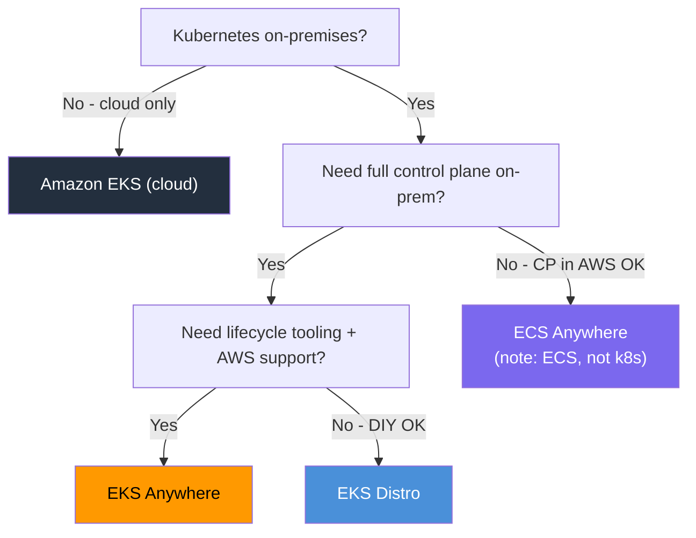
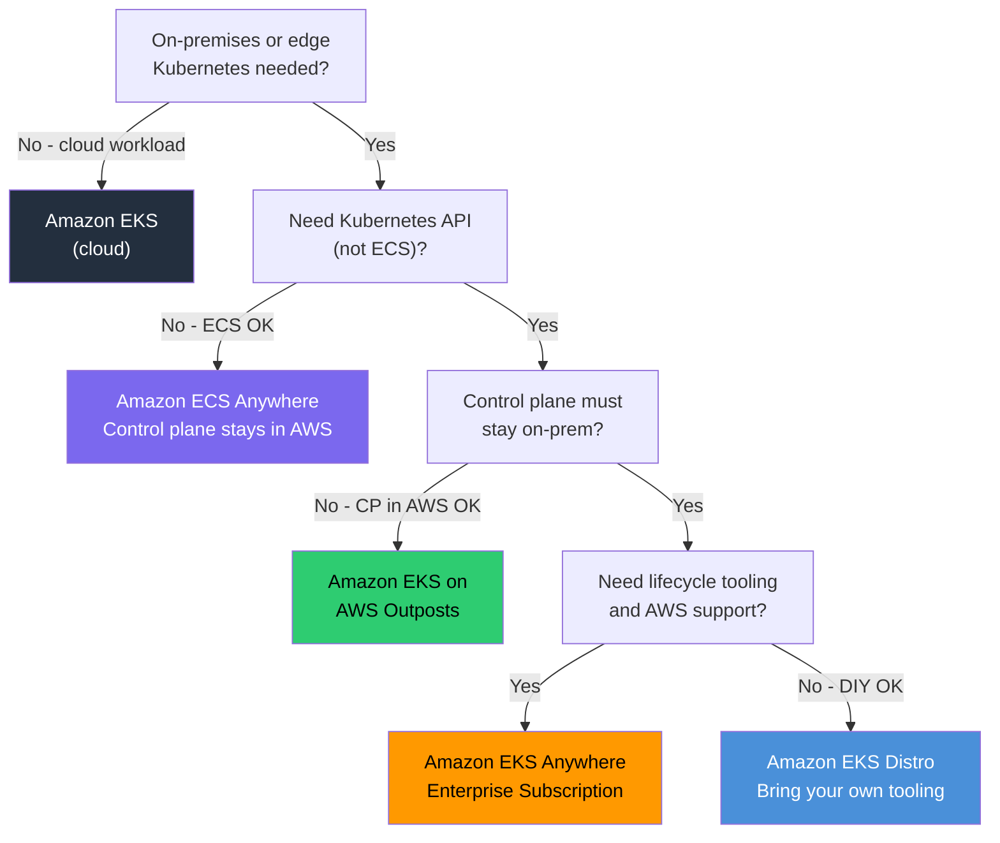

# EKS Anywhere Exam Scenarios & Q&A - SAA-C03 Deep Dive

> Exam-style MCQs, a decision table comparing EKS / EKS Anywhere / EKS Distro / ECS Anywhere, and a cheat sheet to lock in the critical distinctions before exam day.

See also: [01 - EKS Anywhere Fundamentals & Architecture](01%20-%20EKS%20Anywhere%20Fundamentals%20%26%20Architecture.md) · [02 - EKS Anywhere Deployment, Curated Packages & Support](02%20-%20EKS%20Anywhere%20Deployment%2C%20Curated%20Packages%20%26%20Support.md) · [01 - EKS Fundamentals & Architecture](01%20-%20EKS%20Fundamentals%20%26%20Architecture.md) · [01 - EKS Distro Fundamentals & Architecture](01%20-%20EKS%20Distro%20Fundamentals%20%26%20Architecture.md) · [01 - ECS Anywhere Fundamentals & Architecture](01%20-%20ECS%20Anywhere%20Fundamentals%20%26%20Architecture.md)

---

## Table of Contents

- [Part 1: Exam-Style MCQs](#part-1-exam-style-mcqs)
- [Part 2: Decision Table — EKS vs EKS Anywhere vs EKS Distro vs ECS Anywhere](#part-2-decision-table--eks-vs-eks-anywhere-vs-eks-distro-vs-ecs-anywhere)
- [Part 3: Scenario Decision Flowchart](#part-3-scenario-decision-flowchart)
- [Part 4: Common Exam Traps](#part-4-common-exam-traps)
- [Part 5: EKS Anywhere Cheat Sheet](#part-5-eks-anywhere-cheat-sheet)

---



---

## Part 1: Exam-Style MCQs

---

### Question 1

A healthcare company stores patient data on-premises in their own data centre. Regulations require that all data — including Kubernetes control plane state — must never leave the building. The team wants to use Kubernetes and needs AWS support when issues arise.

**Which solution best meets these requirements?**

A. Deploy EKS clusters in a private VPC in the closest AWS Region with VPC endpoints  
B. Deploy EKS Anywhere on-premises with an Enterprise Subscription  
C. Deploy ECS Anywhere agents on on-premises servers with the ECS control plane in AWS  
D. Deploy EKS Distro on on-premises servers without any AWS connectivity

**Answer: B**

**Explanation:**

- **B is correct.** EKS Anywhere runs the full Kubernetes stack — including the control plane (etcd, API server) — on the company's own hardware. The Enterprise Subscription provides AWS support. No data leaves the building.
- **A is wrong.** Cloud EKS control plane is managed by AWS in an AWS Region. The etcd database and control plane data lives in AWS — violating the regulation.
- **C is wrong.** ECS Anywhere keeps the ECS control plane in AWS. Control plane state is in AWS.
- **D is wrong.** EKS Distro alone would satisfy the data residency requirement but NOT the "AWS support" requirement. EKS Distro has no lifecycle tooling and no AWS support path.

**Exam Tip:** "Control plane data must stay on-prem + AWS support" = **EKS Anywhere with Enterprise Subscription**. Two requirements — both must be met.

---

### Question 2

A startup wants to use Kubernetes in their on-premises data centre. They have a small team and want to avoid building and maintaining their own Kubernetes installer and upgrade tooling. They do NOT need AWS support. Cost must be minimized.

**Which option best fits?**

A. Amazon EKS in an AWS Outpost  
B. Amazon EKS Anywhere (Community — no Enterprise Subscription)  
C. Amazon ECS Anywhere  
D. Amazon EKS Distro only, installed via kubeadm

**Answer: B**

**Explanation:**

- **B is correct.** EKS Anywhere software is free (open source). The `eksctl anywhere` CLI provides lifecycle management, GitOps via Flux, and curated packages without a subscription. No AWS support needed per the requirement.
- **A is wrong.** EKS on Outposts still runs control plane in AWS and incurs Outposts hardware/licensing costs.
- **C is wrong.** ECS Anywhere is not Kubernetes — it is ECS.
- **D is possible but suboptimal.** EKS Distro + kubeadm requires building upgrade tooling themselves — violating the "avoid building own tooling" requirement.

**Exam Tip:** EKS Anywhere is **free** software. Community (no subscription) still gives you lifecycle tooling, GitOps, and basic packages.

---

### Question 3

An oil company operates drilling platforms with no reliable internet connectivity. They need to run containerized workloads using Kubernetes. When the platform is in port, configuration changes should sync automatically. The control plane must run locally on each platform.

**Which AWS service best fits this scenario?**

A. AWS ECS on AWS Fargate  
B. AWS EKS with Karpenter for node autoscaling  
C. Amazon EKS Anywhere on bare metal or AWS Snow  
D. Amazon ECS Anywhere with SSM agent

**Answer: C**

**Explanation:**

- **C is correct.** EKS Anywhere supports fully disconnected operation. Snow family works for ruggedized environments. When connectivity is available, Flux (GitOps) automatically syncs configuration changes. Control plane runs locally.
- **A is wrong.** Fargate is a serverless AWS service — requires constant AWS connectivity.
- **B is wrong.** Cloud EKS requires AWS connectivity for control plane operations.
- **D is wrong.** ECS Anywhere requires connectivity to the ECS control plane in AWS. Without connectivity, the ECS control plane cannot schedule new tasks.

**Exam Tip:** "Air-gapped", "disconnected", "no internet", "edge location" + "Kubernetes" + "control plane must be local" = **EKS Anywhere**.

---

### Question 4

A company currently uses Amazon EKS in the cloud. They want to extend their Kubernetes workloads to on-premises servers while maintaining a **consistent operational experience** — same APIs, same tooling, same add-ons. They do NOT require the on-prem control plane.

Which solution provides the MOST consistent experience with cloud EKS?

A. Install Kubernetes upstream (vanilla k8s) on-premises  
B. Use Amazon EKS Anywhere  
C. Use Amazon ECS Anywhere  
D. Install OpenShift on-premises

**Answer: B**

**Explanation:**

- **B is correct.** EKS Anywhere uses EKS Distro (same k8s distribution as cloud EKS), the same `kubectl` API, the same curated packages aligned with EKS Add-ons, and `eksctl anywhere` for consistent lifecycle management. Hybrid consistency is a primary EKS Anywhere use case.
- **A is wrong.** Vanilla k8s would diverge in version testing, patches, and add-on ecosystem from cloud EKS.
- **C is wrong.** ECS Anywhere is ECS — completely different API and model from EKS.
- **D is wrong.** OpenShift is a separate commercial Kubernetes distribution — significantly different UX from EKS.

**Exam Tip:** "Same as EKS but on-prem" = **EKS Anywhere**.

---

### Question 5

An operator runs `eksctl anywhere create cluster -f cluster.yaml` and notices a Docker container running on the admin machine during the creation process. After cluster creation completes, the container is gone. What is this container?

A. The EKS Anywhere management cluster, now migrated to the target infrastructure  
B. The EKS Connector agent that provides AWS console visibility  
C. The bootstrap cluster — a temporary kind cluster used to provision the management cluster  
D. A local Kubernetes dashboard for monitoring the creation process

**Answer: C**

**Explanation:**

- **C is correct.** During cluster creation, EKS Anywhere spins up a temporary **kind** (Kubernetes IN Docker) cluster on the admin machine. This bootstrap cluster runs Cluster API controllers to provision the management cluster on the target infrastructure. Once the management cluster is healthy and Cluster API controllers are pivoted to it, the bootstrap cluster is automatically deleted.
- **A is wrong.** The management cluster runs on the target infrastructure (vSphere, bare metal, etc.), not as Docker containers on the admin machine.
- **B is wrong.** EKS Connector is a pod deployed into the running cluster, not part of the creation process.
- **D is wrong.** No dashboard is created during cluster provisioning.

**Exam Tip:** Bootstrap cluster = **temporary** = **deleted** after creation. It is not the management cluster itself.

---

### Question 6

A company wants to view their EKS Anywhere cluster's nodes and running pods in the AWS Management Console without moving any workloads to AWS. Which component enables this?

A. AWS Systems Manager Agent (SSM) on worker nodes  
B. Amazon EKS Connector  
C. AWS CloudWatch Container Insights  
D. Amazon EKS Pod Identity

**Answer: B**

**Explanation:**

- **B is correct.** The Amazon EKS Connector is an agent deployed as a pod in the EKS Anywhere cluster. It uses SSM to establish an **outbound-only HTTPS connection** to AWS, allowing the cluster to appear in the EKS console with read-only visibility of nodes, workloads, and namespaces.
- **A is wrong.** SSM Agent on worker nodes alone does not enable EKS console integration for clusters.
- **C is wrong.** CloudWatch Container Insights collects metrics/logs but does not surface the cluster in the EKS console.
- **D is wrong.** Pod Identity is for assigning IAM roles to pods — not for console registration.

**Exam Tip:** **EKS Connector = read-only visibility in EKS console.** It uses SSM outbound. It does NOT move the control plane to AWS.

---

### Question 7

A solutions architect needs to choose between EKS Anywhere and EKS Distro for an on-premises Kubernetes deployment. The team needs automated upgrade capability, AWS-supported add-ons, and built-in GitOps.

Which statement is TRUE about this choice?

A. EKS Distro provides all three: automated upgrades, supported add-ons, and GitOps  
B. EKS Anywhere provides all three; EKS Distro provides only the Kubernetes binaries  
C. Both EKS Distro and EKS Anywhere provide automated upgrades and GitOps  
D. EKS Distro provides supported add-ons via the AWS Marketplace

**Answer: B**

**Explanation:**

- **B is correct.** EKS Anywhere wraps EKS Distro with: `eksctl anywhere upgrade` for automated cluster upgrades, Curated Packages for supported add-ons, and built-in Flux for GitOps. EKS Distro provides only the Kubernetes binaries/images — no lifecycle tooling, no add-ons, no GitOps integration.
- **A is wrong.** EKS Distro provides none of the three listed features out of the box.
- **C is wrong.** EKS Distro does not provide automated upgrades or built-in GitOps.
- **D is wrong.** EKS Distro is not integrated with AWS Marketplace for add-ons.

**Exam Tip:** EKS Distro = just the k8s binaries. EKS Anywhere = EKS Distro + lifecycle management + curated packages + GitOps.

---

### Question 8

A company's on-premises EKS Anywhere cluster is configured with `registryMirrorConfiguration` pointing to an internal Harbor registry. They want to ensure ongoing add-on support and the ability to use Harbor as a curated package. What additional requirement must be met?

A. The cluster must have internet access to pull images directly from AWS ECR  
B. An IAM role must be created in AWS for each node's kubelet  
C. An EKS Anywhere Enterprise Subscription must be active  
D. The cluster must be registered with EKS Connector

**Answer: C**

**Explanation:**

- **C is correct.** Harbor is an EKS Anywhere **Curated Package**. Curated Packages (beyond basic community access) require an active **Enterprise Subscription**. The subscription unlocks all curated packages including Harbor, MetalLB, Prometheus, Grafana, etc.
- **A is wrong.** The scenario already has a registry mirror configured for air-gapped operation — internet access to ECR is not required.
- **B is wrong.** IAM roles for nodes (IRSA/Pod Identity) are cloud EKS concepts; EKS Anywhere uses on-prem RBAC and optionally OIDC.
- **D is wrong.** EKS Connector is for console visibility — it is not a prerequisite for curated packages.

**Exam Tip:** **Curated Packages = Enterprise Subscription required.** Harbor, MetalLB, Prometheus, etc. are curated packages.

---

### Question 9

A large enterprise currently uses EKS on AWS. They are deploying EKS Anywhere on-premises and want configuration changes deployed automatically whenever their cluster YAML config is updated in their Git repository — even without manual CLI commands.

Which EKS Anywhere feature enables this?

A. AWS CodePipeline integration with `eksctl anywhere`  
B. Kubernetes Operators via OperatorHub  
C. Native Flux GitOps integration in EKS Anywhere  
D. EKS Managed Node Group Auto-Updates

**Answer: C**

**Explanation:**

- **C is correct.** EKS Anywhere has first-class, built-in integration with Flux. When `gitOpsRef` is configured in the cluster spec, Flux watches the specified Git repository and automatically applies cluster configuration changes (including scaling, upgrades, add-ons) when the YAML is updated in Git.
- **A is wrong.** EKS Anywhere does not have native CodePipeline integration for cluster config management.
- **B is wrong.** OperatorHub is a Red Hat / OpenShift ecosystem; EKS Anywhere uses Flux for GitOps.
- **D is wrong.** Managed Node Group Auto-Updates is a cloud EKS feature — not available in EKS Anywhere.

**Exam Tip:** GitOps in EKS Anywhere = **Flux**. It is built-in, not a third-party add-on.

---

## Part 2: Decision Table — EKS vs EKS Anywhere vs EKS Distro vs ECS Anywhere

| Requirement / Scenario         |      EKS (Cloud)      |      EKS Anywhere       |   EKS Distro    | ECS Anywhere |
| :----------------------------- | :-------------------: | :---------------------: | :-------------: | :----------: |
| **Control plane in AWS**       |          YES          |           NO            |       NO        |     YES      |
| **Control plane on-prem**      |          NO           |           YES           |       YES       |      NO      |
| **Air-gapped / disconnected**  |          NO           |           YES           |    YES (DIY)    |      NO      |
| **Uses Kubernetes API**        |          YES          |           YES           |       YES       |      NO      |
| **AWS-managed lifecycle**      |          YES          |    NO (self-managed)    |       NO        |     YES      |
| **Built-in lifecycle tooling** |       YES (AWS)       |  YES (eksctl anywhere)  |       NO        |  YES (AWS)   |
| **GitOps built-in**            |          NO           |       YES (Flux)        |       NO        |      NO      |
| **AWS-supported add-ons**      |      EKS Add-ons      |    Curated Packages     |       NO        |      NO      |
| **AWS Support path**           |       Included        | Enterprise Subscription |    Community    |   Included   |
| **Fargate support**            |          YES          |           NO            |       NO        |      NO      |
| **Bare metal deployment**      |          NO           |           YES           |    YES (DIY)    |     YES      |
| **VMware vSphere**             |          NO           |           YES           |       NO        |      NO      |
| **Snow Family**                |          NO           |           YES           |       NO        |      NO      |
| **AWS Outposts**               | YES (EKS on Outposts) |           NO            |       NO        |      NO      |
| **Cost (software)**            |   Per cluster/hour    |          Free           |      Free       |     Free     |
| **Vendor-supported**           |          AWS          |   AWS (subscription)    | AWS (community) |     AWS      |
| **CNI**                        |      AWS VPC CNI      |         Cilium          |   Your choice   |     N/A      |
| **Data residency guarantee**   |          NO           |           YES           |       YES       |      NO      |
| **Edge / IoT use case**        |        Limited        |           YES           |    YES (DIY)    |   Limited    |

[⬆ Back to top](#table-of-contents)

---

## Part 3: Scenario Decision Flowchart



[⬆ Back to top](#table-of-contents)

---

## Part 4: Common Exam Traps

### Trap 1: Confusing EKS Anywhere with ECS Anywhere

|                     | ECS Anywhere | EKS Anywhere |
| :------------------ | :----------- | :----------- |
| **Orchestrator**    | ECS          | Kubernetes   |
| **Control plane**   | In AWS       | On-premises  |
| **Air-gap support** | NO           | YES          |
| **Kubernetes API**  | NO           | YES          |

**Watch for:** Questions where "Anywhere" is mentioned. Always check whether it's ECS or EKS, and then remember which one keeps control plane in AWS.

### Trap 2: EKS Connector Moves the Control Plane

**Wrong assumption:** "If I connect EKS Anywhere to AWS via EKS Connector, the control plane moves to AWS."

**Reality:** EKS Connector provides **read-only visibility only**. The control plane stays 100% on-prem. EKS Connector is just an SSM-based agent that lets you view the cluster in the console.

### Trap 3: EKS Distro = EKS Anywhere

**Wrong assumption:** "EKS Distro and EKS Anywhere are the same thing — both run k8s on-prem."

**Reality:**

- **EKS Distro** = just the binaries (no lifecycle tooling, no GitOps, no curated packages)
- **EKS Anywhere** = EKS Distro + full lifecycle management + Curated Packages + Flux GitOps + AWS support path

### Trap 4: EKS Anywhere Is Expensive

**Wrong assumption:** "EKS Anywhere costs per cluster like cloud EKS."

**Reality:** The **software is free** (open source). You only pay for:

- Your own infrastructure
- Enterprise Subscription (optional, for support + all curated packages)

### Trap 5: EKS Anywhere Requires AWS Connectivity

**Wrong assumption:** "EKS Anywhere requires a connection to AWS to operate."

**Reality:** EKS Anywhere works **fully disconnected / air-gapped**. AWS connectivity (via EKS Connector) is entirely optional.

### Trap 6: Bootstrap Cluster Is Permanent

**Wrong assumption:** "The Docker container that runs during cluster creation is the management cluster."

**Reality:** The bootstrap cluster is **temporary**. It is deleted after the management cluster is successfully provisioned. The management cluster runs on your target infrastructure.

[⬆ Back to top](#table-of-contents)

---

## Part 5: EKS Anywhere Cheat Sheet

### Core Facts

```
EKS Anywhere = EKS Distro + lifecycle tooling + Curated Packages + Flux GitOps
Control plane: ON YOUR INFRASTRUCTURE (not AWS)
Air-gap: FULLY SUPPORTED (registryMirrorConfiguration)
Cost: FREE (software) | PAID (Enterprise Subscription for support)
CLI: eksctl anywhere
GitOps: Flux (built-in)
CNI: Cilium (default)
```

### Platforms

```
VMware vSphere  →  Enterprise on-prem VMs
Bare Metal      →  Performance, no hypervisor
AWS Snow        →  Extreme edge / disconnected / ruggedized
Nutanix         →  HCI environments
CloudStack      →  Existing CloudStack
Docker          →  DEVELOPMENT ONLY — not production
```

### Key Components

```
Management Cluster   →  Runs CAPI; manages workload cluster lifecycle
Workload Cluster     →  Runs your applications
Bootstrap Cluster    →  TEMPORARY — created/deleted during provisioning
EKS Connector        →  OPTIONAL — SSM-based; read-only AWS console view
Curated Packages     →  AWS-tested add-ons; need Enterprise Subscription
Flux GitOps          →  Git as source of truth for cluster config
```

### Comparison Anchor

```
EKS (cloud)       →  Control plane IN AWS
ECS Anywhere      →  ECS control plane IN AWS; workers on-prem
EKS Anywhere      →  FULL STACK ON-PREM (incl. control plane)  ← KEY EXAM FACT
EKS Distro        →  Just the binaries; bring your own tooling
```

### Curated Packages (Know These)

```
Harbor           →  Private container registry (air-gap essential)
MetalLB          →  Bare-metal load balancer
Emissary Ingress →  API Gateway / Ingress
Cert Manager     →  TLS certificate management
Prometheus       →  Metrics
Grafana          →  Dashboards
Fluentbit        →  Log forwarding
ADOT             →  OpenTelemetry collector
```

### When to Recommend EKS Anywhere

| Trigger Phrase                                                     | →                                      |
| :----------------------------------------------------------------- | :------------------------------------- |
| "data residency" / "data must not leave premises"                  | EKS Anywhere                           |
| "air-gapped" / "disconnected" / "no internet" + Kubernetes         | EKS Anywhere                           |
| "on-prem Kubernetes with AWS support"                              | EKS Anywhere + Enterprise Subscription |
| "edge" + "Kubernetes" + "offline operation"                        | EKS Anywhere (Snow for ruggedized)     |
| "same Kubernetes experience as EKS but on-prem"                    | EKS Anywhere                           |
| "control plane must be on-prem"                                    | EKS Anywhere (or EKS Distro if DIY)    |
| "Kubernetes on-prem with lifecycle tooling, no AWS support needed" | EKS Anywhere (community)               |

[⬆ Back to top](#table-of-contents)
