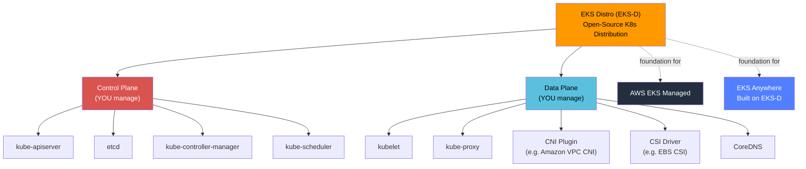

# EKS Distro Fundamentals & Architecture - SAA-C03 Deep Dive

> Amazon EKS Distro (EKS-D) is the **open-source Kubernetes distribution** that powers Amazon EKS — released by AWS so you can run the same tested, patched, and secure Kubernetes stack **anywhere**, fully self-managed with no AWS dependency on the control plane.

See also: [01 - EKS Fundamentals & Architecture](01%20-%20EKS%20Fundamentals%20%26%20Architecture.md) · [01 - EKS Anywhere Fundamentals & Architecture](01%20-%20EKS%20Anywhere%20Fundamentals%20%26%20Architecture.md) · [02 - EKS Distro vs EKS vs EKS Anywhere vs Self-Managed](02%20-%20EKS%20Distro%20vs%20EKS%20vs%20EKS%20Anywhere%20vs%20Self-Managed.md) · [03 - EKS Distro Exam Scenarios & Q&A](03%20-%20EKS%20Distro%20Exam%20Scenarios%20%26%20Q%26A.md) · [01 - ECS Fundamentals & Architecture](01%20-%20ECS%20Fundamentals%20%26%20Architecture.md)

---

## Table of Contents

- [Part 1: What Is EKS Distro?](#part-1-what-is-eks-distro)
- [Part 2: Core Components & Versioning](#part-2-core-components--versioning)
- [Part 3: Architecture — Fully Self-Managed](#part-3-architecture--fully-self-managed)
- [Part 4: Where You Can Run EKS-D](#part-4-where-you-can-run-eks-d)
- [Part 5: Security — Patches & Backports](#part-5-security--patches--backports)
- [Part 6: Relationship to EKS and EKS Anywhere](#part-6-relationship-to-eks-and-eks-anywhere)
- [Part 7: Distribution — GitHub & Open-Source Model](#part-7-distribution--github--open-source-model)
- [Part 8: Key Exam Concepts & Traps](#part-8-key-exam-concepts--traps)
- [Summary: EKS Distro at a Glance](#summary-eks-distro-at-a-glance)

---



---

## Part 1: What Is EKS Distro?

### Definition

**Amazon EKS Distro (EKS-D)** is the same open-source Kubernetes distribution that Amazon EKS uses internally — packaged and released by AWS so that **anyone** can run it on any infrastructure.

Think of it this way: AWS builds EKS by assembling and testing a specific combination of Kubernetes + etcd + CoreDNS + CNI + CSI components, applying security patches, and running it in production at massive scale. EKS-D is that exact combination, open-sourced.

### The Core Value Proposition

| Traditional Upstream K8s                 | EKS Distro                                              |
| :--------------------------------------- | :------------------------------------------------------ |
| You assemble your own component versions | AWS pre-assembles and tests the same stack used in EKS  |
| You apply your own security patches      | AWS backports security patches for extended periods     |
| No guarantee of EKS compatibility        | Guaranteed parity with what EKS runs                    |
| Community support only                   | AWS-tested; optional paid support via AWS Support plans |

### What "Open Source" Means Here

- Source code and container images are published on **GitHub** at `github.com/aws/eks-distro`
- Built artifacts (container images, binaries) are hosted on **ECR Public Gallery** (`public.ecr.aws/eks-distro/`)
- Uses the **Apache 2.0** license
- No license fee — you only pay for the infrastructure you run it on

[⬆ Back to top](#table-of-contents)

---

## Part 2: Core Components & Versioning

### Component List

EKS-D bundles the following components at the same versions used in the corresponding EKS release:

| Component                   | Role                                          | Notes                   |
| :-------------------------- | :-------------------------------------------- | :---------------------- |
| **kube-apiserver**          | Control plane API endpoint                    | Same binary as EKS      |
| **kube-controller-manager** | Control loops                                 | Same binary as EKS      |
| **kube-scheduler**          | Pod scheduling                                | Same binary as EKS      |
| **etcd**                    | Distributed key-value store for cluster state | AWS-patched version     |
| **CoreDNS**                 | Cluster DNS                                   | Same version as EKS     |
| **kube-proxy**              | Per-node network rules                        | Same binary as EKS      |
| **kubelet**                 | Node agent                                    | Same binary as EKS      |
| **Amazon VPC CNI**          | Pod networking on AWS                         | Optional; any CNI works |
| **Amazon EBS CSI Driver**   | Persistent volume management                  | Optional; any CSI works |
| **AWS IAM Authenticator**   | IAM-based kubectl auth                        | Optional                |

### Version Alignment

- Each EKS-D release corresponds to a specific Kubernetes minor version (e.g., `kubernetes-1-29-eks-1`)
- When EKS upgrades to a new K8s minor version, a corresponding EKS-D release follows
- AWS maintains N-3 minor version support, matching EKS's support window

```bash
# Example: pull the kube-apiserver image from EKS-D
docker pull public.ecr.aws/eks-distro/kubernetes/kube-apiserver:v1.29.1-eks-1-29-1

# Check available EKS-D release manifests on GitHub
# https://github.com/aws/eks-distro/releases
```

### Release Manifest

Each EKS-D release ships a **release manifest** (YAML) that pins exact image digests and checksums for every component:

```yaml
# Example excerpt from an EKS-D release manifest
kind: Release
metadata:
  name: kubernetes-1-29-eks-1
spec:
  channel: 1-29
  number: 1
  components:
    - name: etcd
      gitTag: v3.5.9
      images:
        - uri: public.ecr.aws/eks-distro/etcd-io/etcd:v3.5.9-eks-1-29-1
```

[⬆ Back to top](#table-of-contents)

---

## Part 3: Architecture — Fully Self-Managed

### The Fundamental Difference

**EKS-D is a distribution, not a service.** AWS ships it to you; you are responsible for running every layer.

```
┌─────────────────────────────────────────────────────────┐
│                   YOUR RESPONSIBILITY                   │
│                                                         │
│  ┌───────────────────────────────────────────────────┐  │
│  │               Control Plane                       │  │
│  │  kube-apiserver │ etcd │ controller-manager │     │  │
│  │  kube-scheduler │ cloud-controller-manager        │  │
│  └───────────────────────────────────────────────────┘  │
│                                                         │
│  ┌───────────────────────────────────────────────────┐  │
│  │               Data Plane                          │  │
│  │  kubelet │ kube-proxy │ CoreDNS │ CNI │ CSI       │  │
│  └───────────────────────────────────────────────────┘  │
│                                                         │
│  ┌───────────────────────────────────────────────────┐  │
│  │               Infrastructure                      │  │
│  │  VMs / Bare Metal / Other Cloud / On-Prem         │  │
│  └───────────────────────────────────────────────────┘  │
└─────────────────────────────────────────────────────────┘
         AWS only provides the software distribution
```

### What AWS Does NOT Manage in EKS-D

- Control plane availability and scaling
- etcd backups and restore
- Kubernetes version upgrades
- Security group and network configuration
- Node provisioning and lifecycle
- Certificate rotation

### What AWS DOES Provide

- The tested, security-patched binaries and container images
- Release notes and changelogs
- Extended patch support beyond upstream K8s EOL
- (Optional) AWS Support plan coverage if you purchase it

[⬆ Back to top](#table-of-contents)

---

## Part 4: Where You Can Run EKS-D

EKS-D has no infrastructure requirements from AWS. You can run it on:

| Environment                    | Notes                                                      |
| :----------------------------- | :--------------------------------------------------------- |
| **On-premises bare metal**     | Full hardware control; common in air-gapped environments   |
| **On-premises VMs**            | VMware vSphere, KVM, Hyper-V                               |
| **Other public clouds**        | GCP, Azure, any cloud with VMs                             |
| **Edge / IoT devices**         | Lightweight EKS-D deployments at the edge                  |
| **AWS EC2**                    | Self-managed K8s on EC2 (vs using EKS managed service)     |
| **AWS Outposts**               | Local AWS hardware; can run EKS-D for full self-management |
| **Laptops / dev environments** | Local dev clusters using the EKS-D distribution            |

### Common Installation Tools

EKS-D is not installed with a single `aws` CLI command — it uses generic Kubernetes tooling:

```bash
# Option 1: kOps with EKS-D AMIs
kops create cluster --kubernetes-version=1.29 --cloud=aws

# Option 2: kubeadm with EKS-D images specified in kubeadm config
kubeadm init --config kubeadm-config.yaml
# kubeadm-config.yaml references EKS-D image URIs from ECR Public

# Option 3: EKS Anywhere (managed installer built on EKS-D)
# Use this if you want a supported, automated installation experience
eksctl anywhere create cluster -f cluster.yaml
```

> **Exam Tip:** EKS-D itself has no installer — that is precisely why **EKS Anywhere** exists. EKS Anywhere is an opinionated, supported product that _uses_ EKS-D as its distribution.

[⬆ Back to top](#table-of-contents)

---

## Part 5: Security — Patches & Backports

### The Patch Backport Model

One of EKS-D's primary value propositions is **extended security patch support**:

| Scenario                           | Upstream K8s        | EKS / EKS-D                                     |
| :--------------------------------- | :------------------ | :---------------------------------------------- |
| CVE patched in new minor version   | You must upgrade    | AWS backports patch to older minor versions     |
| Minor version reaches upstream EOL | No more patches     | AWS continues patches for additional months     |
| Binary tampering / supply chain    | You verify yourself | AWS signs images; checksums in release manifest |

### Image Signing & Supply Chain Security

- EKS-D container images are signed and pushed to ECR Public
- Each release manifest includes **SHA-256 digests** for every image
- Supports **Sigstore/cosign** verification for supply chain integrity

```bash
# Verify an EKS-D image signature using cosign
cosign verify \
  --certificate-identity-regexp="https://github.com/aws/eks-distro" \
  --certificate-oidc-issuer="https://token.actions.githubusercontent.com" \
  public.ecr.aws/eks-distro/kubernetes/kube-apiserver:v1.29.1-eks-1-29-1
```

### Support Window

```
K8s 1.29 upstream EOL ──────────────────────────────────────┐
                                                             │
EKS-D 1.29 extended support ─────────────────────────────────────────┐
                                                                      │
│<── upstream patches ──>│<────── AWS backport patches ─────────────>│
```

[⬆ Back to top](#table-of-contents)

---

## Part 6: Relationship to EKS and EKS Anywhere

### The Three-Layer Stack

```
┌─────────────────────────────────────┐
│          Amazon EKS                 │  ← Fully managed AWS service
│  (AWS manages control plane         │    YOU choose: managed nodegroups,
│   + lifecycle automation)           │    Fargate, or self-managed nodes
│  BUILT ON: EKS-D internally         │
└─────────────────────────────────────┘

┌─────────────────────────────────────┐
│          EKS Anywhere               │  ← AWS-supported product
│  (CLI tooling + lifecycle mgmt      │    for on-prem / edge / multi-cloud
│   + curated add-ons + support)      │    with optional connected mode
│  BUILT ON: EKS-D as the distro     │
└─────────────────────────────────────┘

┌─────────────────────────────────────┐
│          EKS Distro (EKS-D)         │  ← Open-source distribution
│  (just the K8s components,          │    YOU bring your own tooling,
│   patches, and images)              │    installer, and operations
│  FOUNDATION for both above          │
└─────────────────────────────────────┘
```

### Key Distinctions

| Aspect             | EKS                   | EKS Anywhere                     | EKS-D                         |
| :----------------- | :-------------------- | :------------------------------- | :---------------------------- |
| What AWS provides  | Fully managed service | Product + tooling + lifecycle    | Distribution only             |
| Control plane mgmt | AWS                   | You (with EKS-A tooling)         | You (no tooling)              |
| Installer provided | AWS Console/eksctl    | eksctl anywhere CLI              | None                          |
| Supported infra    | AWS only              | On-prem, edge, AWS               | Any                           |
| Use case           | Standard cloud K8s    | On-prem with EKS-like experience | DIY K8s with EKS-tested stack |

[⬆ Back to top](#table-of-contents)

---

## Part 7: Distribution — GitHub & Open-Source Model

### GitHub Repository Structure

The EKS-D project lives at `github.com/aws/eks-distro` and contains:

```
eks-distro/
├── projects/                # Per-component build configs
│   ├── kubernetes/          # K8s core binaries
│   ├── etcd-io/etcd/        # etcd
│   ├── coredns/coredns/     # CoreDNS
│   └── ...
├── release/                 # Release manifests (pinned versions)
│   └── 1-29/               # Per-minor-version channel
│       └── releases/
│           └── 1/           # Release number
│               └── RELEASE  # Manifest file
└── docs/                    # Documentation
```

### ECR Public Gallery

All EKS-D container images are hosted on Amazon ECR Public (no AWS account required to pull):

```bash
# Pull without any AWS authentication
docker pull public.ecr.aws/eks-distro/kubernetes/kube-apiserver:v1.29.1-eks-1-29-1
docker pull public.ecr.aws/eks-distro/etcd-io/etcd:v3.5.9-eks-1-29-1
docker pull public.ecr.aws/eks-distro/coredns/coredns:v1.10.1-eks-1-29-1
```

### Governance & Community

- AWS owns and maintains the EKS-D project
- Issues and PRs are accepted via GitHub
- Roadmap decisions are driven by EKS's Kubernetes version upgrade timeline
- Third-party vendors (e.g., Canonical, SUSE/Rancher) have built products on top of EKS-D

[⬆ Back to top](#table-of-contents)

---

## Part 8: Key Exam Concepts & Traps

### Concept Clarity Table

| Statement                                | True or False? | Explanation                                                   |
| :--------------------------------------- | :------------- | :------------------------------------------------------------ |
| "EKS-D is a managed service like EKS"    | **False**      | EKS-D is a distribution; you manage everything                |
| "EKS Anywhere is just EKS-D"             | **False**      | EKS Anywhere is a product _built on_ EKS-D with added tooling |
| "EKS-D can run on Azure or GCP"          | **True**       | No AWS dependency; runs on any infrastructure                 |
| "EKS-D requires an AWS account"          | **False**      | Images on ECR Public are public; no account needed            |
| "EKS-D has the same K8s versions as EKS" | **True**       | Exact same versions, patches, and security backports          |
| "EKS-D provides its own installer"       | **False**      | Use kubeadm, kOps, or EKS Anywhere for installation           |
| "EKS-D is free"                          | **True**       | No license cost; you pay only your infrastructure             |

### Common Exam Traps

> **Trap 1:** Questions asking about "running EKS on-premises" most likely refer to **EKS Anywhere**, not EKS-D — unless the question specifically emphasizes "no managed tooling," "full control," or "DIY."

> **Trap 2:** EKS-D is NOT a way to extend the EKS managed service to on-premises. EKS Anywhere is that product. EKS-D is a raw distribution.

> **Trap 3:** Just because EKS-D uses the same components as EKS does NOT mean AWS monitors or patches your EKS-D deployment. You are fully responsible for applying updates.

[⬆ Back to top](#table-of-contents)

---

## Summary: EKS Distro at a Glance

| Attribute                            | Value                                                |
| :----------------------------------- | :--------------------------------------------------- |
| **Full name**                        | Amazon EKS Distro                                    |
| **Abbreviation**                     | EKS-D                                                |
| **Type**                             | Open-source Kubernetes distribution                  |
| **GitHub**                           | github.com/aws/eks-distro                            |
| **License**                          | Apache 2.0                                           |
| **Control plane managed by**         | YOU (fully self-managed)                             |
| **Data plane managed by**            | YOU (fully self-managed)                             |
| **Cost**                             | Free (pay only infra)                                |
| **Infra requirements**               | None — any OS, any cloud, bare metal                 |
| **Core value**                       | EKS-tested + security-patched K8s stack, self-hosted |
| **Differentiated from EKS**          | No AWS-managed control plane                         |
| **Differentiated from EKS Anywhere** | No installer or lifecycle tooling provided           |
| **Security patches**                 | AWS backports beyond upstream EOL                    |
| **Image registry**                   | ECR Public (public.ecr.aws/eks-distro/)              |

[⬆ Back to top](#table-of-contents)
