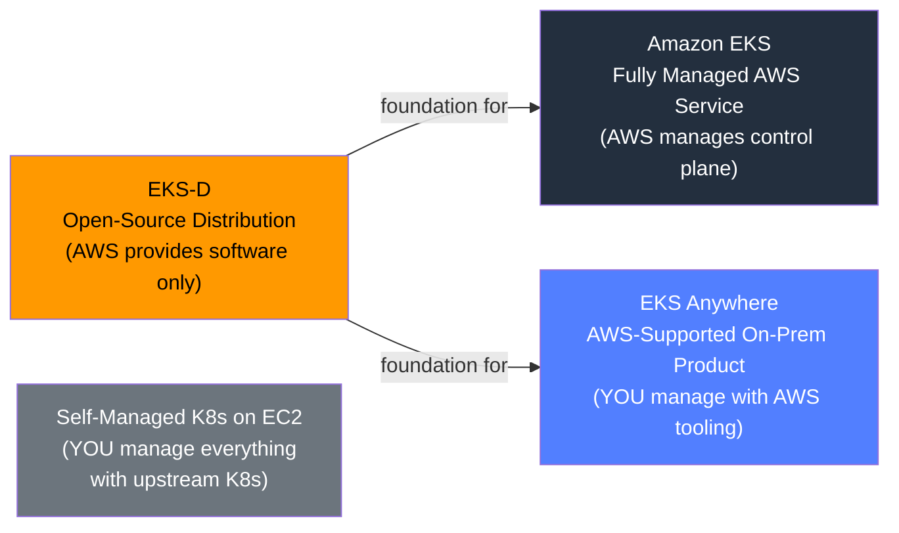
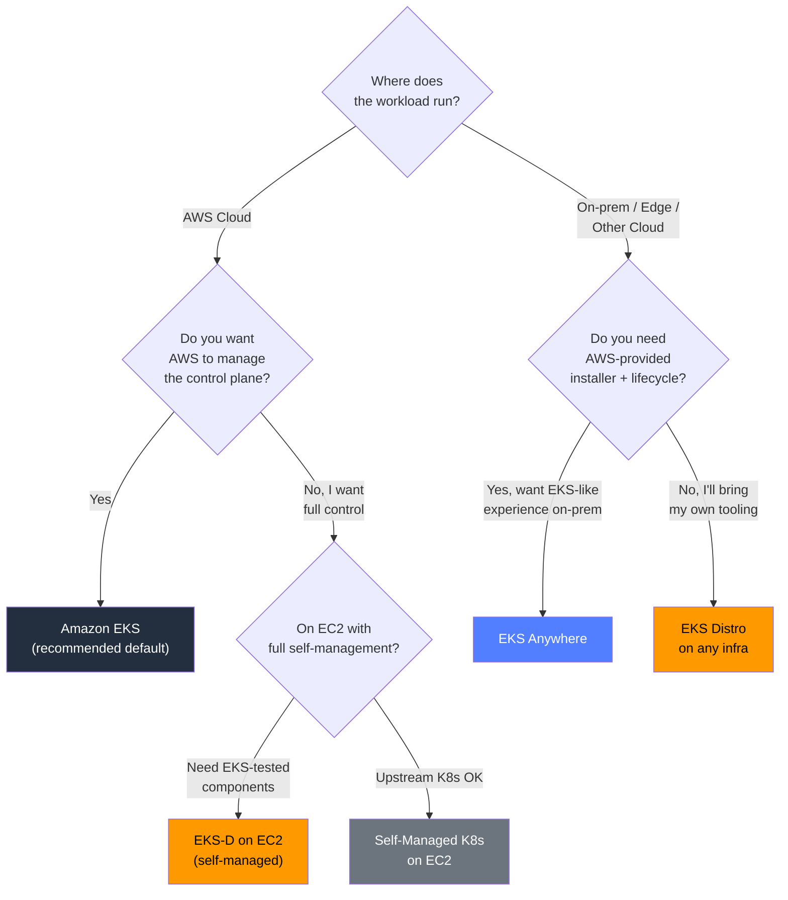

# EKS Distro vs EKS vs EKS Anywhere vs Self-Managed - SAA-C03 Deep Dive

> A detailed comparison of every Kubernetes deployment model in the AWS ecosystem — who manages what, when to choose each, and how EKS-D fits as the open-source foundation that powers EKS and EKS Anywhere but can be used completely independently.

See also: [01 - EKS Distro Fundamentals & Architecture](01%20-%20EKS%20Distro%20Fundamentals%20%26%20Architecture.md) · [03 - EKS Distro Exam Scenarios & Q&A](03%20-%20EKS%20Distro%20Exam%20Scenarios%20%26%20Q%26A.md) · [01 - EKS Fundamentals & Architecture](01%20-%20EKS%20Fundamentals%20%26%20Architecture.md) · [01 - EKS Anywhere Fundamentals & Architecture](01%20-%20EKS%20Anywhere%20Fundamentals%20%26%20Architecture.md) · [01 - ECS Fundamentals & Architecture](01%20-%20ECS%20Fundamentals%20%26%20Architecture.md) · [01 - ECS Anywhere Fundamentals & Architecture](01%20-%20ECS%20Anywhere%20Fundamentals%20%26%20Architecture.md)

---

## Table of Contents

- [Part 1: The Four Kubernetes Models at a Glance](#part-1-the-four-kubernetes-models-at-a-glance)
- [Part 2: Responsibility Matrix — Who Manages What](#part-2-responsibility-matrix--who-manages-what)
- [Part 3: Deep Dive — Amazon EKS](#part-3-deep-dive--amazon-eks)
- [Part 4: Deep Dive — EKS Anywhere](#part-4-deep-dive--eks-anywhere)
- [Part 5: Deep Dive — EKS Distro](#part-5-deep-dive--eks-distro)
- [Part 6: Deep Dive — Self-Managed Kubernetes on EC2](#part-6-deep-dive--self-managed-kubernetes-on-ec2)
- [Part 7: GitHub & Open-Source Distribution Model](#part-7-github--open-source-distribution-model)
- [Part 8: Security Patch Backports — Comparison](#part-8-security-patch-backports--comparison)
- [Part 9: Support Model & Cost Comparison](#part-9-support-model--cost-comparison)
- [Part 10: When to Choose Each — Decision Framework](#part-10-when-to-choose-each--decision-framework)
- [Part 11: Full Container Orchestration Decision Table](#part-11-full-container-orchestration-decision-table)
- [Summary: Cheat Sheet](#summary-cheat-sheet)

---



---

## Part 1: The Four Kubernetes Models at a Glance

| Option                      | What It Is                                   | Where It Runs                | AWS Manages                  | You Manage                                     |
| :-------------------------- | :------------------------------------------- | :--------------------------- | :--------------------------- | :--------------------------------------------- |
| **Amazon EKS**              | Fully managed K8s service                    | AWS cloud only               | Control plane                | Data plane (nodes)                             |
| **EKS Anywhere**            | AWS-supported on-prem product built on EKS-D | On-prem / edge / multi-cloud | Nothing (software + support) | Control plane + data plane                     |
| **EKS Distro (EKS-D)**      | Open-source K8s distribution                 | Anywhere                     | Nothing                      | Everything                                     |
| **Self-Managed K8s on EC2** | DIY Kubernetes with upstream K8s             | AWS EC2                      | Nothing                      | Everything (with upstream, not EKS-D binaries) |

[⬆ Back to top](#table-of-contents)

---

## Part 2: Responsibility Matrix — Who Manages What

### Detailed Responsibility Breakdown

| Responsibility Area                |       Amazon EKS       |     EKS Anywhere     | EKS Distro | Self-Managed K8s |
| :--------------------------------- | :--------------------: | :------------------: | :--------: | :--------------: |
| **Control plane availability**     |          AWS           |         You          |    You     |       You        |
| **etcd management**                |          AWS           |         You          |    You     |       You        |
| **Control plane upgrades**         |      AWS-assisted      |   eksctl anywhere    |    You     |       You        |
| **Control plane security patches** |          AWS           |         You          |    You     |       You        |
| **Worker node provisioning**       |    You (or Fargate)    |         You          |    You     |       You        |
| **Worker node OS patches**         |          You           |         You          |    You     |       You        |
| **K8s version selection**          |   You (AWS upgrades)   |         You          |    You     |       You        |
| **Networking / CNI**               |  You (or AWS VPC CNI)  |         You          |    You     |       You        |
| **Storage / CSI**                  |          You           |         You          |    You     |       You        |
| **Certificate rotation**           |          AWS           |   eksctl anywhere    |    You     |       You        |
| **Add-on lifecycle**               |   EKS Add-ons (AWS)    |   Curated add-ons    |    You     |       You        |
| **Installer provided**             |  AWS Console / eksctl  | eksctl anywhere CLI  |    None    |  kubeadm / kOps  |
| **Backup & restore**               |   You (Velero etc.)    |         You          |    You     |       You        |
| **Monitoring (baseline)**          | CloudWatch integration | Optionally connected |    You     |       You        |

### Key Insight

> The fundamental spectrum runs from **most managed** (EKS) to **least managed** (Self-Managed K8s). EKS-D and EKS Anywhere sit in the middle but differ critically: EKS Anywhere provides tooling and support; EKS-D provides only the distribution.

[⬆ Back to top](#table-of-contents)

---

## Part 3: Deep Dive — Amazon EKS

### What AWS Manages

- **Control plane nodes** across multiple AZs (highly available by default)
- **etcd cluster** with automated backups
- **Kubernetes API server** endpoint with built-in TLS
- **Security patches** to the control plane components
- **Minor version upgrades** (you initiate, AWS executes on control plane)

### What You Manage

- **Managed node groups** (EC2 Auto Scaling Groups) or **self-managed nodes**
- **Fargate profiles** for serverless pods
- **VPC networking**, subnets, security groups
- **EKS Add-ons** (CoreDNS, kube-proxy, VPC CNI, EBS CSI) — versions and updates
- **IAM roles for service accounts** (IRSA) and OIDC provider

### Unique EKS Capabilities

```
✅ Native AWS integrations (ALB, NLB, EBS, EFS, IAM, CloudWatch)
✅ EKS Fargate — serverless pods, zero node management
✅ EKS Add-ons — AWS-managed lifecycle for core components
✅ EKS Auto Mode — fully automated node provisioning and lifecycle (2024+)
✅ EKS Managed Node Groups — AWS manages node lifecycle
✅ AWS-native support via AWS Support plans
```

### EKS Pricing

| Component     | Cost                                |
| :------------ | :---------------------------------- |
| Control plane | $0.10/hour per cluster (~$72/month) |
| Worker nodes  | Standard EC2 pricing                |
| Fargate pods  | Per vCPU/GB-hour                    |
| EKS Add-ons   | Free (pay for underlying resources) |

[⬆ Back to top](#table-of-contents)

---

## Part 4: Deep Dive — EKS Anywhere

### What EKS Anywhere Is

EKS Anywhere is a **product** (not just a distribution) that enables you to create and manage Kubernetes clusters on your own infrastructure using the same EKS-tested stack (EKS-D) plus:

- `eksctl anywhere` CLI for cluster lifecycle management
- **Curated add-ons** with tested versions and automated updates
- **Connected mode**: optionally connect to AWS for EKS console visibility
- **Full support** via AWS Support plans (for EKS Anywhere subscriptions)
- **GitOps integration** via Flux CD

### Infrastructure Providers Supported

| Provider                | Notes                          |
| :---------------------- | :----------------------------- |
| **VMware vSphere**      | Most common on-prem deployment |
| **Bare metal**          | Tinkerbell for provisioning    |
| **Snow (AWS Snowball)** | Edge computing                 |
| **Nutanix**             | AHV hypervisor                 |
| **Apache CloudStack**   | Community target               |
| **Docker**              | Local development only         |

### EKS Anywhere vs EKS-D

> **Critical distinction:** EKS Anywhere is a supported product that **installs and manages** a K8s cluster using EKS-D as the underlying distribution. EKS-D alone gives you binaries; EKS Anywhere gives you binaries + installer + lifecycle + support.

```bash
# EKS Anywhere creates a cluster for you (uses EKS-D under the hood)
eksctl anywhere create cluster -f cluster.yaml

# EKS-D alone: you must use kubeadm or kOps yourself
kubeadm init --config kubeadm-config.yaml
# And point kubeadm to EKS-D images manually
```

[⬆ Back to top](#table-of-contents)

---

## Part 5: Deep Dive — EKS Distro

### What EKS-D Provides

```
EKS-D GitHub Repository (github.com/aws/eks-distro)
├── Pre-tested component versions (K8s + etcd + CoreDNS + CNI + CSI)
├── Security-patched container images on ECR Public
├── Release manifests with SHA-256 digests
├── Extended patch support beyond upstream K8s EOL
└── Apache 2.0 license (free to use)

EKS-D Does NOT Provide
├── Installer or CLI
├── Cluster lifecycle management
├── Automated upgrades
├── Networking or storage configuration
└── Any form of managed infrastructure
```

### EKS-D Distribution Channel

```bash
# All images publicly available - no AWS account needed
docker pull public.ecr.aws/eks-distro/kubernetes/kube-apiserver:v1.29.1-eks-1-29-1
docker pull public.ecr.aws/eks-distro/etcd-io/etcd:v3.5.9-eks-1-29-1
docker pull public.ecr.aws/eks-distro/coredns/coredns:v1.10.1-eks-1-29-1
docker pull public.ecr.aws/eks-distro/kubernetes/kube-scheduler:v1.29.1-eks-1-29-1
```

### Who Uses EKS-D Directly

- Platform engineering teams building **internal Kubernetes platforms**
- Vendors like **Canonical (Ubuntu)**, **SUSE (Rancher)**, **Bottlerocket** building products on EKS-D
- Organizations that need **EKS-tested K8s** but want **complete control** over every layer
- Air-gapped environments where EKS Anywhere's scope is too much

[⬆ Back to top](#table-of-contents)

---

## Part 6: Deep Dive — Self-Managed Kubernetes on EC2

### What It Is

Running vanilla upstream Kubernetes (from kubernetes.io) on AWS EC2 instances — completely outside the EKS ecosystem.

### Key Differences from EKS-D on EC2

| Aspect                    | EKS-D on EC2            | Upstream K8s on EC2     |
| :------------------------ | :---------------------- | :---------------------- |
| Component versions        | AWS-tested combination  | You choose all versions |
| Security patches          | AWS backports available | Community only          |
| AWS service compatibility | Tested with EKS Add-ons | May require extra work  |
| EKS Anywhere compatible   | Yes (it's EKS-D)        | No                      |
| AWS Support coverage      | Possible with EKS-D     | No                      |

### When This Makes Sense

Self-managed upstream K8s on EC2 is rarely recommended on SAA-C03 exam scenarios — the exam will typically steer toward EKS for AWS workloads. This option exists for organizations with strong existing K8s expertise who want absolute independence from AWS's K8s versioning cadence.

[⬆ Back to top](#table-of-contents)

---

## Part 7: GitHub & Open-Source Distribution Model

### EKS-D vs EKS Anywhere on GitHub

| Aspect           | EKS-D                                      | EKS Anywhere                            |
| :--------------- | :----------------------------------------- | :-------------------------------------- |
| GitHub repo      | `aws/eks-distro`                           | `aws/eks-anywhere`                      |
| What it contains | Component builds + release manifests       | CLI, controllers, provider integrations |
| License          | Apache 2.0                                 | Apache 2.0                              |
| Contributions    | Accepted                                   | Accepted                                |
| Primary audience | Distribution consumers / platform builders | End-user cluster operators              |

### Release Cadence

```
EKS releases K8s 1.30 support
          │
          ▼
EKS-D publishes kubernetes-1-30-eks-1 release manifest + images
          │
          ▼
EKS Anywhere updates to use EKS-D 1.30
          │
          ▼
AWS applies security backports to EKS-D 1.28/1.29/1.30 (N-3 window)
```

[⬆ Back to top](#table-of-contents)

---

## Part 8: Security Patch Backports — Comparison

### How Each Model Handles CVEs

| CVE Scenario                       | Amazon EKS                      | EKS Anywhere                           | EKS Distro                             | Self-Managed K8s                            |
| :--------------------------------- | :------------------------------ | :------------------------------------- | :------------------------------------- | :------------------------------------------ |
| CVE fixed in new K8s patch release | AWS auto-patches control plane  | You apply with eksctl anywhere upgrade | You pull new EKS-D images + reinstall  | You apply upstream patch yourself           |
| CVE in older minor version at EOL  | AWS extends support internally  | EKS-D backport available               | EKS-D backport published on ECR Public | Community drops support; you're on your own |
| Supply chain / image tampering     | AWS signs control plane images  | EKS-D image signatures via cosign      | EKS-D image signatures via cosign      | You manage image signing yourself           |
| Control plane CVE notification     | AWS publishes security bulletin | Same EKS-D bulletin                    | Same EKS-D bulletin                    | K8s community security list                 |

### Extended Support Window

```
Kubernetes 1.28 lifecycle:
Upstream K8s EOL ──────────────────────────────┐ (Oct 2024)
                                               │
EKS / EKS-D extended support ──────────────────────────────────┐ (+14 months)
                                                               │
│<── AWS patches control plane + EKS-D images continuously ──>│
```

> **Exam Tip:** AWS charges a premium for EKS extended support (when a cluster runs a K8s version past the standard support window). EKS-D's backport images are **free** — but you must apply them yourself.

[⬆ Back to top](#table-of-contents)

---

## Part 9: Support Model & Cost Comparison

### Support Tiers

| Option               | Default Support       | Paid Support Available        | AWS Support Coverage                               |
| :------------------- | :-------------------- | :---------------------------- | :------------------------------------------------- |
| **Amazon EKS**       | AWS-managed SLA       | AWS Business/Enterprise plans | Yes — full EKS support                             |
| **EKS Anywhere**     | Community (free tier) | EKS Anywhere subscription     | Yes — with subscription                            |
| **EKS Distro**       | Community only        | None specific to EKS-D        | Via existing AWS Support plan for EKS-D components |
| **Self-Managed K8s** | Community only        | Third-party vendors           | No AWS support                                     |

### Cost Breakdown

| Option               | Control Plane Cost | Node Cost             | License  | Tooling                |
| :------------------- | :----------------- | :-------------------- | :------- | :--------------------- |
| **Amazon EKS**       | $0.10/hr (~$72/mo) | EC2 / Fargate pricing | Included | eksctl, Console        |
| **EKS Anywhere**     | Your infra cost    | Your infra cost       | Free     | eksctl anywhere (free) |
| **EKS Distro**       | Your infra cost    | Your infra cost       | Free     | You provide            |
| **Self-Managed K8s** | Your infra cost    | Your infra cost       | Free     | kubeadm / kOps         |

> **Key Exam Point:** EKS-D is **completely free** from a licensing perspective. The only costs are the infrastructure you choose to run it on. This makes it attractive for organizations that need EKS-quality K8s but cannot justify EKS control plane fees (e.g., for many small dev clusters, or for multi-cloud deployments).

[⬆ Back to top](#table-of-contents)

---

## Part 10: When to Choose Each — Decision Framework



### Choosing EKS-D Specifically

Choose **EKS Distro** when:

| Requirement                                                    | Why EKS-D Fits                                              |
| :------------------------------------------------------------- | :---------------------------------------------------------- |
| Need EKS-tested K8s on non-AWS infra                           | EKS-D provides exact same components                        |
| Cannot use EKS (no AWS cloud dependency allowed)               | EKS-D has zero AWS infra dependency                         |
| Want to build an internal K8s platform product                 | EKS-D is the distribution layer to build on                 |
| Need EKS Anywhere but want to bring your own lifecycle tooling | EKS-D is the distribution EKS Anywhere builds on            |
| Air-gapped / strict security environment                       | Pull images to private registry; no AWS connectivity needed |
| Cost optimization: many small clusters, no per-cluster fee     | No $0.10/hr control plane fee                               |
| Multi-cloud consistency                                        | Same K8s stack on AWS, GCP, Azure, bare metal               |

[⬆ Back to top](#table-of-contents)

---

## Part 11: Full Container Orchestration Decision Table

This table covers all AWS container orchestration options for comprehensive exam readiness:

| Service              | Containers   | Orchestrator | Where Runs       | Mgmt Model                        | Key Differentiator               |
| :------------------- | :----------- | :----------- | :--------------- | :-------------------------------- | :------------------------------- |
| **Amazon ECS**       | Docker       | ECS agent    | AWS              | AWS manages control plane         | Simpler; tight AWS integration   |
| **ECS Anywhere**     | Docker       | ECS agent    | On-prem / EC2    | AWS control plane + your nodes    | ECS experience on any server     |
| **Amazon EKS**       | Docker / OCI | Kubernetes   | AWS              | AWS manages K8s control plane     | Standard K8s on AWS              |
| **EKS Fargate**      | Docker / OCI | Kubernetes   | AWS (serverless) | AWS manages nodes + control plane | Zero node management             |
| **EKS Anywhere**     | Docker / OCI | Kubernetes   | On-prem / edge   | AWS tooling + you run everything  | On-prem EKS experience           |
| **EKS Distro**       | Docker / OCI | Kubernetes   | Anywhere         | You run everything                | DIY EKS-quality K8s distribution |
| **Self-Managed K8s** | Docker / OCI | Kubernetes   | AWS EC2          | You run everything                | Full control, upstream K8s       |
| **AWS Fargate**      | Docker / OCI | ECS or EKS   | AWS              | Serverless                        | No server/node management at all |

[⬆ Back to top](#table-of-contents)

---

## Summary: Cheat Sheet

### One-Line Definitions

| Option               | One-Line Summary                                                             |
| :------------------- | :--------------------------------------------------------------------------- |
| **EKS**              | AWS-managed K8s control plane in the cloud; you manage nodes                 |
| **EKS Anywhere**     | AWS-supported product to run EKS-D on your own infra with lifecycle tooling  |
| **EKS Distro**       | The raw open-source K8s distribution AWS uses for EKS; you manage everything |
| **Self-Managed K8s** | DIY Kubernetes on EC2 using upstream community K8s                           |

### The Decision Hierarchy

```
Need K8s on AWS cloud?               → Amazon EKS (default answer)
Need K8s on-prem with AWS tooling?   → EKS Anywhere
Need K8s anywhere, DIY, EKS-tested?  → EKS Distro
Need K8s on AWS, full control/DIY?   → Self-Managed K8s on EC2 (or EKS-D on EC2)
```

### Critical Facts for the Exam

| Fact                                    | Value                                        |
| :-------------------------------------- | :------------------------------------------- |
| EKS-D is free                           | True — Apache 2.0, no license fee            |
| EKS-D control plane managed by AWS      | False — you manage everything                |
| EKS Anywhere is built on EKS-D          | True                                         |
| EKS internally uses EKS-D               | True                                         |
| EKS-D requires an AWS account           | False — ECR Public images are anonymous-pull |
| EKS-D provides security patch backports | True — beyond upstream K8s EOL               |
| EKS-D has a CLI installer               | False — use kubeadm / kOps / EKS Anywhere    |

[⬆ Back to top](#table-of-contents)
