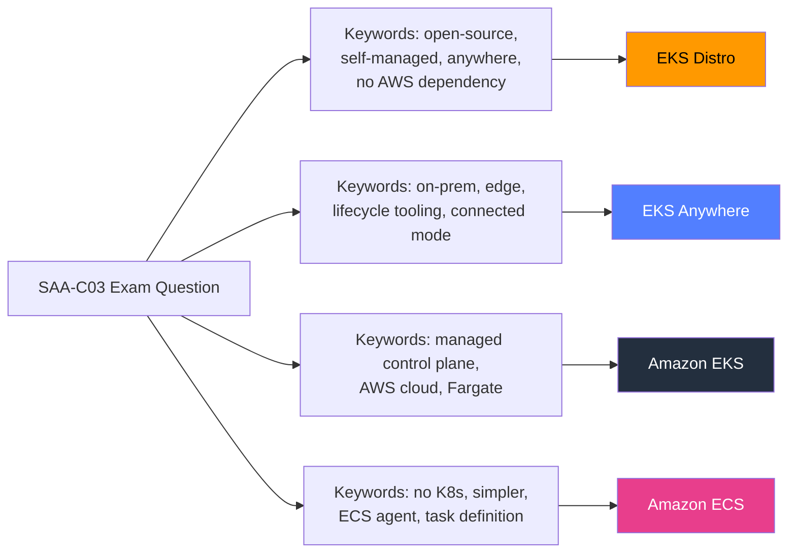

# EKS Distro Exam Scenarios & Q&A - SAA-C03 Deep Dive

> Practice exam questions, traps, and decision tables for Amazon EKS Distro — covering the distinctions between EKS-D, EKS, EKS Anywhere, ECS, and self-managed Kubernetes that the SAA-C03 exam tests.

See also: [01 - EKS Distro Fundamentals & Architecture](01%20-%20EKS%20Distro%20Fundamentals%20%26%20Architecture.md) · [02 - EKS Distro vs EKS vs EKS Anywhere vs Self-Managed](02%20-%20EKS%20Distro%20vs%20EKS%20vs%20EKS%20Anywhere%20vs%20Self-Managed.md) · [01 - EKS Fundamentals & Architecture](01%20-%20EKS%20Fundamentals%20%26%20Architecture.md) · [01 - EKS Anywhere Fundamentals & Architecture](01%20-%20EKS%20Anywhere%20Fundamentals%20%26%20Architecture.md) · [01 - ECS Fundamentals & Architecture](01%20-%20ECS%20Fundamentals%20%26%20Architecture.md) · [01 - ECS Anywhere Fundamentals & Architecture](01%20-%20ECS%20Anywhere%20Fundamentals%20%26%20Architecture.md)

---

## Table of Contents

- [Part 1: Exam-Style MCQs](#part-1-exam-style-mcqs)
- [Part 2: Master Comparison Decision Table](#part-2-master-comparison-decision-table)
- [Part 3: Scenario Pattern Recognition](#part-3-scenario-pattern-recognition)
- [Part 4: EKS-D Specific Traps & Tips](#part-4-eks-d-specific-traps--tips)
- [Part 5: Cheat Sheet](#part-5-cheat-sheet)

---



---

## Part 1: Exam-Style MCQs

---

### Question 1

A financial services company runs Kubernetes workloads on-premises in a fully air-gapped data centre. They require the same Kubernetes version, component versions, and security patch backports that Amazon EKS uses internally. They have a strong platform engineering team and want **no external lifecycle tooling dependency**. Which option should they choose?

**A.** Amazon EKS with VPC connectivity via Direct Connect
**B.** EKS Anywhere with VMware vSphere provider
**C.** EKS Distro deployed with kubeadm using images from ECR Public mirrored internally
**D.** Self-managed Kubernetes using upstream community binaries

**Answer: C**

**Explanation:**

- A is wrong — EKS is an AWS-cloud-only managed service; it cannot run in the customer's data centre.
- B is close but wrong — EKS Anywhere adds an external lifecycle tooling dependency (`eksctl anywhere`), which the question rules out.
- C is correct — EKS-D provides the EKS-identical, security-patched components; images can be mirrored from ECR Public into a private air-gapped registry; the team provides their own lifecycle tooling (kubeadm).
- D is wrong — upstream K8s binaries are not the same as EKS-tested/patched binaries; this does not meet the "same as EKS" requirement.

> **Exam Tip:** "Air-gapped + no external tooling dependency + EKS-tested stack" = **EKS Distro**. If the question also said "automated lifecycle + support," it would be EKS Anywhere.

---

### Question 2

A startup wants to run Kubernetes on AWS and is deciding between Amazon EKS and running EKS Distro on EC2 themselves. Their primary concern is **minimizing operational overhead** on the Kubernetes control plane. Which service should they choose?

**A.** EKS Distro on EC2 with kubeadm, because it uses the same binaries as EKS
**B.** Amazon EKS, because AWS manages the control plane and reduces operational burden
**C.** Self-managed Kubernetes on EC2, because it gives the most flexibility
**D.** EKS Anywhere on AWS, because it is supported by AWS

**Answer: B**

**Explanation:**

- A is wrong — running EKS-D on EC2 gives you EKS-identical binaries but YOU manage the control plane entirely, which maximizes operational overhead.
- B is correct — EKS offloads the control plane (etcd, API server, controller-manager, scheduler, certificates, HA) entirely to AWS.
- C is wrong — self-managed K8s has the same overhead problem as EKS-D on EC2, with worse patching support.
- D is wrong — EKS Anywhere is designed for on-premises/edge, not for AWS cloud workloads; using it on AWS would be unusual and adds overhead.

> **Exam Trap:** Just because EKS-D "uses the same binaries as EKS" does NOT mean it reduces your operational overhead. The _managed service_ (EKS) is what reduces overhead.

---

### Question 3

An enterprise has Kubernetes clusters running on VMware vSphere on-premises and wants a **supported product** from AWS that provides automated cluster lifecycle management, curated add-ons, and optional connectivity to the AWS console for visibility. Which option best meets these requirements?

**A.** Amazon EKS with VPN connectivity
**B.** EKS Distro deployed via kOps
**C.** EKS Anywhere with VMware vSphere provider
**D.** Self-managed Kubernetes with AWS CLI integration

**Answer: C**

**Explanation:**

- A is wrong — EKS runs in AWS only; a VPN does not change this.
- B is wrong — EKS-D with kOps gives you the distribution but not automated lifecycle, curated add-ons, or AWS console integration.
- C is correct — EKS Anywhere supports VMware vSphere; provides `eksctl anywhere` lifecycle CLI, curated add-on catalog, and "connected mode" for EKS console visibility.
- D is wrong — self-managed K8s with AWS CLI is a vague, unsupported approach that meets none of the specific requirements.

> **Exam Tip:** "VMware + supported product + lifecycle + curated add-ons + console visibility" = **EKS Anywhere**.

---

### Question 4

A company's legal team has determined that Kubernetes workloads must run **exclusively on hardware the company owns**, with **no per-cluster software licensing fee**, and with access to security patches that extend beyond upstream Kubernetes community end-of-life. Which solution satisfies all three constraints?

**A.** Amazon EKS ($0.10/hr per cluster fee applies)
**B.** EKS Distro (free, runs on company-owned hardware, AWS backport patches available)
**C.** EKS Anywhere (subscription fee for support tier applies)
**D.** OpenShift (Red Hat license fee applies)

**Answer: B**

**Explanation:**

- A is wrong — EKS runs on AWS hardware and has a $0.10/hr control plane fee.
- B is correct — EKS-D is Apache 2.0 (free), runs on any hardware including company-owned, and AWS backports security patches beyond upstream K8s EOL.
- C is wrong — EKS Anywhere has an optional (but real) subscription fee for the supported tier.
- D is wrong — OpenShift has Red Hat licensing costs.

> **Exam Tip:** The three constraints map directly to EKS-D's three core value propositions: runs anywhere + free license + extended security patches.

---

### Question 5

A solutions architect is evaluating container orchestration options. A developer team says: "We want to use Kubernetes because our platform is Kubernetes-native, but we don't want AWS to manage our control plane — we want to manage every Kubernetes component ourselves while still using AWS infrastructure." Which option best fits?

**A.** Amazon EKS with self-managed node groups
**B.** Amazon ECS on EC2
**C.** EKS Distro on AWS EC2 instances
**D.** EKS Anywhere on AWS infrastructure

**Answer: C**

**Explanation:**

- A is wrong — EKS with self-managed node groups still has AWS managing the control plane. The developers explicitly do not want that.
- B is wrong — ECS is not Kubernetes; the question specifies Kubernetes-native.
- C is correct — EKS-D on EC2 gives them Kubernetes (EKS-tested distribution) on AWS infrastructure while they manage every component themselves.
- D is wrong — EKS Anywhere is designed for on-premises/edge environments. While technically possible, it adds unnecessary overhead and was designed for non-AWS infra. More importantly, EKS-D on EC2 is the direct answer.

> **Exam Tip:** "Kubernetes + AWS infra + manage our own control plane" = **EKS Distro on EC2**. This is different from EKS (managed control plane) and from EKS Anywhere (non-AWS target).

---

### Question 6

A DevOps team is building an internal platform product that will distribute a pre-configured Kubernetes cluster solution to hundreds of application teams across their company, running on both AWS and Azure. They need the **exact same Kubernetes version, same component images, and same security patches** on both clouds. What is the BEST distribution to base their platform on?

**A.** Amazon EKS on AWS and Azure Kubernetes Service (AKS) on Azure separately
**B.** Amazon EKS Distro (EKS-D), deployed on both AWS EC2 and Azure VMs
**C.** EKS Anywhere, which supports multiple cloud providers
**D.** Upstream Kubernetes community release on both clouds

**Answer: B**

**Explanation:**

- A is wrong — EKS and AKS use different K8s distributions, different patch cadences, and different component versions. This defeats the "exact same" requirement.
- B is correct — EKS-D is cloud-agnostic; the same container images on ECR Public can be deployed on EC2 and Azure VMs, guaranteeing identical component versions, patches, and security backports.
- C is wrong — EKS Anywhere supports certain infrastructure providers (VMware, bare metal, Nutanix, Snow) but is not a general multi-cloud deployment tool for arbitrary VMs on Azure.
- D is wrong — upstream K8s lacks the AWS-applied security backport patches that are part of EKS-D's value proposition.

> **Exam Tip:** Multi-cloud + identical K8s stack = **EKS Distro**. EKS Anywhere is for specific supported providers, not general multi-cloud VM fleets.

---

### Question 7

An organization is evaluating Kubernetes options and asks: "If we run EKS Distro, does AWS patch our Kubernetes control plane automatically?" What is the correct answer?

**A.** Yes — AWS monitors EKS-D deployments and applies patches automatically
**B.** Yes — but only for EKS-D deployments connected to AWS via Direct Connect
**C.** No — AWS publishes patched container images on ECR Public, but you must pull and apply them yourself
**D.** No — EKS-D uses only upstream community patches, not AWS patches

**Answer: C**

**Explanation:**

- A is wrong — AWS has no visibility into or control over self-managed EKS-D deployments. Nothing is automatic.
- B is wrong — there is no "connected mode" for raw EKS-D (that concept applies to EKS Anywhere). Even then, EKS Anywhere does not auto-patch for you automatically.
- C is correct — AWS's contribution is publishing security-patched images to ECR Public and releasing updated manifest files. YOU must pull the new images and perform the upgrade/rolling restart on your control plane components.
- D is wrong — EKS-D DOES include AWS-backported patches beyond upstream community patches, which is one of its key advantages.

> **Exam Trap:** "EKS-D uses the same patches as EKS" is true, but it does NOT mean AWS applies them to your deployment automatically.

---

### Question 8

A company needs to choose a container solution. Their requirements: (1) Do not want to manage Kubernetes at all. (2) Want to run on AWS cloud. (3) Workloads are simple web applications with no need for Kubernetes-specific features. (4) Want the simplest possible operational model. Which service best fits?

**A.** Amazon EKS with Fargate
**B.** EKS Distro on EC2
**C.** Amazon ECS on AWS Fargate
**D.** EKS Anywhere

**Answer: C**

**Explanation:**

- A is wrong — EKS with Fargate eliminates node management but still requires Kubernetes expertise (pods, deployments, services, RBAC, ingress controllers, etc.).
- B is wrong — EKS-D on EC2 requires managing every Kubernetes component, maximizing operational complexity.
- C is correct — ECS on Fargate eliminates both Kubernetes complexity and node management entirely. For simple web applications with no K8s-specific feature requirements, ECS Fargate is the simplest AWS container solution.
- D is wrong — EKS Anywhere is for on-premises/edge, maximally complex, and requires K8s expertise.

> **Exam Tip:** "No Kubernetes + simple + AWS + serverless" = **ECS on Fargate**. The exam frequently presents EKS (with or without Fargate) as a distractor when the workload doesn't need K8s.

---

### Question 9 (Bonus)

Which statement about EKS Distro is **FALSE**?

**A.** EKS-D is distributed under the Apache 2.0 open-source license
**B.** EKS-D container images are hosted on Amazon ECR Public and can be pulled without an AWS account
**C.** EKS-D provides a CLI tool for cluster creation called `eksctl distro`
**D.** EKS-D security patches include backports beyond the upstream Kubernetes community end-of-life window

**Answer: C**

**Explanation:**

- A is true — Apache 2.0 is the license for EKS-D.
- B is true — ECR Public allows anonymous image pulls.
- C is **FALSE** — EKS-D does NOT provide any CLI tool. There is no `eksctl distro` command. You use kubeadm, kOps, or EKS Anywhere to create clusters. This is a critical differentiator.
- D is true — AWS backports security patches to EKS-D releases beyond upstream EOL.

[⬆ Back to top](#table-of-contents)

---

## Part 2: Master Comparison Decision Table

### Full Container Orchestration Comparison (ECS / ECS Anywhere / EKS / EKS Anywhere / EKS Distro)

| Attribute                        |       ECS        |        ECS Anywhere        |            EKS             |        EKS Anywhere        |         EKS Distro         |
| :------------------------------- | :--------------: | :------------------------: | :------------------------: | :------------------------: | :------------------------: |
| **Orchestrator type**            |    ECS-native    |         ECS-native         |         Kubernetes         |         Kubernetes         |         Kubernetes         |
| **AWS cloud required**           |       Yes        | No (control plane on AWS)  |            Yes             |             No             |             No             |
| **Control plane managed by**     |       AWS        |            AWS             |            AWS             |            You             |            You             |
| **Data plane managed by**        |  You / Fargate   |     You (your servers)     |       You / Fargate        |            You             |            You             |
| **Runs on-premises**             |        No        |            Yes             |             No             |            Yes             |            Yes             |
| **Runs on other clouds**         |        No        |      Yes (any server)      |             No             |       Some providers       |      Yes (any infra)       |
| **AWS-provided installer**       |  Console / CLI   |     ECS agent install      |      Console / eksctl      |      eksctl anywhere       |            None            |
| **Lifecycle tooling**            |   AWS manages    | AWS managed control plane  |        AWS-assisted        |      eksctl anywhere       |        You provide         |
| **Security patches**             |       AWS        | AWS (control) + you (data) | AWS (control) + you (data) | EKS-D backports, you apply | EKS-D backports, you apply |
| **License cost**                 |       Free       |            Free            |            Free            |            Free            |            Free            |
| **Control plane cost**           |     Included     |      Included in ECS       |      $0.10/hr/cluster      |         Your infra         |         Your infra         |
| **K8s expertise required**       |        No        |             No             |            Yes             |            Yes             |            Yes             |
| **AWS console visibility**       |       Yes        | Yes (registered instances) |            Yes             |    Yes (connected mode)    |     No (self-managed)      |
| **GitOps / Flux**                |        No        |             No             |        Via add-ons         |       Yes (built-in)       |       You configure        |
| **Curated add-ons catalog**      | ECS integrations |      ECS integrations      |        EKS Add-ons         |    EKS Anywhere add-ons    |         You choose         |
| **Extended K8s patch support**   |       N/A        |            N/A             |            Yes             |     Yes (EKS-D based)      |            Yes             |
| **Air-gap friendly**             |     Limited      |            Yes             |          Limited           |  Yes (disconnected mode)   |            Yes             |
| **Multi-cloud consistent stack** |        No        |             No             |             No             |             No             |            Yes             |

[⬆ Back to top](#table-of-contents)

---

## Part 3: Scenario Pattern Recognition

### Keyword-to-Service Mapping

| Keywords in Question                                                                                                                               | Likely Answer                           |
| :------------------------------------------------------------------------------------------------------------------------------------------------- | :-------------------------------------- |
| "no Kubernetes expertise", "simple", "task definition", "ECS agent"                                                                                | Amazon ECS                              |
| "on-premises", "ECS", "your own servers", "registered instances"                                                                                   | ECS Anywhere                            |
| "Kubernetes", "AWS cloud", "managed control plane", "Fargate pods"                                                                                 | Amazon EKS                              |
| "Kubernetes", "on-premises", "VMware", "lifecycle tooling", "curated add-ons", "connected mode"                                                    | EKS Anywhere                            |
| "Kubernetes", "open-source distribution", "self-managed", "no installer", "any infra", "air-gapped", "no AWS dependency", "multi-cloud consistent" | EKS Distro                              |
| "no nodes", "serverless containers", "pay per task"                                                                                                | AWS Fargate (with ECS or EKS)           |
| "Kubernetes on EC2", "full control", "manage control plane yourself"                                                                               | EKS-D on EC2 OR Self-Managed K8s on EC2 |

### Differentiating EKS Anywhere from EKS Distro

This is the most common exam confusion point:

| Question Asks About            | EKS Anywhere                   | EKS Distro                       |
| :----------------------------- | :----------------------------- | :------------------------------- |
| On-prem K8s with AWS support   | Yes                            | No                               |
| Just the distribution/binaries | No                             | Yes                              |
| Installer / lifecycle CLI      | Yes (eksctl anywhere)          | No                               |
| Curated add-ons                | Yes                            | No                               |
| AWS console connectivity       | Yes (connected mode)           | No                               |
| Multi-cloud (any infra/cloud)  | Partially (specific providers) | Yes (any infra)                  |
| Air-gapped disconnected mode   | Yes (EKS Anywhere feature)     | Yes (naturally, no dependencies) |
| Foundation / distribution used | Is built on EKS-D              | Is the foundation                |

### The "Runs Anywhere" Trap

> Both EKS Distro and EKS Anywhere can run outside AWS, but they are NOT the same thing. EKS Anywhere is a **product with tooling**; EKS Distro is a **distribution without tooling**. "EKS Anywhere" does not mean "run EKS anywhere you want" — it means "run the EKS-quality stack on supported non-AWS infrastructure using AWS's EKS Anywhere product."

[⬆ Back to top](#table-of-contents)

---

## Part 4: EKS-D Specific Traps & Tips

### Trap 1: "EKS-D = Managed Service"

> **Wrong thinking:** "EKS Distro lets me run EKS outside AWS and AWS will manage it."
>
> **Correct:** EKS-D is a raw distribution. AWS manages nothing. If you want AWS-managed lifecycle on non-AWS infra, use **EKS Anywhere**.

---

### Trap 2: "EKS Anywhere = EKS Distro"

> **Wrong thinking:** "EKS Anywhere and EKS Distro are the same product, just different names."
>
> **Correct:** EKS Anywhere is **built on top of** EKS Distro. EKS Anywhere adds an installer, lifecycle management, curated add-ons, and a support tier. EKS Distro is just the distribution of components.

---

### Trap 3: "EKS-D Requires AWS Account"

> **Wrong thinking:** "You need an AWS account to use EKS Distro because it comes from AWS."
>
> **Correct:** EKS-D images are on **ECR Public** which allows anonymous pulls. You can use EKS-D with zero AWS account or AWS API interaction.

---

### Trap 4: "EKS-D Patches Are Applied Automatically"

> **Wrong thinking:** "AWS patches my EKS-D cluster just like it patches EKS."
>
> **Correct:** AWS publishes new patched images to ECR Public. YOU must pull them and restart/upgrade your control plane components. Nothing is automatic.

---

### Trap 5: "EKS-D Has a Supported Installer"

> **Wrong thinking:** "I can install EKS-D with `eksctl distro create cluster`."
>
> **Correct:** No such command exists. EKS-D has **no installer**. Use kubeadm, kOps, or (if you want AWS's supported installer) **EKS Anywhere**, which uses EKS-D internally.

---

### Trap 6: "EKS-D Only Runs on AWS"

> **Wrong thinking:** "EKS Distro must run on AWS infrastructure because it's an Amazon product."
>
> **Correct:** EKS-D has **zero AWS infrastructure dependency**. It runs on any VM, bare metal, or cloud — GCP, Azure, on-premises, or a laptop.

---

### Tip: The Three Core EKS-D Facts to Memorize

1. **Same as EKS internals** — exact same K8s versions, component versions, and security backport patches that EKS uses
2. **Fully self-managed** — YOU manage control plane + data plane; AWS manages nothing
3. **Runs anywhere** — no AWS infra dependency; ECR Public images pull without an AWS account

[⬆ Back to top](#table-of-contents)

---

## Part 5: Cheat Sheet

### EKS Distro in 30 Seconds

```
Amazon EKS Distro (EKS-D)

WHAT:   Open-source Kubernetes distribution (same stack as EKS)
WHERE:  Any infrastructure — on-prem, bare metal, other clouds, AWS EC2
WHO:    YOU manage everything (control plane + data plane)
COST:   Free (Apache 2.0); pay only for your own infrastructure
IMAGES: public.ecr.aws/eks-distro/ (anonymous pull, no AWS account needed)
REPO:   github.com/aws/eks-distro
PATCH:  AWS backports security patches beyond upstream K8s EOL
INSTALL: None provided — use kubeadm / kOps yourself

NOT:    A managed service (that's EKS)
NOT:    A product with lifecycle tooling (that's EKS Anywhere)
NOT:    The same thing as EKS Anywhere (EKS-A is built ON EKS-D)
```

### Quick-Reference Comparison Table

|                           |          EKS          |    EKS Anywhere    |    EKS Distro     |
| :------------------------ | :-------------------: | :----------------: | :---------------: |
| AWS manages control plane |          YES          |         NO         |        NO         |
| Runs outside AWS          |          NO           |        YES         |        YES        |
| Installer provided        |          YES          |        YES         |        NO         |
| License cost              |         Free          |        Free        |       Free        |
| Control plane cost        |       $0.10/hr        |     Your infra     |    Your infra     |
| Security patch backports  |      Yes (auto)       |  Yes (you apply)   |  Yes (you apply)  |
| Multi-cloud any-infra     |          NO           | Specific providers |        YES        |
| Support available         |      AWS Support      | AWS + subscription |  Community only   |
| Foundation / built on     | Uses EKS-D internally |   Built on EKS-D   | IS the foundation |

### SAA-C03 Exam Decision Rules

| If the question says...                                     | Choose...    |
| :---------------------------------------------------------- | :----------- |
| "managed control plane on AWS"                              | Amazon EKS   |
| "on-premises + lifecycle tooling + curated add-ons"         | EKS Anywhere |
| "open-source distribution + self-managed + no installer"    | EKS Distro   |
| "simple containers + no K8s"                                | Amazon ECS   |
| "serverless containers"                                     | AWS Fargate  |
| "on-premises ECS"                                           | ECS Anywhere |
| "multi-cloud + same K8s stack everywhere"                   | EKS Distro   |
| "air-gapped + EKS-tested binaries + bring your own tooling" | EKS Distro   |
| "on-prem + connected mode + AWS console visibility"         | EKS Anywhere |

[⬆ Back to top](#table-of-contents)
