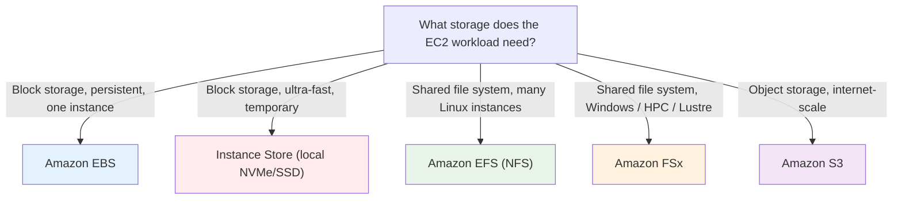
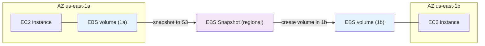
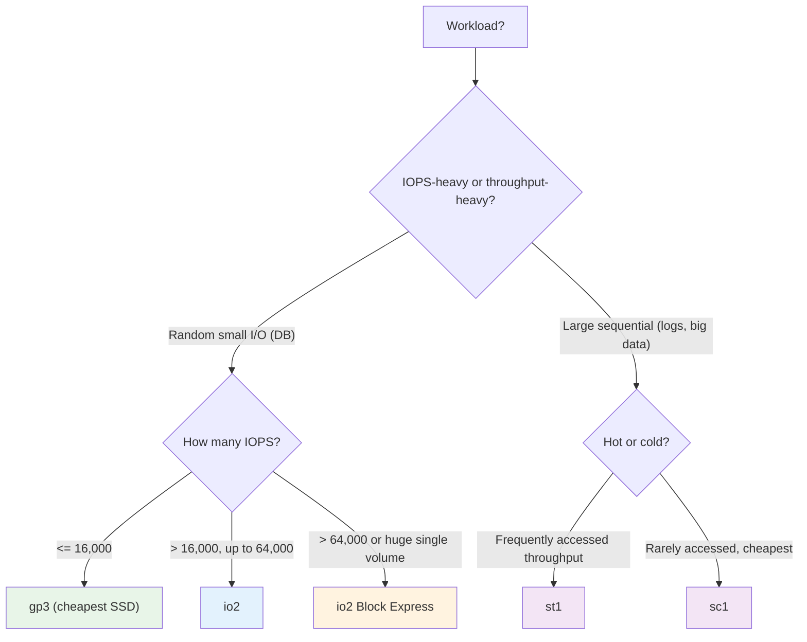
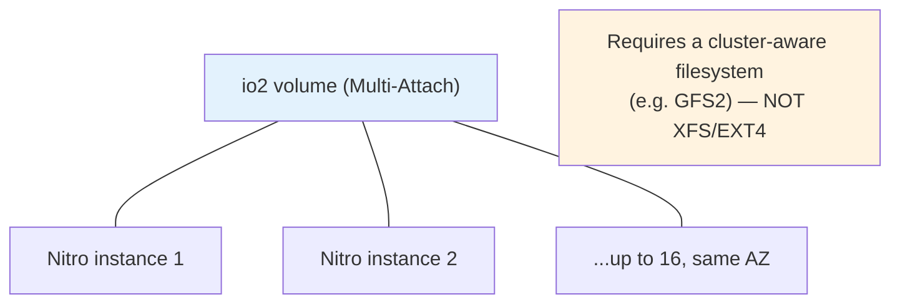
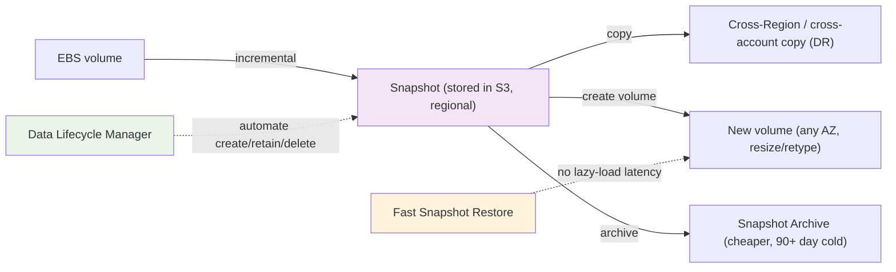

# EC2 Storage - Deep Dive (SAA-C03)

> Storage choices drive a large share of EC2 exam questions: EBS volume types and their IOPS/throughput ceilings, instance store vs EBS, EFS vs FSx for shared storage, Multi-Attach, snapshots/DLM/Fast Snapshot Restore, and encryption. This file is the storage decision engine.

> **EC2 + ASG series:** [01 - EC2 Intro](01%20-%20EC2%20Intro.md) · [02 - EC2 Instance Types Deep Dive](02%20-%20EC2%20Instance%20Types%20Deep%20Dive.md) · [03 - EC2 Storage Deep Dive](03%20-%20EC2%20Storage%20Deep%20Dive.md) · [04 - EC2 Networking, Placement & Metadata Deep Dive](04%20-%20EC2%20Networking%2C%20Placement%20%26%20Metadata%20Deep%20Dive.md) · [05 - EC2 Pricing & Purchasing Options Deep Dive](05%20-%20EC2%20Pricing%20%26%20Purchasing%20Options%20Deep%20Dive.md) · [06 - EC2 Auto Scaling (ASG)](06%20-%20EC2%20Auto%20Scaling%20%28ASG%29.md) · [07 - ASG Architecture & Advanced Deep Dive](07%20-%20ASG%20Architecture%20%26%20Advanced%20Deep%20Dive.md) · [08 - EC2 & ASG Architecture Patterns & Examples](08%20-%20EC2%20%26%20ASG%20Architecture%20Patterns%20%26%20Examples.md) · [09 - EC2 & ASG Scenario Questions](09%20-%20EC2%20%26%20ASG%20Scenario%20Questions.md) · [10 - EC2 & ASG Important Facts & Cheat Sheet](10%20-%20EC2%20%26%20ASG%20Important%20Facts%20%26%20Cheat%20Sheet.md)

---

## Table of Contents

- [The Storage Landscape](#the-storage-landscape)
- [EBS Fundamentals](#ebs-fundamentals)
- [EBS Volume Types (Exam Critical)](#ebs-volume-types-exam-critical)
- [Choosing an EBS Volume Type](#choosing-an-ebs-volume-type)
- [Instance Store (Ephemeral)](#instance-store-ephemeral)
- [EBS Multi-Attach](#ebs-multi-attach)
- [EBS Snapshots, DLM & Fast Snapshot Restore](#ebs-snapshots-dlm--fast-snapshot-restore)
- [EBS Encryption](#ebs-encryption)
- [Shared File Storage: EFS vs FSx](#shared-file-storage-efs-vs-fsx)
- [EBS vs EFS vs Instance Store vs S3](#ebs-vs-efs-vs-instance-store-vs-s3)
- [Exam Triggers](#exam-triggers)

---

## The Storage Landscape

[⬆ Back to top](#table-of-contents)

---

## EBS Fundamentals

**Amazon EBS** = network-attached **block storage** for EC2.

- **AZ-scoped:** a volume lives in **one AZ** and can attach only to instances in that same AZ. To move across AZ/Region → snapshot, then create a volume from the snapshot in the target AZ/Region.
- **Persistent:** survives instance stop/terminate (if `DeleteOnTermination` is off for non-root, or always for data volumes you manage).
- **Replicated within its AZ** for durability (not across AZs — that's what snapshots/EFS are for).
- **Elastic Volumes:** change size, type, and IOPS **live** without detaching (one modification per volume per 6 hours).

[⬆ Back to top](#table-of-contents)

---

## EBS Volume Types (Exam Critical)

| Type                  | Class | Max IOPS    | Max throughput | Max size   | Durability  | Best for                                                                                    |
| :-------------------- | :---- | :---------- | :------------- | :--------- | :---------- | :------------------------------------------------------------------------------------------ |
| **gp3**               | SSD   | 16,000      | 1,000 MB/s     | 16 TiB     | 99.8–99.9%  | **Default** general purpose; IOPS/throughput **decoupled from size**; ~20% cheaper than gp2 |
| **gp2**               | SSD   | 16,000      | 250 MB/s       | 16 TiB     | 99.8–99.9%  | Legacy general purpose; IOPS = **3×GB** (burst to 3,000)                                    |
| **io1**               | SSD   | 64,000      | 1,000 MB/s     | 16 TiB     | 99.8–99.9%  | Legacy provisioned-IOPS                                                                     |
| **io2**               | SSD   | 64,000      | 1,000 MB/s     | 16 TiB     | **99.999%** | Critical DBs needing high durability                                                        |
| **io2 Block Express** | SSD   | **256,000** | **4,000 MB/s** | **64 TiB** | 99.999%     | Largest, most demanding DBs (SAP HANA, Oracle)                                              |
| **st1**               | HDD   | 500         | 500 MB/s       | 16 TiB     | 99.8–99.9%  | Throughput-oriented: big data, log processing, data warehouse                               |
| **sc1**               | HDD   | 250         | 250 MB/s       | 16 TiB     | 99.8–99.9%  | Cold, infrequently accessed; **cheapest**                                                   |

> [!warning] Key gp3 fact
> **gp3 decouples performance from capacity** — you provision IOPS (up to 16,000) and throughput (up to 1,000 MB/s) independently of size, starting at a 3,000 IOPS / 125 MB/s baseline. With gp2, the only way to get more IOPS was to grow the volume. Migrating gp2→gp3 is a classic cost-optimization answer.

> [!note] Boot volumes
> HDD types (**st1, sc1**) **cannot be boot/root volumes**. Boot volumes must be SSD (gp2/gp3/io1/io2).

[⬆ Back to top](#table-of-contents)

---

## Choosing an EBS Volume Type

> For **>64,000 IOPS on a single volume** or **>16 TiB**, the answer is **io2 Block Express** (only it reaches 256,000 IOPS / 64 TiB). RAID-0 striping multiple gp3/io2 volumes is the workaround when a question forbids Block Express.

[⬆ Back to top](#table-of-contents)

---

## Instance Store (Ephemeral)

**Instance store** = disks **physically attached** to the host (local NVMe/SSD). Extremely high IOPS/throughput, but:

| Property    | Instance store                                                                 |
| :---------- | :----------------------------------------------------------------------------- |
| Performance | **Millions of IOPS** — far beyond EBS                                          |
| Persistence | **Ephemeral** — lost on stop, terminate, or hardware failure (survives reboot) |
| Attachment  | Single instance, fixed at launch (can't detach/reattach)                       |
| Snapshots   | Not directly snapshottable                                                     |
| Cost        | Included in instance price                                                     |

> [!warning] Exam trap
> "Need the **highest possible IOPS / lowest latency** local storage and the data is **temporary or replicated**" → **instance store** (e.g., I-family NVMe). But "must **persist** beyond instance lifecycle" → **EBS**. If a question says data on instance store must survive, that design is wrong — you need EBS or replication.

[⬆ Back to top](#table-of-contents)

---

## EBS Multi-Attach

Attach a **single io1/io2 volume to up to 16 Nitro instances in the same AZ** simultaneously, all with read/write.

| Requirement  | Detail                                                                  |
| :----------- | :---------------------------------------------------------------------- |
| Volume types | **io1 / io2 only** (not gp2/gp3/st1/sc1)                                |
| Instances    | Nitro-based, **same AZ**                                                |
| Max          | 16 instances                                                            |
| Filesystem   | Must be **cluster-aware** (GFS2, etc.) — standard EXT4/XFS will corrupt |
| OS           | Linux (not Windows)                                                     |

> **Trigger:** "multiple instances need concurrent read/write to the **same block volume**, low latency, same AZ" → **EBS Multi-Attach (io2)**. If it's a **file system across AZs**, that's **EFS**, not Multi-Attach.

[⬆ Back to top](#table-of-contents)

---

## EBS Snapshots, DLM & Fast Snapshot Restore

- **Incremental:** only changed blocks are stored; deleting an old snapshot is safe (blocks still needed are retained).
- **Regional & durable:** stored in S3 (not directly accessible); copy **cross-Region/cross-account** for DR.
- **Restored volumes are lazy-loaded** by default (first access of each block is slow). **Fast Snapshot Restore (FSR)** pre-provisions full performance immediately — for large DBs/AMIs (extra cost per snapshot/AZ).
- **Data Lifecycle Manager (DLM):** automates snapshot/AMI creation, retention, and deletion on a schedule — the answer for "automated backup policy" without custom scripts.
- **Recycle Bin:** retention rules let you recover **deleted** snapshots/AMIs.
- **Snapshot Archive:** moves snapshots to a cheaper cold tier (restore takes 24–72h) for long-term retention.

> [!note] Consistent snapshots
> For a crash-consistent snapshot you can snapshot a running volume, but for application consistency, **flush/freeze** or **stop the instance** first. Snapshots of the **root volume** capture the whole boot disk.

[⬆ Back to top](#table-of-contents)

---

## EBS Encryption

- Uses **AWS KMS** (AES-256). Encrypts data at rest, in transit between volume and instance, and **all snapshots**.
- **Enable by default** at the account/Region level (recommended).
- Encrypting an **existing unencrypted** volume: snapshot it → copy the snapshot **with encryption enabled** → create a new (encrypted) volume from that copy. You can't encrypt a volume in place.
- Snapshots of encrypted volumes are encrypted; volumes from encrypted snapshots are encrypted. Sharing an encrypted snapshot requires sharing the KMS key.

[⬆ Back to top](#table-of-contents)

---

## Shared File Storage: EFS vs FSx

When **many instances need a shared file system** (EBS can't do this across AZs):

| Service                         | Protocol      | OS          | Use case                                                                                            |
| :------------------------------ | :------------ | :---------- | :-------------------------------------------------------------------------------------------------- |
| **EFS**                         | NFS v4.1      | **Linux**   | Shared POSIX file system across **many instances and AZs**; auto-scaling; CMS, web farms, home dirs |
| **FSx for Windows File Server** | SMB           | **Windows** | Windows-native shares, AD integration, DFS                                                          |
| **FSx for Lustre**              | Lustre        | Linux       | **HPC**, ML, high-throughput compute; S3-integrated                                                 |
| **FSx for NetApp ONTAP**        | NFS/SMB/iSCSI | Multi       | Migrate NetApp workloads; multi-protocol                                                            |
| **FSx for OpenZFS**             | NFS           | Linux       | ZFS workloads, low-latency                                                                          |

**EFS storage classes** (lifecycle management moves files automatically): Standard, Standard-IA, One Zone, One Zone-IA, and Archive — cost optimization for infrequently accessed files.

> [!warning] EFS vs EBS vs FSx
>
> - **EBS** = one instance (or ≤16 same-AZ with Multi-Attach), block, single AZ.
> - **EFS** = many Linux instances, NFS, **multi-AZ**, elastic.
> - **FSx for Windows** = many Windows instances, SMB. "Windows shared storage / Active Directory" → **FSx for Windows**, never EFS.
> - **FSx for Lustre** = HPC/ML high throughput.

[⬆ Back to top](#table-of-contents)

---

## EBS vs EFS vs Instance Store vs S3

| Aspect       | EBS                                  | Instance Store           | EFS                              | S3                                |
| :----------- | :----------------------------------- | :----------------------- | :------------------------------- | :-------------------------------- |
| Type         | Block                                | Block (local)            | File (NFS)                       | Object                            |
| Persistence  | Persistent                           | **Ephemeral**            | Persistent                       | Persistent                        |
| Attach scope | 1 instance / AZ (16 w/ Multi-Attach) | 1 instance               | Many instances, multi-AZ         | Anywhere via API                  |
| Performance  | Up to 256k IOPS (Block Express)      | Millions IOPS            | Scales with size/throughput mode | High, internet-scale              |
| Cross-AZ     | Snapshot to move                     | No                       | **Yes, native**                  | Regional/global                   |
| Use case     | Boot/DB volumes                      | Cache/scratch/replicated | Shared Linux FS                  | Backups, static assets, data lake |

[⬆ Back to top](#table-of-contents)

---

## Exam Triggers

| Question says...                                     | Answer                                           |
| :--------------------------------------------------- | :----------------------------------------------- |
| "General purpose, cost-optimize, decoupled IOPS"     | **gp3**                                          |
| "DB needs > 64,000 IOPS / > 16 TiB single volume"    | **io2 Block Express**                            |
| "99.999% volume durability for critical DB"          | **io2 / io2 Block Express**                      |
| "Cheapest storage for big sequential throughput"     | **st1**                                          |
| "Cheapest, rarely accessed"                          | **sc1**                                          |
| "Highest local IOPS, data temporary/replicated"      | **Instance store**                               |
| "Several instances, same block volume, same AZ"      | **EBS Multi-Attach (io2)**                       |
| "Shared file system, many Linux instances, multi-AZ" | **EFS**                                          |
| "Windows shared file storage with AD"                | **FSx for Windows**                              |
| "HPC/ML high-throughput shared FS"                   | **FSx for Lustre**                               |
| "Automate scheduled EBS backups & retention"         | **Data Lifecycle Manager (DLM)**                 |
| "Restore large volume at full performance instantly" | **Fast Snapshot Restore**                        |
| "DR copy of backups in another Region"               | **Cross-Region snapshot copy**                   |
| "Encrypt an existing unencrypted volume"             | **Snapshot → copy with encryption → new volume** |
| "Recover an accidentally deleted snapshot"           | **Recycle Bin**                                  |

> Next: [04 - EC2 Networking, Placement & Metadata Deep Dive](04%20-%20EC2%20Networking%2C%20Placement%20%26%20Metadata%20Deep%20Dive.md) — ENI/ENA/EFA, placement groups, IMDSv2, security groups, and hibernation.
