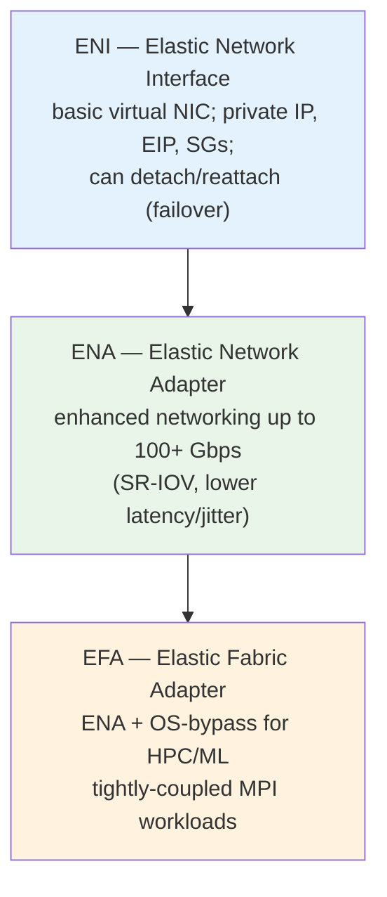
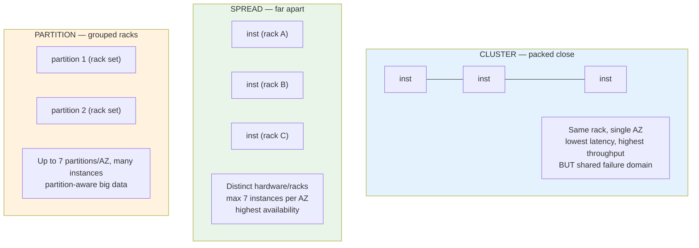
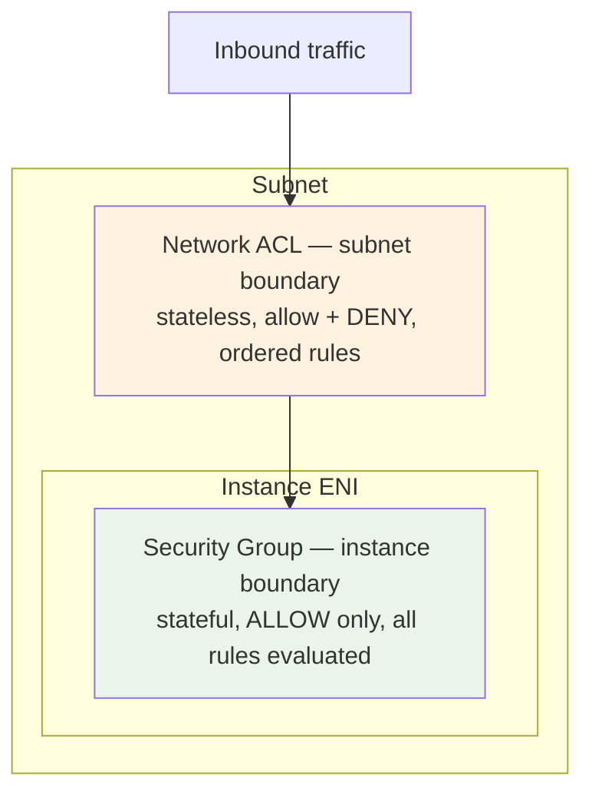
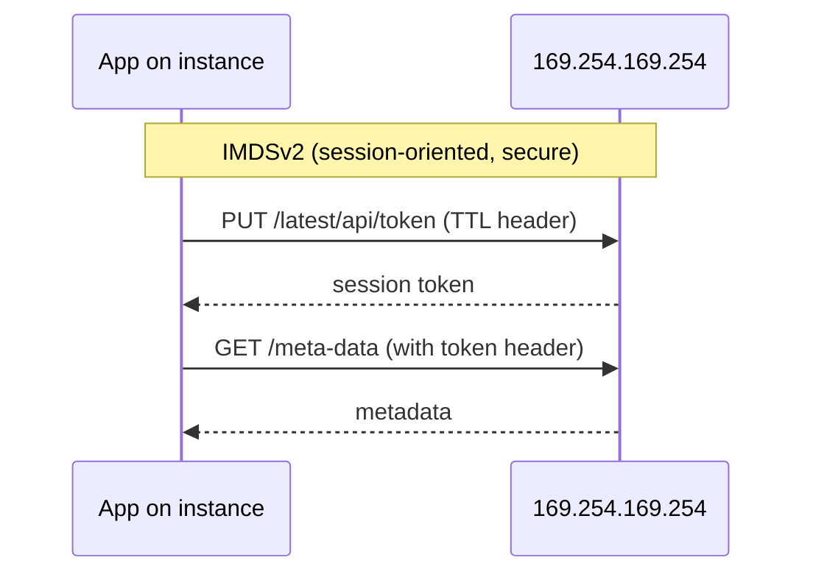
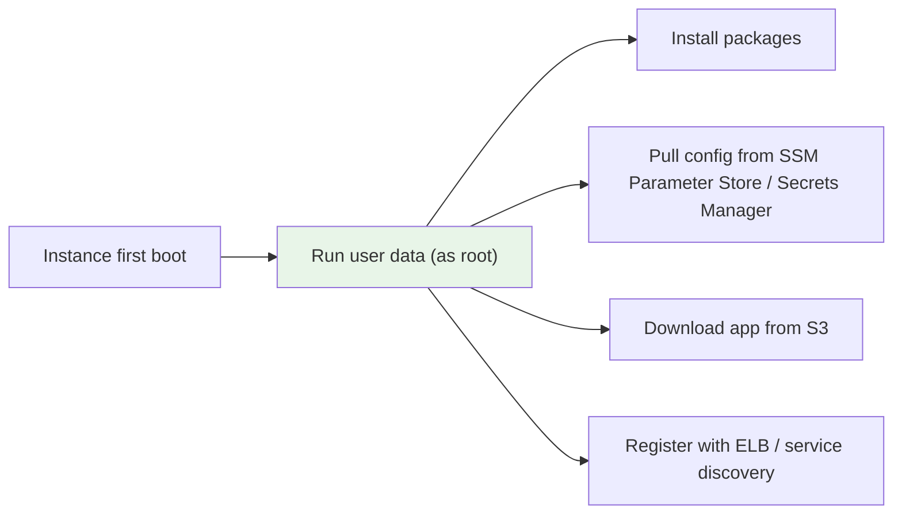

# EC2 Networking, Placement & Metadata - Deep Dive (SAA-C03)

> The networking-and-placement layer of EC2: ENIs vs ENA vs EFA, the three placement-group strategies, EBS-optimized + enhanced networking, security groups vs NACLs, elastic/public/private IPs, IMDSv2 security, and user-data bootstrapping. These show up as "how do I get low latency / high throughput / secure metadata" questions.

> **EC2 + ASG series:** [01 - EC2 Intro](01%20-%20EC2%20Intro.md) · [02 - EC2 Instance Types Deep Dive](02%20-%20EC2%20Instance%20Types%20Deep%20Dive.md) · [03 - EC2 Storage Deep Dive](03%20-%20EC2%20Storage%20Deep%20Dive.md) · [04 - EC2 Networking, Placement & Metadata Deep Dive](04%20-%20EC2%20Networking%2C%20Placement%20%26%20Metadata%20Deep%20Dive.md) · [05 - EC2 Pricing & Purchasing Options Deep Dive](05%20-%20EC2%20Pricing%20%26%20Purchasing%20Options%20Deep%20Dive.md) · [06 - EC2 Auto Scaling (ASG)](06%20-%20EC2%20Auto%20Scaling%20%28ASG%29.md) · [07 - ASG Architecture & Advanced Deep Dive](07%20-%20ASG%20Architecture%20%26%20Advanced%20Deep%20Dive.md) · [08 - EC2 & ASG Architecture Patterns & Examples](08%20-%20EC2%20%26%20ASG%20Architecture%20Patterns%20%26%20Examples.md) · [09 - EC2 & ASG Scenario Questions](09%20-%20EC2%20%26%20ASG%20Scenario%20Questions.md) · [10 - EC2 & ASG Important Facts & Cheat Sheet](10%20-%20EC2%20%26%20ASG%20Important%20Facts%20%26%20Cheat%20Sheet.md)

---

## Table of Contents

- [Network Interfaces: ENI, ENA, EFA](#network-interfaces-eni-ena-efa)
- [Placement Groups (Exam Critical)](#placement-groups-exam-critical)
- [EBS-Optimized & Enhanced Networking](#ebs-optimized--enhanced-networking)
- [IP Addressing: Private, Public, Elastic](#ip-addressing-private-public-elastic)
- [Security Groups vs Network ACLs](#security-groups-vs-network-acls)
- [Instance Metadata Service (IMDSv1 vs IMDSv2)](#instance-metadata-service-imdsv1-vs-imdsv2)
- [User Data & Bootstrapping](#user-data--bootstrapping)
- [Exam Triggers](#exam-triggers)

---

## Network Interfaces: ENI, ENA, EFA

| Interface | What it adds                                                                                  | Use case                                                                              |
| :-------- | :-------------------------------------------------------------------------------------------- | :------------------------------------------------------------------------------------ |
| **ENI**   | Basic NIC: private IP(s), EIP, MAC, security groups; movable between instances in the same AZ | Management networks, **failover** (detach/reattach to standby), multi-homed instances |
| **ENA**   | **Enhanced networking** (SR-IOV) — high bandwidth (up to 100+ Gbps), low latency              | Any throughput-sensitive workload                                                     |
| **EFA**   | ENA + **OS-bypass** (Libfabric) for ultra-low-latency node-to-node                            | **HPC**, distributed ML training, MPI; pair with **Cluster placement group**          |

> **Trigger:** "tightly-coupled HPC / MPI / distributed training, lowest inter-node latency" → **EFA** (+ Cluster placement group). "Move a network identity to a standby instance" → **secondary ENI** failover.

[⬆ Back to top](#table-of-contents)

---

## Placement Groups (Exam Critical)

How EC2 physically places instances relative to each other. Three strategies, three goals.

| Strategy      | Layout                                      | Limit                               | Use case                                                                        | Risk                        |
| :------------ | :------------------------------------------ | :---------------------------------- | :------------------------------------------------------------------------------ | :-------------------------- |
| **Cluster**   | Same rack, one AZ                           | —                                   | HPC, low-latency/high-throughput (10–100 Gbps between nodes)                    | Rack failure takes all down |
| **Spread**    | Each instance on **distinct** hardware      | **7 per AZ**                        | Small set of **critical** instances (e.g., quorum nodes) needing max isolation  | Hard 7-per-AZ cap           |
| **Partition** | Groups of racks (partitions), each isolated | **7 partitions/AZ**, many instances | Large distributed systems (**HDFS, Cassandra, Kafka**) that are partition-aware | —                           |

> [!warning] High-yield
>
> - "Lowest network latency between nodes / HPC" → **Cluster** (+ EFA + ENA).
> - "Maximum availability for a few critical instances" → **Spread** (remember the **7-per-AZ** limit).
> - "Large partition-aware distributed data store" → **Partition**.

[⬆ Back to top](#table-of-contents)

---

## EBS-Optimized & Enhanced Networking

- **EBS-optimized** dedicates bandwidth between the instance and EBS so storage traffic doesn't contend with regular network traffic. **On by default** on current-gen instances (M5/C5/R5+).
- **Enhanced networking (ENA / SR-IOV)** gives higher packets-per-second, lower latency, and lower jitter — required to hit the instance's top network speed.
- Combine **Cluster placement group + ENA/EFA + EBS-optimized** for the highest-performance node-to-node + storage profile.

[⬆ Back to top](#table-of-contents)

---

## IP Addressing: Private, Public, Elastic

| Address              | Lifetime                       | Notes                                                                                                               |
| :------------------- | :----------------------------- | :------------------------------------------------------------------------------------------------------------------ |
| **Private IP**       | Persists for instance life     | Always present; used inside the VPC                                                                                 |
| **Public IP**        | **Released on stop/terminate** | Auto-assigned (optional); **changes** on stop/start                                                                 |
| **Elastic IP (EIP)** | Static, you own it             | Fixed public IPv4; remap between instances/ENIs for failover; **charged when not associated** to a running instance |

> [!note] Exam nugget
> If a workload needs a **stable public IP** across stop/start, use an **Elastic IP**. But the modern best practice is to **avoid EIPs** — put instances behind a **load balancer** or use **Route 53** so you don't depend on a fixed instance IP. EIPs are also rate-limited (5 per Region by default) and now incur a charge for all public IPv4.

[⬆ Back to top](#table-of-contents)

---

## Security Groups vs Network ACLs

| Aspect        | Security Group                             | Network ACL                                                       |
| :------------ | :----------------------------------------- | :---------------------------------------------------------------- |
| Level         | Instance (ENI)                             | Subnet                                                            |
| Rules         | **Allow only**                             | **Allow and Deny**                                                |
| State         | **Stateful** (return traffic auto-allowed) | **Stateless** (must allow both directions, incl. ephemeral ports) |
| Evaluation    | All rules together                         | In **number order**, first match wins                             |
| Can reference | Other security groups                      | CIDR blocks only                                                  |
| Default       | Deny inbound, allow outbound               | Default ACL allows all; custom ACL denies all until you add rules |

> [!warning] Two classic traps
>
> 1. **SGs can't DENY** — to explicitly block an IP/range, use a **NACL** (Deny rule).
> 2. **NACLs are stateless** — if you allow inbound 443 you must also allow the **outbound ephemeral port range** (1024–65535) for the response, and vice versa.
> 3. **SG referencing** (e.g., "App SG allows from Web SG") is the clean tiered pattern — no hardcoded IPs.

[⬆ Back to top](#table-of-contents)

---

## Instance Metadata Service (IMDSv1 vs IMDSv2)

Instances read their own metadata (instance ID, IAM role creds, etc.) at `http://169.254.169.254/latest/meta-data/`.

|                 | IMDSv1                                     | IMDSv2                                                          |
| :-------------- | :----------------------------------------- | :-------------------------------------------------------------- |
| Model           | Simple request/response                    | **Session token required** (PUT then GET)                       |
| SSRF resistance | **Weak** (a tricked proxy can fetch creds) | **Strong** (token + `X-Forwarded-For` blocking + TTL hop limit) |
| Recommendation  | Avoid                                      | **Require IMDSv2** (`http-tokens=required`)                     |

> [!warning] Exam favorite
> "EC2 instance credentials exposed via **SSRF**" → **enforce IMDSv2** (`--http-tokens required`). Don't disable metadata entirely (breaks IAM roles); don't rely on NACLs to block the link-local address.

[⬆ Back to top](#table-of-contents)

---

## User Data & Bootstrapping

- **User data** is a script (bash / cloud-init / PowerShell) that runs **once at first boot, as root**, to install software, pull config, or join a cluster.
- Limit **16 KB** (base64). For larger payloads, have user data download from **S3**.
- Runs only on **first launch** by default (can be made to run on every boot with cloud-init directives).
- **Never embed credentials** in user data or the AMI — attach an **IAM role** instead (see [01 - EC2 Intro > 🔗 EC2 with Other Services - Integration Architecture](01%20-%20EC2%20Intro.md#-ec2-with-other-services---integration-architecture)).

> For repeatable, idempotent provisioning beyond first boot, prefer **AWS Systems Manager** (State Manager / Run Command) or a golden **AMI** baked with the software pre-installed (faster scale-out — see [06 - EC2 Auto Scaling (ASG) > 🔥 Warm Pools - Reduce Scaling Latency](06%20-%20EC2%20Auto%20Scaling%20%28ASG%29.md#-warm-pools---reduce-scaling-latency)).

[⬆ Back to top](#table-of-contents)

---

## Exam Triggers

| Question says...                                                 | Answer                                          |
| :--------------------------------------------------------------- | :---------------------------------------------- |
| "Lowest latency / highest throughput between nodes, HPC"         | **Cluster placement group** + **EFA** + **ENA** |
| "Max availability for a few critical instances"                  | **Spread placement group** (7/AZ limit)         |
| "Large partition-aware distributed store (HDFS/Cassandra/Kafka)" | **Partition placement group**                   |
| "Move a network identity to a standby for failover"              | Secondary **ENI** detach/reattach               |
| "Ultra-low-latency MPI / distributed ML"                         | **EFA**                                         |
| "Stable public IP across stop/start"                             | **Elastic IP** (or better: ALB/Route 53)        |
| "Explicitly block a malicious IP range"                          | **NACL Deny** (SGs can't deny)                  |
| "Tiered access: app accepts only from web tier"                  | **SG referencing another SG**                   |
| "Credentials stolen via SSRF on metadata"                        | **Require IMDSv2**                              |
| "Install software automatically at first boot"                   | **User data** (+ IAM role, not keys)            |
| "Faster scale-out, app takes minutes to install"                 | Bake a **golden AMI** / use **warm pools**      |

> Next: [05 - EC2 Pricing & Purchasing Options Deep Dive](05%20-%20EC2%20Pricing%20%26%20Purchasing%20Options%20Deep%20Dive.md) — On-Demand, Reserved, Savings Plans, Spot, Dedicated, and Capacity Reservations.
