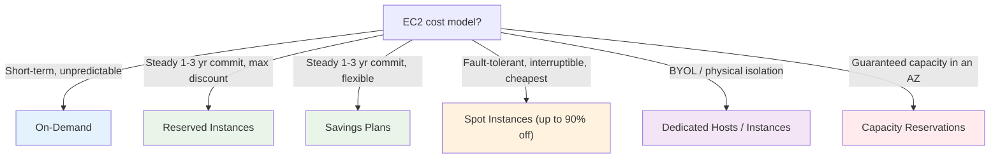
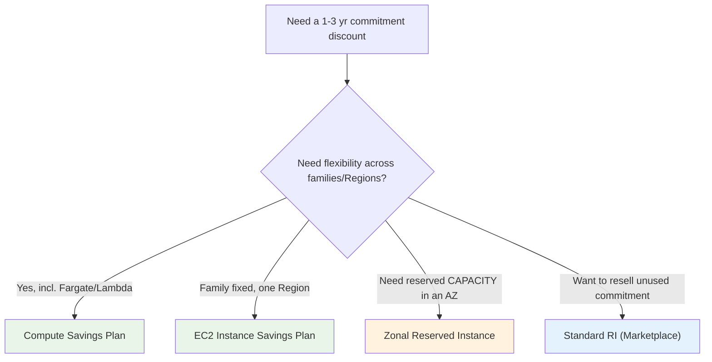
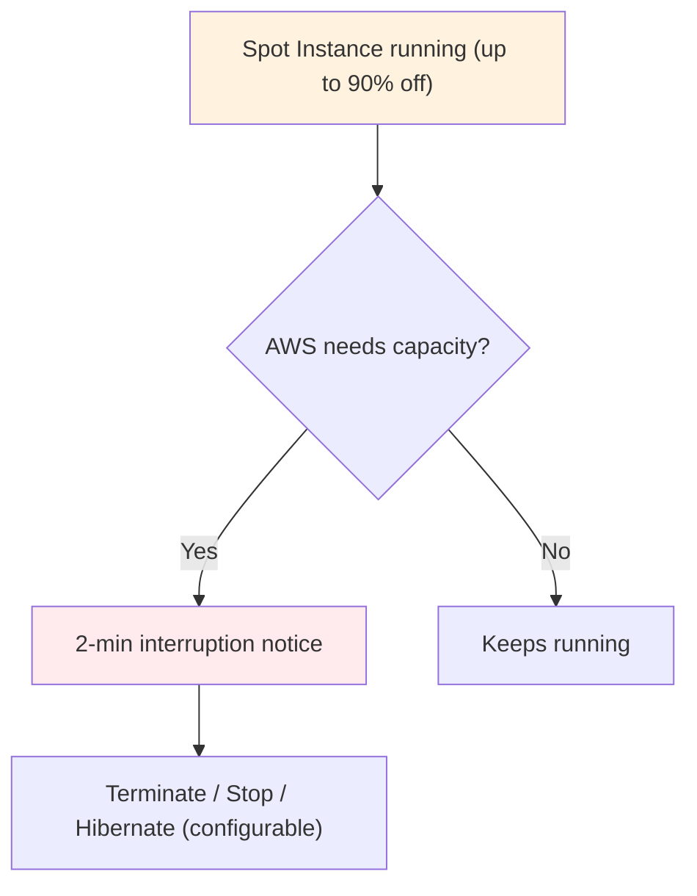
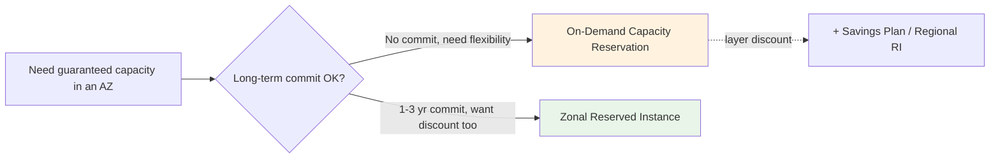
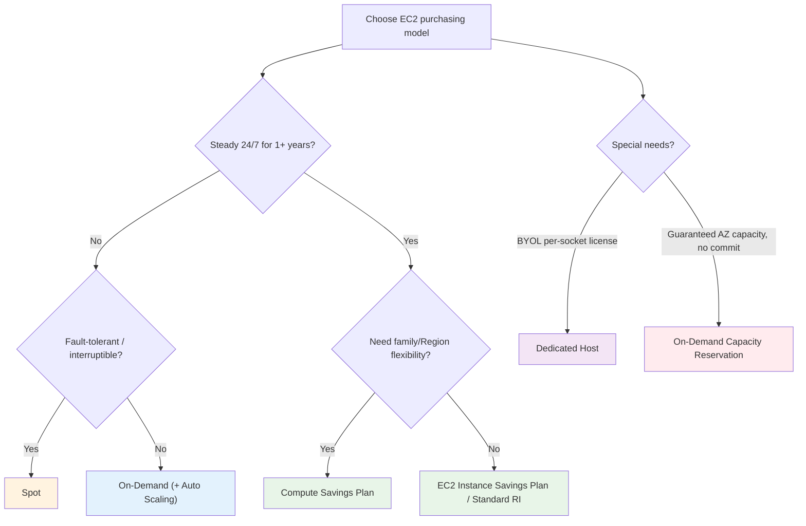

# EC2 Pricing & Purchasing Options - Deep Dive (SAA-C03)

> Cost-optimization is a full SAA-C03 domain, and EC2 purchasing options are its heart: On-Demand, Reserved Instances, Savings Plans, Spot, Dedicated Hosts/Instances, and Capacity Reservations. This file gives the decision trees and the "which discount model" triggers the exam leans on.

> **EC2 + ASG series:** [01 - EC2 Intro](01%20-%20EC2%20Intro.md) · [02 - EC2 Instance Types Deep Dive](02%20-%20EC2%20Instance%20Types%20Deep%20Dive.md) · [03 - EC2 Storage Deep Dive](03%20-%20EC2%20Storage%20Deep%20Dive.md) · [04 - EC2 Networking, Placement & Metadata Deep Dive](04%20-%20EC2%20Networking%2C%20Placement%20%26%20Metadata%20Deep%20Dive.md) · [05 - EC2 Pricing & Purchasing Options Deep Dive](05%20-%20EC2%20Pricing%20%26%20Purchasing%20Options%20Deep%20Dive.md) · [06 - EC2 Auto Scaling (ASG)](06%20-%20EC2%20Auto%20Scaling%20%28ASG%29.md) · [07 - ASG Architecture & Advanced Deep Dive](07%20-%20ASG%20Architecture%20%26%20Advanced%20Deep%20Dive.md) · [08 - EC2 & ASG Architecture Patterns & Examples](08%20-%20EC2%20%26%20ASG%20Architecture%20Patterns%20%26%20Examples.md) · [09 - EC2 & ASG Scenario Questions](09%20-%20EC2%20%26%20ASG%20Scenario%20Questions.md) · [10 - EC2 & ASG Important Facts & Cheat Sheet](10%20-%20EC2%20%26%20ASG%20Important%20Facts%20%26%20Cheat%20Sheet.md)

---

## Table of Contents

- [The Six Purchasing Options](#the-six-purchasing-options)
- [On-Demand](#on-demand)
- [Reserved Instances (RI)](#reserved-instances-ri)
- [Savings Plans](#savings-plans)
- [RI vs Savings Plans](#ri-vs-savings-plans)
- [Spot Instances](#spot-instances)
- [Dedicated Hosts vs Dedicated Instances](#dedicated-hosts-vs-dedicated-instances)
- [Capacity Reservations](#capacity-reservations)
- [Putting It Together: Decision Tree](#putting-it-together-decision-tree)
- [Exam Triggers](#exam-triggers)

---

## The Six Purchasing Options

[⬆ Back to top](#table-of-contents)

---

## On-Demand

- Pay per second (Linux/Windows; 60-second minimum), **no commitment**, highest price.
- Best for **short-term, spiky, unpredictable** workloads and **dev/test**, or as the baseline that Auto Scaling adds/removes.

> **Trigger:** "unpredictable," "short-lived," "can't commit," "new app with unknown load" → **On-Demand**.

[⬆ Back to top](#table-of-contents)

---

## Reserved Instances (RI)

A **1- or 3-year** commitment to a specific instance configuration for up to **~72%** off On-Demand.

| Dimension          | Options                                                                                                                                   |
| :----------------- | :---------------------------------------------------------------------------------------------------------------------------------------- |
| **Term**           | 1 year or 3 years (3-yr = bigger discount)                                                                                                |
| **Payment**        | All Upfront (best) > Partial Upfront > No Upfront                                                                                         |
| **Offering class** | **Standard** (biggest discount, can only modify AZ/size within family) · **Convertible** (can change family/OS/tenancy, smaller discount) |
| **Scope**          | **Regional** (flexible AZ, no capacity reservation) or **Zonal** (specific AZ, **reserves capacity**)                                     |

- **Standard RI** can be sold on the **Reserved Instance Marketplace** if no longer needed.
- **Size flexibility:** within a family/Region, a Regional Linux RI applies across sizes (normalized by footprint).

> **Trigger:** "steady-state 24/7 for 1–3 years," "maximum discount," "known fixed workload" → **RI** (Standard if config is stable; Convertible if it may change).

[⬆ Back to top](#table-of-contents)

---

## Savings Plans

A commitment to a **$/hour of compute spend** for 1 or 3 years (not a specific instance), up to **~72%** off.

| Type                          | Flexibility                                                                            | Discount   |
| :---------------------------- | :------------------------------------------------------------------------------------- | :--------- |
| **Compute Savings Plan**      | **Any** instance family, size, AZ, **Region**, OS, tenancy — even **Fargate & Lambda** | Up to ~66% |
| **EC2 Instance Savings Plan** | Locked to an **instance family in a Region**; flexible on size/AZ/OS                   | Up to ~72% |

> **Trigger:** "want RI-level savings but **flexibility** to change instance types/Regions" → **Compute Savings Plan**. "Commit to a family in one Region for max savings" → **EC2 Instance Savings Plan**. "Discount that also covers Fargate/Lambda" → **Compute Savings Plan**.

[⬆ Back to top](#table-of-contents)

---

## RI vs Savings Plans

|                       | Reserved Instances        | Savings Plans                               |
| :-------------------- | :------------------------ | :------------------------------------------ |
| Commit to             | Specific config           | $/hour spend                                |
| Flexibility           | Lower (Convertible helps) | **Higher**                                  |
| Capacity reservation  | Only **Zonal** RIs        | **No** (use On-Demand Capacity Reservation) |
| Resale                | Standard RIs only         | No                                          |
| Covers Fargate/Lambda | No                        | **Compute SP: yes**                         |

> **Modern guidance:** AWS recommends **Savings Plans** over RIs for most cases due to flexibility — but if a question stresses **guaranteed capacity in a specific AZ**, that's a **Zonal RI** (or On-Demand Capacity Reservation), since Savings Plans never reserve capacity.

[⬆ Back to top](#table-of-contents)

---

## Spot Instances

Unused EC2 capacity at up to **90%** off — but AWS can **reclaim with a 2-minute warning** when it needs the capacity back.

- **Use for:** fault-tolerant, flexible, stateless or checkpointed work — **batch, CI/CD, big-data, rendering, ML training with checkpoints**, ASG overflow.
- **Don't use for:** databases, stateful single-node apps, anything that can't tolerate sudden loss.
- **Spot Fleet / EC2 Fleet:** request a target capacity across many instance types/AZs, mixing **Spot + On-Demand**.
- **Allocation strategies:** `capacity-optimized` (fewest interruptions — preferred for production-ish Spot) vs `lowest-price` (cheapest, more interruptions). **Capacity Rebalance** proactively replaces at-risk instances.

> **Trigger:** "fault-tolerant," "interruptible," "can be restarted," "flexible timing," "cheapest for batch" → **Spot**. "Minimize interruptions" → **capacity-optimized** allocation.

[⬆ Back to top](#table-of-contents)

---

## Dedicated Hosts vs Dedicated Instances

|                                 | Dedicated Instance                 | Dedicated Host                               |
| :------------------------------ | :--------------------------------- | :------------------------------------------- |
| Isolation                       | Hardware dedicated to your account | A **physical server** dedicated to you       |
| Socket/core visibility          | **No**                             | **Yes**                                      |
| BYOL (per-socket/core licenses) | No                                 | **Yes** (Windows Server, Oracle, SQL Server) |
| Placement control / same host   | No                                 | **Yes** (host affinity)                      |
| Billing                         | Per instance                       | Per **host**                                 |

> **Trigger:** "BYOL bound to physical cores/sockets," "license needs a fixed host," "compliance requiring a known physical server" → **Dedicated Host**. "Just need physical isolation from other customers" → **Dedicated Instance**. (See [02 - EC2 Instance Types Deep Dive > Tenancy: Shared, Dedicated Instance, Dedicated Host](02%20-%20EC2%20Instance%20Types%20Deep%20Dive.md#tenancy-shared-dedicated-instance-dedicated-host).)

[⬆ Back to top](#table-of-contents)

---

## Capacity Reservations

**On-Demand Capacity Reservations (ODCR)** reserve capacity in a **specific AZ** for any duration, with **no commitment** to a term and **no discount** — you pay On-Demand whether or not you run instances.

- Solves "I must be able to **launch instances in this AZ** during a critical window (e.g., DR failover, holiday peak)" without a 1–3 year lock-in.
- Combine with a **Savings Plan or Regional RI** to get the discount _and_ the capacity guarantee.
- Contrast: **Zonal RI** = capacity reservation **+** discount **+** 1–3 yr commit.

[⬆ Back to top](#table-of-contents)

---

## Putting It Together: Decision Tree

> **Common real-world mix:** Reserved/Savings-Plan baseline for steady load + On-Demand for normal variability + **Spot for elastic, fault-tolerant overflow** in the Auto Scaling group. See [08 - EC2 & ASG Architecture Patterns & Examples > Pattern: Cost-Optimized Mixed-Instances ASG](08%20-%20EC2%20%26%20ASG%20Architecture%20Patterns%20%26%20Examples.md#pattern-cost-optimized-mixed-instances-asg).

[⬆ Back to top](#table-of-contents)

---

## Exam Triggers

| Question says...                                          | Answer                                       |
| :-------------------------------------------------------- | :------------------------------------------- |
| "Unpredictable / short-term / new workload"               | **On-Demand**                                |
| "Steady 24/7 for 1–3 years, max discount, fixed config"   | **Standard Reserved Instance**               |
| "Commit but may change instance family/OS"                | **Convertible RI**                           |
| "RI savings with flexibility across families/Regions"     | **Compute Savings Plan**                     |
| "Discount that also covers Fargate & Lambda"              | **Compute Savings Plan**                     |
| "Commit to one family in one Region, biggest SP discount" | **EC2 Instance Savings Plan**                |
| "Fault-tolerant batch, cheapest possible"                 | **Spot Instances**                           |
| "Spot but minimize interruptions"                         | **capacity-optimized** allocation strategy   |
| "Mix Spot + On-Demand across types"                       | **EC2 Fleet / Spot Fleet** (launch template) |
| "BYOL bound to physical sockets/cores"                    | **Dedicated Host**                           |
| "Physical isolation only, no licensing detail"            | **Dedicated Instance**                       |
| "Guarantee capacity in an AZ, no long commitment"         | **On-Demand Capacity Reservation**           |
| "Guaranteed AZ capacity + discount + commitment"          | **Zonal Reserved Instance**                  |
| "Resell unused reservation"                               | **Standard RI on the Marketplace**           |

> Next: [06 - EC2 Auto Scaling (ASG)](06%20-%20EC2%20Auto%20Scaling%20%28ASG%29.md) — the full Auto Scaling deep dive (then [07 - ASG Architecture & Advanced Deep Dive](07%20-%20ASG%20Architecture%20%26%20Advanced%20Deep%20Dive.md) for the architecture internals).
