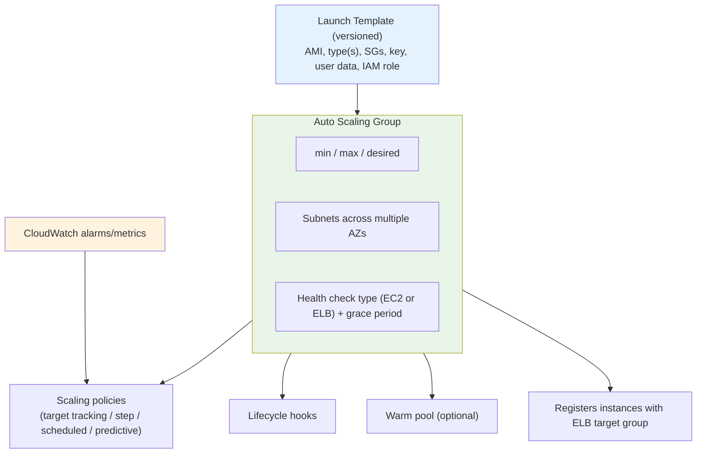
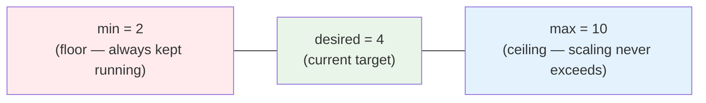
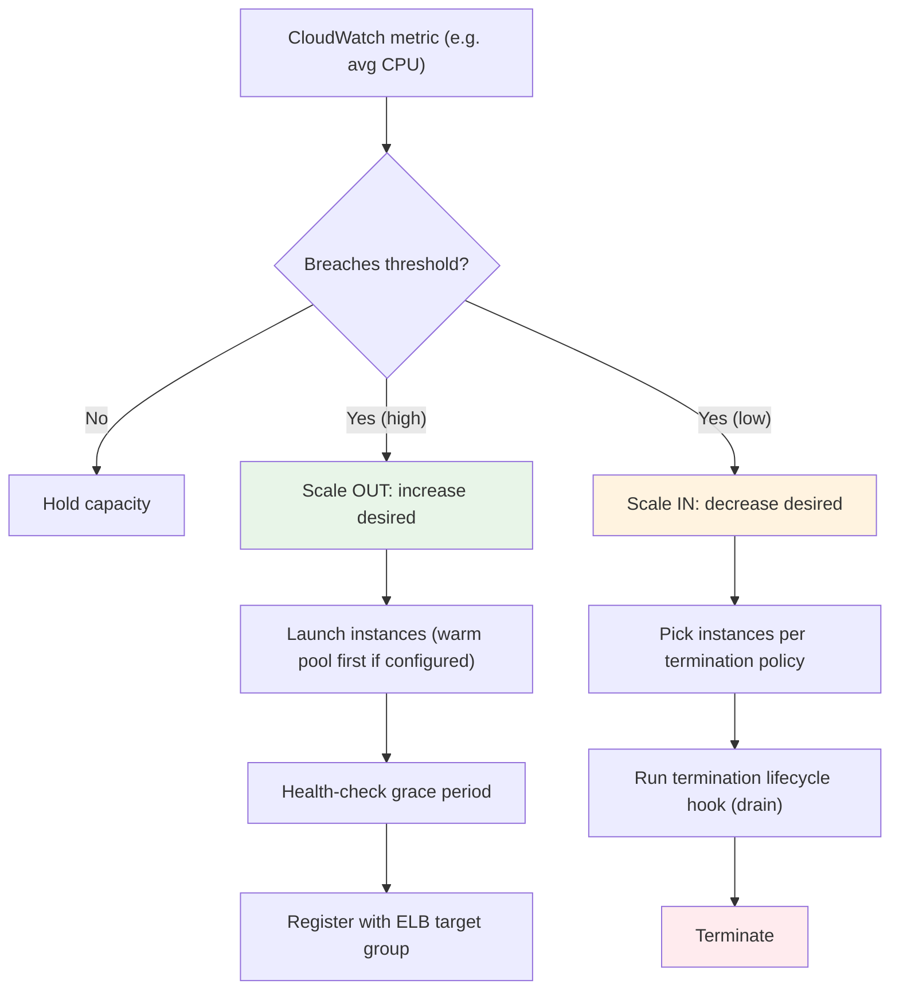
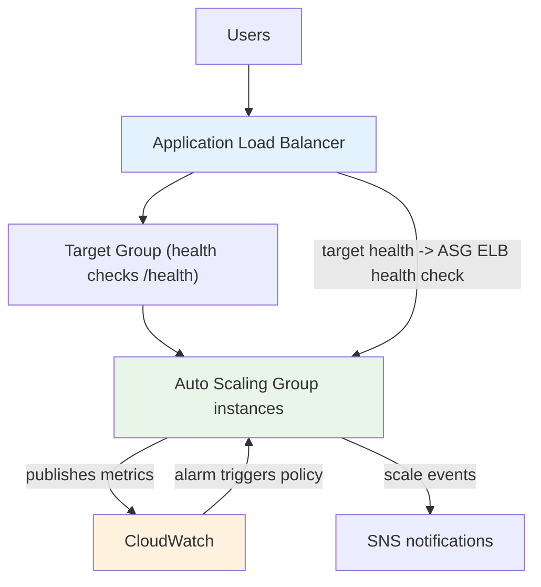
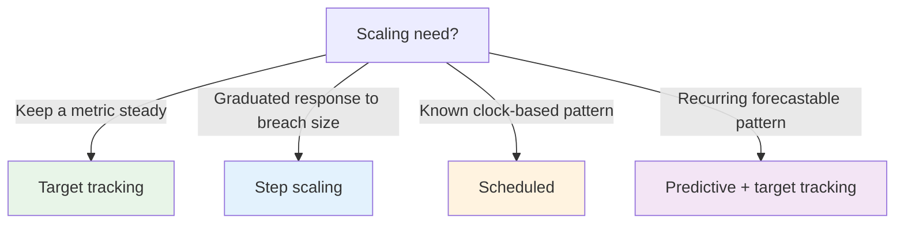
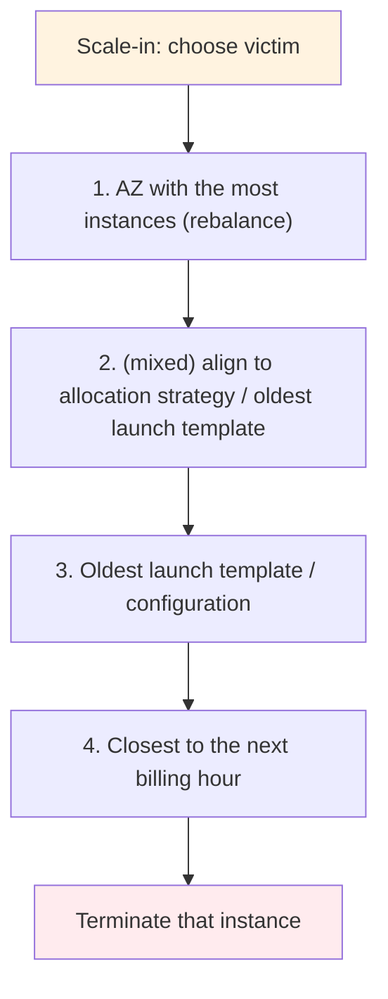
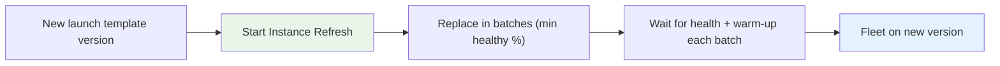

# ASG Architecture & Advanced - Deep Dive (SAA-C03)

> The internals [06 - EC2 Auto Scaling (ASG)](06%20-%20EC2%20Auto%20Scaling%20%28ASG%29.md) doesn't cover: the min/max/desired mechanics, the scaling decision flow as a mermaid pipeline, ASG + ELB + CloudWatch integration, instance refresh, termination policies, default cooldown vs instance warm-up, suspended processes, instance protection, and multi-AZ rebalancing. This is the "how does the ASG actually decide and act" file.

> **EC2 + ASG series:** [01 - EC2 Intro](01%20-%20EC2%20Intro.md) · [02 - EC2 Instance Types Deep Dive](02%20-%20EC2%20Instance%20Types%20Deep%20Dive.md) · [03 - EC2 Storage Deep Dive](03%20-%20EC2%20Storage%20Deep%20Dive.md) · [04 - EC2 Networking, Placement & Metadata Deep Dive](04%20-%20EC2%20Networking%2C%20Placement%20%26%20Metadata%20Deep%20Dive.md) · [05 - EC2 Pricing & Purchasing Options Deep Dive](05%20-%20EC2%20Pricing%20%26%20Purchasing%20Options%20Deep%20Dive.md) · [06 - EC2 Auto Scaling (ASG)](06%20-%20EC2%20Auto%20Scaling%20%28ASG%29.md) · [07 - ASG Architecture & Advanced Deep Dive](07%20-%20ASG%20Architecture%20%26%20Advanced%20Deep%20Dive.md) · [08 - EC2 & ASG Architecture Patterns & Examples](08%20-%20EC2%20%26%20ASG%20Architecture%20Patterns%20%26%20Examples.md) · [09 - EC2 & ASG Scenario Questions](09%20-%20EC2%20%26%20ASG%20Scenario%20Questions.md) · [10 - EC2 & ASG Important Facts & Cheat Sheet](10%20-%20EC2%20%26%20ASG%20Important%20Facts%20%26%20Cheat%20Sheet.md)

---

## Table of Contents

- [The ASG Building Blocks](#the-asg-building-blocks)
- [Min / Max / Desired Capacity](#min--max--desired-capacity)
- [The Scaling Decision Flow](#the-scaling-decision-flow)
- [ASG + ELB + CloudWatch Integration](#asg--elb--cloudwatch-integration)
- [Dynamic Scaling Policies Compared](#dynamic-scaling-policies-compared)
- [Cooldown vs Instance Warm-up](#cooldown-vs-instance-warm-up)
- [Termination Policies & AZ Rebalancing](#termination-policies--az-rebalancing)
- [Instance Refresh & Updating the Fleet](#instance-refresh--updating-the-fleet)
- [Instance Protection, Standby & Suspended Processes](#instance-protection-standby--suspended-processes)
- [Default vs Custom Termination Edge Cases](#default-vs-custom-termination-edge-cases)
- [Exam Triggers](#exam-triggers)

---

## The ASG Building Blocks

> **Launch templates** (not launch configurations) are required for modern features — multiple instance types, mixed Spot/On-Demand, versioning. See [06 - EC2 Auto Scaling (ASG) > 🔧 Launch Templates vs Launch Configurations (Critical for Exam)](06%20-%20EC2%20Auto%20Scaling%20%28ASG%29.md#-launch-templates-vs-launch-configurations-critical-for-exam).

[⬆ Back to top](#table-of-contents)

---

## Min / Max / Desired Capacity

- **Min** — the ASG never goes below this; it **replaces failed instances** to stay at least at min (resilience even with **no scaling policy**).
- **Desired** — the number the ASG tries to maintain right now; scaling policies adjust _desired_ (clamped between min and max).
- **Max** — the hard ceiling; scale-out stops here even if demand is higher.

> **Exam nugget:** Setting `min=2` across 2 AZs gives baseline HA with zero scaling policies — the ASG just keeps 2 healthy instances, relaunching any that fail.

[⬆ Back to top](#table-of-contents)

---

## The Scaling Decision Flow

[⬆ Back to top](#table-of-contents)

---

## ASG + ELB + CloudWatch Integration

- The ASG **registers/deregisters** instances with the ELB **target group** automatically as it scales.
- With **health-check type = ELB**, the ASG replaces instances the load balancer marks unhealthy (catches app-level failures the EC2 status check misses — see [06 - EC2 Auto Scaling (ASG) > 🩺 Health Checks - EC2 vs ELB](06%20-%20EC2%20Auto%20Scaling%20%28ASG%29.md#-health-checks---ec2-vs-elb)).
- **Target tracking** can use the ALB metric **`ALBRequestCountPerTarget`** to scale on requests-per-instance — better than CPU for request-bound web tiers.

[⬆ Back to top](#table-of-contents)

---

## Dynamic Scaling Policies Compared

| Policy              | Mechanism                                                             | When to choose                                                 |
| :------------------ | :-------------------------------------------------------------------- | :------------------------------------------------------------- |
| **Target tracking** | Keep a metric at a target (CPU 50%, `ALBRequestCountPerTarget`, etc.) | **Default** for most workloads — simplest, self-adjusting      |
| **Step scaling**    | Different capacity adjustments by alarm-breach magnitude              | Need graduated response (small breach → +1, large → +4)        |
| **Simple scaling**  | One adjustment per alarm, then cooldown                               | Legacy — avoid; replaced by step/target                        |
| **Scheduled**       | Change min/max/desired at set times                                   | **Predictable** patterns (business hours, batch windows)       |
| **Predictive**      | ML forecasts load from ≥ history, pre-scales                          | Recurring **daily/weekly** patterns; pair with target tracking |

[⬆ Back to top](#table-of-contents)

---

## Cooldown vs Instance Warm-up

| Concept                       | Applies to                     | Effect                                                                                                                 |
| :---------------------------- | :----------------------------- | :--------------------------------------------------------------------------------------------------------------------- |
| **Default cooldown**          | Simple scaling                 | After an activity, **pause** further scaling (default **300s**) so metrics stabilize                                   |
| **Instance warm-up**          | Target tracking & step scaling | New instances' metrics are **ignored until warmed up**, preventing premature scale-in/double scale-out                 |
| **Health-check grace period** | All ASGs                       | Time after launch before health checks count — set **longer than app startup** so initializing instances aren't killed |

> [!warning] Trap
> If instances are being **terminated right after launch**, the **health-check grace period** is too short (or wrong health-check type). If scaling **overshoots/thrashes**, tune **warm-up** / cooldown.

[⬆ Back to top](#table-of-contents)

---

## Termination Policies & AZ Rebalancing

When scaling in, which instance dies? Default termination policy logic:

- The ASG keeps AZs **balanced**; it prefers to terminate from the **largest AZ** and launch into the **smallest** to stay even.
- You can override with custom termination policies: `OldestInstance`, `NewestInstance`, `OldestLaunchTemplate`, `ClosestToNextInstanceHour`, `Default`.
- **`OldestInstance`** is common when rolling out a new launch template manually.

[⬆ Back to top](#table-of-contents)

---

## Instance Refresh & Updating the Fleet

To roll out a new AMI / launch template version across the ASG without downtime:

- **Instance Refresh** replaces instances in **batches**, honoring a **minimum healthy percentage** so capacity stays up.
- Supports **checkpoints** and **skip-matching** (only replace instances not already on the desired config).
- Alternatives: **rolling via CloudFormation `UpdatePolicy`**, or **blue/green** with a new ASG behind the ELB.

> **Trigger:** "deploy a new AMI to all ASG instances with no downtime" → **Instance Refresh** (or blue/green ASG).

[⬆ Back to top](#table-of-contents)

---

## Instance Protection, Standby & Suspended Processes

| Feature                 | What it does                                                                                                                   | Use case                                                  |
| :---------------------- | :----------------------------------------------------------------------------------------------------------------------------- | :-------------------------------------------------------- |
| **Scale-in protection** | Marks an instance the ASG **won't terminate** on scale-in                                                                      | Protect a node doing long work / holding state            |
| **Standby state**       | Take an instance **out of service** (kept in ASG, deregistered from ELB) for troubleshooting/patching, then return             | Debug or patch without the ASG replacing it               |
| **Suspended processes** | Pause specific ASG processes (`Launch`, `Terminate`, `HealthCheck`, `ReplaceUnhealthy`, `AZRebalance`, `AddToLoadBalancer`...) | Maintenance windows; investigate without the ASG reacting |

> **Trigger:** "stop the ASG from replacing/terminating an instance while I debug" → put it in **Standby** or enable **scale-in protection**; broader pause → **suspend processes**.

[⬆ Back to top](#table-of-contents)

---

## Default vs Custom Termination Edge Cases

- **Lifecycle hooks fire on both launch and terminate** — the only mechanism to run cleanup (drain, log upload, deregister) **before** an instance is terminated on scale-in. See [06 - EC2 Auto Scaling (ASG) > 🔄 Lifecycle Hooks - The Complete Guide](06%20-%20EC2%20Auto%20Scaling%20%28ASG%29.md#-lifecycle-hooks---the-complete-guide).
- **Warm pools** keep pre-initialized **stopped** instances so scale-out is seconds, not minutes — for long-boot apps. See [06 - EC2 Auto Scaling (ASG) > 🔥 Warm Pools - Reduce Scaling Latency](06%20-%20EC2%20Auto%20Scaling%20%28ASG%29.md#-warm-pools---reduce-scaling-latency).
- **Mixed instances policy** (launch template) blends **Spot + On-Demand** across types; use `capacity-optimized` Spot allocation to minimize interruptions. See [05 - EC2 Pricing & Purchasing Options Deep Dive > Spot Instances](05%20-%20EC2%20Pricing%20%26%20Purchasing%20Options%20Deep%20Dive.md#spot-instances).

[⬆ Back to top](#table-of-contents)

---

## Exam Triggers

| Question says...                                                | Answer                                                            |
| :-------------------------------------------------------------- | :---------------------------------------------------------------- |
| "Keep 2 instances running, replace failures, no scaling needed" | ASG with **min=desired=2** across AZs                             |
| "Scale on requests per instance, not CPU"                       | Target tracking on **`ALBRequestCountPerTarget`**                 |
| "Graduated response to breach magnitude"                        | **Step scaling**                                                  |
| "Instances killed right after launch"                           | Increase **health-check grace period** / use **ELB** health check |
| "Scaling thrashes / scales in too aggressively"                 | Tune **instance warm-up** / cooldown                              |
| "Deploy new AMI to whole ASG, no downtime"                      | **Instance Refresh** (or blue/green ASG)                          |
| "Don't terminate this instance on scale-in"                     | **Scale-in protection** / **Standby**                             |
| "Pause ASG actions during maintenance"                          | **Suspend processes**                                             |
| "Run cleanup before scale-in termination"                       | **Lifecycle hook (terminate)**                                    |
| "App takes minutes to boot, speed up scale-out"                 | **Warm pool**                                                     |
| "Balance instances evenly across AZs"                           | ASG **AZ rebalancing** (default)                                  |

> Next: [08 - EC2 & ASG Architecture Patterns & Examples](08%20-%20EC2%20%26%20ASG%20Architecture%20Patterns%20%26%20Examples.md) — full reference architectures combining everything.
